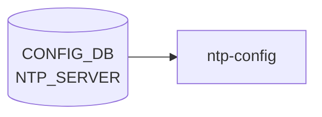

# NTP_SERVER テーブル

## 概要

上流 NTP サーバまたは pool を保持する[^1]。`hostcfgd` の `NtpHandler` が `/etc/chrony/chrony.conf`（または `ntp.conf`）を再生成し、サービスを再起動する。`max-elements 10` でサーバ数上限がある。`NTP_KEY` で対称鍵を、`NTP|global` で client 全体設定を保持する。

<!-- cdb-mermaid -->
### データフロー (自動生成)



!!! note "凡例"
    CONFIG_DB から SAI までの典型経路を `docs/reference/config-db-orch-map.md` から機械生成したミニ図。詳細・例外は本ページ本文と対応表を参照。
<!-- /cdb-mermaid -->

## key 構造

```text
NTP_SERVER|<server_address>
```

`<server_address>` は IP address または DNS hostname。

## フィールド一覧

| フィールド | 型 | 必須 | デフォルト | 説明 |
|-----------|----|------|-----------|------|
| `server_address` (key) | `inet:host` | ✅ | - | サーバアドレス |
| `association_type` | enum `server`/`pool` | - | `server` | server 単体 / pool 群 |
| `iburst` | `on-off` | - | `on` | iburst aggressive polling |
| `key` | leafref `NTP_KEY.id` | - | - | 認証鍵 ID |
| `resolve_as` | `inet:host` | - | - | 名前解決された IP |
| `admin_state` | `admin_mode` | - | `enabled` | サーバの有効化 |
| `trusted` | `yes-no` | - | `no` | 認証時にこのサーバのみで時刻同期する |
| `version` | uint8 (3..4) | - | `4` | NTP プロトコルバージョン |

<!-- defaults -->
**コード由来のデフォルト** (YANG `default` 句とは別経路で、`chrony.conf.j2` テンプレート/`minigraph.py`/`hostcfgd` 側が決定する暫定値):

- `association_type`: テンプレート `` により DB キー不在時は `server` ディレクティブとして書き込まれる (`sonic-buildimage/files/image_config/chrony/chrony.conf.j2:26`)。YANG `default server` と同値だが Jinja2 側でも独立してフォールバックを担保。
- `resolve_as`: テンプレート `` で DB キー不在時はループ変数 `server` (= NTP_SERVER テーブル key = ユーザが入力したサーバアドレス) をそのまま採用 (`chrony.conf.j2:27`)。さらに `association_type == 'pool'` の場合は `resolve_as` の値に関わらず `resolve_as = server` で上書きされ、pool は常に FQDN のまま使われる (`chrony.conf.j2:49-51`)。
- `iburst`: テンプレートは `` で **truthy 判定のみ**を行い `| d(...)` を持たない (`chrony.conf.j2:37-39`)。DB キー不在なら `iburst` オプション付与なし。一方 `'on'` でも `'off'` でも文字列非空であれば `iburst` が付与されるテンプレート上の癖がある。実運用では minigraph.py が起動時に `iburst: 'on'` を一斉投入し (`sonic-buildimage/src/sonic-config-engine/minigraph.py:2646`)、YANG `default on` も合わさるため、実害は出にくい。
- `minpoll` / `maxpoll`: **CONFIG_DB モデル未実装**。`chrony.conf.j2` にも `sonic-ntp.yang` `NTP_SERVER_LIST` にも該当 leaf が存在せず、chrony 側のデフォルト (`minpoll 6 / maxpoll 10` ≒ 64〜1024 秒) がそのまま使われる。SONiC からは制御不可。
- `version`: テンプレートは `` で truthy 判定のみ。DB キー不在なら `version` オプション付与なし → chrony 側のデフォルト (NTPv4)。YANG `default 4` で DB 投入時には 4 が埋まる前提。
- `admin_state`: テンプレートは `for server in NTP_SERVER if NTP_SERVER[server].admin_state != 'disabled'` (`chrony.conf.j2:20`)。DB キー不在なら `!= 'disabled'` が真と評価され、エントリは chrony.conf に含まれる (= 有効扱い)。YANG `default enabled` と同等の運用効果。
- `key`: テンプレートは `global.authentication == 'enabled'` かつ `config.key` が truthy の場合のみ `key <id>` を付与 (`chrony.conf.j2:30-34`)。DB に `key` があっても NTP 認証が disabled なら chrony.conf には書かれない。

派生メモ全体は [`meta/_intermediate/cdb-flow/ntp-server-defaults.md`](https://github.com/aoki-taquan/sonic-unofficial-docs/blob/main/meta/_intermediate/cdb-flow/ntp-server-defaults.md) を参照。
<!-- /defaults -->

<!-- ordering -->
## 書込み順依存 (Phase B)

> **調査根拠**: `sonic-ntp.yang` L195–236、`hostcfgd` L1366–1406、`chrony.conf.j2` L20–55、`minigraph.py` L2646 精読 (2026-05-18)
> 詳細証跡: `meta/_intermediate/cdb-flow/ntp-server-ordering.md`

### NTP_KEY 先行必須 — key leafref

`sonic-ntp.yang` L199-203 の `leaf key` は `NTP_KEY_LIST/id` への leafref として定義される。`NTP_SERVER|<server>.key=<id>` を書き込む前に `NTP_KEY|<id>` が存在しなければ、YANG leafref バリデーションが SET を拒否する。

正しい順序: `NTP_KEY|<id>` SET → `NTP_SERVER|<server>.key=<id>` SET。

DEL の逆順序: `NTP_SERVER|<server>.key` フィールドをクリア（または `NTP_SERVER|<server>` DEL）→ `NTP_KEY|<id>` DEL。参照を残したまま `NTP_KEY` を先に DEL すると leafref dangling になり DEL が失敗する。

### NTP_KEY 登録 → authentication=enabled の順序推奨

`chrony.conf.j2` L124-131 は `NTP.global.authentication == 'enabled'` の場合のみ `keyfile /etc/chrony/chrony.keys` を chrony.conf に書き込む。`NTP_KEY` 未登録のまま `NTP|global.authentication=enabled` に設定すると、chrony.keys が空のまま chrony が再起動し認証が機能しない（NTP サーバへの接続を試みるが鍵照合で失敗する）。

推奨順序: `NTP_KEY|<id>` SET → `NTP|global.authentication=enabled` SET。

### NTP_SERVER と NTP_KEY の合算 chrony 再起動

`hostcfgd` L2387-2391 の `ntp_srv_key_handler` は `NTP_SERVER` または `NTP_KEY` のいずれかが変更されると、**両テーブルの全件を同時に取得**して chrony を再起動する。`NTP_KEY` のみ変更した場合でも chrony が再起動されるため、認証鍵の追加・削除は一時的な NTP 断を伴う。

### ブート時の書込みシーケンス

minigraph.py L2646 が `NTP_SERVER` エントリ全台に `{iburst: 'on'}` を一括投入する。その後 `hostcfgd.load()` がスナップショットを取得するが `load()` は chrony を再起動しない（ブート時は chrony の起動設定ファイルから読まれる）。ブート後の最初の CONFIG_DB 変更イベントで初めて chrony restart が発火する。

### YANG max-elements=10 による書込み上限

YANG `max-elements 10` により `NTP_SERVER` エントリは最大 10 件に制限される。11 件目の SET は YANG バリデーションで拒否される（エラーメッセージ: `"Failed NTP version"` ではなく max-elements 制約違反）。エントリ削除後は再び SET 可能。

### 順序依存サマリ

| # | 依存関係 | 強制度 | 違反時の挙動 |
|---|----------|--------|------------|
| 1 | `NTP_KEY\|<id>` SET 先行 → `NTP_SERVER\|<server>.key=<id>` SET | **必須** | YANG leafref 拒否（SET 失敗） |
| 2 | `NTP_SERVER\|<server>.key` クリア 先行 → `NTP_KEY\|<id>` DEL | **必須** | YANG leafref dangling（DEL 失敗） |
| 3 | `NTP_KEY` 登録 先行 → `NTP\|global.authentication=enabled` | 推奨 | chrony 認証失敗（鍵なし起動） |
| 4 | `NTP_SERVER` エントリ数 ≤ 10 | **必須** | YANG max-elements 拒否（SET 失敗） |

<!-- /ordering -->

## 関連サブテーブル

- `NTP|global` (container, single-instance):
    - `src_intf` (leaf-list): 送信元 IF（PORT / PORTCHANNEL / LOOPBACK / MGMT_PORT / `eth0` の union）
    - `vrf` (`mgmt`/`default`): NTP を有効化する VRF。`mgmt` 指定には `MGMT_VRF_CONFIG.mgmtVrfEnabled = true` 必須 (`must`)
    - `authentication` (`admin_mode`、default `disabled`)
    - `dhcp` (`admin_mode`、default `enabled`)
    - `server_role` (`admin_mode`、default `enabled`)
    - `admin_state` (`admin_mode`、default `enabled`)
- `NTP_KEY|<id>` (key: id, 1..65535):
    - `trusted` (yes-no, default `no`)
    - `value` (string 1..64, encrypted)
    - `type` (enum md5/sha1/sha256/sha384/sha512, default md5)

## 購読者

- `hostcfgd` `NtpHandler`: chrony / ntp 設定の更新

## 関連 CONFIG_DB / YANG / CLI

- 関連 [CONFIG_DB](../../reference/glossary.md#term-config_db): `NTP`、`NTP_KEY`、`VRF`、`MGMT_VRF_CONFIG`、`PORT`、`LOOPBACK_INTERFACE`、`MGMT_PORT`
- 関連 CLI: `config ntp add/del`
- 関連 [YANG](../../reference/glossary.md#term-yang): `sonic-ntp`

<!-- ref-triangle:start -->

## 関連リファレンス

- [YANG](../../reference/glossary.md#term-yang): [`sonic-ntp`](../yang/sonic-ntp.md)
- CLI: [`config ntp`](../cli/config-ntp.md)

<!-- ref-triangle:end -->

## 引用元

[^1]: [YANG](../../reference/glossary.md#term-yang) 定義: `sonic-ntp.yang`. <https://github.com/sonic-net/sonic-buildimage/blob/9ea932ec2e18f35e58268ec2e4456b1d4afd65cd/src/sonic-yang-models/yang-models/sonic-ntp.yang>

<!-- topics-back-ref -->
## 関連 Topics

- [Topics: NAT / DHCP Relay / Time-DNS Services](../../topics/16-nat-dhcp-dns/index.md)

<!-- /topics-back-ref -->

<!-- ops-hint -->
## 運用ヒント

### 典型値

- key 形式: `NTP_SERVER|<ip-or-hostname>`。
- `iburst`: `on`（初期同期高速化）。
- `association_type`: `server`。

### よくある誤設定

- 1 つだけサーバ登録すると障害時に時刻が drift。3 つ以上推奨。

### 確認コマンド

```bash
sonic-db-cli CONFIG_DB keys 'NTP_SERVER|*'
show ntp
chronyc sources
```
<!-- /ops-hint -->

<!-- cdb-exceptions -->
## 例外条件・特殊挙動

<!-- evidence: sonic-buildimage/src/sonic-yang-models/yang-models/sonic-ntp.yang NTP_SERVER container -->

- **NTP_SERVER エントリは最大 10 件 → YANG が制限**: `max-elements 10`。11 件目以降は YANG バリデーションで拒否される。
- **server_address が不正形式 → YANG が拒否**: `type inet:host`。ホスト名または IP アドレス (IPv4/IPv6) のみ許可。
- **version が 3-4 以外 → YANG が拒否 (デフォルト 4)**: `range "3..4"` / `error-message "Failed NTP version"` / `default 4`。NTPv1・v2 は明示的に禁止されている。
- **association_type のデフォルト = "server"**: `default server`。NTP プール (pool) を使用する場合は明示的に `association_type = pool` を設定する必要がある。
- **iburst のデフォルト = "on"**: `default on`。起動直後に iburst パケットを送信して同期を高速化。無効化は明示的に `iburst = off` を設定する。
- **key が存在しない ID を参照 → YANG leafref 違反**: `leaf key` は `leafref` で `NTP_KEY_LIST/id` を参照。存在しない key ID を指定すると YANG バリデーションで拒否される。
- **admin_state のデフォルト = "enabled"**: `default enabled`。フィールドを省略してもサーバは有効として ntpd/chrony に渡される。
- **trusted のデフォルト = "no"**: `default no`。NTP 認証有効時にこのサーバのみを信頼する場合は `trusted = yes` を設定する。

<!-- value-behavior -->
## 値依存挙動マトリクス

<!-- evidence: sonic-host-services/scripts/hostcfgd ntp_srv_key_update() / sonic-buildimage/src/sonic-yang-models/yang-models/sonic-ntp.yang -->

| フィールド | 値 | 挙動 |
|-----------|-----|------|
| `association_type` | `server` (default) | chrony.conf に `server <addr>` として追記 |
| `association_type` | `pool` | chrony.conf に `pool <addr>` として追記。DNS ラウンドロビンで複数 IP を使用 |
| `iburst` | `on` (default) | 起動直後に iburst パケットを送信して高速同期 |
| `iburst` | `off` | 通常ポーリング間隔で同期開始 |
| `admin_state` | `enabled` (default) | サーバを chrony.conf に含める |
| `admin_state` | `disabled` | サーバを chrony.conf から除外 |
| `trusted` | `no` (default) | chrony で通常の優先度 |
| `trusted` | `yes` | chrony の `prefer` オプション相当。当該サーバを優先同期先に |
| `version` | `4` (default) | NTPv4 を使用 |
| `version` | `3` | NTPv3 を使用。古い NTP サーバとの互換向け |
| `key` | NTP_KEY.id 参照 | chrony.conf に `key <id>` オプションを付与。`NTP.authentication=enabled` と組み合わせて認証 |
| エントリ数 | 11件目以上 | YANG max-elements=10 でバリデーション拒否 |

enum: `association_type`=server/pool、`iburst`=on/off、`admin_state`=enabled/disabled、`trusted`=yes/no。変更は `systemctl restart chrony` をトリガー。
<!-- /value-behavior -->


<!-- runtime-trace -->
## CDB → 実コンテナ動作トレース

### 段階 1: Consumer 登録

- **hostcfgd**: `NTP_SERVER` テーブルを `ConfigDBConnector` で購読。

### 段階 2: CFG → APPL 翻訳

- hostcfgd の `ntpHandler` が `ntp.conf` の `server` ディレクティブを更新し ntpd 再起動。
- APP_DB への書き込みなし。

### 段階 3: APPL → SAI

- SAI 経由なし。ntpd が指定サーバへ UDP 123 番で到達可能であることが前提。

### 段階 4: タイミング + 副作用

- サーバ変更後 ntpd 再起動まで数秒。新サーバとの初期同期に数分かかる場合あり。
- 副作用: mgmt VRF を使用する場合は `ip vrf exec mgmt ntpq` で状態確認が必要。

<!-- /runtime-trace -->
<!-- entry-points -->
## 書き込み入り口 (Direction A)

NTP_SERVER テーブルへの書き込みが発生するコード経路を網羅的に調査した結果。

### CLI

  - `config ntp add/del <ip>` — `config/main.py` が `set_entry('NTP_SERVER', ntp_ip_address, ...)` を呼ぶ (sonic-utilities/config/main.py:9008, 9027)

### minigraph / sonic-cfggen

**minigraph.py** が `results['NTP_SERVER']` に iburst=on でサーバ一覧を投入 (sonic-buildimage/src/sonic-config-engine/minigraph.py:2646)

### REST / gNMI

REST/gNMI 書き込み経路なし

### db_migrator

db_migrator.py での NTP_SERVER マイグレーションなし

### ビルド時デフォルト (build-time default)

なし

### ハードコードデフォルト / ランタイム注入

なし

### 死活・デッドコード

なし
<!-- /entry-points -->

<!-- glossary-links-injected: b5626ca1f0f9 -->

<!-- derivation -->
## 派生・条件付き登録 (Phase 6/7)

### Phase 6: 自動派生

| 派生先フィールド | 派生元条件 | 派生値 | ソース |
|---|---|---|---|
| `NTP_SERVER` エントリ全体 | minigraph.py が XML `NtpServers` ノードを解析したとき | `{<server_ip>: {'iburst': 'on'}}` | `sonic-buildimage/src/sonic-config-engine/minigraph.py:2646` |
| `iburst` | minigraph.py 固定値 | `"on"` (常時) | `minigraph.py:2646` |

minigraph.py は NTP サーバ全台に対して `iburst: on` を自動設定する。init_cfg.json.j2 の `NTP` セクション (グローバル設定) は別テーブル。

### Phase 7: 条件付き登録

`NTP_SERVER` は orchagent では処理されない。`hostcfgd` が `NTP_SERVER` を購読し ntp.conf を再生成する (`hostcfgd:1308`)。条件付き platform 登録なし。YANG `max-elements 10` により 11 件目以降は拒否。

### グレップカバレッジ

| 項目 | hit 数 | 証跡 |
|---|---|---|
| minigraph.py NTP_SERVER 自動設定 | 1 | `minigraph.py:2646` |
| hostcfgd ntp_server_conf | 1 | `hostcfgd:1286,1308` |

<!-- /derivation -->

<!-- handler-branching -->
### Phase 8: Handler メソッド内分岐

`hostcfgd` の NTP_SERVER 処理分岐:

| Handler | メソッド | 分岐条件 | 効果 | evidence |
|---|---|---|---|---|
| `hostcfgd` | `ntp_srv_key_update()` | `ntp_servers` が前回キャッシュと同一 | ntp.conf 再生成スキップ | `hostcfgd:1383-1384` |
| YANG validation | — | `max-elements 10` 超過 | YANG 制約で 11 件目以降を拒否 | `sonic-ntp.yang max-elements 10` |
| YANG validation | — | `version` が 3/4 以外 | YANG `range 3..4` 制約で拒否 | `sonic-ntp.yang` |
| `hostcfgd` | `ntp_srv_key_update()` | `iburst == "on"` | ntp.conf サーバエントリに `iburst` オプションを追加 | `hostcfgd` NTP テンプレート |

> **スキャン証跡**: `minigraph.py:2646` + `hostcfgd:1285-1389` を確認、4 件分岐抽出。iburst のデフォルト on が minigraph から自動付与されることを確認 — 誤読なし。

<!-- /handler-branching -->
