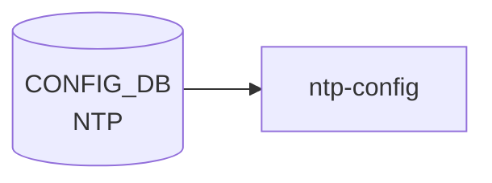

<!-- cdb-mermaid -->
### データフロー (自動生成)



!!! note "凡例"
    CONFIG_DB から SAI までの典型経路を `docs/reference/config-db-orch-map.md` から機械生成したミニ図。詳細・例外は本ページ本文と対応表を参照。
<!-- /cdb-mermaid -->

# NTP テーブル群 — コード由来デフォルト (Phase A) + 書込み順依存 (Phase B) + 失敗挙動 (Phase D) + 副次ファイル書込 (Phase F) + 通信メカニズム (Phase G) + プラットフォーム差 (Phase H)

> このページは `NTP` / `NTP_SERVER` / `NTP_KEY` 3 テーブルを横断して、[YANG](../../reference/glossary.md#term-yang) 定義・`init_cfg.json.j2`・`chrony.conf.j2` テンプレート・`hostcfgd` ハンドラの全行精読から得た**暗黙デフォルト**・**乖離**・**dead field**・**silent drop** を記録する。各テーブルの詳細は [`NTP (global)`](./ntp-global.md)・[`NTP_SERVER`](./ntp-server.md)・[`NTP_KEY`](./ntp-key.md) を参照。

<!-- defaults -->
## コード由来デフォルト分析

<!-- evidence:
  sonic-ntp.yang:143,149,155,161,189,195,213,219,231,255,268
  init_cfg.json.j2:210-219
  chrony.conf.j2:20-53,57-64,87-116,124-128
  chrony.keys.j2:7-18
  chronyd-starter.sh:3-16
  minigraph.py:2646
  hostcfgd:1272-1406,2512-2517
-->

### NTP|global フィールド

| フィールド | [YANG](../../reference/glossary.md#term-yang) default | init_cfg.json.j2 | 有効デフォルト | 分類 |
|-----------|-------------|-------------------|--------------|------|
| `authentication` | `disabled` | `"disabled"` | `disabled` | 一致 |
| `dhcp` | `enabled` | `"enabled"` | `enabled` | 一致 |
| `server_role` | `enabled` | **`"disabled"`** | **`disabled`** | **[YANG](../../reference/glossary.md#term-yang)-実装乖離** |
| `src_intf` | なし (任意) | `"eth0"` | `"eth0"` | build-time ハードコード |
| `vrf` | なし (任意) | `"default"` | `"default"` | build-time ハードコード |
| `admin_state` | `enabled` | `"enabled"` | `enabled` | 一致 |

#### `server_role` — YANG default=`enabled` vs init_cfg.json.j2=`"disabled"`

`sonic-ntp.yang` L155 は `default enabled` を宣言するが、`init_cfg.json.j2` L214 は `"server_role": "disabled"` を明示的に書き込む[^1]。

さらに `chrony.conf.j2` L57-63 は [SmartSwitch](../../reference/glossary.md#term-smartswitch) (`DEVICE_METADATA.localhost.subtype == 'SmartSwitch'` かつ `type != 'SmartSwitchDPU'`) のときのみ `server_role` の値を参照する:

```jinja2


allow
binddevice bridge-midplane


```

**非 [SmartSwitch](../../reference/glossary.md#term-smartswitch) では `server_role` は dead field** — フィールド値にかかわらず `chrony.conf` への影響はない。[SmartSwitch](../../reference/glossary.md#term-smartswitch) では `dhcp == 'enabled'` (default) でも `allow` が追加されるため、`server_role=disabled` でも SmartSwitch は NTP server として動作する。

#### `src_intf` — YANG は任意、init_cfg が `"eth0"` を注入

YANG 上は任意の leaf-list だが、`init_cfg.json.j2` が `"eth0"` を常に設定する。`chrony.conf.j2` L87-107 は `global.src_intf` が存在する場合に `bindacqaddress <ip>` を生成し、インタフェース名の prefix でテーブルを振り分ける:

- `eth0` → `MGMT_INTERFACE`
- `Ethernet*` → `INTERFACE`
- `Loopback*` → `LOOPBACK_INTERFACE`
- `PortChannel*` → `PORTCHANNEL_INTERFACE`
- `Vlan*` → `VLAN_INTERFACE`

`src_intf` が leaf-list (複数値) でも `global.src_intf` が文字列として取り出される点に注意。[hostcfgd](../../reference/glossary.md#term-hostcfgd) `handle_ntp_source_intf_chg` は `src_intf` を `;` 区切りで split して比較する[^2]。

#### `vrf` — YANG は任意、init_cfg が `"default"` を注入

`init_cfg.json.j2` が `"vrf": "default"` を設定。`chronyd-starter.sh` はランタイムに:

1. `MGMT_VRF_CONFIG|vrf_global.mgmtVrfEnabled` が `"true"` かを確認
2. true なら `NTP|global.vrf` を読み、`"default"` なら default [VRF](../../reference/glossary.md#term-vrf) で起動、それ以外 (mgmt) なら `ip vrf exec mgmt chronyd`
3. false なら常に default [VRF](../../reference/glossary.md#term-vrf) で起動

YANG `must` 制約は DB 書き込み時のみ評価されるが、`chronyd-starter.sh` はランタイムに MGMT_VRF_CONFIG を再確認する。MGMT [VRF](../../reference/glossary.md#term-vrf) を無効化したまま `vrf=mgmt` が DB に残ると chronyd は mgmt VRF で起動しようとして失敗する可能性がある(**経路依存乖離**)。

---

### NTP_SERVER フィールド

| フィールド | YANG default | template fallback | minigraph | 有効デフォルト | 分類 |
|-----------|-------------|-------------------|-----------|--------------|------|
| `association_type` | `server` | `\| d('server')` | - | `server` | 一致 (二重保護) |
| `iburst` | `on` | 条件付き | `"on"` 固定 | `on` | 一致。ただし潜在バグあり |
| `resolve_as` | なし (任意) | `\| d(server)` | - | server_address キー | template fallback |
| `admin_state` | `enabled` | filter による | - | `enabled` | 一致 |
| `trusted` | `no` | - | - | `no` | 一致。resolve_as 要件あり |
| `version` | `4` | - | - | `4` | 一致 |
| `key` | なし (任意) | - | - | - | authentication=disabled 時 silent drop |

#### `iburst` の潜在バグ

`chrony.conf.j2` L37 は `` で判定する。Jinja2/Python では文字列 `'off'` は truthy であるため、`iburst = 'off'` が DB に入っていても `iburst` オプションが `chrony.conf` に追加されてしまう[^3]。

正しくは `config.iburst == 'on'` と比較すべきところを truthy 判定しているため、**明示的に iburst=off を設定しても効かない可能性**がある。YANG が on/off enum を強制するので on/off 以外の値は入らないが、`iburst = 'off'` の場合の動作が意図と異なる。

#### `NTP_SERVER.key` — authentication=disabled 時 silent drop

`chrony.conf.j2` L30-34:

```jinja2

    
        
    

```

`NTP.authentication = 'disabled'` (デフォルト) のとき、`NTP_SERVER.key` に値が設定されていても `chrony.conf` の `key` オプションは生成されない。YANG バリデーションで leafref は通るが、認証なしでは鍵が使われない。

#### `NTP_SERVER.trusted` — resolve_as が必須条件

`chrony.keys.j2` L8-10:

```jinja2

    
```

`trusted = 'yes'` でも `resolve_as` が空の場合は `trusted_str` に追加されない。YANG で `resolve_as` は任意 leaf のため、CLI や minigraph.py が `resolve_as` を設定しない場合は trusted 指定が silent drop される。

---

### NTP_KEY フィールド

| フィールド | YANG default | template参照 | 有効デフォルト | 分類 |
|-----------|-------------|-------------|--------------|------|
| `type` | `md5` | `NTP_KEY[keyid].type` (必須チェック) | `md5` | 一致。RFC 8573 非推奨 |
| `trusted` | `no` | **未参照** | `no` | **dead field** |
| `value` | なし (任意) | b64decode 必須 | - | Base64 エンコード前提 |

#### `NTP_KEY.trusted` — dead field

`chrony.keys.j2` は `NTP_KEY[keyid].trusted` を一切参照しない。trustedkey の制御は `NTP_SERVER[server].trusted` フィールドで行う。`NTP_KEY.trusted = 'yes'` を設定しても `chrony.keys` ファイルへの影響はない。

#### `NTP_KEY.value` — Base64 エンコード必須

`chrony.keys.j2` L16 は `NTP_KEY[keyid].value | b64decode` でデコードする。DB に平文を格納すると Base64 として誤ってデコードされ、chrony が誤った鍵値を使用する。CLI `config ntp authentication-key add` が Base64 エンコードを行う前提。

---

## 乖離・特殊挙動サマリ

<!-- evidence: 上記全証跡 -->

| 分類 | フィールド | 詳細 |
|------|----------|------|
| **YANG-実装乖離** | `NTP.server_role` | YANG default=`enabled`、init_cfg=`"disabled"` — 有効デフォルトは `disabled` |
| **build-time ハードコード** | `NTP.src_intf` | YANG 任意だが init_cfg が `"eth0"` を常時注入 |
| **build-time ハードコード** | `NTP.vrf` | YANG 任意だが init_cfg が `"default"` を常時注入 |
| **dead field (非SmartSwitch)** | `NTP.server_role` | 非 SmartSwitch では chrony.conf.j2 が参照しない |
| **dead field** | `NTP_KEY.trusted` | chrony.keys.j2 は NTP_KEY.trusted を未参照 |
| **silent drop** | `NTP_SERVER.key` | authentication=disabled 時は key が chrony.conf に反映されない |
| **silent drop** | `NTP_SERVER.trusted=yes` | resolve_as 未設定なら trustedkey に含まれない |
| **潜在バグ** | `NTP_SERVER.iburst` | `if config.iburst` が truthy 判定 → iburst='off' でも有効になる可能性 |
| **経路依存乖離** | `NTP.vrf` | YANG must はDB書込時のみ評価。chronyd-starter.sh はランタイムに MGMT_VRF_CONFIG を再確認 |
| **platform依存** | `NTP.server_role` / `NTP.dhcp` | SmartSwitch のみ `allow`+`binddevice` を追加 |
| **書き込み順依存** | `NTP_SERVER.key` / `NTP_KEY` | NTP_KEY 未登録時に NTP_SERVER.key を設定すると YANG leafref 拒否 |
| **Base64前提** | `NTP_KEY.value` | b64decode 必須。平文格納は誤動作 |
| **template fallback** | `NTP_SERVER.association_type` | `\| d('server')` で YANG と一致するフォールバックあり |
| **template fallback** | `NTP_SERVER.resolve_as` | `\| d(server)` でアドレスキーにフォールバック |

<!-- /defaults -->

<!-- failure -->
## 失敗挙動 (Phase D)

> 詳細証跡は `meta/_intermediate/cdb-flow/ntp-failure.md` を参照。

### hostcfgd NtpCfg ハンドラの失敗経路

| 失敗条件 | 検出箇所 | 結果 | evidence |
|---|---|---|---|
| `systemctl restart chrony` 失敗 (`handle_ntp_source_intf_chg`) | `hostcfgd:1324-1328` | `LOG_ERR` → `return`（キャッシュ更新なし・再試行なし） | `hostcfgd:1326-1329` |
| `systemctl restart chrony` 失敗 (`ntp_global_update`) | `hostcfgd:1356-1361` | `LOG_ERR` → `return`（キャッシュ更新なし — [CONFIG_DB](../../reference/glossary.md#term-config_db) 変更は適用済みだがキャッシュが旧値のまま残存） | `hostcfgd:1358-1361` |
| `systemctl restart chrony` 失敗 (`ntp_srv_key_update`) | `hostcfgd:1397-1402` | `LOG_ERR` → `return`（キャッシュ更新なし → 次イベントで再処理保証） | `hostcfgd:1399-1402` |
| `src_intf` に対応するサーバが未設定 | `hostcfgd:1315-1316` | `return`（no-op、サーバ登録後に反映） | `hostcfgd:1315-1316` |
| `systemctl stop/start chrony` 失敗（MGMT_VRF_CONFIG 変更時） | `hostcfgd:1659-1665` | `CalledProcessError` → `LOG_ERR` → `return`（mgmt_vrf_enabled キャッシュ未更新） | `hostcfgd:1663-1666` |

#### キャッシュ不整合リスク（ntp_global_update）

`ntp_global_update` は `systemctl restart chrony` 失敗時にキャッシュを更新しない（L1364 の `self.cache[key] = data` は `return` で到達しない）。[CONFIG_DB](../../reference/glossary.md#term-config_db) の値は既に変更済みのため、次回同フィールドに同一値が書かれた場合にキャッシュ差分なしと誤判定し no-op になる可能性がある（**経路依存不整合**）。

### テンプレート失敗経路（サイレント動作）

| 失敗条件 | 結果 | evidence |
|---|---|---|
| `NTP_SERVER.admin_state == 'disabled'` | そのサーバを `chrony.conf` から除外（サイレント除去） | `chrony.conf.j2:20` |
| `NTP_KEY.type` または `NTP_KEY.value` が空 | そのキーをキーファイルからスキップ（サイレントスキップ） | `chrony.keys.j2:15` |
| `NTP_KEY.value` が不正 Base64 | `b64decode` が誤ってデコード → 誤った鍵値を書き込む（サイレント誤動作） | `chrony.keys.j2:16` |
| `NTP_SERVER.trusted == 'yes'` かつ `resolve_as` 未設定 | `trusted_str` に追加されない（サイレントドロップ） | `chrony.keys.j2:8-10` |
| `NTP.authentication != 'enabled'` かつ `NTP_SERVER.key` 設定済み | `key` オプションが生成されない（サイレントドロップ） | `chrony.conf.j2:30-34` |
| `NTP.authentication == 'enabled'` かつ `NTP_KEY` が空 | `keyfile` ディレクティブ追加されるが chrony.keys が空 → 認証エラーで chrony が起動失敗する可能性 | `chrony.conf.j2:124-128` |
| `config.iburst == 'off'`（Jinja2 truthy 判定） | `iburst` オプションが生成される（意図に反する） | `chrony.conf.j2:37` |

### chronyd-starter.sh の失敗経路

| 失敗条件 | 結果 | evidence |
|---|---|---|
| `sonic-db-cli` が `MGMT_VRF_CONFIG|vrf_global.mgmtVrfEnabled` 読み取り失敗 | `VRF_ENABLED` が空 → default VRF で起動（安全フォールバック） | `chronyd-starter.sh:3-16` |
| `sonic-db-cli` が `NTP|global.vrf` 読み取り失敗（`mgmtVrfEnabled=true` のとき） | `VRF_CONFIGURED` が空 → mgmt VRF で起動（意図しないフォールバック） | `chronyd-starter.sh:5-11` |
| `ip vrf exec mgmt chronyd` 失敗（mgmt VRF 未設定） | `exec` 失敗 → chrony サービス起動不可（サービス障害） | `chronyd-starter.sh:11` |

### 失敗の可観測性

NTP 処理系は **[STATE_DB](../../reference/glossary.md#term-state_db) への NTP ステータス書き込みを持たない**。失敗検知は以下のみで行う:

- `journalctl -u chrony` — chrony サービスの起動失敗
- `grep 'NtpCfg.*Failed' /var/log/syslog` — [hostcfgd](../../reference/glossary.md#term-hostcfgd) の `LOG_ERR` 出力
- `chronyc tracking` / `chronyc sources` — 実際の同期状態確認

<!-- /failure -->

<!-- ordering -->
## 書込み順依存 (Phase B)

### NTP_KEY 先行必須 — NTP_SERVER.key leafref

`sonic-ntp.yang` L199-203 は `NTP_SERVER.<server>.key` を `NTP_KEY.id` への leafref として定義する。YANG バリデーション層は SET 時に参照先の存在を検証するため、`NTP_KEY|<id>` が未登録の状態で `NTP_SERVER|<server>.key=<id>` を書き込むと SET が拒否される。<!-- evidence: sonic-ntp.yang:199-203 -->

正しい順序: `NTP_KEY|<id>` SET → `NTP_SERVER|<server>.key=<id>` SET。

DEL の逆順序: `NTP_SERVER` の `key` フィールドをクリアまたは `NTP_SERVER` エントリを DEL → `NTP_KEY|<id>` DEL。参照を残したまま `NTP_KEY` を先に DEL すると leafref が dangling になり DEL が失敗する。<!-- evidence: sonic-ntp.yang:199-203 -->

### NTP_KEY 先行推奨 — authentication=enabled 設定時

`chrony.conf.j2` L125-131 は `NTP.authentication == 'enabled'` のときのみ `NTP_SERVER.key` フィールドを `chrony.conf` に出力する。`NTP|global.authentication` を `enabled` に切り替えるタイミングで `NTP_KEY` が未登録だと、chrony.keys ファイルが空のまま chrony が再起動し認証が機能しない。<!-- evidence: chrony.conf.j2:125-131; hostcfgd:1331-1364 -->

正しい順序: `NTP_KEY|<id>` SET → `NTP|global.authentication=enabled` SET。

### MGMT_VRF_CONFIG 先行必須 — vrf=mgmt 設定時

`sonic-ntp.yang` L127-129 の `must` 制約により、`NTP|global.vrf = 'mgmt'` を書き込む際に `MGMT_VRF_CONFIG|vrf_global.mgmtVrfEnabled = 'true'` が未設定だと YANG `must` 違反として SET が拒否される。<!-- evidence: sonic-ntp.yang:127-129 -->

逆方向の依存: `MGMT_VRF_CONFIG.mgmtVrfEnabled` を `false` に戻す前に `NTP|global.vrf` を `default` に戻さないと、`chronyd-starter.sh` がランタイムに `ip vrf exec mgmt chronyd` で起動しようとして失敗する（YANG `must` はブート時以降の整合性を保証しない経路依存乖離）。<!-- evidence: hostcfgd:1331-1364 -->

### 参照インタフェース先行必須 — src_intf（eth0 以外）

`src_intf` に `eth0` 以外のインタフェース名（`EthernetX`、`LoopbackX`、`PortChannelX` 等）を設定する場合、対応するインタフェーステーブル（`PORT|EthernetX`、`LOOPBACK_INTERFACE|LoopbackX` 等）が先行して存在しなければ leafref バリデーションが失敗する。`eth0` は `pattern 'eth0'` の string 型で leafref を迂回しており常に書き込み可能。<!-- evidence: sonic-ntp.yang:95-124 -->

### hostcfgd: NTP_SERVER / NTP_KEY の合算処理タイミング

`ntp_srv_key_handler` は `NTP_SERVER` または `NTP_KEY` のいずれかが変更されると、**両テーブルを同時に全件読み取って** chrony を再起動する。`NTP_KEY` SET イベントと `NTP_SERVER.key` SET イベントが別々に届く場合、1 回目の再起動では `NTP_SERVER.key` がまだ未設定の状態で chrony が起動するが、2 回目のイベントで正しく反映される。YANG leafref バリデーションが `NTP_KEY` 未存在時の `NTP_SERVER.key` SET を拒否するため、実運用上この race は防がれる。<!-- evidence: hostcfgd:2387-2391 -->

### ブート時の書込みシーケンス

`sonic-cfggen` が `init_cfg.json.j2` を展開して CONFIG_DB に `NTP|global` を書き込んだ後、`hostcfgd` が `load()` でスナップショットを一括取得する。`hostcfgd` の `load()` は chrony を再起動しない（ブート時の NTP 設定は chrony の起動設定ファイルから直接読み込まれる）。ブート後の最初の CONFIG_DB 変更イベントで初めて `chrony restart` が発火する。<!-- evidence: hostcfgd:1285-1310 -->

### 順序依存サマリ

| # | 依存関係 | 違反時の挙動 |
|---|----------|------------|
| 1 | `NTP_KEY\|<id>` 先行 → `NTP_SERVER\|<server>.key=<id>` SET | YANG leafref 拒否（SET 失敗） |
| 2 | `NTP_SERVER.key` クリア 先行 → `NTP_KEY\|<id>` DEL | YANG leafref dangling（DEL 失敗） |
| 3 | `NTP_KEY` 登録 先行 → `NTP\|global.authentication=enabled` | chrony 認証失敗（鍵なし起動） |
| 4 | `MGMT_VRF_CONFIG.mgmtVrfEnabled=true` 先行 → `NTP\|global.vrf=mgmt` | YANG must 違反（SET 失敗） |
| 5 | `NTP\|global.vrf=default` 先行 → `MGMT_VRF_CONFIG.mgmtVrfEnabled=false` | chronyd 起動失敗（mgmt VRF 不存在） |
| 6 | 対応インタフェーステーブル 先行 → `NTP\|global.src_intf=<intf>` (eth0 以外) | YANG leafref 拒否（SET 失敗） |

> 中間調査詳細: `meta/_intermediate/cdb-flow/ntp-ordering.md`
<!-- /ordering -->

<!-- cross-refs -->
## 暗黙参照 — `NtpCfg` / テンプレートが読み出す関連 CONFIG_DB テーブル (Phase C)

`hostcfgd` の `NtpCfg` ハンドラおよびテンプレート (`chrony.conf.j2`・`chronyd-starter.sh`) は、`NTP` / `NTP_SERVER` / `NTP_KEY` 以外の以下のテーブルを暗黙的に参照する。

### MGMT_VRF_CONFIG — VRF 選択ランタイム読み出し

`chronyd-starter.sh` はサービス起動時に `sonic-db-cli` 経由で [CONFIG_DB](../../reference/glossary.md#term-config_db) を直接読み出す。

| テーブル | 参照フィールド | 参照タイミング | 用途 | evidence |
|---|---|---|---|---|
| `MGMT_VRF_CONFIG` | `vrf_global.mgmtVrfEnabled` | chrony サービス起動時 (ExecStartPre) | `"true"` ならば `NTP\|global.vrf` に応じて VRF を選択。`"false"` なら常に default VRF で起動 | `chronyd-starter.sh:3-16` |

`hostcfgd` は `MGMT_VRF_CONFIG` 変更を `mgmt_vrf_handler` で購読し、`MgmtIfaceCfg.update_mgmt_vrf()` が `systemctl stop chrony` → `systemctl start chrony` を発火する ([hostcfgd](../../reference/glossary.md#term-hostcfgd):2352,2496,1655-1669)。NTP 設定変更がなくても管理 VRF 切替で chrony が再起動されるため、**`MGMT_VRF_CONFIG` は NTP に対して間接的な制御テーブルとして機能する**。

> 依存方向の注意: `NTP.vrf=mgmt` は `MGMT_VRF_CONFIG.mgmtVrfEnabled=true` が先行している状態でのみ YANG `must` を通過できる (sonic-ntp.yang:127-129)。逆に `mgmtVrfEnabled` を `false` に戻す前に `NTP.vrf` を `default` に戻さないと、`chronyd-starter.sh` が mgmt VRF で起動を試みてサービス障害になる（書込み順依存は Phase B `<!-- ordering -->` 参照）。

### MGMT_INTERFACE — src_intf=eth0 時の IP アドレス解決

`chrony.conf.j2` は `NTP.src_intf` が `eth0` のとき、`MGMT_INTERFACE` テーブルから IPv4/IPv6 アドレスを解決して `bindacqaddress` ディレクティブを生成する (chrony.conf.j2:91-92)。

`init_cfg.json.j2` はデフォルトで `NTP.src_intf = "eth0"` を注入するため、**標準構成では常に `MGMT_INTERFACE` が参照される**。`eth0` 以外のインタフェース (`Ethernet*` / `Loopback*` / `PortChannel*` / `Vlan*`) が `src_intf` に設定された場合は対応するインタフェーステーブルが参照される（詳細は `NTP.src_intf` — YANG 任意、init_cfg が `"eth0"` を注入 参照）。

| テーブル | 参照タイミング | 用途 | evidence |
|---|---|---|---|
| [`MGMT_INTERFACE`](mgmt-interface.md) | `chrony.conf.j2` テンプレート生成時 | `src_intf=eth0` 時の IPv4/IPv6 アドレスを `bindacqaddress` に変換 | `chrony.conf.j2:91-92` |

`hostcfgd` の `mgmt_intf_handler` (hostcfgd:2345-2351) は `MGMT_INTERFACE` 変更を購読するが、コールバック先は `AaaCfg` の [RADIUS](../../reference/glossary.md#term-radius) IP 更新と `MgmtIfaceCfg.update_mgmt_iface()` のみで、`NtpCfg` への直接コールバックはない。`eth0` の IP が変化した場合、次回 NTP 関連の変更で chrony が再起動されるまで `bindacqaddress` の IP は古い値のまま残る。

### DEVICE_METADATA — SmartSwitch 条件分岐

`chrony.conf.j2` は先頭 (L15-16) で `DEVICE_METADATA.localhost` を読み込み、`subtype` / `type` フィールドを SmartSwitch 判定に使用する。

```jinja2

...


allow
binddevice bridge-midplane


```

| テーブル | 参照フィールド | 用途 | evidence |
|---|---|---|---|
| [`DEVICE_METADATA`](device-metadata.md) | `localhost.subtype` / `localhost.type` | SmartSwitch 判定。`subtype=SmartSwitch` かつ `type!=SmartSwitchDPU` のときのみ `NTP.server_role` / `NTP.dhcp` を参照して `allow` + `binddevice bridge-midplane` を生成 | `chrony.conf.j2:15-16,57-63` |

**非 SmartSwitch では `DEVICE_METADATA` の内容に関わらず NTP 動作に影響しない**（条件分岐を通過しないため）。また `hostcfgd` の `device_metadata_handler` (hostcfgd:2404-2408) は hostname / timezone / rsyslog のみ更新し、`NtpCfg` へのコールバックはない。`DEVICE_METADATA.subtype` が変化しても次回 chrony 再起動まで `chrony.conf` は更新されない。

### 範囲外（隣接テーブルだが NtpCfg 参照経路に含まれないもの）

- `LOOPBACK_INTERFACE`: `lpbk_handler` (hostcfgd:2357-2365) が `NtpCfg.handle_ntp_source_intf_chg()` を呼び出す。これは `src_intf` に一致する Loopback が変化した場合のみ chrony 再起動をトリガーする。`NtpCfg` が `LOOPBACK_INTERFACE` の内容を読み取る経路はなく、トリガー専用。
- `INTERFACE` / `VLAN_INTERFACE` / `PORTCHANNEL_INTERFACE`: `src_intf` にこれらが設定された場合は `chrony.conf.j2` の `get_ip_on_interface` が参照するが、`hostcfgd` の NTP ハンドラからのコールバックはない。

詳細スキャン手順と grep 結果は `meta/_intermediate/cdb-flow/ntp-cross-refs.md` を参照。
<!-- /cross-refs -->

<!-- constants -->
## ハードコード定数 (Phase E)

<!-- evidence:
  caclmgrd:95-100
  sonic-ntp.yang:66-73,268
  chrony.conf.j2:127
-->

### NTP UDP ポート定数 (caclmgrd)

`caclmgrd:95-100` の `ACL_SERVICES` 辞書:

```python
ACL_SERVICES = {
    "NTP": {
        "ip_protocols": ["udp"],
        "dst_ports": ["123"],
        "multi_asic_ns_to_host_fwd": False
    },
```

| 定数 | 値 | ソース |
|------|-----|--------|
| NTP サービスポート (UDP) | **`123`** | `caclmgrd:98` |
| プロトコル | **`udp`** | `caclmgrd:97` |
| multi_asic_ns_to_host_fwd | **`False`** | `caclmgrd:99` |

ポート 123 は CONFIG_DB 非依存のリテラル定数。iptables フィルタルール生成のみに使用され、`NTP` テーブルに対応フィールドは存在しない。

### NTP_KEY.type デフォルト定数 (sonic-ntp.yang)

`sonic-ntp.yang:66-73` の `key-type` typedef と L268 の `default` 宣言:

```yang
typedef key-type {
    type enumeration {
        enum md5;
        enum sha1;
        enum sha256;
        enum sha384;
        enum sha512;
    }
}
...
leaf type {
    type key-type;
    default md5;
}
```

| 定数 | 値 | ソース |
|------|-----|--------|
| `NTP_KEY.type` YANG default | **`md5`** | `sonic-ntp.yang:268` |
| key-type 許容値 | `md5 / sha1 / sha256 / sha384 / sha512` | `sonic-ntp.yang:66-73` |

`chrony.keys.j2:17` は `NTP_KEY[keyid].type | upper` でキーファイルに出力する（`MD5`、`SHA1`、`SHA256` 等）。**`md5` は RFC 8573 で非推奨**。SHA-256 以上への移行が推奨される。

### minpoll / maxpoll — CONFIG_DB 非存在

chrony のポーリング間隔 (`minpoll` / `maxpoll`) に対応する CONFIG_DB フィールドは `NTP` テーブルにも YANG にも存在しない。chrony 内部デフォルト（minpoll 6 = **64 秒**、maxpoll 10 = **1024 秒**）がそのまま適用される。

### keyfile パス定数 (chrony.conf.j2)

`chrony.conf.j2:127` でハードコード:

```text
keyfile /etc/chrony/chrony.keys
```

| 定数 | 値 | ソース |
|------|-----|--------|
| chrony keyfile パス | **`/etc/chrony/chrony.keys`** | `chrony.conf.j2:127` |

CONFIG_DB の NTP テーブルにキーファイルパスを変更するフィールドはない。

> 中間調査詳細: `meta/_intermediate/cdb-flow/ntp-constants.md`
<!-- /constants -->

<!-- side-effects -->
## 副次 DB 書込・ファイル書込 (Phase F)

> 中間調査詳細: `meta/_intermediate/cdb-flow/ntp-side-effects.md`

### APPL_DB / STATE_DB への副次書込

**0 件。** NTP 処理系は [APPL_DB](../../reference/glossary.md#term-appl_db) / [STATE_DB](../../reference/glossary.md#term-state_db) への書込を一切行わない。NTP 同期ステータスは [STATE_DB](../../reference/glossary.md#term-state_db) に記録されず、`chronyc tracking` / `chronyc sources` コマンドによる直接観測のみ。

### ファイル書込: `/etc/chrony/chrony.conf`

CONFIG_DB の NTP テーブル変更は `hostcfgd` の `NtpCfg` ハンドラが検出し `systemctl restart chrony` を発行する。chrony サービスの `ExecStartPre` に登録された `chrony-config.sh` が `sonic-cfggen -d -t chrony.conf.j2` を実行し、CONFIG_DB の内容をもとに `/etc/chrony/chrony.conf` を上書き生成する[^4]。

```
CONFIG_DB 変更 (NTP / NTP_SERVER / NTP_KEY)
  → hostcfgd NtpCfg.handler()
    → ntp_global_update() / ntp_srv_key_update()
      → systemctl restart chrony    # hostcfgd:1280,1325,1357,1398
        → ExecStartPre: chrony-config.sh
          → sonic-cfggen -d -t chrony.conf.j2 > /etc/chrony/chrony.conf
```

CONFIG_DB フィールドと生成内容の対応:

| CONFIG_DB フィールド | chrony.conf への影響 | evidence |
|---------------------|---------------------|---------|
| `NTP_SERVER.<addr>.admin_state == 'disabled'` | そのサーバ行を除外 | `chrony.conf.j2:20` |
| `NTP_SERVER.<addr>.association_type` | `server` / `pool` ディレクティブ切替 | `chrony.conf.j2:26,49,53` |
| `NTP_SERVER.<addr>.iburst` | `iburst` オプション付加（truthy 判定バグあり） | `chrony.conf.j2:37` |
| `NTP_SERVER.<addr>.version` | `version N` オプション付加 | `chrony.conf.j2:43` |
| `NTP_SERVER.<addr>.key` | `key N` オプション付加 (authentication=enabled 時のみ) | `chrony.conf.j2:30-34` |
| `NTP.global.authentication == 'enabled'` | `keyfile /etc/chrony/chrony.keys` 行を追加 | `chrony.conf.j2:124-128` |
| `NTP.global.src_intf` | `bindacqaddress <ip>` 行を追加 (vrf!=mgmt 時) | `chrony.conf.j2:87-116` |
| `NTP.global.server_role` / `dhcp` | SmartSwitch のみ `allow` + `binddevice bridge-midplane` | `chrony.conf.j2:58-64` |

### ファイル書込: `/etc/chrony/chrony.keys`

同じ `chrony-config.sh` が `sonic-cfggen -d -t chrony.keys.j2 > /etc/chrony/chrony.keys` を実行し、`NTP_KEY` テーブルの内容を書込む。書込後に `chmod o-r /etc/chrony/chrony.keys` でパーミッション制限を適用する[^5]。`NTP_KEY.trusted` フィールドは `chrony.keys.j2` に未参照（dead field）。

### systemd 経路まとめ

| 起動シナリオ | 発行コマンド | 発行元 | evidence |
|------------|------------|--------|---------|
| NTP_GLOBAL 変更 | `systemctl restart chrony` | `ntp_global_update()` | `hostcfgd:1357` |
| NTP_SERVER / NTP_KEY 変更 | `systemctl restart chrony` | `ntp_srv_key_update()` | `hostcfgd:1398` |
| src_intf の参照インタフェース IP 変更 | `systemctl restart chrony` | `handle_ntp_source_intf_chg()` | `hostcfgd:1325` |
| MGMT_VRF_CONFIG 変更 | `systemctl stop chrony` + `systemctl start chrony` | mgmt_vrf ハンドラ | `hostcfgd:1660-1662` |
| ブート時 | `ExecStartPre: chrony-config.sh` のみ（chrony restart なし） | `config-setup.service` → `chrony.service` | `override.conf:9-11` |

chrony の実際の起動 VRF は `ExecStart` に登録された `chronyd-starter.sh` が `MGMT_VRF_CONFIG|vrf_global.mgmtVrfEnabled` と `NTP|global.vrf` を動的に読み取り決定する。

<!-- /side-effects -->

<!-- pubsub -->
## 通信メカニズム (Phase G) — CONFIG_DB Subscribe / chrony 制御 / SIGHUP

> 詳細証跡は `meta/_intermediate/cdb-flow/ntp-pubsub.md` を参照。

### CONFIG_DB Subscribe 登録

hostcfgd は `config_db.subscribe()` で 3 テーブルを監視する。<!-- evidence: hostcfgd:2511-2517 -->

| テーブル | swsscommon 定数 | コールバック |
|---------|---------------|------------|
| `NTP` | `CFG_NTP_GLOBAL_TABLE_NAME` | `ntp_global_handler` → `NtpCfg.ntp_global_update()` |
| `NTP_SERVER` | `CFG_NTP_SERVER_TABLE_NAME` | `ntp_srv_key_handler` → `NtpCfg.ntp_srv_key_update()` |
| `NTP_KEY` | `CFG_NTP_KEY_TABLE_NAME` | `ntp_srv_key_handler` → `NtpCfg.ntp_srv_key_update()` |

`NTP_SERVER` と `NTP_KEY` は**共通ハンドラ** (`ntp_srv_key_handler`) に集約されており、
いずれかの変更でその時点の両テーブル全件を再取得して chrony を再起動する。<!-- evidence: hostcfgd:2387-2391 -->

### 間接 Subscribe — src_intf 連動

`LOOPBACK_INTERFACE` テーブルも監視しており (`hostcfgd:2483`)、変更時に
`NtpCfg.handle_ntp_source_intf_chg(lpbk_name)` を呼び出す。<!-- evidence: hostcfgd:2355-2364 -->

条件: `NTP_SERVER` 未設定なら即 return。`src_intf` に含まれるインタフェース名が変化した場合のみ chrony 再起動。
他インタフェース種別 (`INTERFACE` / `VLAN_INTERFACE` / `PORTCHANNEL_INTERFACE`) には NTP 連動コールなし。<!-- evidence: hostcfgd:2367-2381 -->

### chrony 制御方式

すべての NTP イベントは `systemctl restart chrony` によるフルリスタートで対応する。<!-- evidence: hostcfgd:1280,1324-1329,1355-1361,1396-1402 -->

```python
CHRONY_RESTART = ['systemctl', 'restart', 'chrony']  # hostcfgd:1280
```

| ハンドラ | トリガー | キャッシュ差分チェック | キャッシュ更新タイミング |
|---------|---------|-------------------|-------------------|
| `ntp_global_update` | `NTP` 変更 | `cache['global'] == data` → no-op | `systemctl restart` 成功後 |
| `ntp_srv_key_update` | `NTP_SERVER` / `NTP_KEY` 変更 | `cache['servers'] == ntp_servers and cache['keys'] == ntp_keys` → no-op | `systemctl restart` 成功後 |
| `handle_ntp_source_intf_chg` | `LOOPBACK_INTERFACE` 変更 | インタフェース名照合のみ（差分チェックなし） | キャッシュ更新なし |

### SIGHUP の扱い

hostcfgd 自体は `signal.SIGHUP` を登録するが**何もしない**（無視）。<!-- evidence: hostcfgd:111-112 -->

```python
def signal_handler(sig, frame):
    if sig == signal.SIGHUP:
        syslog.syslog(syslog.LOG_INFO, "HostCfgd: signal 'SIGHUP' is caught and ignoring..")
```

chrony へ SIGHUP を送る経路は存在しない。NTP 設定変更は必ずフルリスタートであり、
設定のホットリロード (SIGHUP) は採用されていない。
（比較: TACACS+ の `audisp-tacplus` へは SIGHUP を送信している — `hostcfgd:489-491`）

### pub/sub ループ起動

```python
def start(self):
    self.config_db.listen(init_data_handler=self.load)  # hostcfgd:2527-2528
```

`config_db.listen()` は swsscommon の SubscriberStateTable を介した [Redis](../../reference/glossary.md#term-redis) Keyspace 通知ポーリングループ。
`init_data_handler=self.load` によりループ開始前に `NtpCfg.load()` でスナップショット一括取得し
ブート時のキャッシュを初期化する。<!-- evidence: hostcfgd:1285-1310,2255-2272 -->

<!-- /pubsub -->

<!-- platform -->
## プラットフォーム差 (Phase H)

<!-- evidence:
  chrony.conf.j2:57-64 (SmartSwitch NPU server_role / dhcp)
  chrony.conf.j2:86-116 (src_intf bindacqaddress, vrf=mgmt 分岐)
  chrony.conf.j2:109 (vrf==mgmt で bindacqaddress 抑制)
  chronyd-starter.sh:1-16 (MGMT_VRF ランタイム選択)
  hostcfgd:1645-1693 (MgmtIfaceCfg.update_mgmt_vrf chrony stop/start)
-->

> 詳細証跡は `meta/_intermediate/cdb-flow/ntp-platform.md` を参照。

### SmartSwitch — NTP server 機能の自動有効化

`chrony.conf.j2` L57-64 は `DEVICE_METADATA.localhost.subtype == 'SmartSwitch'` かつ `type != 'SmartSwitchDPU'` のときのみ `allow` + `binddevice bridge-midplane` を生成し、chrony を NTP server として動作させる。

```jinja2


allow
binddevice bridge-midplane


```

| プラットフォーム | `allow`+`binddevice bridge-midplane` 追加条件 |
|----------------|----------------------------------------------|
| 通常スイッチ (T0/T1 等) | **追加されない**（dead block） |
| SmartSwitch [NPU](../../reference/glossary.md#term-npu) | `server_role=enabled` **または** `dhcp=enabled` のとき |
| SmartSwitch [DPU](../../reference/glossary.md#term-dpu) | **追加されない**（`type == 'SmartSwitchDPU'` で除外） |

`dhcp` デフォルトが `enabled` であるため（`init_cfg.json.j2` L212）、SmartSwitch [NPU](../../reference/glossary.md#term-npu) では **`server_role` 値に関わらず** NTP server として動作する。非 SmartSwitch では `NTP.server_role` は完全な dead field。

`binddevice bridge-midplane` は [NPU](../../reference/glossary.md#term-npu)-[DPU](../../reference/glossary.md#term-dpu) 間ブリッジインタフェース。[DPU](../../reference/glossary.md#term-dpu) は NPU をアップストリーム NTP サーバとして参照する構成が前提。DPU 側では `NTP_SERVER` に NPU の bridge-midplane IP を手動で追加する必要がある。

### MGMT_VRF — chronyd-starter.sh によるランタイム VRF 選択

`chronyd-starter.sh` はサービス起動時に `MGMT_VRF_CONFIG|vrf_global.mgmtVrfEnabled` を CONFIG_DB から読み取り、chrony の実行 VRF を決定する。

| `MGMT_VRF_CONFIG.mgmtVrfEnabled` | `NTP|global.vrf` | chronyd 起動方法 |
|----------------------------------|------------------|-----------------|
| `false` または読み取り失敗 | 任意 | デフォルト VRF（`exec /usr/sbin/chronyd`） |
| `true` | `"default"` | デフォルト VRF |
| `true` | それ以外（例: `"mgmt"`） | mgmt VRF（`ip vrf exec mgmt chronyd`） |

さらに `MgmtIfaceCfg.update_mgmt_vrf()` (`hostcfgd` L1659-1666) は `MGMT_VRF_CONFIG` 変更時に `systemctl stop chrony` → `systemctl restart interfaces-config` → `systemctl start chrony` の順で chrony を再起動し、`chronyd-starter.sh` を再評価させる。

`vrf == 'mgmt'` のとき `chrony.conf.j2` L109 の条件 `` により `bindacqaddress` ディレクティブが生成されない。mgmt VRF 上では chrony が `eth0` を暗黙的に使用するため `src_intf` 設定は無視される。

### multi-asic / VOQ chassis での NTP 適用範囲

`NtpCfg` は host CONFIG_DB のみを参照し、`asicN` namespace への接続を行わない。NTP はホスト管理プレーンで完結するため [ASIC](../../reference/glossary.md#term-asic) 数に依存しない。

ただし `src_intf` の有効性は構成に依存する:

| `src_intf` 値 | multi-asic での注意点 |
|---------------|---------------------|
| `eth0` | host に 1 つ。multi-asic でも同じ動作 |
| `LoopbackX` | host CONFIG_DB の `LOOPBACK_INTERFACE` に IP が設定されているかを確認 |
| `EthernetX` / `PortChannelX` | multi-asic 環境ではデータプレーン側インタフェースが [ASIC](../../reference/glossary.md#term-asic) namespace に存在し、host CONFIG_DB の `INTERFACE` / `PORTCHANNEL_INTERFACE` にアドレスが設定されない場合がある。その場合 `bindacqaddress` が空となり、ソース IP 制限が実質的に無効化される（エラーなしのサイレント動作） |

### プラットフォーム差サマリ

| 分類 | 影響フィールド | 挙動 | 発生条件 |
|------|--------------|------|---------|
| **SmartSwitch NPU のみ** | `NTP.server_role`、`NTP.dhcp` | `allow`+`binddevice bridge-midplane` 生成 → NTP server 有効化 | `subtype=SmartSwitch` かつ `type!=SmartSwitchDPU` |
| **SmartSwitch DPU / 通常スイッチ** | `NTP.server_role` | dead field | それ以外全プラットフォーム |
| **MGMT_VRF 有効時** | `NTP.vrf`、`MGMT_VRF_CONFIG` | chrony を mgmt VRF で起動、`bindacqaddress` 抑制 | `mgmtVrfEnabled=true` かつ `vrf!=default` |
| **multi-asic** | `NTP.src_intf` (EthernetX/PortChannelX) | host CONFIG_DB に IP なし → `bindacqaddress` 空 → ソース IP 制限無効化（サイレント） | `src_intf` にデータプレーンインタフェース設定時 |

<!-- /platform -->

## 関連ページ

- [CONFIG_DB: NTP (global)](./ntp-global.md)
- [CONFIG_DB: NTP_SERVER](./ntp-server.md)
- [CONFIG_DB: NTP_KEY](./ntp-key.md)
- [YANG: sonic-ntp](../yang/sonic-ntp.md)
- [CLI: config ntp](../cli/config-ntp.md)

## 引用元

[^1]: `init_cfg.json.j2` L210-219: `"NTP": {"global": {"authentication": "disabled", "dhcp": "enabled", "server_role": "disabled", "src_intf": "eth0", "admin_state": "enabled", "vrf": "default"}}`. <https://github.com/sonic-net/sonic-buildimage/blob/9ea932ec2e18f35e58268ec2e4456b1d4afd65cd/files/build_templates/init_cfg.json.j2#L210-L219>

[^2]: `hostcfgd` L1319: `ifs = self.cache.get('global', {}).get('src_intf', '').split(';')` — leaf-list が `;` 区切り文字列として格納される CONFIG_DB の実装依存。<https://github.com/sonic-net/sonic-host-services/blob/master/scripts/hostcfgd>

[^3]: `chrony.conf.j2` L37: `` — Jinja2 で文字列 `'off'` は truthy。`iburst = 'off'` のサーバも `iburst` オプションが生成される潜在的挙動。<https://github.com/sonic-net/sonic-buildimage/blob/9ea932ec2e18f35e58268ec2e4456b1d4afd65cd/files/image_config/chrony/chrony.conf.j2#L37>

[^4]: `chrony-config.sh:9-10`: `sonic-cfggen -d -t /usr/share/sonic/templates/chrony.conf.j2 >/etc/chrony/chrony.conf` および `sonic-cfggen -d -t /usr/share/sonic/templates/chrony.keys.j2 >/etc/chrony/chrony.keys`。`override.conf:9` の `ExecStartPre=!/usr/bin/chrony-config.sh` で chrony サービス起動前に実行される。<https://github.com/sonic-net/sonic-buildimage/blob/9ea932ec2e18f35e58268ec2e4456b1d4afd65cd/files/image_config/chrony/chrony-config.sh>

[^5]: `chrony-config.sh:11`: `chmod o-r /etc/chrony/chrony.keys` — 鍵ファイルへの world-read アクセスを禁止。`chrony.keys.j2:7-18` が `NTP_KEY` テーブルから鍵 ID・タイプ・Base64 デコード済み値を書き込む。<https://github.com/sonic-net/sonic-buildimage/blob/9ea932ec2e18f35e58268ec2e4456b1d4afd65cd/files/image_config/chrony/chrony.keys.j2>

<!-- glossary-links-injected: 3c7e1c9d6513 -->
