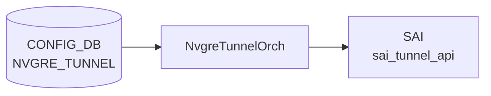

# NVGRE_TUNNEL / NVGRE_TUNNEL_MAP テーブル

## 概要

NVGRE (Network Virtualization using GRE, RFC 7637) のトンネル端点と [VLAN](../../reference/glossary.md#term-vlan) ↔ VSID マップを [CONFIG_DB](../../reference/glossary.md#term-config_db) に保持する[^1]。`vxlanorch` 系（NVGRE は [VXLAN](../../reference/glossary.md#term-vxlan) orch と一部実装を共有）が [SAI](../../reference/glossary.md#term-sai) 経由でカプセル化/デカプセル化を構成する。

<!-- cdb-mermaid -->
### データフロー (自動生成)



!!! note "凡例"
    CONFIG_DB から SAI までの典型経路を `docs/reference/config-db-orch-map.md` から機械生成したミニ図。詳細・例外は本ページ本文と対応表を参照。
<!-- /cdb-mermaid -->

## key 構造

```
NVGRE_TUNNEL|<tunnel_name>
NVGRE_TUNNEL_MAP|<tunnel_name>|<tunnel_map_name>
```

## NVGRE_TUNNEL フィールド

| フィールド | 型 | 必須 | 説明 |
|-----------|----|------|------|
| `tunnel_name` (key) | string (1..255) | — | NVGRE トンネル名 |
| `src_ip` | inet:ip-address | yes | ソース VTEP IP |

## NVGRE_TUNNEL_MAP フィールド

| フィールド | 型 | 必須 | 説明 |
|-----------|----|------|------|
| `tunnel_name` (key) | leafref → `NVGRE_TUNNEL.tunnel_name` | — | 親トンネル |
| `tunnel_map_name` (key) | string (1..255) | — | マップエントリ名 |
| `vlan_id` | uint16 (1..4094) | yes | [VLAN](../../reference/glossary.md#term-vlan) ID |
| `vsid` | uint32 (0..16777214) | yes | NVGRE Virtual Subnet ID (24bit) |

## 制約

- `vsid` は 24bit (0..16777214)、`vlan_id` は 1..4094

## 購読者

- `orchagent` (vxlanorch / NVGRE 拡張) — [SAI](../../reference/glossary.md#term-sai) tunnel オブジェクト生成

## 関連 CONFIG_DB / YANG / CLI

- 関連 [CONFIG_DB](../../reference/glossary.md#term-config_db): `VLAN`、`VXLAN_TUNNEL`（並存可能）
- 関連 [YANG](../../reference/glossary.md#term-yang): `sonic-nvgre-tunnel`
- 関連 CLI: `config nvgre`

<!-- ref-triangle:start -->

## 関連リファレンス

- [YANG](../../reference/glossary.md#term-yang): [`sonic-nvgre-tunnel`](../yang/sonic-nvgre-tunnel.md)
- CLI: `config nvgre`

<!-- ref-triangle:end -->

## 引用元

[^1]: [YANG](../../reference/glossary.md#term-yang) 定義: `sonic-nvgre-tunnel.yang`. <https://github.com/sonic-net/sonic-buildimage/blob/9ea932ec2e18f35e58268ec2e4456b1d4afd65cd/src/sonic-yang-models/yang-models/sonic-nvgre-tunnel.yang>

## 関連ページ
- [CONFIG_DB: VXLAN_TUNNEL](vxlan-tunnel.md)
- [CONFIG_DB: VLAN](vlan.md)

<!-- ops-hint -->
## 運用ヒント

### 典型値

- key 形式: `NVGRE_TUNNEL|<name>` / `NVGRE_TUNNEL_MAP|<tunnel>|<map_entry>`。
- `src_ip`: ローカル VTEP の loopback アドレス。
- `vsid`: 24bit (0..16777214)、`vlan_id`: 1..4094。

### よくある誤設定

- `src_ip` がローカル IP として実在しない (Loopback 未設定) ためトンネルが up しない。
- `VXLAN_TUNNEL` と `NVGRE_TUNNEL` を同一スイッチで併用し、orch が想定外動作。

### 確認コマンド

```bash
sonic-db-cli CONFIG_DB keys 'NVGRE_TUNNEL*'
sonic-db-cli ASIC_DB keys 'ASIC_STATE:SAI_OBJECT_TYPE_TUNNEL:*'
```
<!-- /ops-hint -->

<!-- glossary-links-injected: 91a36a875109 -->
