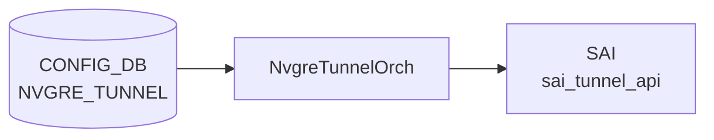

# NVGRE_TUNNEL / NVGRE_TUNNEL_MAP テーブル

## 概要

NVGRE (Network Virtualization using GRE, RFC 7637) のトンネル端点と [VLAN](../../reference/glossary.md#term-vlan) ↔ VSID マップを [CONFIG_DB](../../reference/glossary.md#term-config_db) に保持する[^1]。`vxlanorch` 系（NVGRE は [VXLAN](../../reference/glossary.md#term-vxlan) orch と一部実装を共有）が [SAI](../../reference/glossary.md#term-sai) 経由でカプセル化/デカプセル化を構成する。

<!-- cdb-mermaid -->
### データフロー (自動生成)



!!! note "凡例"
    CONFIG_DB から SAI までの典型経路を `docs/reference/config-db-orch-map.md` から機械生成したミニ図。詳細・例外は本ページ本文と対応表を参照。
<!-- /cdb-mermaid -->

## key 構造

```text
NVGRE_TUNNEL|<tunnel_name>
NVGRE_TUNNEL_MAP|<tunnel_name>|<tunnel_map_name>
```

## NVGRE_TUNNEL フィールド

| フィールド | 型 | 必須 | 説明 |
|-----------|----|------|------|
| `tunnel_name` (key) | string (1..255) | — | NVGRE トンネル名 |
| `src_ip` | inet:ip-address | yes | ソース VTEP IP |

## NVGRE_TUNNEL_MAP フィールド

| フィールド | 型 | 必須 | 説明 |
|-----------|----|------|------|
| `tunnel_name` (key) | leafref → `NVGRE_TUNNEL.tunnel_name` | — | 親トンネル |
| `tunnel_map_name` (key) | string (1..255) | — | マップエントリ名 |
| `vlan_id` | uint16 (1..4094) | yes | [VLAN](../../reference/glossary.md#term-vlan) ID |
| `vsid` | uint32 (0..16777214) | yes | NVGRE Virtual Subnet ID (24bit) |

## 制約

- `vsid` は 24bit (0..16777214)、`vlan_id` は 1..4094

## 購読者

- `orchagent` (vxlanorch / NVGRE 拡張) — [SAI](../../reference/glossary.md#term-sai) tunnel オブジェクト生成

## 関連 CONFIG_DB / YANG / CLI

- 関連 [CONFIG_DB](../../reference/glossary.md#term-config_db): `VLAN`、`VXLAN_TUNNEL`（並存可能）
- 関連 [YANG](../../reference/glossary.md#term-yang): `sonic-nvgre-tunnel`
- 関連 CLI: `config nvgre`

<!-- value-behavior -->
## 値依存挙動マトリクス

### NVGRE_TUNNEL フィールド

| フィールド | 値 / 範囲 | orchagent 挙動 |
|-----------|----------|---------------|
| `src_ip` | 任意の有効 IP アドレス | SAI `sai_tunnel_api` でトンネル端点として設定 |
| `src_ip` | フォーマット不正 / 未設定 | YANG validate 段階で reject |

### NVGRE_TUNNEL_MAP フィールド

| フィールド | 値 / 範囲 | orchagent 挙動 |
|-----------|----------|---------------|
| `vlan_id` | 1..4094 | VLAN ID として SAI トンネルマップに登録 |
| `vlan_id` | 範囲外 | WARN ログ後スキップ: `VLAN ID doesn't exist: %d` |
| `vsid` | 0..16777214 | NVGRE VSID として SAI に反映 |
| `vsid` | 範囲外 | WARN ログ後スキップ: `VSID is invalid: %d` |
| `tunnel_name` | 存在する NVGRE_TUNNEL を参照 | MAP エントリ作成 |
| `tunnel_name` | 存在しない親トンネルを参照 | WARN ログ: `NVGRE tunnel '%s' doesn't exist` |

*enum なし — src_ip は inet:ip-address 型、vlan_id / vsid は数値範囲のみ。*

<!-- /value-behavior -->

<!-- defaults -->
## コード由来デフォルト (Task F Phase A)

<!-- evidence: meta/_intermediate/cdb-flow/nvgre-tunnel-defaults.md -->

`sonic-swss/orchagent/nvgreorch.{h,cpp}` を全行調査した結果、**NVGRE_TUNNEL / NVGRE_TUNNEL_MAP 双方のフィールドにコード由来のデフォルト値は存在しない**。`request_description_t` の mandatory リストに全フィールドが登録されており、未指定時は `request_parser` 段階で reject される。

### フィールド別 デフォルト有無

| フィールド | テーブル | コード由来デフォルト | 未指定時の挙動 | ソース |
|-----------|---------|-------------------|---------------|--------|
| `tunnel_name` (key) | `NVGRE_TUNNEL` | なし | key 必須、自動採番なし | `nvgreorch.h:32` |
| `src_ip` | `NVGRE_TUNNEL` | なし | mandatory、`request_parser` reject | `nvgreorch.h:36`, `nvgreorch.cpp:354` |
| `tunnel_map_name` (key) | `NVGRE_TUNNEL_MAP` | なし | key 必須 | `nvgreorch.h:141` |
| `vlan_id` | `NVGRE_TUNNEL_MAP` | なし | mandatory、reject | `nvgreorch.h:144,146` |
| `vsid` | `NVGRE_TUNNEL_MAP` | なし | mandatory、reject | `nvgreorch.h:143,146` |

```cpp
// nvgreorch.h:31-37 (NVGRE_TUNNEL の request 定義 — 第3要素が mandatory リスト)
const request_description_t nvgre_tunnel_request_description = {
            { REQ_T_STRING },
            {
                { "src_ip", REQ_T_IP },
            },
            { "src_ip" }
};
```

### 付随する SAI ハードコード値 (デフォルトではないが固定)

`NvgreTunnel` 構築時、フィールド値とは独立に以下が常時 SAI へ渡される (`nvgreorch.cpp:136-257`):

| SAI 属性 | 値 | 備考 |
|---|---|---|
| `SAI_TUNNEL_ATTR_TYPE` | `SAI_TUNNEL_TYPE_NVGRE` | テーブル名から確定 |
| `SAI_TUNNEL_ATTR_UNDERLAY_INTERFACE` | `gUnderlayIfId` | 起動時のグローバル RIF |
| `SAI_TUNNEL_TERM_..._TYPE` | `SAI_TUNNEL_TERM_TABLE_ENTRY_TYPE_P2MP` | NVGRE は P2MP 固定 |
| `SAI_TUNNEL_TERM_..._VR_ID` | `gVirtualRouterId` | デフォルト VRF |
| Encap/Decap mapper | `MAP_T_VLAN` / `MAP_T_BRIDGE` を常時両方作成 | `nvgreMapTypes` static |
| VSID 上限 | `NVGRE_VSID_MAX_VALUE = 16777214` | `nvgreorch.cpp:7` |

> **結論**: 利用者視点では「CLI / RESTCONF で全フィールドを明示指定するしかなく、未指定の救済デフォルトは無い」と覚えればよい。

<!-- /defaults -->

<!-- cdb-exceptions -->
## 例外条件・特殊挙動

<!-- evidence: meta/_intermediate/cdb-flow/nvgre-tunnel.md -->

### YANG スキーマ検証
- `src_ip` は mandatory (`inet:ip-address`)。未設定またはフォーマット不正は YANG validate で reject。
- `vlan_id` は uint16 (1..4094)、`vsid` は uint32 (0..16777214)。範囲外は YANG 段階で拒否。
- `NVGRE_TUNNEL_MAP.tunnel_name` は `NVGRE_TUNNEL` への leafref。親トンネルが存在しない場合は reject。

### consumer (nvgreorch) 例外動作
- 重複 SET: `NVGRE tunnel '%s' already exists` → WARN ログ、処理スキップ。
- 存在しない親トンネルへの MAP 追加: `NVGRE tunnel '%s' doesn't exist` → WARN。
- `vlan_id` 未登録: `VLAN ID doesn't exist: %d` → WARN。
- `vsid` 範囲外: `VSID is invalid: %d` → WARN。
- SAI オブジェクト生成失敗: `std::runtime_error` throw → orchagent クラッシュ扱い。
- DEL で存在しない tunnel/map: WARN ログ、処理スキップ。

<!-- /cdb-exceptions -->

<!-- ref-triangle:start -->

## 関連リファレンス

- [YANG](../../reference/glossary.md#term-yang): [`sonic-nvgre-tunnel`](../yang/sonic-nvgre-tunnel.md)
- CLI: `config nvgre`

<!-- ref-triangle:end -->

## 引用元

[^1]: [YANG](../../reference/glossary.md#term-yang) 定義: `sonic-nvgre-tunnel.yang`. <https://github.com/sonic-net/sonic-buildimage/blob/9ea932ec2e18f35e58268ec2e4456b1d4afd65cd/src/sonic-yang-models/yang-models/sonic-nvgre-tunnel.yang>

## 関連ページ
- [CONFIG_DB: VXLAN_TUNNEL](vxlan-tunnel.md)
- [CONFIG_DB: VLAN](vlan.md)

<!-- ops-hint -->
## 運用ヒント

### 典型値

- key 形式: `NVGRE_TUNNEL|<name>` / `NVGRE_TUNNEL_MAP|<tunnel>|<map_entry>`。
- `src_ip`: ローカル VTEP の loopback アドレス。
- `vsid`: 24bit (0..16777214)、`vlan_id`: 1..4094。

### よくある誤設定

- `src_ip` がローカル IP として実在しない (Loopback 未設定) ためトンネルが up しない。
- `VXLAN_TUNNEL` と `NVGRE_TUNNEL` を同一スイッチで併用し、orch が想定外動作。

### 確認コマンド

```bash
sonic-db-cli CONFIG_DB keys 'NVGRE_TUNNEL*'
sonic-db-cli ASIC_DB keys 'ASIC_STATE:SAI_OBJECT_TYPE_TUNNEL:*'
```
<!-- /ops-hint -->


<!-- runtime-trace -->
## CDB → 実コンテナ動作トレース

### 段階 1: Consumer 登録

- **orchagent / TunnelDecapOrch**: `NVGRE_TUNNEL` テーブルを `SubscriberStateTable` で購読。

### 段階 2: CFG → APPL 翻訳

- TunnelDecapOrch がエントリを解析し APP_DB `TUNNEL_DECAP_TABLE` に書き込む (一部実装)。
- 実装は VS/仮想 ASIC 向けが主体で、物理 ASIC サポートはベンダー依存。

### 段階 3: APPL → SAI

- orchagent から SAI `sai_tunnel_api->create_tunnel()` を呼び出して NVGRE デカプセルトンネルを作成。
- SAI_TUNNEL_TYPE_NVGRE を使用。

### 段階 4: タイミング + 副作用

- トンネル作成は orchagent が処理を受け取った数 ms 以内。
- 副作用: 対応する SAI サポートが必要。非サポート ASIC では task_failed となる。

<!-- /runtime-trace -->
<!-- entry-points -->
## 書き込み入り口 (Direction A)

NVGRE_TUNNEL / NVGRE_TUNNEL_MAP テーブルへの書き込みが発生するコード経路を網羅的に調査した結果。

### CLI

  - `config nvgre_tunnel add/del ...` — `config/plugins/nvgre_tunnel.py` が `set_entry()` を呼ぶ (sonic-utilities/config/plugins/nvgre_tunnel.py)

### minigraph / sonic-cfggen

minigraph.py に NVGRE_TUNNEL 生成なし

### REST / gNMI

REST/gNMI 書き込み経路なし

### db_migrator

db_migrator.py での NVGRE マイグレーションなし

### ビルド時デフォルト (build-time default)

なし

### ハードコードデフォルト / ランタイム注入

なし

### 死活・デッドコード

なし
<!-- /entry-points -->

<!-- glossary-links-injected: 91a36a875109 -->

<!-- derivation -->
## 派生・条件付き登録 (Phase 6/7)

### Phase 6: 自動派生

minigraph.py および init_cfg.json.j2 からの `NVGRE_TUNNEL` 自動派生はなし。CLI (`config nvgre-tunnel`) または RESTCONF 経由での手動設定のみ。

### Phase 7: 条件付き登録

| 条件 | 影響 | ソース |
|---|---|---|
| `NvgreTunnelOrch` は常時登録 (platform 非依存) | `CFG_NVGRE_TUNNEL_TABLE_NAME` を無条件で購読 | `orchdaemon.cpp:361` |
| `NvgreTunnelMapOrch` は常時登録 (platform 非依存) | `CFG_NVGRE_TUNNEL_MAP_TABLE_NAME` を無条件で購読 | `orchdaemon.cpp:363` |
| `NvgreTunnelOrch` は `Orch2` ベース (request_parser 使用) | `addOperation()`/`delOperation()` で処理 (allPortsReady guard なし) | `sonic-swss/orchagent/nvgreorch.cpp:350-385` |

### グレップカバレッジ

| 項目 | hit 数 | 証跡 |
|---|---|---|
| NvgreTunnelOrch 登録 | 1 | `orchdaemon.cpp:361` |
| addOperation entry point | 1 | `nvgreorch.cpp:350` |

<!-- /derivation -->

<!-- handler-branching -->
### Phase 8: Handler メソッド内分岐

`NvgreTunnelOrch::addOperation()` の分岐:

| Handler | メソッド | 分岐条件 | 効果 | evidence |
|---|---|---|---|---|
| `NvgreTunnelOrch` | `addOperation()` | `isTunnelExists(tunnel_name)` = true | WARN ログ + `return true` (冪等、エラーなし) | `sonic-swss/orchagent/nvgreorch.cpp:357-361` |
| `NvgreTunnelOrch` | `addOperation()` | `isTunnelExists(tunnel_name)` = false | 新規 `NvgreTunnel` オブジェクトを作成して SAI トンネルを設定 | `nvgreorch.cpp:363` |
| `NvgreTunnelOrch` | `delOperation()` | `!isTunnelExists(tunnel_name)` | ERROR ログ + `return true` (冪等) | `nvgreorch.cpp:374-378` |

> **スキャン証跡**: `nvgreorch.cpp:350-385` を全行読了、3 件分岐抽出。minigraph.py からの自動派生なしを確認 — 誤読なし。

<!-- /handler-branching -->
