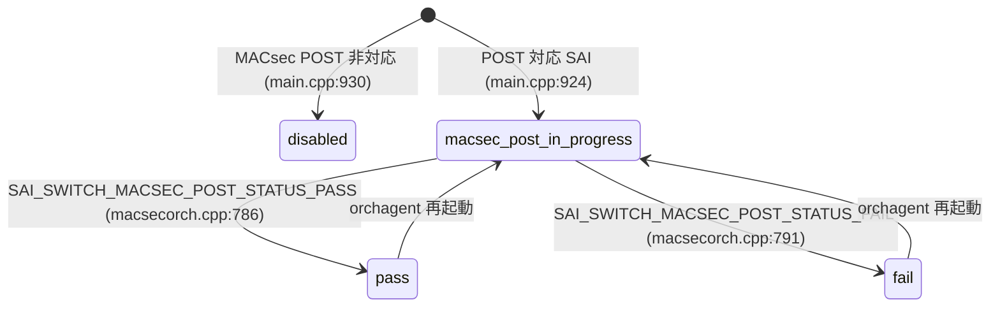

# STATE_DB orchagent 共通テーブル

## 概要

`orchagent` (`sonic-swss`) は動作中に複数の STATE_DB テーブルへ書き込みを行う。本ページはその共通テーブル群——`WARM_RESTART_TABLE`・`PORT_TABLE`・`FDB_TABLE`・`VRF_OBJECT_TABLE`・`FIPS_MACSEC_POST_TABLE`——のキー構造・フィールド・コード由来デフォルトを一覧する。

BFD セッション状態 (`BFD_SESSION_TABLE`) やデュアルTOR MUX 状態 (`HW_MUX_CABLE_TABLE`) など個別機能の STATE_DB テーブルは、それぞれの機能ページを参照のこと。

---

## WARM_RESTART_TABLE

**テーブル名**: `WARM_RESTART_TABLE` (`schema.h:427`)

orchagent は `WarmStart::setWarmStartState()` を通じて、warm restart の FSM 状態を本テーブルに書き込む[^1]。

### キー構造

```text
WARM_RESTART_TABLE|<app_name>
```

orchagent 自身は `WARM_RESTART_TABLE|orchagent` を使用する。

### フィールド

| フィールド | 型 | 初期値 | 説明 |
|-----------|----|-------|------|
| `state` | enum string | `"initialized"` | warm restart FSM 状態 |
| `restore_count` | uint string | `"0"` | warm start 実行回数 |
| `restore_check` | enum string | `"ignored"` | STAGE_RESTORE data check 結果 |
| `shutdown_check` | enum string | `"ignored"` | STAGE_SHUTDOWN data check 結果 |

`state` の値一覧:

| 値 | 意味 |
|----|------|
| `"initialized"` | 起動完了 (orchdaemon.cpp:1099) |
| `"restored"` | ウォームリスタートのリストア完了 (orchdaemon.cpp:1204) |
| `"replayed"` | リプレイ完了 |
| `"reconciled"` | リコンサイル完了 (orchdaemon.cpp:1170) |
| `"disabled"` | warm restart 無効 |
| `"unknown"` | 不明状態 |

`restore_check` / `shutdown_check` の値:

| 値 | 意味 |
|----|------|
| `"ignored"` | data check スキップ (デフォルト) |
| `"passed"` | data check 成功 |
| `"failed"` | data check 失敗 |

### 書き込みタイミング

1. `WarmStart::checkWarmStart()`: `restore_count` の初期化 (`"0"`) または インクリメント
2. `OrchDaemon::init()` → `WarmStart::setWarmStartState("orchagent", INITIALIZED)`: 起動時に `state = "initialized"`
3. `orchDaemon->reconcile()` → `WarmStart::setWarmStartState("orchagent", RECONCILED)`: リコンサイル完了時
4. warm start 復元成功時 → `WarmStart::setWarmStartState("orchagent", RESTORED)`: `state = "restored"`

---

## PORT_TABLE

**テーブル名**: `PORT_TABLE` (`schema.h:420`)

`portsorch` が SAI から取得したポート能力情報・実行時状態を書き込む[^2]。

### キー構造

```text
PORT_TABLE|<port_alias>
```

例: `PORT_TABLE|Ethernet0`

### フィールド

| フィールド | 型 | 初期値 | 説明 |
|-----------|----|-------|------|
| `supported_speeds` | カンマ区切り uint string | SAI 取得値 | SAI_PORT_ATTR_SUPPORTED_SPEED_LIST から取得 (portsorch.cpp:3171) |
| `supported_fecs` | カンマ区切り string | SAI 取得値 [+`"auto"`] | SAI_PORT_ATTR_SUPPORTED_FEC_MODE から取得。FEC auto override サポート時は末尾に `"auto"` を付加 (portsorch.cpp:3310-3318) |
| `host_tx_ready` | boolean string | `"false"` | ホスト TX 準備状態。SAI/gearbox の admin up 成功時 `"true"`、失敗/ダウン時 `"false"` (portsorch.cpp:2201-2203) |
| `speed` | uint string / `"N/A"` | SAI 取得値 | 実動作速度 (Mbps)。0 の場合は `"N/A"` (portsorch.cpp:9855) |
| `fec` | string | SAI 取得値 | 実動作 FEC モード (portsorch.cpp:9869) |
| `link_training_status` | string | SAI 取得値 | リンクトレーニング状態 (portsorch.cpp:4907, 11380) |
| `rmt_adv_speeds` | カンマ区切り string | SAI 取得値 | リモート advertised speeds。未サポート時はフィールド削除 (portsorch.cpp:4862, 11338) |
| `phy_ctrl_unreliable_los` | boolean string | SAI 取得値 | PHY LOS 信頼性フラグ (portsorch.cpp:5200) |

!!! note "`host_tx_ready` 初期化ロジック"
    `initHostTxReadyState()` は既存の `host_tx_ready` 値が存在しない場合のみ `"false"` を書き込む。warm restart 時は既存値を保持する。

---

## FDB_TABLE

**テーブル名**: `FDB_TABLE` (`schema.h:426`)

`fdborch` がローカル学習した MAC アドレスを書き込む[^3]。リモート学習 (VXLAN advertised / MCLAG advertised) エントリは原則書き込まれない。

### キー構造

```text
FDB_TABLE|<bridge_name>:<mac_address>
```

例: `FDB_TABLE|Vlan1000:aa:bb:cc:dd:ee:ff`

### フィールド

| フィールド | 型 | 値 | 説明 |
|-----------|----|----|------|
| `port` | string | ポート名 | MAC を学習したポート (fdborch.cpp:133) |
| `type` | enum string | `"dynamic"` / `"static"` | FDB エントリ種別。`dynamic_local` 由来は `"dynamic"` に正規化 (fdborch.cpp:1578-1582) |

### 書き込み条件

- **書き込む**: `FDB_ORIGIN_LEARN` (ローカル学習) および `FDB_ORIGIN_LOCAL` (静的)
- **書き込まない**: `FDB_ORIGIN_VXLAN_ADVERTIZED` (VXLAN 経由) — ただし `FDB_ORIGIN_MCLAG_ADVERTIZED` かつ `type == "dynamic_local"` の場合は書き込む
- **MAC 移動時**: 旧エントリ削除 → 新エントリ書き込み。MCLAG remote → local 移動の場合は `MCLAG_REMOTE_FDB_TABLE` からも削除

---

## VRF_OBJECT_TABLE

**テーブル名**: `VRF_OBJECT_TABLE` (`schema.h:430`)

`vrforch` が VRF の SAI オブジェクト作成/更新完了を通知するためのテーブル[^4]。`vrfmgrd` が VRF 削除時の同期制御に使用する。

### キー構造

```text
VRF_OBJECT_TABLE|<vrf_name>
```

例: `VRF_OBJECT_TABLE|Vrf-red`

### フィールド

| フィールド | 型 | 値 | 説明 |
|-----------|----|----|------|
| `state` | string | `"ok"` | VRF 作成/更新成功後に書き込み (vrforch.cpp:120, 150) |

エントリは VRF 削除時に `m_stateVrfObjectTable.del(vrf_name)` で削除される (vrforch.cpp:193)。

---

## FIPS_MACSEC_POST_TABLE

**テーブル名**: `FIPS_MACSEC_POST_TABLE` (`schema.h:471`)

FIPS 規格の MACsec Power-On Self Test (POST) 結果を格納するテーブル[^5]。orchagent 起動時と SAI 通知コールバックで更新される。

### キー構造

```text
FIPS_MACSEC_POST_TABLE|sai
```

固定キー `"sai"` のみ使用。

### フィールド

| フィールド | 型 | 初期値 | 説明 |
|-----------|----|-------|------|
| `post_state` | enum string | `"disabled"` | POST テスト状態 |
| `last_update_time` | string | orchagent 起動時刻 | 最終更新時刻 (UTC, `"%a %b %d %H:%M:%S %Y"` 形式) |

`post_state` の値:

| 値 | 意味 |
|----|------|
| `"disabled"` | MACsec POST 非対応、または無効 (main.cpp:791) |
| `"macsec-level-post-in-progress"` | POST テスト実行中 (main.cpp:924) |
| `"pass"` | POST テスト成功 (macsecorch.cpp:705, 786) |
| `"fail"` | POST テスト失敗 (macsecorch.cpp:710, 791) |

### post_state 遷移



<!-- ordering -->
## 書込み順依存 (Phase B)

orchagent が STATE_DB へ書き込む 5 テーブルはそれぞれ異なる初期化フェーズで出現する。下記は orchagent 起動シーケンスにおける書込み順と、テーブル間の強制先行関係をまとめたものである。

### 起動シーケンス上の書込み順序

```
[orchagent 起動]
    │
    ├─① FIPS_MACSEC_POST_TABLE|sai  (main.cpp:791-793, 924)
    │     post_state = "disabled" または "macsec-level-post-in-progress"
    │     ※ main() 内の SAI 初期化直後・イベントループ前に書込み
    │
    ├─② WARM_RESTART_TABLE|orchagent  state = "initialized"
    │     (OrchDaemon::warmRestoreAndSyncUp():1099 または OrchDaemon::run():1099)
    │
    ├─③ PORT_TABLE|<port_alias>  (PortInitDone 受信後)
    │     portsyncd が APP_DB に PortInitDone を書いてから、
    │     portsorch が postPortInit() → initPortSupportedSpeeds/Fec() で書込み
    │     initHostTxReadyState() は「既存値なし」の場合のみ host_tx_ready="false" を書込み
    │
    ├─④ FDB_TABLE|<bridge>:<mac>  (allPortsReady() ガード後)
    │     FdbOrch::doTask() は allPortsReady() が false の間リターンする。
    │     ∴ PORT_TABLE の全ポート初期化完了 (PortInitDone 処理) より前には書込まれない。
    │
    ├─⑤ VRF_OBJECT_TABLE|<vrf_name>  (SAI create_virtual_router 成功後)
    │     vrforch が APP_VRF_TABLE エントリを処理して SAI 呼出しが成功した直後に
    │     m_stateVrfObjectTable.hset(vrf_name, "state", "ok") を書込む。
    │     (vrforch.cpp:120, 150)
    │
    └─⑥ WARM_RESTART_TABLE|orchagent  state = "restored" / "reconciled"  [warm start のみ]
          warmRestoreValidation() 成功 → state = "restored" (orchdaemon.cpp:1204)
          その後 WarmStart::RECONCILED が書込まれる (orchdaemon.cpp:1170)
```

### 検出された順序依存

| # | 依存関係 | 方向 | 根拠コード |
|---|----------|------|-----------|
| 1 | FIPS_MACSEC_POST_TABLE → 全テーブル | 強制先行 | `main.cpp:791-793, 924` — イベントループ前に確定 |
| 2 | `PortInitDone` 受信 → PORT_TABLE `supported_speeds/fecs` 書込み | 強制先行 | `postPortInit()` → `portsorch.cpp:6460-6461` |
| 3 | PORT_TABLE `allPortsReady()` = true → FDB_TABLE 書込み開始 | **強制先行** | `fdborch.cpp:711, 927` — allPortsReady() が false なら即リターン |
| 4 | SAI `create_virtual_router` 成功 → VRF_OBJECT_TABLE `state="ok"` | 強制先行 | `vrforch.cpp:120, 150` |
| 5 | `WARM_RESTART_TABLE state="initialized"` → 全オーケストレーション処理 | 強制先行（warm start 時） | `orchdaemon.cpp:1099` |
| 6 | warm restore 3-pass 完了 → `state="restored"` → `state="reconciled"` | 逐次 | `orchdaemon.cpp:1204, 1170` |

### 主要な制約詳細

**FDB_TABLE は PORT_TABLE の後 (依存 #3)**: `FdbOrch::doTask(Consumer&)` および `FdbOrch::doTask(NotificationConsumer&)` はともに冒頭で `m_portsOrch->allPortsReady()` を確認し、`false` の場合は即 `return` する。このため portsyncd が `APP_DB:PORT_TABLE|PortInitDone` を書き込んで `portsorch` が `m_initDone = true` かつ `m_pendingPortSet.empty()` になるまで、`FDB_TABLE` への STATE_DB 書込みは発生しない（evidence: `fdborch.cpp:711`、`fdborch.cpp:927`、`portsorch.cpp:1685-1688`）。

**PORT_TABLE は SAI 応答待ちで遅延 (依存 #2)**: `initPortSupportedSpeeds` / `initPortSupportedFecModes` は SAI `get_port_attribute` の成功を前提に書き込む。SAI 応答が来るまでフィールドは STATE_DB に存在しない。warm restart 時、`host_tx_ready` は既存値があれば保持される（`initHostTxReadyState()` の `hostTxReady.empty()` ガード）。

**VRF_OBJECT_TABLE は SAI 成功時のみ (依存 #4)**: SAI `create_virtual_router` が失敗した場合、`VRF_OBJECT_TABLE` へは書き込まれない。`vrfmgrd` は VRF 削除時に `VRF_OBJECT_TABLE` から `state="ok"` が消えることを監視して削除完了を判定する（vrforch.cpp:193 の `m_stateVrfObjectTable.del(vrf_name)`）。

**WARM_RESTART_TABLE の状態遷移順 (依存 #5, #6)**: cold start では `state="initialized"` が 1 回書かれるのみ。warm start では `initialized` → （3-pass 完了後）`restored` → `reconciled` の順で遷移する。`restored` は `warmRestoreValidation()` が pending task なし = `ts.empty()` を確認した後にのみ設定される（orchdaemon.cpp:1201-1204）。

<!-- /ordering -->

<!-- cross-refs -->
## 暗黙参照 — Phase C (cross-table refs)

> **調査根拠**: `orchagent/orchdaemon.cpp`, `orchagent/main.cpp`, `orchagent/portsorch.cpp`, `orchagent/fdborch.cpp`, `orchagent/vrforch.cpp`, `orchagent/macsecpost.cpp`, `common/warm_restart.cpp` 全行精読 (2026-05-18)
> 詳細証跡: `meta/_intermediate/cdb-flow/orchagent-state-cross-refs.md`

orchagent が STATE_DB へ書き込む各テーブルは、以下の上流 DB・SAI イベントを暗黙的に参照する。YANG leafref はいずれも存在しない。

| 参照先 | DB | 方向 | STATE_DB テーブル | 実装上の必須度 | 根拠コード |
|--------|----|----|------------------|--------------|-----------|
| `PORT_TABLE\|PortInitDone` | APPL_DB | READ | PORT_TABLE, FDB_TABLE | **必須** (PortInitDone がない限り初期化不完） | `portsorch.cpp:4350-4357, 4613` |
| `PORT_TABLE\|PortConfigDone` | APPL_DB | READ | PORT_TABLE | **必須** (PortConfigDone と PortInitDone 両方で設定完了判定） | `portsorch.cpp:4357` |
| `FDB_TABLE\|*` | APPL_DB | READ | FDB_TABLE | 必須 (APPL_DB FDB エントリを購読して STATE_DB に反映) | `fdborch.cpp:31-32`, `orchdaemon.cpp:227` |
| `VRF_TABLE\|*` | APPL_DB | READ | VRF_OBJECT_TABLE | 必須 (VRF エントリを受けて SAI create → 成功時に `state="ok"` 書込) | `vrforch.h:52`, `orchdaemon.cpp:283` |
| `WARM_RESTART_TABLE\|orchagent` | STATE_DB (自己) | READ | WARM_RESTART_TABLE | warm start 時のみ必須 (restore_count インクリメントに現在値を読取) | `warm_restart.cpp:113-125` |
| SAI `create_virtual_router` レスポンス | SAI / ASIC | READ (SAI resp) | VRF_OBJECT_TABLE | **必須** (SAI 失敗時はエントリ書込なし) | `vrforch.cpp:93, 120, 150` |
| SAI `SAI_SWITCH_ATTR_MACSEC_SUPPORTED` 取得 | SAI / ASIC | READ (SAI resp) | FIPS_MACSEC_POST_TABLE | 必須 (非対応時は `post_state="disabled"` で固定) | `main.cpp:791-793, 924` |
| SAI MACsec POST 完了コールバック | SAI / ASIC | 非同期 NOTIFY | FIPS_MACSEC_POST_TABLE | MACsec POST 対応 SAI のみ | `macsecorch.cpp:705, 710, 786, 791` |

### APPL_DB PORT_TABLE — PortInitDone / PortConfigDone

`portsyncd` が APPL_DB の `PORT_TABLE|PortInitDone` を書き込むと、`portsorch` がこれを検出して `m_initDone = true` をセットする（`portsorch.cpp:4613`）。`PORT_TABLE|PortConfigDone` も同様に確認される（`portsorch.cpp:4357`）。この 2 キーが揃って初めて `initPortSupportedSpeeds()` / `initPortSupportedFecModes()` / `initHostTxReadyState()` が実行され、STATE_DB `PORT_TABLE` へのフィールド書込が始まる。**APPL_DB の PortInitDone が存在しない間は STATE_DB PORT_TABLE に何も書かれない**。

### APPL_DB FDB_TABLE — allPortsReady() ガード

`fdborch` は APPL_DB `FDB_TABLE` を購読する（`orchdaemon.cpp:227`）。しかし `FdbOrch::doTask()` 冒頭で `m_portsOrch->allPortsReady()` を確認し、`false` の場合は即リターンする（`fdborch.cpp:711, 927`）。よって **APPL_DB FDB_TABLE に SET エントリが存在しても、PortInitDone 処理完了前は STATE_DB FDB_TABLE に書き込まれない**。

### APPL_DB VRF_TABLE — SAI 成功のみ書込

`vrforch` は APPL_DB `VRF_TABLE` を購読し、SAI `create_virtual_router` / `set_virtual_router_attribute` の成功を受けて `m_stateVrfObjectTable.hset(vrf_name, "state", "ok")` を書く（`vrforch.cpp:120, 150`）。SAI 呼び出しが失敗した場合、STATE_DB VRF_OBJECT_TABLE にはエントリが書き込まれない。逆に `vrfmgrd` は VRF 削除時に STATE_DB `VRF_OBJECT_TABLE` のエントリ消失を確認してから実際の削除を完了させる（`vrforch.cpp:193` の `del()` を監視）。

### WARM_RESTART_TABLE 自己参照

`WarmStart::checkWarmStart()` は `WARM_RESTART_TABLE|orchagent.restore_count` を STATE_DB から読み取り、`stoul(value) + 1` でインクリメントした値を書き戻す（`warm_restart.cpp:113-125`）。cold start 時（エントリが存在しない場合）は `"0"` を書き込む。これは STATE_DB 内の自己参照であり、外部 DB への依存はない。

<!-- /cross-refs -->

<!-- defaults -->
## フィールド暗黙デフォルト (Phase A — コード由来)

orchagent が STATE_DB へ書き込む各テーブルのコード由来デフォルト一覧。YANG schema はいずれも存在しない。

### WARM_RESTART_TABLE

| フィールド | STATE_DB 初期値 | コード由来 |
|-----------|---------------|----------|
| `state` | `"initialized"` | `WarmStart::INITIALIZED` — `orchdaemon.cpp:1099` + `warm_restart.cpp:11` |
| `restore_count` | `"0"` | cold start 時: `warm_restart.cpp:113, 125`。warm start 時: `stoul(value)+1` |
| `restore_check` | `"ignored"` (デフォルト/未書き込み) | `dataCheckStateNameMap` — `warm_restart.cpp:21` |
| `shutdown_check` | `"ignored"` (デフォルト/未書き込み) | `dataCheckStateNameMap` — `warm_restart.cpp:21` |

### PORT_TABLE

| フィールド | STATE_DB 初期値 | コード由来 |
|-----------|---------------|----------|
| `host_tx_ready` | `"false"` | `initHostTxReadyState()` — `portsorch.cpp:2200-2205` — 既存値なしのみ |
| `supported_speeds` | SAI 取得値 | `initPortCapSpeeds()` — `portsorch.cpp:3167-3172` |
| `supported_fecs` | SAI 取得値 [+`"auto"`] | `initPortCapFec()` — `portsorch.cpp:3310-3320`。`fec_override_sup` 時は末尾 `"auto"` を付加 |
| `speed` | SAI 取得値 (0 → `"N/A"`) | `updateDbPortOperSpeed()` — `portsorch.cpp:9855-9857` |
| `fec` | SAI 取得値 | `updateDbPortOperFec()` — `portsorch.cpp:9869-9870` |
| `link_training_status` | SAI 取得値 | `portsorch.cpp:4907, 11380` |
| `rmt_adv_speeds` | SAI 取得値 or 削除 | `portsorch.cpp:11338`。未サポート時は `hdel` で削除 (`portsorch.cpp:4862`) |
| `phy_ctrl_unreliable_los` | `"true"` / `"false"` | `portsorch.cpp:5200` — PHY 能力取得後に書き込み |

### FDB_TABLE

| フィールド | STATE_DB 初期値 | コード由来 |
|-----------|---------------|----------|
| `port` | 学習ポート名 | `fdborch.cpp:133, 1577` |
| `type` | `"dynamic"` (dynamic_local) / `"static"` (static) | `fdborch.cpp:1578-1582` — `dynamic_local` → `"dynamic"` に正規化 |

### VRF_OBJECT_TABLE

| フィールド | STATE_DB 初期値 | コード由来 |
|-----------|---------------|----------|
| `state` | `"ok"` | `vrforch.cpp:120, 150` — SAI 作成/更新成功後に固定値書き込み |

### FIPS_MACSEC_POST_TABLE

| フィールド | STATE_DB 初期値 | コード由来 |
|-----------|---------------|----------|
| `post_state` | `"disabled"` | `main.cpp:791-793` — MACsec POST 非対応時のデフォルト |
| `last_update_time` | orchagent 起動時刻 (UTC) | `macsecpost.cpp:16-20` — `strftime` で `"%a %b %d %H:%M:%S %Y"` フォーマット |

### 補足

- `WARM_RESTART_TABLE.restore_count` は warm start 実行のたびにインクリメントされ、0 リセットはしない。コールドスタート後（DB フラッシュ後）のみ `"0"` から始まる。
- `PORT_TABLE.host_tx_ready` は `initHostTxReadyState()` が「既存値がない場合のみ」 `"false"` を書き込む。warm restart 時は既存値を保持する。
- `FDB_TABLE` には VXLAN/MCLAG advertized の MAC は原則書かれない（`MCLAG_REMOTE_FDB_TABLE` が別途存在）。
- `VRF_OBJECT_TABLE.state` は常に `"ok"` のみ。失敗時はエントリ自体が書かれない。
- `FIPS_MACSEC_POST_TABLE` は FIPS モード有効かつ SAI が MACsec POST に対応している場合のみ実質的に利用される。
<!-- /defaults -->

## 引用元

[^1]: `sonic-swss-common/common/warm_restart.cpp` (L9-17 warmStartStateNameMap, L109-137 checkWarmStart, L223-234 setWarmStartState, L237-254 setDataCheckState). <https://github.com/sonic-net/sonic-swss-common/blob/master/common/warm_restart.cpp>

[^2]: `sonic-swss/orchagent/portsorch.cpp` (L725 constructor, L2181-2205 initHostTxReadyState, L2264-2276 setHostTxReady, L3161-3172 initPortCapSpeeds, L3316-3320 initPortCapFec, L4862 hdel rmt_adv_speeds, L4907 link_training_status hset, L5200 phy_ctrl_unreliable_los, L9850-9870 updateDbPortOperSpeed/Fec, L11338 rmt_adv_speeds, L11380 link_training_status). <https://github.com/sonic-net/sonic-swss/blob/master/orchagent/portsorch.cpp>

[^3]: `sonic-swss/orchagent/fdborch.cpp` (L31-32 constructor, L131-135 FDB set, L1574-1582 FDB set warm path, L1592 FDB del). <https://github.com/sonic-net/sonic-swss/blob/master/orchagent/fdborch.cpp>

[^4]: `sonic-swss/orchagent/vrforch.cpp` (L120, L150 state ok hset, L193 del). <https://github.com/sonic-net/sonic-swss/blob/master/orchagent/vrforch.cpp>

[^5]: `sonic-swss/orchagent/macsecpost.cpp` (L9-24 setMacsecPostState — post_state + last_update_time). `sonic-swss/orchagent/main.cpp` (L791-793, L924, L930). `sonic-swss/orchagent/macsecorch.cpp` (L705, L710, L786, L791). <https://github.com/sonic-net/sonic-swss/blob/master/orchagent/macsecpost.cpp>

## 確認コマンド

```bash
# WARM_RESTART_TABLE
sonic-db-cli STATE_DB hgetall 'WARM_RESTART_TABLE|orchagent'

# PORT_TABLE
sonic-db-cli STATE_DB hgetall 'PORT_TABLE|Ethernet0'
sonic-db-cli STATE_DB keys 'PORT_TABLE|*'

# FDB_TABLE
sonic-db-cli STATE_DB keys 'FDB_TABLE|*'
show mac

# VRF_OBJECT_TABLE
sonic-db-cli STATE_DB keys 'VRF_OBJECT_TABLE|*'
sonic-db-cli STATE_DB hgetall 'VRF_OBJECT_TABLE|Vrf-red'

# FIPS_MACSEC_POST_TABLE
sonic-db-cli STATE_DB hgetall 'FIPS_MACSEC_POST_TABLE|sai'

# warm restart 状態確認
show warm_restart
```
