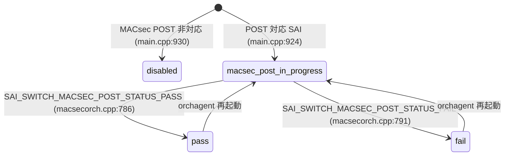

# STATE_DB orchagent 共通テーブル

## 概要

`orchagent` (`sonic-swss`) は動作中に複数の [STATE_DB](../../reference/glossary.md#term-state_db) テーブルへ書き込みを行う。本ページはその共通テーブル群——`WARM_RESTART_TABLE`・`PORT_TABLE`・`FDB_TABLE`・`VRF_OBJECT_TABLE`・`FIPS_MACSEC_POST_TABLE`——のキー構造・フィールド・コード由来デフォルトを一覧する。

[BFD](../../reference/glossary.md#term-bfd) セッション状態 (`BFD_SESSION_TABLE`) やデュアルTOR [MUX](../../reference/glossary.md#term-mux) 状態 (`HW_MUX_CABLE_TABLE`) など個別機能の [STATE_DB](../../reference/glossary.md#term-state_db) テーブルは、それぞれの機能ページを参照のこと。

---

## WARM_RESTART_TABLE

**テーブル名**: `WARM_RESTART_TABLE` (`schema.h:427`)

[orchagent](../../reference/glossary.md#term-orchagent) は `WarmStart::setWarmStartState()` を通じて、warm restart の FSM 状態を本テーブルに書き込む[^1]。

### キー構造

```text
WARM_RESTART_TABLE|<app_name>
```

[orchagent](../../reference/glossary.md#term-orchagent) 自身は `WARM_RESTART_TABLE|orchagent` を使用する。

### フィールド

| フィールド | 型 | 初期値 | 説明 |
|-----------|----|-------|------|
| `state` | enum string | `"initialized"` | warm restart FSM 状態 |
| `restore_count` | uint string | `"0"` | warm start 実行回数 |
| `restore_check` | enum string | `"ignored"` | STAGE_RESTORE data check 結果 |
| `shutdown_check` | enum string | `"ignored"` | STAGE_SHUTDOWN data check 結果 |

`state` の値一覧:

| 値 | 意味 |
|----|------|
| `"initialized"` | 起動完了 (orchdaemon.cpp:1099) |
| `"restored"` | ウォームリスタートのリストア完了 (orchdaemon.cpp:1204) |
| `"replayed"` | リプレイ完了 |
| `"reconciled"` | リコンサイル完了 (orchdaemon.cpp:1170) |
| `"disabled"` | warm restart 無効 |
| `"unknown"` | 不明状態 |

`restore_check` / `shutdown_check` の値:

| 値 | 意味 |
|----|------|
| `"ignored"` | data check スキップ (デフォルト) |
| `"passed"` | data check 成功 |
| `"failed"` | data check 失敗 |

### 書き込みタイミング

1. `WarmStart::checkWarmStart()`: `restore_count` の初期化 (`"0"`) または インクリメント
2. `OrchDaemon::init()` → `WarmStart::setWarmStartState("orchagent", INITIALIZED)`: 起動時に `state = "initialized"`
3. `orchDaemon->reconcile()` → `WarmStart::setWarmStartState("orchagent", RECONCILED)`: リコンサイル完了時
4. warm start 復元成功時 → `WarmStart::setWarmStartState("orchagent", RESTORED)`: `state = "restored"`

---

## PORT_TABLE

**テーブル名**: `PORT_TABLE` (`schema.h:420`)

`portsorch` が [SAI](../../reference/glossary.md#term-sai) から取得したポート能力情報・実行時状態を書き込む[^2]。

### キー構造

```text
PORT_TABLE|<port_alias>
```

例: `PORT_TABLE|Ethernet0`

### フィールド

| フィールド | 型 | 初期値 | 説明 |
|-----------|----|-------|------|
| `supported_speeds` | カンマ区切り uint string | [SAI](../../reference/glossary.md#term-sai) 取得値 | SAI_PORT_ATTR_SUPPORTED_SPEED_LIST から取得 ([portsorch](../../reference/glossary.md#term-portsorch).cpp:3171) |
| `supported_fecs` | カンマ区切り string | [SAI](../../reference/glossary.md#term-sai) 取得値 [+`"auto"`] | SAI_PORT_ATTR_SUPPORTED_FEC_MODE から取得。FEC auto override サポート時は末尾に `"auto"` を付加 ([portsorch](../../reference/glossary.md#term-portsorch).cpp:3310-3318) |
| `host_tx_ready` | boolean string | `"false"` | ホスト TX 準備状態。SAI/gearbox の admin up 成功時 `"true"`、失敗/ダウン時 `"false"` ([portsorch](../../reference/glossary.md#term-portsorch).cpp:2201-2203) |
| `speed` | uint string / `"N/A"` | SAI 取得値 | 実動作速度 (Mbps)。0 の場合は `"N/A"` (portsorch.cpp:9855) |
| `fec` | string | SAI 取得値 | 実動作 FEC モード (portsorch.cpp:9869) |
| `link_training_status` | string | SAI 取得値 | リンクトレーニング状態 (portsorch.cpp:4907, 11380) |
| `rmt_adv_speeds` | カンマ区切り string | SAI 取得値 | リモート advertised speeds。未サポート時はフィールド削除 (portsorch.cpp:4862, 11338) |
| `phy_ctrl_unreliable_los` | boolean string | SAI 取得値 | PHY LOS 信頼性フラグ (portsorch.cpp:5200) |

!!! note "`host_tx_ready` 初期化ロジック"
    `initHostTxReadyState()` は既存の `host_tx_ready` 値が存在しない場合のみ `"false"` を書き込む。warm restart 時は既存値を保持する。

---

## FDB_TABLE

**テーブル名**: `FDB_TABLE` (`schema.h:426`)

`fdborch` がローカル学習した MAC アドレスを書き込む[^3]。リモート学習 ([VXLAN](../../reference/glossary.md#term-vxlan) advertised / [MCLAG](../../reference/glossary.md#term-mclag) advertised) エントリは原則書き込まれない。

### キー構造

```text
FDB_TABLE|<bridge_name>:<mac_address>
```

例: `FDB_TABLE|Vlan1000:aa:bb:cc:dd:ee:ff`

### フィールド

| フィールド | 型 | 値 | 説明 |
|-----------|----|----|------|
| `port` | string | ポート名 | MAC を学習したポート (fdborch.cpp:133) |
| `type` | enum string | `"dynamic"` / `"static"` | [FDB](../../reference/glossary.md#term-fdb) エントリ種別。`dynamic_local` 由来は `"dynamic"` に正規化 (fdborch.cpp:1578-1582) |

### 書き込み条件

- **書き込む**: `FDB_ORIGIN_LEARN` (ローカル学習) および `FDB_ORIGIN_LOCAL` (静的)
- **書き込まない**: `FDB_ORIGIN_VXLAN_ADVERTIZED` ([VXLAN](../../reference/glossary.md#term-vxlan) 経由) — ただし `FDB_ORIGIN_MCLAG_ADVERTIZED` かつ `type == "dynamic_local"` の場合は書き込む
- **MAC 移動時**: 旧エントリ削除 → 新エントリ書き込み。[MCLAG](../../reference/glossary.md#term-mclag) remote → local 移動の場合は `MCLAG_REMOTE_FDB_TABLE` からも削除

---

## VRF_OBJECT_TABLE

**テーブル名**: `VRF_OBJECT_TABLE` (`schema.h:430`)

`vrforch` が [VRF](../../reference/glossary.md#term-vrf) の SAI オブジェクト作成/更新完了を通知するためのテーブル[^4]。`vrfmgrd` が [VRF](../../reference/glossary.md#term-vrf) 削除時の同期制御に使用する。

### キー構造

```text
VRF_OBJECT_TABLE|<vrf_name>
```

例: `VRF_OBJECT_TABLE|Vrf-red`

### フィールド

| フィールド | 型 | 値 | 説明 |
|-----------|----|----|------|
| `state` | string | `"ok"` | [VRF](../../reference/glossary.md#term-vrf) 作成/更新成功後に書き込み (vrforch.cpp:120, 150) |

エントリは VRF 削除時に `m_stateVrfObjectTable.del(vrf_name)` で削除される (vrforch.cpp:193)。

---

## FIPS_MACSEC_POST_TABLE

**テーブル名**: `FIPS_MACSEC_POST_TABLE` (`schema.h:471`)

FIPS 規格の [MACsec](../../reference/glossary.md#term-macsec) Power-On Self Test (POST) 結果を格納するテーブル[^5]。[orchagent](../../reference/glossary.md#term-orchagent) 起動時と SAI 通知コールバックで更新される。

### キー構造

```text
FIPS_MACSEC_POST_TABLE|sai
```

固定キー `"sai"` のみ使用。

### フィールド

| フィールド | 型 | 初期値 | 説明 |
|-----------|----|-------|------|
| `post_state` | enum string | `"disabled"` | POST テスト状態 |
| `last_update_time` | string | orchagent 起動時刻 | 最終更新時刻 (UTC, `"%a %b %d %H:%M:%S %Y"` 形式) |

`post_state` の値:

| 値 | 意味 |
|----|------|
| `"disabled"` | [MACsec](../../reference/glossary.md#term-macsec) POST 非対応、または無効 (main.cpp:791) |
| `"macsec-level-post-in-progress"` | POST テスト実行中 (main.cpp:924) |
| `"pass"` | POST テスト成功 (macsecorch.cpp:705, 786) |
| `"fail"` | POST テスト失敗 (macsecorch.cpp:710, 791) |

### post_state 遷移



<!-- ordering -->
## 書込み順依存 (Phase B)

orchagent が [STATE_DB](../../reference/glossary.md#term-state_db) へ書き込む 5 テーブルはそれぞれ異なる初期化フェーズで出現する。下記は orchagent 起動シーケンスにおける書込み順と、テーブル間の強制先行関係をまとめたものである。

### 起動シーケンス上の書込み順序

```
[orchagent 起動]
    │
    ├─① FIPS_MACSEC_POST_TABLE|sai  (main.cpp:791-793, 924)
    │     post_state = "disabled" または "macsec-level-post-in-progress"
    │     ※ main() 内の SAI 初期化直後・イベントループ前に書込み
    │
    ├─② WARM_RESTART_TABLE|orchagent  state = "initialized"
    │     (OrchDaemon::warmRestoreAndSyncUp():1099 または OrchDaemon::run():1099)
    │
    ├─③ PORT_TABLE|<port_alias>  (PortInitDone 受信後)
    │     portsyncd が APP_DB に PortInitDone を書いてから、
    │     portsorch が postPortInit() → initPortSupportedSpeeds/Fec() で書込み
    │     initHostTxReadyState() は「既存値なし」の場合のみ host_tx_ready="false" を書込み
    │
    ├─④ FDB_TABLE|<bridge>:<mac>  (allPortsReady() ガード後)
    │     FdbOrch::doTask() は allPortsReady() が false の間リターンする。
    │     ∴ PORT_TABLE の全ポート初期化完了 (PortInitDone 処理) より前には書込まれない。
    │
    ├─⑤ VRF_OBJECT_TABLE|<vrf_name>  (SAI create_virtual_router 成功後)
    │     vrforch が APP_VRF_TABLE エントリを処理して SAI 呼出しが成功した直後に
    │     m_stateVrfObjectTable.hset(vrf_name, "state", "ok") を書込む。
    │     (vrforch.cpp:120, 150)
    │
    └─⑥ WARM_RESTART_TABLE|orchagent  state = "restored" / "reconciled"  [warm start のみ]
          warmRestoreValidation() 成功 → state = "restored" (orchdaemon.cpp:1204)
          その後 WarmStart::RECONCILED が書込まれる (orchdaemon.cpp:1170)
```

### 検出された順序依存

| # | 依存関係 | 方向 | 根拠コード |
|---|----------|------|-----------|
| 1 | FIPS_MACSEC_POST_TABLE → 全テーブル | 強制先行 | `main.cpp:791-793, 924` — イベントループ前に確定 |
| 2 | `PortInitDone` 受信 → PORT_TABLE `supported_speeds/fecs` 書込み | 強制先行 | `postPortInit()` → `portsorch.cpp:6460-6461` |
| 3 | PORT_TABLE `allPortsReady()` = true → FDB_TABLE 書込み開始 | **強制先行** | `fdborch.cpp:711, 927` — allPortsReady() が false なら即リターン |
| 4 | SAI `create_virtual_router` 成功 → VRF_OBJECT_TABLE `state="ok"` | 強制先行 | `vrforch.cpp:120, 150` |
| 5 | `WARM_RESTART_TABLE state="initialized"` → 全オーケストレーション処理 | 強制先行（warm start 時） | `orchdaemon.cpp:1099` |
| 6 | warm restore 3-pass 完了 → `state="restored"` → `state="reconciled"` | 逐次 | `orchdaemon.cpp:1204, 1170` |

### 主要な制約詳細

**FDB_TABLE は PORT_TABLE の後 (依存 #3)**: `FdbOrch::doTask(Consumer&)` および `FdbOrch::doTask(NotificationConsumer&)` はともに冒頭で `m_portsOrch->allPortsReady()` を確認し、`false` の場合は即 `return` する。このため [portsyncd](../../reference/glossary.md#term-portsyncd) が `APP_DB:PORT_TABLE|PortInitDone` を書き込んで `portsorch` が `m_initDone = true` かつ `m_pendingPortSet.empty()` になるまで、`FDB_TABLE` への STATE_DB 書込みは発生しない（evidence: `fdborch.cpp:711`、`fdborch.cpp:927`、`portsorch.cpp:1685-1688`）。

**PORT_TABLE は SAI 応答待ちで遅延 (依存 #2)**: `initPortSupportedSpeeds` / `initPortSupportedFecModes` は SAI `get_port_attribute` の成功を前提に書き込む。SAI 応答が来るまでフィールドは STATE_DB に存在しない。warm restart 時、`host_tx_ready` は既存値があれば保持される（`initHostTxReadyState()` の `hostTxReady.empty()` ガード）。

**VRF_OBJECT_TABLE は SAI 成功時のみ (依存 #4)**: SAI `create_virtual_router` が失敗した場合、`VRF_OBJECT_TABLE` へは書き込まれない。`vrfmgrd` は VRF 削除時に `VRF_OBJECT_TABLE` から `state="ok"` が消えることを監視して削除完了を判定する（vrforch.cpp:193 の `m_stateVrfObjectTable.del(vrf_name)`）。

**WARM_RESTART_TABLE の状態遷移順 (依存 #5, #6)**: cold start では `state="initialized"` が 1 回書かれるのみ。warm start では `initialized` → （3-pass 完了後）`restored` → `reconciled` の順で遷移する。`restored` は `warmRestoreValidation()` が pending task なし = `ts.empty()` を確認した後にのみ設定される（orchdaemon.cpp:1201-1204）。

<!-- /ordering -->

<!-- cross-refs -->
## 暗黙参照 — Phase C (cross-table refs)

> **調査根拠**: `orchagent/orchdaemon.cpp`, `orchagent/main.cpp`, `orchagent/portsorch.cpp`, `orchagent/fdborch.cpp`, `orchagent/vrforch.cpp`, `orchagent/macsecpost.cpp`, `common/warm_restart.cpp` 全行精読 (2026-05-18)
> 詳細証跡: `meta/_intermediate/cdb-flow/orchagent-state-cross-refs.md`

orchagent が STATE_DB へ書き込む各テーブルは、以下の上流 DB・SAI イベントを暗黙的に参照する。[YANG](../../reference/glossary.md#term-yang) leafref はいずれも存在しない。

| 参照先 | DB | 方向 | STATE_DB テーブル | 実装上の必須度 | 根拠コード |
|--------|----|----|------------------|--------------|-----------|
| `PORT_TABLE\|PortInitDone` | [APPL_DB](../../reference/glossary.md#term-appl_db) | READ | PORT_TABLE, FDB_TABLE | **必須** (PortInitDone がない限り初期化不完） | `portsorch.cpp:4350-4357, 4613` |
| `PORT_TABLE\|PortConfigDone` | [APPL_DB](../../reference/glossary.md#term-appl_db) | READ | PORT_TABLE | **必須** (PortConfigDone と PortInitDone 両方で設定完了判定） | `portsorch.cpp:4357` |
| `FDB_TABLE\|*` | [APPL_DB](../../reference/glossary.md#term-appl_db) | READ | FDB_TABLE | 必須 (APPL_DB [FDB](../../reference/glossary.md#term-fdb) エントリを購読して STATE_DB に反映) | `fdborch.cpp:31-32`, `orchdaemon.cpp:227` |
| `VRF_TABLE\|*` | APPL_DB | READ | VRF_OBJECT_TABLE | 必須 (VRF エントリを受けて SAI create → 成功時に `state="ok"` 書込) | `vrforch.h:52`, `orchdaemon.cpp:283` |
| `WARM_RESTART_TABLE\|orchagent` | STATE_DB (自己) | READ | WARM_RESTART_TABLE | warm start 時のみ必須 (restore_count インクリメントに現在値を読取) | `warm_restart.cpp:113-125` |
| SAI `create_virtual_router` レスポンス | SAI / [ASIC](../../reference/glossary.md#term-asic) | READ (SAI resp) | VRF_OBJECT_TABLE | **必須** (SAI 失敗時はエントリ書込なし) | `vrforch.cpp:93, 120, 150` |
| SAI `SAI_SWITCH_ATTR_MACSEC_SUPPORTED` 取得 | SAI / [ASIC](../../reference/glossary.md#term-asic) | READ (SAI resp) | FIPS_MACSEC_POST_TABLE | 必須 (非対応時は `post_state="disabled"` で固定) | `main.cpp:791-793, 924` |
| SAI [MACsec](../../reference/glossary.md#term-macsec) POST 完了コールバック | SAI / [ASIC](../../reference/glossary.md#term-asic) | 非同期 NOTIFY | FIPS_MACSEC_POST_TABLE | MACsec POST 対応 SAI のみ | `macsecorch.cpp:705, 710, 786, 791` |

### APPL_DB PORT_TABLE — PortInitDone / PortConfigDone

`portsyncd` が APPL_DB の `PORT_TABLE|PortInitDone` を書き込むと、`portsorch` がこれを検出して `m_initDone = true` をセットする（`portsorch.cpp:4613`）。`PORT_TABLE|PortConfigDone` も同様に確認される（`portsorch.cpp:4357`）。この 2 キーが揃って初めて `initPortSupportedSpeeds()` / `initPortSupportedFecModes()` / `initHostTxReadyState()` が実行され、STATE_DB `PORT_TABLE` へのフィールド書込が始まる。**APPL_DB の PortInitDone が存在しない間は STATE_DB PORT_TABLE に何も書かれない**。

### APPL_DB FDB_TABLE — allPortsReady() ガード

`fdborch` は APPL_DB `FDB_TABLE` を購読する（`orchdaemon.cpp:227`）。しかし `FdbOrch::doTask()` 冒頭で `m_portsOrch->allPortsReady()` を確認し、`false` の場合は即リターンする（`fdborch.cpp:711, 927`）。よって **APPL_DB FDB_TABLE に SET エントリが存在しても、PortInitDone 処理完了前は STATE_DB FDB_TABLE に書き込まれない**。

### APPL_DB VRF_TABLE — SAI 成功のみ書込

`vrforch` は APPL_DB `VRF_TABLE` を購読し、SAI `create_virtual_router` / `set_virtual_router_attribute` の成功を受けて `m_stateVrfObjectTable.hset(vrf_name, "state", "ok")` を書く（`vrforch.cpp:120, 150`）。SAI 呼び出しが失敗した場合、STATE_DB VRF_OBJECT_TABLE にはエントリが書き込まれない。逆に `vrfmgrd` は VRF 削除時に STATE_DB `VRF_OBJECT_TABLE` のエントリ消失を確認してから実際の削除を完了させる（`vrforch.cpp:193` の `del()` を監視）。

### WARM_RESTART_TABLE 自己参照

`WarmStart::checkWarmStart()` は `WARM_RESTART_TABLE|orchagent.restore_count` を STATE_DB から読み取り、`stoul(value) + 1` でインクリメントした値を書き戻す（`warm_restart.cpp:113-125`）。cold start 時（エントリが存在しない場合）は `"0"` を書き込む。これは STATE_DB 内の自己参照であり、外部 DB への依存はない。

<!-- /cross-refs -->

<!-- failure -->
## 失敗挙動 (Phase D)

orchagent が STATE_DB へ書き込む各テーブルは、SAI 失敗・初期化ガード・warm restart バリデーション失敗の 3 種の障害経路で異なる挙動を示す。**STATE_DB には「失敗」フィールドが書かれない——書き込みそのものがスキップされる**のが基本パターンである。

### PORT_TABLE 失敗パターン

| 失敗ケース | 発生箇所 | 挙動 | 書き込み結果 |
|---|---|---|---|
| SAI `get_port_attribute(supported_speeds)` 失敗 | `getPortSupportedSpeeds()` — `portsorch.cpp:3127-3155` | `supported_speeds.clear()` → `initPortSupportedSpeeds()` は空リストのまま `m_portStateTable.set(alias, v)` を呼ぶ | `STATE_DB PORT_TABLE|<alias>.supported_speeds = ""` (空文字) |
| SAI `get_port_attribute(supported_fecs)` 非サポート | `initPortSupportedFecModes()` — `portsorch.cpp:3279-3284` | `return;` — フィールドを書かない | `STATE_DB PORT_TABLE|<alias>` に `supported_fecs` キーが存在しない |
| `PortInitDone` 未着 | `postPortInit()` 呼出し前 | `initPortSupportedSpeeds()` / `initPortSupportedFecModes()` 自体が呼ばれない | PORT_TABLE に全フィールド不在 |
| `host_tx_ready` SAI set 失敗 | `portsorch.cpp:981` | `SWSS_LOG_ERROR` のみ、`host_tx_ready` フィールドは既存値または `"false"` のまま | フィールドは変化しない |

### FDB_TABLE 失敗パターン

| 失敗ケース | 発生箇所 | 挙動 | 書き込み結果 |
|---|---|---|---|
| `allPortsReady() == false` | `FdbOrch::doTask(Consumer&)` L711 / `doTask(NotificationConsumer&)` L927 | 即 `return` | `FDB_TABLE` への書き込みなし、`m_toSync` に滞留して暗黙 retry |
| SAI `create_fdb_entry` 失敗 | `fdborch.cpp:479, 524` | `SWSS_LOG_ERROR` + `it++`（retry 保留） | `FDB_TABLE` に当該エントリなし、次回 iteration で再試行 |
| 不明 [VLAN](../../reference/glossary.md#term-vlan) (bridge ID → [VLAN](../../reference/glossary.md#term-vlan) 変換失敗) | `fdborch.cpp:680` | `return false` → consumer にエントリ残留 | `FDB_TABLE` に書き込まれない |
| 不明ポート (bridge port ID 変換失敗) | `fdborch.cpp:700` | `return false` → consumer にエントリ残留 | `FDB_TABLE` に書き込まれない |

### VRF_OBJECT_TABLE 失敗パターン

| 失敗ケース | 発生箇所 | 挙動 | 書き込み結果 |
|---|---|---|---|
| SAI `create_virtual_router` 失敗 | `vrforch.cpp:99-104` | `handleSaiCreateStatus()` → `parseHandleSaiStatusFailure()` でリターン。`m_stateVrfObjectTable.hset()` は呼ばれない | `VRF_OBJECT_TABLE|<vrf_name>` にエントリなし |
| SAI `set_virtual_router_attribute` 失敗（既存 VRF 更新時） | `vrforch.cpp:134-138` | 同上。`m_stateVrfObjectTable.hset()` は呼ばれない | `VRF_OBJECT_TABLE|<vrf_name>.state` は変化しない |
| VNI マップ更新失敗 (`updateVrfVNIMap()` false) | `vrforch.cpp:115-118` | `return false`。SAI 成功後でも `hset()` より前に失敗した場合、エントリなし | `VRF_OBJECT_TABLE|<vrf_name>` にエントリなし |

`vrfmgrd` は VRF 削除時に `VRF_OBJECT_TABLE|<vrf_name>` の消失を監視する（`vrfmgr.cpp:208, 326-333`）。VRF_OBJECT_TABLE にエントリが存在しない状態で削除が要求された場合、`vrfmgrd` は削除を即時完了扱いにする（`isVrfObjExist()` が `false` → ガードスキップ）。

### WARM_RESTART_TABLE 失敗パターン

| 失敗ケース | 発生箇所 | 挙動 | 書き込み結果 |
|---|---|---|---|
| warm restore 中に pending task が残存 | `warmRestoreValidation()` — `orchdaemon.cpp:1193-1205` | `ts.empty()` が `false` → `SWSS_LOG_NOTICE` でペンディングタスクをログ出力。`state = "restored"` は**それでも書き込まれる**（L1204） | `WARM_RESTART_TABLE|orchagent.state = "restored"` だが return 値は `false` → `warmRestoreAndSyncUp()` が false を返す |
| warm restart 無効 (cold start) | - | `WARM_RESTART_TABLE|orchagent.state = "initialized"` が書かれるのみ。`restored` / `reconciled` への遷移は発生しない | `state` は `"initialized"` で固定 |

!!! warning "warm restore バリデーション失敗は `state=restored` が書かれる"
    `warmRestoreValidation()` が `false` を返しても `state = "restored"` は書き込まれる（`orchdaemon.cpp:1204` は `ts.empty()` に関わらず実行）。ただし `warmRestoreAndSyncUp()` は `false` を返し、呼び出し側 (`main.cpp`) がこれを検知して orchagent を終了させる。

### FIPS_MACSEC_POST_TABLE 失敗パターン

| 失敗ケース | 発生箇所 | 挙動 | 書き込み結果 |
|---|---|---|---|
| SAI MACsec 非対応 (`MACSEC_SUPPORTED` == false) | `main.cpp:789-793` | `macsec_post_state = "disabled"` → `setMacsecPostState()` で書き込み | `FIPS_MACSEC_POST_TABLE|sai.post_state = "disabled"` |
| `SAI_MACSEC_ATTR_ENABLE_POST` 非サポート (POST capability クエリ失敗) | `main.cpp:927-931` | `setMacsecPostState(&state_db, "disabled")` + `SWSS_LOG_ERROR` | `FIPS_MACSEC_POST_TABLE|sai.post_state = "disabled"` |
| SAI MACsec POST コールバックで `FAIL` | `macsecorch.cpp:710, 791` | `post_state = "fail"` を書き込み。エントリは消えない | `FIPS_MACSEC_POST_TABLE|sai.post_state = "fail"` |

FIPS_MACSEC_POST_TABLE では「失敗」は明示的な値 (`"fail"`) として書き込まれる点が他テーブルと異なる。エントリが消えることはなく、orchagent が起動している限り常に何らかの `post_state` 値が存在する。

### エラーの観測方法

```bash
# warm restart 失敗: state が "initialized" のままか確認
sonic-db-cli STATE_DB hget 'WARM_RESTART_TABLE|orchagent' state

# PORT_TABLE: supported_speeds が空の場合はフィールド値確認
sonic-db-cli STATE_DB hget 'PORT_TABLE|Ethernet0' supported_speeds
sonic-db-cli STATE_DB hget 'PORT_TABLE|Ethernet0' supported_fecs  # 存在しない場合は SAI 非サポート

# VRF_OBJECT_TABLE: エントリなし = SAI 失敗
sonic-db-cli STATE_DB exists 'VRF_OBJECT_TABLE|Vrf-red'

# FIPS_MACSEC_POST_TABLE: fail 状態確認
sonic-db-cli STATE_DB hget 'FIPS_MACSEC_POST_TABLE|sai' post_state
```

エラーは `SWSS_LOG_ERROR` / `SWSS_LOG_NOTICE` で syslog に出力される。`ERROR_TABLE` への書き込みはいずれのテーブルでも行われない。

> **証跡**: `portsorch.cpp:3127-3172`（supported_speeds/fecs 取得失敗）、`portsorch.cpp:2181-2205`（initHostTxReadyState）、`fdborch.cpp:711, 927`（allPortsReady ガード）、`fdborch.cpp:479, 524`（SAI [FDB](../../reference/glossary.md#term-fdb) 失敗）、`vrforch.cpp:93-120`（create_virtual_router 失敗パス）、`vrforch.cpp:134-150`（set_virtual_router_attribute 失敗）、`vrfmgr.cpp:204-214, 326-333`（VRF_OBJECT_TABLE 消失監視）、`orchdaemon.cpp:1193-1205`（warmRestoreValidation）、`main.cpp:789-793, 924-932`（FIPS_MACSEC_POST_TABLE disabled/fail パス）、`macsecorch.cpp:705-791`（POST コールバック）。
<!-- /failure -->

<!-- defaults -->
## フィールド暗黙デフォルト (Phase A — コード由来)

orchagent が STATE_DB へ書き込む各テーブルのコード由来デフォルト一覧。[YANG](../../reference/glossary.md#term-yang) schema はいずれも存在しない。

### WARM_RESTART_TABLE

| フィールド | STATE_DB 初期値 | コード由来 |
|-----------|---------------|----------|
| `state` | `"initialized"` | `WarmStart::INITIALIZED` — `orchdaemon.cpp:1099` + `warm_restart.cpp:11` |
| `restore_count` | `"0"` | cold start 時: `warm_restart.cpp:113, 125`。warm start 時: `stoul(value)+1` |
| `restore_check` | `"ignored"` (デフォルト/未書き込み) | `dataCheckStateNameMap` — `warm_restart.cpp:21` |
| `shutdown_check` | `"ignored"` (デフォルト/未書き込み) | `dataCheckStateNameMap` — `warm_restart.cpp:21` |

### PORT_TABLE

| フィールド | STATE_DB 初期値 | コード由来 |
|-----------|---------------|----------|
| `host_tx_ready` | `"false"` | `initHostTxReadyState()` — `portsorch.cpp:2200-2205` — 既存値なしのみ |
| `supported_speeds` | SAI 取得値 | `initPortCapSpeeds()` — `portsorch.cpp:3167-3172` |
| `supported_fecs` | SAI 取得値 [+`"auto"`] | `initPortCapFec()` — `portsorch.cpp:3310-3320`。`fec_override_sup` 時は末尾 `"auto"` を付加 |
| `speed` | SAI 取得値 (0 → `"N/A"`) | `updateDbPortOperSpeed()` — `portsorch.cpp:9855-9857` |
| `fec` | SAI 取得値 | `updateDbPortOperFec()` — `portsorch.cpp:9869-9870` |
| `link_training_status` | SAI 取得値 | `portsorch.cpp:4907, 11380` |
| `rmt_adv_speeds` | SAI 取得値 or 削除 | `portsorch.cpp:11338`。未サポート時は `hdel` で削除 (`portsorch.cpp:4862`) |
| `phy_ctrl_unreliable_los` | `"true"` / `"false"` | `portsorch.cpp:5200` — PHY 能力取得後に書き込み |

### FDB_TABLE

| フィールド | STATE_DB 初期値 | コード由来 |
|-----------|---------------|----------|
| `port` | 学習ポート名 | `fdborch.cpp:133, 1577` |
| `type` | `"dynamic"` (dynamic_local) / `"static"` (static) | `fdborch.cpp:1578-1582` — `dynamic_local` → `"dynamic"` に正規化 |

### VRF_OBJECT_TABLE

| フィールド | STATE_DB 初期値 | コード由来 |
|-----------|---------------|----------|
| `state` | `"ok"` | `vrforch.cpp:120, 150` — SAI 作成/更新成功後に固定値書き込み |

### FIPS_MACSEC_POST_TABLE

| フィールド | STATE_DB 初期値 | コード由来 |
|-----------|---------------|----------|
| `post_state` | `"disabled"` | `main.cpp:791-793` — MACsec POST 非対応時のデフォルト |
| `last_update_time` | orchagent 起動時刻 (UTC) | `macsecpost.cpp:16-20` — `strftime` で `"%a %b %d %H:%M:%S %Y"` フォーマット |

### 補足

- `WARM_RESTART_TABLE.restore_count` は warm start 実行のたびにインクリメントされ、0 リセットはしない。コールドスタート後（DB フラッシュ後）のみ `"0"` から始まる。
- `PORT_TABLE.host_tx_ready` は `initHostTxReadyState()` が「既存値がない場合のみ」 `"false"` を書き込む。warm restart 時は既存値を保持する。
- `FDB_TABLE` には [VXLAN](../../reference/glossary.md#term-vxlan)/[MCLAG](../../reference/glossary.md#term-mclag) advertized の MAC は原則書かれない（`MCLAG_REMOTE_FDB_TABLE` が別途存在）。
- `VRF_OBJECT_TABLE.state` は常に `"ok"` のみ。失敗時はエントリ自体が書かれない。
- `FIPS_MACSEC_POST_TABLE` は FIPS モード有効かつ SAI が MACsec POST に対応している場合のみ実質的に利用される。
<!-- /defaults -->

<!-- constants -->
## ハードコード定数 (Phase E)

orchagent が STATE_DB へ書き込む 5 テーブルのテーブル名・フィールド名・状態文字列はすべてソースコード内の `#define` マクロまたは静的マップで固定されている。動的に変わるのはキー部分（ポート名・MAC・VRF 名）のみ。

### STATE_DB テーブル名（`sonic-swss-common/common/schema.h`）

| マクロ | 値 | evidence |
|--------|----|----------|
| `STATE_WARM_RESTART_TABLE_NAME` | `"WARM_RESTART_TABLE"` | `schema.h:427` |
| `STATE_PORT_TABLE_NAME` | `"PORT_TABLE"` | `schema.h:420` |
| `STATE_FDB_TABLE_NAME` | `"FDB_TABLE"` | `schema.h:426` |
| `STATE_VRF_OBJECT_TABLE_NAME` | `"VRF_OBJECT_TABLE"` | `schema.h:430` |
| `STATE_FIPS_MACSEC_POST_TABLE_NAME` | `"FIPS_MACSEC_POST_TABLE"` | `schema.h:471` |

これらのマクロは `orchdaemon.cpp` のコンストラクタ・`vrforch.cpp` コンストラクタ・`macsecpost.cpp` 内で直接 `Table` / `hset` に渡されるため、テーブル名は実行時に変わらない。

### WARM_RESTART_TABLE — 状態文字列（`sonic-swss-common/common/warm_restart.cpp`）

`warmStartStateNameMap`（`warm_restart.cpp:9-16`）で定義された静的マップ:

| enum 値 | 書込み文字列 |
|---------|--------------|
| `WarmStart::INITIALIZED` | `"initialized"` |
| `WarmStart::RESTORED` | `"restored"` |
| `WarmStart::REPLAYED` | `"replayed"` |
| `WarmStart::RECONCILED` | `"reconciled"` |
| `WarmStart::WSDISABLED` | `"disabled"` |

`restore_check` / `shutdown_check` フィールドは `dataCheckStateNameMap`（`warm_restart.cpp:19-23`）:

| enum 値 | 書込み文字列 |
|---------|--------------|
| `CHECK_IGNORED` | `"ignored"` |
| `CHECK_PASSED` | `"passed"` |
| `CHECK_FAILED` | `"failed"` |

フィールド名 `"restore_count"` / `"restore_check"` / `"shutdown_check"` / `"state"` はすべて `warm_restart.cpp` 内のリテラル文字列で固定（`warm_restart.cpp:113, 125, 133, 229, 241-249`）。

### PORT_TABLE — フィールド名（`sonic-swss/orchagent/portsorch.cpp`）

| フィールド名文字列 | 書込み箇所 |
|--------------------|-----------|
| `"supported_speeds"` | `portsorch.cpp:3171` |
| `"supported_fecs"` | `portsorch.cpp:3318` |
| `"host_tx_ready"` | `portsorch.cpp:2193, 2274` |
| `"speed"` | `portsorch.cpp:9856` |
| `"fec"` | `portsorch.cpp:9869` |
| `"link_training_status"` | `portsorch.cpp:4907, 11380` |
| `"rmt_adv_speeds"` | `portsorch.cpp:11338` |
| `"phy_ctrl_unreliable_los"` | `portsorch.cpp:5200` |

`"phy_ctrl_unreliable_los"` の値は三項演算 `p.m_unreliable_los ? "true" : "false"` で書かれるため、小文字固定。`"host_tx_ready"` も同様に `"true"` / `"false"` 小文字。

### FDB_TABLE — フィールド名・型文字列（`sonic-swss/orchagent/fdborch.cpp`）

| フィールド名文字列 | 書込み値例 | evidence |
|--------------------|-----------|----------|
| `"port"` | ポート名文字列（動的） | `fdborch.cpp:133` |
| `"type"` | `"dynamic"` または `"static"` | `fdborch.cpp:134, 288, 446, 448` |

`"dynamic_local"` は内部 `FDB_ORIGIN_LEARN` 由来のエントリ型で、STATE_DB への書込み前に `"dynamic"` に正規化される（`fdborch.cpp:1578-1582`）。

### VRF_OBJECT_TABLE — フィールド名・値（`sonic-swss/orchagent/vrforch.cpp`）

| フィールド名文字列 | 書込み値 | evidence |
|--------------------|---------|----------|
| `"state"` | `"ok"` | `vrforch.cpp:120, 150` |

`"state"` フィールドには `"ok"` のみが書き込まれ、それ以外の値は出現しない。失敗時はエントリ自体が書かれない。

### FIPS_MACSEC_POST_TABLE — フィールド名・状態文字列（`orchagent/macsecpost.cpp`, `main.cpp`, `macsecorch.cpp`）

フィールド名（`macsecpost.cpp:13, 20`）:

| フィールド名文字列 | evidence |
|--------------------|----------|
| `"post_state"` | `macsecpost.cpp:13` |
| `"last_update_time"` | `macsecpost.cpp:20` |

固定キー文字列: `"sai"`（`main.cpp:793` の `setMacsecPostState()` 呼び出しコンテキスト, `macsecpost.cpp:10`）

`post_state` の値一覧（すべてリテラル文字列、enum マップなし）:

| 書込み文字列 | 書込み箇所 |
|-------------|-----------|
| `"disabled"` | `main.cpp:791, 930` |
| `"switch-level-post-in-progress"` | `main.cpp:775` |
| `"macsec-level-post-in-progress"` | `main.cpp:924` |
| `"pass"` | `macsecorch.cpp:705, 786, 840` |
| `"fail"` | `macsecorch.cpp:710, 791, 856` |

`"last_update_time"` は `strftime` で `"%a %b %d %H:%M:%S %Y"` フォーマット（`macsecpost.cpp:16-20`）。フォーマット文字列はハードコード。

!!! note "FIPS_MACSEC_POST_TABLE の固定キー `sai`"
    `setMacsecPostState()` (`macsecpost.cpp:9-24`) は常に第 2 引数として渡されたキーを使うが、すべての呼び出しサイトで `"sai"` のみが渡される。`"sai"` 以外のキーが使われることは現状ない。

<!-- /constants -->

<!-- side-effects -->
## 副次 DB 書込 (Phase F)

> 詳細証跡: `meta/_intermediate/cdb-flow/orchagent-state-side.md`
> ソース: `sonic-swss/orchagent/portsorch.cpp`, `fdborch.cpp`

本ページが扱う STATE_DB 5 テーブル（`WARM_RESTART_TABLE` / `PORT_TABLE` / `FDB_TABLE` / `VRF_OBJECT_TABLE` / `FIPS_MACSEC_POST_TABLE`）の書込み主体のうち、**`portsorch`** と **`fdborch`** は STATE_DB 以外の DB にも副次的な書込みを行う。`vrforch` / `macsecpost` に副次 DB 書込みはない。

### APPL_DB (APP_PORT_TABLE)

`portsorch` は SAI ポート状態変化ノーティフィケーション受信時に、STATE_DB `PORT_TABLE` と**同時に** APPL_DB `APP_PORT_TABLE` へも書き込む。

| フィールド | 書込み値 | トリガ | evidence |
|-----------|---------|--------|----------|
| `oper_status` | `"up"` / `"down"` | SAI ポート状態変化 (`doPortStatusTask()`) | `portsorch.cpp:3930`, `6643` |
| `flap_count` | インクリメント後の整数文字列 | ポートフラップ検出 (`updateDbPortFlapCount()`) | `portsorch.cpp:3890`, `6656` |
| `last_up_time` | UTC 時刻文字列 | ポートが UP 遷移したとき | `portsorch.cpp:3890` |
| `last_down_time` | UTC 時刻文字列 | ポートが DOWN 遷移したとき | `portsorch.cpp:3890` |
| `system_oper_status` / `line_oper_status` | `"up"` / `"down"` | Gearbox ポートのシステム/ラインサイド状態変化 | `portsorch.cpp:11244, 11259` (`updateGearboxPortOperStatus()`) |

ポート削除時は `m_portTable->del(key)` でエントリを削除する (`portsorch.cpp:4403`)。

### COUNTERS_DB

`portsorch` はポート / [LAG](../../reference/glossary.md#term-lag) / Queue / PG 追加・削除時に [COUNTERS_DB](../../reference/glossary.md#term-counters_db) 内の OID マップを更新する。

| [COUNTERS_DB](../../reference/glossary.md#term-counters_db) テーブル | 操作 | タイミング |
|---------------------|------|-----------|
| `COUNTERS_PORT_NAME_MAP` | `alias → port_id` 登録 / 削除 | ポート追加 (L4118) / 削除 (L4312) |
| `COUNTERS_PORT_SERDES_ID_TO_PORT_ID_MAP` | `serdes_id → port_id` 登録 | ポート追加時 (L4140-4143) |
| `COUNTERS_QUEUE_NAME_MAP` / `COUNTERS_QUEUE_PORT_MAP` / `COUNTERS_QUEUE_INDEX_MAP` / `COUNTERS_QUEUE_TYPE_MAP` | Queue OID マップ | Queue 初期化時 |
| `COUNTERS_PG_NAME_MAP` / `COUNTERS_PG_PORT_MAP` / `COUNTERS_PG_INDEX_MAP` | PG OID マップ | PG 初期化時 |
| `COUNTERS_LAG_NAME_MAP` | [LAG](../../reference/glossary.md#term-lag) OID マップ | [LAG](../../reference/glossary.md#term-lag) 追加 / 削除時 |

### FLEX_COUNTER_DB

`portsorch` は `FlexCounterManager` 経由でポート・Queue・PG の統計カウンタ登録/解除を行う。

| [FlexCounter](../../reference/glossary.md#term-flexcounter) グループ | 対象 | 操作 | タイミング |
|---------------------|------|------|-----------|
| `PORT_STAT_COUNTER_FLEX_COUNTER_GROUP` | ポート SAI OID | `setCounterIdList` / `clearCounterIdList` | ポート追加 (L4147) / 削除 (L3954) |
| `PORT_PHY_ATTR_FLEX_COUNTER_GROUP` | ポート物理属性 | `setCounterIdList` / `clearCounterIdList` | PHY 属性サポート確認後 (L4165) |
| `PORT_BUFFER_DROP_STAT_FLEX_COUNTER_GROUP` | バッファドロップ統計 | `setCounterIdList` / `clearCounterIdList` | [FlexCounter](../../reference/glossary.md#term-flexcounter) 有効時 (L4189) |
| `WRED_PORT_STAT_COUNTER_FLEX_COUNTER_GROUP` | [WRED](../../reference/glossary.md#term-wred) ポート統計 | `setCounterIdList` / `clearCounterIdList` | [FlexCounter](../../reference/glossary.md#term-flexcounter) 有効時 (L4195) |
| `QUEUE_STAT_COUNTER_FLEX_COUNTER_GROUP` | Queue 統計 | `setCounterIdList` / `clearCounterIdList` | Queue 初期化時 (L8614) |
| `PG_DROP_STAT_COUNTER_FLEX_COUNTER_GROUP` | PG ドロップ統計 | `setCounterIdList` / `clearCounterIdList` | PG 初期化時 (L8995) |
| `PG_WATERMARK_STAT_COUNTER_FLEX_COUNTER_GROUP` | PG watermark | `setCounterIdList` / `clearCounterIdList` | PG 初期化時 (L9051) |

### STATE_DB MCLAG_REMOTE_FDB_TABLE (fdborch)

`fdborch` は MCLAG remote MAC → local MAC 移動時に、本ページ対象外の STATE_DB テーブル `MCLAG_REMOTE_FDB_TABLE` に対して `del` を実行する。

| 操作 | 条件 | evidence |
|------|------|----------|
| `m_mclagFdbStateTable.del(key)` | MCLAG remote FDB エントリが local に移動したとき | `fdborch.cpp:129, 163, 877, 904` |

`MCLAG_REMOTE_FDB_TABLE` は `mclagsyncd` が書込み主体であり、`fdborch` は MAC 移動検知時のクリーンアップ専用で del のみを行う。

### sonic events (event_publish)

`portsorch` はインタフェース UP/DOWN 変化時に `event_publish(g_events_handle, "if-state", &params)` でイベントを発行する (`portsorch.cpp:3798, 7101`)。これは [Redis](../../reference/glossary.md#term-redis) DB への直接書込みではなく `sonic-events` フレームワーク経由の pub/sub イベント送出であり、DB テーブルは変化しない。

!!! note "STATE_DB PORT_TABLE と APPL_DB APP_PORT_TABLE の二重書込み"
    `portsorch` は `oper_status` / `flap_count` 等を STATE_DB `PORT_TABLE` と APPL_DB `APP_PORT_TABLE` の**両方**に書き込む。`portmgrd` や `intfmgrd` がこれらを参照して CONFIG_DB の設定を適用する。

<!-- /side-effects -->

<!-- pubsub -->
## 通信メカニズム (Phase G)

> 詳細証跡: `meta/_intermediate/cdb-flow/orchagent-state-pubsub.md`

本ページが扱う STATE_DB 5 テーブル（`WARM_RESTART_TABLE` / `PORT_TABLE` / `FDB_TABLE` / `VRF_OBJECT_TABLE` / `FIPS_MACSEC_POST_TABLE`）はすべて、書込み主体が `swss::Table` (素の HSET / HDEL / DEL) で書き込む。`ProducerStateTable` や `NotificationProducer` は一切使用されず、PUBLISH 通知は発行されない。consumer 側はいずれも keyspace 通知を購読せず、CLI/管理プロセス起動契機の **オンデマンド polling** で読み出す。

### Producer/Consumer ペア

| 区間 | 書込み API | PUBLISH 発行 |
|------|-----------|-------------|
| `WarmStart` → `WARM_RESTART_TABLE` | `swss::Table::hset` (`warm_restart.cpp:113, 125, 133, 227, 247`) | なし |
| `PortsOrch` → `PORT_TABLE` (STATE_DB) | `swss::Table::set/hset/hdel` (`portsorch.cpp:3172, 3320, 4862, 4907, 5200, 9857, 9870`) | なし |
| `FdbOrch` → `FDB_TABLE` | `swss::Table::set/del` (`fdborch.cpp:135, 170, 1582, 1592`) | なし |
| `VrfOrch` → `VRF_OBJECT_TABLE` | `swss::Table::set/del` (`vrforch.cpp:120, 150, 193`) | なし |
| `MaCSECPost` → `FIPS_MACSEC_POST_TABLE` | `swss::Table::set` (`macsecpost.cpp:9-24`) | なし |
| `show warm_restart` ← `WARM_RESTART_TABLE` | `db.keys()` + `db.get_all()` polling | — |
| `vrfmgrd` ← `VRF_OBJECT_TABLE` | `Table::get()` polling（VRF 削除時の同期待ち） | — |

### 書込み API: 素の `swss::Table` (Pub/Sub 非対応)

各 producer のテーブル宣言は以下のとおり:

- `WARM_RESTART_TABLE`: `unique_ptr<Table>(new Table(..., STATE_WARM_RESTART_TABLE_NAME))` — `warm_restart.cpp:55-56`
- `PORT_TABLE`: `Table m_portStateTable;` — `portsorch.h:320`、初期化 `portsorch.cpp:725-726`
- `FDB_TABLE`: `Table m_fdbStateTable;` — `fdborch.h:114`
- `VRF_OBJECT_TABLE` / `FIPS_MACSEC_POST_TABLE`: `swss::Table` (vrforch.cpp / macsecpost.cpp 内で直接構築)

いずれも `ProducerStateTable` のような `_KEY_SET` チャンネルへの `PUBLISH` や `NotificationProducer` 経由の ad-hoc PUBLISH は行わない。

### 通知チャンネル

| 経路 | 状態 |
|------|------|
| `<TABLE>_CHANNEL` への PUBLISH | **発行されない** ([ProducerStateTable](../../reference/glossary.md#term-producerstatetable) 非使用) |
| `NotificationProducer` (ad-hoc PUBLISH) | **なし** |
| `__keyspace@<dbId>__:...` keyspace 通知 | [Redis](../../reference/glossary.md#term-redis) `notify-keyspace-events` 設定次第で発火しうるが、正規 consumer はいずれも購読しない |

### 購読側はすべて polling

正規 consumer は keyspace 通知を購読せず、必要時に HGETALL ベースで読み出す:

- `show warm_restart` (`sonic-utilities/show/warm_restart.py:48-62`): `db.keys(STATE_DB, 'WARM_RESTART_TABLE|*')` + `db.get_all()` — CLI 起動毎 1 回
- `show interfaces status`: APPL_DB `PORT_TABLE` を主参照。STATE_DB `PORT_TABLE` は `sonic-db-cli` 等で直接確認
- `show mac`: APPL_DB の MAC テーブルを参照。STATE_DB `FDB_TABLE` は内部同期用
- `vrfmgrd` (`sonic-swss/cfgmgr/vrfmgrd.cpp`): VRF 削除時に `VRF_OBJECT_TABLE` を `get()` でポーリング確認して同期制御

### event_publish (sonic-events フレームワーク)

`portsorch` はポート UP/DOWN 変化時に `event_publish(g_events_handle, "if-state", &params)` を呼ぶ (`portsorch.cpp:3798, 7101`)。これは [Redis](../../reference/glossary.md#term-redis) DB への直接書込みではなく `sonic-events` フレームワーク経由のイベント送出であり、STATE_DB `PORT_TABLE` の更新とは独立した経路。consumer が `if-state` イベントを受信する場合は `sonic-events` のサブスクライバとして別途登録が必要。

### データフロー図

```
書込み主体 (orchagent / warm_restart.cpp)
  ↓ swss::Table::set / hset / del (HSET / HDEL / DEL のみ)
STATE_DB[WARM_RESTART_TABLE / PORT_TABLE / FDB_TABLE / VRF_OBJECT_TABLE / FIPS_MACSEC_POST_TABLE]
  × PUBLISH <TABLE>_CHANNEL なし
  × NotificationProducer なし

consumer 側 (on-demand polling)
  show warm_restart / vrfmgrd / sonic-db-cli
    → SonicV2Connector.get_all() / Table::get()  ← HGETALL
    (keyspace 通知購読なし)

別経路 (sonic-events フレームワーク)
  portsorch → event_publish("if-state")  [DB 書込みとは無関係]
```

> **Evidence**: `sonic-swss-common/common/warm_restart.cpp` L49-56（`swss::Table` 宣言）、L113-247（`hset` 書込み）。`sonic-swss/orchagent/portsorch.h` L320（`Table m_portStateTable`）、`portsorch.cpp` L725-726（初期化）、L3172, 3320, 4862, 4907, 5200, 9857, 9870, 11338, 11380（書込み呼び出し）、L3798, 7101（`event_publish`）。`sonic-swss/orchagent/fdborch.h` L114（`Table m_fdbStateTable`）、`fdborch.cpp` L135, 170, 1582, 1592（書込み）。`sonic-swss/orchagent/vrforch.cpp` L120, 150, 193（`state ok` / del）。`sonic-swss/orchagent/macsecpost.cpp` L9-24（`post_state` / `last_update_time` 書込み）。`sonic-utilities/show/warm_restart.py` L48-62（polling consumer）。詳細解析は `meta/_intermediate/cdb-flow/orchagent-state-pubsub.md` を参照。

<!-- /pubsub -->

<!-- platform -->
## プラットフォーム差 (Phase H)

> 詳細証跡: `meta/_intermediate/cdb-flow/orchagent-state-platform.md`

### WARM_RESTART_TABLE — プラットフォーム差なし

`WarmStart` は `sonic-swss-common/common/warm_restart.cpp` に実装されており、ASIC 種別・`switch_type`・multi-asic 構成に一切依存しない。全プラットフォームで同じフィールド・値・遷移が書き込まれる。

### PORT_TABLE — ベンダー SAI capability 依存

| フィールド | プラットフォーム差 | 根拠 |
|-----------|----------------|------|
| `supported_fecs` | ベンダー SAI が `SAI_PORT_ATTR_SUPPORTED_FEC_MODE` を非対応とした場合は**フィールドが書かれない** | `portsorch.cpp:3281-3283` |
| `supported_fecs` 末尾の `"auto"` | `SAI_SWITCH_ATTR_SUPPORTED_EXTENDED_OBJECT_TYPES` でサポートが確認できる ASIC のみ付加 | `portsorch.cpp:3310-3318` |
| `host_tx_ready` | Gearbox 搭載構成では PHY 経由で取得。**フィールド名・値は同一**、取得経路のみ異なる | `portsorch.cpp:2240-2252` |
| その他 (`speed`, `fec`, `link_training_status` 等) | 差なし（SAI GET 成功を前提に書込み） | — |

`isMlnxPlatform()` チェック (`portsorch.cpp:858`) は Flex Counter trim stat プラグインの登録可否にのみ使われ、STATE_DB `PORT_TABLE` のフィールド書込みには影響しない。

### FDB_TABLE — プラットフォーム差なし

ASIC 種別・`switch_type` に依存する分岐なし。フィールド (`port` / `type`) の書込み経路に `gMySwitchType` / `platform` 参照なし。VXLAN / MCLAG FDB は機能フラグによる origin 判定であり ASIC 種別ではない。

### VRF_OBJECT_TABLE — プラットフォーム差なし

`vrforch.cpp` に `gMySwitchType` / `platform` 参照なし。SAI `create_virtual_router` の成否に基づく `state="ok"` 書込みは全プラットフォーム共通。

### FIPS_MACSEC_POST_TABLE — switch_type 依存

| switch_type | post_state 挙動 |
|-------------|----------------|
| `"fabric"` (FabricOrchDaemon) | `post_state = "disabled"` で**固定**。MACsec POST は有効化されない (`main.cpp:773`) |
| `"switch"` / `"voq"` / `"chassis-packet"` / `"dpu"` | SAI MACsec POST 対応かつ FIPS モード有効時のみ POST フローが走る |
| SAI MACsec POST 非対応 ASIC | `SAI_SWITCH_ATTR_MACSEC_ENABLE_POST` が非対応の場合、`post_state = "disabled"` のまま変化しない (`main.cpp:791-793`) |

### multi-asic / VOQ chassis

各 asic instance の orchagent が独立に STATE_DB へ書き込む（namespace 分離）。[VOQ](../../reference/glossary.md#term-voq) chassis では supervisor が `switch_type="fabric"` の FabricOrchDaemon を使うため `FIPS_MACSEC_POST_TABLE.post_state = "disabled"` 固定となり、linecard asic の orchagent のみが通常の PORT_TABLE / FDB_TABLE / VRF_OBJECT_TABLE を書き込む。

<!-- /platform -->

## 引用元

[^1]: `sonic-swss-common/common/warm_restart.cpp` (L9-17 warmStartStateNameMap, L109-137 checkWarmStart, L223-234 setWarmStartState, L237-254 setDataCheckState). <https://github.com/sonic-net/sonic-swss-common/blob/master/common/warm_restart.cpp>

[^2]: `sonic-swss/orchagent/portsorch.cpp` (L725 constructor, L2181-2205 initHostTxReadyState, L2264-2276 setHostTxReady, L3161-3172 initPortCapSpeeds, L3316-3320 initPortCapFec, L4862 hdel rmt_adv_speeds, L4907 link_training_status hset, L5200 phy_ctrl_unreliable_los, L9850-9870 updateDbPortOperSpeed/Fec, L11338 rmt_adv_speeds, L11380 link_training_status). <https://github.com/sonic-net/sonic-swss/blob/master/orchagent/portsorch.cpp>

[^3]: `sonic-swss/orchagent/fdborch.cpp` (L31-32 constructor, L131-135 FDB set, L1574-1582 FDB set warm path, L1592 FDB del). <https://github.com/sonic-net/sonic-swss/blob/master/orchagent/fdborch.cpp>

[^4]: `sonic-swss/orchagent/vrforch.cpp` (L120, L150 state ok hset, L193 del). <https://github.com/sonic-net/sonic-swss/blob/master/orchagent/vrforch.cpp>

[^5]: `sonic-swss/orchagent/macsecpost.cpp` (L9-24 setMacsecPostState — post_state + last_update_time). `sonic-swss/orchagent/main.cpp` (L791-793, L924, L930). `sonic-swss/orchagent/macsecorch.cpp` (L705, L710, L786, L791). <https://github.com/sonic-net/sonic-swss/blob/master/orchagent/macsecpost.cpp>

## 確認コマンド

```bash
# WARM_RESTART_TABLE
sonic-db-cli STATE_DB hgetall 'WARM_RESTART_TABLE|orchagent'

# PORT_TABLE
sonic-db-cli STATE_DB hgetall 'PORT_TABLE|Ethernet0'
sonic-db-cli STATE_DB keys 'PORT_TABLE|*'

# FDB_TABLE
sonic-db-cli STATE_DB keys 'FDB_TABLE|*'
show mac

# VRF_OBJECT_TABLE
sonic-db-cli STATE_DB keys 'VRF_OBJECT_TABLE|*'
sonic-db-cli STATE_DB hgetall 'VRF_OBJECT_TABLE|Vrf-red'

# FIPS_MACSEC_POST_TABLE
sonic-db-cli STATE_DB hgetall 'FIPS_MACSEC_POST_TABLE|sai'

# warm restart 状態確認
show warm_restart
```

<!-- glossary-links-injected: 87cc706f2f3c -->
