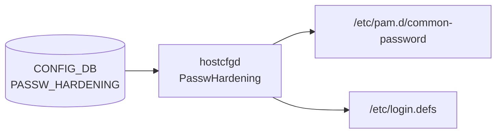

# PASSW_HARDENING テーブル

## 概要

パスワード複雑度・有効期限・履歴ポリシーを [CONFIG_DB](../../reference/glossary.md#term-config_db) に保持するテーブル[^1]。
`hostcfgd` の `PasswHardening` クラスが購読し、Linux PAM 設定ファイル (`/etc/pam.d/common-password`) と `/etc/login.defs` を書き換える。`state=enabled` のときのみポリシーが有効化される。

<!-- cdb-mermaid -->
### データフロー (自動生成)



!!! note "凡例"
    CONFIG_DB から SAI までの典型経路を `docs/reference/config-db-orch-map.md` から機械生成したミニ図。詳細・例外は本ページ本文と対応表を参照。
<!-- /cdb-mermaid -->

## key 構造

```text
PASSW_HARDENING|POLICIES
```

シングルトン (`POLICIES` の 1 行のみ)。

## フィールド

| フィールド | 型 | 既定 | 説明 |
|-----------|----|------|------|
| `state` | `enabled`/`disabled` | `disabled` | パスワードポリシー強制の有効化フラグ |
| `expiration` | int (-1..365) | `180` | パスワード有効期限 (日)。`-1` で無効 |
| `expiration_warning` | int (-1..30) | `15` | 期限切れ前警告日数。`-1` で無効 |
| `history_cnt` | uint (1..100) | `10` | 再利用禁止する過去パスワード数 |
| `len_min` | uint (1..32) | `8` | パスワード最短文字数 |
| `reject_user_passw_match` | boolean | `true` | ユーザ名と一致するパスワードを拒否 |
| `lower_class` | boolean | `true` | 小文字 (a-z) 1 文字以上を要求 |
| `upper_class` | boolean | `true` | 大文字 (A-Z) 1 文字以上を要求 |
| `digits_class` | boolean | `true` | 数字 (0-9) 1 文字以上を要求 |
| `special_class` | boolean | `true` | 特殊文字 1 文字以上を要求 |

<!-- defaults -->
## フィールド暗黙デフォルト (Phase A — コード由来)

YANG `default` 文はプロビジョニング時 (`init_cfg.json.j2` 展開 → DB 書き込み) に適用される。
以下は **DB エントリ自体がない場合** のランタイム fallback を per-field で示す。

| フィールド | YANG default | init_cfg.json.j2 | コード fallback (DB なし / `state=disabled`) |
|-----------|-------------|-----------------|----------------------------------------------|
| `state` | `"disabled"` | `"disabled"` | `passw_policies={}` → PAM hardening 無効 (Linux OS デフォルト) |
| `expiration` | なし | `"180"` | `passw_policies.get('expiration', -1)` → `-1`; `state=disabled` 時は `LINUX_DEFAULT_PASS_MAX_DAYS=99999` |
| `expiration_warning` | なし | `"15"` | `passw_policies.get('expiration_warning', -1)` → `-1`; `state=disabled` 時は `LINUX_DEFAULT_PASS_WARN_AGE=7` |
| `history_cnt` | なし | `"10"` | `policies={}` → PAM `pam_pwhistory` 設定なし (履歴制限なし) |
| `len_min` | なし | `"8"` | `policies={}` → PAM `pam_pwquality` 設定なし (OS デフォルト) |
| `reject_user_passw_match` | なし | `"true"` | `policies={}` → PAM に渡されない (チェックなし) |
| `lower_class` | なし | `"true"` | `policies={}` → クラス要件なし |
| `upper_class` | なし | `"true"` | `policies={}` → クラス要件なし |
| `digits_class` | なし | `"true"` | `policies={}` → クラス要件なし |
| `special_class` | なし | `"true"` | `policies={}` → クラス要件なし |

**コード根拠**:
- `PasswHardening.__init__()`: `sonic-host-services/scripts/hostcfgd:873-879` — `passw_policies_default = {}` / `passw_policies = {}`
- `set_passw_hardening_policies()`: `sonic-host-services/scripts/hostcfgd:934-944` — `LINUX_DEFAULT_PASS_MAX_DAYS=99999`, `LINUX_DEFAULT_PASS_WARN_AGE=7`, fallback `-1`
- `init_cfg.json.j2` 初期値: `sonic-buildimage/files/build_templates/init_cfg.json.j2` (PASSW_HARDENING セクション)
- YANG スキーマ: `sonic-buildimage/src/sonic-yang-models/yang-models/sonic-passwh.yang:25-73`
- テストベクタ確認: `sonic-host-services/tests/hostcfgd/test_passwh_vectors.py:8-23`

<!-- /defaults -->

<!-- ordering -->
## 書込み順依存 (Phase B)

`hostcfgd` (`PasswHardening`) の `passw_policies_update()` はイベントごとに PAM ファイル (`/etc/pam.d/common-password`) と `/etc/login.defs` を**丸ごと再生成**する。このため書き込み順序が中間状態の整合性に直結する。

### 検出された順序依存

| # | 依存関係 | 方向 | 緩和策 |
|---|----------|------|--------|
| 1 | `PASSW_HARDENING` は `wait_till_system_init_done()` 完了後に読み込まれる | 強制後行（PAM subsystem 確認後のみ） | hostcfgd が自動的に待機するため、オペレータ操作は不要 |
| 2 | CLI で `state` → 他フィールドの順に個別更新すると中間状態が発生する | 推奨順序あり（`state=enabled` を最後に設定） | `state=disabled` の間は PAM hardening が適用されないため、中間状態でも管理アクセスは維持される |
| 3 | `expiration=0` を書く前に `state=enabled` を設定すると、次回のパスワード変更まで即時失効が強制される | 副作用に注意 | 変更前に `state=disabled` にしてから `expiration` を更新し、最後に `state=enabled` を設定すること |
| 4 | `PASSW_HARDENING` と `AAA` は独立したクラスで別の PAM ファイルを管理 (`common-password` vs `common-auth`) | 相互依存なし | 順序制約なし |

### 主要な制約詳細

**推奨書き込み順 (ポリシー一括変更時)**:
1. `state=disabled` を先に設定して hardening を一時停止
2. `expiration` / `expiration_warning` / `history_cnt` / `len_min` / クラス要件フィールドを更新
3. `state=enabled` を最後に設定

各フィールド更新のたびに `modify_passw_conf_file()` が呼ばれ、PAM ファイルが即時書き換えられる。CLI で 1 フィールドずつ設定すると中間状態のファイルが生成されるが、`state=disabled` の間は hardening が適用されないためユーザへの影響は最小化される（evidence: `hostcfgd:887-912`）。

**hostcfgd 起動時の順序保証**: `load()` は `HostConfigDaemon.load()` から呼ばれ、`wait_till_system_init_done()` (`systemctl is-system-running --wait`) の完了後に実行される。PAM サブシステムが安定してから `PasswHardening.load()` が走るため、起動時の PAM ファイル書き換えは安全に行われる（evidence: `hostcfgd:2229-2270`）。

**login.defs の冪等性**: `is_passwd_aging_expire_update()` が `/etc/login.defs` の現在値と比較し、差分がある場合のみ `sed` / `chage` を実行する。冗長な SET イベントによる副作用は発生しない（evidence: `hostcfgd:988-1010`）。

<!-- /ordering -->

## 購読者

- `hostcfgd` (`host-services` パッケージ)。`PasswHardening.load()` が `PASSW_HARDENING` テーブルを読み込み、Jinja2 テンプレート (`common-password.j2`) を展開して `/etc/pam.d/common-password` を書き換え、`/etc/login.defs` の `PASS_MAX_DAYS` / `PASS_WARN_AGE` を `sed` で更新する

## 関連 CONFIG_DB / YANG / CLI

- 関連 CLI: `config passw-hardening policies state` / `config passw-hardening policies expiration` 等
- 関連 [YANG](../../reference/glossary.md#term-yang): `sonic-passwh`

<!-- cdb-exceptions -->
## 例外条件・特殊挙動

| 条件 | 挙動 |
|------|------|
| `data == {}` | `passw_policies = {}` にリセット → PAM hardening 無効化 |
| `state=disabled` | PAM テンプレートは hardening なしで生成; `/etc/login.defs` は `LINUX_DEFAULT_*` 値にリセット |
| `expiration=0` | パスワード即時失効 (chage -M 0 を全ユーザに適用) |
| `expiration=-1` | パスワード有効期限なし |
| `expiration_warning=-1` | 警告なし |
| POLICIES キー以外 | `passw_policies_update()` で key != 'POLICIES' のため `passw_policies` は更新されない |
| `chage` コマンド失敗 | `syslog ERR` のみ; 次回変更時に再試行はしない |

<!-- evidence: sonic-net/sonic-host-services/scripts/hostcfgd:887-909 -->
<!-- /cdb-exceptions -->

<!-- value-behavior -->
## 値依存挙動マトリクス

### `state` (enum `enabled`/`disabled`)

| 値 | 効果 | evidence |
|---|---|---|
| `enabled` | Jinja2 テンプレートが `passw_policies` を参照して PAM 設定を生成; `/etc/login.defs` に `expiration`/`expiration_warning` を書き込む | `hostcfgd:937-958` |
| `disabled` | PAM テンプレートは hardening なし (Linux OS デフォルト) で生成; `/etc/login.defs` は `LINUX_DEFAULT_PASS_MAX_DAYS=99999` / `LINUX_DEFAULT_PASS_WARN_AGE=7` にリセット | `hostcfgd:934-936` |

### boolean フィールド (`lower_class` / `upper_class` / `digits_class` / `special_class` / `reject_user_passw_match`)

- `"True"` / `"true"` / `"1"` → `is_true()` で Python `True` に正規化 → PAM `pam_pwquality.so` / `pam_cracklib.so` に対応オプションを渡す
- `"False"` / `"false"` / `"0"` → `False` → 当該クラス要件をスキップ

### 複合条件

- `state=disabled` のときは `lower_class`/`upper_class` 等の値に関わらず PAM hardening は適用されない
- `state=enabled` でも `passw_policies` が `{}` の場合は PAM ファイルが hardening なしで生成される (DB に POLICIES 行がない場合)
<!-- /value-behavior -->

<!-- ref-triangle:start -->

## 関連リファレンス

- [YANG](../../reference/glossary.md#term-yang): `sonic-passwh`

<!-- ref-triangle:end -->

## 引用元

[^1]: [YANG](../../reference/glossary.md#term-yang) 定義: `sonic-passwh.yang`. <https://github.com/sonic-net/sonic-buildimage/blob/9ea932ec2e18f35e58268ec2e4456b1d4afd65cd/src/sonic-yang-models/yang-models/sonic-passwh.yang>

## 関連ページ
- [CONFIG_DB index](index.md)

<!-- ops-hint -->
## 運用ヒント

### 典型値

- key 形式: `PASSW_HARDENING|POLICIES`
- `state=enabled` で全ポリシーを init_cfg デフォルト値のまま適用

### よくある誤設定

- `state=disabled` のまま他フィールドを設定しても PAM には反映されない
- `expiration=0` はパスワード即時失効を意味するため注意

### 確認コマンド

```bash
sonic-db-cli CONFIG_DB hgetall 'PASSW_HARDENING|POLICIES'
show passw-hardening policies
```
<!-- /ops-hint -->


<!-- runtime-trace -->
## 実コンテナ動作トレース

### 段階 1 — Consumer 登録

`hostcfgd` の `PasswHardening` が CONFIG_DB の `PASSW_HARDENING` テーブルを購読する。

`PASSW_HARDENING` テーブルの key は `POLICIES` のみ (シングルトン)。

### 段階 2 — CFG→PAM 翻訳

`passw_policies_update()` が `POLICIES` エントリを受け取り、boolean フィールドを `is_true()` で正規化して `self.passw_policies` に格納。
`modify_passw_conf_file()` が `passw_policies_default` (空 dict) に `passw_policies` をマージし、Jinja2 テンプレート `common-password.j2` を展開して `/etc/pam.d/common-password` を上書きする。

### 段階 3 — login.defs 更新

`set_passw_hardening_policies()` が `state=enabled` 時に `sed` コマンドで `/etc/login.defs` の `PASS_MAX_DAYS` / `PASS_WARN_AGE` を更新し、`chage` コマンドで既存ユーザのパスワード有効期限を変更する。

### 段階 4 — タイミングと副作用

**適用タイミング**: CONFIG_DB 変化を検知次第即時にファイル書き換え。次回ログイン / パスワード変更時から新ポリシーが適用される。

**副作用**: 既存パスワードへの即時強制適用なし。`state=enabled` に変更すると全ユーザの `chage` が実行される。
<!-- /runtime-trace -->

<!-- entry-points -->
## 書き込み入り口 (Direction A)

対象テーブル: `PASSW_HARDENING`

### CLI
- `config passw-hardening policies state <state>`
- `config passw-hardening policies expiration <days>`
- `config passw-hardening policies expiration-warning <days>`
- `config passw-hardening policies history-cnt <count>`
- `config passw-hardening policies len-min <length>`
- `config passw-hardening policies reject-user-passw-match <true|false>`
- `config passw-hardening policies lower-class <true|false>`
- `config passw-hardening policies upper-class <true|false>`
- `config passw-hardening policies digits-class <true|false>`
- `config passw-hardening policies special-class <true|false>`
  - ソース: `sonic-utilities/config/plugins/sonic-passwh_yang.py`

### minigraph / sonic-cfggen
- なし

### ビルド時デフォルト (init_cfg / j2 テンプレート)
- `init_cfg.json.j2` に `PASSW_HARDENING|POLICIES` の全フィールドが定義済み

### ハードコードデフォルト
- `LINUX_DEFAULT_PASS_MAX_DAYS = 99999` (`hostcfgd:57`)
- `LINUX_DEFAULT_PASS_WARN_AGE = 7` (`hostcfgd:58`)

### ランタイム注入 (デーモン自動書き込み)
- なし
<!-- /entry-points -->
