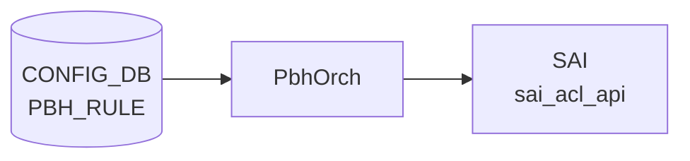

# PBH_RULE テーブル

## 概要

`PBH_RULE` は [Policy Based Hashing (PBH)](pbh.md) のルールエントリを定義する [CONFIG_DB](../../reference/glossary.md#term-config_db) テーブル。`PBH_TABLE` 配下に配置され、packet の match 条件 (GRE key / EtherType / IP protocol / IPv6 next-header / L4 dst port / inner EtherType) と priority、適用する `PBH_HASH` プロファイルを保持する[^1]。`PbhOrch` が `SAI ACL entry` として展開し、マッチしたパケットに指定の [ECMP](../../reference/glossary.md#term-ecmp) / [LAG](../../reference/glossary.md#term-lag) hash profile を適用する。

<!-- cdb-mermaid -->
### データフロー (自動生成)



!!! note "凡例"
    CONFIG_DB から SAI までの典型経路を `docs/reference/config-db-orch-map.md` から機械生成したミニ図。詳細・例外は本ページ本文と対応表を参照。
<!-- /cdb-mermaid -->

<!-- ordering -->
## 書込み順依存 (Phase B)

<!-- evidence: sonic-swss/orchagent/pbhorch.cpp:1539-1550 (deployPbhTasks), pbhmgr.cpp:81-113 (validateDependencies), pbhorch.cpp:941-946, 1288-1303 -->

`PBH_RULE` の [SAI](../../reference/glossary.md#term-sai) 反映は複数の外部状態（PortsOrch 初期化、`PBH_TABLE`、`PBH_HASH`）に依存する。違反時の挙動はすべて自動 retry（自動回復）で、エントリは削除されない。

### 依存 1: PortsOrch 初期化（必須先行・グローバル）

```
PortsOrch::allPortsReady() == true  先行
  ↓
PBH_TABLE / PBH_RULE / PBH_HASH / PBH_HASH_FIELD のどの SET も処理開始
```

`PbhOrch::doTask()` (`pbhorch.cpp:1808`) は `this->portsOrch->allPortsReady()` が false の間は即 return。PBH 関連の全 [CONFIG_DB](../../reference/glossary.md#term-config_db) エントリは PortsOrch の `PORT` 初期化完了を待つ。

**違反時**: 書込み自体は CONFIG_DB に残り、PortsOrch 完了後の最初のイベントループで一括処理（自動回復）。

### 依存 2: PBH_TABLE 先行（必須先行・自動回復あり）

```
PBH_TABLE|<table_name>  SET 完了（SAI ACL table OID 割当済み）  先行
  ↓
PBH_RULE|<table_name>|<rule_name>  SET
```

`deployPbhRuleSetupTasks()` (`pbhorch.cpp:941-946`) は `validateDependencies(rule)` を呼ぶ。`pbhmgr.cpp:83-88` にて `this->tableMap.find(rule.table)` が `cend()` なら `return false` → NOTICE ログ (`"object has missing dependencies: adding a retry"`) → `it++` で `pendingSetupMap` に保留し retry loop。

**違反時**: `PBH_TABLE` が後から処理されると次の `deployPbhTasks()` 呼び出しで自動 setup。CONFIG_DB エントリは保持されたまま。

### 依存 3: PBH_HASH 先行（必須先行・自動回復あり）

```
PBH_HASH_FIELD|<field_name>  SET 完了
  ↓
PBH_HASH|<hash_name>  SET 完了（SAI hash OID 割当済み）
  ↓
PBH_RULE|<table_name>|<rule_name>  SET（hash = <hash_name>）
```

`validateDependencies(rule)` (`pbhmgr.cpp:88-94`) はさらに `this->hashMap.find(rule.hash.value)` が `cend()` なら `return false`。`PBH_HASH` 自体も `PBH_HASH_FIELD` を依存するため、全依存の解決順は **`HASH_FIELD → HASH → TABLE → RULE`**。

**違反時**: `PBH_HASH` が後から処理されると自動 setup。PBH_HASH_FIELD が先に存在しないと PBH_HASH も retry loop に入る（3 段連鎖）。

### 依存 4: deployPbhTasks() の固定処理順序

```
(Setup)  HASH_FIELD → HASH → TABLE → RULE
(Remove) RULE → TABLE → HASH → HASH_FIELD
```

`deployPbhTasks()` (`pbhorch.cpp:1539-1550`) は毎回この順序で pending map を処理する。CONFIG_DB に RULE だけ先に書いた場合も、同一イベントループ内で HASH_FIELD/HASH/TABLE の setup が先に完了していれば、RULE の依存チェックが通り一括 setup される。

### 依存 5: 参照カウントによる DEL 順序制約

```
PBH_RULE|<table_name>|<rule_name>  DEL（先行）
  ↓
PBH_TABLE|<table_name>  DEL  または  PBH_HASH|<hash_name>  DEL
```

`createPbhRule` 成功時に `incRefCount(rule)` が `PBH_TABLE` と `PBH_HASH` の refCount を +1 する (`pbhmgr.cpp:114-135`)。`removePbhTable/removePbhHash` は `hasDependencies()` (`pbhmgr.cpp:75-78`) が true（refCount > 0）の間は NOTICE ログ後 retry（削除保留）。`PBH_RULE` を先に DEL して `decRefCount` を呼ぶことで refCount が 0 になり、`PBH_TABLE` / `PBH_HASH` の削除が可能になる。

**違反時**: `PBH_TABLE` / `PBH_HASH` の DEL が `hasDependencies()` で止まり続ける（永続的に保留）。`PBH_RULE` を DEL した後に自動回復。

### 依存 6: 同一 key の task 重複ガード

`doPbhRuleTask()` (`pbhorch.cpp:1645-1650`) は `pbhTaskExists(rule)` が true の場合 WARN ログ後 `it++` で再試行。高頻度 SET で同一 key が `m_toSync` に積まれた場合、先の task 完了まで後続 SET は待機する。

### 依存 7: Mellanox — UPDATE 内部順序（hash / packet_action 変更時）

`updatePbhRule()` (`pbhorch.cpp:839-863`): `ASIC_VENDOR=mellanox` かつ変更フィールドに `hash` または `packet_action` が含まれる場合、`AclRulePbh::disableAction()` で既存 [ACL](../../reference/glossary.md#term-acl) action を先に無効化してから `updateAclRule()` を呼ぶ。`disableAction()` 失敗時は UPDATE 自体が `return false`。GENERIC platform では不要。

### 順序依存サマリ

| # | 依存関係 | 方向 | 違反時の挙動 |
|---|----------|------|-------------|
| 1 | PortsOrch 初期化 → PBH_RULE 処理 | 必須先行（グローバル） | 自動回復（初期化完了後に一括処理） |
| 2 | PBH_TABLE → PBH_RULE | 必須先行 | retry loop — TABLE 作成後に自動 setup |
| 3 | HASH_FIELD → HASH → PBH_RULE | 必須先行（3 段） | retry loop — 全依存解決後に自動 setup |
| 4 | deployPbhTasks() 固定順序 | HASH_FIELD→HASH→TABLE→RULE | 自動（コード内固定） |
| 5 | RULE DEL → TABLE / HASH DEL | DEL 時の必須先行 | 違反時は TABLE/HASH DEL が保留継続 |
| 6 | 同一 key の task 重複 | SET 時の待機 | retry loop（先 task 完了後に自動処理） |
| 7 | Mellanox: disableAction → updateAclRule | UPDATE 内部順序 | GENERIC では不要 |

<!-- /ordering -->

<!-- cross-refs -->
## 暗黙参照テーブル (Phase C)

`PBH_RULE` は CONFIG_DB の **読み手（consumer）専用**テーブルで、`PbhOrch` が書き込む [STATE_DB](../../reference/glossary.md#term-state_db) / [APPL_DB](../../reference/glossary.md#term-appl_db) エントリは存在しない。ここでの暗黙参照は、[SAI](../../reference/glossary.md#term-sai) 反映の前提となる他テーブル・他 Orch への依存を指す。

<!-- evidence: pbhorch.cpp:90-95 (constructor), pbhorch.cpp:633 (addAclRule), pbhorch.cpp:1808 (allPortsReady), pbhmgr.cpp:83-135 (validateDependencies / incRefCount) -->

| 参照先テーブル / リソース | [YANG](../../reference/glossary.md#term-yang) leafref | 実行時依存 | 非充足時の挙動 |
|--------------------------|:------------:|----------|--------------|
| `PBH_TABLE` (CONFIG_DB) | ✅ | `validateDependencies(rule)` が `tableMap.find(rule.table)` で存在確認（`pbhmgr.cpp:83-88`）。成功後 `incRefCount` が `PBH_TABLE` の refCount を +1 | retry loop — TABLE 作成後に自動回復 |
| `PBH_HASH` (CONFIG_DB) | ✅ | `validateDependencies(rule)` が `hashMap.find(rule.hash.value)` で存在確認（`pbhmgr.cpp:88-94`）。成功後 `incRefCount` が `PBH_HASH` の refCount を +1 | retry loop — HASH 作成後に自動回復 |
| `AclOrch`（Orch 間依存） | ✗ | `createPbhRule()` が `this->aclOrch->addAclRule(pbhRule, rule.table)` を呼ぶ（`pbhorch.cpp:633`）。`updatePbhRule()` は `getAclRule()` + `updateAclRule()`、`removePbhRule()` は `removeAclRule()` を呼ぶ | ERROR ログ + `return false` → retry loop |
| `PortsOrch`（グローバルゲート） | ✗ | `PbhOrch::doTask()` (`pbhorch.cpp:1808`) が `portsOrch->allPortsReady()` を確認。false の間は PBH 全テーブルの処理がブロック | 全 PBH 処理ブロック — PortsOrch 完了後に自動回復 |
| SAI [ACL](../../reference/glossary.md#term-acl) API（間接） | ✗ | `AclOrch::addAclRule()` 内で `sai_acl_api->create_acl_entry()` を呼ぶ。SAI 失敗は `addAclRule()` → `createPbhRule()` → retry loop として伝播 | ERROR ログ + retry loop |

!!! note "DEL 方向の逆参照"
    `PBH_TABLE` および `PBH_HASH` が `PBH_RULE` の生存中に DEL されても、refCount > 0 のため `hasDependencies()` (`pbhmgr.cpp:75-78`) が削除を保留する。`PBH_RULE` を先に DEL して `decRefCount` を呼ぶことで refCount が 0 に戻り、`PBH_TABLE` / `PBH_HASH` の削除が可能になる（Phase B 依存 5 も参照）。

詳細な調査メモは `meta/_intermediate/cdb-flow/pbh-rule-cross-refs.md` を参照。
<!-- /cross-refs -->

<!-- failure -->
## 失敗挙動 (Phase D)

`PBH_RULE` の SET / UPDATE / DEL 処理（`PbhOrch` / `pbhmgr` / `pbhrule` / `pbhcap`）における失敗は、(A) parse 段階の入力値エラー、(B) バリデーション失敗（match 欠如・必須フィールド欠損）、(C) SAI 作成・更新・削除失敗、(D) capability 未サポート、(E) 依存関係未解決（retry loop）の 5 系統に分類される。

証跡: `meta/_intermediate/cdb-flow/pbh-phaseD-failure.md`

### A. フィールド Parse 失敗（pbhmgr.cpp — silent skip / return false）

`parsePbhRule()` は各 match フィールドの値フォーマットを検証する。失敗時は `return false` で当該 RULE が SAI に反映されない。

| 失敗条件 | ログ | 動作 |
|---|---|---|
| match フィールドの値が空文字列 | `"Failed to parse field(%s): empty value is prohibited"` (ERROR) | `return false` — RULE 全体が SAI 未反映 |
| `gre_key` が `0x.../0x...` 形式でない（mask 欠如等） | `"Failed to parse field(%s): invalid value(%s)"` (ERROR) | `return false` |
| hex フィールドに `0x` プレフィックスがない / 数値変換例外 | `"Failed to parse field(%s): <exception>"` (ERROR) | `return false` |
| 未知フィールド名 | `"Unknown field(%s): skipping ..."` (WARN) | フィールドをスキップ（RULE は処理継続） |

### B. バリデーション失敗（pbhmgr.cpp:validatePbhRule / pbhrule.cpp:validate）

| 失敗条件 | ログ | 動作 |
|---|---|---|
| `priority` フィールド欠損（必須） | `"Validation error: missing mandatory field(priority)"` (ERROR) | `return false` — RULE 全体が SAI 未反映 |
| `hash` フィールド欠損（必須） | `"Validation error: missing mandatory field(hash)"` (ERROR) | `return false` — RULE 全体が SAI 未反映 |
| match field が 1 つも指定されない（`AclRulePbh::validate()`） | `"Failed to validate rule: invalid parameters"` (ERROR) | `return false` — SAI create_acl_entry が呼ばれない |
| action 数が 1 でない | 同上 | `return false` |
| `packet_action` 省略（非必須） | `"Missing non mandatory field(packet_action): setting default value(SET_ECMP_HASH)"` (NOTICE) | デフォルト `SET_ECMP_HASH` を注入して継続 |
| `flow_counter` 省略（非必須） | `"Missing non mandatory field(flow_counter): setting default value(DISABLED)"` (NOTICE) | デフォルト `DISABLED` を注入して継続 |

!!! note "YANG との discrepancy"
    YANG は全 match フィールドを optional と定義するが、実装側 (`AclRulePbh::validate()`) では最低 1 フィールドが必須。YANG バリデーションは通過しても orchagent が reject するケースがある。

### C. SAI 作成・更新・削除失敗（pbhorch.cpp）

#### SET（新規作成）失敗

| 失敗条件 | ログ | 動作 |
|---|---|---|
| 同一 key が既存（重複 SET） | `"Failed to create PBH rule(%s) in SAI: object already exists"` (ERROR) | `return false` |
| `priority` の SAI 属性設定失敗 | `"Failed to configure PBH rule(%s) priority"` (ERROR) | `return false` |
| match フィールド設定失敗（GRE_KEY / ETHER_TYPE 等） | `"Failed to configure PBH rule(%s) match: <FIELD>"` (ERROR) | `return false` |
| action 設定失敗 | `"Failed to configure PBH rule(%s) action"` (ERROR) | `return false` |
| `validate()` 失敗（match=0 or action≠1） | `"Failed to validate PBH rule(%s)"` (ERROR) | `return false` |
| SAI `create_acl_entry()` 失敗 | `"Failed to create PBH rule(%s) in SAI"` (ERROR) | `return false` |
| 内部キャッシュ追加失敗 | `"Failed to add PBH rule(%s) to internal cache"` (ERROR) | `return false` |
| refCount 追加失敗 | `"Failed to add PBH rule(%s) dependencies"` (ERROR) | `return false` |

#### UPDATE 失敗

| 失敗条件 | ログ | 動作 |
|---|---|---|
| 対象 key が不在 | `"Failed to update PBH rule(%s) in SAI: object doesn't exist"` (ERROR) | `return false` |
| capability ADD 不可 | `"Failed to validate PBH rule(%s) added fields: unsupported capabilities"` (ERROR) | `return false` |
| capability UPDATE 不可 | `"Failed to validate PBH rule(%s) updated fields: unsupported capabilities"` (ERROR) | `return false` |
| capability REMOVE 不可 | `"Failed to validate PBH rule(%s) removed fields: unsupported capabilities"` (ERROR) | `return false` |
| Mellanox: `disableAction()` 失敗（`hash` / `packet_action` 変更時） | `"Failed to disable PBH rule(%s) action"` (ERROR) | `return false`（UPDATE 全体が中断） |
| SAI `update_acl_entry()` 失敗 | `"Failed to update PBH rule(%s) in SAI"` (ERROR) | `return false` |

#### DEL 失敗

| 失敗条件 | ログ | 動作 |
|---|---|---|
| 対象 key が不在 | `"Failed to remove PBH rule(%s) from SAI: object doesn't exist"` (ERROR) | `return false` |
| SAI `remove_acl_entry()` 失敗 | `"Failed to remove PBH rule(%s) from SAI"` (ERROR) | `return false` |

いずれの `return false` も `doPbhRuleTask()` 内で `it++`（retry loop）として扱われる。CONFIG_DB エントリは保持されたまま次の `deployPbhTasks()` 呼び出しで再試行される。SAI 側の永続的エラー（重複・存在しない等）では無限 retry に陥ることがある。

### D. Capability 未サポート（pbhcap.cpp:validatePbhRuleCap）

`pbhcap.cpp` の `validatePbhRuleCap()` は各フィールドの ADD / UPDATE / REMOVE 操作がプラットフォームでサポートされているかを確認する。

| 失敗条件 | ログ | 動作 |
|---|---|---|
| フィールド操作（ADD/UPDATE/REMOVE）が capability で未サポート | `"Failed to validate field(%s): capability(%s) is not supported"` (ERROR) | `return false` — UPDATE 全体が中断 |
| 未知の [ASIC](../../reference/glossary.md#term-asic) vendor | `"Failed to initialize PBH capabilities: unknown ASIC vendor"` (ERROR) | `return false` |

- ASIC_VENDOR 未設定時は GENERIC platform へ fallback（`pbhcap.cpp:297-318`）
- `validatePbhRuleCap()` の失敗は `createPbhRule()` / `updatePbhRule()` 経由で retry loop として伝播する

### E. 依存関係未解決（retry loop — 自動回復）

依存テーブル（`PBH_TABLE` / `PBH_HASH`）が未存在の場合:

| 失敗条件 | ログ | 動作 |
|---|---|---|
| `validateDependencies()` が false（TABLE または HASH が未作成） | `"object has missing dependencies: adding a retry"` (NOTICE) | `pendingSetupMap` に保留 → 依存解決後に自動回復 |

依存が解決されるまで SAI への反映は行われない（CONFIG_DB エントリは保持）。

### 失敗時の SAI 状態サマリ

| 失敗シナリオ | CONFIG_DB | SAI ACL entry | [orchagent](../../reference/glossary.md#term-orchagent) 状態 |
|---|---|---|---|
| parse / validation 失敗（必須フィールド欠損等） | 残存 | 未作成 | 継続（ERROR ログ、retry） |
| SAI create 失敗（重複・API エラー） | 残存 | 未作成 | 継続（ERROR ログ、retry） |
| SAI update 失敗（capability 不足等） | 残存 | 更新前の状態を維持 | 継続（ERROR ログ、retry） |
| capability 未サポート | 残存 | 変更されない | 継続（ERROR ログ） |
| 依存テーブル未存在 | 残存 | 未作成（保留中） | 継続（retry loop、自動回復） |

<!-- /failure -->

<!-- constants -->
## ハードコード定数 (Phase E)

<!-- evidence: meta/_intermediate/cdb-flow/pbh-rule-constants.md -->
<!-- source: sonic-swss/orchagent/pbh/pbhschema.h, pbhmgr.cpp, pbhrule.cpp, pbhcap.cpp -->

`PBH_RULE` 処理に関係するハードコード定数の一覧。いずれも CONFIG_DB / [YANG](../../reference/glossary.md#term-yang) では設定変更不可か、実装側のみで定義される値である。

### match フィールドの暗黙 mask 値

`parsePbhRule()` (`pbhmgr.cpp`) は `ether_type` / `ip_protocol` / `ipv6_next_header` / `l4_dst_port` / `inner_ether_type` の mask を YANG 定義なしにコードでハードコードする。`gre_key` のみユーザが `0x<value>/0x<mask>` 形式で明示指定する。

| フィールド | ハードコード mask | ソース |
|-----------|----------------|--------|
| `ether_type` | `0xFFFF`（16 bit 完全一致） | `pbhmgr.cpp:558` |
| `ip_protocol` | `0xFF`（8 bit 完全一致） | `pbhmgr.cpp:583` |
| `ipv6_next_header` | `0xFF`（8 bit 完全一致） | `pbhmgr.cpp:608` |
| `l4_dst_port` | `0xFFFF`（16 bit 完全一致） | `pbhmgr.cpp:633` |
| `inner_ether_type` | `0xFFFF`（16 bit 完全一致） | `pbhmgr.cpp:658` |

!!! note "discrepancy: YANG に mask 仕様なし"
    YANG (`sonic-pbh.yang`) はこれら match フィールドの型を hex 文字列として定義するが、mask の値域については記述しない。实際に適用される完全一致 mask はコードのみで決定され、YANG 経由で変更できない。

### 固定文字列定数 (pbhschema.h)

| 定数 | 値 | 用途 |
|------|----|------|
| `PBH_RULE_PACKET_ACTION_SET_ECMP_HASH` | `"SET_ECMP_HASH"` | `packet_action` の [ECMP](../../reference/glossary.md#term-ecmp) ハッシュ適用値 |
| `PBH_RULE_PACKET_ACTION_SET_LAG_HASH` | `"SET_LAG_HASH"` | `packet_action` の [LAG](../../reference/glossary.md#term-lag) ハッシュ適用値 |
| `PBH_RULE_FLOW_COUNTER_ENABLED` | `"ENABLED"` | `flow_counter` 有効化値 |
| `PBH_RULE_FLOW_COUNTER_DISABLED` | `"DISABLED"` | `flow_counter` 無効化値（デフォルト） |

### デフォルト値の注入 (pbhmgr.cpp:validatePbhRule)

`packet_action` / `flow_counter` が CONFIG_DB エントリに存在しない場合、`validatePbhRule()` が以下の値を注入する。YANG の `default` 文と一致するため discrepancy はない。

| フィールド | 注入デフォルト | ソース |
|-----------|-------------|--------|
| `packet_action` | `"SET_ECMP_HASH"` | `pbhmgr.cpp:997-1009` |
| `flow_counter` | `"DISABLED"` | `pbhmgr.cpp:1012-1023` |

### ACL ステージ固定: INGRESS

`createPbhAclTable()` (`pbhorch.cpp:260`) は PBH が使用する SAI ACL テーブルを常に `ACL_STAGE_INGRESS` で作成する。EGRESS ステージへの適用は非サポートであり、CONFIG_DB での変更も不可。

### バリデーション制約（YANG 非記述）

`AclRulePbh::validate()` (`pbhrule.cpp:84-90`) が以下の制約をコード側のみで適用する:

| 制約 | 内容 | YANG |
|------|------|------|
| match 件数 >= 1 | match フィールドが 1 つもないルールは reject | 記述なし（YANG は全 match を optional と定義） |
| action 件数 == 1 | action が 0 または 2 以上のルールは reject | 記述なし |

### ASIC_VENDOR 環境変数と capability フォールバック (pbhcap.cpp)

| 定数 | 値 | 用途 |
|------|----|------|
| `PBH_PLATFORM_ENV_VAR` | `"ASIC_VENDOR"` | capability 判定に使用する環境変数名 |
| `PBH_PLATFORM_GENERIC` | `"generic"` | 未知 vendor へのフォールバック platform |
| `PBH_PLATFORM_MELLANOX` | `"mellanox"` | Mellanox 専用 capability 経路 |

`ASIC_VENDOR` が未定義または未知値の場合は WARN ログを出力して `generic` へフォールバックする (`pbhcap.cpp:297-298`)。エラーにはならない。Mellanox 以外はすべて generic 扱いとなり、UPDATE 時の `disableAction()` ステップが不要になる。

<!-- /constants -->

<!-- side-effects -->
## 副次 DB 書込 (Phase F)

`PbhOrch` が `PBH_RULE` の SET / DEL を処理した後に CONFIG_DB 以外の DB へ書き込む副次エントリを整理する。

<!-- evidence: meta/_intermediate/cdb-flow/pbh-rule-side-effects.md -->
<!-- source: sonic-swss/orchagent/pbhorch.cpp:633, aclorch.cpp:4980-4983,6040-6048, aclorch.h:45,116, pbh/pbhrule.h:8 -->

### COUNTERS_DB / `ACL_COUNTER_RULE_MAP` (flow_counter=ENABLED 時のみ)

`AclRulePbh` はデフォルト `createCounter=false` (`pbhrule.h:8`)。`flow_counter=ENABLED` が CONFIG_DB に設定された場合のみ `createCounter=true` として構築され、`addAclRule()` が `registerFlexCounter()` を呼び出す。

| トリガ | 操作 | key / フィールド | evidence |
|--------|------|-----------------|---------|
| `flow_counter=ENABLED` で SET 成功 | `hset` | `ACL_COUNTER_RULE_MAP` の `<table_name>:<rule_name>` = counter OID | `aclorch.cpp:6041` |
| DEL 成功（`flow_counter=ENABLED` だったルール） | `hdel` | `ACL_COUNTER_RULE_MAP` の `<table_name>:<rule_name>` | `aclorch.cpp:6047` |

定数: `COUNTERS_ACL_COUNTER_RULE_MAP = "ACL_COUNTER_RULE_MAP"` (`aclorch.h:45`)。

### FLEX_COUNTER_DB / `ACL_STAT_COUNTER` (flow_counter=ENABLED 時のみ)

`registerFlexCounter()` が `m_flex_counter_manager.setCounterIdList(oid, CounterType::ACL_COUNTER, attrs)` を呼び、[FLEX_COUNTER_DB](../../reference/glossary.md#term-flex_counter_db) にポーリング設定を書き込む。

| トリガ | 操作 | キー | フィールド | evidence |
|--------|------|------|-----------|---------|
| `flow_counter=ENABLED` で SET 成功 | `set` | `ACL_STAT_COUNTER:<counter_oid>` | `ACL_COUNTER_ATTR_ID_LIST=<attrs>` | `aclorch.cpp:6040` |
| DEL 成功（`flow_counter=ENABLED` だったルール） | `del` | `ACL_STAT_COUNTER:<counter_oid>` | — | `aclorch.cpp:6048` |

定数: `ACL_COUNTER_FLEX_COUNTER_GROUP = "ACL_STAT_COUNTER"` (`aclorch.h:116`)。[FLEX_COUNTER_DB](../../reference/glossary.md#term-flex_counter_db) = 5 (`schema.h:18`)。

!!! note "flow_counter=DISABLED（デフォルト）の場合"
    `flow_counter` 省略時のデフォルトは `DISABLED` (`pbhmgr.cpp:1012-1023`)。`createCounter=false` のため `registerFlexCounter()` は呼ばれず、COUNTERS_DB および FLEX_COUNTER_DB への書き込みは発生しない。

### STATE_DB — 書き込みなし

`setAclRuleStatus()` は `AclOrch::doTask()` の汎用 `ACL_RULE` / `APP_ACL_RULE` 処理経路 (`aclorch.cpp:5668-5726`) からのみ呼ばれる。`PBH_RULE` は `PbhOrch` の独立した処理経路を使い (`createPbhRule()` が `addAclRule()` を直接呼ぶ; `pbhorch.cpp:633`)、`setAclRuleStatus()` は呼ばれない。

→ **[STATE_DB](../../reference/glossary.md#term-state_db) への `ACL_RULE_TABLE` 書き込みは発生しない**。`show pbh rule` の状態確認は PbhOrch 内部キャッシュ (`pbhHlpr`) を参照する。

### 副次書込サマリ

| DB | テーブル名 | 条件 | 操作 | evidence |
|-----|---------|------|------|---------|
| [COUNTERS_DB](../../reference/glossary.md#term-counters_db) | `ACL_COUNTER_RULE_MAP` | `flow_counter=ENABLED` のみ | `hset` / `hdel` | `aclorch.cpp:6041,6047` |
| [FLEX_COUNTER_DB](../../reference/glossary.md#term-flex_counter_db) | `ACL_STAT_COUNTER` | `flow_counter=ENABLED` のみ | `set` / `del` | `aclorch.cpp:6040,6048` |
| [STATE_DB](../../reference/glossary.md#term-state_db) | `ACL_RULE_TABLE` | — | **書き込みなし** | `pbhorch.cpp:633` |
| [APPL_DB](../../reference/glossary.md#term-appl_db) | — | — | **書き込みなし** | — |
| [ASIC_DB](../../reference/glossary.md#term-asic_db) | — | SAI 経由のみ | `syncd` が書き込む（[orchagent](../../reference/glossary.md#term-orchagent) 直接書込なし） | — |

<!-- /side-effects -->

<!-- pubsub -->
## 通信メカニズム (Phase G)

<!-- evidence: meta/_intermediate/cdb-flow/pbh-rule-pubsub.md -->
<!-- source: sonic-swss/orchagent/pbhorch.cpp:88-96, orchdaemon.cpp:552-565, swss-common/orch.cpp:1186-1196, sonic-utilities/show/plugins/pbh.py:191-206,365-391,450-453 -->

### Redis 購読方式

`PbhOrch` は `Orch(connectorList)` でベースクラスに 4 テーブル
（`CFG_PBH_TABLE_TABLE_NAME` / `CFG_PBH_RULE_TABLE_NAME` / `CFG_PBH_HASH_TABLE_NAME` / `CFG_PBH_HASH_FIELD_TABLE_NAME`）
の `TableConnector` リストを渡す（`orchdaemon.cpp:552-565`）。
`Orch::addConsumer()` が CONFIG_DB を検出して **`swss::SubscriberStateTable`**（[Redis](../../reference/glossary.md#term-redis) keyspace 通知ベース）を割り当てる（`orch.cpp:1186-1196`）。

```cpp
// orch.cpp:1186-1196
void Orch::addConsumer(DBConnector *db, string tableName, int pri)
{
    if (db->getDbId() == CONFIG_DB || db->getDbId() == STATE_DB || db->getDbId() == CHASSIS_APP_DB)
        addExecutor(new Consumer(new SubscriberStateTable(db, tableName, DEFAULT_POP_BATCH_SIZE, pri), this, tableName));
    else
        addExecutor(new Consumer(new ConsumerStateTable(db, tableName, gBatchSize, pri), this, tableName));
}
```

| 購読者 | 購読 API | 購読テーブル | バッチサイズ |
|--------|---------|--------------|-----------|
| `orchagent` (`PbhOrch`) | `swss::SubscriberStateTable` | `PBH_RULE` | `DEFAULT_POP_BATCH_SIZE = 128`（ハードコード、`table.h:164`） |

[APPL_DB](../../reference/glossary.md#term-appl_db) で使われる `ConsumerStateTable`（channel ベース PUBLISH/SUBSCRIBE）とは異なり、CONFIG_DB テーブルは keyspace 通知（`__keyspace@4__:PBH_RULE|<table>|<rule>` への `PSUBSCRIBE`）で変更を検知する。`gBatchSize`（`orchagent -b <n>` で上書き可）は CONFIG_DB 側には**適用されない**。

### イベント受信フロー

```
config pbh rule add / sonic-cfggen / gNMI
  ↓ cfgdb.set_entry("PBH_RULE", ...)
CONFIG_DB: HSET "PBH_RULE|<table_name>|<rule_name>" <fields>
  ↓ Redis keyspace event "__keyspace@4__:PBH_RULE|<table_name>|<rule_name>" "hset"
OrchDaemon main loop: m_select->select(&s, 1000ms)
  ↓ Consumer::execute() → SubscriberStateTable::pops()
    └─ HGETALL "PBH_RULE|<table_name>|<rule_name>" で値再取得
PbhOrch::doTask(consumer)  (pbhorch.cpp:1819-1821)
  ↓ tableName == CFG_PBH_RULE_TABLE_NAME で doPbhRuleTask() へ委譲
  ↓ deployPbhTasks()  (pbhorch.cpp:1836)
createPbhRule() → AclOrch::addAclRule() → SAI: sai_acl_api->create_acl_entry()
```

### 読み取り側まとめ

| 読み取り元 | 参照 DB / テーブル | 用途 |
|-----------|----------------|------|
| `show pbh rule` | CONFIG_DB `PBH_RULE`（直読み） | 設定値の表示 (`cfgdb_pipe.get_table()`) |
| `show pbh statistics` | CONFIG_DB `PBH_RULE` + [COUNTERS_DB](../../reference/glossary.md#term-counters_db) `ACL_COUNTER_RULE_MAP` + `COUNTERS:<oid>` | `flow_counter=ENABLED` ルールのパケット / バイト数表示 |

`show pbh rule` は [orchagent](../../reference/glossary.md#term-orchagent) の処理を経由せず CONFIG_DB を直接参照するため、SAI 反映状態とは独立して最新の設定を表示する。`show pbh statistics` の `ACL_COUNTER_RULE_MAP` は `AclOrch::registerFlexCounter()` が `flow_counter=ENABLED` の SET 成功時に書き込む（Phase F 参照）。

### TTL / バックプレッシャー

- TTL: なし（CONFIG_DB は永続）
- バッチサイズ: `DEFAULT_POP_BATCH_SIZE = 128`（`table.h:164`、ハードコード）
- SELECT タイムアウト: 1000 ms（OrchDaemon main loop）
- 依存未解決時は `pendingSetupMap` で自動再試行（TTL なし、無制限 retry）

<!-- /pubsub -->

<!-- platform -->
## プラットフォーム差異 (Phase H)

<!-- evidence: sonic-swss/orchagent/pbh/pbhcap.cpp:107-141 (PbhGenericFieldCapabilities / PbhMellanoxFieldCapabilities), pbhorch.cpp:839-863 (updatePbhRule Mellanox W/A), pbhcap.cpp:286-407 (STATE_DB write), sonic-swss-common/common/schema.h:419 (STATE_PBH_CAPABILITIES_TABLE_NAME) -->

`PBH_RULE` のフィールド操作可否（capability）は `ASIC_VENDOR` 環境変数で決まる。現在コードが識別するプラットフォームは **generic** と **mellanox** の 2 種のみ。その他の vendor は全て generic として扱われる。

### 検出ロジック

`PbhCapabilities::initPbhCapabilities()` (`pbhcap.cpp:310-332`) が `orchagent` 起動時に `std::getenv("ASIC_VENDOR")` を呼ぶ。

```
ASIC_VENDOR == "mellanox"  →  PbhMellanoxFieldCapabilities
ASIC_VENDOR == <その他>    →  PbhGenericFieldCapabilities（WARN ログ後 fallback）
ASIC_VENDOR が未設定       →  PbhGenericFieldCapabilities（WARN ログ後 fallback）
```

`ASIC_VENDOR` の値は `docker-orchagent.service` の環境ファイル（`/etc/sonic/device/<platform>/asic_vendor`）から注入される。

### フィールド capability 差異（PBH_RULE スコープ）

`setPbhDefaults()` は ADD / UPDATE / REMOVE の 3 つを登録する。`insert(UPDATE)` のみは UPDATE 単独で ADD / REMOVE は不可。

| フィールド | generic | mellanox | 備考 |
|-----------|:-------:|:--------:|------|
| `priority` | UPDATE のみ | UPDATE のみ | ADD / REMOVE 不可（SET 時に初期値設定、削除は RULE DEL で） |
| `gre_key` | ADD / UPDATE / REMOVE | ADD / UPDATE / REMOVE | 同一 |
| `ether_type` | ADD / UPDATE / REMOVE | ADD / UPDATE / REMOVE | 同一 |
| `ip_protocol` | ADD / UPDATE / REMOVE | ADD / UPDATE / REMOVE | 同一 |
| `ipv6_next_header` | ADD / UPDATE / REMOVE | ADD / UPDATE / REMOVE | 同一 |
| `l4_dst_port` | ADD / UPDATE / REMOVE | ADD / UPDATE / REMOVE | 同一 |
| `inner_ether_type` | ADD / UPDATE / REMOVE | ADD / UPDATE / REMOVE | 同一 |
| `hash` | UPDATE のみ | UPDATE のみ | 同一 |
| `packet_action` | ADD / UPDATE / REMOVE | ADD / UPDATE / REMOVE | 同一 |
| `flow_counter` | ADD / UPDATE / REMOVE | ADD / UPDATE / REMOVE | 同一 |

`PBH_HASH` スコープの `hash_field_list` については generic では `UPDATE` が登録されるが、`PbhMellanoxFieldCapabilities` ではコンストラクタで `hash_field_list` への挿入が存在せず **空（ADD / UPDATE / REMOVE 全て不可）** になる（`pbhcap.cpp:126-141`）。これは `PBH_HASH` テーブルの制限であり `PBH_RULE` の直接フィールドではないが、`PBH_HASH` の更新が Mellanox で制限される結果 `PBH_RULE` の `hash` フィールド変更時にも影響する（既存 HASH を更新できないため新規 HASH を作り直す必要がある）。

### Mellanox 専用 W/A: disableAction before updateAclRule

Mellanox プラットフォームでは `updatePbhRule()` (`pbhorch.cpp:839-863`) に特別な処理が入る。

```
更新フィールドに "hash" または "packet_action" が含まれる場合:
  AclRulePbh::disableAction()   ← ACL action を一時無効化
    ↓
  AclOrch::updateAclRule()      ← SAI update
```

`disableAction()` は SAI ACL entry の action フィールドを一時的にクリアして Mellanox [ASIC](../../reference/glossary.md#term-asic) の制約（action が SET されている状態での [ECMP](../../reference/glossary.md#term-ecmp)/[LAG](../../reference/glossary.md#term-lag) hash 変更が不可）を回避する。失敗した場合は UPDATE 全体が `return false` となり retry loop に入る。

**generic プラットフォームでは `disableAction()` を呼ばない**。条件分岐は `this->pbhCap.getAsicVendor() == PbhAsicVendor::MELLANOX` で制御される。

### capabilities の STATE_DB 書き込み

`PbhCapabilities::writePbhVendorCapabilitiesToDb()` (`pbhcap.cpp:442-452`) が起動時にフィールド capability 一覧を `STATE_DB` の `PBH_CAPABILITIES|rule` キーへ書き込む（`schema.h:419`: `STATE_PBH_CAPABILITIES_TABLE_NAME = "PBH_CAPABILITIES"`）。

```
STATE_DB:
  PBH_CAPABILITIES|rule
    priority       = "UPDATE"
    gre_key        = "ADD,UPDATE,REMOVE"
    ether_type     = "ADD,UPDATE,REMOVE"
    ip_protocol    = "ADD,UPDATE,REMOVE"
    ipv6_next_header = "ADD,UPDATE,REMOVE"
    l4_dst_port    = "ADD,UPDATE,REMOVE"
    inner_ether_type = "ADD,UPDATE,REMOVE"
    hash           = "UPDATE"
    packet_action  = "ADD,UPDATE,REMOVE"
    flow_counter   = "ADD,UPDATE,REMOVE"
```

この情報は管理ツール（`show pbh` 等）が capability を動的に確認するために使用される。`validatePbhRuleCap()` (`pbhcap.cpp:456-600`) が SET / UPDATE / DEL 時に capability を参照し、未サポート操作を拒否する。

### プラットフォームサマリ

| 差異 | generic | mellanox |
|------|---------|----------|
| `hash` / `packet_action` UPDATE 前に `disableAction()` | 不要 | **必須**（[ASIC](../../reference/glossary.md#term-asic) 制約） |
| `PBH_HASH.hash_field_list` UPDATE | 可能（UPDATE 登録済み） | **不可**（空 capability） |
| `PBH_RULE` フィールド capability | 上表参照 | 上表参照（同一） |
| capability 検出 | `ASIC_VENDOR` 未設定 / 未知 → fallback | `ASIC_VENDOR=mellanox` |

<!-- /platform -->

## key 構造

```text
PBH_RULE|<table_name>|<rule_name>
```

`<table_name>` は `PBH_TABLE.table_name` への leafref。`<rule_name>` は table 内のルール識別子。

## フィールド

| フィールド | 型 | 必須 | 既定値 | 説明 |
|-----------|----|------|--------|------|
| `priority` | uint32 | yes | - | ルール優先度。値が大きいほど優先 |
| `gre_key` | `0x<value>/0x<mask>` 形式 hex string | no | - | GRE key match (value/mask ペア) |
| `ether_type` | `0x<value>` hex uint16 | no | - | EtherType match。mask は実装が `0xFFFF` に固定注入 |
| `ip_protocol` | `0x<value>` hex uint8 | no | - | IPv4 protocol match。mask は `0xFF` に固定注入 |
| `ipv6_next_header` | `0x<value>` hex uint8 | no | - | IPv6 next-header match。mask は `0xFF` に固定注入 |
| `l4_dst_port` | `0x<value>` hex uint16 | no | - | L4 destination port match。mask は `0xFFFF` に固定注入 |
| `inner_ether_type` | `0x<value>` hex uint16 | no | - | inner EtherType match。mask は `0xFFFF` に固定注入 |
| `hash` | leafref → `PBH_HASH.hash_name` | yes | - | 適用する hash プロファイル |
| `packet_action` | enum `SET_ECMP_HASH` / `SET_LAG_HASH` | no | `SET_ECMP_HASH` | ルール action |
| `flow_counter` | enum `ENABLED` / `DISABLED` | no | `DISABLED` | packet / byte カウンタの有効化 |

!!! note "match field の暗黙制約"
    `AclRulePbh::validate()` (`pbhrule.cpp:84-90`) は match field が 1 つも指定されない場合に reject する。YANG は全 match field を optional として定義するが、実装側では最低 1 フィールド必須。

## 購読者

- `orchagent` の `PbhOrch` (`sonic-swss/orchagent/pbhorch.cpp`): [CONFIG_DB](../../reference/glossary.md#term-config_db) の `PBH_RULE` を直接 subscribe して [SAI](../../reference/glossary.md#term-sai) [ACL](../../reference/glossary.md#term-acl) entry へ反映する。

## 関連 CONFIG_DB / YANG / CLI

- 関連 CONFIG_DB: [`PBH_TABLE`](pbh.md)、`PBH_HASH`、`PBH_HASH_FIELD`
- 関連 CLI: `config pbh rule`
- 関連 [YANG](../../reference/glossary.md#term-yang): `sonic-pbh`

## 引用元

[^1]: YANG 定義: `sonic-pbh.yang`. <https://github.com/sonic-net/sonic-buildimage/blob/master/src/sonic-yang-models/yang-models/sonic-pbh.yang>

<!-- glossary-links-injected: f9445b5b4106 -->
