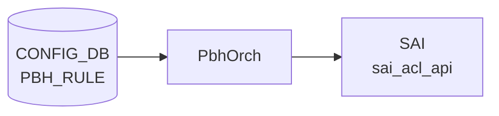

# PBH_RULE テーブル

## 概要

`PBH_RULE` は [Policy Based Hashing (PBH)](pbh.md) のルールエントリを定義する [CONFIG_DB](../../reference/glossary.md#term-config_db) テーブル。`PBH_TABLE` 配下に配置され、packet の match 条件 (GRE key / EtherType / IP protocol / IPv6 next-header / L4 dst port / inner EtherType) と priority、適用する `PBH_HASH` プロファイルを保持する[^1]。`PbhOrch` が `SAI ACL entry` として展開し、マッチしたパケットに指定の ECMP / [LAG](../../reference/glossary.md#term-lag) hash profile を適用する。

<!-- cdb-mermaid -->
### データフロー (自動生成)



!!! note "凡例"
    CONFIG_DB から SAI までの典型経路を `docs/reference/config-db-orch-map.md` から機械生成したミニ図。詳細・例外は本ページ本文と対応表を参照。
<!-- /cdb-mermaid -->

<!-- ordering -->
## 書込み順依存 (Phase B)

<!-- evidence: sonic-swss/orchagent/pbhorch.cpp:1539-1550 (deployPbhTasks), pbhmgr.cpp:81-113 (validateDependencies), pbhorch.cpp:941-946, 1288-1303 -->

`PBH_RULE` の SAI 反映は複数の外部状態（PortsOrch 初期化、`PBH_TABLE`、`PBH_HASH`）に依存する。違反時の挙動はすべて自動 retry（自動回復）で、エントリは削除されない。

### 依存 1: PortsOrch 初期化（必須先行・グローバル）

```
PortsOrch::allPortsReady() == true  先行
  ↓
PBH_TABLE / PBH_RULE / PBH_HASH / PBH_HASH_FIELD のどの SET も処理開始
```

`PbhOrch::doTask()` (`pbhorch.cpp:1808`) は `this->portsOrch->allPortsReady()` が false の間は即 return。PBH 関連の全 CONFIG_DB エントリは PortsOrch の `PORT` 初期化完了を待つ。

**違反時**: 書込み自体は CONFIG_DB に残り、PortsOrch 完了後の最初のイベントループで一括処理（自動回復）。

### 依存 2: PBH_TABLE 先行（必須先行・自動回復あり）

```
PBH_TABLE|<table_name>  SET 完了（SAI ACL table OID 割当済み）  先行
  ↓
PBH_RULE|<table_name>|<rule_name>  SET
```

`deployPbhRuleSetupTasks()` (`pbhorch.cpp:941-946`) は `validateDependencies(rule)` を呼ぶ。`pbhmgr.cpp:83-88` にて `this->tableMap.find(rule.table)` が `cend()` なら `return false` → NOTICE ログ (`"object has missing dependencies: adding a retry"`) → `it++` で `pendingSetupMap` に保留し retry loop。

**違反時**: `PBH_TABLE` が後から処理されると次の `deployPbhTasks()` 呼び出しで自動 setup。CONFIG_DB エントリは保持されたまま。

### 依存 3: PBH_HASH 先行（必須先行・自動回復あり）

```
PBH_HASH_FIELD|<field_name>  SET 完了
  ↓
PBH_HASH|<hash_name>  SET 完了（SAI hash OID 割当済み）
  ↓
PBH_RULE|<table_name>|<rule_name>  SET（hash = <hash_name>）
```

`validateDependencies(rule)` (`pbhmgr.cpp:88-94`) はさらに `this->hashMap.find(rule.hash.value)` が `cend()` なら `return false`。`PBH_HASH` 自体も `PBH_HASH_FIELD` を依存するため、全依存の解決順は **`HASH_FIELD → HASH → TABLE → RULE`**。

**違反時**: `PBH_HASH` が後から処理されると自動 setup。PBH_HASH_FIELD が先に存在しないと PBH_HASH も retry loop に入る（3 段連鎖）。

### 依存 4: deployPbhTasks() の固定処理順序

```
(Setup)  HASH_FIELD → HASH → TABLE → RULE
(Remove) RULE → TABLE → HASH → HASH_FIELD
```

`deployPbhTasks()` (`pbhorch.cpp:1539-1550`) は毎回この順序で pending map を処理する。CONFIG_DB に RULE だけ先に書いた場合も、同一イベントループ内で HASH_FIELD/HASH/TABLE の setup が先に完了していれば、RULE の依存チェックが通り一括 setup される。

### 依存 5: 参照カウントによる DEL 順序制約

```
PBH_RULE|<table_name>|<rule_name>  DEL（先行）
  ↓
PBH_TABLE|<table_name>  DEL  または  PBH_HASH|<hash_name>  DEL
```

`createPbhRule` 成功時に `incRefCount(rule)` が `PBH_TABLE` と `PBH_HASH` の refCount を +1 する (`pbhmgr.cpp:114-135`)。`removePbhTable/removePbhHash` は `hasDependencies()` (`pbhmgr.cpp:75-78`) が true（refCount > 0）の間は NOTICE ログ後 retry（削除保留）。`PBH_RULE` を先に DEL して `decRefCount` を呼ぶことで refCount が 0 になり、`PBH_TABLE` / `PBH_HASH` の削除が可能になる。

**違反時**: `PBH_TABLE` / `PBH_HASH` の DEL が `hasDependencies()` で止まり続ける（永続的に保留）。`PBH_RULE` を DEL した後に自動回復。

### 依存 6: 同一 key の task 重複ガード

`doPbhRuleTask()` (`pbhorch.cpp:1645-1650`) は `pbhTaskExists(rule)` が true の場合 WARN ログ後 `it++` で再試行。高頻度 SET で同一 key が `m_toSync` に積まれた場合、先の task 完了まで後続 SET は待機する。

### 依存 7: Mellanox — UPDATE 内部順序（hash / packet_action 変更時）

`updatePbhRule()` (`pbhorch.cpp:839-863`): `ASIC_VENDOR=mellanox` かつ変更フィールドに `hash` または `packet_action` が含まれる場合、`AclRulePbh::disableAction()` で既存 ACL action を先に無効化してから `updateAclRule()` を呼ぶ。`disableAction()` 失敗時は UPDATE 自体が `return false`。GENERIC platform では不要。

### 順序依存サマリ

| # | 依存関係 | 方向 | 違反時の挙動 |
|---|----------|------|-------------|
| 1 | PortsOrch 初期化 → PBH_RULE 処理 | 必須先行（グローバル） | 自動回復（初期化完了後に一括処理） |
| 2 | PBH_TABLE → PBH_RULE | 必須先行 | retry loop — TABLE 作成後に自動 setup |
| 3 | HASH_FIELD → HASH → PBH_RULE | 必須先行（3 段） | retry loop — 全依存解決後に自動 setup |
| 4 | deployPbhTasks() 固定順序 | HASH_FIELD→HASH→TABLE→RULE | 自動（コード内固定） |
| 5 | RULE DEL → TABLE / HASH DEL | DEL 時の必須先行 | 違反時は TABLE/HASH DEL が保留継続 |
| 6 | 同一 key の task 重複 | SET 時の待機 | retry loop（先 task 完了後に自動処理） |
| 7 | Mellanox: disableAction → updateAclRule | UPDATE 内部順序 | GENERIC では不要 |

<!-- /ordering -->

## key 構造

```text
PBH_RULE|<table_name>|<rule_name>
```

`<table_name>` は `PBH_TABLE.table_name` への leafref。`<rule_name>` は table 内のルール識別子。

## フィールド

| フィールド | 型 | 必須 | 既定値 | 説明 |
|-----------|----|------|--------|------|
| `priority` | uint32 | yes | - | ルール優先度。値が大きいほど優先 |
| `gre_key` | `0x<value>/0x<mask>` 形式 hex string | no | - | GRE key match (value/mask ペア) |
| `ether_type` | `0x<value>` hex uint16 | no | - | EtherType match。mask は実装が `0xFFFF` に固定注入 |
| `ip_protocol` | `0x<value>` hex uint8 | no | - | IPv4 protocol match。mask は `0xFF` に固定注入 |
| `ipv6_next_header` | `0x<value>` hex uint8 | no | - | IPv6 next-header match。mask は `0xFF` に固定注入 |
| `l4_dst_port` | `0x<value>` hex uint16 | no | - | L4 destination port match。mask は `0xFFFF` に固定注入 |
| `inner_ether_type` | `0x<value>` hex uint16 | no | - | inner EtherType match。mask は `0xFFFF` に固定注入 |
| `hash` | leafref → `PBH_HASH.hash_name` | yes | - | 適用する hash プロファイル |
| `packet_action` | enum `SET_ECMP_HASH` / `SET_LAG_HASH` | no | `SET_ECMP_HASH` | ルール action |
| `flow_counter` | enum `ENABLED` / `DISABLED` | no | `DISABLED` | packet / byte カウンタの有効化 |

!!! note "match field の暗黙制約"
    `AclRulePbh::validate()` (`pbhrule.cpp:84-90`) は match field が 1 つも指定されない場合に reject する。YANG は全 match field を optional として定義するが、実装側では最低 1 フィールド必須。

## 購読者

- `orchagent` の `PbhOrch` (`sonic-swss/orchagent/pbhorch.cpp`): [CONFIG_DB](../../reference/glossary.md#term-config_db) の `PBH_RULE` を直接 subscribe して [SAI](../../reference/glossary.md#term-sai) [ACL](../../reference/glossary.md#term-acl) entry へ反映する。

## 関連 CONFIG_DB / YANG / CLI

- 関連 CONFIG_DB: [`PBH_TABLE`](pbh.md)、`PBH_HASH`、`PBH_HASH_FIELD`
- 関連 CLI: `config pbh rule`
- 関連 [YANG](../../reference/glossary.md#term-yang): `sonic-pbh`

## 引用元

[^1]: YANG 定義: `sonic-pbh.yang`. <https://github.com/sonic-net/sonic-buildimage/blob/master/src/sonic-yang-models/yang-models/sonic-pbh.yang>
