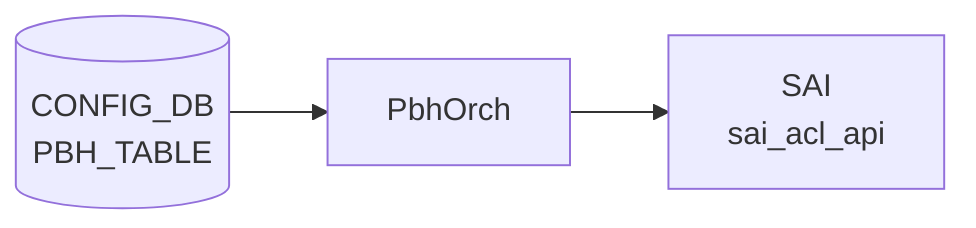

# PBH_TABLE テーブル

## 概要

`PBH_TABLE` は [Policy Based Hashing (PBH)](pbh.md) で「どの interface 群に hash policy を適用するか」を定義する [CONFIG_DB](../../reference/glossary.md#term-config_db) テーブル。`PbhOrch` が SAI [ACL](../../reference/glossary.md#term-acl) テーブル (`ACL_STAGE_INGRESS`) として展開し、各 `PBH_RULE` がこのテーブル内のエントリとして bind される[^1]。

<!-- cdb-mermaid -->
### データフロー (自動生成)



!!! note "凡例"
    CONFIG_DB から SAI までの典型経路を `docs/reference/config-db-orch-map.md` から機械生成したミニ図。詳細・例外は本ページ本文と対応表を参照。
<!-- /cdb-mermaid -->

<!-- ordering -->
## オブジェクト生成順序・依存関係 (Phase B)

<!-- evidence: meta/_intermediate/cdb-flow/pbh-table-ordering.md -->

`PBH_TABLE` 自体は他の PBH テーブルに対する上流依存を持たないが、参照する `PORT` / `PORTCHANNEL` の PortsOrch 初期化を必要とする。`PBH_RULE` はこのテーブルに依存するため、**作成は PBH_RULE より前**、**削除は PBH_RULE より後**が必須。

### `deployPbhTasks()` の固定処理順序

`deployPbhTasks()` (`pbhorch.cpp:1539-1550`) は毎回以下の固定順で pending map を処理する。

```
Setup (作成): HASH_FIELD → HASH → TABLE → RULE
Remove (削除): RULE → TABLE → HASH → HASH_FIELD
```

`PBH_TABLE` の setup は `PBH_HASH` 完了後、`PBH_RULE` より前に実行される。

### 依存 1: PortsOrch 初期化（必須先行・グローバル）

```
PortsOrch::allPortsReady() == true  先行
  ↓
PBH_TABLE / PBH_RULE / PBH_HASH / PBH_HASH_FIELD の全 SET 処理開始
```

`PbhOrch::doTask()` (`pbhorch.cpp:1808`) は `this->portsOrch->allPortsReady()` が false の間は即 return する。CONFIG_DB に書き込まれたエントリは PortsOrch 完了後の最初のイベントループで一括処理される（自動回復）。

### 依存 2: interface_list の PORT / PORTCHANNEL 解決

`createPbhTable()` (`pbhorch.cpp:266-272`) は `AclTable::validateAddPorts()` → `gPortsOrch->getPort()` で各インターフェースを解決する。ポートが PortsOrch 未登録の場合は `pendingPortSet` に保留され、`SUBJECT_TYPE_PORT_CHANGE` 通知で再バインドを試みる (`aclorch.cpp:2698-2703`)。

**違反時**: `interface_list` に指定したポートが `allPortsReady()` 後も未登録であれば `"Failed to configure PBH table(%s) ports"` + `return false`。CONFIG_DB エントリは残り、後続 SET で再試行。

### 依存 3: PBH_TABLE DEL は PBH_RULE DEL が先行必須

```
PBH_RULE|<table_name>|<rule_name>  DEL（先行）
  ↓
PBH_TABLE|<table_name>  DEL
```

`deployPbhTableRemoveTasks()` (`pbhorch.cpp:459-464`) は `hasDependencies(tObj)` が true（refCount > 0）の間 NOTICE ログ後 `it++` で retry。`PBH_RULE` create 時に `incRefCount(rule)` が `PBH_TABLE` の refCount を +1 し (`pbhmgr.cpp:114-135`)、DEL 時に `decRefCount(rule)` が -1 する。

**違反時**: `PBH_TABLE` の DEL が pending map に留まり続ける（永続 retry）。`PBH_RULE` を先に DEL すると自動回復。

### 依存 4: createPbhTable() の内部処理シーケンス

```
1. 重複チェック (pbhHlpr.getPbhTable)
2. AclTable 構築 — ACL_STAGE_INGRESS、bind point PORT + LAG
3. validateAddType(pbhTableType)  — 6 match 属性固定付与
4. validateAddStage(ACL_STAGE_INGRESS)
5. validateAddPorts(interface_list)
6. aclOrch->addAclTable(pbhTable)  → SAI create_acl_table
7. pbhHlpr.addPbhTable(table)     → 内部キャッシュ登録
```

各ステップ失敗時は `SWSS_LOG_ERROR` + `return false`。エントリは CONFIG_DB に残るが SAI には反映されない。

### 順序依存サマリ

| # | 依存関係 | 方向 | 違反時の挙動 |
|---|----------|------|-------------|
| 1 | PortsOrch 初期化 → PBH_TABLE 処理 | 必須先行（グローバル） | 自動回復（初期化完了後に一括処理） |
| 2 | PORT / PORTCHANNEL 登録 → PBH_TABLE SET | interface_list の解決 | pendingPortSet → PORT_CHANGE 通知で自動回復 |
| 3 | PBH_RULE DEL → PBH_TABLE DEL | DEL 時の必須先行 | 永続 retry（RULE DEL 後に自動回復） |
| 4 | createPbhTable() 内部: type/stage/ports/validate → addAclTable | SET 内部順序 | 各ステップ失敗で return false（CONFIG_DB は残存） |

<!-- /ordering -->

<!-- cross-refs -->
## 暗黙参照テーブル (Phase C)

<!-- evidence: meta/_intermediate/cdb-flow/pbh-table-cross-refs.md -->

`PBH_TABLE` は CONFIG_DB の他テーブルを**直接読まない**が、`interface_list` の解決で `PORT` / `PORTCHANNEL` に暗黙依存し、SAI 操作で `AclOrch` に依存する。

### このテーブルが参照する側

| 参照先テーブル / リソース | YANG leafref | 実行時依存 | 未充足時の挙動 |
|---|:---:|:---:|---|
| `PORT\|<name>` (CONFIG_DB) | ✅ `sonic-pbh.yang:245-247` | `validateAddPorts()` → `gPortsOrch->getPort()` (`aclorch.cpp:2698`) | `pendingPortSet` 保留 → `SUBJECT_TYPE_PORT_CHANGE` 通知で自動回復 |
| `PORTCHANNEL\|<name>` (CONFIG_DB) | ✅ `sonic-pbh.yang:248-251` | `validateAddPorts()` → `gPortsOrch->getPort()` LAG パス (`aclorch.cpp:106`) | 同上（PORT_CHANGE 通知で自動回復） |
| PortsOrch（グローバルゲート） | ✗ | `allPortsReady()` ゲート (`pbhorch.cpp:1808`) | 全 PBH テーブル処理がブロック（`allPortsReady()` true 後に自動回復） |
| AclOrch（Orch 間） | ✗ | `addAclTable()` / `updateAclTable()` / `removeAclTable()` | SWSS_LOG_ERROR + `return false`（CONFIG_DB エントリ残存・再試行なし） |

### このテーブルを参照する側

| 参照元テーブル | 参照フィールド | 参照タイミング | evidence |
|---|---|---|---|
| `PBH_RULE\|<table_name>\|<rule_name>` | `table_name` (YANG leafref) | PBH_RULE SET 時。`validateDependencies()` が `tableMap.find(rule.table)` を確認し、未存在なら `return false` → retry loop | `pbhmgr.cpp:83-88`, `pbhorch.cpp:929-968` |

!!! note "APP_DB / STATE_DB への書き出しはない"
    `PbhOrch` は `PBH_TABLE` の処理結果を STATE_DB / APPL_DB に書き出さない。ステータステーブルは未実装であり、`PBH_TABLE` は CONFIG_DB の consumer 専用テーブルとして機能する。

<!-- /cross-refs -->

<!-- failure -->
## 失敗・リトライ挙動 (Phase D)

`PBH_TABLE` の処理失敗は `pbhmgr.cpp` の `parsePbhTable()` / `validatePbhTable()` と `pbhorch.cpp` の `deployPbhTableSetupTasks()` / `deployPbhTableRemoveTasks()` で発生する。`ACL_TABLE` とは異なり STATE_DB へのステータス書き込みはなく、失敗はすべて syslog (`SWSS_LOG_ERROR` / `SWSS_LOG_NOTICE`) のみで通知される。詳細スキャンノートは `meta/_intermediate/cdb-flow/pbh-table-failure.md` を参照。

### SET 時の失敗パターン

| # | 失敗ケース | 発生箇所 | ログ | retry |
|---|---|---|---|---|
| 1 | `interface_list` / `description` 未設定（必須フィールド欠損） | `validatePbhTable()` `pbhmgr.cpp:968,974` | `SWSS_LOG_ERROR("Validation error: missing mandatory field(...)")` | なし — `pendingSetupMap` 未追加。再 SET が必要 |
| 2 | 不明フィールド | `parsePbhTable()` `pbhmgr.cpp:487` | `SWSS_LOG_WARN("Unknown field(%s): skipping ...")` | N/A（スキップして処理続行） |
| 3 | SAI ACL テーブル作成失敗 (`aclOrch->addAclTable()`) | `createPbhTable()` `pbhorch.cpp:288` | `SWSS_LOG_ERROR("Failed to create PBH table(%s) in SAI")` | なし — `deployPbhTableSetupTasks()` で `map.erase(it)`。原因解消後に再 SET |
| 4 | 内部キャッシュ追加失敗 (`pbhHlpr.addPbhTable()`) | `createPbhTable()` `pbhorch.cpp:294` | `SWSS_LOG_ERROR("Failed to add PBH table(%s) to internal cache")` | なし — 同上 |
| 5 | タスク重複競合 (`pbhTaskExists()` == true) | `doTask()` `pbhorch.cpp:1579` | `SWSS_LOG_WARN("Unable to process PBH table(%s): task already exists: adding a retry")` | あり — 次イベントループで自動再試行 |
| 6 | オブジェクト重複（`getPbhTable()` 成功で SET） | `createPbhTable()` `pbhorch.cpp:237` | `SWSS_LOG_ERROR("...object already exists")` | なし |

### DEL 時の失敗パターン

| # | 失敗ケース | 発生箇所 | ログ | retry |
|---|---|---|---|---|
| 7 | 依存 `PBH_RULE` が存在（refCount > 0） | `deployPbhTableRemoveTasks()` `pbhorch.cpp:461` | `SWSS_LOG_NOTICE("Unable to remove PBH table(%s): object has dependencies: adding a retry")` | あり — `PBH_RULE` DEL 後に `hasDependencies()` が false になり自動回復 |
| 8 | SAI ACL テーブル削除失敗 (`removePbhTable()`) | `deployPbhTableRemoveTasks()` `pbhorch.cpp:468` | `SWSS_LOG_ERROR("Failed to remove PBH table(%s): ASIC and CONFIG DB are diverged")` | なし — erase。原因解消後に再 DEL |
| 9 | DEL 対象が内部キャッシュ不在 | `deployPbhTableRemoveTasks()` `pbhorch.cpp:454` | `SWSS_LOG_ERROR("Failed to remove PBH table(%s): object doesn't exist")` | なし — erase |

### 失敗の伝播経路

```text
PBH_TABLE SET — 必須フィールド欠損 / SAI 失敗
  ↓
parsePbhTable() / createPbhTable() が false を返す
  ↓
deployPbhTableSetupTasks(): map.erase(it)  ← retry なし
  ↓
PBH_TABLE が SAI に未反映のまま
  ↓
後続 PBH_RULE の validateDependencies() が tableMap.find(rule.table) で失敗
  → PBH_RULE も pendingSetupMap 保留 → SAI に未反映
```

### 注意点

- `PbhOrch` は STATE_DB に PBH_TABLE のステータスを書き込まない。失敗確認は `/var/log/syslog` の `SWSS_LOG_ERROR` を参照すること。
- SET 失敗後も CONFIG_DB のエントリは残る。orchagent は CONFIG_DB に書き戻さない。
- SAI 失敗（ケース 3）は retry なしで "ASIC and CONFIG DB are diverged" 状態になる。`config reload` または個別の DEL → SET が回復手順。

<!-- /failure -->

<!-- constants -->
## ハードコード定数 (Phase E)

`pbhorch.cpp` / `config/plugins/pbh.py` にハードコードされ、CONFIG_DB・YANG では管理されない定数の一覧。

<!-- evidence: meta/_intermediate/cdb-flow/pbh-table-constants.md -->

### 1. CONFIG_DB テーブル名定数 (pbh.py:47–50)

CLI プラグイン (`config/plugins/pbh.py`) で定義される CONFIG_DB テーブル名定数。

| 定数名 | 値 | 用途 |
|--------|----|------|
| `PBH_TABLE_CDB` | `"PBH_TABLE"` | PBH テーブルの CONFIG_DB テーブル名 |
| `PBH_RULE_CDB` | `"PBH_RULE"` | PBH ルールテーブル名 |
| `PBH_HASH_CDB` | `"PBH_HASH"` | PBH ハッシュテーブル名 |
| `PBH_HASH_FIELD_CDB` | `"PBH_HASH_FIELD"` | PBH ハッシュフィールドテーブル名 |

### 2. フィールド名定数 (pbh.py:52–70)

`PBH_TABLE` のフィールド名定数。

| 定数名 | 値 |
|--------|----|
| `PBH_TABLE_INTERFACE_LIST` | `"interface_list"` |
| `PBH_TABLE_DESCRIPTION` | `"description"` |

### 3. SAI ACL バインドポイント定数 (pbhorch.cpp:244–245)

`PbhOrch::createPbhTable()` 内の `static const auto pbhTableType = AclTableTypeBuilder()` で定義される ACL テーブル型にハードコードされたバインドポイント。CONFIG_DB には存在せず、すべての PBH テーブルに一律適用される。

| 定数名 | 意味 |
|--------|------|
| `SAI_ACL_BIND_POINT_TYPE_PORT` | PBH ACL テーブルを物理ポートにバインド可能 |
| `SAI_ACL_BIND_POINT_TYPE_LAG` | PBH ACL テーブルを LAG にバインド可能 |

### 4. SAI ACL マッチフィールド定数 (pbhorch.cpp:246–251)

同じく `pbhTableType` にハードコードされたマッチフィールド群。`PBH_RULE` で使用できるマッチフィールドの集合は、この定数リストにより SAI レベルで固定されている。

| 定数名 | 意味 |
|--------|------|
| `SAI_ACL_TABLE_ATTR_FIELD_GRE_KEY` | GRE キーマッチ |
| `SAI_ACL_TABLE_ATTR_FIELD_ETHER_TYPE` | イーサタイプマッチ |
| `SAI_ACL_TABLE_ATTR_FIELD_IP_PROTOCOL` | IP プロトコルマッチ |
| `SAI_ACL_TABLE_ATTR_FIELD_IPV6_NEXT_HEADER` | IPv6 Next Header マッチ |
| `SAI_ACL_TABLE_ATTR_FIELD_L4_DST_PORT` | L4 dst port マッチ |
| `SAI_ACL_TABLE_ATTR_FIELD_INNER_ETHER_TYPE` | inner ether type マッチ |

### 5. ACL ステージ定数 (pbhorch.cpp:260)

| 定数名 | 意味 |
|--------|------|
| `ACL_STAGE_INGRESS` | PBH テーブルは常に ingress ステージで展開される。CONFIG_DB にステージフィールドは存在せず、この値はバイナリにハードコードされている |

<!-- /constants -->

<!-- side-effects -->
## 副次 DB 書き込み (Phase F)

> 証跡: `meta/_intermediate/cdb-flow/pbh-table-side-effects.md`

`PBH_TABLE` の SET/DEL 処理は **STATE_DB / APPL_DB への直接書き込みを行わない**。副次的な状態変更は以下に限られる。

### SAI ACL テーブルオブジェクト (ASIC 副作用)

| 操作 | SAI 呼び出し | 呼び出し元 | タイミング |
|------|------------|-----------|-----------|
| SET（新規） | `sai_acl_api->create_acl_table` | `aclOrch->addAclTable(pbhTable)` (`pbhorch.cpp:286`) | `createPbhTable()` 内、内部キャッシュ登録前 |
| SET（更新） | `sai_acl_api->set_acl_table_attribute` | `aclOrch->updateAclTable(table.name, pbhTable)` (`pbhorch.cpp:359`) | `updatePbhTable()` 内 |
| DEL | `sai_acl_api->remove_acl_table` | `aclOrch->removeAclTable(table.name)` (`pbhorch.cpp:388`) | `removePbhTable()` 内、内部キャッシュ削除前 |

SAI の変更は CONFIG_DB / APPL_DB / STATE_DB には反映されない。ステータスを確認する専用 DB テーブルは実装されていない。

### AclOrch 内 pendingPortSet (インメモリ)

`validateAddPorts()` (`aclorch.cpp:2698`) が `interface_list` のポートを PortsOrch に問い合わせ、未登録ポートは `AclTable::pendingPortSet` に蓄積する。これは orchagent プロセス内メモリのみで DB 書き込みは発生しない。`SUBJECT_TYPE_PORT_CHANGE` 通知を受けると `pendingPortSet` のポートが自動的に再バインドされる (`aclorch.cpp:2884-2889`)。

### pbhHlpr 内部 refCount (インメモリ)

`PBH_RULE` の作成時に `pbhHlpr.incRefCount(rule)` が `tableMap[rule.table].refCount` を +1 し、`PBH_RULE` の削除時に `decRefCount(rule)` が -1 する (`pbhmgr.cpp:114-135`, `163-183`)。この refCount は DB に書き出されず orchagent 内メモリにのみ存在する。`PBH_TABLE` の DEL は `hasDependencies()` が `refCount > 0` の間ブロックされる。

!!! note "STATE_DB ステータステーブルなし"
    `PbhOrch` は `PBH_TABLE` の処理結果を STATE_DB / APPL_DB に書き出さない。失敗・成功の確認は `/var/log/syslog` の `SWSS_LOG_ERROR` / `SWSS_LOG_NOTICE` のみ。

<!-- /side-effects -->

<!-- pubsub -->
## Redis 通知メカニズム (Phase G)

> 根拠: `sonic-swss/orchagent/orchdaemon.cpp:550-565`、`sonic-swss/orchagent/pbhorch.cpp:88-97,1804-1831`、`sonic-swss/orchagent/orch.cpp:1186-1195`

### PbhOrch — SubscriberStateTable 経由 (CONFIG_DB)

`PbhOrch` は `Orch(connectorList)` を継承し、`orchdaemon.cpp:553-565` が 4 テーブルの `TableConnector` リストを渡してコンストラクタを呼ぶ:

```cpp
// orchdaemon.cpp:553-565
TableConnector cfgDbPbhTable(m_configDb, CFG_PBH_TABLE_TABLE_NAME);       // "PBH_TABLE"
TableConnector cfgDbPbhRuleTable(m_configDb, CFG_PBH_RULE_TABLE_NAME);    // "PBH_RULE"
TableConnector cfgDbPbhHashTable(m_configDb, CFG_PBH_HASH_TABLE_NAME);    // "PBH_HASH"
TableConnector cfgDbPbhHashFieldTable(m_configDb, CFG_PBH_HASH_FIELD_TABLE_NAME); // "PBH_HASH_FIELD"
vector<TableConnector> pbhTableConnectorList = { ... };
gPbhOrch = new PbhOrch(pbhTableConnectorList, gAclOrch, gPortsOrch);
```

`Orch(const vector<TableConnector>&)` コンストラクタ (`orch.cpp:127-133`) が各 `TableConnector` に対して `addConsumer(db, tableName)` を呼ぶ。CONFIG_DB (dbId=4) の場合は `SubscriberStateTable` が選択される (`orch.cpp:1189-1190`):

```cpp
// orch.cpp:1186-1195
void Orch::addConsumer(DBConnector *db, string tableName, int pri) {
    if (db->getDbId() == CONFIG_DB || ...) {
        addExecutor(new Consumer(new SubscriberStateTable(...), this, tableName));
    } else { ... }
}
```

### PbhOrch::doTask のディスパッチ

SELECT イベント受信後、`PbhOrch::doTask(Consumer&)` (`pbhorch.cpp:1804`) がテーブル名で handler を選択する。まず `allPortsReady()` を確認し、ポート初期化が完了するまで処理を保留する:

```cpp
// pbhorch.cpp:1804-1831
void PbhOrch::doTask(Consumer &consumer) {
    if (!this->portsOrch->allPortsReady()) return;  // ポート初期化待ち

    auto tableName = consumer.getTableName();
    if      (tableName == CFG_PBH_TABLE_TABLE_NAME)      this->doPbhTableTask(consumer);
    else if (tableName == CFG_PBH_RULE_TABLE_NAME)       this->doPbhRuleTask(consumer);
    else if (tableName == CFG_PBH_HASH_TABLE_NAME)       this->doPbhHashTask(consumer);
    else if (tableName == CFG_PBH_HASH_FIELD_TABLE_NAME) this->doPbhHashFieldTask(consumer);
}
```

| 購読テーブル | テーブル名 | handler |
|------------|----------|---------|
| `CONFIG_DB:PBH_TABLE` | `"PBH_TABLE"` | `doPbhTableTask()` |
| `CONFIG_DB:PBH_RULE` | `"PBH_RULE"` | `doPbhRuleTask()` |
| `CONFIG_DB:PBH_HASH` | `"PBH_HASH"` | `doPbhHashTask()` |
| `CONFIG_DB:PBH_HASH_FIELD` | `"PBH_HASH_FIELD"` | `doPbhHashFieldTask()` |

### 通知フロー全体図

```
CONFIG_DB PBH_TABLE|<name>  (SET/DEL)
  │  Redis keyspace notification (__keyspace@4__:PBH_TABLE|<name>)
  └─ orchagent SubscriberStateTable → Consumer → PbhOrch::doTask()
       └─ doPbhTableTask() → AclOrch::addAclTable() / removeAclTable()
            └─ SAI: sai_acl_api (→ ASIC_DB → syncd → hardware)

CONFIG_DB PBH_RULE|<table>|<rule>  (SET/DEL)
  │  Redis keyspace notification (__keyspace@4__:PBH_RULE|*)
  └─ orchagent SubscriberStateTable → Consumer → PbhOrch::doTask()
       └─ doPbhRuleTask() → AclOrch::addAclRule() / removeAclRule()
```

APPL_DB への中継はなく、STATE_DB への書き込みもない。CLI (`config pbh table ...`) が CONFIG_DB に直接 `hset`/`hdel` し、orchagent が `SubscriberStateTable` で変化を受け取って SAI API を呼び出す。

<!-- /pubsub -->

<!-- platform -->
## プラットフォーム差 (Phase H)

<!-- evidence: meta/_intermediate/cdb-flow/pbh-table-platform.md -->

`PBH_TABLE` の処理は `PbhCapabilities` クラスが orchagent 起動時に環境変数 `ASIC_VENDOR` を読み取り、プラットフォーム（`GENERIC` / `MELLANOX`）を判定する。判定結果は起動直後に STATE_DB `PBH_CAPABILITIES` テーブルへ書き出される。`PBH_TABLE` のフィールド自体は両プラットフォームで同一動作だが、関連する `PBH_HASH` / `PBH_RULE` の UPDATE 可否に差異がある。

### プラットフォーム識別 (pbhcap.cpp:310-335)

```cpp
// pbhcap.cpp — PBH_PLATFORM_ENV_VAR = "ASIC_VENDOR"
const auto *envVar = std::getenv("ASIC_VENDOR");
if (platform == "mellanox")  { asicVendor = PbhAsicVendor::MELLANOX; }
else                          { asicVendor = PbhAsicVendor::GENERIC;  }
```

`ASIC_VENDOR` 未設定時は `SWSS_LOG_WARN` を出して `GENERIC` にフォールバックする。`"broadcom"` / `"cisco-8000"` 等の文字列は GENERIC 扱いになる（Mellanox 判定は完全一致 `"mellanox"` のみ）。

### フィールド capability の差異

`PBH_TABLE.interface_list` / `PBH_TABLE.description` は**両プラットフォームとも UPDATE のみ**許可。ADD は `createPbhTable()` 経由で処理され、REMOVE は DEL イベントで対応するため、capability 検証は UPDATE 時のみ実施される。

関連エンティティ（`PBH_HASH` / `PBH_RULE`）で差異が発生する:

| エンティティ | フィールド | GENERIC | MELLANOX | 違反時の挙動 |
|---|---|:---:|:---:|---|
| `PBH_TABLE` | `interface_list` | UPDATE | UPDATE | 同一。UPDATE 不可時は `SWSS_LOG_ERROR` + `return false` |
| `PBH_TABLE` | `description` | UPDATE | UPDATE | 同一。同上 |
| `PBH_HASH` | `hash_field_list` | UPDATE | **空（なし）** | Mellanox では UPDATE が `SWSS_LOG_ERROR("Failed to validate field(hash_field_list): capability(UPDATE) is not supported")` + `return false` → `PBH_HASH` の `hash_field_list` 変更不可 |
| `PBH_RULE` | `hash` / `packet_action` | UPDATE (W/A なし) | UPDATE + **W/A** | Mellanox では `disableAction()` 先行必須 (下記参照) |

### Mellanox W/A: PBH_RULE hash / packet_action UPDATE (pbhorch.cpp:839-863)

Mellanox プラットフォームでは `updatePbhRule()` 内で `hash` または `packet_action` フィールドを UPDATE する際、SAI レベルで rule の action を一時無効化してから更新する workaround が適用される:

```cpp
// pbhorch.cpp:839-863
if (this->pbhCap.getAsicVendor() == PbhAsicVendor::MELLANOX)
{
    if (cond1 || cond2)  // hash or packet_action in uFields
    {
        auto pbhRulePtr = dynamic_cast<AclRulePbh*>(this->aclOrch->getAclRule(rule.table, rule.name));
        if (!pbhRulePtr->disableAction()) {
            SWSS_LOG_ERROR("Failed to disable PBH rule(%s) action", rule.key.c_str());
            return false;
        }
    }
}
```

`disableAction()` が失敗した場合は `return false` で更新を中断。SAI の Mellanox 実装が attribute update 時に action の無効化を要求するためのプラットフォーム固有パスである。

### STATE_DB への capabilities 書き出し

`PbhCapabilities::writePbhVendorCapabilitiesToDb()` (pbhcap.cpp:442-452) が orchagent 起動時に STATE_DB の `PBH_CAPABILITIES` テーブルへ capability を書き込む。

```
STATE_DB:PBH_CAPABILITIES|table       → interface_list, description の対応 capability 文字列
STATE_DB:PBH_CAPABILITIES|rule        → priority, gre_key, ..., hash, packet_action, flow_counter
STATE_DB:PBH_CAPABILITIES|hash        → hash_field_list の capability 文字列
STATE_DB:PBH_CAPABILITIES|hash-field  → hash_field, ip_mask, sequence_id
```

capability 値は `"ADD,UPDATE,REMOVE"` / `"UPDATE"` / `""` (空) の組み合わせ。`sonic-swss-common/common/schema.h:419` で `STATE_PBH_CAPABILITIES_TABLE_NAME = "PBH_CAPABILITIES"` と定義。

### プラットフォーム別サマリ

| プラットフォーム | PBH_TABLE フィールド UPDATE | PBH_HASH.hash_field_list UPDATE | PBH_RULE hash/packet_action UPDATE |
|---|:---:|:---:|:---:|
| GENERIC (broadcom / cisco-8000 / 非 Mellanox) | yes | yes | yes（W/A なし） |
| MELLANOX | yes | **no** | yes（W/A あり: `disableAction()` 先行） |

<!-- /platform -->

## key 構造

```text
PBH_TABLE|<table_name>
```

`<table_name>` は PBH ポリシーの識別子。`PBH_RULE` の key `PBH_RULE|<table_name>|<rule_name>` でこの名前を参照する。

## フィールド

| フィールド | 型 | 必須 | 説明 |
|-----------|----|------|------|
| `interface_list` | ordered leaf-list `PORT` / `PORTCHANNEL` leafref | yes | PBH table を適用する interface 群（1 要素以上） |
| `description` | string 1..255 | yes | table の説明 |

!!! note "未知フィールドの扱い"
    `parsePbhTable()` (`pbhmgr.cpp`) は未知フィールドを `SWSS_LOG_WARN("Unknown field(%s): skipping ...")` でサイレントスキップする。エラーにはならない。

## 購読者

- `orchagent` の `PbhOrch` (`sonic-swss/orchagent/pbhorch.cpp`): [CONFIG_DB](../../reference/glossary.md#term-config_db) の `PBH_TABLE` を `SubscriberStateTable` で直接 subscribe し、SAI ACL テーブルへ反映する。APP_DB への書き込みはない。

## 関連 CONFIG_DB / YANG / CLI

- 関連 CONFIG_DB: [`PBH_RULE`](pbh-rule.md)、`PBH_HASH`、`PBH_HASH_FIELD`
- 関連 CLI: `config pbh table`
- 関連 [YANG](../../reference/glossary.md#term-yang): `sonic-pbh`

## 引用元

[^1]: YANG 定義: `sonic-pbh.yang`. <https://github.com/sonic-net/sonic-buildimage/blob/9ea932ec2e18f35e58268ec2e4456b1d4afd65cd/src/sonic-yang-models/yang-models/sonic-pbh.yang>
