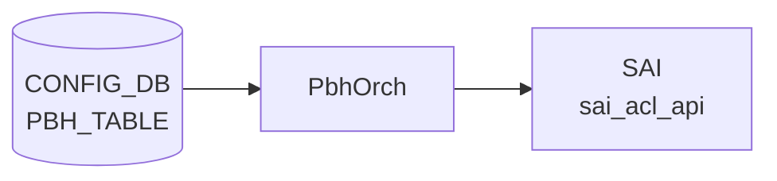

# PBH_TABLE テーブル

## 概要

`PBH_TABLE` は [Policy Based Hashing (PBH)](pbh.md) で「どの interface 群に hash policy を適用するか」を定義する [CONFIG_DB](../../reference/glossary.md#term-config_db) テーブル。`PbhOrch` が SAI [ACL](../../reference/glossary.md#term-acl) テーブル (`ACL_STAGE_INGRESS`) として展開し、各 `PBH_RULE` がこのテーブル内のエントリとして bind される[^1]。

<!-- cdb-mermaid -->
### データフロー (自動生成)



!!! note "凡例"
    CONFIG_DB から SAI までの典型経路を `docs/reference/config-db-orch-map.md` から機械生成したミニ図。詳細・例外は本ページ本文と対応表を参照。
<!-- /cdb-mermaid -->

<!-- ordering -->
## オブジェクト生成順序・依存関係 (Phase B)

<!-- evidence: meta/_intermediate/cdb-flow/pbh-table-ordering.md -->

`PBH_TABLE` 自体は他の PBH テーブルに対する上流依存を持たないが、参照する `PORT` / `PORTCHANNEL` の PortsOrch 初期化を必要とする。`PBH_RULE` はこのテーブルに依存するため、**作成は PBH_RULE より前**、**削除は PBH_RULE より後**が必須。

### `deployPbhTasks()` の固定処理順序

`deployPbhTasks()` (`pbhorch.cpp:1539-1550`) は毎回以下の固定順で pending map を処理する。

```
Setup (作成): HASH_FIELD → HASH → TABLE → RULE
Remove (削除): RULE → TABLE → HASH → HASH_FIELD
```

`PBH_TABLE` の setup は `PBH_HASH` 完了後、`PBH_RULE` より前に実行される。

### 依存 1: PortsOrch 初期化（必須先行・グローバル）

```
PortsOrch::allPortsReady() == true  先行
  ↓
PBH_TABLE / PBH_RULE / PBH_HASH / PBH_HASH_FIELD の全 SET 処理開始
```

`PbhOrch::doTask()` (`pbhorch.cpp:1808`) は `this->portsOrch->allPortsReady()` が false の間は即 return する。CONFIG_DB に書き込まれたエントリは PortsOrch 完了後の最初のイベントループで一括処理される（自動回復）。

### 依存 2: interface_list の PORT / PORTCHANNEL 解決

`createPbhTable()` (`pbhorch.cpp:266-272`) は `AclTable::validateAddPorts()` → `gPortsOrch->getPort()` で各インターフェースを解決する。ポートが PortsOrch 未登録の場合は `pendingPortSet` に保留され、`SUBJECT_TYPE_PORT_CHANGE` 通知で再バインドを試みる (`aclorch.cpp:2698-2703`)。

**違反時**: `interface_list` に指定したポートが `allPortsReady()` 後も未登録であれば `"Failed to configure PBH table(%s) ports"` + `return false`。CONFIG_DB エントリは残り、後続 SET で再試行。

### 依存 3: PBH_TABLE DEL は PBH_RULE DEL が先行必須

```
PBH_RULE|<table_name>|<rule_name>  DEL（先行）
  ↓
PBH_TABLE|<table_name>  DEL
```

`deployPbhTableRemoveTasks()` (`pbhorch.cpp:459-464`) は `hasDependencies(tObj)` が true（refCount > 0）の間 NOTICE ログ後 `it++` で retry。`PBH_RULE` create 時に `incRefCount(rule)` が `PBH_TABLE` の refCount を +1 し (`pbhmgr.cpp:114-135`)、DEL 時に `decRefCount(rule)` が -1 する。

**違反時**: `PBH_TABLE` の DEL が pending map に留まり続ける（永続 retry）。`PBH_RULE` を先に DEL すると自動回復。

### 依存 4: createPbhTable() の内部処理シーケンス

```
1. 重複チェック (pbhHlpr.getPbhTable)
2. AclTable 構築 — ACL_STAGE_INGRESS、bind point PORT + LAG
3. validateAddType(pbhTableType)  — 6 match 属性固定付与
4. validateAddStage(ACL_STAGE_INGRESS)
5. validateAddPorts(interface_list)
6. aclOrch->addAclTable(pbhTable)  → SAI create_acl_table
7. pbhHlpr.addPbhTable(table)     → 内部キャッシュ登録
```

各ステップ失敗時は `SWSS_LOG_ERROR` + `return false`。エントリは CONFIG_DB に残るが SAI には反映されない。

### 順序依存サマリ

| # | 依存関係 | 方向 | 違反時の挙動 |
|---|----------|------|-------------|
| 1 | PortsOrch 初期化 → PBH_TABLE 処理 | 必須先行（グローバル） | 自動回復（初期化完了後に一括処理） |
| 2 | PORT / PORTCHANNEL 登録 → PBH_TABLE SET | interface_list の解決 | pendingPortSet → PORT_CHANGE 通知で自動回復 |
| 3 | PBH_RULE DEL → PBH_TABLE DEL | DEL 時の必須先行 | 永続 retry（RULE DEL 後に自動回復） |
| 4 | createPbhTable() 内部: type/stage/ports/validate → addAclTable | SET 内部順序 | 各ステップ失敗で return false（CONFIG_DB は残存） |

<!-- /ordering -->

<!-- cross-refs -->
## 暗黙参照テーブル (Phase C)

<!-- evidence: meta/_intermediate/cdb-flow/pbh-table-cross-refs.md -->

`PBH_TABLE` は CONFIG_DB の他テーブルを**直接読まない**が、`interface_list` の解決で `PORT` / `PORTCHANNEL` に暗黙依存し、SAI 操作で `AclOrch` に依存する。

### このテーブルが参照する側

| 参照先テーブル / リソース | YANG leafref | 実行時依存 | 未充足時の挙動 |
|---|:---:|:---:|---|
| `PORT\|<name>` (CONFIG_DB) | ✅ `sonic-pbh.yang:245-247` | `validateAddPorts()` → `gPortsOrch->getPort()` (`aclorch.cpp:2698`) | `pendingPortSet` 保留 → `SUBJECT_TYPE_PORT_CHANGE` 通知で自動回復 |
| `PORTCHANNEL\|<name>` (CONFIG_DB) | ✅ `sonic-pbh.yang:248-251` | `validateAddPorts()` → `gPortsOrch->getPort()` LAG パス (`aclorch.cpp:106`) | 同上（PORT_CHANGE 通知で自動回復） |
| PortsOrch（グローバルゲート） | ✗ | `allPortsReady()` ゲート (`pbhorch.cpp:1808`) | 全 PBH テーブル処理がブロック（`allPortsReady()` true 後に自動回復） |
| AclOrch（Orch 間） | ✗ | `addAclTable()` / `updateAclTable()` / `removeAclTable()` | SWSS_LOG_ERROR + `return false`（CONFIG_DB エントリ残存・再試行なし） |

### このテーブルを参照する側

| 参照元テーブル | 参照フィールド | 参照タイミング | evidence |
|---|---|---|---|
| `PBH_RULE\|<table_name>\|<rule_name>` | `table_name` (YANG leafref) | PBH_RULE SET 時。`validateDependencies()` が `tableMap.find(rule.table)` を確認し、未存在なら `return false` → retry loop | `pbhmgr.cpp:83-88`, `pbhorch.cpp:929-968` |

!!! note "APP_DB / STATE_DB への書き出しはない"
    `PbhOrch` は `PBH_TABLE` の処理結果を STATE_DB / APPL_DB に書き出さない。ステータステーブルは未実装であり、`PBH_TABLE` は CONFIG_DB の consumer 専用テーブルとして機能する。

<!-- /cross-refs -->

<!-- failure -->
## 失敗・リトライ挙動 (Phase D)

`PBH_TABLE` の処理失敗は `pbhmgr.cpp` の `parsePbhTable()` / `validatePbhTable()` と `pbhorch.cpp` の `deployPbhTableSetupTasks()` / `deployPbhTableRemoveTasks()` で発生する。`ACL_TABLE` とは異なり STATE_DB へのステータス書き込みはなく、失敗はすべて syslog (`SWSS_LOG_ERROR` / `SWSS_LOG_NOTICE`) のみで通知される。詳細スキャンノートは `meta/_intermediate/cdb-flow/pbh-table-failure.md` を参照。

### SET 時の失敗パターン

| # | 失敗ケース | 発生箇所 | ログ | retry |
|---|---|---|---|---|
| 1 | `interface_list` / `description` 未設定（必須フィールド欠損） | `validatePbhTable()` `pbhmgr.cpp:968,974` | `SWSS_LOG_ERROR("Validation error: missing mandatory field(...)")` | なし — `pendingSetupMap` 未追加。再 SET が必要 |
| 2 | 不明フィールド | `parsePbhTable()` `pbhmgr.cpp:487` | `SWSS_LOG_WARN("Unknown field(%s): skipping ...")` | N/A（スキップして処理続行） |
| 3 | SAI ACL テーブル作成失敗 (`aclOrch->addAclTable()`) | `createPbhTable()` `pbhorch.cpp:288` | `SWSS_LOG_ERROR("Failed to create PBH table(%s) in SAI")` | なし — `deployPbhTableSetupTasks()` で `map.erase(it)`。原因解消後に再 SET |
| 4 | 内部キャッシュ追加失敗 (`pbhHlpr.addPbhTable()`) | `createPbhTable()` `pbhorch.cpp:294` | `SWSS_LOG_ERROR("Failed to add PBH table(%s) to internal cache")` | なし — 同上 |
| 5 | タスク重複競合 (`pbhTaskExists()` == true) | `doTask()` `pbhorch.cpp:1579` | `SWSS_LOG_WARN("Unable to process PBH table(%s): task already exists: adding a retry")` | あり — 次イベントループで自動再試行 |
| 6 | オブジェクト重複（`getPbhTable()` 成功で SET） | `createPbhTable()` `pbhorch.cpp:237` | `SWSS_LOG_ERROR("...object already exists")` | なし |

### DEL 時の失敗パターン

| # | 失敗ケース | 発生箇所 | ログ | retry |
|---|---|---|---|---|
| 7 | 依存 `PBH_RULE` が存在（refCount > 0） | `deployPbhTableRemoveTasks()` `pbhorch.cpp:461` | `SWSS_LOG_NOTICE("Unable to remove PBH table(%s): object has dependencies: adding a retry")` | あり — `PBH_RULE` DEL 後に `hasDependencies()` が false になり自動回復 |
| 8 | SAI ACL テーブル削除失敗 (`removePbhTable()`) | `deployPbhTableRemoveTasks()` `pbhorch.cpp:468` | `SWSS_LOG_ERROR("Failed to remove PBH table(%s): ASIC and CONFIG DB are diverged")` | なし — erase。原因解消後に再 DEL |
| 9 | DEL 対象が内部キャッシュ不在 | `deployPbhTableRemoveTasks()` `pbhorch.cpp:454` | `SWSS_LOG_ERROR("Failed to remove PBH table(%s): object doesn't exist")` | なし — erase |

### 失敗の伝播経路

```text
PBH_TABLE SET — 必須フィールド欠損 / SAI 失敗
  ↓
parsePbhTable() / createPbhTable() が false を返す
  ↓
deployPbhTableSetupTasks(): map.erase(it)  ← retry なし
  ↓
PBH_TABLE が SAI に未反映のまま
  ↓
後続 PBH_RULE の validateDependencies() が tableMap.find(rule.table) で失敗
  → PBH_RULE も pendingSetupMap 保留 → SAI に未反映
```

### 注意点

- `PbhOrch` は STATE_DB に PBH_TABLE のステータスを書き込まない。失敗確認は `/var/log/syslog` の `SWSS_LOG_ERROR` を参照すること。
- SET 失敗後も CONFIG_DB のエントリは残る。orchagent は CONFIG_DB に書き戻さない。
- SAI 失敗（ケース 3）は retry なしで "ASIC and CONFIG DB are diverged" 状態になる。`config reload` または個別の DEL → SET が回復手順。

<!-- /failure -->

<!-- constants -->
## ハードコード定数 (Phase E)

> 調査証跡: `meta/_intermediate/cdb-flow/pbh-table-constants.md`

`PBH_TABLE` を消費する `PbhOrch` と capability 管理層 (`pbhcap.cpp`) に存在する、[CONFIG_DB](../../reference/glossary.md#term-config_db) に格納されないハードコード定数の一覧。

### 1. フィールド名文字列定数 (`pbhschema.h`)

| 定数 | 値 | 用途 | evidence |
|------|----|----|---------|
| `PBH_TABLE_INTERFACE_LIST` | `"interface_list"` | `PBH_TABLE` の interface 集合フィールド名 | `sonic-swss/orchagent/pbh/pbhschema.h:5` |
| `PBH_TABLE_DESCRIPTION` | `"description"` | `PBH_TABLE` の説明フィールド名 | `sonic-swss/orchagent/pbh/pbhschema.h:6` |

### 2. ハードコードされた SAI ACL テーブル型定義 (`pbhorch.cpp`)

`createPbhTable()` (`pbhorch.cpp:243-253`) は `static const pbhTableType` として SAI ACL テーブルの型を固定定義する。これらは CONFIG_DB の値に関わらず変更できない。

| 属性 | 固定値 | 意味 |
|------|--------|------|
| bind point | `SAI_ACL_BIND_POINT_TYPE_PORT` + `SAI_ACL_BIND_POINT_TYPE_LAG` | PORT と LAG の両方に bind 可能 |
| match 属性 (固定 6 属性) | `SAI_ACL_TABLE_ATTR_FIELD_GRE_KEY` / `ETHER_TYPE` / `IP_PROTOCOL` / `IPV6_NEXT_HEADER` / `L4_DST_PORT` / `INNER_ETHER_TYPE` | PBH テーブルが使用できる ACL match フィールド集合 |
| stage | `ACL_STAGE_INGRESS` | PBH は常に ingress stage に適用 |

### 3. プラットフォーム・capability 定数 (`pbhcap.cpp`)

| 定数 | 値 | 用途 | evidence |
|------|----|----|---------|
| `PBH_PLATFORM_ENV_VAR` | `"ASIC_VENDOR"` | ASIC ベンダー判定の環境変数名 | `sonic-swss/orchagent/pbh/pbhcap.cpp:20` |
| `PBH_PLATFORM_GENERIC` | `"generic"` | ASIC ベンダー: generic (デフォルト) | `sonic-swss/orchagent/pbh/pbhcap.cpp:21` |
| `PBH_PLATFORM_MELLANOX` | `"mellanox"` | ASIC ベンダー: Mellanox | `sonic-swss/orchagent/pbh/pbhcap.cpp:22` |
| `PBH_TABLE_CAPABILITIES_KEY` | `"table"` | STATE_DB `PBH_CAPABILITIES\|table` エントリキー | `sonic-swss/orchagent/pbh/pbhcap.cpp:25` |
| `PBH_RULE_CAPABILITIES_KEY` | `"rule"` | STATE_DB `PBH_CAPABILITIES\|rule` エントリキー | `sonic-swss/orchagent/pbh/pbhcap.cpp:26` |
| `PBH_HASH_CAPABILITIES_KEY` | `"hash"` | STATE_DB `PBH_CAPABILITIES\|hash` エントリキー | `sonic-swss/orchagent/pbh/pbhcap.cpp:27` |
| `PBH_HASH_FIELD_CAPABILITIES_KEY` | `"hash-field"` | STATE_DB `PBH_CAPABILITIES\|hash-field` エントリキー | `sonic-swss/orchagent/pbh/pbhcap.cpp:28` |
| `PBH_FIELD_CAPABILITY_ADD` | `"ADD"` | field capability 値: 追加可能 | `sonic-swss/orchagent/pbh/pbhcap.cpp:30` |
| `PBH_FIELD_CAPABILITY_UPDATE` | `"UPDATE"` | field capability 値: 更新可能 | `sonic-swss/orchagent/pbh/pbhcap.cpp:31` |
| `PBH_FIELD_CAPABILITY_REMOVE` | `"REMOVE"` | field capability 値: 削除可能 | `sonic-swss/orchagent/pbh/pbhcap.cpp:32` |
| `PBH_STATE_DB_NAME` | `"STATE_DB"` | capability 書き込み先 DB 名 | `sonic-swss/orchagent/pbh/pbhcap.cpp:35` |
| `PBH_STATE_DB_TIMEOUT` | `0` | DB 接続タイムアウト（即時/ブロックなし） | `sonic-swss/orchagent/pbh/pbhcap.cpp:36` |

### 4. STATE_DB テーブル名 (`schema.h`)

| 定数 | 値 | 用途 | evidence |
|------|----|----|---------|
| `STATE_PBH_CAPABILITIES_TABLE_NAME` | `"PBH_CAPABILITIES"` | PBH capability を書き込む STATE_DB テーブル名 | `sonic-swss-common/common/schema.h:419` |

<!-- /constants -->

## key 構造

```text
PBH_TABLE|<table_name>
```

`<table_name>` は PBH ポリシーの識別子。`PBH_RULE` の key `PBH_RULE|<table_name>|<rule_name>` でこの名前を参照する。

## フィールド

| フィールド | 型 | 必須 | 説明 |
|-----------|----|------|------|
| `interface_list` | ordered leaf-list `PORT` / `PORTCHANNEL` leafref | yes | PBH table を適用する interface 群（1 要素以上） |
| `description` | string 1..255 | yes | table の説明 |

!!! note "未知フィールドの扱い"
    `parsePbhTable()` (`pbhmgr.cpp`) は未知フィールドを `SWSS_LOG_WARN("Unknown field(%s): skipping ...")` でサイレントスキップする。エラーにはならない。

## 購読者

- `orchagent` の `PbhOrch` (`sonic-swss/orchagent/pbhorch.cpp`): [CONFIG_DB](../../reference/glossary.md#term-config_db) の `PBH_TABLE` を `SubscriberStateTable` で直接 subscribe し、SAI ACL テーブルへ反映する。APP_DB への書き込みはない。

## 関連 CONFIG_DB / YANG / CLI

- 関連 CONFIG_DB: [`PBH_RULE`](pbh-rule.md)、`PBH_HASH`、`PBH_HASH_FIELD`
- 関連 CLI: `config pbh table`
- 関連 [YANG](../../reference/glossary.md#term-yang): `sonic-pbh`

## 引用元

[^1]: YANG 定義: `sonic-pbh.yang`. <https://github.com/sonic-net/sonic-buildimage/blob/9ea932ec2e18f35e58268ec2e4456b1d4afd65cd/src/sonic-yang-models/yang-models/sonic-pbh.yang>
