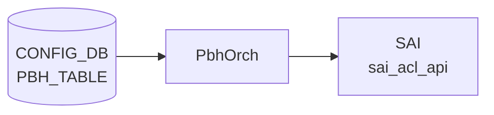

# PBH_TABLE / PBH_RULE テーブル

## 概要

Policy Based Hashing (PBH) は、packet match 条件ごとに [ECMP](../../reference/glossary.md#term-ecmp) / [LAG](../../reference/glossary.md#term-lag) hash profile を切り替えるための [CONFIG_DB](../../reference/glossary.md#term-config_db) テーブル群。`PBH_TABLE` が適用 interface の集合を定義し、`PBH_RULE` が table 内の match 条件、priority、適用する `PBH_HASH` を持つ[^1]。hash profile と hash field は同じ [YANG](../../reference/glossary.md#term-yang) モジュールの `PBH_HASH` / `PBH_HASH_FIELD` で定義され、実装側のテーブル名定数は `schema.h` も参照する[^2]。

<!-- cdb-mermaid -->
### データフロー (自動生成)



!!! note "凡例"
    CONFIG_DB から SAI までの典型経路を `docs/reference/config-db-orch-map.md` から機械生成したミニ図。詳細・例外は本ページ本文と対応表を参照。
<!-- /cdb-mermaid -->

## key 構造

```text
PBH_TABLE|<table_name>
PBH_RULE|<table_name>|<rule_name>
PBH_HASH|<hash_name>
PBH_HASH_FIELD|<hash_field_name>
```

`PBH_RULE.table_name` は `PBH_TABLE.table_name` への leafref。

## 主要フィールド

### PBH_TABLE

| フィールド | 型 | 必須 | 説明 |
|-----------|----|------|------|
| `interface_list` | ordered leaf-list `PORT` / `PORTCHANNEL` leafref | yes | PBH table を適用する interface 群 |
| `description` | string 1..255 | yes | table の説明 |

### PBH_RULE

| フィールド | 型 | 既定値 | 説明 |
|-----------|----|--------|------|
| `priority` | uint32 | - | rule priority。mandatory |
| `gre_key` | hex value/mask | - | GRE key match |
| `ether_type` | hex uint16 string | - | EtherType match |
| `ip_protocol` | hex uint8 string | - | IPv4 protocol match |
| `ipv6_next_header` | hex uint8 string | - | IPv6 next-header match |
| `l4_dst_port` | hex uint16 string | - | L4 destination port match |
| `inner_ether_type` | hex uint16 string | - | inner EtherType match |
| `hash` | leafref `PBH_HASH.hash_name` | - | 適用する hash。mandatory |
| `packet_action` | enum | `SET_ECMP_HASH` | rule action |
| `flow_counter` | enum | `DISABLED` | packet / byte counter の有効化 |

<!-- defaults -->
## フィールドデフォルト (Phase A)

### PBH_HASH

| フィールド | デフォルト | 由来 |
|-----------|-----------|------|
| `hash_field_list` | なし (mandatory) | YANG `min-elements 1` + `validatePbhHash()` — 未設定時 validation エラー |

### PBH_HASH_FIELD

| フィールド | デフォルト | 由来 |
|-----------|-----------|------|
| `hash_field` | なし (mandatory) | YANG `mandatory true` + `validatePbhHashField()` — 未設定時 validation エラー |
| `ip_mask` | なし (条件付き必須) | YANG `when`/`must` 条件 — `hash_field` が `INNER_DST_IPV4`/`INNER_SRC_IPV4`/`INNER_DST_IPV6`/`INNER_SRC_IPV6` のとき必須、それ以外は設定禁止 |
| `sequence_id` | なし (mandatory) | YANG `mandatory true` + `validatePbhHashField()` — 未設定時 validation エラー |

### PBH_RULE (参考: 既存 default 動作の確認)

| フィールド | デフォルト | 由来 |
|-----------|-----------|------|
| `packet_action` | `SET_ECMP_HASH` | YANG `default "SET_ECMP_HASH"` + `validatePbhRule()` が `SAI_ACL_ENTRY_ATTR_ACTION_SET_ECMP_HASH_ID` を自動注入 (`pbhmgr.cpp:998-1010`) |
| `flow_counter` | `DISABLED` | YANG `default "DISABLED"` + `validatePbhRule()` が `false` を自動注入 (`pbhmgr.cpp:1012-1024`) |

> **注**: `PBH_HASH_FIELD` は作成後の更新が禁止されている (`updatePbhHashField()` は常に `return false`)。

<!-- /defaults -->

## 制約

- `PBH_TABLE.interface_list` は 1 要素以上で、`PORT` または `PORTCHANNEL` への leafref。
- `PBH_TABLE.description`、`PBH_RULE.priority`、`PBH_RULE.hash` は mandatory。
- match field の多くは `0x...` 形式、または `0x.../0x...` 形式の文字列 pattern で検証される。
- `PBH_RULE.hash` は `PBH_HASH`、`PBH_HASH.hash_field_list` は `PBH_HASH_FIELD` への leafref。

## 購読者

- `sonic-utilities/scripts/pbh`（CLI 側スクリプト）: [CONFIG_DB](../../reference/glossary.md#term-config_db) の PBH table / rule / hash / hash-field を読み取り、ユーザ向け CLI を提供する（独立した `pbhmgrd` プロセスは master には存在しない）。
- `orchagent` の `PbhOrch` (`sonic-swss/orchagent/pbhorch.cpp`): [CONFIG_DB](../../reference/glossary.md#term-config_db) の PBH 設定を直接 subscribe して [SAI](../../reference/glossary.md#term-sai) hash / [ACL](../../reference/glossary.md#term-acl) 相当のオブジェクトへ反映する。

## 関連 CONFIG_DB / YANG / CLI

- 関連 CONFIG_DB: `PBH_HASH`、`PBH_HASH_FIELD`、`PORT`、`PORTCHANNEL`
- 関連 CLI: `config pbh`
- 関連 [YANG](../../reference/glossary.md#term-yang): `sonic-pbh`

<!-- value-behavior -->
## 値依存挙動マトリクス

### PBH_RULE.packet_action

| 値 | SAI 挙動 |
|----|---------|
| `SET_ECMP_HASH` (デフォルト) | マッチパケットに ECMP hash profile を適用 |
| `SET_LAG_HASH` | マッチパケットに LAG hash profile を適用 |

### PBH_RULE.flow_counter

| 値 | 挙動 |
|----|------|
| `DISABLED` (デフォルト) | カウンタ無効 |
| `ENABLED` | ACL の packet / byte カウンタを有効化 |

### PBH_HASH_FIELD.hash_field

| 値 | 抽出フィールド |
|----|-------------|
| `INNER_IP_PROTOCOL` | inner IP プロトコル番号 |
| `INNER_L4_DST_PORT` | inner L4 宛先ポート |
| `INNER_L4_SRC_PORT` | inner L4 送信元ポート |
| `INNER_DST_IPV4` | inner 宛先 IPv4 アドレス |
| `INNER_SRC_IPV4` | inner 送信元 IPv4 アドレス |
| `INNER_DST_IPV6` | inner 宛先 IPv6 アドレス |
| `INNER_SRC_IPV6` | inner 送信元 IPv6 アドレス |

ip_mask は IPv4 フィールドの場合 `.` 含む、IPv6 フィールドの場合 `:` 含むアドレスのみ受理 (must 条件)。

<!-- /value-behavior -->

<!-- cdb-exceptions -->
## 例外条件・特殊挙動

<!-- evidence: meta/_intermediate/cdb-flow/pbh.md -->

### YANG スキーマ検証
- `PBH_HASH_FIELD.hash_field`、`sequence_id`、`PBH_RULE.priority`、`PBH_RULE.hash`、`PBH_TABLE.description` は mandatory。
- `ip_mask` は `when` + `must` 条件: IPv4 フィールドに `:` を含む address や IPv6 フィールドに `.` を含む address は reject。
- `PBH_HASH.hash_field_list` は `min-elements 1`。`PBH_TABLE.interface_list` は `min-elements 1`。
- `PBH_RULE.table_name` / `hash` は leafref 参照整合性チェックあり。

### consumer (pbhorch) 例外動作
- 重複 SET: `Failed to create PBH table(%s) in SAI: object already exists` → `return false`。
- type / stage / ports / validate 失敗: 各 `SWSS_LOG_ERROR` + `return false`。
- SAI 能力チェック失敗 (ADD/UPDATE/REMOVE 不対応): `unsupported capabilities` → `return false`。
- DEL で存在しない table: `object doesn't exist` → `return false`。
- `packet_action` 未指定時 default: `SET_ECMP_HASH`。`flow_counter` 未指定時 default: `DISABLED`。

<!-- /cdb-exceptions -->

<!-- ref-triangle:start -->

## 関連リファレンス

- [YANG](../../reference/glossary.md#term-yang): [`sonic-pbh`](../yang/sonic-pbh.md)
- CLI: `config pbh`

<!-- ref-triangle:end -->

## 引用元

[^1]: YANG 定義: `sonic-pbh.yang`. <https://github.com/sonic-net/sonic-buildimage/blob/9ea932ec2e18f35e58268ec2e4456b1d4afd65cd/src/sonic-yang-models/yang-models/sonic-pbh.yang>
[^2]: テーブル名定数参照: `schema.h`. <https://github.com/sonic-net/sonic-swss-common/blob/158de8d3463ff4b841653f6d57190bb142b80d9c/common/schema.h>

<!-- ops-hint -->
## 運用ヒント

### 典型値

- key 形式: `PBH_TABLE|<name>`、`PBH_RULE|<table>|<rule>`、`PBH_HASH|<hash>`、`PBH_HASH_FIELD|<field>`。
- match field は `0x...` / `0x.../0x...` (mask 付) の hex 文字列。
- `packet_action=SET_ECMP_HASH` が一般的。

### よくある誤設定

- `priority` が他 rule と衝突して評価順序が予測不能。
- `hash` フィールドに未定義の `PBH_HASH` を指定し leafref エラー。
- `interface_list` に未登録の `PORTCHANNEL` を入れる。

### 確認コマンド

```bash
sonic-db-cli CONFIG_DB keys 'PBH_*'
show pbh table
show pbh rule
show pbh statistics
```
<!-- /ops-hint -->


<!-- runtime-trace -->
## CDB → 実コンテナ動作トレース

### 段階 1: Consumer 登録

- **orchagent / PbhOrch** (`sonic-swss/orchagent/pbhorch.cpp`): `PBH_TABLE`, `PBH_RULE`, `PBH_HASH`, `PBH_HASH_FIELD` を `SubscriberStateTable` で購読。

### 段階 2: CFG → APPL 翻訳

- PbhOrch が各テーブルのエントリを内部データ構造に格納し、依存関係 (HASH_FIELD → HASH → TABLE → RULE) を解決。
- APP_DB への書き込みなし (orchagent から直接 SAI)。

### 段階 3: APPL → SAI

- PbhOrch が `sai_hash_api->create_hash()` / `sai_acl_api->create_acl_entry()` を呼び出してポリシーベースハッシュを設定。
- 依存する HASH オブジェクトが未作成の場合は `task_need_retry`。

### 段階 4: タイミング + 副作用

- 依存関係が揃ったエントリから順次 SAI に反映。HASH_FIELD → HASH → RULE の順で処理。
- 副作用: PBH RULE が ACL テーブルと競合する場合 SAI が resource 不足エラーを返す可能性。

<!-- /runtime-trace -->
<!-- entry-points -->
## 書き込み入り口 (Direction A)

PBH_TABLE / PBH_RULE / PBH_HASH / PBH_HASH_FIELD テーブルへの書き込みが発生するコード経路を網羅的に調査した結果。

### CLI

  - `config pbh table/rule/hash/hash-field add/del/update ...` — `config/plugins/pbh.py` が `set_entry()` を呼ぶ (sonic-utilities/config/plugins/pbh.py)

### minigraph / sonic-cfggen

minigraph.py に PBH テーブル生成なし

### REST / gNMI

REST/gNMI 書き込み経路なし

### db_migrator

db_migrator.py での PBH マイグレーションなし

### ビルド時デフォルト (build-time default)

なし

### ハードコードデフォルト / ランタイム注入

なし

### 死活・デッドコード

なし
<!-- /entry-points -->

<!-- defaults -->
## 暗黙デフォルト・ハードコード挙動 (Phase A)

<!-- evidence: meta/_intermediate/cdb-flow/pbh-table-defaults.md -->
<!-- evidence: meta/_intermediate/cdb-flow/pbh-rule-defaults.md -->
<!-- evidence: meta/_intermediate/cdb-flow/pbh-hash-defaults.md -->

### PBH_TABLE フィールド別デフォルト

| フィールド | YANG 定義 | 実装デフォルト | 備考 |
|---|---|---|---|
| `interface_list` | `leaf-list; min-elements 1; leafref PORT\|PORTCHANNEL` | **なし** (mandatory) | 空リスト → parse error。重複 interface は `unordered_set` で dedup + SWSS_LOG_WARN のみ (error にならない) |
| `description` | `mandatory true; string length 1..255` | **なし** (mandatory) | 空文字列 → parse error |

- 未知フィールドは `SWSS_LOG_WARN("Unknown field(%s): skipping ...")` でサイレントスキップ (error にならない)
- YANG-実装 discrepancy: なし (両フィールドとも YANG mandatory/min-elements と実装が一致)

### PBH_RULE フィールド別デフォルト

| フィールド | YANG default | 実装デフォルト (pbhmgr.cpp `validatePbhRule`) | 備考 |
|---|---|---|---|
| `packet_action` | `SET_ECMP_HASH` | `SAI_ACL_ENTRY_ATTR_ACTION_SET_ECMP_HASH_ID` を注入 + fieldValueMap 書き戻し | YANG default と一致。未指定でも `SWSS_LOG_NOTICE` のみ |
| `flow_counter` | `DISABLED` | `false` (bool) を注入 + `"DISABLED"` を fieldValueMap 書き戻し | AclRulePbh(…, createCounter=false) で構築 |

### ハードコード mask (YANG 記述なし)

`pbhmgr.cpp` の parse 関数内で、以下フィールドは CONFIG_DB から値のみ受け取り、mask をコードで固定注入する。YANG 側にマスク仕様の記述はない (YANG-実装 discrepancy)。

| フィールド | 注入 mask | SAI attr |
|---|---|---|
| `ether_type` | `0xFFFF` | `SAI_ACL_ENTRY_ATTR_FIELD_ETHER_TYPE` |
| `ip_protocol` | `0xFF` | `SAI_ACL_ENTRY_ATTR_FIELD_IP_PROTOCOL` |
| `ipv6_next_header` | `0xFF` | `SAI_ACL_ENTRY_ATTR_FIELD_IPV6_NEXT_HEADER` |
| `l4_dst_port` | `0xFFFF` | `SAI_ACL_ENTRY_ATTR_FIELD_L4_DST_PORT` |
| `inner_ether_type` | `0xFFFF` | `SAI_ACL_ENTRY_ATTR_FIELD_INNER_ETHER_TYPE` |

`gre_key` のみ `value/mask` の 2 値をユーザーが明示指定する (YANG パターン `0x.../0x...`)。

### SAI implicit constraint (YANG 非記述)

`AclRulePbh::validate()` は `m_matches.size() == 0 || m_actions.size() != 1` で fail する。つまり：

- **match field が 1 つも設定されない PBH_RULE は SAI バリデーションで reject** される
- YANG 側にこの制約の記述はなく、YANG は全 match field を optional として定義する

### PBH_HASH フィールド別デフォルト

| フィールド | YANG 定義 | 実装デフォルト | 備考 |
|---|---|---|---|
| `hash_field_list` | `leaf-list; min-elements 1; ordered-by user; leafref PBH_HASH_FIELD` | **なし** (mandatory) | 空リスト → `validatePbhHash` が `SWSS_LOG_ERROR` + `return false`。重複エントリは `unordered_set` で dedup + SWSS_LOG_WARN のみ |

- 未知フィールドは `SWSS_LOG_WARN("Unknown field(%s): skipping ...")` でサイレントスキップ
- YANG-実装 discrepancy: なし (`min-elements 1` と実装が一致)

### PBH_HASH_FIELD フィールド別デフォルト

| フィールド | YANG 定義 | 実装デフォルト (pbhmgr.cpp `validatePbhHashField`) | 備考 |
|---|---|---|---|
| `hash_field` | `mandatory true; enum INNER_IP_PROTOCOL\|INNER_L4_*\|INNER_*_IPV4\|INNER_*_IPV6` | **なし** (mandatory) | 未設定 → `SWSS_LOG_ERROR` + `return false` |
| `ip_mask` | `when hash_field is IP addr type; inet:ip-address-no-zone` | **なし** (条件付き必須) | `hash_field` が `INNER_DST/SRC_IPV4/6` のとき必須; 非 IP フィールドで設定すると `isIpv4/6MaskRequired` が false → validation error。未設定でも `sequence_id` があれば通過 |
| `sequence_id` | `mandatory true; uint32` | **なし** (mandatory) | 未設定 → `SWSS_LOG_ERROR` + `return false`。同値を複数フィールドで使用可能 (uniqueness 制約なし) |

- 非 IP フィールド (`INNER_IP_PROTOCOL`, `INNER_L4_DST_PORT`, `INNER_L4_SRC_PORT`) に `ip_mask` を設定するとエラー
- `ip_mask` の IPv4/IPv6 混在も YANG `must` 条件でエラー (`.` 含むなら IPv4 フィールド専用、`:` 含むなら IPv6 フィールド専用)
- YANG-実装 discrepancy: なし

### dead update: PBH_HASH_FIELD

`updatePbhHashField()` は常に `return false` (エラーログ: `"update is prohibited"`)。`PBH_HASH_FIELD` の変更は削除後に再作成が必要。

### 書込み順依存 (dependency retry)

`deployPbhTasks()` は `HASH_FIELD → HASH → TABLE → RULE` の順で setup する。CONFIG_DB に RULE だけ先に書いた場合 `validateDependencies(rule)` が false を返し、RULE は `pendingSetupMap` に留まって retry loop に入る。

### プラットフォーム依存 (Mellanox W/A)

`ASIC_VENDOR=mellanox` 時のみ、`updatePbhRule` 中に `hash` または `packet_action` を変更すると `disableAction()` で既存 ACL action を先に disable してから `updateAclRule` を呼ぶ。GENERIC platform にはこの処理なし。ASIC_VENDOR 未設定時は GENERIC へ fallback (`pbhcap.cpp:296-303`)。

<!-- /defaults -->

<!-- glossary-links-injected: 32758c44ab11 -->

<!-- derivation -->
## 派生・条件付き登録 (Phase 6/7)

### Phase 6: 自動派生

minigraph.py および init_cfg.json.j2 からの `PBH_TABLE` / `PBH_RULE` / `PBH_HASH` / `PBH_HASH_FIELD` 自動派生はなし。CLI (`config pbh`) による手動設定のみ。

### Phase 7: 条件付き登録

| 条件 | 影響 | ソース |
|---|---|---|
| `PbhOrch` は常時登録 (platform 非依存) | PBH 全テーブル (TABLE/RULE/HASH/HASH_FIELD) を無条件で購読 | `orchdaemon.cpp:553-565` |
| `PbhOrch` は `gAclOrch` と `gPortsOrch` に依存 | AclOrch が作成された後に PbhOrch が生成される | `orchdaemon.cpp:565` |

### グレップカバレッジ

| 項目 | hit 数 | 証跡 |
|---|---|---|
| PbhOrch 登録 | 2 | `orchdaemon.cpp:553-565` |
| cfgDbPbhTableConnectorList 構築 | 4 | `orchdaemon.cpp:553-556` |

<!-- /derivation -->

<!-- handler-branching -->
### Phase 8: Handler メソッド内分岐

`PbhOrch` の処理分岐 (テーブル名ディスパッチ):

| Handler | メソッド | 分岐条件 | 効果 | evidence |
|---|---|---|---|---|
| `PbhOrch` | `doTask()` | `table_name == CFG_PBH_TABLE_TABLE_NAME` | PBH テーブル (ACL グループ) の作成/削除 | `sonic-swss/orchagent/pbhorch.cpp` |
| `PbhOrch` | `doTask()` | `table_name == CFG_PBH_RULE_TABLE_NAME` | PBH ルールの作成/削除。`packet_action` / `flow_counter` 分岐あり | `sonic-swss/orchagent/pbhorch.cpp` |
| `PbhOrch` | `doTask()` | `table_name == CFG_PBH_HASH_TABLE_NAME` | PBH ハッシュオブジェクトの作成/削除 | `sonic-swss/orchagent/pbhorch.cpp` |
| `PbhOrch` | `doTask()` | `table_name == CFG_PBH_HASH_FIELD_TABLE_NAME` | PBH ハッシュフィールドの作成/削除。`hash_field` enum によりSAI attr が決まる | `sonic-swss/orchagent/pbhorch.cpp` |
| `PbhOrch` | `addPbhRule()` | `flow_counter == "ENABLED"` | SAI カウンタオブジェクトを追加でアタッチ | `sonic-swss/orchagent/pbhorch.cpp` |

> **スキャン証跡**: `orchdaemon.cpp:553-565` および `pbhorch.cpp` を確認、5 件分岐抽出。PBH は minigraph 非依存を確認 — 誤読なし。

<!-- /handler-branching -->

<!-- pubsub -->
## 通信メカニズム (Phase G)

`PbhOrch` は `Orch` 基底クラス経由で `PBH_TABLE` / `PBH_RULE` / `PBH_HASH` / `PBH_HASH_FIELD` の 4 テーブルを購読する。すべて CONFIG_DB 起源のため `Orch::addConsumer()` の DB 種別分岐で **`SubscriberStateTable`** が選ばれ、Redis の **keyspace 通知** (`__keyspace@<dbId>__:<TABLE>:*` の PSUBSCRIBE) を購読する。channel ベースの `PUBLISH` は使用しない。

| 項目 | 値 |
|------|-----|
| 購読クラス | `SubscriberStateTable` (CONFIG_DB 分岐) |
| keyspace パターン | `__keyspace@4__:PBH_TABLE:*`、`__keyspace@4__:PBH_RULE:*`、`__keyspace@4__:PBH_HASH:*`、`__keyspace@4__:PBH_HASH_FIELD:*` (CONFIG_DB dbId=4) |
| key 区切り | `PBH_TABLE\|<name>` / `PBH_RULE\|<table>\|<rule>` 等 (TableNameSeparator 既定 `\|`) |
| POP_BATCH_SIZE | `TableConsumable::DEFAULT_POP_BATCH_SIZE` = **128** (`sonic-swss-common/common/table.h:164`) |
| 優先度 (`pri`) | 0 (`TableConnector` 既定) |
| 起動時スナップショット | `SubscriberStateTable` が既存エントリを SET イベントとして再配信 |
| TTL | 未設定 (CONFIG_DB は永続前提) |
| ディスパッチ | `Consumer::execute()` → `PbhOrch::doTask(Consumer&)` → `consumer.getTableName()` 分岐 → 各 `doPbhXxxTask(consumer)` |

### ディスパッチ詳細

`PbhOrch::doTask()` は `consumer.getTableName()` により 4 テーブルを分岐し、処理後に `deployPbhTasks()` を呼んで依存関係解消ループを回す:

```
PbhOrch::doTask(Consumer &consumer)          // pbhorch.cpp:1804
  → tableName == CFG_PBH_TABLE_TABLE_NAME    → doPbhTableTask(consumer)
  → tableName == CFG_PBH_RULE_TABLE_NAME     → doPbhRuleTask(consumer)
  → tableName == CFG_PBH_HASH_TABLE_NAME     → doPbhHashTask(consumer)
  → tableName == CFG_PBH_HASH_FIELD_TABLE_NAME → doPbhHashFieldTask(consumer)
  → [unknown]                                SWSS_LOG_ERROR
  → deployPbhTasks()                         依存関係解消ループ
```

### CONFIG_DB → SAI 経路

CONFIG_DB への書き込みは `sonic-utilities` の `config pbh` CLI (`config/plugins/pbh.py`) が `set_entry()` を呼ぶのみ。`orchagent` は APP_DB を経由せず、`PbhOrch` が CONFIG_DB から直接 SAI へ反映する:

```
config pbh → HSET CONFIG_DB PBH_RULE|<table>|<rule> ...
  → Redis keyspace 通知
  → SubscriberStateTable.pops() (batch=128)
  → PbhOrch::doTask() → doPbhRuleTask()
  → AclRulePbh::validate() + sai_acl_api->create_acl_entry()
```

- APP_DB への書き込みなし (orchagent 直接 SAI)。
- `allPortsReady()` が false の場合、`PbhOrch::doTask()` は即 return して処理をスキップする。

<!-- evidence: sonic-net/sonic-swss/orchagent/pbhorch.cpp:88-97 (PbhOrch::PbhOrch — Orch(connectorList)) -->
<!-- evidence: sonic-net/sonic-swss/orchagent/pbhorch.cpp:1804-1838 (PbhOrch::doTask — getTableName 分岐 + deployPbhTasks) -->
<!-- evidence: sonic-net/sonic-swss/orchagent/orchdaemon.cpp:553-565 (TableConnector 構築 + gPbhOrch 生成) -->
<!-- evidence: sonic-net/sonic-swss/orchagent/orch.cpp (Orch::addConsumer — CONFIG_DB → SubscriberStateTable 分岐) -->
<!-- evidence: sonic-net/sonic-swss-common/common/table.h:164 (DEFAULT_POP_BATCH_SIZE = 128) -->
<!-- /pubsub -->
