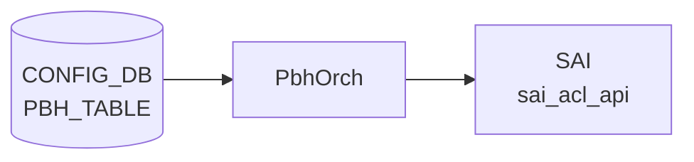

# PBH_TABLE / PBH_RULE テーブル

## 概要

Policy Based Hashing (PBH) は、packet match 条件ごとに [ECMP](../../reference/glossary.md#term-ecmp) / [LAG](../../reference/glossary.md#term-lag) hash profile を切り替えるための [CONFIG_DB](../../reference/glossary.md#term-config_db) テーブル群。`PBH_TABLE` が適用 interface の集合を定義し、`PBH_RULE` が table 内の match 条件、priority、適用する `PBH_HASH` を持つ[^1]。hash profile と hash field は同じ [YANG](../../reference/glossary.md#term-yang) モジュールの `PBH_HASH` / `PBH_HASH_FIELD` で定義され、実装側のテーブル名定数は `schema.h` も参照する[^2]。

<!-- cdb-mermaid -->
### データフロー (自動生成)



!!! note "凡例"
    CONFIG_DB から SAI までの典型経路を `docs/reference/config-db-orch-map.md` から機械生成したミニ図。詳細・例外は本ページ本文と対応表を参照。
<!-- /cdb-mermaid -->

## key 構造

```text
PBH_TABLE|<table_name>
PBH_RULE|<table_name>|<rule_name>
PBH_HASH|<hash_name>
PBH_HASH_FIELD|<hash_field_name>
```

`PBH_RULE.table_name` は `PBH_TABLE.table_name` への leafref。

## 主要フィールド

### PBH_TABLE

| フィールド | 型 | 必須 | 説明 |
|-----------|----|------|------|
| `interface_list` | ordered leaf-list `PORT` / `PORTCHANNEL` leafref | yes | PBH table を適用する interface 群 |
| `description` | string 1..255 | yes | table の説明 |

### PBH_RULE

| フィールド | 型 | 既定値 | 説明 |
|-----------|----|--------|------|
| `priority` | uint32 | - | rule priority。mandatory |
| `gre_key` | hex value/mask | - | GRE key match |
| `ether_type` | hex uint16 string | - | EtherType match |
| `ip_protocol` | hex uint8 string | - | IPv4 protocol match |
| `ipv6_next_header` | hex uint8 string | - | IPv6 next-header match |
| `l4_dst_port` | hex uint16 string | - | L4 destination port match |
| `inner_ether_type` | hex uint16 string | - | inner EtherType match |
| `hash` | leafref `PBH_HASH.hash_name` | - | 適用する hash。mandatory |
| `packet_action` | enum | `SET_ECMP_HASH` | rule action |
| `flow_counter` | enum | `DISABLED` | packet / byte counter の有効化 |

## 制約

- `PBH_TABLE.interface_list` は 1 要素以上で、`PORT` または `PORTCHANNEL` への leafref。
- `PBH_TABLE.description`、`PBH_RULE.priority`、`PBH_RULE.hash` は mandatory。
- match field の多くは `0x...` 形式、または `0x.../0x...` 形式の文字列 pattern で検証される。
- `PBH_RULE.hash` は `PBH_HASH`、`PBH_HASH.hash_field_list` は `PBH_HASH_FIELD` への leafref。

## 購読者

- `sonic-utilities/scripts/pbh`（CLI 側スクリプト）: [CONFIG_DB](../../reference/glossary.md#term-config_db) の PBH table / rule / hash / hash-field を読み取り、ユーザ向け CLI を提供する（独立した `pbhmgrd` プロセスは master には存在しない）。
- `orchagent` の `PbhOrch` (`sonic-swss/orchagent/pbhorch.cpp`): [CONFIG_DB](../../reference/glossary.md#term-config_db) の PBH 設定を直接 subscribe して [SAI](../../reference/glossary.md#term-sai) hash / [ACL](../../reference/glossary.md#term-acl) 相当のオブジェクトへ反映する。

## 関連 CONFIG_DB / YANG / CLI

- 関連 CONFIG_DB: `PBH_HASH`、`PBH_HASH_FIELD`、`PORT`、`PORTCHANNEL`
- 関連 CLI: `config pbh`
- 関連 [YANG](../../reference/glossary.md#term-yang): `sonic-pbh`

<!-- cdb-exceptions -->
## 例外条件・特殊挙動

<!-- evidence: meta/_intermediate/cdb-flow/pbh.md -->

### YANG スキーマ検証
- `PBH_HASH_FIELD.hash_field`、`sequence_id`、`PBH_RULE.priority`、`PBH_RULE.hash`、`PBH_TABLE.description` は mandatory。
- `ip_mask` は `when` + `must` 条件: IPv4 フィールドに `:` を含む address や IPv6 フィールドに `.` を含む address は reject。
- `PBH_HASH.hash_field_list` は `min-elements 1`。`PBH_TABLE.interface_list` は `min-elements 1`。
- `PBH_RULE.table_name` / `hash` は leafref 参照整合性チェックあり。

### consumer (pbhorch) 例外動作
- 重複 SET: `Failed to create PBH table(%s) in SAI: object already exists` → `return false`。
- type / stage / ports / validate 失敗: 各 `SWSS_LOG_ERROR` + `return false`。
- SAI 能力チェック失敗 (ADD/UPDATE/REMOVE 不対応): `unsupported capabilities` → `return false`。
- DEL で存在しない table: `object doesn't exist` → `return false`。
- `packet_action` 未指定時 default: `SET_ECMP_HASH`。`flow_counter` 未指定時 default: `DISABLED`。

<!-- /cdb-exceptions -->

<!-- ref-triangle:start -->

## 関連リファレンス

- [YANG](../../reference/glossary.md#term-yang): [`sonic-pbh`](../yang/sonic-pbh.md)
- CLI: `config pbh`

<!-- ref-triangle:end -->

## 引用元

[^1]: YANG 定義: `sonic-pbh.yang`. <https://github.com/sonic-net/sonic-buildimage/blob/9ea932ec2e18f35e58268ec2e4456b1d4afd65cd/src/sonic-yang-models/yang-models/sonic-pbh.yang>
[^2]: テーブル名定数参照: `schema.h`. <https://github.com/sonic-net/sonic-swss-common/blob/158de8d3463ff4b841653f6d57190bb142b80d9c/common/schema.h>

<!-- ops-hint -->
## 運用ヒント

### 典型値

- key 形式: `PBH_TABLE|<name>`、`PBH_RULE|<table>|<rule>`、`PBH_HASH|<hash>`、`PBH_HASH_FIELD|<field>`。
- match field は `0x...` / `0x.../0x...` (mask 付) の hex 文字列。
- `packet_action=SET_ECMP_HASH` が一般的。

### よくある誤設定

- `priority` が他 rule と衝突して評価順序が予測不能。
- `hash` フィールドに未定義の `PBH_HASH` を指定し leafref エラー。
- `interface_list` に未登録の `PORTCHANNEL` を入れる。

### 確認コマンド

```bash
sonic-db-cli CONFIG_DB keys 'PBH_*'
show pbh table
show pbh rule
show pbh statistics
```
<!-- /ops-hint -->

<!-- glossary-links-injected: 32758c44ab11 -->
