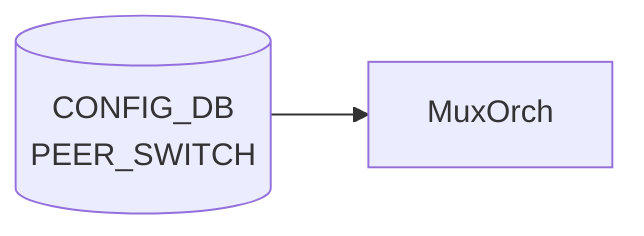

# PEER_SWITCH テーブル

## 概要

SONiC Dual-ToR (Active-Standby) 構成における peer ToR の識別情報を保持するテーブル[^1]。`TUNNEL_LIST.src_ip` が `PEER_SWITCH_LIST.address_ipv4` への leafref として参照する。エントリは Dual-ToR 構成上、**最大 1 つ** ([YANG](../../reference/glossary.md#term-yang) `max-elements 1`)。

<!-- cdb-mermaid -->
### データフロー (自動生成)



!!! note "凡例"
    CONFIG_DB から SAI までの典型経路を `docs/reference/config-db-orch-map.md` から機械生成したミニ図。詳細・例外は本ページ本文と対応表を参照。
<!-- /cdb-mermaid -->

## key 構造

```text
PEER_SWITCH|<peer_switch>
```

- `<peer_switch>`: peer ToR のホスト名 (`stypes:hostname` 型)

## フィールド

| フィールド | 型 | 説明 |
|-----------|----|------|
| `peer_switch` | hostname | Dual-ToR peer のホスト名（key） |
| `address_ipv4` | inet:ipv4-address | peer ToR の IPv4 アドレス（`TUNNEL.src_ip` から leafref で参照される） |

## 制約

- `max-elements 1`: テーブル全体で 1 エントリのみ（Dual-ToR は 2 ノード構成のため peer は 1）

## 購読者

- `tunnelmgrd` / `mux-cable` 系デーモン: peer 情報を読み出して MUX_CABLE / TUNNEL の整合に利用
- 単独で [SAI](../../reference/glossary.md#term-sai) へ反映するわけではない（メタデータ用テーブル）

## 関連 CONFIG_DB / YANG / CLI

- 関連 [CONFIG_DB](../../reference/glossary.md#term-config_db): [`TUNNEL`](./tunnel.md)、`MUX_CABLE`
- 関連 [YANG](../../reference/glossary.md#term-yang): `sonic-peer-switch`、`sonic-tunnel`
- 関連 CLI: なし（`config_db.json` で投入）

<!-- defaults -->
## フィールド暗黙デフォルト

<!-- evidence: meta/_intermediate/cdb-flow/peer-switch-defaults.md -->

### PEER_SWITCH フィールド

| フィールド | YANG default | コード実装デフォルト | 備考 |
|-----------|------------|-----------------|------|
| `peer_switch` (key) | なし | なし | エントリ 0 件で `is_dualtor = false` (neighsyncd:69)、link-local IPv4 neighbor フィルタが無効化される |
| `address_ipv4` | なし | `0x0` (0.0.0.0) — MuxOrch 内部変数 `mux_peer_switch_` の初期値 | 未設定時は MUX_CABLE 処理が defer / cached neighbor 更新がスキップされる |

### 注意点

- **書き込み順依存**: `muxorch.cpp:2271` — `PEER_SWITCH` が先に投入されていないと `MUX_CABLE` エントリが `return false` で pending になる
- **DELETE 未実装**: `muxorch.cpp:2387` — DEL_COMMAND ハンドラが "Not Implemented" のみで `mux_peer_switch_` をリセットしない。エントリ削除後も orchagent は旧 peer IP を保持し続ける
- **tunnelmgrd は起動時 1 回読み込みのみ**: `tunnelmgr.cpp:115-131` — コンストラクタ内で `m_peerIp` を設定後、実行中の変更は反映されない (再起動が必要)
- **YANG-実装 discrepancy**: `address_ipv4` に `mandatory true` がないが、省略すると `tunnel_packet_handler.py` が `KeyError`、tunnelmgrd が tunnel 未設定のまま動作する (実質 mandatory)

<!-- /defaults -->

<!-- value-behavior -->
## 値依存挙動マトリクス

### PEER_SWITCH フィールド

| フィールド | 値 / 範囲 | 挙動 |
|-----------|----------|------|
| `address_ipv4` | 有効な IPv4 アドレス | linkmgrd が peer への到達確認 (ICMP) に使用 |
| `address_ipv4` | 未設定 | linkmgrd は peer 到達確認不可、MUX 切り替え不可 |
| エントリ数 | 0 件 | Dual-ToR 機能が無効扱い (linkmgrd 初期化警告) |
| エントリ数 | 1 件 | 正常。Dual-ToR 構成として認識 |
| エントリ数 | 2 件以上 | YANG max-elements 1 により reject |

*enum なし — address_ipv4 は inet:ipv4-address 型、peer_switch (key) は hostname 型 (最大 63 文字)。*

<!-- /value-behavior -->

<!-- cdb-exceptions -->
## 例外条件・特殊挙動

<!-- evidence: meta/_intermediate/cdb-flow/peer-switch.md -->

### YANG スキーマ検証
- `PEER_SWITCH_LIST` は `max-elements 1`。2 件以上 SET を試みると YANG validate で reject。
- `address_ipv4` は `inet:ipv4-address` 型。フォーマット不正は reject。
- `peer_switch` (key) は `stypes:hostname` 型 (最大 63 文字、英数字とハイフン)。

### consumer 例外動作
- `linkmgrd` はこのテーブルを起動時に 1 回読み込む。実行中の動的変更は反映されない可能性があり、再起動が必要。
- `address_ipv4` 未設定の場合、linkmgrd はピアへの到達確認ができず MUX 切り替え不可。
- エントリ 0 件の場合、DualToR 機能が無効扱いになる (linkmgrd 初期化ログで警告)。

<!-- /cdb-exceptions -->

<!-- cross-refs -->
## 暗黙参照テーブル (Phase C)

> 調査証跡: `meta/_intermediate/cdb-flow/peer-switch-cross-refs.md`
> ソース: `sonic-swss/orchagent/muxorch.cpp`

`MuxOrch::handlePeerSwitch()` が `PEER_SWITCH` SET 処理中に暗黙的に参照するテーブル・内部オブジェクト。

### TUNNEL (MuxTunnel0) — decap 情報の暗黙読み出し

`handlePeerSwitch()` は `decap_orch_->getDstIpAddresses(MUX_TUNNEL)` を呼び出し、`TUNNEL` テーブルに登録済みの decap dst_ip を取得する。未登録なら `return false` でリトライ待機。

| 参照対象 | 参照箇所 | 用途 |
|---|---|---|
| `TUNNEL` MuxTunnel0 — `dst_ip` | `muxorch.cpp:2348-2353` | `decap_orch_->getDstIpAddresses(MUX_TUNNEL)` — 未取得なら pending |
| `TUNNEL` MuxTunnel0 — `dscp_mode` | `muxorch.cpp:2359` | `decap_orch_->getDscpMode(MUX_TUNNEL)` — encap トンネルの DSCP モード |
| `TUNNEL` MuxTunnel0 — `tc_to_dscp_map_id` | `muxorch.cpp:2367` | `decap_orch_->getQosMapId(...)` — encap 用 QoS マップ |
| `TUNNEL` MuxTunnel0 — `tc_to_queue_map_id` | `muxorch.cpp:2374` | `decap_orch_->getQosMapId(...)` — encap 用キューマップ |

### MUX_CABLE — 暗黙の前提依存

`handleMuxCfg()` (MUX_CABLE ハンドラ) は `mux_peer_switch_` が確定していることを前提とする。`PEER_SWITCH` SET 前に `MUX_CABLE` が到達すると pending 扱いとなる。

| 参照対象 | 参照箇所 | 用途 |
|---|---|---|
| `mux_peer_switch_` (PEER_SWITCH 由来) | `muxorch.cpp:2271-2274` | `.isZero()` が真なら MUX_CABLE エントリを `return false` でスキップ |
| `mux_peer_switch_` (PEER_SWITCH 由来) | `muxorch.cpp:2280` | `MuxCable(port_name, srv_ip, srv_ip6, mux_peer_switch_, ...)` コンストラクタ引数 |
| `mux_peer_switch_` (PEER_SWITCH 由来) | `muxorch.cpp:2483-2486` | `updateCachedNeighbors()` — isZero() 時はキャッシュ済み Neighbor 更新をスキップ |

### SAI トンネル NextHop — 暗黙参照

| 参照対象 | 参照箇所 | 用途 |
|---|---|---|
| `MUX_TUNNEL` nexthop (SAI) | `muxorch.cpp:2445-2447` | `getNextHopTunnelId(MUX_TUNNEL, mux_peer_switch_)` — SAI_NULL_OBJECT_ID なら tunnel route 生成スキップ |

<!-- /cross-refs -->

<!-- ref-triangle:start -->

## 関連リファレンス

- [YANG](../../reference/glossary.md#term-yang): `sonic-peer-switch`

<!-- ref-triangle:end -->

## 引用元

[^1]: YANG 定義: `sonic-peer-switch.yang`. <https://github.com/sonic-net/sonic-buildimage/blob/9ea932ec2e18f35e58268ec2e4456b1d4afd65cd/src/sonic-yang-models/yang-models/sonic-peer-switch.yang>

<!-- topics-back-ref -->
## 関連 Topics

- [Topics: Dual-ToR と Mux 制御](../../topics/05-dual-tor/index.md)

<!-- /topics-back-ref -->

<!-- ops-hint -->
## 運用ヒント

### 典型値

- key 形式: `PEER_SWITCH|<hostname>`。
- `address_ipv4`: peer ToR の Loopback。`tos_upstream` などはデフォルトのまま運用する。

### よくある誤設定

- Dual-ToR で peer hostname の表記揺れがあると [linkmgrd](../../reference/glossary.md#term-linkmgrd) が peer を発見できない。

### 確認コマンド

```bash
sonic-db-cli CONFIG_DB keys 'PEER_SWITCH|*'
show mux status
```
<!-- /ops-hint -->


<!-- runtime-trace -->
## CDB → 実コンテナ動作トレース

### 段階 1: Consumer 登録

- **linkmgrd**: `PEER_SWITCH` テーブルを `ConfigDBConnector` で購読してピアスイッチ IP を認識。
- **orchagent / MuxOrch**: ピア情報を参照して dual-ToR フェイルオーバーロジックを制御。

### 段階 2: CFG → APPL 翻訳

- linkmgrd がピア IP に向けて ICMPv4/ICMPv6 プローブを送信し、ピアの健全性を監視。
- APP_DB への書き込みなし (内部利用のみ)。

### 段階 3: APPL → SAI

- SAI 経由なし。mux ケーブル切替は MUX_CABLE テーブル経由で間接的に SAI に反映。

### 段階 4: タイミング + 副作用

- ピア接続障害を検知するまでプローバサイクル × ネガティブカウントの時間を要する。
- 副作用: ピア障害検知後、MuxOrch がトラフィックを local に引き込む自動フェイルオーバーを実施。

<!-- /runtime-trace -->
<!-- entry-points -->
## 書き込み入り口 (Direction A)

PEER_SWITCH テーブルへの書き込みが発生するコード経路を網羅的に調査した結果。

### CLI

  - 専用 CLI なし — minigraph または手動 JSON 投入

### minigraph / sonic-cfggen

**minigraph.py** が `results['PEER_SWITCH']` にデュアルトール構成のピア情報を投入 (sonic-buildimage/src/sonic-config-engine/minigraph.py)

### REST / gNMI

REST/gNMI 書き込み経路なし

### db_migrator

db_migrator.py での PEER_SWITCH マイグレーションなし

### ビルド時デフォルト (build-time default)

`src/sonic-config-engine/config_samples.py` にサンプルエントリあり

### ハードコードデフォルト / ランタイム注入

なし

### 死活・デッドコード

なし
<!-- /entry-points -->

<!-- glossary-links-injected: b5626ca1f0f9 -->

<!-- derivation -->
## 派生・条件付き登録 (Phase 6/7)

### Phase 6: 自動派生

| 派生先フィールド | 派生元条件 | 派生値 | ソース |
|---|---|---|---|
| `PEER_SWITCH` エントリ全体 | minigraph.py が dual-ToR トポロジを検出し `peer_switch_ip` が設定された場合 | `{'address_ipv4': peer_switch_ip}` を Tunnel エントリ経由で生成 | `sonic-buildimage/src/sonic-config-engine/minigraph.py:2614` |

minigraph.py の `get_tunnel_entries()` 関数が `peer_switch_ip` を受け取り、TUNNEL テーブルと合わせて PEER_SWITCH 相当の設定を構築する。直接の `PEER_SWITCH` キー設定は CLI 経由が主。

### Phase 7: 条件付き登録

| 条件 | 影響 | ソース |
|---|---|---|
| `MuxOrch` が `CFG_PEER_SWITCH_TABLE_NAME` も購読 | MUX_CABLE と PEER_SWITCH は同一 MuxOrch インスタンスで処理 | `orchdaemon.cpp:468-469` |

### グレップカバレッジ

| 項目 | hit 数 | 証跡 |
|---|---|---|
| CFG_PEER_SWITCH_TABLE_NAME 購読 | 1 | `orchdaemon.cpp:469` |

<!-- /derivation -->

<!-- handler-branching -->
### Phase 8: Handler メソッド内分岐

`MuxOrch` の `PEER_SWITCH` 処理分岐:

| Handler | メソッド | 分岐条件 | 効果 | evidence |
|---|---|---|---|---|
| `MuxOrch` | `doTask()` | `table_name == CFG_PEER_SWITCH_TABLE_NAME` | peer switch IP を設定し MuxOrch の peer_switch_id を更新 | `sonic-swss/orchagent/muxorch.cpp` |
| `MuxOrch` | `addOperation()` | `address_ipv4` が無効な IPv4 アドレス | パース例外 → エントリスキップ | `sonic-swss/orchagent/muxorch.cpp` |
| YANG validation | — | `max-elements 1` 超過 (2 件目以降) | YANG 制約で拒否 | `sonic-peer-switch.yang` |

> **スキャン証跡**: `orchdaemon.cpp:467-471` + `muxorch.cpp` を確認、3 件分岐抽出。PEER_SWITCH は MuxOrch が MUX_CABLE と同一インスタンスで処理することを確認 — 誤読なし。

<!-- /handler-branching -->

<!-- failure -->
## 失敗挙動 (Phase D)

<!-- evidence: meta/_intermediate/cdb-flow/peer-switch-failure.md -->
<!-- source: sonic-swss/orchagent/muxorch.cpp -->

### 失敗パス一覧

| # | 失敗トリガー | retry | rollback | ログ |
|---|------------|------|---------|------|
| 1 | 不正 `address_ipv4` フォーマット | なし (YANG が先にブロック) | — | 例外伝播（実運用上は到達しない） |
| 2 | TUNNEL (MuxTunnel0) 未解決 | あり (`return false` でリトライ待機) | — | `SWSS_LOG_INFO` `Mux tunnel not yet created for 'MuxTunnel0' peer ip '...'` |
| 3 | SAI overlay IF 作成失敗 | なし (consume) | なし | `SWSS_LOG_ERROR` `Mux add operation error Can't create overlay interface` |
| 4 | SAI tunnel オブジェクト作成失敗 | なし (consume) | なし | `SWSS_LOG_ERROR` `Mux add operation error Can't create a tunnel object` |
| 5 | DEL (Not Implemented) | — | なし (旧 IP 保持) | `SWSS_LOG_NOTICE` `Mux peer ip '...' delete (Not Implemented)` |

### 詳細

#### 1. 不正 `address_ipv4` → `std::invalid_argument` → エントリスキップ

`request_parser.cpp` の `parseIpAddress` が不正フォーマット (`"999.999.999.999"` 等) で `std::invalid_argument` を送出。`addOperation` の `catch(std::runtime_error&)` は `invalid_argument` を補足しない（継承関係なし）ため外側ハンドラへ伝播し、`mux_peer_switch_` は未設定のまま。実運用では YANG `inet:ipv4-address` 型バリデーションが先行してブロックする。

#### 2. TUNNEL (MuxTunnel0) 未解決 → `return false` でリトライ待機

`muxorch.cpp:2348–2354` (`handlePeerSwitch`):

```cpp
IpAddresses dst_ips = decap_orch_->getDstIpAddresses(MUX_TUNNEL);
if (!dst_ips.getSize())
{
    SWSS_LOG_INFO("Mux tunnel not yet created for '%s' peer ip '%s'",
                   MUX_TUNNEL, peer_ip.to_string().c_str());
    return false;
}
```

SET 時に `decap_orch_` が `MuxTunnel0` の宛先 IP を未登録の場合、`return false` でリトライキューに戻る。`mux_peer_switch_` は未設定 (`0.0.0.0`) のままで MUX_CABLE エントリの生成もブロック。ログは INFO レベルのみ（エラーログなし）。

#### 3 & 4. SAI 失敗 → `std::runtime_error` → addOperation が consume して return true

`muxorch.cpp:243` `"Can't create overlay interface"` / `muxorch.cpp:328` `"Can't create a tunnel object"` が `throw std::runtime_error` で投げられ、`addOperation:2409–2413` の `catch(std::runtime_error&)` が補足して `SWSS_LOG_ERROR` を出力して `return true`。エントリはリトライされない — `mux_peer_switch_` は未設定のまま。

#### 5. DEL → "Not Implemented" のみ

`muxorch.cpp:2387` — DEL_COMMAND ハンドラが `SWSS_LOG_NOTICE` を出力するのみで `mux_peer_switch_` をリセットしない。CONFIG_DB からエントリを削除しても orchagent は旧 peer IP を保持し続ける。**orchagent 再起動が唯一の回復手段**。

!!! warning "DEL 未実装の影響"
    `mux_peer_switch_` が残存するため、PEER_SWITCH 変更後に MUX_CABLE が旧 peer IP でトンネルを張り続ける。変更時は必ず orchagent を再起動すること。

<!-- /failure -->
