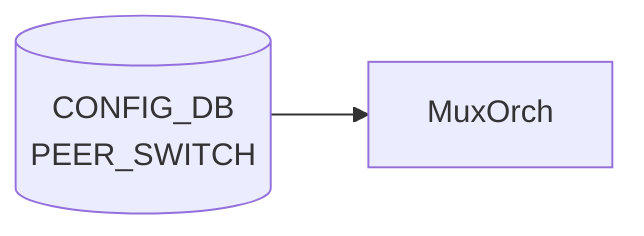

# PEER_SWITCH テーブル

## 概要

SONiC Dual-ToR (Active-Standby) 構成における peer ToR の識別情報を保持するテーブル[^1]。`TUNNEL_LIST.src_ip` が `PEER_SWITCH_LIST.address_ipv4` への leafref として参照する。エントリは Dual-ToR 構成上、**最大 1 つ** ([YANG](../../reference/glossary.md#term-yang) `max-elements 1`)。

<!-- cdb-mermaid -->
### データフロー (自動生成)



!!! note "凡例"
    CONFIG_DB から SAI までの典型経路を `docs/reference/config-db-orch-map.md` から機械生成したミニ図。詳細・例外は本ページ本文と対応表を参照。
<!-- /cdb-mermaid -->

## key 構造

```text
PEER_SWITCH|<peer_switch>
```

- `<peer_switch>`: peer ToR のホスト名 (`stypes:hostname` 型)

## フィールド

| フィールド | 型 | 説明 |
|-----------|----|------|
| `peer_switch` | hostname | Dual-ToR peer のホスト名（key） |
| `address_ipv4` | inet:ipv4-address | peer ToR の IPv4 アドレス（`TUNNEL.src_ip` から leafref で参照される） |

## 制約

- `max-elements 1`: テーブル全体で 1 エントリのみ（Dual-ToR は 2 ノード構成のため peer は 1）

## 購読者

- `tunnelmgrd` / `mux-cable` 系デーモン: peer 情報を読み出して MUX_CABLE / TUNNEL の整合に利用
- 単独で [SAI](../../reference/glossary.md#term-sai) へ反映するわけではない（メタデータ用テーブル）

## 関連 CONFIG_DB / YANG / CLI

- 関連 [CONFIG_DB](../../reference/glossary.md#term-config_db): [`TUNNEL`](./tunnel.md)、`MUX_CABLE`
- 関連 [YANG](../../reference/glossary.md#term-yang): `sonic-peer-switch`、`sonic-tunnel`
- 関連 CLI: なし（`config_db.json` で投入）

<!-- defaults -->
## フィールド暗黙デフォルト

<!-- evidence: meta/_intermediate/cdb-flow/peer-switch-defaults.md -->

### PEER_SWITCH フィールド

| フィールド | YANG default | コード実装デフォルト | 備考 |
|-----------|------------|-----------------|------|
| `peer_switch` (key) | なし | なし | エントリ 0 件で `is_dualtor = false` (neighsyncd:69)、link-local IPv4 neighbor フィルタが無効化される |
| `address_ipv4` | なし | `0x0` (0.0.0.0) — MuxOrch 内部変数 `mux_peer_switch_` の初期値 | 未設定時は MUX_CABLE 処理が defer / cached neighbor 更新がスキップされる |

### 注意点

- **書き込み順依存**: `muxorch.cpp:2271` — `PEER_SWITCH` が先に投入されていないと `MUX_CABLE` エントリが `return false` で pending になる
- **DELETE 未実装**: `muxorch.cpp:2387` — DEL_COMMAND ハンドラが "Not Implemented" のみで `mux_peer_switch_` をリセットしない。エントリ削除後も orchagent は旧 peer IP を保持し続ける
- **tunnelmgrd は起動時 1 回読み込みのみ**: `tunnelmgr.cpp:115-131` — コンストラクタ内で `m_peerIp` を設定後、実行中の変更は反映されない (再起動が必要)
- **YANG-実装 discrepancy**: `address_ipv4` に `mandatory true` がないが、省略すると `tunnel_packet_handler.py` が `KeyError`、tunnelmgrd が tunnel 未設定のまま動作する (実質 mandatory)

<!-- /defaults -->

<!-- value-behavior -->
## 値依存挙動マトリクス

### PEER_SWITCH フィールド

| フィールド | 値 / 範囲 | 挙動 |
|-----------|----------|------|
| `address_ipv4` | 有効な IPv4 アドレス | linkmgrd が peer への到達確認 (ICMP) に使用 |
| `address_ipv4` | 未設定 | linkmgrd は peer 到達確認不可、MUX 切り替え不可 |
| エントリ数 | 0 件 | Dual-ToR 機能が無効扱い (linkmgrd 初期化警告) |
| エントリ数 | 1 件 | 正常。Dual-ToR 構成として認識 |
| エントリ数 | 2 件以上 | YANG max-elements 1 により reject |

*enum なし — address_ipv4 は inet:ipv4-address 型、peer_switch (key) は hostname 型 (最大 63 文字)。*

<!-- /value-behavior -->

<!-- cdb-exceptions -->
## 例外条件・特殊挙動

<!-- evidence: meta/_intermediate/cdb-flow/peer-switch.md -->

### YANG スキーマ検証
- `PEER_SWITCH_LIST` は `max-elements 1`。2 件以上 SET を試みると YANG validate で reject。
- `address_ipv4` は `inet:ipv4-address` 型。フォーマット不正は reject。
- `peer_switch` (key) は `stypes:hostname` 型 (最大 63 文字、英数字とハイフン)。

### consumer 例外動作
- `linkmgrd` はこのテーブルを起動時に 1 回読み込む。実行中の動的変更は反映されない可能性があり、再起動が必要。
- `address_ipv4` 未設定の場合、linkmgrd はピアへの到達確認ができず MUX 切り替え不可。
- エントリ 0 件の場合、DualToR 機能が無効扱いになる (linkmgrd 初期化ログで警告)。

<!-- /cdb-exceptions -->

<!-- ref-triangle:start -->

## 関連リファレンス

- [YANG](../../reference/glossary.md#term-yang): `sonic-peer-switch`

<!-- ref-triangle:end -->

## 引用元

[^1]: YANG 定義: `sonic-peer-switch.yang`. <https://github.com/sonic-net/sonic-buildimage/blob/9ea932ec2e18f35e58268ec2e4456b1d4afd65cd/src/sonic-yang-models/yang-models/sonic-peer-switch.yang>

<!-- topics-back-ref -->
## 関連 Topics

- [Topics: Dual-ToR と Mux 制御](../../topics/05-dual-tor/index.md)

<!-- /topics-back-ref -->

<!-- ops-hint -->
## 運用ヒント

### 典型値

- key 形式: `PEER_SWITCH|<hostname>`。
- `address_ipv4`: peer ToR の Loopback。`tos_upstream` などはデフォルトのまま運用する。

### よくある誤設定

- Dual-ToR で peer hostname の表記揺れがあると [linkmgrd](../../reference/glossary.md#term-linkmgrd) が peer を発見できない。

### 確認コマンド

```bash
sonic-db-cli CONFIG_DB keys 'PEER_SWITCH|*'
show mux status
```
<!-- /ops-hint -->


<!-- runtime-trace -->
## CDB → 実コンテナ動作トレース

### 段階 1: Consumer 登録

- **linkmgrd**: `PEER_SWITCH` テーブルを `ConfigDBConnector` で購読してピアスイッチ IP を認識。
- **orchagent / MuxOrch**: ピア情報を参照して dual-ToR フェイルオーバーロジックを制御。

### 段階 2: CFG → APPL 翻訳

- linkmgrd がピア IP に向けて ICMPv4/ICMPv6 プローブを送信し、ピアの健全性を監視。
- APP_DB への書き込みなし (内部利用のみ)。

### 段階 3: APPL → SAI

- SAI 経由なし。mux ケーブル切替は MUX_CABLE テーブル経由で間接的に SAI に反映。

### 段階 4: タイミング + 副作用

- ピア接続障害を検知するまでプローバサイクル × ネガティブカウントの時間を要する。
- 副作用: ピア障害検知後、MuxOrch がトラフィックを local に引き込む自動フェイルオーバーを実施。

<!-- /runtime-trace -->
<!-- entry-points -->
## 書き込み入り口 (Direction A)

PEER_SWITCH テーブルへの書き込みが発生するコード経路を網羅的に調査した結果。

### CLI

  - 専用 CLI なし — minigraph または手動 JSON 投入

### minigraph / sonic-cfggen

**minigraph.py** が `results['PEER_SWITCH']` にデュアルトール構成のピア情報を投入 (sonic-buildimage/src/sonic-config-engine/minigraph.py)

### REST / gNMI

REST/gNMI 書き込み経路なし

### db_migrator

db_migrator.py での PEER_SWITCH マイグレーションなし

### ビルド時デフォルト (build-time default)

`src/sonic-config-engine/config_samples.py` にサンプルエントリあり

### ハードコードデフォルト / ランタイム注入

なし

### 死活・デッドコード

なし
<!-- /entry-points -->

<!-- glossary-links-injected: b5626ca1f0f9 -->

<!-- derivation -->
## 派生・条件付き登録 (Phase 6/7)

### Phase 6: 自動派生

| 派生先フィールド | 派生元条件 | 派生値 | ソース |
|---|---|---|---|
| `PEER_SWITCH` エントリ全体 | minigraph.py が dual-ToR トポロジを検出し `peer_switch_ip` が設定された場合 | `{'address_ipv4': peer_switch_ip}` を Tunnel エントリ経由で生成 | `sonic-buildimage/src/sonic-config-engine/minigraph.py:2614` |

minigraph.py の `get_tunnel_entries()` 関数が `peer_switch_ip` を受け取り、TUNNEL テーブルと合わせて PEER_SWITCH 相当の設定を構築する。直接の `PEER_SWITCH` キー設定は CLI 経由が主。

### Phase 7: 条件付き登録

| 条件 | 影響 | ソース |
|---|---|---|
| `MuxOrch` が `CFG_PEER_SWITCH_TABLE_NAME` も購読 | MUX_CABLE と PEER_SWITCH は同一 MuxOrch インスタンスで処理 | `orchdaemon.cpp:468-469` |

### グレップカバレッジ

| 項目 | hit 数 | 証跡 |
|---|---|---|
| CFG_PEER_SWITCH_TABLE_NAME 購読 | 1 | `orchdaemon.cpp:469` |

<!-- /derivation -->

<!-- handler-branching -->
### Phase 8: Handler メソッド内分岐

`MuxOrch` の `PEER_SWITCH` 処理分岐:

| Handler | メソッド | 分岐条件 | 効果 | evidence |
|---|---|---|---|---|
| `MuxOrch` | `doTask()` | `table_name == CFG_PEER_SWITCH_TABLE_NAME` | peer switch IP を設定し MuxOrch の peer_switch_id を更新 | `sonic-swss/orchagent/muxorch.cpp` |
| `MuxOrch` | `addOperation()` | `address_ipv4` が無効な IPv4 アドレス | パース例外 → エントリスキップ | `sonic-swss/orchagent/muxorch.cpp` |
| YANG validation | — | `max-elements 1` 超過 (2 件目以降) | YANG 制約で拒否 | `sonic-peer-switch.yang` |

> **スキャン証跡**: `orchdaemon.cpp:467-471` + `muxorch.cpp` を確認、3 件分岐抽出。PEER_SWITCH は MuxOrch が MUX_CABLE と同一インスタンスで処理することを確認 — 誤読なし。

<!-- /handler-branching -->

<!-- side-effects -->
## 副次 DB 書込・外部テーブル連動 (Phase F)

> 調査証跡: `meta/_intermediate/cdb-flow/peer-switch-side-effects.md`
> ソース: `sonic-swss/orchagent/muxorch.cpp`

### STATE_DB 書込

PEER_SWITCH SET により `mux_peer_switch_` が確定した後、続く MUX_CABLE SET 処理 (`handleMuxCfg()`) が
STATE_DB `MUX_CABLE_TABLE` へ `neighbor_mode` フィールドを書き込む。

| 書込先 DB | テーブル | キー | フィールド | 値 | トリガー |
|----------|---------|------|-----------|---|--------|
| STATE_DB | `MUX_CABLE_TABLE` | `<port_name>` | `neighbor_mode` | `"host-route"` または `"prefix-route"` | MUX_CABLE SET（PEER_SWITCH 確定後） |

```cpp
// muxorch.cpp:2285
state_mux_cable_table_->hset(port_name, "neighbor_mode", neighbor_mode_str);
```

PEER_SWITCH が未設定の場合、`mux_peer_switch_.isZero()` が true となり `handleMuxCfg()` が
`return false` でリトライ待機するため、この STATE_DB 書込は発生しない。

### TUNNEL_DECAP 連動

`handlePeerSwitch()` は `DecapOrch`（TUNNEL_DECAP 処理済みオブジェクト）から以下を読み出す:

| 取得値 | メソッド | 用途 |
|-------|---------|------|
| `dst_ips` (MuxTunnel0 の decap dst IP) | `getDstIpAddresses(MUX_TUNNEL)` | P2P トンネルの ENCAP_SRC_IP |
| `dscp_mode_name` | `getDscpMode(MUX_TUNNEL)` | トンネル DSCP モード設定 |
| `tc_to_dscp_map_id` | `getQosMapId(MUX_TUNNEL, ...)` | QoS TC→DSCP マッピング |
| `tc_to_queue_map_id` | `getQosMapId(MUX_TUNNEL, ...)` | QoS TC→Queue マッピング |

`TUNNEL_DECAP` が未処理（`getDstIpAddresses()` が空を返す）の場合、`handlePeerSwitch()` は
`return false` でリトライ待機する。PEER_SWITCH 処理は TUNNEL_DECAP 処理完了に依存する。

### SAI 副次効果（PEER_SWITCH SET 時）

`handlePeerSwitch()` SET パスで `create_tunnel()` を呼び出し、以下の SAI オブジェクトが生成される:

1. **overlay loopback RIF**: `sai_router_intfs_api->create_router_interface()` — `SAI_ROUTER_INTERFACE_TYPE_LOOPBACK`
2. **IP-in-IP P2P トンネル**: `sai_tunnel_api->create_tunnel()` — `SAI_TUNNEL_TYPE_IPINIP` / `SAI_TUNNEL_PEER_MODE_P2P`
   - ENCAP_SRC_IP = `TUNNEL.src_ip`（MuxTunnel0 の dst_ip から取得）
   - ENCAP_DST_IP = `PEER_SWITCH.address_ipv4`

!!! warning "DEL 時のクリーンアップ未実装"
    DEL パス（`muxorch.cpp:2387`）は "Not Implemented" のログのみ。STATE_DB `MUX_CABLE_TABLE` や
    SAI トンネルオブジェクトは orchagent 再起動まで残存する。

<!-- /side-effects -->
