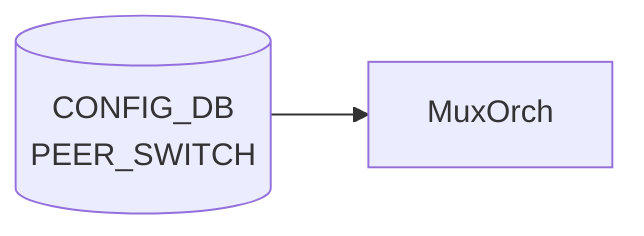

# PEER_SWITCH テーブル

## 概要

SONiC Dual-ToR (Active-Standby) 構成における peer ToR の識別情報を保持するテーブル[^1]。`TUNNEL_LIST.src_ip` が `PEER_SWITCH_LIST.address_ipv4` への leafref として参照する。エントリは Dual-ToR 構成上、**最大 1 つ** ([YANG](../../reference/glossary.md#term-yang) `max-elements 1`)。

<!-- cdb-mermaid -->
### データフロー (自動生成)



!!! note "凡例"
    CONFIG_DB から SAI までの典型経路を `docs/reference/config-db-orch-map.md` から機械生成したミニ図。詳細・例外は本ページ本文と対応表を参照。
<!-- /cdb-mermaid -->

## key 構造

```text
PEER_SWITCH|<peer_switch>
```

- `<peer_switch>`: peer ToR のホスト名 (`stypes:hostname` 型)

## フィールド

| フィールド | 型 | 説明 |
|-----------|----|------|
| `peer_switch` | hostname | Dual-ToR peer のホスト名（key） |
| `address_ipv4` | inet:ipv4-address | peer ToR の IPv4 アドレス（`TUNNEL.src_ip` から leafref で参照される） |

## 制約

- `max-elements 1`: テーブル全体で 1 エントリのみ（Dual-ToR は 2 ノード構成のため peer は 1）

## 購読者

- `tunnelmgrd` / `mux-cable` 系デーモン: peer 情報を読み出して MUX_CABLE / TUNNEL の整合に利用
- 単独で [SAI](../../reference/glossary.md#term-sai) へ反映するわけではない（メタデータ用テーブル）

## 関連 CONFIG_DB / YANG / CLI

- 関連 [CONFIG_DB](../../reference/glossary.md#term-config_db): [`TUNNEL`](./tunnel.md)、`MUX_CABLE`
- 関連 [YANG](../../reference/glossary.md#term-yang): `sonic-peer-switch`、`sonic-tunnel`
- 関連 CLI: なし（`config_db.json` で投入）

<!-- value-behavior -->
## 値依存挙動マトリクス

### PEER_SWITCH フィールド

| フィールド | 値 / 範囲 | 挙動 |
|-----------|----------|------|
| `address_ipv4` | 有効な IPv4 アドレス | linkmgrd が peer への到達確認 (ICMP) に使用 |
| `address_ipv4` | 未設定 | linkmgrd は peer 到達確認不可、MUX 切り替え不可 |
| エントリ数 | 0 件 | Dual-ToR 機能が無効扱い (linkmgrd 初期化警告) |
| エントリ数 | 1 件 | 正常。Dual-ToR 構成として認識 |
| エントリ数 | 2 件以上 | YANG max-elements 1 により reject |

*enum なし — address_ipv4 は inet:ipv4-address 型、peer_switch (key) は hostname 型 (最大 63 文字)。*

<!-- /value-behavior -->

<!-- cdb-exceptions -->
## 例外条件・特殊挙動

<!-- evidence: meta/_intermediate/cdb-flow/peer-switch.md -->

### YANG スキーマ検証
- `PEER_SWITCH_LIST` は `max-elements 1`。2 件以上 SET を試みると YANG validate で reject。
- `address_ipv4` は `inet:ipv4-address` 型。フォーマット不正は reject。
- `peer_switch` (key) は `stypes:hostname` 型 (最大 63 文字、英数字とハイフン)。

### consumer 例外動作
- `linkmgrd` はこのテーブルを起動時に 1 回読み込む。実行中の動的変更は反映されない可能性があり、再起動が必要。
- `address_ipv4` 未設定の場合、linkmgrd はピアへの到達確認ができず MUX 切り替え不可。
- エントリ 0 件の場合、DualToR 機能が無効扱いになる (linkmgrd 初期化ログで警告)。

<!-- /cdb-exceptions -->

<!-- ref-triangle:start -->

## 関連リファレンス

- [YANG](../../reference/glossary.md#term-yang): `sonic-peer-switch`

<!-- ref-triangle:end -->

## 引用元

[^1]: YANG 定義: `sonic-peer-switch.yang`. <https://github.com/sonic-net/sonic-buildimage/blob/9ea932ec2e18f35e58268ec2e4456b1d4afd65cd/src/sonic-yang-models/yang-models/sonic-peer-switch.yang>

<!-- topics-back-ref -->
## 関連 Topics

- [Topics: Dual-ToR と Mux 制御](../../topics/05-dual-tor/index.md)

<!-- /topics-back-ref -->

<!-- ops-hint -->
## 運用ヒント

### 典型値

- key 形式: `PEER_SWITCH|<hostname>`。
- `address_ipv4`: peer ToR の Loopback。`tos_upstream` などはデフォルトのまま運用する。

### よくある誤設定

- Dual-ToR で peer hostname の表記揺れがあると [linkmgrd](../../reference/glossary.md#term-linkmgrd) が peer を発見できない。

### 確認コマンド

```bash
sonic-db-cli CONFIG_DB keys 'PEER_SWITCH|*'
show mux status
```
<!-- /ops-hint -->

<!-- glossary-links-injected: b5626ca1f0f9 -->
