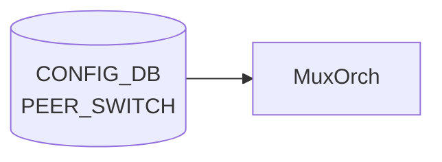

# PEER_SWITCH テーブル

## 概要

[SONiC](../../reference/glossary.md#term-sonic) Dual-ToR (Active-Standby) 構成における peer ToR の識別情報を保持するテーブル[^1]。`TUNNEL_LIST.src_ip` が `PEER_SWITCH_LIST.address_ipv4` への leafref として参照する。エントリは Dual-ToR 構成上、**最大 1 つ** ([YANG](../../reference/glossary.md#term-yang) `max-elements 1`)。

<!-- cdb-mermaid -->
### データフロー (自動生成)



!!! note "凡例"
    CONFIG_DB から SAI までの典型経路を `docs/reference/config-db-orch-map.md` から機械生成したミニ図。詳細・例外は本ページ本文と対応表を参照。
<!-- /cdb-mermaid -->

## key 構造

```text
PEER_SWITCH|<peer_switch>
```

- `<peer_switch>`: peer ToR のホスト名 (`stypes:hostname` 型)

## フィールド

| フィールド | 型 | 説明 |
|-----------|----|------|
| `peer_switch` | hostname | Dual-ToR peer のホスト名（key） |
| `address_ipv4` | inet:ipv4-address | peer ToR の IPv4 アドレス（`TUNNEL.src_ip` から leafref で参照される） |

## 制約

- `max-elements 1`: テーブル全体で 1 エントリのみ（Dual-ToR は 2 ノード構成のため peer は 1）

## 購読者

- `tunnelmgrd` / `mux-cable` 系デーモン: peer 情報を読み出して MUX_CABLE / TUNNEL の整合に利用
- 単独で [SAI](../../reference/glossary.md#term-sai) へ反映するわけではない（メタデータ用テーブル）

## 関連 CONFIG_DB / YANG / CLI

- 関連 [CONFIG_DB](../../reference/glossary.md#term-config_db): [`TUNNEL`](./tunnel.md)、`MUX_CABLE`
- 関連 [YANG](../../reference/glossary.md#term-yang): `sonic-peer-switch`、`sonic-tunnel`
- 関連 CLI: なし（`config_db.json` で投入）

<!-- defaults -->
## フィールド暗黙デフォルト

<!-- evidence: meta/_intermediate/cdb-flow/peer-switch-defaults.md -->

### PEER_SWITCH フィールド

| フィールド | YANG default | コード実装デフォルト | 備考 |
|-----------|------------|-----------------|------|
| `peer_switch` (key) | なし | なし | エントリ 0 件で `is_dualtor = false` ([neighsyncd](../../reference/glossary.md#term-neighsyncd):69)、link-local IPv4 neighbor フィルタが無効化される |
| `address_ipv4` | なし | `0x0` (0.0.0.0) — [MuxOrch](../../reference/glossary.md#term-muxorch) 内部変数 `mux_peer_switch_` の初期値 | 未設定時は MUX_CABLE 処理が defer / cached neighbor 更新がスキップされる |

### 注意点

- **書き込み順依存**: `muxorch.cpp:2271` — `PEER_SWITCH` が先に投入されていないと `MUX_CABLE` エントリが `return false` で pending になる
- **DELETE 未実装**: `muxorch.cpp:2387` — DEL_COMMAND ハンドラが "Not Implemented" のみで `mux_peer_switch_` をリセットしない。エントリ削除後も [orchagent](../../reference/glossary.md#term-orchagent) は旧 peer IP を保持し続ける
- **[tunnelmgrd](../../reference/glossary.md#term-tunnelmgrd) は起動時 1 回読み込みのみ**: `tunnelmgr.cpp:115-131` — コンストラクタ内で `m_peerIp` を設定後、実行中の変更は反映されない (再起動が必要)
- **YANG-実装 discrepancy**: `address_ipv4` に `mandatory true` がないが、省略すると `tunnel_packet_handler.py` が `KeyError`、[tunnelmgrd](../../reference/glossary.md#term-tunnelmgrd) が tunnel 未設定のまま動作する (実質 mandatory)

<!-- /defaults -->

<!-- value-behavior -->
## 値依存挙動マトリクス

### PEER_SWITCH フィールド

| フィールド | 値 / 範囲 | 挙動 |
|-----------|----------|------|
| `address_ipv4` | 有効な IPv4 アドレス | [linkmgrd](../../reference/glossary.md#term-linkmgrd) が peer への到達確認 (ICMP) に使用 |
| `address_ipv4` | 未設定 | [linkmgrd](../../reference/glossary.md#term-linkmgrd) は peer 到達確認不可、[MUX](../../reference/glossary.md#term-mux) 切り替え不可 |
| エントリ数 | 0 件 | Dual-ToR 機能が無効扱い (linkmgrd 初期化警告) |
| エントリ数 | 1 件 | 正常。Dual-ToR 構成として認識 |
| エントリ数 | 2 件以上 | YANG max-elements 1 により reject |

*enum なし — address_ipv4 は inet:ipv4-address 型、peer_switch (key) は hostname 型 (最大 63 文字)。*

<!-- /value-behavior -->

<!-- cdb-exceptions -->
## 例外条件・特殊挙動

<!-- evidence: meta/_intermediate/cdb-flow/peer-switch.md -->

### YANG スキーマ検証
- `PEER_SWITCH_LIST` は `max-elements 1`。2 件以上 SET を試みると YANG validate で reject。
- `address_ipv4` は `inet:ipv4-address` 型。フォーマット不正は reject。
- `peer_switch` (key) は `stypes:hostname` 型 (最大 63 文字、英数字とハイフン)。

### consumer 例外動作
- `linkmgrd` はこのテーブルを起動時に 1 回読み込む。実行中の動的変更は反映されない可能性があり、再起動が必要。
- `address_ipv4` 未設定の場合、linkmgrd はピアへの到達確認ができず [MUX](../../reference/glossary.md#term-mux) 切り替え不可。
- エントリ 0 件の場合、DualToR 機能が無効扱いになる (linkmgrd 初期化ログで警告)。

<!-- /cdb-exceptions -->

<!-- cross-refs -->
## 暗黙参照テーブル (Phase C)

> 調査証跡: `meta/_intermediate/cdb-flow/peer-switch-cross-refs.md`
> ソース: `sonic-swss/orchagent/muxorch.cpp`

`MuxOrch::handlePeerSwitch()` が `PEER_SWITCH` SET 処理中に暗黙的に参照するテーブル・内部オブジェクト。

### TUNNEL (MuxTunnel0) — decap 情報の暗黙読み出し

`handlePeerSwitch()` は `decap_orch_->getDstIpAddresses(MUX_TUNNEL)` を呼び出し、`TUNNEL` テーブルに登録済みの decap dst_ip を取得する。未登録なら `return false` でリトライ待機。

| 参照対象 | 参照箇所 | 用途 |
|---|---|---|
| `TUNNEL` MuxTunnel0 — `dst_ip` | `muxorch.cpp:2348-2353` | `decap_orch_->getDstIpAddresses(MUX_TUNNEL)` — 未取得なら pending |
| `TUNNEL` MuxTunnel0 — `dscp_mode` | `muxorch.cpp:2359` | `decap_orch_->getDscpMode(MUX_TUNNEL)` — encap トンネルの [DSCP](../../reference/glossary.md#term-dscp) モード |
| `TUNNEL` MuxTunnel0 — `tc_to_dscp_map_id` | `muxorch.cpp:2367` | `decap_orch_->getQosMapId(...)` — encap 用 [QoS](../../reference/glossary.md#term-qos) マップ |
| `TUNNEL` MuxTunnel0 — `tc_to_queue_map_id` | `muxorch.cpp:2374` | `decap_orch_->getQosMapId(...)` — encap 用キューマップ |

### MUX_CABLE — 暗黙の前提依存

`handleMuxCfg()` (MUX_CABLE ハンドラ) は `mux_peer_switch_` が確定していることを前提とする。`PEER_SWITCH` SET 前に `MUX_CABLE` が到達すると pending 扱いとなる。

| 参照対象 | 参照箇所 | 用途 |
|---|---|---|
| `mux_peer_switch_` (PEER_SWITCH 由来) | `muxorch.cpp:2271-2274` | `.isZero()` が真なら MUX_CABLE エントリを `return false` でスキップ |
| `mux_peer_switch_` (PEER_SWITCH 由来) | `muxorch.cpp:2280` | `MuxCable(port_name, srv_ip, srv_ip6, mux_peer_switch_, ...)` コンストラクタ引数 |
| `mux_peer_switch_` (PEER_SWITCH 由来) | `muxorch.cpp:2483-2486` | `updateCachedNeighbors()` — isZero() 時はキャッシュ済み Neighbor 更新をスキップ |

### SAI トンネル NextHop — 暗黙参照

| 参照対象 | 参照箇所 | 用途 |
|---|---|---|
| `MUX_TUNNEL` nexthop ([SAI](../../reference/glossary.md#term-sai)) | `muxorch.cpp:2445-2447` | `getNextHopTunnelId(MUX_TUNNEL, mux_peer_switch_)` — SAI_NULL_OBJECT_ID なら tunnel route 生成スキップ |

<!-- /cross-refs -->

<!-- ref-triangle:start -->

## 関連リファレンス

- [YANG](../../reference/glossary.md#term-yang): `sonic-peer-switch`

<!-- ref-triangle:end -->

## 引用元

[^1]: YANG 定義: `sonic-peer-switch.yang`. <https://github.com/sonic-net/sonic-buildimage/blob/9ea932ec2e18f35e58268ec2e4456b1d4afd65cd/src/sonic-yang-models/yang-models/sonic-peer-switch.yang>

<!-- topics-back-ref -->
## 関連 Topics

- [Topics: Dual-ToR と Mux 制御](../../topics/05-dual-tor/index.md)

<!-- /topics-back-ref -->

<!-- ops-hint -->
## 運用ヒント

### 典型値

- key 形式: `PEER_SWITCH|<hostname>`。
- `address_ipv4`: peer ToR の Loopback。`tos_upstream` などはデフォルトのまま運用する。

### よくある誤設定

- Dual-ToR で peer hostname の表記揺れがあると [linkmgrd](../../reference/glossary.md#term-linkmgrd) が peer を発見できない。

### 確認コマンド

```bash
sonic-db-cli CONFIG_DB keys 'PEER_SWITCH|*'
show mux status
```
<!-- /ops-hint -->

<!-- runtime-trace -->
## CDB → 実コンテナ動作トレース

### 段階 1: Consumer 登録

- **linkmgrd**: `PEER_SWITCH` テーブルを `ConfigDBConnector` で購読してピアスイッチ IP を認識。
- **[orchagent](../../reference/glossary.md#term-orchagent) / [MuxOrch](../../reference/glossary.md#term-muxorch)**: ピア情報を参照して dual-ToR フェイルオーバーロジックを制御。

### 段階 2: CFG → APPL 翻訳

- linkmgrd がピア IP に向けて ICMPv4/ICMPv6 プローブを送信し、ピアの健全性を監視。
- APP_DB への書き込みなし (内部利用のみ)。

### 段階 3: APPL → SAI

- [SAI](../../reference/glossary.md#term-sai) 経由なし。mux ケーブル切替は MUX_CABLE テーブル経由で間接的に SAI に反映。

### 段階 4: タイミング + 副作用

- ピア接続障害を検知するまでプローバサイクル × ネガティブカウントの時間を要する。
- 副作用: ピア障害検知後、[MuxOrch](../../reference/glossary.md#term-muxorch) がトラフィックを local に引き込む自動フェイルオーバーを実施。

<!-- /runtime-trace -->
<!-- entry-points -->
## 書き込み入り口 (Direction A)

PEER_SWITCH テーブルへの書き込みが発生するコード経路を網羅的に調査した結果。

### CLI

  - 専用 CLI なし — minigraph または手動 JSON 投入

### minigraph / sonic-cfggen

**minigraph.py** が `results['PEER_SWITCH']` にデュアルトール構成のピア情報を投入 ([sonic-buildimage](../../reference/glossary.md#term-sonic-buildimage)/src/sonic-config-engine/minigraph.py)

### REST / gNMI

REST/[gNMI](../../reference/glossary.md#term-gnmi) 書き込み経路なし

### db_migrator

db_migrator.py での PEER_SWITCH マイグレーションなし

### ビルド時デフォルト (build-time default)

`src/sonic-config-engine/config_samples.py` にサンプルエントリあり

### ハードコードデフォルト / ランタイム注入

なし

### 死活・デッドコード

なし
<!-- /entry-points -->

<!-- glossary-links-injected: b5626ca1f0f9 -->

<!-- derivation -->
## 派生・条件付き登録 (Phase 6/7)

### Phase 6: 自動派生

| 派生先フィールド | 派生元条件 | 派生値 | ソース |
|---|---|---|---|
| `PEER_SWITCH` エントリ全体 | minigraph.py が dual-ToR トポロジを検出し `peer_switch_ip` が設定された場合 | `{'address_ipv4': peer_switch_ip}` を Tunnel エントリ経由で生成 | `sonic-buildimage/src/sonic-config-engine/minigraph.py:2614` |

minigraph.py の `get_tunnel_entries()` 関数が `peer_switch_ip` を受け取り、TUNNEL テーブルと合わせて PEER_SWITCH 相当の設定を構築する。直接の `PEER_SWITCH` キー設定は CLI 経由が主。

### Phase 7: 条件付き登録

| 条件 | 影響 | ソース |
|---|---|---|
| `MuxOrch` が `CFG_PEER_SWITCH_TABLE_NAME` も購読 | MUX_CABLE と PEER_SWITCH は同一 MuxOrch インスタンスで処理 | `orchdaemon.cpp:468-469` |

### グレップカバレッジ

| 項目 | hit 数 | 証跡 |
|---|---|---|
| CFG_PEER_SWITCH_TABLE_NAME 購読 | 1 | `orchdaemon.cpp:469` |

<!-- /derivation -->

<!-- handler-branching -->
### Phase 8: Handler メソッド内分岐

`MuxOrch` の `PEER_SWITCH` 処理分岐:

| Handler | メソッド | 分岐条件 | 効果 | evidence |
|---|---|---|---|---|
| `MuxOrch` | `doTask()` | `table_name == CFG_PEER_SWITCH_TABLE_NAME` | peer switch IP を設定し MuxOrch の peer_switch_id を更新 | `sonic-swss/orchagent/muxorch.cpp` |
| `MuxOrch` | `addOperation()` | `address_ipv4` が無効な IPv4 アドレス | パース例外 → エントリスキップ | `sonic-swss/orchagent/muxorch.cpp` |
| YANG validation | — | `max-elements 1` 超過 (2 件目以降) | YANG 制約で拒否 | `sonic-peer-switch.yang` |

> **スキャン証跡**: `orchdaemon.cpp:467-471` + `muxorch.cpp` を確認、3 件分岐抽出。PEER_SWITCH は MuxOrch が MUX_CABLE と同一インスタンスで処理することを確認 — 誤読なし。

<!-- /handler-branching -->

<!-- constants -->
## ハードコード定数 (Phase E)

> 調査証跡: `meta/_intermediate/cdb-flow/peer-switch-constants.md`
> ソース: `sonic-swss/orchagent/muxorch.cpp` + `sonic-swss/orchagent/tunneldecaporch.h`

### MuxTunnel0 固定名

| 定数 | 値 | 定義箇所 | 用途 |
|------|-----|---------|------|
| `MUX_TUNNEL` | `"MuxTunnel0"` | `tunneldecaporch.h:21` | Dual-ToR トンネルの固定名。`handlePeerSwitch()` が `decap_orch_->getDstIpAddresses(MUX_TUNNEL)` でトンネル設定を取得し、`getNextHopTunnelId(MUX_TUNNEL, mux_peer_switch_)` で next-hop を生成する (`muxorch.cpp:2348`, `2445`) |
| `CFG_PEER_SWITCH_TABLE_NAME` | `"PEER_SWITCH"` | swsscommon (参照: `orchdaemon.cpp:469`) | MuxOrch が購読する [CONFIG_DB](../../reference/glossary.md#term-config_db) テーブル名。handler_map_ への登録キー |
| `MUX_ACL_TABLE_NAME` | `INGRESS_TABLE_DROP` | `muxorch.cpp:48` | [MUX](../../reference/glossary.md#term-mux) 用 ingress [ACL](../../reference/glossary.md#term-acl) テーブル名（マクロ展開） |
| `MUX_ACL_RULE_NAME` | `"mux_acl_rule"` | `muxorch.cpp:49` | MUX 用 [ACL](../../reference/glossary.md#term-acl) ルール名 |
| `MUX_HW_STATE_UNKNOWN` | `"unknown"` | `muxorch.cpp:50` | HW 状態文字列（未確定時） |
| `MUX_HW_STATE_ERROR` | `"error"` | `muxorch.cpp:51` | HW 状態文字列（エラー時） |

### Dual-ToR 識別子

`CFG_PEER_SWITCH_TABLE_NAME`（= `"PEER_SWITCH"`）のエントリが [CONFIG_DB](../../reference/glossary.md#term-config_db) に 1 件以上存在すること自体が Dual-ToR 構成の識別子として機能する。`neighsyncd.cpp:69` はエントリ数 0 を `is_dualtor = false` と判定し、link-local IPv4 neighbor フィルタを無効化する。

### mux_peer_switch_ 内部初期値

`IpAddress` のデフォルト値は `0.0.0.0`（`isZero() == true`）。`PEER_SWITCH` 未投入時は `mux_peer_switch_.isZero()` が true のまま `MUX_CABLE` エントリが `return false` で pending になる (`muxorch.cpp:2271`)。

<!-- /constants -->

<!-- pubsub -->
## Phase G: 通信メカニズム (CONFIG_DB Subscribe → SAI Tunnel)

> 証跡: `meta/_intermediate/cdb-flow/peer-switch-phaseG.md`
> ソース: `sonic-swss/orchagent/orchdaemon.cpp:467-471`, `muxorch.cpp:217-331,2182-2391`

### CONFIG_DB Subscribe 登録

`orchdaemon.cpp:467-471` — `MuxOrch` が `CONFIG_DB` の `PEER_SWITCH` テーブルを
`Orch2` フレームワーク経由で購読。`CFG_MUX_CABLE_TABLE_NAME` と同一インスタンス・同一
ディスパッチループ内で処理される。

```cpp
// orchdaemon.cpp:467-471
vector<string> mux_tables = {
    CFG_MUX_CABLE_TABLE_NAME,
    CFG_PEER_SWITCH_TABLE_NAME          // ← PEER_SWITCH を購読
};
gMuxOrch = new MuxOrch(m_configDb, mux_tables, gTunneldecapOrch, gNeighOrch, gFdbOrch);
```

`muxorch.cpp:2189-2190` — コンストラクタ内で handler を登録:

```cpp
handler_map_.insert(handler_pair(CFG_PEER_SWITCH_TABLE_NAME, &MuxOrch::handlePeerSwitch));
```

### SAI Tunnel 生成経路 (SET 時)

```
CONFIG_DB  PEER_SWITCH|<hostname>  SET
  └─ MuxOrch::handlePeerSwitch()          muxorch.cpp:2340-2384
       ├─ decap_orch_->getDstIpAddresses(MUX_TUNNEL)
       │    TUNNEL 未設定 → return false (retry キュー)
       ├─ decap_orch_->getDscpMode / getQosMapId
       └─ create_tunnel(&peer_ip, &dst_ip, ...)  muxorch.cpp:2380
            ├─ sai_router_intfs_api->create_router_interface(...)
            │    SAI_ROUTER_INTERFACE_TYPE_LOOPBACK  (overlay IF)
            └─ sai_tunnel_api->create_tunnel(...)    muxorch.cpp:325
                 SAI_TUNNEL_ATTR_TYPE          = SAI_TUNNEL_TYPE_IPINIP
                 SAI_TUNNEL_ATTR_PEER_MODE     = SAI_TUNNEL_PEER_MODE_P2P
                 SAI_TUNNEL_ATTR_ENCAP_SRC_IP  = PEER_SWITCH.address_ipv4
                 SAI_TUNNEL_ATTR_ENCAP_DST_IP  = TUNNEL.src_ip
                 SAI_TUNNEL_ATTR_ENCAP/DECAP_TTL_MODE = PIPE_MODEL
                 SAI_TUNNEL_ATTR_LOOPBACK_PACKET_ACTION = DROP
```

### DEL 時 (未実装)

`handlePeerSwitch()` DEL パス (`muxorch.cpp:2387`) は `SWSS_LOG_NOTICE "Not Implemented"` のみ。
SAI tunnel 削除・`mux_peer_switch_` リセットは行われない。[orchagent](../../reference/glossary.md#term-orchagent) 再起動が必要。

### linkmgrd の独立購読

`linkmgrd` は `ConfigDBConnector` (Python) で `PEER_SWITCH` を orchagent とは独立して購読。
`address_ipv4` を peer への ICMPv4/ICMPv6 プローブ送信先として使用。起動時 1 回読み込みのみ
（実行中の変更は反映されない）。

<!-- /pubsub -->

<!-- platform -->
## プラットフォーム差 (Phase H)

> 調査証跡: `meta/_intermediate/cdb-flow/peer-switch-platform.md`
> ソース: `sonic-swss/orchagent/muxorch.cpp`、`sonic-buildimage/src/sonic-config-engine/minigraph.py`

### Dual-ToR vs Single-ToR

`PEER_SWITCH` テーブルは **Dual-ToR 専用** のテーブル。`minigraph.py` の `get_peer_switch_info()` 関数が `GeminiPeeringLink` または `LibraPeeringLink` リンクメタデータを検出した場合のみ `address_ipv4` を CONFIG_DB に投入する。

- **Single-ToR**: `GeminiPeeringLink` / `LibraPeeringLink` が存在しないため PEER_SWITCH エントリは生成されない。`MuxOrch` は orchdaemon 上で起動するが `mux_peer_switch_` は `0.0.0.0`（`isZero() == true`）のまま維持される。MUX_CABLE の `handleMuxCfg()` は `mux_peer_switch_.isZero()` を検出して `return false` でリトライ待機となり、実質的に MUX_CABLE 処理全体が停止する (`muxorch.cpp:2271`)。

| 構成 | PEER_SWITCH エントリ | `mux_peer_switch_` | MUX_CABLE 動作 |
|------|---------------------|---------------------|----------------|
| Dual-ToR | 存在（最大 1 エントリ） | peer IPv4 アドレスに設定 | 正常動作 |
| Single-ToR | 存在しない | `0.0.0.0`（isZero=true） | MUX_CABLE が pending のまま |

### SmartSwitch DPU

`DEVICE_METADATA.localhost.subtype == "SmartSwitch"` の場合、`orchdaemon.cpp:613` で `DashEniFwdOrch` を追加起動するが、`MuxOrch` は条件外で無条件に起動する（orchdaemon.cpp:471）。ただし [SmartSwitch](../../reference/glossary.md#term-smartswitch) トポロジでは Dual-ToR のピアリンク定義（`GeminiPeeringLink` 等）を持たないため minigraph が PEER_SWITCH を生成しない。CONFIG_DB に PEER_SWITCH エントリが存在せず、`handlePeerSwitch()` は呼ばれない。

### muxorch.cpp 内に platform 分岐なし

`muxorch.cpp` 自体には `platform`、`SmartSwitch`、`subtype` による明示的な分岐は存在しない。プラットフォーム差は「CONFIG_DB に PEER_SWITCH エントリが存在するか否か」によって暗黙的に決まる設計である。

<!-- /platform -->

<!-- failure -->
## 失敗挙動 (Phase D)

<!-- evidence: meta/_intermediate/cdb-flow/peer-switch-failure.md -->
<!-- source: sonic-swss/orchagent/muxorch.cpp -->

### 失敗パス一覧

| # | 失敗トリガー | retry | rollback | ログ |
|---|------------|------|---------|------|
| 1 | 不正 `address_ipv4` フォーマット | なし (YANG が先にブロック) | — | 例外伝播（実運用上は到達しない） |
| 2 | TUNNEL (MuxTunnel0) 未解決 | あり (`return false` でリトライ待機) | — | `SWSS_LOG_INFO` `Mux tunnel not yet created for 'MuxTunnel0' peer ip '...'` |
| 3 | SAI overlay IF 作成失敗 | なし (consume) | なし | `SWSS_LOG_ERROR` `Mux add operation error Can't create overlay interface` |
| 4 | SAI tunnel オブジェクト作成失敗 | なし (consume) | なし | `SWSS_LOG_ERROR` `Mux add operation error Can't create a tunnel object` |
| 5 | DEL (Not Implemented) | — | なし (旧 IP 保持) | `SWSS_LOG_NOTICE` `Mux peer ip '...' delete (Not Implemented)` |

### 詳細

#### 1. 不正 `address_ipv4` → `std::invalid_argument` → エントリスキップ

`request_parser.cpp` の `parseIpAddress` が不正フォーマット (`"999.999.999.999"` 等) で `std::invalid_argument` を送出。`addOperation` の `catch(std::runtime_error&)` は `invalid_argument` を補足しない（継承関係なし）ため外側ハンドラへ伝播し、`mux_peer_switch_` は未設定のまま。実運用では YANG `inet:ipv4-address` 型バリデーションが先行してブロックする。

#### 2. TUNNEL (MuxTunnel0) 未解決 → `return false` でリトライ待機

`muxorch.cpp:2348–2354` (`handlePeerSwitch`):

```cpp
IpAddresses dst_ips = decap_orch_->getDstIpAddresses(MUX_TUNNEL);
if (!dst_ips.getSize())
{
    SWSS_LOG_INFO("Mux tunnel not yet created for '%s' peer ip '%s'",
                   MUX_TUNNEL, peer_ip.to_string().c_str());
    return false;
}
```

SET 時に `decap_orch_` が `MuxTunnel0` の宛先 IP を未登録の場合、`return false` でリトライキューに戻る。`mux_peer_switch_` は未設定 (`0.0.0.0`) のままで MUX_CABLE エントリの生成もブロック。ログは INFO レベルのみ（エラーログなし）。

#### 3 & 4. SAI 失敗 → `std::runtime_error` → addOperation が consume して return true

`muxorch.cpp:243` `"Can't create overlay interface"` / `muxorch.cpp:328` `"Can't create a tunnel object"` が `throw std::runtime_error` で投げられ、`addOperation:2409–2413` の `catch(std::runtime_error&)` が補足して `SWSS_LOG_ERROR` を出力して `return true`。エントリはリトライされない — `mux_peer_switch_` は未設定のまま。

#### 5. DEL → "Not Implemented" のみ

`muxorch.cpp:2387` — DEL_COMMAND ハンドラが `SWSS_LOG_NOTICE` を出力するのみで `mux_peer_switch_` をリセットしない。CONFIG_DB からエントリを削除しても orchagent は旧 peer IP を保持し続ける。**orchagent 再起動が唯一の回復手段**。

!!! warning "DEL 未実装の影響"
    `mux_peer_switch_` が残存するため、PEER_SWITCH 変更後に MUX_CABLE が旧 peer IP でトンネルを張り続ける。変更時は必ず orchagent を再起動すること。

<!-- /failure -->

<!-- ordering -->
## 書込み順依存 (Phase B)

> 調査証跡: `meta/_intermediate/cdb-flow/peer-switch-ordering.md`
> ソース: `sonic-swss/orchagent/muxorch.cpp`

### SET 時の先行必須テーブル

| 先行テーブル | 理由 | ソース |
|---|---|---|
| `TUNNEL` (MuxTunnel0) | `handlePeerSwitch()` が `decap_orch_->getDstIpAddresses(MUX_TUNNEL)` を確認。未設定なら `return false` でリトライ待機 | `muxorch.cpp:2348-2353` |

### Dual-ToR 全体の必須投入順序

```
TUNNEL (MuxTunnel0 — decap dst IP 登録)
       ↓
PEER_SWITCH|<hostname>  SET
  → handlePeerSwitch() が create_tunnel() を呼び mux_peer_switch_ を確定
       ↓
MUX_CABLE|<port>  SET
  → handleMuxCfg() が mux_peer_switch_ を参照して MuxCable オブジェクトを生成
```

`muxorch.cpp:2271` — MUX_CABLE は PEER_SWITCH が未設定だと pending:

```cpp
if (mux_peer_switch_.isZero())
{
    SWSS_LOG_INFO("Mux Peer switch addr not yet configured, port '%s'", port_name.c_str());
    return false;
}
```

### Neighbor キャッシュ更新との関係

`muxorch.cpp:2483` — `processCachedNeighUpdates()` も `mux_peer_switch_` が 0.0.0.0 の場合は
neighbor 更新を全スキップする:

```cpp
if (mux_peer_switch_.isZero())
{
    SWSS_LOG_NOTICE("Skip process cached neighbor updates, no peer switch addr is configured");
    return;
}
```

すなわち PEER_SWITCH 確定前に到着した neighbor 更新は処理待ちキャッシュに蓄積され、
PEER_SWITCH 確定後に一括処理される。

### MUX_LINKMGR との関係

MUX_LINKMGR は orchagent 非経由で `linkmgrd` が直接処理するため、PEER_SWITCH との
orchagent レベルの順序依存はない。ただし linkmgrd は PEER_SWITCH の `address_ipv4` を
ピアへの ICMP プローブ送信先として使用するため、linkmgrd 起動前に PEER_SWITCH が
CONFIG_DB に存在していることが望ましい。

!!! warning "PEER_SWITCH DELETE は未実装"
    `handlePeerSwitch()` の DEL パス (`muxorch.cpp:2387`) は "Not Implemented" のログのみで
    `mux_peer_switch_` をリセットしない。エントリ削除後も orchagent は旧 peer IP を保持し続ける。
    **PEER_SWITCH の変更は orchagent 再起動が必要。**

!!! note "max-elements 1 による投入制限"
    YANG の `max-elements 1` 制約により、既存エントリがある状態での 2 件目の SET は
    YANG バリデーションで reject される。変更する場合は既存エントリを DEL してから SET する
    必要があるが、DEL が orchagent に反映されない（未実装）ため orchagent 再起動を伴う。

<!-- /ordering -->

<!-- side-effects -->
## 副次 DB 書込・外部テーブル連動 (Phase F)

> 調査証跡: `meta/_intermediate/cdb-flow/peer-switch-side-effects.md`
> ソース: `sonic-swss/orchagent/muxorch.cpp`

### STATE_DB 書込

PEER_SWITCH SET により `mux_peer_switch_` が確定した後、続く MUX_CABLE SET 処理 (`handleMuxCfg()`) が
[STATE_DB](../../reference/glossary.md#term-state_db) `MUX_CABLE_TABLE` へ `neighbor_mode` フィールドを書き込む。

| 書込先 DB | テーブル | キー | フィールド | 値 | トリガー |
|----------|---------|------|-----------|---|--------|
| [STATE_DB](../../reference/glossary.md#term-state_db) | `MUX_CABLE_TABLE` | `<port_name>` | `neighbor_mode` | `"host-route"` または `"prefix-route"` | MUX_CABLE SET（PEER_SWITCH 確定後） |

```cpp
// muxorch.cpp:2285
state_mux_cable_table_->hset(port_name, "neighbor_mode", neighbor_mode_str);
```

PEER_SWITCH が未設定の場合、`mux_peer_switch_.isZero()` が true となり `handleMuxCfg()` が
`return false` でリトライ待機するため、この [STATE_DB](../../reference/glossary.md#term-state_db) 書込は発生しない。

### TUNNEL_DECAP 連動

`handlePeerSwitch()` は `DecapOrch`（TUNNEL_DECAP 処理済みオブジェクト）から以下を読み出す:

| 取得値 | メソッド | 用途 |
|-------|---------|------|
| `dst_ips` (MuxTunnel0 の decap dst IP) | `getDstIpAddresses(MUX_TUNNEL)` | P2P トンネルの ENCAP_SRC_IP |
| `dscp_mode_name` | `getDscpMode(MUX_TUNNEL)` | トンネル [DSCP](../../reference/glossary.md#term-dscp) モード設定 |
| `tc_to_dscp_map_id` | `getQosMapId(MUX_TUNNEL, ...)` | [QoS](../../reference/glossary.md#term-qos) TC→[DSCP](../../reference/glossary.md#term-dscp) マッピング |
| `tc_to_queue_map_id` | `getQosMapId(MUX_TUNNEL, ...)` | [QoS](../../reference/glossary.md#term-qos) TC→Queue マッピング |

`TUNNEL_DECAP` が未処理（`getDstIpAddresses()` が空を返す）の場合、`handlePeerSwitch()` は
`return false` でリトライ待機する。PEER_SWITCH 処理は TUNNEL_DECAP 処理完了に依存する。

### SAI 副次効果（PEER_SWITCH SET 時）

`handlePeerSwitch()` SET パスで `create_tunnel()` を呼び出し、以下の SAI オブジェクトが生成される:

1. **overlay loopback [RIF](../../reference/glossary.md#term-rif)**: `sai_router_intfs_api->create_router_interface()` — `SAI_ROUTER_INTERFACE_TYPE_LOOPBACK`
2. **IP-in-IP P2P トンネル**: `sai_tunnel_api->create_tunnel()` — `SAI_TUNNEL_TYPE_IPINIP` / `SAI_TUNNEL_PEER_MODE_P2P`
   - ENCAP_SRC_IP = `TUNNEL.src_ip`（MuxTunnel0 の dst_ip から取得）
   - ENCAP_DST_IP = `PEER_SWITCH.address_ipv4`

!!! warning "DEL 時のクリーンアップ未実装"
    DEL パス（`muxorch.cpp:2387`）は "Not Implemented" のログのみ。STATE_DB `MUX_CABLE_TABLE` や
    SAI トンネルオブジェクトは orchagent 再起動まで残存する。

<!-- /side-effects -->

<!-- glossary-links-injected: 832ce64dc615 -->
