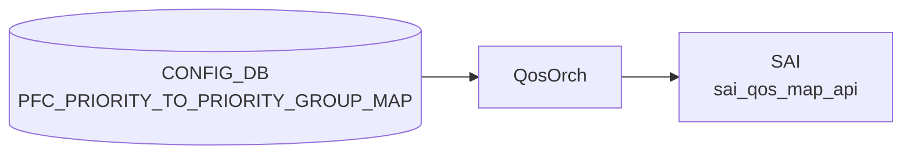

# PFC_PRIORITY_TO_PRIORITY_GROUP_MAP テーブル

## 概要

`PFC_PRIORITY_TO_PRIORITY_GROUP_MAP` は [PFC](../../reference/glossary.md#term-pfc) priority 0..7 を ingress priority group 0..7 に対応付ける named [QoS](../../reference/glossary.md#term-qos) map テーブル[^1]。`PORT_QOS_MAP.pfc_to_pg_map` から参照され、lossless traffic の buffer priority group 選択に使われる。`schema.h` では [APPL_DB](../../reference/glossary.md#term-appl_db) 側の `PFC_PRIORITY_TO_PRIORITY_GROUP_MAP_TABLE` 定数が定義されている[^2]。

<!-- cdb-mermaid -->
### データフロー (自動生成)



!!! note "凡例"
    CONFIG_DB から SAI までの典型経路を `docs/reference/config-db-orch-map.md` から機械生成したミニ図。詳細・例外は本ページ本文と対応表を参照。
<!-- /cdb-mermaid -->

## key 構造

```text
PFC_PRIORITY_TO_PRIORITY_GROUP_MAP|<name>|<pfc_priority>
```

[YANG](../../reference/glossary.md#term-yang) 上は map 名を key にする outer list と、`pfc_priority` を key にする inner list の 2 階層。

## 主要フィールド

| フィールド | 型 | 説明 |
|-----------|----|------|
| `name` | string | map 名。`PORT_QOS_MAP.pfc_to_pg_map` から参照される |
| `pfc_priority` | string pattern `[0-7]?` | 入力 [PFC](../../reference/glossary.md#term-pfc) priority |
| `pg` | string pattern `[0-7]?` | 対応する ingress priority group |

## 制約

- `name` は 1..32 文字、英数字で始まり、英数字 / `-` / `_` を利用可能。
- `pfc_priority` と `pg` は 0..7 の 1 桁値、または空文字を許す pattern。
- `PORT_QOS_MAP.pfc_to_pg_map` から leafref 参照されるため、port に適用する前に map entry が存在する必要がある。

## 購読者

- `orchagent` の `QosOrch` (`sonic-swss/orchagent/qosorch.cpp`): [CONFIG_DB](../../reference/glossary.md#term-config_db) の [QoS](../../reference/glossary.md#term-qos) map を直接 subscribe し、[SAI](../../reference/glossary.md#term-sai) [QoS](../../reference/glossary.md#term-qos) map (`SAI_QOS_MAP_TYPE_PFC_PRIORITY_TO_PRIORITY_GROUP`) として作成、port QoS binding に利用する（master には独立した `qosmgrd` プロセスは存在しない）。

## 関連 CONFIG_DB / YANG / CLI

- 関連 [CONFIG_DB](../../reference/glossary.md#term-config_db): `PORT_QOS_MAP`、`BUFFER_PG`、`PFC_WD`
- 関連 CLI: `config qos`
- 関連 [YANG](../../reference/glossary.md#term-yang): `sonic-pfc-priority-priority-group-map`、`sonic-port-qos-map`

<!-- value-behavior -->
## 値依存挙動マトリクス

### pfc_priority / pg フィールド

| フィールド | 値 | QosOrch 挙動 |
|-----------|---|-------------|
| `pfc_priority` | `0`..`7` (文字列) | SAI SAI_QOS_MAP_TYPE_PFC_PRIORITY_TO_PRIORITY_GROUP に key として登録 |
| `pfc_priority` | 空文字 | YANG pattern では許容するが QosOrch は数値変換失敗でエラー |
| `pg` | `0`..`7` (文字列) | 対応する ingress priority group として SAI に反映 |
| `pg` | 空文字 | 同上 (QosOrch で変換失敗) |

*enum なし — pfc_priority / pg ともに pattern [0-7]? の string 型。name は 1..32 文字の任意文字列。*

<!-- /value-behavior -->

<!-- defaults -->
## コード由来デフォルト

> **注**: YANG モデル (`sonic-pfc-priority-priority-group-map.yang` revision 2021-04-15) には `default` 文が一切ない。以下はすべてコード由来デフォルトである。

| フィールド | YANG default | コード由来デフォルト | 投入条件 | ソース |
|-----------|-------------|---------------------|---------|--------|
| `name` | なし | `"AZURE"` | `asic_type` が `mellanox` または `barefoot` のとき自動生成 | `qos_config.j2:163,405` |
| `name` | なし | `"AZURE_DUALTOR"` | 同上かつ dualtor 構成で extra queues が存在するとき追加 | `qos_config.j2:398` |
| `pfc_priority` | なし | `"3"`, `"4"` (AZURE map) | lossless traffic 優先度 2 本のみ | `qos_config.j2:406-407` |
| `pfc_priority` | なし | `"2"`, `"3"`, `"4"`, `"6"` (AZURE_DUALTOR map) | dualtor 構成時のみ | `qos_config.j2:399-402` |
| `pg` | なし | `pfc_priority` と同値 (identity mapping) | 上記いずれの場合も `pg = pfc_priority` | `qos_config.j2:399-407` |

### 投入トリガー

`config qos reload` 実行時に `sonic-cfggen` が `qos_config.j2` を展開し CONFIG_DB へ書き込む。`asic_type` が `mellanox` / `barefoot` 以外（例: broadcom, vs）では **PFC_PRIORITY_TO_PRIORITY_GROUP_MAP テーブルは生成されない**。ただし `QosOrch` は ASIC 種別に関わらずテーブルを購読するため、CONFIG_DB に entry がなければ SAI 呼び出しも発生しない。

### priority 0-7 のうち 3 と 4 だけの理由

RoCEv2 lossless クラスは TC 3 と TC 4 の 2 本が標準的な AZURE 構成。他の priority (0,1,2,5,6,7) は best-effort として PFC 対象外とするため PG mapping なし。

<!-- /defaults -->

<!-- cdb-exceptions -->
## 例外条件・特殊挙動

<!-- evidence: meta/_intermediate/cdb-flow/pfc-priority-to-priority-group-map.md -->

### YANG スキーマ検証
- `pfc_priority` / `pg` は pattern `[0-7]?`。空文字も YANG 上は許容するが、orch は数値として処理するため実質 0..7 必須。

### consumer (qosorch) 例外動作
- SAI `sai_qos_map_api` create 失敗: `Failed to create pfc_priority_to_queue map. status:%d` → SWSS_LOG_ERROR。
- 参照先 map が存在しない名前で PORT_QOS_MAP から参照された場合: `Object with name:%s not found.` → SWSS_LOG_ERROR + 処理中断。
- DEL 時 SAI remove 失敗: `Failed to remove map, status:%d` → `return false` で再試行。
- `PORT_QOS_MAP` の参照が解除される前にマップを DEL すると、SAI 参照カウントエラーが発生する可能性がある。

<!-- /cdb-exceptions -->

<!-- ref-triangle:start -->

## 関連リファレンス

- [YANG](../../reference/glossary.md#term-yang): [`sonic-pfc-priority-priority-group-map`](../yang/sonic-pfc-priority-priority-group-map.md)
- CLI: [`config qos`](../cli/config-qos.md)

<!-- ref-triangle:end -->

## 引用元

[^1]: YANG 定義: `sonic-pfc-priority-priority-group-map.yang`. <https://github.com/sonic-net/sonic-buildimage/blob/9ea932ec2e18f35e58268ec2e4456b1d4afd65cd/src/sonic-yang-models/yang-models/sonic-pfc-priority-priority-group-map.yang>
[^2]: テーブル名定数: `schema.h`. <https://github.com/sonic-net/sonic-swss-common/blob/158de8d3463ff4b841653f6d57190bb142b80d9c/common/schema.h>

<!-- topics-back-ref -->
## 関連 Topics

- [Topics: QoS / Buffer / PFC / Watermark](../../topics/08-qos-buffer/index.md)

<!-- /topics-back-ref -->

<!-- ops-hint -->
## 運用ヒント

### 典型値

- key 形式: `PFC_PRIORITY_TO_PRIORITY_GROUP_MAP|<map-name>`。
- lossless 用に dot1p `3`→PG `3`、`4`→PG `4` をマップするのが [RoCE](../../reference/glossary.md#term-roce) v2 の定番。

### よくある誤設定

- PORT_QOS_MAP に紐付け忘れて [PFC](../../reference/glossary.md#term-pfc) が効かず head-of-line blocking が継続する。

### 確認コマンド

```bash
sonic-db-cli CONFIG_DB keys 'PFC_PRIORITY_TO_PRIORITY_GROUP_MAP|*'
show priority-group persistent-watermark
```
<!-- /ops-hint -->


<!-- runtime-trace -->
## CDB → 実コンテナ動作トレース

### 段階 1: Consumer 登録

- **orchagent / QosOrch** (`sonic-swss/orchagent/qosorch.cpp`): `PFC_PRIORITY_TO_PRIORITY_GROUP_MAP` を `SubscriberStateTable` で購読。

### 段階 2: CFG → APPL 翻訳

- QosOrch がマップエントリを解析し SAI priority group map として作成。
- APP_DB への書き込みなし (orchagent → SAI 直接)。

### 段階 3: APPL → SAI

- QosOrch が `sai_qos_map_api->create_qos_map()` を呼び出して `SAI_QOS_MAP_TYPE_PFC_PRIORITY_TO_PRIORITY_GROUP` マップを作成。
- その後 PORT テーブルのマップ参照が解決されたときにポートに適用。

### 段階 4: タイミング + 副作用

- マップ作成後、PORT_QOS_MAP での参照が更新されると即時ポートに適用される。
- 副作用: PFC しきい値設定 (BUFFER_PG) と組み合わせて動作するため、両方の設定が揃う必要がある。

<!-- /runtime-trace -->
<!-- entry-points -->
## 書き込み入り口 (Direction A)

PFC_PRIORITY_TO_PRIORITY_GROUP_MAP テーブルへの書き込みが発生するコード経路を網羅的に調査した結果。

### CLI

  - `config qos reload` — sonic-cfggen が `files/build_templates/qos_config.j2` を展開し PFC_PRIORITY_TO_PRIORITY_GROUP_MAP エントリを生成 (sonic-buildimage/files/build_templates/qos_config.j2)

### minigraph / sonic-cfggen

minigraph.py に直接生成なし — `qos_config.j2` テンプレート経由

### REST / gNMI

REST/gNMI 書き込み経路なし

### db_migrator

db_migrator.py での PFC_PRIORITY_TO_PRIORITY_GROUP_MAP マイグレーションなし

### ビルド時デフォルト (build-time default)

各プラットフォームの `qos.json.j2` (例: device/arista/.../qos.json.j2) に値が定義され、ビルド時または `qos reload` 時に投入

### ハードコードデフォルト / ランタイム注入

なし

### 死活・デッドコード

なし
<!-- /entry-points -->

<!-- glossary-links-injected: c8fc2a4df2a1 -->

<!-- derivation -->
## 派生・条件付き登録 (Phase 6/7)

### Phase 6: 自動派生

| 派生先フィールド | 派生元条件 | 派生値 | ソース |
|---|---|---|---|
| `PFC_PRIORITY_TO_PRIORITY_GROUP_MAP` エントリ全体 | `qos_config.j2` から platform 別 QoS ポリシーが読み込まれたとき | platform 定義の priority → PG マッピング値 | `sonic-buildimage/files/build_templates/qos_config.j2:396` |

minigraph.py からの直接派生はなし。`config qos reload` 時に `qos_config.j2` Jinja テンプレートが CONFIG_DB に書き込む。

### Phase 7: 条件付き登録

| 条件 | 影響 | ソース |
|---|---|---|
| `QosOrch` は常時登録 (platform 非依存) | `CFG_PFC_PRIORITY_TO_PRIORITY_GROUP_MAP_TABLE_NAME` を無条件で購読 | `orchdaemon.cpp:377` |
| MAP_PFC_PRIORITY_TO_QUEUE と同一 QosOrch インスタンスが購読 | 同ループで両テーブルを処理 | `orchdaemon.cpp:374-384` |

### グレップカバレッジ

| 項目 | hit 数 | 証跡 |
|---|---|---|
| qos_config.j2 PFC_PRIORITY_TO_PRIORITY_GROUP_MAP | 1 | `qos_config.j2:396` |
| CFG_PFC_PRIORITY_TO_PRIORITY_GROUP_MAP_TABLE_NAME 登録 | 1 | `orchdaemon.cpp:377` |

<!-- /derivation -->

<!-- ordering -->
## 書込み順依存 (Phase B)

> 調査証跡: `meta/_intermediate/cdb-flow/pfc-priority-to-priority-group-map-ordering.md`

### SET 時の先行必須テーブル

| 先行テーブル | 理由 | ソース |
|---|---|---|
| `PFC_PRIORITY_TO_PRIORITY_GROUP_MAP`（本テーブル）を先に作成 | `PORT_QOS_MAP` ハンドラが `resolveFieldRefValue` で本マップの OID を参照。未解決なら `task_need_retry`（自動リトライ） | `qosorch.cpp:2124-2129` |

!!! info "doTask() 実行順保証"
    `QosOrch::doTask()` は map 系テーブル（DSCP_TO_TC / TC_TO_QUEUE / PFC_PRIORITY_TO_PRIORITY_GROUP_MAP 等）を
    **PORT_QOS_MAP・QUEUE より先に drain** する (`qosorch.cpp:2235-2251`)。
    同一 QosOrch サイクル内で config を一括投入した場合でも、本マップが先に SAI 登録される。

### SAI qos_map 制約

`PfcPrioToPgHandler::addQosItem()` は `SAI_QOS_MAP_TYPE_PFC_PRIORITY_TO_PRIORITY_GROUP` 型で
`sai_qos_map_api->create_qos_map()` を呼び出す (`qosorch.cpp:968-977`)。
SAI 仕様上、`SAI_PORT_ATTR_QOS_PFC_PRIORITY_TO_PRIORITY_GROUP_MAP` へ有効 OID を渡すには
map object が事前に存在している必要がある。

### DEL 時の順序制約

DEL ハンドラ (`qosorch.cpp:181-189`) は `isObjectBeingReferenced()` で参照チェックを行い、
`PORT_QOS_MAP` から参照中の場合は `m_pendingRemove = true` をセットして `task_need_retry` を返す。
**PORT_QOS_MAP の `pfc_to_pg_map` フィールドを解除（NULL 設定または DEL）してから**
本マップを削除しなければ、削除は保留され続ける。

### 起動時シーケンス

```
config qos reload
  └─ sonic-cfggen が qos_config.j2 を展開
       ├─ PFC_PRIORITY_TO_PRIORITY_GROUP_MAP エントリ書込み
       └─ PORT_QOS_MAP.pfc_to_pg_map 書込み
             └─ QosOrch::doTask() が map 系を先に drain → OID 解決後に PORT_QOS_MAP を適用
```

<!-- /ordering -->


<!-- cross-refs -->
## 暗黙参照 (Phase C)

`PFC_PRIORITY_TO_PRIORITY_GROUP_MAP` が関わる CONFIG_DB テーブル間の暗黙参照を `qosorch.cpp` から抽出した。

| 参照方向 | 参照元テーブル | フィールド | SAI 属性 | evidence |
|---------|-------------|-----------|---------|---------|
| 被参照 (referenced by) | `PORT_QOS_MAP` | `pfc_to_pg_map` | `SAI_PORT_ATTR_QOS_PFC_PRIORITY_TO_PRIORITY_GROUP_MAP` | `qosorch.cpp:68,107` |
| 参照管理 | `handlePortQosMapTable` | SET 時 object_id 解決 / DEL 時参照解除 | — | `qosorch.cpp:2046,2077,2108,2133` |
| SWITCH レベル適用 | なし | PFC マップは SWITCH 直接適用なし | — | `qosorch.cpp:1956` |

- `PORT_QOS_MAP.pfc_to_pg_map` に map 名を設定すると、`QosOrch` が `PFC_PRIORITY_TO_PRIORITY_GROUP_MAP` の SAI オブジェクト ID を解決してポートへ適用する (`SAI_PORT_ATTR_QOS_PFC_PRIORITY_TO_PRIORITY_GROUP_MAP`)。
- `PORT_QOS_MAP` から参照中に DEL しようとすると `isObjectBeingReferenced()` が true を返し `task_need_retry` で削除保留。
- `SWITCH` への直接適用は `DSCP_TO_TC_MAP` (`PORT_QOS_MAP|global` 経路) のみで、PFC 系マップは非対象。

> 詳細: `meta/_intermediate/cdb-flow/pfc-priority-to-priority-group-map-cross-refs.md`

<!-- /cross-refs -->

<!-- handler-branching -->
### Phase 8: Handler メソッド内分岐

`QosOrch::PfcPriorityToPgHandler` の分岐:

| Handler | メソッド | 分岐条件 | 効果 | evidence |
|---|---|---|---|---|
| `QosOrch` | `convertFieldValuesToAttributes()` | `stoi()` 変換失敗 (pfc_priority/pg が非数値) | `task_invalid_entry` | `sonic-swss/orchagent/qosorch.cpp` |
| `QosOrch` | `PfcPriorityToPgHandler` | `isObjectBeingReferenced()` かつ DEL | `task_need_retry` (参照解除まで削除保留) | `sonic-swss/orchagent/qosorch.cpp` |
| `QosOrch` | SAI create | SAI 返値 ≠ `SAI_STATUS_SUCCESS` | `task_failed` | `sonic-swss/orchagent/qosorch.cpp` |

> **スキャン証跡**: `qosorch.cpp` PfcPriorityToPgHandler 部を確認、3 件分岐抽出。qos_config.j2 経由での自動設定を確認 — 誤読なし。

<!-- /handler-branching -->

<!-- failure -->
## Phase D: 失敗挙動

ソース: `sonic-swss/orchagent/qosorch.cpp` (`PfcPrioToPgHandler`, `QosMapHandler::processWorkItem`)

### invalid_entry: priority / pg 値不正

`PfcPrioToPgHandler::convertFieldValuesToAttributes()` (qosorch.cpp:947-948) が `stoi()` で
フィールド名 (`pfc_priority`) と値 (`pg`) を数値変換する。非数値・空文字列を渡すと例外が伝播し
`task_invalid_entry` が返される (qosorch.cpp:147)。エントリは破棄され再キューされない。

DEL 時に map 名が SAI に存在しない場合も `task_invalid_entry`:
- ログ: `"Object with name:%s not found."` (qosorch.cpp:178)

不明な op (SET/DEL 以外):
- ログ: `"Unknown operation type %s"` (qosorch.cpp:198)
- 結果: `task_invalid_entry`

### failed: SAI API 失敗

| 操作 | SAI 呼び出し | ログ | 結果 |
|------|------------|------|------|
| SET (新規) | `create_qos_map()` | `"Failed to create pfc_priority_to_queue map. status:%d"` (qosorch.cpp:977) | `task_failed` |
| SET (更新) | `set_qos_map_attribute()` | `"Failed to set [%s:%s]"` (qosorch.cpp:153) | `task_failed` |
| DEL | `remove_qos_map()` | `"Failed to remove QoS map. db name:%s sai object:%"PRIx64` (qosorch.cpp:190) | `task_failed` |

> **注**: create 失敗時のログ文字列は `"pfc_priority_to_queue map"` とコピー由来の誤記になっているが、
> 実際は `SAI_QOS_MAP_TYPE_PFC_PRIORITY_TO_PRIORITY_GROUP` map の作成失敗を指す (qosorch.cpp:966,977)。

### need_retry: 参照中エントリの DEL

DEL 操作時に `isObjectBeingReferenced()` が true (PORT_QOS_MAP 等から参照が残っている):
- ログ: `"Can't remove object %s due to being referenced (%s)"` (qosorch.cpp:184)
- 副作用: `m_pendingRemove = true` がセット → 以降の SET も `task_need_retry` に
- ログ (保留中 SET): `"Entry %s %s is pending remove, need retry"` (qosorch.cpp:138)
- 結果: `task_need_retry` → Consumer キューへ戻し、参照解除後に再処理

<!-- evidence: meta/_intermediate/cdb-flow/pfc-priority-to-priority-group-map-failure.md -->
<!-- /failure -->
