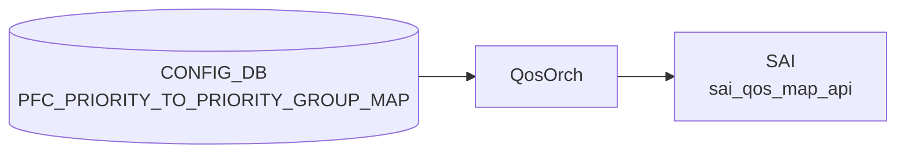

# PFC_PRIORITY_TO_PRIORITY_GROUP_MAP テーブル

## 概要

`PFC_PRIORITY_TO_PRIORITY_GROUP_MAP` は [PFC](../../reference/glossary.md#term-pfc) priority 0..7 を ingress priority group 0..7 に対応付ける named [QoS](../../reference/glossary.md#term-qos) map テーブル[^1]。`PORT_QOS_MAP.pfc_to_pg_map` から参照され、lossless traffic の buffer priority group 選択に使われる。`schema.h` では [APPL_DB](../../reference/glossary.md#term-appl_db) 側の `PFC_PRIORITY_TO_PRIORITY_GROUP_MAP_TABLE` 定数が定義されている[^2]。

<!-- cdb-mermaid -->
### データフロー (自動生成)



!!! note "凡例"
    CONFIG_DB から SAI までの典型経路を `docs/reference/config-db-orch-map.md` から機械生成したミニ図。詳細・例外は本ページ本文と対応表を参照。
<!-- /cdb-mermaid -->

## key 構造

```text
PFC_PRIORITY_TO_PRIORITY_GROUP_MAP|<name>|<pfc_priority>
```

[YANG](../../reference/glossary.md#term-yang) 上は map 名を key にする outer list と、`pfc_priority` を key にする inner list の 2 階層。

## 主要フィールド

| フィールド | 型 | 説明 |
|-----------|----|------|
| `name` | string | map 名。`PORT_QOS_MAP.pfc_to_pg_map` から参照される |
| `pfc_priority` | string pattern `[0-7]?` | 入力 [PFC](../../reference/glossary.md#term-pfc) priority |
| `pg` | string pattern `[0-7]?` | 対応する ingress priority group |

## 制約

- `name` は 1..32 文字、英数字で始まり、英数字 / `-` / `_` を利用可能。
- `pfc_priority` と `pg` は 0..7 の 1 桁値、または空文字を許す pattern。
- `PORT_QOS_MAP.pfc_to_pg_map` から leafref 参照されるため、port に適用する前に map entry が存在する必要がある。

## 購読者

- `orchagent` の `QosOrch` (`sonic-swss/orchagent/qosorch.cpp`): [CONFIG_DB](../../reference/glossary.md#term-config_db) の [QoS](../../reference/glossary.md#term-qos) map を直接 subscribe し、[SAI](../../reference/glossary.md#term-sai) [QoS](../../reference/glossary.md#term-qos) map (`SAI_QOS_MAP_TYPE_PFC_PRIORITY_TO_PRIORITY_GROUP`) として作成、port QoS binding に利用する（master には独立した `qosmgrd` プロセスは存在しない）。

## 関連 CONFIG_DB / YANG / CLI

- 関連 [CONFIG_DB](../../reference/glossary.md#term-config_db): `PORT_QOS_MAP`、`BUFFER_PG`、`PFC_WD`
- 関連 CLI: `config qos`
- 関連 [YANG](../../reference/glossary.md#term-yang): `sonic-pfc-priority-priority-group-map`、`sonic-port-qos-map`

<!-- value-behavior -->
## 値依存挙動マトリクス

### pfc_priority / pg フィールド

| フィールド | 値 | QosOrch 挙動 |
|-----------|---|-------------|
| `pfc_priority` | `0`..`7` (文字列) | SAI SAI_QOS_MAP_TYPE_PFC_PRIORITY_TO_PRIORITY_GROUP に key として登録 |
| `pfc_priority` | 空文字 | YANG pattern では許容するが QosOrch は数値変換失敗でエラー |
| `pg` | `0`..`7` (文字列) | 対応する ingress priority group として SAI に反映 |
| `pg` | 空文字 | 同上 (QosOrch で変換失敗) |

*enum なし — pfc_priority / pg ともに pattern [0-7]? の string 型。name は 1..32 文字の任意文字列。*

<!-- /value-behavior -->

<!-- cdb-exceptions -->
## 例外条件・特殊挙動

<!-- evidence: meta/_intermediate/cdb-flow/pfc-priority-to-priority-group-map.md -->

### YANG スキーマ検証
- `pfc_priority` / `pg` は pattern `[0-7]?`。空文字も YANG 上は許容するが、orch は数値として処理するため実質 0..7 必須。

### consumer (qosorch) 例外動作
- SAI `sai_qos_map_api` create 失敗: `Failed to create pfc_priority_to_queue map. status:%d` → SWSS_LOG_ERROR。
- 参照先 map が存在しない名前で PORT_QOS_MAP から参照された場合: `Object with name:%s not found.` → SWSS_LOG_ERROR + 処理中断。
- DEL 時 SAI remove 失敗: `Failed to remove map, status:%d` → `return false` で再試行。
- `PORT_QOS_MAP` の参照が解除される前にマップを DEL すると、SAI 参照カウントエラーが発生する可能性がある。

<!-- /cdb-exceptions -->

<!-- ref-triangle:start -->

## 関連リファレンス

- [YANG](../../reference/glossary.md#term-yang): [`sonic-pfc-priority-priority-group-map`](../yang/sonic-pfc-priority-priority-group-map.md)
- CLI: [`config qos`](../cli/config-qos.md)

<!-- ref-triangle:end -->

## 引用元

[^1]: YANG 定義: `sonic-pfc-priority-priority-group-map.yang`. <https://github.com/sonic-net/sonic-buildimage/blob/9ea932ec2e18f35e58268ec2e4456b1d4afd65cd/src/sonic-yang-models/yang-models/sonic-pfc-priority-priority-group-map.yang>
[^2]: テーブル名定数: `schema.h`. <https://github.com/sonic-net/sonic-swss-common/blob/158de8d3463ff4b841653f6d57190bb142b80d9c/common/schema.h>

<!-- topics-back-ref -->
## 関連 Topics

- [Topics: QoS / Buffer / PFC / Watermark](../../topics/08-qos-buffer/index.md)

<!-- /topics-back-ref -->

<!-- ops-hint -->
## 運用ヒント

### 典型値

- key 形式: `PFC_PRIORITY_TO_PRIORITY_GROUP_MAP|<map-name>`。
- lossless 用に dot1p `3`→PG `3`、`4`→PG `4` をマップするのが [RoCE](../../reference/glossary.md#term-roce) v2 の定番。

### よくある誤設定

- PORT_QOS_MAP に紐付け忘れて [PFC](../../reference/glossary.md#term-pfc) が効かず head-of-line blocking が継続する。

### 確認コマンド

```bash
sonic-db-cli CONFIG_DB keys 'PFC_PRIORITY_TO_PRIORITY_GROUP_MAP|*'
show priority-group persistent-watermark
```
<!-- /ops-hint -->


<!-- runtime-trace -->
## CDB → 実コンテナ動作トレース

### 段階 1: Consumer 登録

- **orchagent / QosOrch** (`sonic-swss/orchagent/qosorch.cpp`): `PFC_PRIORITY_TO_PRIORITY_GROUP_MAP` を `SubscriberStateTable` で購読。

### 段階 2: CFG → APPL 翻訳

- QosOrch がマップエントリを解析し SAI priority group map として作成。
- APP_DB への書き込みなし (orchagent → SAI 直接)。

### 段階 3: APPL → SAI

- QosOrch が `sai_qos_map_api->create_qos_map()` を呼び出して `SAI_QOS_MAP_TYPE_PFC_PRIORITY_TO_PRIORITY_GROUP` マップを作成。
- その後 PORT テーブルのマップ参照が解決されたときにポートに適用。

### 段階 4: タイミング + 副作用

- マップ作成後、PORT_QOS_MAP での参照が更新されると即時ポートに適用される。
- 副作用: PFC しきい値設定 (BUFFER_PG) と組み合わせて動作するため、両方の設定が揃う必要がある。

<!-- /runtime-trace -->

<!-- glossary-links-injected: c8fc2a4df2a1 -->
