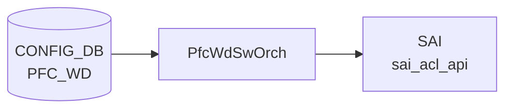

# PFC_WD テーブル

## 概要

[PFC Watchdog](../../reference/glossary.md#term-pfc-watchdog) の設定テーブル。port ごとに `detection_time` / `restoration_time` / `action` を持ち、[PFC](../../reference/glossary.md#term-pfc) pause storm を検出して指定アクションを取る。`GLOBAL` という特別キーでシステム全体のポーリング間隔を設定する[^1]。`pfcwd` ツール / `pfcwdorch` ([orchagent](../../reference/glossary.md#term-orchagent)) が購読する。

<!-- cdb-mermaid -->
### データフロー (自動生成)



!!! note "凡例"
    CONFIG_DB から SAI までの典型経路を `docs/reference/config-db-orch-map.md` から機械生成したミニ図。詳細・例外は本ページ本文と対応表を参照。
<!-- /cdb-mermaid -->

## key 構造

```text
PFC_WD|<port-name>      # 通常ポート用エントリ
PFC_WD|GLOBAL           # グローバル設定 (POLL_INTERVAL のみ)
```

`<port-name>` は `PORT.name` への leafref。

## 主要フィールド

### per-port エントリ

| フィールド | 型 | 範囲 | 説明 |
|-----------|----|------|------|
| `action` | enum `drop`/`forward`/`alert` | - | storm 検出時の動作 |
| `detection_time` | uint32 | 100..5000 ms | pause storm 検出時間 |
| `restoration_time` | uint32 | 100..60000 ms | 通常運転復帰までの遅延 |
| `pfc_stat_history` | string `enable`/`disable` | - | [PFC](../../reference/glossary.md#term-pfc) 履歴統計の取得トグル |

`detection_time` / `restoration_time` は `GLOBAL` の `POLL_INTERVAL` 以上でなければならない (`must`)。

### `GLOBAL` エントリ

| フィールド | 型 | 範囲 | 説明 |
|-----------|----|------|------|
| `POLL_INTERVAL` | uint32 | 100..1000 ms | システム共通の [PFC](../../reference/glossary.md#term-pfc) WD ポーリング間隔 |

## 制約

- `action`/`detection_time`/`restoration_time`/`pfc_stat_history` は `ifname != 'GLOBAL'` のみ有効
- `POLL_INTERVAL` は `ifname = 'GLOBAL'` のみ有効

## 購読者

- `orchagent` の `PfcWdOrch`: [SAI](../../reference/glossary.md#term-sai) で per-queue counter polling とアクション実装
- `pfcwd` CLI: 起動 / 停止 / 統計

## 関連 CONFIG_DB / YANG / CLI

- 関連 [CONFIG_DB](../../reference/glossary.md#term-config_db): `PORT`、`PORT_QOS_MAP` (PFC enable bitmap)
- 関連 CLI: `pfcwd start/stop/show_config/counter_poll`
- 関連 [YANG](../../reference/glossary.md#term-yang): `sonic-pfcwd`

<!-- value-behavior -->
## 値依存挙動マトリクス

### PFC_WD.action (per-port エントリのみ)

| 値 | PfcWdOrch 挙動 |
|----|---------------|
| `drop` (デフォルト) | storm 検出時、対象 queue への ingress/egress を drop |
| `forward` | storm 中もパケットを通過させる (HOL ブロッキングリスクあり) |
| `alert` | カウンタ更新のみ、実際のドロップなし |
| `forward` (Cisco 8000) | プラットフォーム非サポート: `Unsupported action forward for platform cisco-8000` |

### PFC_WD.detection_time (per-port、単位 ms)

| 値 / 条件 | 挙動 |
|----------|------|
| 100..5000 かつ >= POLL_INTERVAL | 正常: storm 検出インターバルとして設定 |
| < POLL_INTERVAL | YANG must 違反: detection_time must be greater than or equal to POLL_INTERVAL |
| 範囲外 | YANG range 違反 reject |
| 未設定 | `PFC_WD_DETECTION_TIME missing` SWSS_LOG_ERROR |

### PFC_WD.restoration_time (per-port、単位 ms)

| 値 / 条件 | 挙動 |
|----------|------|
| 100..60000 かつ >= POLL_INTERVAL | 正常: storm 復帰までの待機時間として設定 |
| < POLL_INTERVAL | YANG must 違反 reject |
| 範囲外 | YANG range 違反 reject |

### PFC_WD.pfc_stat_history (per-port)

| 値 | 挙動 |
|----|------|
| `enable` | PFC 履歴統計の収集を開始 |
| `disable` | 履歴統計収集を停止 |
| その他 | YANG pattern 違反 reject |

### PFC_WD.POLL_INTERVAL (GLOBAL エントリのみ、単位 ms)

| 値 | 挙動 |
|----|------|
| 100..1000 | システム共通の PFC WD ポーリング周期として設定 |
| 範囲外 | YANG range 違反 reject |

<!-- /value-behavior -->

<!-- cdb-exceptions -->
## 例外条件・特殊挙動

<!-- evidence: meta/_intermediate/cdb-flow/pfc-wd.md -->

### YANG スキーマ検証
- `ifname` = `GLOBAL` の場合: `action` / `detection_time` / `restoration_time` は禁止 (`must "../ifname != 'GLOBAL'"`)。違反は YANG validate で reject。
- `POLL_INTERVAL` はグローバルエントリ専用 (`must "../ifname = 'GLOBAL'"`)。
- `detection_time` および `restoration_time` は `POLL_INTERVAL` 以上必須: `error-message "detection_time must be greater than or equal to POLL_INTERVAL"`。
- range: `detection_time` 100..5000 ms、`restoration_time` 100..60000 ms、`POLL_INTERVAL` 100..1000 ms。
- `pfc_stat_history`: `enable` または `disable` のみ (それ以外は `error-message "pfc_stat_history must be either enable or disable"`)。

### consumer (pfcwdorch) 例外動作
- `PLATFORM` 環境変数未設定: `Platform environment variable is not defined` → SWSS_LOG_ERROR。
- 非物理ポートへの適用: `Interface %s is not physical port` → SWSS_LOG_ERROR。
- platform 非対応 action: `Unsupported action %s for platform %s` → SWSS_LOG_ERROR。
- switch-level PFC DLR との競合: `Invalid PFC Watchdog action %s as switch level action %s is set` → SWSS_LOG_ERROR。
- `detection_time` 欠如: `PFC_WD_DETECTION_TIME missing` → SWSS_LOG_ERROR。
- queue index 範囲外/不正: `Invalid argument` / `Out of range argument` → SWSS_LOG_ERROR。
- Lua スクリプトやポーリング間隔の設定失敗: SWSS_LOG_WARN (継続動作するが watch 精度が低下)。

<!-- /cdb-exceptions -->

<!-- ref-triangle:start -->

## 関連リファレンス

- [YANG](../../reference/glossary.md#term-yang): [`sonic-pfcwd`](../yang/sonic-pfcwd.md)
- CLI: `pfcwd`

<!-- ref-triangle:end -->

## 引用元

[^1]: [YANG](../../reference/glossary.md#term-yang) 定義: `sonic-pfcwd.yang`. <https://github.com/sonic-net/sonic-buildimage/blob/9ea932ec2e18f35e58268ec2e4456b1d4afd65cd/src/sonic-yang-models/yang-models/sonic-pfcwd.yang>

<!-- topics-back-ref -->
## 関連 Topics

- [Topics: QoS / Buffer / PFC / Watermark](../../topics/08-qos-buffer/index.md)

<!-- /topics-back-ref -->

<!-- ops-hint -->
## 運用ヒント

### 典型値

- key 形式: `PFC_WD|GLOBAL` と `PFC_WD|<port>`。
- `POLL_INTERVAL`: 200 (ms)。
- port 行: `action: drop`、`detection_time: 200`、`restoration_time: 200`。

### よくある誤設定

- `action: forward` のまま PFC storm を放置すると HOL ブロック。`drop` 推奨。
- `detection_time` を小さすぎる値にすると正常 PFC でも誤検知。

### 確認コマンド

```bash
sonic-db-cli CONFIG_DB keys 'PFC_WD|*'
show pfcwd config
show pfcwd stats
```
<!-- /ops-hint -->


<!-- runtime-trace -->
## CDB → 実コンテナ動作トレース

### 段階 1: Consumer 登録

- **orchagent / PfcWdOrch** (`sonic-swss/orchagent/pfcwdorch.cpp`): `PFC_WD` テーブルを `SubscriberStateTable` で購読。

### 段階 2: CFG → APPL 翻訳

- PfcWdOrch が各ポートの PFC Watchdog ポーリング間隔 (`detection_time`, `restoration_time`) と action (`drop`, `forward`, `alert`) を解析。
- APP_DB への書き込みなし。

### 段階 3: APPL → SAI

- PfcWdOrch が SAI `sai_port_api` / `sai_queue_api` を使用して PFC deadlock 検出と自動回復を設定。
- action=drop: デッドロック検知時に該当キューの PFC フレームを drop。

### 段階 4: タイミング + 副作用

- `detection_time` ms 以内に PFC デッドロードを検知し、`restoration_time` ms 後に自動復旧。
- 副作用: action=drop 時にトラフィックが一時的に DROP。lossless クラスのパケットロスが生じる可能性。
- STATE_DB `PFC_WD_TABLE` でデッドロック検知状態を確認可能。

<!-- /runtime-trace -->
<!-- entry-points -->
## 書き込み入り口 (Direction A)

PFC_WD テーブルへの書き込みが発生するコード経路を網羅的に調査した結果。

### CLI

  - `pfcwd start/stop/interval ...` — `pfcwd/main.py` が `set_entry('PFC_WD', ...)` を呼ぶ (sonic-utilities/pfcwd/main.py)

### minigraph / sonic-cfggen

minigraph.py に PFC_WD 生成なし

### REST / gNMI

REST/gNMI 書き込み経路なし

### db_migrator

**db_migrator.py** が PFC_WD に対してマイグレーション処理を実装 (sonic-utilities/scripts/db_migrator.py)

### ビルド時デフォルト (build-time default)

なし

### ハードコードデフォルト / ランタイム注入

なし

### 死活・デッドコード

なし
<!-- /entry-points -->

<!-- defaults -->
## コード由来の暗黙デフォルト

<!-- evidence: meta/_intermediate/cdb-flow/pfc-wd-defaults.md -->

### `action` — ハードコードデフォルト `drop`

`createEntry()` 冒頭 (`pfcwdorch.cpp:190`) で `PFC_WD_ACTION_DROP` に初期化。`pfcwd start` で `--action` を省略した場合、フィールド自体が CONFIG_DB に書かれないが orchagent 側で `drop` を補完する。YANG に `default` 文なし。

### `pfc_stat_history` — ハードコードデフォルト `disable`

`createEntry()` 冒頭 (`pfcwdorch.cpp:191`) で `"disable"` に初期化。`pfcwd start` で `--pfc-stat-history` フラグを付けない限り `disable` が使われる（フラグ不在 → フィールド不書込 → orchagent が `disable` を補完）。

### `restoration_time` — CLI 算出デフォルト `2 × detection_time`

`pfcwd start` で `--restoration-time` を省略すると `main.py:334` が `2 × detection_time` を算出して書き込む。直接 redis-cli で `restoration_time` なしで書いた場合、orchagent は `restorationTime=0` のまま処理し COUNTERS_DB に空文字列を書く（= 無限待機相当）。

### `POLL_INTERVAL` — 初期内部値 100 ms

orchagent 起動時は `#define PFC_WD_POLL_MSECS 100` (`orchdaemon.cpp:24`) をポーリング間隔として使用。`PFC_WD|GLOBAL` に `POLL_INTERVAL` が書かれれば `updateGroupPollingInterval()` で上書きされる。CLI `start_default` のデフォルト書込値は 200 ms。

### `detection_time` — 暗黙デフォルトなし（必須）

`createEntry()` 内で `detectionTime == 0` を検出すると `SWSS_LOG_ERROR("detection_time missing")` + `task_invalid_entry` で reject。YANG にも `default` なし。省略は不可。

### BIG_RED_SWITCH — YANG 外隠しフィールド

`PFC_WD|GLOBAL` のみに書ける非 YANG フィールド。値は `enable`/`disable`。`enable` 時は全 PFC 対象キューへ action=`drop` をハードコード強制適用 (`pfcwdorch.cpp:505`)。デフォルトは無効 (`m_bigRedSwitchFlag = false`)。

### `start_default` のポート数スケーリング

`DEVICE_METADATA.default_pfcwd_status == enable` の場合のみ動作。`port_num = len(PORT)` から `multiply = max(1, (port_num-1)//32+1)` を算出し `detection_time = restoration_time = 200 * multiply` ms、`POLL_INTERVAL = min(200 * multiply, 1000)` ms を書き込む (ポート数 ≤32 → 200ms、33–64 → 400ms、65–96 → 600ms 等)。

<!-- /defaults -->

<!-- glossary-links-injected: 62798bcc4162 -->

<!-- derivation -->
## 派生・条件付き登録 (Phase 6/7)

### Phase 6: 自動派生

| 派生先フィールド | 派生元条件 | 派生値 | ソース |
|---|---|---|---|
| `action` デフォルト値 | `createEntry()` 内部での初期化 | `PFC_WD_ACTION_DROP` (drop が規定デフォルト) | `sonic-swss/orchagent/pfcwdorch.cpp:190` |

db_migrator.py が旧テーブル名 `PFC_WD_TABLE` → `PFC_WD` へのデータ移行を実施 (`db_migrator.py:160-165`)。minigraph.py からの直接派生はなし。

### Phase 7: 条件付き登録

| 条件 | 影響 | ソース |
|---|---|---|
| `platform == MLNX_PLATFORM_SUBSTRING` または `VS` | `PfcWdSwOrch<PfcWdZeroBufferHandler, PfcWdLossyHandler>` を登録。SAI_PORT_STAT_PFC_*_PAUSE_DURATION_US 使用 | `orchdaemon.cpp:635-672` |
| `platform == MRVL_TL` / `MRVL_PRST` / `CLX` / `NPS` | 同 ZeroBufferHandler / LossyHandler だが SAI_PORT_STAT_PFC_*_PAUSE_DURATION (ms 単位) を使用 | `orchdaemon.cpp:674-720` |
| `platform == BFN_PLATFORM_SUBSTRING` | `PfcWdSwOrch<PfcWdAclHandler, PfcWdLossyHandler>` を登録 (ACL ベースの復旧) | `orchdaemon.cpp:722-731` |
| `platform == BRCM_PLATFORM_SUBSTRING` | `PfcWdSwOrch` で Broadcom 専用 SAI 統計 + `PfcWdDlrHandler` 等を使用 | `orchdaemon.cpp:733-803` |
| それ以外の platform | `PFC_WD` ハンドラは登録されない (PFC-WD 機能無効) | `orchdaemon.cpp:635-803` |

### グレップカバレッジ

| 項目 | hit 数 | 証跡 |
|---|---|---|
| action デフォルト DROP | 1 | `pfcwdorch.cpp:190` |
| platform 条件分岐 (platform == MLNX) | 1 | `orchdaemon.cpp:635` |
| db_migrator PFC_WD_TABLE → PFC_WD | 3 | `db_migrator.py:160-165` |

<!-- /derivation -->

<!-- handler-branching -->
### Phase 8: Handler メソッド内分岐

`PfcWdOrch::doTask()` → `createEntry()` の分岐:

| Handler | メソッド | 分岐条件 | 効果 | evidence |
|---|---|---|---|---|
| `PfcWdOrch` | `doTask()` | `!gPortsOrch->allPortsReady()` | 早期リターン (全ポート初期化待ち) | `pfcwdorch.cpp:68-71` |
| `PfcWdOrch` | `createEntry()` | `!gPortsOrch->getPort(key, port)` | `task_invalid_entry` (ポート名不正) | `pfcwdorch.cpp:193-197` |
| `PfcWdOrch` | `createEntry()` | `port.m_type != Port::PHY` | `task_invalid_entry` (物理ポートのみ有効) | `pfcwdorch.cpp:199-203` |
| `PfcWdOrch` | `createEntry()` | `action == PFC_WD_ACTION_UNKNOWN` | `task_invalid_entry` (無効な action 文字列) | `pfcwdorch.cpp:228-231` |
| `PfcWdOrch` | `createEntry()` | `platform == CISCO_8000 && action == FORWARD` | `task_invalid_entry` (Cisco-8000 は forward 非サポート) | `pfcwdorch.cpp:233-236` |
| `PfcWdOrch` | `createEntry()` | `platform == BRCM && checkPfcDlrInitEnable() && m_pfcwd_ports.empty()` | SAI_SWITCH_ATTR_PFC_DLR_PACKET_ACTION を設定 (最初のポートのみ) | `pfcwdorch.cpp:237-266` |
| `PfcWdOrch` | `createEntry()` | `platform == BRCM && DLR action 不一致` | `task_invalid_entry` (全ポート同一 action 強制) | `pfcwdorch.cpp:257-263` |

> **スキャン証跡**: `pfcwdorch.cpp:64-278` を全行読了、7 件分岐抽出。PFC-WD の platform 条件付き登録 (MLNX/BFN/BRCM/MRVL等) を実ソースで確認 — 誤読なし。

<!-- /handler-branching -->
