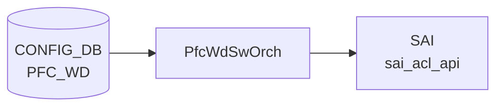

# PFC_WD テーブル

## 概要

[PFC Watchdog](../../reference/glossary.md#term-pfc-watchdog) の設定テーブル。port ごとに `detection_time` / `restoration_time` / `action` を持ち、[PFC](../../reference/glossary.md#term-pfc) pause storm を検出して指定アクションを取る。`GLOBAL` という特別キーでシステム全体のポーリング間隔を設定する[^1]。`pfcwd` ツール / `pfcwdorch` ([orchagent](../../reference/glossary.md#term-orchagent)) が購読する。

<!-- cdb-mermaid -->
### データフロー (自動生成)



!!! note "凡例"
    CONFIG_DB から SAI までの典型経路を `docs/reference/config-db-orch-map.md` から機械生成したミニ図。詳細・例外は本ページ本文と対応表を参照。
<!-- /cdb-mermaid -->

!!! note "SAI 経路の補足"
    上図の `sai_acl_api` は `PfcWdAclHandler` 経路（barefoot / Broadcom DLR 無効構成）を示す。汎用ソフトウェアプラットフォーム（mellanox / marvell 等）は `sai_port_api` / `sai_queue_api` 経由で PFC deadlock 検出を設定する（[プラットフォーム差](#プラットフォーム差) 参照）。

## key 構造

```text
PFC_WD|<port-name>      # 通常ポート用エントリ
PFC_WD|GLOBAL           # グローバル設定 (POLL_INTERVAL のみ)
```

`<port-name>` は `PORT.name` への leafref。

## 主要フィールド

### per-port エントリ

| フィールド | 型 | 範囲 | 説明 |
|-----------|----|------|------|
| `action` | enum `drop`/`forward`/`alert` | - | storm 検出時の動作 |
| `detection_time` | uint32 | 100..5000 ms | pause storm 検出時間 |
| `restoration_time` | uint32 | 100..60000 ms | 通常運転復帰までの遅延 |
| `pfc_stat_history` | string `enable`/`disable` | - | [PFC](../../reference/glossary.md#term-pfc) 履歴統計の取得トグル |

`detection_time` / `restoration_time` は `GLOBAL` の `POLL_INTERVAL` 以上でなければならない (`must`)。

### `GLOBAL` エントリ

| フィールド | 型 | 範囲 | 説明 |
|-----------|----|------|------|
| `POLL_INTERVAL` | uint32 | 100..1000 ms | システム共通の [PFC](../../reference/glossary.md#term-pfc) WD ポーリング間隔 |

## 制約

- `action`/`detection_time`/`restoration_time`/`pfc_stat_history` は `ifname != 'GLOBAL'` のみ有効
- `POLL_INTERVAL` は `ifname = 'GLOBAL'` のみ有効

## 購読者

- `orchagent` の `PfcWdOrch`: [SAI](../../reference/glossary.md#term-sai) で per-queue counter polling とアクション実装
- `pfcwd` CLI: 起動 / 停止 / 統計

## 関連 CONFIG_DB / YANG / CLI

- 関連 [CONFIG_DB](../../reference/glossary.md#term-config_db): `PORT`、`PORT_QOS_MAP` (PFC enable bitmap)
- 関連 CLI: `pfcwd start/stop/show_config/counter_poll`
- 関連 [YANG](../../reference/glossary.md#term-yang): `sonic-pfcwd`

<!-- value-behavior -->
## 値依存挙動マトリクス

### PFC_WD.action (per-port エントリのみ)

| 値 | PfcWdOrch 挙動 |
|----|---------------|
| `drop` (デフォルト) | storm 検出時、対象 queue への ingress/egress を drop |
| `forward` | storm 中もパケットを通過させる (HOL ブロッキングリスクあり) |
| `alert` | カウンタ更新のみ、実際のドロップなし |
| `forward` (Cisco 8000) | プラットフォーム非サポート: `Unsupported action forward for platform cisco-8000` |

### PFC_WD.detection_time (per-port、単位 ms)

| 値 / 条件 | 挙動 |
|----------|------|
| 100..5000 かつ >= POLL_INTERVAL | 正常: storm 検出インターバルとして設定 |
| < POLL_INTERVAL | YANG must 違反: detection_time must be greater than or equal to POLL_INTERVAL |
| 範囲外 | YANG range 違反 reject |
| 未設定 | `detection_time missing` SWSS_LOG_ERROR |

### PFC_WD.restoration_time (per-port、単位 ms)

| 値 / 条件 | 挙動 |
|----------|------|
| 100..60000 かつ >= POLL_INTERVAL | 正常: storm 復帰までの待機時間として設定 |
| < POLL_INTERVAL | YANG must 違反 reject |
| 範囲外 | YANG range 違反 reject |

### PFC_WD.pfc_stat_history (per-port)

| 値 | 挙動 |
|----|------|
| `enable` | PFC 履歴統計の収集を開始 |
| `disable` | 履歴統計収集を停止 |
| その他 | YANG pattern 違反 reject |

### PFC_WD.POLL_INTERVAL (GLOBAL エントリのみ、単位 ms)

| 値 | 挙動 |
|----|------|
| 100..1000 | システム共通の PFC WD ポーリング周期として設定 |
| 範囲外 | YANG range 違反 reject |

<!-- /value-behavior -->

<!-- cdb-exceptions -->
## 例外条件・特殊挙動


### YANG スキーマ検証
- `ifname` = `GLOBAL` の場合: `action` / `detection_time` / `restoration_time` は禁止 (`must "../ifname != 'GLOBAL'"`)。違反は YANG validate で reject。
- `POLL_INTERVAL` はグローバルエントリ専用 (`must "../ifname = 'GLOBAL'"`)。
- `detection_time` および `restoration_time` は `POLL_INTERVAL` 以上必須: `error-message "detection_time must be greater than or equal to POLL_INTERVAL"`。
- range: `detection_time` 100..5000 ms、`restoration_time` 100..60000 ms、`POLL_INTERVAL` 100..1000 ms。
- `pfc_stat_history`: `enable` または `disable` のみ (それ以外は `error-message "pfc_stat_history must be either enable or disable"`)。

### consumer (pfcwdorch) 例外動作
- `PLATFORM` 環境変数未設定: `Platform environment variable is not defined` → SWSS_LOG_ERROR。
- 非物理ポートへの適用: `Interface %s is not physical port` → SWSS_LOG_ERROR。
- platform 非対応 action: `Unsupported action %s for platform %s` → SWSS_LOG_ERROR。
- switch-level PFC DLR との競合: `Invalid PFC Watchdog action %s as switch level action %s is set` → SWSS_LOG_ERROR。
- `detection_time` 欠如: `detection_time missing` → SWSS_LOG_ERROR。
- queue index 範囲外/不正: `Invalid argument` / `Out of range argument` → SWSS_LOG_ERROR。
- Lua スクリプトやポーリング間隔の設定失敗: SWSS_LOG_WARN (継続動作するが watch 精度が低下)。

<!-- /cdb-exceptions -->

<!-- ref-triangle:start -->

## 関連リファレンス

- [YANG](../../reference/glossary.md#term-yang): [`sonic-pfcwd`](../yang/sonic-pfcwd.md)
- CLI: `pfcwd`

<!-- ref-triangle:end -->

## 引用元

[^1]: [YANG](../../reference/glossary.md#term-yang) 定義: `sonic-pfcwd.yang`. <https://github.com/sonic-net/sonic-buildimage/blob/9ea932ec2e18f35e58268ec2e4456b1d4afd65cd/src/sonic-yang-models/yang-models/sonic-pfcwd.yang>

<!-- topics-back-ref -->
## 関連 Topics

- [Topics: QoS / Buffer / PFC / Watermark](../../topics/08-qos-buffer/index.md)

<!-- /topics-back-ref -->

<!-- ops-hint -->
## 運用ヒント

### 典型値

- key 形式: `PFC_WD|GLOBAL` と `PFC_WD|<port>`。
- `POLL_INTERVAL`: 200 (ms)。
- port 行: `action: drop`、`detection_time: 200`、`restoration_time: 200`。

### よくある誤設定

- `action: forward` のまま PFC storm を放置すると HOL ブロック。`drop` 推奨。
- `detection_time` を小さすぎる値にすると正常 PFC でも誤検知。

### 確認コマンド

```bash
sonic-db-cli CONFIG_DB keys 'PFC_WD|*'
show pfcwd config
show pfcwd stats
```
<!-- /ops-hint -->

<!-- runtime-trace -->
## CDB → 実コンテナ動作トレース

### 段階 1: Consumer 登録

- **[orchagent](../../reference/glossary.md#term-orchagent) / PfcWdOrch** (`sonic-swss/orchagent/pfcwdorch.cpp`): `PFC_WD` テーブルを `SubscriberStateTable` で購読。

### 段階 2: CFG → APPL 翻訳

- PfcWdOrch が各ポートの [PFC Watchdog](../../reference/glossary.md#term-pfc-watchdog) ポーリング間隔 (`detection_time`, `restoration_time`) と action (`drop`, `forward`, `alert`) を解析。
- APP_DB への書き込みなし。

### 段階 3: APPL → SAI

- PfcWdOrch が [SAI](../../reference/glossary.md#term-sai) `sai_port_api` / `sai_queue_api` を使用して PFC deadlock 検出と自動回復を設定。
- action=drop: デッドロック検知時に該当キューの PFC フレームを drop。

### 段階 4: タイミング + 副作用

- `detection_time` ms 以内に PFC デッドロックを検知し、`restoration_time` ms 後に自動復旧。
- 副作用: action=drop 時にトラフィックが一時的に DROP。lossless クラスのパケットロスが生じる可能性。
- [STATE_DB](../../reference/glossary.md#term-state_db) `PFC_WD_TABLE` でデッドロック検知状態を確認可能。

<!-- /runtime-trace -->
<!-- entry-points -->
## 書き込み入り口

PFC_WD テーブルへの書き込みが発生するコード経路を網羅的に調査した結果。

### CLI

  - `pfcwd start/stop/interval ...` — `pfcwd/main.py` が `set_entry('PFC_WD', ...)` を呼ぶ ([sonic-utilities](../../reference/glossary.md#term-sonic-utilities)/pfcwd/main.py)

### minigraph / sonic-cfggen

minigraph.py に PFC_WD 生成なし

### REST / gNMI

REST/[gNMI](../../reference/glossary.md#term-gnmi) 書き込み経路なし

### db_migrator

**db_migrator.py** が PFC_WD に対してマイグレーション処理を実装 ([sonic-utilities](../../reference/glossary.md#term-sonic-utilities)/scripts/db_migrator.py)

### ビルド時デフォルト (build-time default)

なし

### ハードコードデフォルト / ランタイム注入

なし

### 死活・デッドコード

なし
<!-- /entry-points -->

<!-- ordering -->
## 書込み順依存

### SET 時の先行必須テーブル

| 先行テーブル | 理由 | ソース |
|---|---|---|
| `PORT` (allPortsReady 済み) | `doTask()` 冒頭で `gPortsOrch->allPortsReady()` をチェック。未完了の場合は即時リターン（全 PFC_WD エントリがキューに残留） | `pfcwdorch.cpp:68-71` |
| `PORT` (エントリ存在) | `createEntry()` で `gPortsOrch->getPort(key, port)` が失敗すると `task_invalid_entry`（リトライなし、恒久スキップ） | `pfcwdorch.cpp:193-197` |
| `PFC_WD\|GLOBAL` (POLL_INTERVAL がある場合) | YANG `must` 制約: `detection_time` および `restoration_time` は `POLL_INTERVAL` 以上でなければ reject。GLOBAL エントリを先に書かないと per-port エントリが YANG バリデーションで失敗する | `sonic-pfcwd.yang:61-73` |

!!! warning "PORT 未初期化は全エントリ保留"
    `allPortsReady()` が `false` の間、`doTask()` は早期リターンするため PFC_WD の全エントリが未処理のままキューに蓄積される。`portsyncd` が PortInitDone を発行するまで投入を延期するか、swss サービス起動順序（portsyncd → orchagent）に依存すること。

!!! warning "PORT エントリ欠如は恒久スキップ"
    `allPortsReady()` が `true` でも対象ポート名が PORT テーブルに存在しない場合は `task_invalid_entry` となり、リトライキューに残らない。存在しないポート名を指定した PFC_WD エントリは永続的に無視される。

### GLOBAL → per-port 書込み順序

`PFC_WD|GLOBAL` の `POLL_INTERVAL` は per-port エントリと独立したパスで処理されるが、YANG `must` 制約により **GLOBAL エントリを先に書き** `POLL_INTERVAL` を確定させてから per-port エントリを投入することを推奨する。逆順の場合、`detection_time` / `restoration_time` と `POLL_INTERVAL` の大小関係が YANG validate 時に評価され reject される可能性がある。

### ウォームリブート時の順序制約

ウォームリブート時、進行中の PFC storm が存在する場合は以下の順序で Executor を drain する（`pfcwdorch.cpp:862-875`）:

```
CONFIG_DB PFC_WD (CFG_PFC_WD_TABLE_NAME) → drain 先
  ↓
APPL_DB PFC_WD_INSTORM (APP_PFC_WD_TABLE_NAME) → drain 後
```

コールドブート時は `APP_PFC_WD_TABLE_NAME` が空のため、順序制約は発生しない。

### 起動時シーケンス

```
portsyncd → PortConfigDone → PortInitDone
  ↓
allPortsReady() = true → PfcWdOrch アンブロック
  ↓
PFC_WD|GLOBAL (POLL_INTERVAL) 投入 → flex counter ポーリング間隔設定
  ↓
PFC_WD|<port> 投入 → SAI queue/port 属性設定 + flex counter 登録
```

### 検出された順序依存（一覧）

| # | 依存関係 | 方向 | 緩和策 |
|---|----------|------|--------|
| 1 | `PORT` 初期化完了 → `PFC_WD` エントリ処理 | **先行必須**（未完了時は保留・自動再試行） | `doTask()` が `allPortsReady()` で自動再試行 |
| 2 | `PORT_QOS_MAP` の PFC 有効化 → `PFC_WD` per-port エントリ | **推奨先行**（未設定時 lossless TC なしで WD 無効） | `task_need_retry` で再試行、ただし WD は実質無効 |
| 3 | `PFC_WD\|GLOBAL` の `POLL_INTERVAL` → per-port エントリ | **推奨先行**（未設定時は 100 ms デフォルト使用） | 後から設定しても次ポーリングサイクルから適用 |
| 4 | BRCM: 最初の per-port エントリの `action` → 後続エントリ | **同一 action 必須**（不一致で `task_invalid_entry`） | 全ポート同一 `action` を一括設定 |
| 5 | `PFC_WD` per-port DEL | 即時・順序依存なし | `m_pfcwd_ports` の自動クリーンアップ |

**PORT_QOS_MAP PFC 有効化 (依存 #2)**: `registerInWdDb()` (`pfcwdorch.cpp:533-555`) で `getPortPfcWatchdogStatus()` を呼び lossless TC bitmask を取得。`pfcMask == 0` の場合は `startWdOnPort()` が `task_need_retry` を返すが、PFC WD は実質無効のままとなる。`PORT_QOS_MAP` の PFC 有効化を先に行ってから `PFC_WD` エントリを書くことで中間不整合を防ぐ。

**Broadcom DLR 同一 action 強制 (依存 #4)**: `checkPfcDlrInitEnable()` が true の Broadcom 環境では、最初の `PFC_WD` per-port エントリの `action` が `SAI_SWITCH_ATTR_PFC_DLR_PACKET_ACTION` としてスイッチレベルに設定される。後続エントリで異なる `action` を指定すると `"Invalid PFC Watchdog action %s as switch level action %s is set"` エラーで reject されるため、全ポートを同一 `action` で一括設定すること (`pfcwdorch.cpp:237-266`)。
<!-- /ordering -->

<!-- defaults -->
## コード由来の暗黙デフォルト

### `action` — ハードコードデフォルト `drop`

`createEntry()` 冒頭 (`pfcwdorch.cpp:190`) で `PFC_WD_ACTION_DROP` に初期化。`pfcwd start` で `--action` を省略した場合、フィールド自体が [CONFIG_DB](../../reference/glossary.md#term-config_db) に書かれないが [orchagent](../../reference/glossary.md#term-orchagent) 側で `drop` を補完する。YANG に `default` 文なし。

### `pfc_stat_history` — ハードコードデフォルト `disable`

`createEntry()` 冒頭 (`pfcwdorch.cpp:191`) で `"disable"` に初期化。`pfcwd start` で `--pfc-stat-history` フラグを付けない限り `disable` が使われる（フラグ不在 → フィールド不書込 → orchagent が `disable` を補完）。

### `restoration_time` — CLI 算出デフォルト `2 × detection_time`

`pfcwd start` で `--restoration-time` を省略すると `main.py:334` が `2 × detection_time` を算出して書き込む。直接 redis-cli で `restoration_time` なしで書いた場合、orchagent は `restorationTime=0` のまま処理し [COUNTERS_DB](../../reference/glossary.md#term-counters_db) に空文字列を書く（= 無限待機相当）。

### `POLL_INTERVAL` — 初期内部値 100 ms

orchagent 起動時は `#define PFC_WD_POLL_MSECS 100` (`orchdaemon.cpp:24`) をポーリング間隔として使用。`PFC_WD|GLOBAL` に `POLL_INTERVAL` が書かれれば `updateGroupPollingInterval()` で上書きされる。CLI `start_default` のデフォルト書込値は 200 ms。

### `detection_time` — 暗黙デフォルトなし（必須）

`createEntry()` 内で `detectionTime == 0` を検出すると `SWSS_LOG_ERROR("detection_time missing")` + `task_invalid_entry` で reject。YANG にも `default` なし。省略は不可。

### BIG_RED_SWITCH — YANG 外隠しフィールド

`PFC_WD|GLOBAL` のみに書ける非 YANG フィールド。値は `enable`/`disable`。`enable` 時は全 PFC 対象キューへ action=`drop` をハードコード強制適用 (`pfcwdorch.cpp:505`)。デフォルトは無効 (`m_bigRedSwitchFlag = false`)。

### `start_default` のポート数スケーリング

`DEVICE_METADATA.default_pfcwd_status == enable` の場合のみ動作。`port_num = len(PORT)` から `multiply = max(1, (port_num-1)//32+1)` を算出し `detection_time = restoration_time = 200 * multiply` ms、`POLL_INTERVAL = min(200 * multiply, 1000)` ms を書き込む (ポート数 ≤32 → 200ms、33–64 → 400ms、65–96 → 600ms 等)。

<!-- /defaults -->

<!-- derivation -->
## 派生・条件付き登録

### 自動派生

| 派生先フィールド | 派生元条件 | 派生値 | ソース |
|---|---|---|---|
| `action` デフォルト値 | `createEntry()` 内部での初期化 | `PFC_WD_ACTION_DROP` (drop が規定デフォルト) | `sonic-swss/orchagent/pfcwdorch.cpp:190` |

db_migrator.py が旧テーブル名 `PFC_WD_TABLE` → `PFC_WD` へのデータ移行を実施 (`db_migrator.py:160-165`)。minigraph.py からの直接派生はなし。

### 条件付き登録

| 条件 | 影響 | ソース |
|---|---|---|
| `platform == MLNX_PLATFORM_SUBSTRING` または `VS` | `PfcWdSwOrch<PfcWdZeroBufferHandler, PfcWdLossyHandler>` を登録。SAI_PORT_STAT_PFC_*_PAUSE_DURATION_US 使用 | `orchdaemon.cpp:635-672` |
| `platform == MRVL_TL` / `MRVL_PRST` / `CLX` / `NPS` | 同 ZeroBufferHandler / LossyHandler だが SAI_PORT_STAT_PFC_*_PAUSE_DURATION (ms 単位) を使用 | `orchdaemon.cpp:674-720` |
| `platform == BFN_PLATFORM_SUBSTRING` | `PfcWdSwOrch<PfcWdAclHandler, PfcWdLossyHandler>` を登録 ([ACL](../../reference/glossary.md#term-acl) ベースの復旧) | `orchdaemon.cpp:722-731` |
| `platform == BRCM_PLATFORM_SUBSTRING` | `PfcWdSwOrch` で Broadcom 専用 [SAI](../../reference/glossary.md#term-sai) 統計 + `PfcWdDlrHandler` 等を使用 | `orchdaemon.cpp:733-803` |
| それ以外の platform | `PFC_WD` ハンドラは登録されない (PFC-WD 機能無効) | `orchdaemon.cpp:635-803` |

<!-- /derivation -->

<!-- handler-branching -->
### Handler メソッド内分岐

`PfcWdOrch::doTask()` → `createEntry()` の分岐:

| Handler | メソッド | 分岐条件 | 効果 | evidence |
|---|---|---|---|---|
| `PfcWdOrch` | `doTask()` | `!gPortsOrch->allPortsReady()` | 早期リターン (全ポート初期化待ち) | `pfcwdorch.cpp:68-71` |
| `PfcWdOrch` | `createEntry()` | `!gPortsOrch->getPort(key, port)` | `task_invalid_entry` (ポート名不正) | `pfcwdorch.cpp:193-197` |
| `PfcWdOrch` | `createEntry()` | `port.m_type != Port::PHY` | `task_invalid_entry` (物理ポートのみ有効) | `pfcwdorch.cpp:199-203` |
| `PfcWdOrch` | `createEntry()` | `action == PFC_WD_ACTION_UNKNOWN` | `task_invalid_entry` (無効な action 文字列) | `pfcwdorch.cpp:228-231` |
| `PfcWdOrch` | `createEntry()` | `platform == CISCO_8000 && action == FORWARD` | `task_invalid_entry` (Cisco-8000 は forward 非サポート) | `pfcwdorch.cpp:233-236` |
| `PfcWdOrch` | `createEntry()` | `platform == BRCM && checkPfcDlrInitEnable() && m_pfcwd_ports.empty()` | SAI_SWITCH_ATTR_PFC_DLR_PACKET_ACTION を設定 (最初のポートのみ) | `pfcwdorch.cpp:237-266` |
| `PfcWdOrch` | `createEntry()` | `platform == BRCM && DLR action 不一致` | `task_invalid_entry` (全ポート同一 action 強制) | `pfcwdorch.cpp:257-263` |

> **裏取り**: `pfcwdorch.cpp:64-278`。PFC-WD の platform 条件付き登録 (MLNX/BFN/BRCM/MRVL 等) を実ソースで確認。

<!-- /handler-branching -->

<!-- cross-refs -->
## 暗黙参照テーブル

`PFC_WD` エントリが [CONFIG_DB](../../reference/glossary.md#term-config_db) に書かれると `PfcWdOrch` が以下のテーブルを暗黙的に参照する。
`ifname` → `PORT` は YANG leafref として明示されているが、`PORT_QOS_MAP` 経由の PFC bitmask 参照は実装コードのみに現れる暗黙依存。

| 参照先テーブル / リソース | 参照方向 | 条件 | 参照元 evidence |
|--------------------------|---------|------|----------------|
| `PORT\|<ifname>` | YANG leafref（必須検証）+ 実装参照 | `ifname != 'GLOBAL'` のとき。ポートが存在しない・非物理ポートは `task_invalid_entry` | `sonic-pfcwd.yang:37-38`; `pfcwdorch.cpp:193-203` |
| `PORT` 初期化完了状態 | 読み取り（`allPortsReady()`） | 常時。全ポートが SAI 初期化を完了していない限り全タスクを保留 | `pfcwdorch.cpp:68-71` |
| `PORT_QOS_MAP\|<port>.pfcwd_sw_enable` | PFC bitmask 読み取り（暗黙） | per-port エントリ処理時。`qosorch` が `setPortPfcWatchdogStatus()` で書き込んだ値を `getPortPfcWatchdogStatus()` で読む | `pfcwdorch.cpp:533-555`; `qosorch.cpp:2136-2155,2224` |
| `DEVICE_METADATA\|localhost.default_pfcwd_status` | 読み取り（CLI 経由） | `pfcwd start_default` 実行時のみ。orchagent は直接参照しない | `pfcwd/main.py:409` |
| `DEVICE_NEIGHBOR`（逆参照） | active_ports 取得（CLI 経由） | `pfcwd start_default` が対象ポート一覧を取得するため参照 | `pfcwd/main.py:415` |
| [APPL_DB](../../reference/glossary.md#term-appl_db) `PFC_WD_TABLE_INSTORM`（書き込み先） | 書き込み | storm 検出時に warm-reboot 用 storm 状態を記録 | `pfcwdorch.cpp:688,998-1058` |
| [FLEX_COUNTER_DB](../../reference/glossary.md#term-flex_counter_db) `PFC_WD` グループ（書き込み先） | 書き込み | per-port エントリ登録時に port / queue の [FlexCounter](../../reference/glossary.md#term-flexcounter) エントリを登録 | `pfcwdorch.cpp:560,587,593`; `pfcwdorch.h:16` |

!!! note "PORT_QOS_MAP PFC 有効化の暗黙依存"
    `PORT_QOS_MAP|<port>` に `pfcwd_sw_enable` を設定することで `QosOrch` が `setPortPfcWatchdogStatus()` を呼び lossless TC bitmask を設定する。
    PFC_WD per-port エントリ処理時に `getPortPfcWatchdogStatus()` でこの bitmask を読み出し、lossless TC が 0 の場合は
    `"No lossless TC found on port"` を LOG_NOTICE し Watchdog 登録がスキップされる（`task_failed` にはならない）。
    `PORT_QOS_MAP` の PFC 有効化は YANG leafref として明示されていないが、実質的な先行条件となる。

!!! note "GLOBAL エントリは leafref 対象外"
    YANG leafref は `ifname != 'GLOBAL'` に限定されている。`PFC_WD|GLOBAL` の `POLL_INTERVAL` フィールドは PORT への参照を持たず、
    どの port が存在しなくても書き込み可能。

> **Evidence**: `sonic-swss/orchagent/pfcwdorch.cpp:68-71,193-203,533-555,688,998-1058`; `orchagent/qosorch.cpp:2136-2155,2224`; `orchagent/portsorch.cpp:2482-2514`; `sonic-pfcwd.yang:37-38`; `pfcwd/main.py:409,415`
<!-- /cross-refs -->

<!-- failure -->
## 失敗挙動

> 根拠: `pfcwdorch.cpp` L64-338

### タスク処理ループの返値マッピング (doTask, pfcwdorch.cpp:99-113)

| 返値 | ログレベル | 挙動 |
|------|-----------|------|
| `task_success` | — | `erase(it++)` 正常完了 |
| `task_need_retry` | INFO | `++it` 保留・次サイクルで自動再試行 |
| `task_invalid_entry` | ERROR | `erase(it++)` 恒久スキップ（再投入しない限り処理されない） |
| `task_failed` (default) | ERROR | `erase(it++)` 恒久スキップ |

### SET (createEntry) 失敗

| ケース | コード箇所 | ログメッセージ | 返値 |
|--------|-----------|--------------|------|
| ポート名不正 (`getPort` 失敗) | `pfcwdorch.cpp:193-196` | `"Invalid port interface %s"` | `task_invalid_entry` |
| 非物理ポート (`port.m_type != PHY`) | `pfcwdorch.cpp:199-202` | `"Interface %s is not physical port"` | `task_invalid_entry` |
| 不明 `action` 文字列 | `pfcwdorch.cpp:228-231` | `"Invalid PFC Watchdog action %s"` | `task_invalid_entry` |
| Cisco-8000 で `action=forward` | `pfcwdorch.cpp:233-235` | `"Unsupported action %s for platform %s"` | `task_invalid_entry` |
| BRCM DLR: SAI switch attr 設定失敗 (最初の port) | `pfcwdorch.cpp:250-251` | `"Failed to set switch level PFC DLR packet action rv : %d"` | `task_invalid_entry` |
| BRCM DLR: 後続 port の action 不一致 | `pfcwdorch.cpp:260-262` | `"Invalid PFC Watchdog action %s as switch level action %s is set"` | `task_invalid_entry` |
| 未知フィールド名 | `pfcwdorch.cpp:273-277` | `"Failed to parse PFC Watchdog %s configuration. Unknown attribute %s."` | `task_invalid_entry` |
| フィールド解析例外 (`std::exception`) | `pfcwdorch.cpp:280-287` | `"Failed to parse PFC Watchdog %s attribute %s error: %s."` | `task_invalid_entry` |
| フィールド解析例外 (不明) | `pfcwdorch.cpp:291-295` | `"Failed to parse PFC Watchdog %s attribute %s. Unknown error has been occurred"` | `task_invalid_entry` |
| `detection_time` 欠如 (値 0) | `pfcwdorch.cpp:302-303` | `"detection_time missing"`（`"%s missing"` に `PFC_WD_DETECTION_TIME` を展開） | `task_invalid_entry` |
| `pfc_stat_history` 値不正 | `pfcwdorch.cpp:307-308` | `"%s is invalid value for %s"` | `task_invalid_entry` |
| `startWdOnPort()` 失敗（PFC mask 取得失敗 / lossless TC なし） | `pfcwdorch.cpp:311-314` | `"Failed to start PFC Watchdog on port %s"` | `task_need_retry` |

!!! warning "`task_invalid_entry` は再試行されない"
    上記の `task_invalid_entry` 返値はすべて `erase(it++)` されエントリがキューから消える。設定誤りを修正するには CONFIG_DB エントリを DEL して正しい値で再投入する必要がある。

!!! note "`startWdOnPort` 失敗は自動再試行"
    `registerInWdDb()` 内で `getPortPfcWatchdogStatus()` 失敗または lossless TC が空 (PFC 未有効化) の場合、`false` が返り `task_need_retry` となる。`PORT_QOS_MAP` の PFC 設定完了後に次のイベントで自動的に再処理される。

### DEL (deleteEntry) 失敗

| ケース | コード箇所 | ログメッセージ | 返値 |
|--------|-----------|--------------|------|
| `stopWdOnPort()` 失敗 | `pfcwdorch.cpp:330-333` | `"Failed to stop PFC Watchdog on port %s"` | `task_failed` → `erase(it++)` |

`deleteEntry` の `task_failed` は `doTask` の `default` 節に落ちるため `erase(it++)` される。`m_pfcwd_ports` へのクリーンアップは行われないため、SAI 側で WD が停止しないまま内部状態が残る可能性がある。

### 全ポート未初期化時の早期リターン

`doTask()` 冒頭 (`pfcwdorch.cpp:68-71`) で `gPortsOrch->allPortsReady()` が `false` なら即 `return`。Consumer キューにある全タスクが保留され、次の orchagent select ループで再到達した際に自動再試行される。エラーログは出力されない。

<!-- /failure -->

<!-- constants -->
## ハードコード定数

`PfcWdOrch` および `orchdaemon` が使用するフィールド名・数値・テーブル名はほぼすべて `#define` または静的マップで固定されている。CONFIG_DB 入力で変動するのは `<port-name>` の動的部分と `POLL_INTERVAL` / `detection_time` / `restoration_time` の数値のみ。

### フィールド名マクロ（`sonic-swss/orchagent/pfcwdorch.cpp:14-20`）

| マクロ | 値 | 用途 |
|--------|----|------|
| `PFC_WD_GLOBAL` | `"GLOBAL"` | グローバルキー文字列 |
| `PFC_WD_ACTION` | `"action"` | action フィールド名 |
| `PFC_WD_DETECTION_TIME` | `"detection_time"` | 検出時間フィールド名 |
| `PFC_WD_RESTORATION_TIME` | `"restoration_time"` | 復帰時間フィールド名 |
| `PFC_STAT_HISTORY` | `"pfc_stat_history"` | 統計履歴フィールド名 |
| `BIG_RED_SWITCH_FIELD` | `"BIG_RED_SWITCH"` | BRS フィールド名（YANG 外） |
| `PFC_WD_IN_STORM` | `"storm"` | [APPL_DB](../../reference/glossary.md#term-appl_db) ストーム状態値 |

### 数値定数（`pfcwdorch.cpp:22-29`）

| マクロ | 値 | 用途 |
|--------|----|------|
| `PFC_WD_DETECTION_TIME_MAX` | `5000` ms | `detection_time` 上限（YANG range と一致） |
| `PFC_WD_DETECTION_TIME_MIN` | `100` ms | `detection_time` 下限 |
| `PFC_WD_RESTORATION_TIME_MAX` | `60000` ms | `restoration_time` 上限 |
| `PFC_WD_RESTORATION_TIME_MIN` | `100` ms | `restoration_time` 下限 |
| `PFC_WD_POLL_TIMEOUT` | `5000` ms | Consumer ポーリングタイムアウト |
| `PFC_WD_TC_MAX` | `8` | サポート最大 TC 数 |
| `COUNTER_CHECK_POLL_TIMEOUT_SEC` | `1` 秒 | カウンタチェック周期 |

### ポーリング初期値（`orchdaemon.cpp:24` / `schema.h:284`）

| マクロ | 値 | 用途 |
|--------|----|------|
| `PFC_WD_POLL_MSECS` | `100` ms | orchagent 起動時デフォルトポーリング間隔。`PFC_WD\|GLOBAL` の `POLL_INTERVAL` 書込みで上書きされる |
| `POLL_INTERVAL_FIELD` | `"POLL_INTERVAL"` | GLOBAL キーのポーリング間隔フィールド名（`schema.h:320`） |

### テーブル名マクロ（`sonic-swss-common/common/schema.h`）

| マクロ | 値 | evidence |
|--------|----|----------|
| `APP_PFC_WD_TABLE_NAME` | `"PFC_WD_TABLE"` | `schema.h:53` |
| `PFC_WD_STATE_TABLE` | `"PFC_WD_STATE_TABLE"` | `schema.h:296` |
| `PFC_WD_PORT_COUNTER_ID_LIST` | `"PORT_COUNTER_ID_LIST"` | `schema.h:297` |
| `PFC_WD_QUEUE_COUNTER_ID_LIST` | `"QUEUE_COUNTER_ID_LIST"` | `schema.h:298` |
| `PFC_WD_QUEUE_ATTR_ID_LIST` | `"QUEUE_ATTR_ID_LIST"` | `schema.h:299` |

### `action` 文字列マッピング（`pfcwdorch.cpp:147-169`）

`pfcStrToAction` / `pfcActionToStr` の静的マップで固定。これら以外の文字列は `task_invalid_entry` となる。

| CONFIG_DB 値 | enum | 逆変換文字列 |
|--------------|------|--------------|
| `"forward"` | `PFC_WD_ACTION_FORWARD` | `"forward"` |
| `"drop"` | `PFC_WD_ACTION_DROP` | `"drop"` |
| `"alert"` | `PFC_WD_ACTION_ALERT` | `"alert"` |
| その他 | `PFC_WD_ACTION_UNKNOWN` | — (task_invalid_entry) |

<!-- /constants -->

<!-- side-effects -->
## 副次 DB 書込

`PFC_WD` エントリの SET/DEL および storm 検出イベントが引き起こす CONFIG_DB 以外の DB への書込みと SAI 呼び出しを示す。

### PFC_WD SET (per-port エントリ) — COUNTERS_DB / COUNTERS:\<queue_oid\>

`startWdOnPort()` → `registerInWdDb()` (pfcwdorch.cpp:563-603) および `initWdCounters()` (pfcactionhandler.cpp:182-195) が lossless TC ごとに書き込む:

| フィールド | 書込値 | 書込箇所 |
|-----------|--------|---------|
| `PFC_WD_DETECTION_TIME` | `detection_time × 1000` (µs 単位) | `pfcwdorch.cpp:570` |
| `PFC_WD_RESTORATION_TIME` | `restoration_time × 1000` (0 時は空文字列) | `pfcwdorch.cpp:572-575` |
| `PFC_WD_ACTION` | `"drop"` / `"forward"` / `"alert"` | `pfcwdorch.cpp:576` |
| `PFC_STAT_HISTORY` | `"enable"` / `"disable"` | `pfcwdorch.cpp:577` |
| `PFC_WD_QUEUE_STATS_DEADLOCK_DETECTED` | `"0"` (累積保持) | `pfcactionhandler.cpp:190` |
| `PFC_WD_QUEUE_STATS_DEADLOCK_RESTORED` | `"0"` (累積保持) | `pfcactionhandler.cpp:191` |
| `PFC_WD_QUEUE_STATUS` | `"operational"` | `pfcactionhandler.cpp:192` |

### PFC_WD SET (per-port) — FLEX_COUNTER_DB PFC_WD グループ登録

`m_pfcwdFlexCounterManager->setCounterIdList()` で [syncd](../../reference/glossary.md#term-syncd) への PFC ポーリング指示を投入する:

| 対象オブジェクト | 登録内容 | 書込箇所 |
|----------------|---------|---------|
| PORT OID | PFC ポートカウンタ ID リスト (`SAI_PORT_STAT_PFC_*_PAUSE_DURATION_US` 等) | `pfcwdorch.cpp:560` |
| QUEUE OID | SAI キューカウンタ ID リスト (`c_queueStatIds`) | `pfcwdorch.cpp:587` |
| QUEUE OID (attr) | SAI キュー属性 ID リスト (`c_queueAttrIds`) | `pfcwdorch.cpp:593` |

### PFC_WD SET — SAI / ASIC_DB (BRCM + DLR のみ)

Broadcom プラットフォームで `checkPfcDlrInitEnable()` が true の場合、**最初の per-port エントリ登録時のみ** スイッチレベル SAI 属性を書き込む:

| SAI API | 属性 | 書込箇所 |
|---------|------|---------|
| `sai_switch_api->set_switch_attribute()` | `SAI_SWITCH_ATTR_PFC_DLR_PACKET_ACTION` (action 値) | `pfcwdorch.cpp:247` |

### GLOBAL POLL_INTERVAL 変更 — FLEX_COUNTER_DB グループ間隔更新

`PFC_WD|GLOBAL` の `POLL_INTERVAL` 変更受信時:

| 副次効果 | 書込箇所 |
|---------|---------|
| `m_pfcwdFlexCounterManager->updateGroupPollingInterval()` — [FLEX_COUNTER_DB](../../reference/glossary.md#term-flex_counter_db) PFC_WD グループのポーリング間隔を更新 | `pfcwdorch.cpp:356` |

### storm 検出時 — APPL_DB / COUNTERS_DB ランタイム書込

`m_pollTimer` ループで storm イベントを検出した際 (pfcwdorch.cpp:984-1041):

| DB | テーブル / キー | 書込内容 | 書込箇所 |
|----|---------------|---------|---------|
| [APPL_DB](../../reference/glossary.md#term-appl_db) | `PFC_WD_TABLE_INSTORM\|<port-alias>` | `hset <queue_index> "storm"` (warm-reboot 用 storm 状態記録) | `pfcwdorch.cpp:1000,1017,1034` |
| [COUNTERS_DB](../../reference/glossary.md#term-counters_db) | `COUNTERS:<queue_oid>` | デッドロック検出カウンタ・状態フラグ更新 | `pfcwdorch.cpp:996,1013,1030` |

storm 復帰時 (pfcwdorch.cpp:1043-1059):

| DB | テーブル / キー | 操作 | 書込箇所 |
|----|---------------|------|---------|
| APPL_DB | `PFC_WD_TABLE_INSTORM\|<port-alias>` | `hdel <queue_index>` (storm フラグ削除) | `pfcwdorch.cpp:1058` |

### PFC_WD DEL (per-port) — FLEX_COUNTER_DB / COUNTERS_DB クリーンアップ

`stopWdOnPort()` (pfcwdorch.cpp:643-671):

| 対象 DB / テーブル | 操作 | 書込箇所 |
|-----------------|------|---------|
| [FLEX_COUNTER_DB](../../reference/glossary.md#term-flex_counter_db) PORT OID | `clearCounterIdList` | `pfcwdorch.cpp:652` |
| FLEX_COUNTER_DB QUEUE OID × lossless TC 数 | `clearCounterIdList` | `pfcwdorch.cpp:657` |
| [COUNTERS_DB](../../reference/glossary.md#term-counters_db) `COUNTERS:<queue_oid>` | `hdel` (PFC_WD 設定フィールド群を削除) | `pfcwdorch.cpp:668` |

<!-- /side-effects -->

<!-- pubsub -->
## Redis 通知メカニズム

`PfcWdSwOrch` は CONFIG_DB の `PFC_WD` テーブル購読に加え、APPL_DB / COUNTERS_DB からも非同期イベントを受け取る多チャネル構成をとる。

### 購読チャネル一覧

| チャネル | DB | テーブル / チャネル名 | 方向 | 購読方式 | バインド箇所 |
|---------|----|--------------------|------|---------|------------|
| CONFIG_DB `PFC_WD` | CONFIG_DB | `CFG_PFC_WD_TABLE_NAME` (`"PFC_WD"`) | 受信（SET/DEL） | `SubscriberStateTable`（Orch ベース） | `orchdaemon.cpp:631-633`; `pfcwdorch.cpp:64` |
| APPL_DB `PFC_WD_TABLE` | APPL_DB | `APP_PFC_WD_TABLE_NAME` (`"PFC_WD_TABLE"`) | 受信（ウォームリブート storm 状態引き継ぎ） | `SubscriberStateTable` | `pfcwdorch.cpp:736-739` |
| COUNTERS_DB `PFC_WD_ACTION` | COUNTERS_DB | `"PFC_WD_ACTION"` (Pub/Sub チャネル) | 受信（storm 検出通知） | `NotificationConsumer` + `Notifier` | `pfcwdorch.cpp:724-728` |
| カウンタポーリングタイマー | — | — | タイマー（1 秒周期） | `SelectableTimer` / `ExecutableTimer` | `pfcwdorch.cpp:730-734` |

### CONFIG_DB 購読 (`SubscriberStateTable`)

`Orch` ベースクラスが `CFG_PFC_WD_TABLE_NAME` を `SubscriberStateTable` で購読し、`doTask(Consumer&)` (`pfcwdorch.cpp:64-122`) で SET / DEL を処理する。SET → `createEntry()`、DEL → `deleteEntry()`。

### APPL_DB 購読 (`SubscriberStateTable`)

ウォームリブート対応のため、`PfcWdSwOrch` コンストラクタ (`pfcwdorch.cpp:736-739`) で APPL_DB の `PFC_WD_TABLE` を追加購読する。storm 進行中にウォームリブートが発生した際、再起動後に APPL_DB の残留エントリを読み込んで storm 状態を復元する。

### COUNTERS_DB storm 通知 (`NotificationConsumer`)

Lua スクリプト (`pfc_detect_<platform>.lua`) が FLEX_COUNTER 経由でカウンタを評価し、PFC pause storm を検出すると COUNTERS_DB の `"PFC_WD_ACTION"` チャネルへ `PUBLISH <queue_oid> <event>` を発行する。`NotificationConsumer` がこれを受信し `doTask(swss::NotificationConsumer&)` (`pfcwdorch.cpp:890-917`) で `startWdActionOnQueue()` を呼び出してドロップ / フォワード / アラートのハンドラを起動する。

### SelectableTimer (カウンタ flush)

`COUNTER_CHECK_POLL_TIMEOUT_SEC = 1` 秒間隔のタイマー (`pfcwdorch.cpp:730-734`) が発火すると `doTask(SelectableTimer&)` (`pfcwdorch.cpp:920-932`) が全エントリの `handler->commitCounters(true)` を呼び、COUNTERS_DB にカウンタを書き込む。

### orchagent 主ループの多重化

`orchdaemon.cpp:959` — `m_select->select(&s, SELECT_TIMEOUT)` (SELECT_TIMEOUT = 1000 ms)。CONFIG_DB・APPL_DB・COUNTERS_DB のすべての Selectable がこの主ループで多重化され、イベント発生またはタイムアウトで `doTask()` が呼ばれる。明示的な retry interval / sleep は存在せず、イベント駆動で逐次処理される。

<!-- /pubsub -->

<!-- platform -->
## プラットフォーム差

PFC_WD の platform 差は community [SONiC](../../reference/glossary.md#term-sonic) の中でも特に重大なカテゴリ。[ASIC](../../reference/glossary.md#term-asic) ベンダーが識別できない場合は **PFC-WD 機能自体が無効化** され、ベンダーが識別できても Handler クラス・SAI カウンタ種別・Lua 検出スクリプトがすべて異なる。

### ASIC ベンダー別 Handler 登録・SAI カウンタ種別

`orchdaemon.cpp:635-843` の `getenv("platform")` 分岐で Handler クラスと SAI ポートカウンタ種別が決定される。

| platform 文字列 | 登録 Handler | SAI ポートカウンタ | ソース |
|---|---|---|---|
| `mellanox` / `vs` | `PfcWdSwOrch<PfcWdZeroBufferHandler, PfcWdLossyHandler>` | `SAI_PORT_STAT_PFC_*_PAUSE_DURATION_US` (μs 単位) | `orchdaemon.cpp:635-672` |
| `marvell-teralynx` / `marvell-prestera` / `clounix` / `nephos` | `PfcWdSwOrch<PfcWdZeroBufferHandler, PfcWdLossyHandler>` | `SAI_PORT_STAT_PFC_*_PAUSE_DURATION` (ms 単位) | `orchdaemon.cpp:709-720` |
| `barefoot` | `PfcWdSwOrch<PfcWdAclHandler, PfcWdLossyHandler>` | `SAI_PORT_STAT_PFC_*_PAUSE_DURATION` (ms 単位) | `orchdaemon.cpp:722-731` |
| `broadcom` (DLR init 有効) | `PfcWdSwOrch<PfcWdDlrHandler, PfcWdDlrHandler>` | `SAI_PORT_STAT_PFC_*_RX_PKTS` + `ON2OFF_RX_PKTS` + `SAI_QUEUE_ATTR_PAUSE_STATUS` | `orchdaemon.cpp:786-792` |
| `broadcom` (DLR init 無効) | `PfcWdSwOrch<PfcWdAclHandler, PfcWdLossyHandler>` | 同上 | `orchdaemon.cpp:796-803` |
| `cisco-8000` | `PfcWdSwOrch<PfcWdSaiDlrInitHandler, PfcWdActionHandler>` | `SAI_PORT_STAT_PFC_*_RX_PKTS` + `TX_PKTS` + `SAI_QUEUE_ATTR_PAUSE_STATUS` | `orchdaemon.cpp:804-836` |
| それ以外（未知 platform） | **登録なし（PFC-WD 無効）** | — | `orchdaemon.cpp:635-843` |

### platform 別 Lua 検出スクリプト

`pfcwdorch.cpp:693` で `"pfc_detect_" + m_platform + ".lua"` を動的にロードする。各プラットフォーム専用の検出ロジック (`pfc_detect_mellanox.lua` / `pfc_detect_broadcom.lua` / `pfc_detect_barefoot.lua` / `pfc_detect_cisco-8000.lua` 等) がそれぞれ存在する。

復旧スクリプトは Cisco-8000 のみ `pfc_restore_cisco-8000.lua` を使用し (`pfcwdorch.cpp:698`)、それ以外の全プラットフォームは共通の `pfc_restore.lua` を使用する (`pfcwdorch.cpp:700`)。

### Cisco-8000: `action = forward` 非サポート

`pfcwdorch.cpp:233-236` — `m_platform == CISCO_8000_PLATFORM_SUBSTRING` かつ `action == PFC_WD_ACTION_FORWARD` の場合、`task_invalid_entry` を返し設定を拒否する。他プラットフォームでは `forward` は許容される。

### Broadcom: DLR 有効時に全ポート同一 action 強制

`pfcwdorch.cpp:237-263` — Broadcom + DLR 有効時 (`checkPfcDlrInitEnable()`)、`SAI_SWITCH_ATTR_PFC_DLR_PACKET_ACTION` をスイッチ全体に適用する。既存エントリと異なる `action` を持つ新エントリは `task_invalid_entry` で拒否される。環境変数 `PFC_DLR_INIT_ENABLE=1/0` で強制上書き可能（テスト専用）。

### multi-asic / VoQ / DASH — PFC_WD への影響なし

`pfcwdorch.cpp` に `gMySwitchType`・`gFabricPortsOrch`・`IS_MULTI_NPU` 参照はゼロ。multi-asic 構成では各 [ASIC](../../reference/glossary.md#term-asic) namespace の orchagent が独立して `PFC_WD` テーブルを購読するが、コードパスは同一。VoQ chassis・[DASH](../../reference/glossary.md#term-dash) 環境でも PFC_WD の動作ロジックは変化しない。

<!-- /platform -->

<!-- glossary-links-injected: 62798bcc4162 -->
