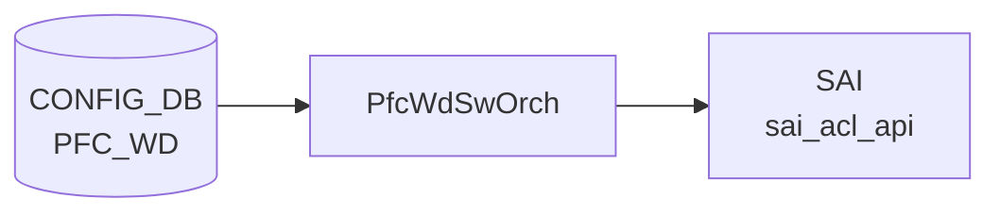

# PFC_WD テーブル

## 概要

[PFC Watchdog](../../reference/glossary.md#term-pfc-watchdog) の設定テーブル。port ごとに `detection_time` / `restoration_time` / `action` を持ち、[PFC](../../reference/glossary.md#term-pfc) pause storm を検出して指定アクションを取る。`GLOBAL` という特別キーでシステム全体のポーリング間隔を設定する[^1]。`pfcwd` ツール / `pfcwdorch` ([orchagent](../../reference/glossary.md#term-orchagent)) が購読する。

<!-- cdb-mermaid -->
### データフロー (自動生成)



!!! note "凡例"
    CONFIG_DB から SAI までの典型経路を `docs/reference/config-db-orch-map.md` から機械生成したミニ図。詳細・例外は本ページ本文と対応表を参照。
<!-- /cdb-mermaid -->

## key 構造

```text
PFC_WD|<port-name>      # 通常ポート用エントリ
PFC_WD|GLOBAL           # グローバル設定 (POLL_INTERVAL のみ)
```

`<port-name>` は `PORT.name` への leafref。

## 主要フィールド

### per-port エントリ

| フィールド | 型 | 範囲 | 説明 |
|-----------|----|------|------|
| `action` | enum `drop`/`forward`/`alert` | - | storm 検出時の動作 |
| `detection_time` | uint32 | 100..5000 ms | pause storm 検出時間 |
| `restoration_time` | uint32 | 100..60000 ms | 通常運転復帰までの遅延 |
| `pfc_stat_history` | string `enable`/`disable` | - | [PFC](../../reference/glossary.md#term-pfc) 履歴統計の取得トグル |

`detection_time` / `restoration_time` は `GLOBAL` の `POLL_INTERVAL` 以上でなければならない (`must`)。

### `GLOBAL` エントリ

| フィールド | 型 | 範囲 | 説明 |
|-----------|----|------|------|
| `POLL_INTERVAL` | uint32 | 100..1000 ms | システム共通の [PFC](../../reference/glossary.md#term-pfc) WD ポーリング間隔 |

## 制約

- `action`/`detection_time`/`restoration_time`/`pfc_stat_history` は `ifname != 'GLOBAL'` のみ有効
- `POLL_INTERVAL` は `ifname = 'GLOBAL'` のみ有効

## 購読者

- `orchagent` の `PfcWdOrch`: [SAI](../../reference/glossary.md#term-sai) で per-queue counter polling とアクション実装
- `pfcwd` CLI: 起動 / 停止 / 統計

## 関連 CONFIG_DB / YANG / CLI

- 関連 [CONFIG_DB](../../reference/glossary.md#term-config_db): `PORT`、`PORT_QOS_MAP` (PFC enable bitmap)
- 関連 CLI: `pfcwd start/stop/show_config/counter_poll`
- 関連 [YANG](../../reference/glossary.md#term-yang): `sonic-pfcwd`

<!-- value-behavior -->
## 値依存挙動マトリクス

### PFC_WD.action (per-port エントリのみ)

| 値 | PfcWdOrch 挙動 |
|----|---------------|
| `drop` (デフォルト) | storm 検出時、対象 queue への ingress/egress を drop |
| `forward` | storm 中もパケットを通過させる (HOL ブロッキングリスクあり) |
| `alert` | カウンタ更新のみ、実際のドロップなし |
| `forward` (Cisco 8000) | プラットフォーム非サポート: `Unsupported action forward for platform cisco-8000` |

### PFC_WD.detection_time (per-port、単位 ms)

| 値 / 条件 | 挙動 |
|----------|------|
| 100..5000 かつ >= POLL_INTERVAL | 正常: storm 検出インターバルとして設定 |
| < POLL_INTERVAL | YANG must 違反: detection_time must be greater than or equal to POLL_INTERVAL |
| 範囲外 | YANG range 違反 reject |
| 未設定 | `PFC_WD_DETECTION_TIME missing` SWSS_LOG_ERROR |

### PFC_WD.restoration_time (per-port、単位 ms)

| 値 / 条件 | 挙動 |
|----------|------|
| 100..60000 かつ >= POLL_INTERVAL | 正常: storm 復帰までの待機時間として設定 |
| < POLL_INTERVAL | YANG must 違反 reject |
| 範囲外 | YANG range 違反 reject |

### PFC_WD.pfc_stat_history (per-port)

| 値 | 挙動 |
|----|------|
| `enable` | PFC 履歴統計の収集を開始 |
| `disable` | 履歴統計収集を停止 |
| その他 | YANG pattern 違反 reject |

### PFC_WD.POLL_INTERVAL (GLOBAL エントリのみ、単位 ms)

| 値 | 挙動 |
|----|------|
| 100..1000 | システム共通の PFC WD ポーリング周期として設定 |
| 範囲外 | YANG range 違反 reject |

<!-- /value-behavior -->

<!-- cdb-exceptions -->
## 例外条件・特殊挙動

<!-- evidence: meta/_intermediate/cdb-flow/pfc-wd.md -->

### YANG スキーマ検証
- `ifname` = `GLOBAL` の場合: `action` / `detection_time` / `restoration_time` は禁止 (`must "../ifname != 'GLOBAL'"`)。違反は YANG validate で reject。
- `POLL_INTERVAL` はグローバルエントリ専用 (`must "../ifname = 'GLOBAL'"`)。
- `detection_time` および `restoration_time` は `POLL_INTERVAL` 以上必須: `error-message "detection_time must be greater than or equal to POLL_INTERVAL"`。
- range: `detection_time` 100..5000 ms、`restoration_time` 100..60000 ms、`POLL_INTERVAL` 100..1000 ms。
- `pfc_stat_history`: `enable` または `disable` のみ (それ以外は `error-message "pfc_stat_history must be either enable or disable"`)。

### consumer (pfcwdorch) 例外動作
- `PLATFORM` 環境変数未設定: `Platform environment variable is not defined` → SWSS_LOG_ERROR。
- 非物理ポートへの適用: `Interface %s is not physical port` → SWSS_LOG_ERROR。
- platform 非対応 action: `Unsupported action %s for platform %s` → SWSS_LOG_ERROR。
- switch-level PFC DLR との競合: `Invalid PFC Watchdog action %s as switch level action %s is set` → SWSS_LOG_ERROR。
- `detection_time` 欠如: `PFC_WD_DETECTION_TIME missing` → SWSS_LOG_ERROR。
- queue index 範囲外/不正: `Invalid argument` / `Out of range argument` → SWSS_LOG_ERROR。
- Lua スクリプトやポーリング間隔の設定失敗: SWSS_LOG_WARN (継続動作するが watch 精度が低下)。

<!-- /cdb-exceptions -->

<!-- ref-triangle:start -->

## 関連リファレンス

- [YANG](../../reference/glossary.md#term-yang): [`sonic-pfcwd`](../yang/sonic-pfcwd.md)
- CLI: `pfcwd`

<!-- ref-triangle:end -->

## 引用元

[^1]: [YANG](../../reference/glossary.md#term-yang) 定義: `sonic-pfcwd.yang`. <https://github.com/sonic-net/sonic-buildimage/blob/9ea932ec2e18f35e58268ec2e4456b1d4afd65cd/src/sonic-yang-models/yang-models/sonic-pfcwd.yang>

<!-- topics-back-ref -->
## 関連 Topics

- [Topics: QoS / Buffer / PFC / Watermark](../../topics/08-qos-buffer/index.md)

<!-- /topics-back-ref -->

<!-- ops-hint -->
## 運用ヒント

### 典型値

- key 形式: `PFC_WD|GLOBAL` と `PFC_WD|<port>`。
- `POLL_INTERVAL`: 200 (ms)。
- port 行: `action: drop`、`detection_time: 200`、`restoration_time: 200`。

### よくある誤設定

- `action: forward` のまま PFC storm を放置すると HOL ブロック。`drop` 推奨。
- `detection_time` を小さすぎる値にすると正常 PFC でも誤検知。

### 確認コマンド

```bash
sonic-db-cli CONFIG_DB keys 'PFC_WD|*'
show pfcwd config
show pfcwd stats
```
<!-- /ops-hint -->

<!-- glossary-links-injected: 62798bcc4162 -->
