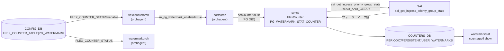

# FLEX_COUNTER_TABLE — PG_WATERMARK エントリ

## 概要

`FLEX_COUNTER_TABLE|PG_WATERMARK` は、[SONiC](../../reference/glossary.md#term-sonic) の [Priority Group](../../reference/glossary.md#term-priority-group)（PG）ウォーターマークカウンタのポーリングを制御するエントリである[^1]。有効化すると [orchagent](../../reference/glossary.md#term-orchagent) 内の `portsorch` が各 PG の SAI OID を [syncd](../../reference/glossary.md#term-syncd) FlexCounter に登録し、60 秒ごとに `SAI_INGRESS_PRIORITY_GROUP_STAT_XOFF_ROOM_WATERMARK_BYTES` / `SAI_INGRESS_PRIORITY_GROUP_STAT_SHARED_WATERMARK_BYTES` を収集する。

<!-- cdb-mermaid -->
### データフロー (自動生成)



!!! note "凡例"
    `FLEX_COUNTER_STATUS=enable` を受けた flexcounterorch が `m_pg_watermark_enabled` フラグを立て、portsorch が PG OID を FlexCounter に登録する。syncd は `READ_AND_CLEAR` モードで SAI カウンタを読み取り後リセットする。
<!-- /cdb-mermaid -->

---

## キー構造

```text
FLEX_COUNTER_TABLE|PG_WATERMARK
```

固定エントリ（シングルトン）。`<group>` 部分は常に `PG_WATERMARK`。

---

## フィールド一覧

| フィールド | 型 | 必須 | 説明 |
|-----------|----|------|------|
| `FLEX_COUNTER_STATUS` | `enable` / `disable` | いいえ | PG ウォーターマークカウンタのポーリング有効化。未設定時は `disable` 相当 |
| `POLL_INTERVAL` | uint32 [ms] | いいえ | ポーリング間隔。未設定時はコード由来デフォルト **60000 ms** |
| `FLEX_COUNTER_DELAY_STATUS` | boolean | いいえ | fast-reboot 等で system-ready まで遅延起動。通常は未設定 |
| `BULK_CHUNK_SIZE` | uint32 | いいえ | bulk API 1 回のエントリ数。未設定時は syncd 内部デフォルト |
| `BULK_CHUNK_SIZE_PER_PREFIX` | string | いいえ | プレフィクス別 bulk サイズ。通常は未設定 |

---

<!-- defaults -->
## 暗黙デフォルト・コード由来挙動 (Phase A)

<!-- evidence: sonic-swss/orchagent/portsorch.cpp, sonic-swss/orchagent/portsorch.h,
     sonic-swss/orchagent/flexcounterorch.cpp, sonic-swss/orchagent/watermarkorch.cpp,
     sonic-utilities/counterpoll/main.py,
     sonic-buildimage/src/sonic-yang-models/yang-models/sonic-flex_counter.yang,
     sonic-buildimage/src/sonic-config-engine/minigraph.py -->

### FLEX_COUNTER_STATUS のデフォルトは `disable`

エントリが存在しない場合または `FLEX_COUNTER_STATUS` フィールドが未設定の場合、counterpoll の show コマンドは `DISABLE` ("disable") を表示する[^2]。orchagent の `flexcounterorch.cpp:265-268` では `i.second == "enable"` のときのみ `m_pg_watermark_enabled = true` にセットされるため、明示的な `enable` 設定がなければ FlexCounter への PG OID 登録は行われない。

**管理デバイス例外**: `minigraph.py:58` で定義された `mgmt_disabled_counters` リストに `PG_WATERMARK` が含まれ、管理デバイス（type が mgmt_device_types）では minigraph 生成時に `FLEX_COUNTER_STATUS = "disable"` が明示的に書き込まれる[^3]。

### POLL_INTERVAL のコード由来デフォルトは 60000 ms

`portsorch.h:39` の `#define PG_WATERMARK_FLEX_STAT_COUNTER_POLL_MSECS "60000"` および `portsorch.cpp:92` の `#define PG_WATERMARK_STAT_FLEX_COUNTER_POLLING_INTERVAL_MS 60000` がハードコードされたデフォルト値である[^4]。

- portsorch コンストラクタ (`portsorch.cpp:736`) で `pg_watermark_manager` を 60000 ms / `StatsMode::READ_AND_CLEAR` で初期化。
- portsorch init (`portsorch.cpp:872-876`) で `setFlexCounterGroupParameter()` → syncd の `FLEX_COUNTER_GROUP_TABLE|PG_WATERMARK_STAT_COUNTER` にこの値を書き込み。
- `counterpoll watermark interval <ms>` で上書き可能（CONFIG_DB の `POLL_INTERVAL` フィールドに書き込まれ、orchagent が反映する）。

### STATS_MODE は READ_AND_CLEAR（ユーザー変更不可）

PG ウォーターマーク FlexCounter グループは `StatsMode::READ_AND_CLEAR` モードで動作する[^4]。これはユーザーが CONFIG_DB から変更できるフィールドではなく、orchagent が `setFlexCounterGroupParameter()` 呼び出し時に固定で指定する。SAI からポーリングするたびにハードウェアのウォーターマークレジスタがリセットされる。`PERIODIC_WATERMARKS` / `PERSISTENT_WATERMARKS` / `USER_WATERMARKS` テーブルへの振り分けは syncd 側の Lua スクリプト（`pgWmSha`）が処理する。

### 収集 SAI カウンタはコードハードコード（変更不可）

`portsorch.cpp:410-414` の静的配列 `ingressPriorityGroupWatermarkStatIds` が収集フィールドを決定する[^5]。

```cpp
static const vector<sai_ingress_priority_group_stat_t> ingressPriorityGroupWatermarkStatIds =
{
    SAI_INGRESS_PRIORITY_GROUP_STAT_XOFF_ROOM_WATERMARK_BYTES,
    SAI_INGRESS_PRIORITY_GROUP_STAT_SHARED_WATERMARK_BYTES,
};
```

YANG モデル・CONFIG_DB・FLEX_COUNTER_TABLE のいずれからも変更不可能。ハードウェアが当該カウンタをサポートしない場合、syncd が `sai_get_ingress_priority_group_stats` を呼んでも値 0 が返るか、`SAI_STATUS_NOT_SUPPORTED` でスキップされる。

### PG OID 登録はルーティングと enable フラグの両方が必要

`createPortBufferPgCounters()`（BUFFER_PG テーブルへの設定イベント）内で `getPgWatermarkCountersState()` を確認後にのみ SAI OID を FlexCounter に登録する。`FLEX_COUNTER_TABLE|PG_WATERMARK` が `enable` でない状態で `BUFFER_PG` テーブルを設定しても、ウォーターマークカウンタの SAI 登録は行われない。後から `enable` にした場合は `addPriorityGroupWatermarkFlexCounters()` の再実行で追加される[^6]。

### watermarkorch との telemetry タイマー連携

`watermarkorch.cpp:9` の `#define DEFAULT_TELEMETRY_INTERVAL 120` により、telemetry タイマーのデフォルト周期は 120 秒。`handleFcConfigUpdate()`（watermarkorch.cpp:116-141）が `PG_WATERMARK` と `QUEUE_WATERMARK` を同時監視し、どちらかが enable になると `m_telemetryTimer->start()` を呼んで `PERIODIC_WATERMARKS` テーブルの周期リセットをスケジュールする[^7]。このタイマー周期は `WATERMARK_TABLE|TELEMETRY_INTERVAL` エントリの `interval` フィールドで変更可能（counterpoll とは別経路）。

<!-- /defaults -->

---

<!-- ordering -->
## 書込み順依存 (Phase B)

`FLEX_COUNTER_TABLE|PG_WATERMARK` の `FLEX_COUNTER_STATUS=enable` が反映されるまでに、flexcounterorch・portsorch・watermarkorch の 3 コンポーネント間で以下の順序依存が発生する。

### 検出された順序依存

| # | 依存関係 | 方向 | 緩和策 |
|---|----------|------|--------|
| 1 | `FLEX_COUNTER_TABLE|PG_WATERMARK` enable → `m_pg_watermark_enabled` フラグ設定 | **強制先行** | flexcounterorch が enable を受信してフラグを立てた後でなければ BUFFER_PG イベントで PG OID が FlexCounter に登録されない |
| 2 | `BUFFER_PG` テーブル設定 → PG SAI OID の FlexCounter 登録 | **強制先行** | `createPortBufferPgCounters()` 実行時点で `getPgWatermarkCountersState()` が真でないと OID 登録はスキップされる |
| 3 | `generatePriorityGroupMap()` 完了 → `addPriorityGroupWatermarkFlexCounters()` 呼び出し | **強制先行**（同一 enable ハンドラ内） | flexcounterorch.cpp:265-269 で `generatePriorityGroupMap()` → `m_pg_watermark_enabled=true` → `addPriorityGroupWatermarkFlexCounters()` の順序が直列に実行される |
| 4 | FlexCounter enable → `watermarkorch` の `m_wmStatus` 更新 → telemetry タイマー起動 | 即時（同 Consumer ループ内） | `handleFcConfigUpdate()` が `m_wmStatus` を更新し、`prevStatus==0 && m_wmStatus!=0` 時に `m_telemetryTimer->start()` を呼ぶ。telemetry タイマーは FlexCounter よりも後に起動する |
| 5 | PG OID の COUNTERS_DB マップ登録 → syncd の FlexCounter ポーリング開始 | 非自明（syncd 側判断） | `pg_watermark_manager.setCounterIdList()` でエントリが FLEX_COUNTER_DB に書かれた後、syncd が次のポーリングサイクルで処理する。エントリ登録直後の最初のポーリングまでに最大 `POLL_INTERVAL`（デフォルト 60000 ms）の遅延が生じる |

### 主要な制約詳細

**enable フラグと BUFFER_PG の二重依存 (依存 #1, #2)**: PG OID が FlexCounter に登録されるルートは 2 つある。

1. `FLEX_COUNTER_TABLE|PG_WATERMARK` を enable に設定した瞬間 → `addPriorityGroupWatermarkFlexCounters()` が既存 BUFFER_PG 設定から全ポートの OID を一括登録する（`flexcounterorch.cpp:265-269`, `portsorch.cpp:8998-9027`）
2. `BUFFER_PG` テーブルに新エントリが書き込まれた瞬間 → `createPortBufferPgCounters()` → `addPortBufferPgCounters()` → `getPgWatermarkCountersState()` が真の場合のみ OID を登録する（`portsorch.cpp:8904-8933`）

このため、BUFFER_PG を先に設定してから PG_WATERMARK を enable にしても機能する（ルート 1 で一括登録）し、PG_WATERMARK を enable にしてから BUFFER_PG を設定しても機能する（ルート 2 でイベント駆動登録）。ただし、PG_WATERMARK が disable の状態で BUFFER_PG を設定した場合、その時点では OID 登録がスキップされ、後から enable にしてルート 1 で補完される。**orchagent 再起動時は両テーブルの状態を再読み込みするため順序依存は解消される**。

**watermarkorch telemetry タイマーの起動依存 (依存 #4)**: `PERIODIC_WATERMARKS` の周期クリアは telemetry タイマーが起動して初めて開始される。FlexCounter の enable が `WatermarkOrch` に通知されるのは同一 Consumer ループ内だが、タイマーのティックは最初の `WATERMARK_TABLE|TELEMETRY_INTERVAL`（デフォルト 120 秒）が経過するまで発火しない。enable 直後の約 120 秒間は `PERIODIC_WATERMARKS` の自動クリアが行われない点に注意する（`watermarkorch.cpp:116-140`）。

<!-- /ordering -->

---

<!-- cross-refs -->
## 暗黙参照テーブル (Phase C)

<!-- evidence: meta/_intermediate/cdb-flow/pg-watermark-cross-refs.md -->

YANG leafref を超えた他テーブル・他 DB・プロセスへの実装上の依存関係。

| 参照先 | DB / 場所 | 方向 | 契機 | 根拠コード |
|--------|-----------|------|------|-----------|
| `COUNTERS_PG_NAME_MAP` | COUNTERS_DB | WRITE | `portsorch` が `BUFFER_PG` エントリ追加時に `<port>:<pg_index>` → `<sai_oid>` マッピングを書き込む。PG_WATERMARK の enable 状態に関わらず常時書かれる | `portsorch.cpp:785, 8882, 8937` |
| `COUNTERS_PG_PORT_MAP` | COUNTERS_DB | WRITE | `portsorch` が `BUFFER_PG` エントリ追加時に `<sai_pg_oid>` → `<sai_port_oid>` マッピングを書き込む。`watermarkstat` がポートごとの集計に参照 | `portsorch.cpp:786, 8883, 8938` |
| `COUNTERS_PG_INDEX_MAP` | COUNTERS_DB | WRITE | `portsorch` が `BUFFER_PG` エントリ追加時に `<sai_pg_oid>` → `<pg_index>` マッピングを書き込む。PG インデックス逆引きに利用 | `portsorch.cpp:787, 8884, 8939` |
| `FLEX_COUNTER_GROUP_TABLE\|PG_WATERMARK_STAT_COUNTER` | FLEX_COUNTER_DB | WRITE | `portsorch` init 時に `setFlexCounterGroupParameter()` でポーリング間隔 (60000 ms) と `STATS_MODE=READ_AND_CLEAR` を書き込む。`syncd` FlexCounter がグループ設定を読んでポーリング動作を決定する | `portsorch.cpp:872-876` |
| `PG_WATERMARK_STAT_COUNTER:<sai_oid>` | FLEX_COUNTER_DB | WRITE | `pg_watermark_manager.setCounterIdList()` が PG OID ごとに `PG_WATERMARK_STAT_ID_LIST` を書き込む。`FLEX_COUNTER_TABLE\|PG_WATERMARK` が enable の場合のみ書き込まれ、disable 時は `clearCounterIdList()` で削除される | `portsorch.cpp:9051, 9095` |
| `PERIODIC_WATERMARKS` / `PERSISTENT_WATERMARKS` / `USER_WATERMARKS` | COUNTERS_DB | WRITE（Lua） | `watermark_pg.lua` が syncd FlexCounter ポーリング結果を 3 テーブルへ書き込む。`PERIODIC_WATERMARKS` は telemetry タイマー周期でクリア、他 2 テーブルは明示クリアまで保持 | `watermark_pg.lua:10-12`; `watermarkorch.cpp:31-33` |
| `BUFFER_PG` | CONFIG_DB | READ | `getPgConfigurations()` が PG_WATERMARK enable 受信時に BUFFER_PG を参照して対象 PG インデックスセットを決定する。BUFFER_PG エントリがない場合は FlexCounter への OID 登録が発生しない | `flexcounterorch.cpp:538-670` |
| `WATERMARK_CLEAR_REQUEST` | APPL_DB | READ（通知） | `watermarkorch` が通知チャネルを購読し、`watermarkcfg clear` CLI からの `PERSISTENT` / `USER` クリア要求を処理する | `watermarkorch.cpp:35-39` |

### 補足

- **COUNTERS_PG_NAME_MAP の生成タイミング**: このマップは `FLEX_COUNTER_TABLE|PG_WATERMARK` の enable 状態に依存せず、`BUFFER_PG` テーブルへの書き込みイベント（`createPortBufferPgCounters()` 呼び出し）で生成される。PG watermark を enable にする前にマップが存在する点に注意。
- **FLEX_COUNTER_DB 二層構造**: `FLEX_COUNTER_GROUP_TABLE|PG_WATERMARK_STAT_COUNTER`（グループ設定）と `PG_WATERMARK_STAT_COUNTER:<oid>`（per-OID エントリ）は独立して管理される。グループ設定は orchagent init 時に 1 回書かれ、per-OID エントリは enable/disable や BUFFER_PG の変化に応じて動的に追加・削除される。

<!-- /cross-refs -->

---

## 設定例

```json
{
    "FLEX_COUNTER_TABLE": {
        "PG_WATERMARK": {
            "FLEX_COUNTER_STATUS": "enable",
            "POLL_INTERVAL": "60000"
        }
    }
}
```

### CLI での操作

```bash
# PG ウォーターマークカウンタを有効化
counterpoll watermark enable

# ポーリング間隔を変更（ms）
counterpoll watermark interval 30000

# 現在の設定を確認
counterpoll show

# ウォーターマーク値を表示
watermarkstat priority-group shared
watermarkstat priority-group headroom
```

---

## 関連リファレンス

- CONFIG_DB: [`FLEX_COUNTER_TABLE`](flex-counter-table.md)
- CONFIG_DB: [`BUFFER_PG`](buffer-pg.md)
- CONFIG_DB: COUNTERS_DB PG カウンタ詳細 → [`COUNTERS_DB キュー / PG カウンタテーブル群`](counters-queue.md)
- CLI: `counterpoll watermark`、`watermarkstat`

---

## 引用元

[^1]: portsorch.cpp:736 および flexcounterorch.cpp:265-270 — PG_WATERMARK FlexCounter グループの初期化と enable ハンドラ。<https://github.com/sonic-net/sonic-swss/blob/master/orchagent/portsorch.cpp>

[^2]: counterpoll/main.py:819 — `pg_wm_info.get("FLEX_COUNTER_STATUS", DISABLE)` によるデフォルト `"disable"` 表示。<https://github.com/sonic-net/sonic-utilities/blob/master/counterpoll/main.py>

[^3]: minigraph.py:58/2740 — `mgmt_disabled_counters` リストに `PG_WATERMARK` が含まれ、管理デバイスで `disable` を明示設定。<https://github.com/sonic-net/sonic-buildimage/blob/master/src/sonic-config-engine/minigraph.py>

[^4]: portsorch.h:39 および portsorch.cpp:92,872-876 — `PG_WATERMARK_FLEX_STAT_COUNTER_POLL_MSECS = "60000"` 定数と `setFlexCounterGroupParameter()` での `READ_AND_CLEAR` 設定。<https://github.com/sonic-net/sonic-swss/blob/master/orchagent/portsorch.h>

[^5]: portsorch.cpp:410-414 — `ingressPriorityGroupWatermarkStatIds` 静的配列定義（XOFF_ROOM + SHARED の 2 カウンタ）。

[^6]: flexcounterorch.cpp:265-268 および portsorch getPgWatermarkCountersState() — PG OID 登録の二重条件チェック（enable フラグ + BUFFER_PG 設定イベント）。

[^7]: watermarkorch.cpp:9,116-141 — `DEFAULT_TELEMETRY_INTERVAL = 120` および `handleFcConfigUpdate()` による telemetry タイマー制御。<https://github.com/sonic-net/sonic-swss/blob/master/orchagent/watermarkorch.cpp>
