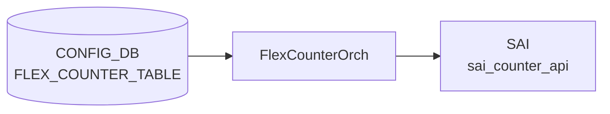

# FLEX_COUNTER_TABLE — PG_WATERMARK エントリ

## 概要

`FLEX_COUNTER_TABLE|PG_WATERMARK` は、[SONiC](../../reference/glossary.md#term-sonic) の [Priority Group](../../reference/glossary.md#term-priority-group)（PG）ウォーターマークカウンタのポーリングを制御するエントリである[^1]。有効化すると [orchagent](../../reference/glossary.md#term-orchagent) 内の `portsorch` が各 PG の [SAI](../../reference/glossary.md#term-sai) OID を [syncd](../../reference/glossary.md#term-syncd) [FlexCounter](../../reference/glossary.md#term-flexcounter) に登録し、60 秒ごとに `SAI_INGRESS_PRIORITY_GROUP_STAT_XOFF_ROOM_WATERMARK_BYTES` / `SAI_INGRESS_PRIORITY_GROUP_STAT_SHARED_WATERMARK_BYTES` を収集する。

<!-- cdb-mermaid -->
### データフロー (自動生成)



!!! note "凡例"
    CONFIG_DB から SAI までの典型経路を `docs/reference/config-db-orch-map.md` から機械生成したミニ図。詳細・例外は本ページ本文と対応表を参照。
<!-- /cdb-mermaid -->

---

## キー構造

```text
FLEX_COUNTER_TABLE|PG_WATERMARK
```

固定エントリ（シングルトン）。`<group>` 部分は常に `PG_WATERMARK`。

---

## フィールド一覧

| フィールド | 型 | 必須 | 説明 |
|-----------|----|------|------|
| `FLEX_COUNTER_STATUS` | `enable` / `disable` | いいえ | PG ウォーターマークカウンタのポーリング有効化。未設定時は `disable` 相当 |
| `POLL_INTERVAL` | uint32 [ms] | いいえ | ポーリング間隔。未設定時はコード由来デフォルト **60000 ms** |
| `FLEX_COUNTER_DELAY_STATUS` | boolean | いいえ | fast-reboot 等で system-ready まで遅延起動。通常は未設定 |
| `BULK_CHUNK_SIZE` | uint32 | いいえ | bulk API 1 回のエントリ数。未設定時は [syncd](../../reference/glossary.md#term-syncd) 内部デフォルト |
| `BULK_CHUNK_SIZE_PER_PREFIX` | string | いいえ | プレフィクス別 bulk サイズ。通常は未設定 |

---

<!-- defaults -->
## 暗黙デフォルト・コード由来挙動

<!-- evidence: sonic-swss/orchagent/portsorch.cpp, sonic-swss/orchagent/portsorch.h,
     sonic-swss/orchagent/flexcounterorch.cpp, sonic-swss/orchagent/watermarkorch.cpp,
     sonic-utilities/counterpoll/main.py,
     sonic-buildimage/src/sonic-yang-models/yang-models/sonic-flex_counter.yang,
     sonic-buildimage/src/sonic-config-engine/minigraph.py -->

### FLEX_COUNTER_STATUS のデフォルトは `disable`

エントリが存在しない場合または `FLEX_COUNTER_STATUS` フィールドが未設定の場合、counterpoll の show コマンドは `DISABLE` ("disable") を表示する[^2]。[orchagent](../../reference/glossary.md#term-orchagent) の `flexcounterorch.cpp:265-268` では `i.second == "enable"` のときのみ `m_pg_watermark_enabled = true` にセットされるため、明示的な `enable` 設定がなければ [FlexCounter](../../reference/glossary.md#term-flexcounter) への PG OID 登録は行われない。

**管理デバイス例外**: `minigraph.py:58` で定義された `mgmt_disabled_counters` リストに `PG_WATERMARK` が含まれ、管理デバイス（type が mgmt_device_types）では minigraph 生成時に `FLEX_COUNTER_STATUS = "disable"` が明示的に書き込まれる[^3]。

### POLL_INTERVAL のコード由来デフォルトは 60000 ms

`portsorch.h:39` の `#define PG_WATERMARK_FLEX_STAT_COUNTER_POLL_MSECS "60000"` および `portsorch.cpp:92` の `#define PG_WATERMARK_STAT_FLEX_COUNTER_POLLING_INTERVAL_MS 60000` がハードコードされたデフォルト値である[^4]。

- [portsorch](../../reference/glossary.md#term-portsorch) コンストラクタ (`portsorch.cpp:736`) で `pg_watermark_manager` を 60000 ms / `StatsMode::READ_AND_CLEAR` で初期化。
- [portsorch](../../reference/glossary.md#term-portsorch) init (`portsorch.cpp:872-876`) で `setFlexCounterGroupParameter()` → [syncd](../../reference/glossary.md#term-syncd) の `FLEX_COUNTER_GROUP_TABLE|PG_WATERMARK_STAT_COUNTER` にこの値を書き込み。
- `counterpoll watermark interval <ms>` で上書き可能（[CONFIG_DB](../../reference/glossary.md#term-config_db) の `POLL_INTERVAL` フィールドに書き込まれ、[orchagent](../../reference/glossary.md#term-orchagent) が反映する）。

### STATS_MODE は READ_AND_CLEAR（ユーザ変更不可）

PG ウォーターマーク [FlexCounter](../../reference/glossary.md#term-flexcounter) グループは `StatsMode::READ_AND_CLEAR` モードで動作する[^4]。これはユーザが [CONFIG_DB](../../reference/glossary.md#term-config_db) から変更できるフィールドではなく、orchagent が `setFlexCounterGroupParameter()` 呼び出し時に固定で指定する。[SAI](../../reference/glossary.md#term-sai) からポーリングするたびにハードウェアのウォーターマークレジスタがリセットされる。`PERIODIC_WATERMARKS` / `PERSISTENT_WATERMARKS` / `USER_WATERMARKS` テーブルへの振り分けは syncd 側の Lua スクリプト（`pgWmSha`）が処理する。

### 収集 SAI カウンタはコードハードコード（変更不可）

`portsorch.cpp:410-414` の静的配列 `ingressPriorityGroupWatermarkStatIds` が収集フィールドを決定する[^5]。

```cpp
static const vector<sai_ingress_priority_group_stat_t> ingressPriorityGroupWatermarkStatIds =
{
    SAI_INGRESS_PRIORITY_GROUP_STAT_XOFF_ROOM_WATERMARK_BYTES,
    SAI_INGRESS_PRIORITY_GROUP_STAT_SHARED_WATERMARK_BYTES,
};
```

[YANG](../../reference/glossary.md#term-yang) モデル・[CONFIG_DB](../../reference/glossary.md#term-config_db)・FLEX_COUNTER_TABLE のいずれからも変更不可能。ハードウェアが当該カウンタをサポートしない場合、syncd が `sai_get_ingress_priority_group_stats` を呼んでも値 0 が返るか、`SAI_STATUS_NOT_SUPPORTED` でスキップされる。

### PG OID 登録はルーティングと enable フラグの両方が必要

`createPortBufferPgCounters()`（[BUFFER_PG](../../reference/glossary.md#term-buffer-pg) テーブルへの設定イベント）内で `getPgWatermarkCountersState()` を確認後にのみ [SAI](../../reference/glossary.md#term-sai) OID を FlexCounter に登録する。`FLEX_COUNTER_TABLE|PG_WATERMARK` が `enable` でない状態で `BUFFER_PG` テーブルを設定しても、ウォーターマークカウンタの SAI 登録は行われない。後から `enable` にした場合は `addPriorityGroupWatermarkFlexCounters()` の再実行で追加される[^6]。

### watermarkorch との telemetry タイマー連携

`watermarkorch.cpp:9` の `#define DEFAULT_TELEMETRY_INTERVAL 120` により、telemetry タイマーのデフォルト周期は 120 秒。`handleFcConfigUpdate()`（watermarkorch.cpp:116-141）が `PG_WATERMARK` と `QUEUE_WATERMARK` を同時監視し、どちらかが enable になると `m_telemetryTimer->start()` を呼んで `PERIODIC_WATERMARKS` テーブルの周期リセットをスケジュールする[^7]。このタイマー周期は `WATERMARK_TABLE|TELEMETRY_INTERVAL` エントリの `interval` フィールドで変更可能（counterpoll とは別経路）。

<!-- /defaults -->

---

<!-- ordering -->
## 書込み順依存

`FLEX_COUNTER_TABLE|PG_WATERMARK` の `FLEX_COUNTER_STATUS=enable` が反映されるまでに、flexcounterorch・[portsorch](../../reference/glossary.md#term-portsorch)・watermarkorch の 3 コンポーネント間で以下の順序依存が発生する。

### 検出された順序依存

| # | 依存関係 | 方向 | 緩和策 |
|---|----------|------|--------|
| 1 | `FLEX_COUNTER_TABLE|PG_WATERMARK` enable → `m_pg_watermark_enabled` フラグ設定 | **強制先行** | flexcounterorch が enable を受信してフラグを立てた後でなければ [BUFFER_PG](../../reference/glossary.md#term-buffer-pg) イベントで PG OID が FlexCounter に登録されない |
| 2 | `BUFFER_PG` テーブル設定 → PG SAI OID の FlexCounter 登録 | **強制先行** | `createPortBufferPgCounters()` 実行時点で `getPgWatermarkCountersState()` が真でないと OID 登録はスキップされる |
| 3 | `generatePriorityGroupMap()` 完了 → `addPriorityGroupWatermarkFlexCounters()` 呼び出し | **強制先行**（同一 enable ハンドラ内） | flexcounterorch.cpp:265-269 で `generatePriorityGroupMap()` → `m_pg_watermark_enabled=true` → `addPriorityGroupWatermarkFlexCounters()` の順序が直列に実行される |
| 4 | FlexCounter enable → `watermarkorch` の `m_wmStatus` 更新 → telemetry タイマー起動 | 即時（同 Consumer ループ内） | `handleFcConfigUpdate()` が `m_wmStatus` を更新し、`prevStatus==0 && m_wmStatus!=0` 時に `m_telemetryTimer->start()` を呼ぶ。telemetry タイマーは FlexCounter よりも後に起動する |
| 5 | PG OID の [COUNTERS_DB](../../reference/glossary.md#term-counters_db) マップ登録 → syncd の FlexCounter ポーリング開始 | 非自明（syncd 側判断） | `pg_watermark_manager.setCounterIdList()` でエントリが [FLEX_COUNTER_DB](../../reference/glossary.md#term-flex_counter_db) に書かれた後、syncd が次のポーリングサイクルで処理する。エントリ登録直後の最初のポーリングまでに最大 `POLL_INTERVAL`（デフォルト 60000 ms）の遅延が生じる |

### 主要な制約詳細

**enable フラグと [BUFFER_PG](../../reference/glossary.md#term-buffer-pg) の二重依存 (依存 #1, #2)**: PG OID が FlexCounter に登録されるルートは 2 つある。

1. `FLEX_COUNTER_TABLE|PG_WATERMARK` を enable に設定した瞬間 → `addPriorityGroupWatermarkFlexCounters()` が既存 BUFFER_PG 設定から全ポートの OID を一括登録する（`flexcounterorch.cpp:265-269`, `portsorch.cpp:8998-9027`）
2. `BUFFER_PG` テーブルに新エントリが書き込まれた瞬間 → `createPortBufferPgCounters()` → `addPortBufferPgCounters()` → `getPgWatermarkCountersState()` が真の場合のみ OID を登録する（`portsorch.cpp:8904-8933`）

このため、BUFFER_PG を先に設定してから PG_WATERMARK を enable にしても機能する（ルート 1 で一括登録）し、PG_WATERMARK を enable にしてから BUFFER_PG を設定しても機能する（ルート 2 でイベント駆動登録）。ただし、PG_WATERMARK が disable の状態で BUFFER_PG を設定した場合、その時点では OID 登録がスキップされ、後から enable にしてルート 1 で補完される。**orchagent 再起動時は両テーブルの状態を再読み込みするため順序依存は解消される**。

**watermarkorch telemetry タイマーの起動依存 (依存 #4)**: `PERIODIC_WATERMARKS` の周期クリアは telemetry タイマーが起動して初めて開始される。FlexCounter の enable が `WatermarkOrch` に通知されるのは同一 Consumer ループ内だが、タイマーのティックは最初の `WATERMARK_TABLE|TELEMETRY_INTERVAL`（デフォルト 120 秒）が経過するまで発火しない。enable 直後の約 120 秒間は `PERIODIC_WATERMARKS` の自動クリアが行われない点に注意する（`watermarkorch.cpp:116-140`）。

<!-- /ordering -->

---

<!-- cross-refs -->
## 暗黙参照テーブル

[YANG](../../reference/glossary.md#term-yang) leafref を超えた他テーブル・他 DB・プロセスへの実装上の依存関係。

| 参照先 | DB / 場所 | 方向 | 契機 | 根拠コード |
|--------|-----------|------|------|-----------|
| `COUNTERS_PG_NAME_MAP` | [COUNTERS_DB](../../reference/glossary.md#term-counters_db) | WRITE | `portsorch` が `BUFFER_PG` エントリ追加時に `<port>:<pg_index>` → `<sai_oid>` マッピングを書き込む。PG_WATERMARK の enable 状態に関わらず常時書かれる | `portsorch.cpp:785, 8882, 8937` |
| `COUNTERS_PG_PORT_MAP` | [COUNTERS_DB](../../reference/glossary.md#term-counters_db) | WRITE | `portsorch` が `BUFFER_PG` エントリ追加時に `<sai_pg_oid>` → `<sai_port_oid>` マッピングを書き込む。`watermarkstat` がポートごとの集計に参照 | `portsorch.cpp:786, 8883, 8938` |
| `COUNTERS_PG_INDEX_MAP` | COUNTERS_DB | WRITE | `portsorch` が `BUFFER_PG` エントリ追加時に `<sai_pg_oid>` → `<pg_index>` マッピングを書き込む。PG インデックス逆引きに利用 | `portsorch.cpp:787, 8884, 8939` |
| `FLEX_COUNTER_GROUP_TABLE\|PG_WATERMARK_STAT_COUNTER` | [FLEX_COUNTER_DB](../../reference/glossary.md#term-flex_counter_db) | WRITE | `portsorch` init 時に `setFlexCounterGroupParameter()` でポーリング間隔 (60000 ms) と `STATS_MODE=READ_AND_CLEAR` を書き込む。`syncd` FlexCounter がグループ設定を読んでポーリング動作を決定する | `portsorch.cpp:872-876` |
| `PG_WATERMARK_STAT_COUNTER:<sai_oid>` | [FLEX_COUNTER_DB](../../reference/glossary.md#term-flex_counter_db) | WRITE | `pg_watermark_manager.setCounterIdList()` が PG OID ごとに `PG_WATERMARK_STAT_ID_LIST` を書き込む。`FLEX_COUNTER_TABLE\|PG_WATERMARK` が enable の場合のみ書き込まれ、disable 時は `clearCounterIdList()` で削除される | `portsorch.cpp:9051, 9095` |
| `PERIODIC_WATERMARKS` / `PERSISTENT_WATERMARKS` / `USER_WATERMARKS` | COUNTERS_DB | WRITE（Lua） | `watermark_pg.lua` が syncd FlexCounter ポーリング結果を 3 テーブルへ書き込む。`PERIODIC_WATERMARKS` は telemetry タイマー周期でクリア、他 2 テーブルは明示クリアまで保持 | `watermark_pg.lua:10-12`; `watermarkorch.cpp:31-33` |
| `BUFFER_PG` | CONFIG_DB | READ | `getPgConfigurations()` が PG_WATERMARK enable 受信時に BUFFER_PG を参照して対象 PG インデックスセットを決定する。BUFFER_PG エントリがない場合は FlexCounter への OID 登録が発生しない | `flexcounterorch.cpp:538-670` |
| `WATERMARK_CLEAR_REQUEST` | [APPL_DB](../../reference/glossary.md#term-appl_db) | READ（通知） | `watermarkorch` が通知チャネルを購読し、`watermarkcfg clear` CLI からの `PERSISTENT` / `USER` クリア要求を処理する | `watermarkorch.cpp:35-39` |

### 補足

- **COUNTERS_PG_NAME_MAP の生成タイミング**: このマップは `FLEX_COUNTER_TABLE|PG_WATERMARK` の enable 状態に依存せず、`BUFFER_PG` テーブルへの書き込みイベント（`createPortBufferPgCounters()` 呼び出し）で生成される。PG watermark を enable にする前にマップが存在する点に注意。
- **FLEX_COUNTER_DB 二層構造**: `FLEX_COUNTER_GROUP_TABLE|PG_WATERMARK_STAT_COUNTER`（グループ設定）と `PG_WATERMARK_STAT_COUNTER:<oid>`（per-OID エントリ）は独立して管理される。グループ設定は orchagent init 時に 1 回書かれ、per-OID エントリは enable/disable や BUFFER_PG の変化に応じて動的に追加・削除される。

<!-- /cross-refs -->

---

<!-- failure -->
## 失敗挙動

`FlexCounterOrch::doTask(Consumer&)`（`sonic-swss/orchagent/flexcounterorch.cpp`）および `portsorch` の PG watermark 登録関数を調査した。

### SET 操作の失敗パターン

| 失敗条件 | 発生箇所 | 挙動 | retry |
|---------|---------|------|-------|
| 遅延タイマー (`m_delayTimerExpired`) 未満了 | `flexcounterorch.cpp:156-159` | return — m_toSync に残留。タイマー満了後に自動再処理 | 自動（タイマー満了時） |
| `gPortsOrch->allPortsReady()` が false | `flexcounterorch.cpp:164-167` | return — m_toSync に残留。全ポート初期化完了後に自動再処理 | 自動（ポート初期化完了時） |
| 不正なグループキー（`flexCounterGroupMap` に未登録） | `flexcounterorch.cpp:183-188` | `SWSS_LOG_NOTICE("Invalid flex counter group input, %s")` + **即時廃棄** | なし（`PG_WATERMARK` キーは正常登録済みのため通常発生しない） |
| 未知フィールド（`POLL_INTERVAL_FIELD` 等以外） | `flexcounterorch.cpp:395-398` | `SWSS_LOG_NOTICE("Unsupported field %s")` — **フィールドをスキップ**。エントリは廃棄されない | なし（フィールド単位でスキップ） |
| `FLEX_COUNTER_STATUS` が `"enable"` / `"disable"` 以外の値 | `flexcounterorch.cpp:225-394` | enable / disable 分岐に入らず `setFlexCounterGroupOperation()` のみ実行。syncd 側バリデーション依存 | なし |
| `BUFFER_PG` テーブルが空（PG 設定なし） | `portsorch.cpp:8998-9052` | OID 登録をスキップ（エラーなし・サイレント）。後から BUFFER_PG を追加すると自動登録 | 自動（BUFFER_PG SET イベント時） |

### DEL 操作の挙動

`FLEX_COUNTER_TABLE|PG_WATERMARK` エントリを DEL すると flexcounterorch の doTask() でエントリが消費されるが、`clearCounterIdList()` は呼ばれない。PG watermark カウンタを無効化するには `FLEX_COUNTER_STATUS = "disable"` を SET する必要がある（DEL ではカウンタポーリングは停止しない）。

| ケース | 挙動 |
|--------|------|
| `FLEX_COUNTER_STATUS = "disable"` SET | `setFlexCounterGroupOperation(group, "disable")` — syncd FlexCounter グループを非活性化 |
| `FLEX_COUNTER_TABLE|PG_WATERMARK` の DEL | エントリ消費のみ。カウンタ登録（`PG_WATERMARK_STAT_COUNTER:<oid>`）は削除されない |

### ログ・ERROR_TABLE

- 失敗は `SWSS_LOG_NOTICE` または `SWSS_LOG_ERROR` で `/var/log/swss/orchagent.log` に出力される。
- [STATE_DB](../../reference/glossary.md#term-state_db) の `ERROR_TABLE` や `COUNTERS_DB` への失敗通知は**一切書き込まれない**。
- FlexCounter 登録失敗はサイレントなため、`counterpoll show` で `ENABLE` と表示されていても `COUNTERS_DB` に PG watermark 値が現れない場合は BUFFER_PG 設定や allPortsReady 状態を確認する。

<!-- /failure -->

---

<!-- constants -->
## ハードコード定数

<!-- evidence: sonic-swss/orchagent/portsorch.h, sonic-swss/orchagent/portsorch.cpp,
     sonic-swss/orchagent/watermarkorch.cpp -->

`FLEX_COUNTER_TABLE|PG_WATERMARK` に関連するマジックナンバー・グループ名・パス定数の一覧。いずれも CONFIG_DB・[YANG](../../reference/glossary.md#term-yang)・CLI から変更不可能。

| 定数 / マクロ名 | 値 | 定義ファイル | 意味・影響 |
|---|---|---|---|
| `PG_WATERMARK_FLEX_STAT_COUNTER_POLL_MSECS` | `"60000"` | `portsorch.h:39` | `setFlexCounterGroupParameter()` 呼び出し時に FLEX_COUNTER_DB へ書き込まれるデフォルトポーリング間隔文字列。`FLEX_COUNTER_TABLE|PG_WATERMARK` の `POLL_INTERVAL` フィールドで上書き可能。`portsorch.cpp:873` で参照される |
| `PG_WATERMARK_STAT_FLEX_COUNTER_POLLING_INTERVAL_MS` | `60000` | `portsorch.cpp:92` | `pg_watermark_manager` コンストラクタ (`portsorch.cpp:736`) に渡す内部整数定数。上記 POLL_MSECS 文字列と値が一致することで設定の二重管理を実装している |
| `PG_WATERMARK_STAT_COUNTER_FLEX_COUNTER_GROUP` | `"PG_WATERMARK_STAT_COUNTER"` | `portsorch.h:36` | FLEX_COUNTER_DB の `FLEX_COUNTER_GROUP_TABLE` キーに使用されるグループ名。syncd がこのグループ名でポーリングスレッドを識別する |
| `STATS_MODE_READ_AND_CLEAR` | `"READ_AND_CLEAR"` | `portsorch.cpp:872-876` 呼び出し引数 | `setFlexCounterGroupParameter()` 経由で `FLEX_COUNTER_GROUP_TABLE|PG_WATERMARK_STAT_COUNTER` の `STATS_MODE` フィールドに書き込まれる固定値。SAI からポーリングするたびにハードウェアのウォーターマークレジスタがクリアされる。ユーザが変更するフィールドは CONFIG_DB に存在しない |
| `DEFAULT_TELEMETRY_INTERVAL` | `120` 秒 | `watermarkorch.cpp:9` | `watermarkorch` が `m_telemetryTimer` を初期化する際のデフォルト周期。`WATERMARK_TABLE|TELEMETRY_INTERVAL` エントリの `interval` フィールドで上書き可能。変更単位は秒 |
| `CLEAR_PG_HEADROOM_REQUEST` | `"PG_HEADROOM"` | `watermarkorch.cpp:11` | `WATERMARK_CLEAR_REQUEST` [APPL_DB](../../reference/glossary.md#term-appl_db) 通知チャネルへのリクエスト文字列。`watermarkcfg clear pg-headroom` CLI が発行する値と一致しなければクリア処理が発火しない |
| `CLEAR_PG_SHARED_REQUEST` | `"PG_SHARED"` | `watermarkorch.cpp:12` | 同上。`watermarkcfg clear pg-shared` CLI が発行するリクエスト文字列 |
| `SAI_INGRESS_PRIORITY_GROUP_STAT_XOFF_ROOM_WATERMARK_BYTES` | SAI enum 値 | `portsorch.cpp:412` (`ingressPriorityGroupWatermarkStatIds[]`) | FlexCounter が各 PG OID に対して収集する SAI カウンタ 1 つ目。XOFF（headroom）ウォーターマークをバイト単位で返す。[ASIC](../../reference/glossary.md#term-asic) が非対応の場合は `SAI_STATUS_NOT_SUPPORTED` が返るが、orchagent はエラー扱いしない |
| `SAI_INGRESS_PRIORITY_GROUP_STAT_SHARED_WATERMARK_BYTES` | SAI enum 値 | `portsorch.cpp:413` (`ingressPriorityGroupWatermarkStatIds[]`) | FlexCounter が各 PG OID に対して収集する SAI カウンタ 2 つ目。Shared バッファウォーターマークをバイト単位で返す。収集カウンタリストはコードで完全に固定されており、CONFIG_DB や YANG からの変更手段はない |

!!! note "POLL_MSECS 二重定義の理由"
    `PG_WATERMARK_FLEX_STAT_COUNTER_POLL_MSECS`（文字列 `"60000"`）と `PG_WATERMARK_STAT_FLEX_COUNTER_POLLING_INTERVAL_MS`（整数 `60000`）は同一の 60 秒を 2 種類の型で保持している。文字列版は `setFlexCounterGroupParameter()` での FLEX_COUNTER_DB 書き込みに、整数版は `FlexCounterManager` コンストラクタの内部初期化に使用される。値の不一致が生じた場合でも orchagent は検出しない。

!!! note "収集カウンタのハードコード制約"
    `ingressPriorityGroupWatermarkStatIds` 配列は `static const` で宣言されており、ランタイムで変更する手段がない。ASIC が `SAI_INGRESS_PRIORITY_GROUP_STAT_XOFF_ROOM_WATERMARK_BYTES` をサポートしない場合（例: headroom なし構成）、当該 PG の XOFF_ROOM カウンタは常に 0 または `SAI_STATUS_NOT_SUPPORTED` が返る。

<!-- /constants -->

---

<!-- side-effects -->
## 副次 DB 書込

`FLEX_COUNTER_TABLE|PG_WATERMARK` の `FLEX_COUNTER_STATUS` 変化を起点として、以下の副次 DB 書き込みが発生する。

### ① FLEX_COUNTER_DB — グループ設定書き込み（orchagent init 時）

`PortsOrch::init()` → `setFlexCounterGroupParameter()` (`portsorch.cpp:872-876`) が orchagent 起動時に **1 回**、`FLEX_COUNTER_GROUP_TABLE|PG_WATERMARK_STAT_COUNTER` へポーリング間隔 (`60000 ms`) と `STATS_MODE=READ_AND_CLEAR` を書き込む。これは CONFIG_DB の PG_WATERMARK エントリの有無に関係なく常時書かれる。

| 副次 DB | テーブル / キー | フィールド | 書込内容 | 根拠 |
|---------|---------------|---------|---------|------|
| FLEX_COUNTER_DB | `FLEX_COUNTER_GROUP_TABLE\|PG_WATERMARK_STAT_COUNTER` | `POLL_INTERVAL` | `"60000"` | `portsorch.cpp:872-876` |
| FLEX_COUNTER_DB | `FLEX_COUNTER_GROUP_TABLE\|PG_WATERMARK_STAT_COUNTER` | `STATS_MODE` | `"READ_AND_CLEAR"` | `portsorch.cpp:872-876` |

### ② FLEX_COUNTER_DB — per-OID エントリ（enable/disable 時）

`FLEX_COUNTER_STATUS=enable` を受信すると `addPriorityGroupWatermarkFlexCounters()` が `pg_watermark_manager.setCounterIdList()` (`portsorch.cpp:9051`) を呼び、PG OID ごとに SAI カウンタ ID リストを書き込む。`disable` 受信時は `clearCounterIdList()` (`portsorch.cpp:9095`) でエントリが削除される。

| 副次 DB | テーブル / キー | フィールド | 書込内容 | 根拠 |
|---------|---------------|---------|---------|------|
| FLEX_COUNTER_DB | `PG_WATERMARK_STAT_COUNTER:<sai_pg_oid>` | `PG_WATERMARK_STAT_ID_LIST` | SAI カウンタ名リスト（XOFF_ROOM + SHARED の 2 統計） | `portsorch.cpp:9051` |

### ③ COUNTERS_DB — PG マップ書き込み（BUFFER_PG SET イベント時）

`BUFFER_PG` テーブルにエントリが書き込まれると、PG_WATERMARK の enable 状態に関わらず以下の 3 マップが更新される。`wredstat` / `watermarkstat` はこれらのマップから PG OID を逆引きする。

| 副次 DB | テーブル / キー | 書込内容 | 根拠 |
|---------|---------------|---------|------|
| COUNTERS_DB | `COUNTERS_PG_NAME_MAP` | `<port>:<pg_index>` → `<sai_pg_oid>` | `portsorch.cpp:8937` |
| COUNTERS_DB | `COUNTERS_PG_PORT_MAP` | `<sai_pg_oid>` → `<sai_port_oid>` | `portsorch.cpp:8938` |
| COUNTERS_DB | `COUNTERS_PG_INDEX_MAP` | `<sai_pg_oid>` → `<pg_index>` | `portsorch.cpp:8939` |

### ④ COUNTERS_DB — PERIODIC_WATERMARKS クリア（telemetry タイマー）

PG_WATERMARK（または QUEUE_WATERMARK）が enable になると `WatermarkOrch::handleFcConfigUpdate()` が `m_telemetryTimer->start()` を呼ぶ。タイマー発火ごとに `clearSingleWm()` (`watermarkorch.cpp:258-266`) が `PERIODIC_WATERMARKS` テーブルの PG カウンタ 2 フィールドを `"0"` にリセットする。

| 副次 DB | テーブル / キー | フィールド | 書込内容 | 条件 |
|---------|---------------|---------|---------|------|
| COUNTERS_DB | `PERIODIC_WATERMARKS\|<sai_pg_oid>` | `SAI_INGRESS_PRIORITY_GROUP_STAT_XOFF_ROOM_WATERMARK_BYTES` | `"0"`（クリア） | `m_wmStatus != 0`（telemetry タイマー動作中） |
| COUNTERS_DB | `PERIODIC_WATERMARKS\|<sai_pg_oid>` | `SAI_INGRESS_PRIORITY_GROUP_STAT_SHARED_WATERMARK_BYTES` | `"0"`（クリア） | 同上 |

**注意**: both PG_WATERMARK と QUEUE_WATERMARK が disable になると `m_telemetryTimer->stop()` が呼ばれ、`PERIODIC_WATERMARKS` のクリアが停止する。`PERSISTENT_WATERMARKS` / `USER_WATERMARKS` は telemetry タイマーのクリア対象外で、`watermarkcfg clear` コマンドでのみ手動クリアされる。

### 副次書き込みが発生しないケース

| ケース | 理由 |
|--------|------|
| `FLEX_COUNTER_STATUS=disable`（または未設定） | FLEX_COUNTER_DB per-OID エントリが登録されず syncd ポーリングが発生しない |
| `BUFFER_PG` テーブルが空 | PG OID がなく、FLEX_COUNTER_DB への per-OID エントリ登録も COUNTERS_DB マップ書き込みも発生しない |
| PG_WATERMARK / QUEUE_WATERMARK が両方 disable | `m_wmStatus == 0` となり telemetry タイマーが停止し `PERIODIC_WATERMARKS` のクリアが発生しない |
| orchagent 未起動 | `FLEX_COUNTER_GROUP_TABLE` 設定が書かれず syncd がグループを認識しない |

<!-- /side-effects -->

---

<!-- pubsub -->
## 通信メカニズム

> スキャン対象: `orchagent/orchdaemon.cpp:432-437,620-626`、`orchagent/flexcounterorch.cpp:40-155`、`orchagent/watermarkorch.cpp:23-50,52-143,144-232`

### CONFIG_DB 購読方式

`FLEX_COUNTER_TABLE|PG_WATERMARK` への変更は 2 つの orchagent 内 Orch が `ConsumerStateTable` で受信する。

| 購読者 | DB | テーブル | ハンドラ |
|--------|-----|---------|---------|
| `FlexCounterOrch` | CONFIG_DB (4) | `FLEX_COUNTER_TABLE` | `doTask(Consumer&)` → PG_WATERMARK ハンドラ → `addPriorityGroupWatermarkFlexCounters()` |
| `WatermarkOrch` | CONFIG_DB (4) | `FLEX_COUNTER_TABLE` | `doTask(Consumer&)` → `handleFcConfigUpdate("PG_WATERMARK")` → telemetry タイマー制御 |
| `WatermarkOrch` | CONFIG_DB (4) | `WATERMARK_TABLE` | `doTask(Consumer&)` → telemetry interval 更新 |

`Orch` 汎用の `ConsumerStateTable` が `ProducerStateTable::set()` からの `FLEX_COUNTER_TABLE_CHANNEL@4` PUBLISH を受信し、orchagent 主ループが `SELECT_TIMEOUT = 1000 ms` (`orchdaemon.cpp:23`) で起床する。

### APPL_DB 通知チャネル（watermark クリア）

`WatermarkOrch` コンストラクタ (`watermarkorch.cpp:35-38`) が `APPL_DB:WATERMARK_CLEAR_REQUEST` を `NotificationConsumer` で購読する。`watermarkcfg clear pg-headroom` / `clear pg-shared` CLI が PUBLISH するクリア要求を受信して `clearSingleWm()` を呼ぶ。

| 購読者 | DB | チャネル | ハンドラ |
|--------|-----|---------|---------|
| `WatermarkOrch` | [APPL_DB](../../reference/glossary.md#term-appl_db) | `WATERMARK_CLEAR_REQUEST` | `doTask(NotificationConsumer&)` → `clearSingleWm()` |

### イベントフロー概要

```
FLEX_COUNTER_STATUS = enable を CONFIG_DB に書き込み
  → ProducerStateTable: PUBLISH FLEX_COUNTER_TABLE_CHANNEL@4

orchagent select() (SELECT_TIMEOUT = 1000 ms)
  → FlexCounterOrch::doTask(): m_pg_watermark_enabled=true
                               → pg_watermark_manager.setCounterIdList() / FLEX_COUNTER_DB
  → WatermarkOrch::doTask(): m_wmStatus 更新 → m_telemetryTimer->start()

syncd FlexCounter スレッド: FLEX_COUNTER_DB を読んで SAI ポーリング開始
  → POLL_INTERVAL (デフォルト 60000 ms) ごとに sai_get_ingress_priority_group_stats()
  → pgWmSha Lua スクリプトが COUNTERS_DB に書き込み
```

### 遅延サマリ

| 段階 | 遅延上限 |
|------|---------|
| CONFIG_DB 書き込み → orchagent 処理 | SELECT_TIMEOUT = 1000 ms |
| warm-reboot 時の FlexCounter 全体遅延 | `FLEX_COUNTER_DELAY_SEC = 60` 秒 |
| orchagent 処理 → syncd 最初のポーリング | POLL_INTERVAL = 60000 ms（デフォルト） |
| PG_WATERMARK enable → PERIODIC_WATERMARKS 初回クリア | DEFAULT_TELEMETRY_INTERVAL = 120 秒 |

<!-- /pubsub -->

---

<!-- platform -->
## プラットフォーム差

`FLEX_COUNTER_TABLE|PG_WATERMARK` の処理ロジック自体は [ASIC](../../reference/glossary.md#term-asic) ベンダー・スイッチタイプに依存しないが、有効化後に実際に収集されるカウンタ値やカウンタの存在はプラットフォーム構成に依存する。

### 管理デバイス (mgmt_device) — minigraph が強制 disable

`sonic-buildimage/src/sonic-config-engine/minigraph.py:58` の `mgmt_disabled_counters` リストに `"PG_WATERMARK"` が含まれる[^3]。管理デバイスタイプ (`mgmt_device_types`) に分類されるスイッチでは、minigraph 生成時に CONFIG_DB の `FLEX_COUNTER_TABLE|PG_WATERMARK` に `FLEX_COUNTER_STATUS = "disable"` が明示的に書き込まれる。これにより管理デバイスでは PG watermark カウンタが自動的に無効化される。

| プラットフォーム種別 | 挙動 |
|-----------------|------|
| 通常スイッチ（non-mgmt） | `FLEX_COUNTER_STATUS` 未設定（`disable` 相当） — ユーザが `counterpoll watermark enable` で有効化可能 |
| 管理デバイス (mgmt_device) | minigraph が `FLEX_COUNTER_STATUS = "disable"` を明示設定 — `counterpoll watermark enable` で上書き可能だが設定再生成時に元に戻る |

### SAI カウンタサポート差 — ASIC 依存

収集対象の 2 SAI カウンタはハードコードされており、[ASIC](../../reference/glossary.md#term-asic) が対応していない場合はサイレントに 0 値またはエラーが返る[^5]。

| SAI カウンタ | ASIC 非対応時の挙動 |
|-------------|------------------|
| `SAI_INGRESS_PRIORITY_GROUP_STAT_XOFF_ROOM_WATERMARK_BYTES` | headroom（XOFF バッファ）非サポート ASIC では `SAI_STATUS_NOT_SUPPORTED` または常時 0。XOFF-based [PFC](../../reference/glossary.md#term-pfc) を実装しない構成では意味のある値が得られない |
| `SAI_INGRESS_PRIORITY_GROUP_STAT_SHARED_WATERMARK_BYTES` | 通常ほとんどの ASIC でサポートされるが、仮想スイッチ（`vs` プラットフォーム）では SAI スタブが固定値または 0 を返す |

orchagent は SAI エラーを PG watermark の設定失敗として扱わない（FlexCounter Manager が syncd 側でエラーを吸収する）。COUNTERS_DB に値が現れない場合は orchagent ログを確認する。

### ファブリックポート / VoQ / DASH — PG_WATERMARK への影響なし

| 構成 | 影響 |
|------|------|
| VoQ シャーシ (`gMySwitchType == "voq"`) | PG_WATERMARK グループの処理に VoQ 固有分岐なし。VoQ モードでも通常どおり `m_pg_watermark_enabled` フラグと `BUFFER_PG` 設定に基づき OID 登録される |
| ファブリックポート (`gFabricPortsOrch` 有効) | PG_WATERMARK は ingress priority group カウンタ専用。ファブリックポートには PG が存在せず影響なし |
| [SmartSwitch](../../reference/glossary.md#term-smartswitch) [DPU](../../reference/glossary.md#term-dpu) / [DASH](../../reference/glossary.md#term-dash) | `flexcounterorch.cpp` の [DASH](../../reference/glossary.md#term-dash) 系 orch 参照は [ENI](../../reference/glossary.md#term-eni)/HA グループ専用。PG_WATERMARK グループの処理パスに [DASH](../../reference/glossary.md#term-dash) 依存コードなし |
| Gearbox（外付け PHY） | PG_WATERMARK は Gearbox の PORT/MACSEC グループと独立。Gearbox 有効 / 無効で PG watermark 動作は変化しない |

### multi-asic / namespace

multi-asic 構成では各 ASIC の namespace で orchagent が独立して起動し、それぞれが自 namespace の CONFIG_DB `FLEX_COUNTER_TABLE|PG_WATERMARK` を購読する。各 ASIC の BUFFER_PG エントリと SAI OID は namespace 間で分離されており、PG watermark カウンタも ASIC ごとに独立して COUNTERS_DB に書き込まれる。

<!-- /platform -->

---

## 設定例

```json
{
    "FLEX_COUNTER_TABLE": {
        "PG_WATERMARK": {
            "FLEX_COUNTER_STATUS": "enable",
            "POLL_INTERVAL": "60000"
        }
    }
}
```

### CLI での操作

```bash
# PG ウォーターマークカウンタを有効化
counterpoll watermark enable

# ポーリング間隔を変更（ms）
counterpoll watermark interval 30000

# 現在の設定を確認
counterpoll show

# ウォーターマーク値を表示
watermarkstat priority-group shared
watermarkstat priority-group headroom
```

---

## 関連リファレンス

- CONFIG_DB: [`FLEX_COUNTER_TABLE`](flex-counter-table.md)
- CONFIG_DB: [`BUFFER_PG`](buffer-pg.md)
- CONFIG_DB: COUNTERS_DB PG カウンタ詳細 → [`COUNTERS_DB キュー / PG カウンタテーブル群`](counters-queue.md)
- CLI: `counterpoll watermark`、`watermarkstat`

---

## 引用元

[^1]: portsorch.cpp:736 および flexcounterorch.cpp:265-270 — PG_WATERMARK FlexCounter グループの初期化と enable ハンドラ。<https://github.com/sonic-net/sonic-swss/blob/master/orchagent/portsorch.cpp>

[^2]: counterpoll/main.py:819 — `pg_wm_info.get("FLEX_COUNTER_STATUS", DISABLE)` によるデフォルト `"disable"` 表示。<https://github.com/sonic-net/sonic-utilities/blob/master/counterpoll/main.py>

[^3]: minigraph.py:58/2740 — `mgmt_disabled_counters` リストに `PG_WATERMARK` が含まれ、管理デバイスで `disable` を明示設定。<https://github.com/sonic-net/sonic-buildimage/blob/master/src/sonic-config-engine/minigraph.py>

[^4]: portsorch.h:39 および portsorch.cpp:92,872-876 — `PG_WATERMARK_FLEX_STAT_COUNTER_POLL_MSECS = "60000"` 定数と `setFlexCounterGroupParameter()` での `READ_AND_CLEAR` 設定。<https://github.com/sonic-net/sonic-swss/blob/master/orchagent/portsorch.h>

[^5]: portsorch.cpp:410-414 — `ingressPriorityGroupWatermarkStatIds` 静的配列定義（XOFF_ROOM + SHARED の 2 カウンタ）。

[^6]: flexcounterorch.cpp:265-268 および portsorch getPgWatermarkCountersState() — PG OID 登録の二重条件チェック（enable フラグ + BUFFER_PG 設定イベント）。

[^7]: watermarkorch.cpp:9,116-141 — `DEFAULT_TELEMETRY_INTERVAL = 120` および `handleFcConfigUpdate()` による telemetry タイマー制御。<https://github.com/sonic-net/sonic-swss/blob/master/orchagent/watermarkorch.cpp>

<!-- glossary-links-injected: 45ba360f1873 -->
