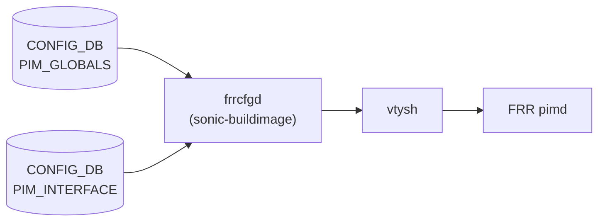

# PIM_GLOBALS / PIM_INTERFACE テーブル

## 概要

`PIM_GLOBALS` と `PIM_INTERFACE` は PIM-SM (Protocol Independent Multicast Sparse Mode) の設定を [CONFIG_DB](../../reference/glossary.md#term-config_db) に保持するテーブル[^1]。`sonic-buildimage` の `frrcfgd` がこれらのテーブルを購読し、`vtysh` コマンドに変換して FRR の `pimd` へ注入する。SONiC における IP マルチキャスト転送の中核を担う設定テーブルである。

<!-- cdb-mermaid -->
### データフロー



!!! note "凡例"
    CONFIG_DB から FRR pimd へのコンフィグ注入経路を示す。pimd がカーネルの mroute テーブルと連携してマルチキャスト転送を制御する。
<!-- /cdb-mermaid -->

## PIM_GLOBALS テーブル

### key 構造

```text
PIM_GLOBALS|<vrf>|<af>
```

- `<vrf>`: VRF 名。デフォルト VRF は `"default"`
- `<af>`: アドレスファミリ。現状 `"ipv4"` のみサポート

### フィールド

| フィールド | 型 | デフォルト | 説明 |
|-----------|----|-----------|------|
| `join-prune-interval` | uint32 (秒) | `60` | Join/Prune メッセージの送信間隔 (RFC 4601: t_periodic)。FRR `pimd.c` で `PIM_DEFAULT_T_PERIODIC = 60` に初期化[^2] |
| `keep-alive-timer` | uint32 (秒) | `210` | マルチキャストルートのキープアライブタイマー。FRR `pim_upstream.h` で `PIM_KEEPALIVE_PERIOD = 210` に定義[^3] |
| `ssm-ranges` | string | 省略可 | SSM (Source Specific Multicast) レンジを指定する prefix-list 名。省略時は FRR コマンド非発行 |
| `ecmp-enabled` | boolean string | `"false"` | ECMP (Equal Cost Multi-Path) マルチキャスト転送を有効化。FRR `pim_instance.c` で `ecmp_enable = false` に初期化[^4] |
| `ecmp-rebalance-enabled` | boolean string | `"false"` | ECMP リバランスを有効化。`ecmp-enabled = true` が前提。FRR `pim_instance.c` で `ecmp_rebalance_enable = false` に初期化[^4] |

## PIM_INTERFACE テーブル

### key 構造

```text
PIM_INTERFACE|<vrf>|<af>|<interface>
```

- `<vrf>`: VRF 名。デフォルト VRF は `"default"`
- `<af>`: アドレスファミリ。現状 `"ipv4"` のみサポート
- `<interface>`: インタフェース名 (例: `"Ethernet0"`, `"Vlan10"`)

### フィールド

| フィールド | 型 | デフォルト | 説明 |
|-----------|----|-----------|------|
| `mode` | enum string | 実質必須 | PIM 動作モード。`"sm"` で sparse-mode 有効化 (`ip pim`)。空文字列または OP_DELETE で無効化 (`no ip pim`) |
| `dr-priority` | uint32 | `1` | Designated Router 優先度 (RFC 4601: 4.3.1)。FRR `pim_pim.h` で `PIM_DEFAULT_DR_PRIORITY = 1`[^5] |
| `hello-interval` | string | `"30"` | Hello メッセージ間隔 (秒)。カンマ区切りで `"<interval>,<hold-time>"` 形式も可。FRR `pim_pim.h` で `PIM_DEFAULT_HELLO_PERIOD = 30`[^5] |
| `bfd-enabled` | boolean string | `"false"` | BFD による PIM 隣接監視を有効化 |

<!-- defaults -->
## フィールドのコード由来デフォルト

### デフォルト値一覧 (PIM_GLOBALS)

| フィールド | 型 | 既定値 | 省略可否 | コード根拠 |
|-----------|-----|--------|---------|-----------|
| `join-prune-interval` | uint32 (秒) | `60` | 任意 | `pimd/pimd.c` L83: `router->t_periodic = PIM_DEFAULT_T_PERIODIC`[^2] |
| `keep-alive-timer` | uint32 (秒) | `210` | 任意 | `pimd/pim_upstream.h` L213: `#define PIM_KEEPALIVE_PERIOD (210)`[^3] |
| `ssm-ranges` | string | なし (absent) | 任意 | フィールド absent なら `ip pim ssm prefix-list` コマンド非発行 |
| `ecmp-enabled` | boolean string | `"false"` | 任意 | `pimd/pim_instance.c` L81: `pim->ecmp_enable = false`[^4] |
| `ecmp-rebalance-enabled` | boolean string | `"false"` | 任意 | `pimd/pim_instance.c` L82: `pim->ecmp_rebalance_enable = false`[^4] |

### デフォルト値一覧 (PIM_INTERFACE)

| フィールド | 型 | 既定値 | 省略可否 | コード根拠 |
|-----------|-----|--------|---------|-----------|
| `mode` | enum string | なし (必須) | 実質必須 | `frrcfgd.py` L3787: `if 'mode' in data:` — mode 欠落で FRR コマンド全スキップ[^1] |
| `dr-priority` | uint32 | `1` | 任意 | `pimd/pim_pim.h` L32: `PIM_DEFAULT_DR_PRIORITY (1)`; `pimd/pim_pim.c` L440[^5] |
| `hello-interval` | string | `"30"` | 任意 | `pimd/pim_pim.h` L30: `PIM_DEFAULT_HELLO_PERIOD (30)`; `pimd/pim_pim.c` L436[^5] |
| `bfd-enabled` | boolean string | `"false"` | 任意 | `pim_interface_key_map` の `['true', 'false']` — 後者が OP_DELETE 相当[^1] |

### 解説

**`mode` は実質的な必須フィールド**

`frrcfgd.py` L3787-3803 において、`PIM_INTERFACE` エントリの処理は `'mode' in data` のチェックを通過した場合のみ `key_map.run_command()` を呼び出す[^1]。`mode` フィールドが CONFIG_DB エントリに存在しない場合、`hello-interval` や `dr-priority` を含む全フィールドの FRR コマンドが **silent drop** される。YANG 上での mandatory 宣言はないが、動作上は必須。

```python
# frrcfgd.py L3787-3802
if 'mode' in data:
    modeval = data['mode']
    modeval_op = modeval.op
    if (modeval_op == CachedDataWithOp.OP_DELETE):
        # sparse-mode 無効化時: 他フィールドのキャッシュをフラッシュ
        for dkey, dval in data.items():
            dval.status = CachedDataWithOp.STAT_SUCC
            dval.op = CachedDataWithOp.OP_DELETE
    if not key_map.run_command(self, table, data, cmd_prefix):
        syslog.syslog(syslog.LOG_ERR, 'failed running PIM config command')
```

**`hello-interval` のカンマ区切りフォーマット**

`frrcfgd.py` L941-942 の `pim_hello_parms` フォーマットハンドラにより、CONFIG_DB に `"30,5"` と格納された値は `ip pim hello 30 5` (interval=30秒, hold-time=5秒) に変換される[^1]。単一値 `"30"` の場合は `ip pim hello 30` が発行される。

**`ecmp-rebalance-enabled` の前提条件**

`ecmp-rebalance-enabled = "true"` を設定するには `ecmp-enabled = "true"` が前提。CONFIG_DB レベルでの強制はないが、FRR pimd は ECMP 無効状態では rebalance コマンドを無視する。

### RFC 4601 対応表

| CONFIG_DB フィールド | RFC 4601 タイマー名 | 既定値 |
|----------------------|---------------------|--------|
| `hello-interval` | Hello Period (Section 4.11) | 30 秒 |
| `dr-priority` | DR Priority (Section 4.3.1) | 1 |
| `join-prune-interval` | t_periodic (Section 4.11) | 60 秒 |
| `keep-alive-timer` | KeepaliveTimer (Section 4.2) | 210 秒 |

<!-- /defaults -->

## 購読者

- `frrcfgd` (`sonic-buildimage/src/sonic-frr-mgmt-framework/frrcfgd/frrcfgd.py`): `PIM_GLOBALS` および `PIM_INTERFACE` を購読し、FRR pimd に `vtysh` 経由でコマンドを注入する[^1]

## 関連テーブル

- `VRF`: PIM は VRF 対応。PIM_GLOBALS/PIM_INTERFACE の key に `<vrf>` を含む
- `IGMP_INTERFACE`: インタフェースの IGMP 設定。PIM sparse-mode と連携してマルチキャストグループ管理を行う

[^1]: `sonic-buildimage/src/sonic-frr-mgmt-framework/frrcfgd/frrcfgd.py` — `pim_global_key_map` (L2065-2070), `pim_interface_key_map` (L2059-2064), PIM ハンドラ (L3772-3821), `pim_hello_parms` フォーマット (L941-942)
[^2]: `sonic-frr/pimd/pimd.c` L83 — `router->t_periodic = PIM_DEFAULT_T_PERIODIC` (60)
[^3]: `sonic-frr/pimd/pim_upstream.h` L213 — `#define PIM_KEEPALIVE_PERIOD (210)`
[^4]: `sonic-frr/pimd/pim_instance.c` L81-82 — `pim->ecmp_enable = false; pim->ecmp_rebalance_enable = false`
[^5]: `sonic-frr/pimd/pim_pim.h` L30-32 — `PIM_DEFAULT_HELLO_PERIOD (30)`, `PIM_DEFAULT_DR_PRIORITY (1)`; `pimd/pim_pim.c` L436-440 での初期化
