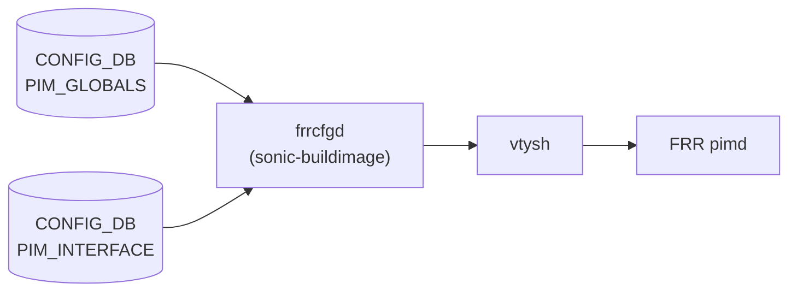

# PIM_GLOBALS / PIM_INTERFACE テーブル

## 概要

`PIM_GLOBALS` と `PIM_INTERFACE` は PIM-SM (Protocol Independent Multicast Sparse Mode) の設定を [CONFIG_DB](../../reference/glossary.md#term-config_db) に保持するテーブル[^1]。`sonic-buildimage` の `frrcfgd` がこれらのテーブルを購読し、`vtysh` コマンドに変換して FRR の `pimd` へ注入する。SONiC における IP マルチキャスト転送の中核を担う設定テーブルである。

<!-- cdb-mermaid -->
### データフロー



!!! note "凡例"
    CONFIG_DB から FRR pimd へのコンフィグ注入経路を示す。pimd がカーネルの mroute テーブルと連携してマルチキャスト転送を制御する。
<!-- /cdb-mermaid -->

## PIM_GLOBALS テーブル

### key 構造

```text
PIM_GLOBALS|<vrf>|<af>
```

- `<vrf>`: VRF 名。デフォルト VRF は `"default"`
- `<af>`: アドレスファミリ。現状 `"ipv4"` のみサポート

### フィールド

| フィールド | 型 | デフォルト | 説明 |
|-----------|----|-----------|------|
| `join-prune-interval` | uint32 (秒) | `60` | Join/Prune メッセージの送信間隔 (RFC 4601: t_periodic)。FRR `pimd.c` で `PIM_DEFAULT_T_PERIODIC = 60` に初期化[^2] |
| `keep-alive-timer` | uint32 (秒) | `210` | マルチキャストルートのキープアライブタイマー。FRR `pim_upstream.h` で `PIM_KEEPALIVE_PERIOD = 210` に定義[^3] |
| `ssm-ranges` | string | 省略可 | SSM (Source Specific Multicast) レンジを指定する prefix-list 名。省略時は FRR コマンド非発行 |
| `ecmp-enabled` | boolean string | `"false"` | ECMP (Equal Cost Multi-Path) マルチキャスト転送を有効化。FRR `pim_instance.c` で `ecmp_enable = false` に初期化[^4] |
| `ecmp-rebalance-enabled` | boolean string | `"false"` | ECMP リバランスを有効化。`ecmp-enabled = true` が前提。FRR `pim_instance.c` で `ecmp_rebalance_enable = false` に初期化[^4] |

## PIM_INTERFACE テーブル

### key 構造

```text
PIM_INTERFACE|<vrf>|<af>|<interface>
```

- `<vrf>`: VRF 名。デフォルト VRF は `"default"`
- `<af>`: アドレスファミリ。現状 `"ipv4"` のみサポート
- `<interface>`: インタフェース名 (例: `"Ethernet0"`, `"Vlan10"`)

### フィールド

| フィールド | 型 | デフォルト | 説明 |
|-----------|----|-----------|------|
| `mode` | enum string | 実質必須 | PIM 動作モード。`"sm"` で sparse-mode 有効化 (`ip pim`)。空文字列または OP_DELETE で無効化 (`no ip pim`) |
| `dr-priority` | uint32 | `1` | Designated Router 優先度 (RFC 4601: 4.3.1)。FRR `pim_pim.h` で `PIM_DEFAULT_DR_PRIORITY = 1`[^5] |
| `hello-interval` | string | `"30"` | Hello メッセージ間隔 (秒)。カンマ区切りで `"<interval>,<hold-time>"` 形式も可。FRR `pim_pim.h` で `PIM_DEFAULT_HELLO_PERIOD = 30`[^5] |
| `bfd-enabled` | boolean string | `"false"` | BFD による PIM 隣接監視を有効化 |

<!-- ordering -->
## 書込み順依存 (Phase B)

`frrcfgd` (`BGPConfigDaemon`) が CONFIG_DB の `PIM_GLOBALS` および `PIM_INTERFACE` を購読し、`bgp_table_handler_common` を通じて `__update_bgp()` キューで逐次処理する[^1]。以下の書き込み順序を守ること。

### 依存関係サマリ

| # | 依存関係 | 方向 | 緩和策 |
|---|----------|------|--------|
| 1 | `PIM_INTERFACE` SET に `mode` を必ず含める | **必須**（欠如時 全フィールド silent drop） | なし |
| 2 | `VRF\|<vrf>` → `PIM_GLOBALS\|<vrf>\|<af>` / `PIM_INTERFACE\|<vrf>\|<af>\|<if>` | 推奨先行 | VRF 欠如時 vtysh が LOG_ERR を出力 |
| 3 | `PORT` / `VLAN` 等インタフェース → `PIM_INTERFACE\|...\|<if>` | 推奨先行 | インタフェース未存在時 FRR が LOG_ERR を出力 |
| 4 | `PIM_GLOBALS` → `PIM_INTERFACE` | 推奨（中間状態最小化） | FRR デフォルト値で pimd が動作継続 |
| 5 | `ecmp-enabled = "true"` → `ecmp-rebalance-enabled = "true"` | **必須**（FRR が rebalance を無視） | なし |
| 6 | `PIM_INTERFACE` DEL (`mode`) → `PIM_GLOBALS` DEL | 推奨（FRR 状態整合） | 逆順でも動作するが中間状態あり |

### 詳細

**`mode` 必須 (依存 #1)**

`frrcfgd.py` L3787-3802 において、`PIM_INTERFACE` の処理は `'mode' in data` の条件を通過した場合のみ `key_map.run_command()` を呼び出す[^1]。`mode` が SET に含まれない UPDATE では `dr-priority` / `hello-interval` / `bfd-enabled` を含む全フィールドが **silent drop** される。YANG mandatory 宣言はないが動作上は必須フィールドである。

```
PIM_INTERFACE|<vrf>|ipv4|<if>  ← mode を含む SET が必須
  mode = "sm"                  → ip pim (sparse-mode 有効化)
  dr-priority = ...            → ip pim drpriority ...
  hello-interval = ...         → ip pim hello ...
  bfd-enabled = ...            → ip pim bfd
```

**VRF 先行推奨 (依存 #2)**

`frrcfgd` は VRF 存在確認を行わず、vtysh コマンドを `vrf <vrf>` コンテキストで直接発行する（frrcfgd.py L3808-3809）。`VRF|<vrf>` が CONFIG_DB に存在しない場合、カーネル VRF が未作成なため vtysh が失敗し LOG_ERR が出力される。非 default VRF では `VRF|<vrf>` を先行設定すること。

**インタフェース先行推奨 (依存 #3)**

`PIM_INTERFACE` の vtysh コマンドは `configure terminal` → `interface <if_name>` として発行される（frrcfgd.py L3778-3779）。カーネル上にインタフェースが存在しない場合、FRR がインタフェースコンテキストを生成できず LOG_ERR となる可能性がある。

**`ecmp-rebalance-enabled` の前提条件 (依存 #5)**

`ecmp-rebalance-enabled = "true"` は `ecmp-enabled = "true"` が先行している場合のみ有効。frrcfgd は両フィールドを独立したコマンドとして発行する（frrcfgd.py L2068-2069）が、FRR pimd は ECMP が無効な状態では rebalance を無視する。CONFIG_DB レベルの強制はないため、先行順序を手動で守る必要がある。

**削除順序 (依存 #6)**

`mode` の OP_DELETE 受信時、frrcfgd は他フィールドのキャッシュを `STAT_SUCC + OP_DELETE` にフラッシュする（frrcfgd.py L3790-3796）。このため `PIM_INTERFACE` の `mode` を DEL した後に `PIM_GLOBALS` を削除する順序が推奨される。逆順では pimd 側に不整合な中間状態（ECMP 設定が残るが sparse-mode が無効）が生じ得る。

<!-- /ordering -->

<!-- cross-refs -->
## 暗黙参照 — `frrcfgd` が読み出す関連 CONFIG_DB テーブル (Phase C)

`frrcfgd` (`BGPConfigDaemon`) は起動時に `config_db.get_table_data()` で購読テーブルの初期データを一括取得し、変更イベントは `config_db.subscribe()` で受信する[^1]。`PIM_GLOBALS` / `PIM_INTERFACE` ハンドラが直接・間接に依存するテーブルを以下に示す。

### 共依存テーブル (frrcfgd が購読 + 同一 pimd へ設定注入)

| テーブル | 参照タイミング | 用途 | evidence |
|---------|--------------|------|---------|
| `VRF` | 各イベント (間接) | vtysh `configure terminal; vrf <vrf>` コンテキストの VRF 名として使用。VRF が未作成の場合は vtysh が失敗し LOG_ERR 出力 | frrcfgd.py L3808 |
| `IGMP_INTERFACE` | 各イベント (同一 pimd) | PIM sparse-mode と連動する IGMP インタフェース設定。`pimd` デーモンに注入 | frrcfgd.py L2132, L2333 |
| `IGMP_INTERFACE_QUERY` | 各イベント (同一 pimd) | IGMP クエリ設定 (query-interval / query-max-response-time 等) | frrcfgd.py L2133, L2334 |
| `DEVICE_METADATA` | 起動時のみ | frrcfgd プロセス全体の初期化 (`bgp_asn` / `vrf_name` 等) | frrcfgd.py L2162 |

### 4 テーブルが同一 pimd デーモンへ集約

frrcfgd の `daemon_table_map` (frrcfgd.py L117-120) により、以下の 4 テーブルすべての vtysh コマンドが同一 `pimd` プロセスへ送信される。

```python
'PIM_GLOBALS':          ['pimd'],
'PIM_INTERFACE':        ['pimd'],
'IGMP_INTERFACE':       ['pimd'],
'IGMP_INTERFACE_QUERY': ['pimd'],
```

IGMP は PIM sparse-mode が有効な (`mode = "sm"`) インタフェースでのみ動作するため、`PIM_INTERFACE` の設定が `IGMP_INTERFACE` より先行していることが前提となる。

### VRF 削除時の孤立キャッシュ

`vrf_handler` は BGP / static-route のキャッシュ整合を行うが、PIM テーブルはその処理対象に含まれない (frrcfgd.py L2415-2467)。`VRF` エントリを削除した後に `PIM_GLOBALS` / `PIM_INTERFACE` エントリが残存すると、frrcfgd のキャッシュ内に孤立データが残り得る。VRF 削除時は先に PIM テーブルを削除すること。

### 範囲外 (誤解されやすいテーブル)

- `PORT` / `INTERFACE` / `VLAN`: PIM ハンドラはインタフェース存在確認を行わない。インタフェース名は vtysh の `interface <if_name>` コンテキストとして文字列がそのまま使用される。
- `PREFIX_SET`: `ssm-ranges` フィールドが参照する prefix-list は FRR pimd 内部で評価される。frrcfgd は prefix-list 名の文字列を vtysh に渡すだけで `PREFIX_SET` テーブルを読み出すことはない。
- `ROUTE_MAP`: PIM は route-map を使用しない。frrcfgd の PIM ハンドラは `ROUTE_MAP` テーブルを参照しない。

詳細スキャン手順は `meta/_intermediate/cdb-flow/pim-cross-refs.md` を参照。
<!-- /cross-refs -->

<!-- failure -->
## 失敗挙動・retry / recovery (Phase D)

`frrcfgd` の PIM テーブルハンドラ (`bgp_table_handler_common` → `__update_bgp()`) は **retry キューを持たない**。SET / DEL のいずれも 1 回の `key_map.run_command()` 呼び出しで完結し、失敗時は `LOG_ERR` を出力して `continue`（次イベントへ進む）するだけで **自動 retry は発生しない**。これは BGP の `bgpcfgd` (`set_queue` ベース deps-driven retry) とは異なる設計である。

### SET 処理における失敗経路

| # | 失敗条件 | 検出箇所 | 結果 | ログ出力 | recovery |
|---|---------|---------|------|---------|---------|
| 1 | `PIM_INTERFACE` SET に `mode` 欠如 | frrcfgd.py L3787 `if 'mode' in data:` | 全フィールド **silent drop**（LOG も FRR 操作もなし） | なし | 次回 `mode` を含む SET で回復 |
| 2 | vtysh コマンド失敗（VRF 未存在・インタフェース未存在・pimd 未起動等） | `g_run_command()` L47-62 | LOG_ERR + `continue`（retry なし） | LOG_ERR × 最大 3 系統[^8] | 原因解消後に手動 SET 再送 |
| 3 | フィールド値域外（`join-prune-interval` < 60 または > 600 等） | `g_run_command()` L47-62 | 該当フィールドのみ未反映 | LOG_ERR | 正しい値で再 SET |
| 4 | `hello-interval` 不正フォーマット（`"abc"` / `"30,"` 等） | `hdl_set_pim_hello_parms()` → vtysh 失敗 | `hello-interval` のみ未反映、他フィールドは継続 | LOG_ERR | 正しい値で再 SET |
| 5 | `frr_mgmt_framework_config != "true"` (frrcfgd 未起動) | supervisord.conf.j2 L163-169 | 購読者が存在せず CONFIG_DB 書き込みが完全無視 | なし | `DEVICE_METADATA.localhost.frr_mgmt_framework_config = "true"` 設定後 frrcfgd 起動 |

### DEL 処理における失敗経路

| # | 失敗条件 | 検出箇所 | 結果 | ログ出力 | recovery |
|---|---------|---------|------|---------|---------|
| 6 | `mode` OP_DELETE 時に `no ip pim` が vtysh 失敗 | frrcfgd.py L3790-3802 | frrcfgd キャッシュはフラッシュ済、FRR はまだ sparse-mode 有効 | LOG_ERR | `mode` を含む全フィールドを SET 再送 |
| 7 | VRF 削除後に PIM エントリを DEL | frrcfgd.py L3808（vrf_handler は PIM キャッシュを整合しない） | frrcfgd キャッシュに孤立エントリが残存する可能性 | LOG_ERR（vtysh）| VRF 削除**前**に PIM テーブルエントリを先行 DEL |

### 補足

**silent drop の危険性 (失敗 #1)**: `mode` 欠如によるサイレント落ちはログ出力がないため運用上検知が難しい。`frr_mgmt_framework_config=true` 環境では `show ip pim interface` で FRR 側の状態を確認することで検知できる。

**キャッシュ不整合 (失敗 #2, #6)**: `key_map.run_command()` (frrcfgd.py L777) は vtysh 成功時のみ `data[key].status = STAT_SUCC` を更新する。vtysh 失敗時はキャッシュが未更新となり、次回イベント発生時に OP_NONE（変化なし）と誤判定される可能性がある。

**frrcfgd は値域を検証しない**: フィールド値は frrcfgd を通過してそのまま vtysh に渡される（frrcfgd.py L763）。FRR CLI の値域チェックのみが最終バリアとなる。

> 詳細スキャンノート: `meta/_intermediate/cdb-flow/pim-failure.md`
<!-- /failure -->

<!-- defaults -->
## フィールドのコード由来デフォルト

### デフォルト値一覧 (PIM_GLOBALS)

| フィールド | 型 | 既定値 | 省略可否 | コード根拠 |
|-----------|-----|--------|---------|-----------|
| `join-prune-interval` | uint32 (秒) | `60` | 任意 | `pimd/pimd.c` L83: `router->t_periodic = PIM_DEFAULT_T_PERIODIC`[^2] |
| `keep-alive-timer` | uint32 (秒) | `210` | 任意 | `pimd/pim_upstream.h` L213: `#define PIM_KEEPALIVE_PERIOD (210)`[^3] |
| `ssm-ranges` | string | なし (absent) | 任意 | フィールド absent なら `ip pim ssm prefix-list` コマンド非発行 |
| `ecmp-enabled` | boolean string | `"false"` | 任意 | `pimd/pim_instance.c` L81: `pim->ecmp_enable = false`[^4] |
| `ecmp-rebalance-enabled` | boolean string | `"false"` | 任意 | `pimd/pim_instance.c` L82: `pim->ecmp_rebalance_enable = false`[^4] |

### デフォルト値一覧 (PIM_INTERFACE)

| フィールド | 型 | 既定値 | 省略可否 | コード根拠 |
|-----------|-----|--------|---------|-----------|
| `mode` | enum string | なし (必須) | 実質必須 | `frrcfgd.py` L3787: `if 'mode' in data:` — mode 欠落で FRR コマンド全スキップ[^1] |
| `dr-priority` | uint32 | `1` | 任意 | `pimd/pim_pim.h` L32: `PIM_DEFAULT_DR_PRIORITY (1)`; `pimd/pim_pim.c` L440[^5] |
| `hello-interval` | string | `"30"` | 任意 | `pimd/pim_pim.h` L30: `PIM_DEFAULT_HELLO_PERIOD (30)`; `pimd/pim_pim.c` L436[^5] |
| `bfd-enabled` | boolean string | `"false"` | 任意 | `pim_interface_key_map` の `['true', 'false']` — 後者が OP_DELETE 相当[^1] |

### 解説

**`mode` は実質的な必須フィールド**

`frrcfgd.py` L3787-3803 において、`PIM_INTERFACE` エントリの処理は `'mode' in data` のチェックを通過した場合のみ `key_map.run_command()` を呼び出す[^1]。`mode` フィールドが CONFIG_DB エントリに存在しない場合、`hello-interval` や `dr-priority` を含む全フィールドの FRR コマンドが **silent drop** される。YANG 上での mandatory 宣言はないが、動作上は必須。

```python
# frrcfgd.py L3787-3802
if 'mode' in data:
    modeval = data['mode']
    modeval_op = modeval.op
    if (modeval_op == CachedDataWithOp.OP_DELETE):
        # sparse-mode 無効化時: 他フィールドのキャッシュをフラッシュ
        for dkey, dval in data.items():
            dval.status = CachedDataWithOp.STAT_SUCC
            dval.op = CachedDataWithOp.OP_DELETE
    if not key_map.run_command(self, table, data, cmd_prefix):
        syslog.syslog(syslog.LOG_ERR, 'failed running PIM config command')
```

**`hello-interval` のカンマ区切りフォーマット**

`frrcfgd.py` L941-942 の `pim_hello_parms` フォーマットハンドラにより、CONFIG_DB に `"30,5"` と格納された値は `ip pim hello 30 5` (interval=30秒, hold-time=5秒) に変換される[^1]。単一値 `"30"` の場合は `ip pim hello 30` が発行される。

**`ecmp-rebalance-enabled` の前提条件**

`ecmp-rebalance-enabled = "true"` を設定するには `ecmp-enabled = "true"` が前提。CONFIG_DB レベルでの強制はないが、FRR pimd は ECMP 無効状態では rebalance コマンドを無視する。

### RFC 4601 対応表

| CONFIG_DB フィールド | RFC 4601 タイマー名 | 既定値 |
|----------------------|---------------------|--------|
| `hello-interval` | Hello Period (Section 4.11) | 30 秒 |
| `dr-priority` | DR Priority (Section 4.3.1) | 1 |
| `join-prune-interval` | t_periodic (Section 4.11) | 60 秒 |
| `keep-alive-timer` | KeepaliveTimer (Section 4.2) | 210 秒 |

<!-- /defaults -->

<!-- constants -->
## ハードコード定数 (Phase E)

CONFIG_DB の `PIM_GLOBALS` / `PIM_INTERFACE` テーブルで管理されず、FRR `pimd` またはフレームワーク `frrcfgd` のコードに直書きされた定数。変更には FRR / sonic-buildimage のリコンパイルが必要。

### FRR タイマーデフォルト (pim_pim.h / pim_upstream.h)

| 定数名 | 値 | RFC 対応 | 定義場所 |
|--------|----|---------|---------|
| `PIM_DEFAULT_HELLO_PERIOD` | `30` 秒 | RFC 4601 §4.11 Hello Period | `pimd/pim_pim.h` L30[^5] |
| `PIM_DEFAULT_TRIGGERED_HELLO_DELAY` | `5` 秒 | RFC 4601 §4.11 Triggered_Hello_Delay | `pimd/pim_pim.h` L31 |
| `PIM_DEFAULT_DR_PRIORITY` | `1` | RFC 4601 §4.3.1 | `pimd/pim_pim.h` L32[^5] |
| `PIM_DEFAULT_PROPAGATION_DELAY_MSEC` | `500` ms | RFC 4601 §4.11 Propagation_Delay | `pimd/pim_pim.h` L33 |
| `PIM_DEFAULT_OVERRIDE_INTERVAL_MSEC` | `2500` ms | RFC 4601 §4.11 Override_Interval | `pimd/pim_pim.h` L34 |
| `PIM_DEFAULT_T_PERIODIC` | `60` 秒 | RFC 4601 §4.11 t_periodic | `pimd/pim_pim.h` L36[^6] |
| `PIM_REGISTER_SUPPRESSION_PERIOD` | `60` 秒 | Register 抑制タイマー (RST) デフォルト | `pimd/pim_upstream.h` L206[^7] |
| `PIM_REGISTER_PROBE_PERIOD` | `5` 秒 | Register Probe タイマーデフォルト | `pimd/pim_upstream.h` L207[^7] |
| `PIM_KEEPALIVE_PERIOD` | `210` 秒 | KAT(S,G) デフォルト | `pimd/pim_upstream.h` L213[^3] |

### CONFIG_DB で変更できない定数

以下の定数は CONFIG_DB に対応フィールドがない。`config_db.json` で変更しても効果はなく、コードのリコンパイルが必要:

| 定数 | 値 | 説明 |
|------|----|------|
| `PIM_DEFAULT_TRIGGERED_HELLO_DELAY` | `5` 秒 | 隣接変化時のトリガ Hello 送出遅延 |
| `PIM_DEFAULT_PROPAGATION_DELAY_MSEC` | `500` ms | LAN prune delay の propagation_delay |
| `PIM_DEFAULT_OVERRIDE_INTERVAL_MSEC` | `2500` ms | LAN prune delay の override_interval |
| `PIM_PIM_BUFSIZE_READ` | `20000` bytes | PIM ソケット受信バッファ (`pimd/pim_pim.h` L27) |
| `PIM_PIM_BUFSIZE_WRITE` | `20000` bytes | PIM ソケット送信バッファ (`pimd/pim_pim.h` L28) |
| `PIM_REGISTER_SUPPRESSION_PERIOD` | `60` 秒 | Register 抑制タイマーデフォルト |
| `PIM_REGISTER_PROBE_PERIOD` | `5` 秒 | Register Probe タイマーデフォルト |

### FRR vtysh が受け付ける値域 (frrcfgd は検証しない)

`frrcfgd` は CONFIG_DB のフィールド値を検証せずそのまま vtysh に渡す。FRR CLI が値域エラーを返した場合は `LOG_ERR` を出力して継続する (`frrcfgd.py` L3817-3818)。

| CONFIG_DB フィールド | vtysh コマンド | FRR 値域 | ソース |
|----------------------|---------------|---------|-------|
| `join-prune-interval` | `ip pim join-prune-interval <N>` | `60`〜`600` 秒 | `pim_cmd.c` L5360[^6] |
| `keep-alive-timer` | `ip pim keep-alive-timer <N>` | `31`〜`60000` 秒 | `pim_cmd.c` L5443 |
| `hello-interval` (interval 部) | `ip pim hello <N>` | `1`〜`180` 秒 | `pim_cmd.c` L6997 |
| `hello-interval` (hold-time 部) | `ip pim hello <interval> <hold>` | `1`〜`180` 秒 | `pim_cmd.c` L6997 |
| `dr-priority` | `ip pim drpriority <N>` | `1`〜`4294967295` | `pim_cmd.c` L6458 |

> 詳細スキャンノート: `meta/_intermediate/cdb-flow/pim-constants.md`
<!-- /constants -->

<!-- side-effects -->
## 設定変更の副作用

### PIM_INTERFACE.mode の変更

**sparse-mode 有効化 (`mode = "sm"`) 時の副作用**

`ip pim` コマンドが vtysh 経由で FRR pimd に到達すると、pimd は以下をカスケード実行する:

1. **カーネル VIF 登録** — `pim_mroute_add_vif()` が `setsockopt(fd, IPPROTO_IP, MRT_ADD_VIF, &vifctl, ...)` を呼び出し、カーネルのマルチキャストルーティングテーブルにバーチャルインタフェース (VIF) を追加する。VIF インデックス (`mroute_vif_index`) は MAXVIFS (= 32) まで。[^9]
2. **PIM Hello 即時送信** — インタフェースに有効な IPv4 アドレスが存在する場合、`pim_hello_restart_now(ifp)` が呼ばれ、PIM Hello を 224.0.0.13 (ALL-PIM-ROUTERS) へブロードキャストする。Hello タイマー (デフォルト 30 秒) もリスタートされる。[^10]
3. **RP 到達性再評価** — `pim_rp_setup()` および `pim_rp_check_on_if_add()` がトリガーされ、設定済み RP への RPF ルックアップを再実行する。[^10]

```
CONFIG_DB PIM_INTERFACE write
  → frrcfgd vtysh "ip pim"
    → pimd pim_if_new()
      → pim_if_add_vif() → MRT_ADD_VIF (kernel)
      → pim_hello_restart_now() → Hello 送信 (224.0.0.13)
      → pim_rp_setup() → RPF 再評価
```

**sparse-mode 無効化 (`mode` OP_DELETE) 時の副作用**

1. **frrcfgd キャッシュフラッシュ** — `data.items()` をイテレートして全フィールドを `STAT_SUCC + OP_DELETE` に設定し、再有効化時の完全再プログラムを保証する。[^1]
2. **カーネル VIF 削除** — `no ip pim` 受信後、pimd は `pim_if_del_vif()` → `pim_mroute_del_vif()` → `setsockopt(fd, IPPROTO_IP, MRT_DEL_VIF, ...)` を発行する。[^9]
3. **PIM 隣接情報削除** — `pim_neighbor_delete_all()` で全 PIM 隣接テーブルをクリア。

!!! warning "VIF スロットの枯渇"
    カーネルの VIF スロットは最大 32 (MAXVIFS)。PIM 有効インタフェースが 32 を超えると `MRT_ADD_VIF` が失敗し、そのインタフェースではマルチキャスト転送が行われない。pimd は `LOG_WARN` を出力するがフォールバックはない。[^9]

### PIM_INTERFACE.bfd-enabled の変更

`bfd-enabled = "true"` 設定時、pimd は `pim_bfd_reg_dereg_all_nbr(ifp, ZEBRA_BFD_DEST_REGISTER)` を実行し、現在の全 PIM 隣接に対して **BFD セッション登録要求** をゼブラ経由で `bfdd` プロセスに送信する。BFD セッションはゼブラ (`zebra`) を介して `bfdd` が管理し、隣接喪失 (BFD down) を pimd にコールバックする。[^11]

`bfd-enabled = "false"` (OP_DELETE) 時は `ZEBRA_BFD_DEST_DEREGISTER` を送信して全セッションを解除する。

### PIM_GLOBALS.ssm-ranges の変更

`ip pim ssm prefix-list <name>` 発行後、pimd は `pim_ssm_range_reevaluate()` を実行する。SSM レンジが変化した場合、**既存の (S,G) エントリの Register 状態が再評価**される — ASM から SSM に移行したグループの `(*,G)` エントリは削除トリガーがかかる。[^12]

### PIM_GLOBALS.join-prune-interval / keep-alive-timer の変更

- **`join-prune-interval`**: `router->t_periodic` が更新され、次回の JP タイマー起動から新しい間隔が適用される。実行中のタイマーは次の expiry まで旧値で動作する。
- **`keep-alive-timer`**: 変更後に新規作成された (S,G) エントリに適用される。既存エントリのタイマーは expiry まで旧 KAT のまま動作する。

### PIM_GLOBALS.ecmp-enabled / ecmp-rebalance-enabled の変更

`pim->ecmp_enable` フラグ変更は即時だが、ECMP 経路の再選択は次回 RPF lookup (Join/Prune タイマーまたはトポロジ変化) 時に発生する。`ecmp-rebalance-enabled` を有効化しても、設定変更直後のリバランスは行われない。

> 詳細スキャンノート: `meta/_intermediate/cdb-flow/pim-side-effects.md`
<!-- /side-effects -->

<!-- pubsub -->
## CONFIG_DB 購読メカニズム (Phase G)

`PIM_GLOBALS` および `PIM_INTERFACE` テーブルを CONFIG_DB から購読するのは `frrcfgd` のみである。swss orchagent・bgpcfgd 等の他デーモンによる購読は確認されていない[^1]。

### frrcfgd — ExtConfigDBConnector + keyspace イベント

`BGPConfigDaemon` は `ExtConfigDBConnector`（`ConfigDBConnector` サブクラス）を使用する。`listen()` が Redis keyspace イベント全体を `psubscribe` で監視し、変更イベントを `sub_msg_handler` でテーブル名ごとにルーティングする[^1]。

```python
# frrcfgd.py L1538-1539
sub_key_space = "__keyspace@{}__:*".format(self.get_dbid(self.db_name))
self.pubsub.psubscribe(sub_key_space)
```

`subscribe_all()` (frrcfgd.py L2359-2361) が起動時に PIM テーブルをハンドラに登録する:

```python
('PIM_GLOBALS',  self.bgp_table_handler_common),   # frrcfgd.py L2331
('PIM_INTERFACE', self.bgp_table_handler_common),  # frrcfgd.py L2332
```

### イベント処理フロー

```
CONFIG_DB HSET/HDEL (PIM_GLOBALS / PIM_INTERFACE)
  → Redis keyspace "__keyspace@N__:PIM_GLOBALS|<vrf>|<af>"
  → ExtConfigDBConnector.sub_msg_handler()
      → client.hgetall(key) → raw_to_typed() → data
      → bgp_table_handler_common(table, key, data)
          → bgp_message.put((key, del_table, table, data))
          → __update_bgp()
              → PIM_GLOBALS / PIM_INTERFACE 分岐
              → key_map.run_command()
                  → vtysh → pimd
```

### 対象デーモン (daemon_table_map)

frrcfgd の `daemon_table_map` (frrcfgd.py L117-120) により、PIM テーブルの vtysh コマンドは `pimd` にのみ送信される:

```python
'PIM_GLOBALS':   ['pimd'],
'PIM_INTERFACE': ['pimd'],
```

frrcfgd から pimd への経路は単方向であり、pimd から CONFIG_DB への逆方向書き込みは行われない。STATE_DB 連携もない。

### 起動時の config replay

`config_mode == "unified"` の場合、frrcfgd 起動時（frrcfgd.py L2344-2352）に全購読テーブルの既存エントリを `config_db.get_table()` で一括取得し、`bgp_message` キューに投入する。これにより frrcfgd の再起動後も CONFIG_DB の PIM 設定が pimd に再注入（replay）される[^1]。

### 購読サマリ

| 観点 | 内容 |
|------|------|
| 購読デーモン | `frrcfgd` のみ |
| 購読方式 | Redis keyspace イベント (`psubscribe "__keyspace@N__:*"`) |
| イベント処理 | `bgp_table_handler_common` → `bgp_message` queue → `__update_bgp()` |
| 最終到達 | `vtysh` → `pimd`（単方向） |
| 起動時 replay | `get_table()` → queue 投入（unified config mode） |
| STATE_DB 連携 | なし |

> 詳細スキャンノート: `meta/_intermediate/cdb-flow/pim-pubsub.md`
<!-- /pubsub -->

## 購読者

- `frrcfgd` (`sonic-buildimage/src/sonic-frr-mgmt-framework/frrcfgd/frrcfgd.py`): `PIM_GLOBALS` および `PIM_INTERFACE` を購読し、FRR pimd に `vtysh` 経由でコマンドを注入する[^1]

## 関連テーブル

- `VRF`: PIM は VRF 対応。PIM_GLOBALS/PIM_INTERFACE の key に `<vrf>` を含む
- `IGMP_INTERFACE`: インタフェースの IGMP 設定。PIM sparse-mode と連携してマルチキャストグループ管理を行う

[^1]: `sonic-buildimage/src/sonic-frr-mgmt-framework/frrcfgd/frrcfgd.py` — `pim_global_key_map` (L2065-2070), `pim_interface_key_map` (L2059-2064), PIM ハンドラ (L3772-3821), `pim_hello_parms` フォーマット (L941-942)
[^2]: `sonic-frr/pimd/pimd.c` L83 — `router->t_periodic = PIM_DEFAULT_T_PERIODIC` (60)
[^3]: `sonic-frr/pimd/pim_upstream.h` L213 — `#define PIM_KEEPALIVE_PERIOD (210)`
[^4]: `sonic-frr/pimd/pim_instance.c` L81-82 — `pim->ecmp_enable = false; pim->ecmp_rebalance_enable = false`
[^5]: `sonic-frr/pimd/pim_pim.h` L30-32 — `PIM_DEFAULT_HELLO_PERIOD (30)`, `PIM_DEFAULT_DR_PRIORITY (1)`; `pimd/pim_pim.c` L436-440 での初期化
[^6]: `sonic-frr/pimd/pim_cmd.c` L5360 — `ip pim join-prune-interval (60-600)`; L5443 — `ip pim keep-alive-timer (31-60000)`
[^7]: `sonic-frr/pimd/pim_upstream.h` L206-207 — `PIM_REGISTER_SUPPRESSION_PERIOD (60)`, `PIM_REGISTER_PROBE_PERIOD (5)`
[^8]: vtysh 失敗時の LOG_ERR 3 系統: `g_run_command()` L53 "command execution failure", `key_map.run_command()` L763 "failed running FRR command", PIM ハンドラ L3802/L3821 "failed running PIM config command" — `frrcfgd.py`
[^9]: `sonic-frr/pimd/pim_mroute.c` L811-864 — `pim_mroute_add_vif()`: `setsockopt(IPPROTO_IP, MRT_ADD_VIF)`; L866-892 — `pim_mroute_del_vif()`: `setsockopt(IPPROTO_IP, MRT_DEL_VIF)`. MAXVIFS 上限は `pim_iface.c` L961-966
[^10]: `sonic-frr/pimd/pim_iface.c` L286 — `pim_hello_restart_now(ifp)` (sparse-mode 有効化時); L769-770 — `pim_rp_setup()` / `pim_rp_check_on_if_add()` (インタフェース追加後の RP 再評価)
[^11]: `sonic-frr/pimd/pim_bfd.c` L109-176 — `pim_bfd_reg_dereg_nbr()` / `pim_bfd_reg_dereg_all_nbr()`: `bfd_peer_sendmsg(ZEBRA_BFD_DEST_REGISTER/DEREGISTER)` によるゼブラ経由 BFD セッション管理
[^12]: `sonic-frr/pimd/pim_ssm.c` L33-66 — `pim_ssm_range_reevaluate()` / `pim_ssm_prefix_list_update()`: SSM レンジ変更時の (S,G) エントリ再評価
