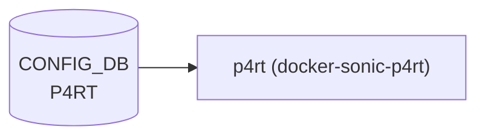

# P4RT テーブル（PINS p4rt 設定）

## 概要

[PINS](../../reference/glossary.md#term-pins)（P4 Integrated Network Stack）の **P4Runtime gRPC サーバ設定**を保持するテーブル[^1]。
`p4rt` コンテナ（`docker-sonic-p4rt`）が起動時に [CONFIG_DB](../../reference/glossary.md#term-config_db) を1回読み込み、
gRPC ポート・TLS 証明書・認可ポリシー・genetlink 設定などを `p4rt` バイナリの起動引数に変換する。

専用 [YANG](../../reference/glossary.md#term-yang) モデルは存在しない。スキーマ強制は `p4rt.sh` 内の `jq` 参照のみで実装される。

<!-- cdb-mermaid -->
### データフロー (自動生成)



!!! note "凡例"
    CONFIG_DB から SAI までの典型経路を `docs/reference/config-db-orch-map.md` から機械生成したミニ図。詳細・例外は本ページ本文と対応表を参照。
<!-- /cdb-mermaid -->

## key 構造

```text
P4RT|certs       # TLS 証明書設定
P4RT|p4rt_app    # P4Runtime gRPC アプリ設定
```

## P4RT|certs

| フィールド | 型 | 説明 |
|-----------|----|------|
| `server_crt` | string (パス) | サーバ証明書ファイルパス |
| `server_key` | string (パス) | サーバ秘密鍵ファイルパス |
| `ca_crt` | string (パス) | CA 証明書ファイルパス（mTLS 用） |
| `cert_crl_dir` | string (パス) | CRL（Certificate Revocation List）ディレクトリ |

## P4RT|p4rt_app

| フィールド | 型 | 説明 |
|-----------|----|------|
| `port` | string (数字) | P4Runtime gRPC 待受 TCP ポート |
| `use_genetlink` | boolean string | Linux Generic [Netlink](../../reference/glossary.md#term-netlink) (genetlink) 経由のパケット I/O を使用するか |
| `use_port_ids` | boolean string | ポート識別に [SONiC](../../reference/glossary.md#term-sonic) port ID を使用するか（デフォルト: ifindex） |
| `save_forwarding_config_file` | string (パス) | P4Runtime forwarding config を保存するファイルパス |
| `authz_policy` | string (パス) | 認可ポリシー JSON ファイルパス |
| `p4rt_unix_socket` | string (パス) | UNIX ドメインソケットパス（gRPC over UDS） |

## 購読者

- `p4rt` コンテナ（`docker-sonic-p4rt`）: 起動時に `p4rt.sh` → `sonic-cfggen` → `p4rt_vars.j2` 経由で読み込む

## 関連 CONFIG_DB / YANG / CLI

- 関連 [CONFIG_DB](../../reference/glossary.md#term-config_db): `DEVICE_METADATA` (`x509` サブキー — TLS fallback)
- [YANG](../../reference/glossary.md#term-yang) モデル: なし（[P4RT](../../reference/glossary.md#term-p4rt) 専用 [YANG](../../reference/glossary.md#term-yang) 未定義）
- 関連 CLI: なし（config load / 手動 DB 書き込み）

<!-- ref-triangle:start -->

## 関連リファレンス

- [HLD](../../reference/glossary.md#term-hld): [PINS（P4 Integrated Network Stack）](../../management/pins-hld.md)

<!-- ref-triangle:end -->

## 引用元

[^1]: 起動スクリプト: `p4rt.sh`. <https://github.com/sonic-net/sonic-buildimage/blob/9ea932ec2e18f35e58268ec2e4456b1d4afd65cd/dockers/docker-sonic-p4rt/p4rt.sh>

<!-- ops-hint -->
## 運用ヒント

### 典型値

```json
"P4RT": {
  "certs": {
    "server_crt": "/keys/server_cert.lnk",
    "server_key": "/keys/server_key.lnk",
    "ca_crt": "/keys/ca_cert.lnk",
    "cert_crl_dir": "/keys/crl"
  },
  "p4rt_app": {
    "port": "9559",
    "use_genetlink": "false",
    "use_port_ids": "false",
    "save_forwarding_config_file": "/etc/sonic/p4rt_forwarding_config.pb.txt",
    "authz_policy": "/keys/authorization_policy.json"
  }
}
```

### よくある誤設定

- `server_crt` / `server_key` のいずれか一方のみ設定すると insecure モードになる（両方必須）。
- `P4RT|certs` を未設定のまま `DEVICE_METADATA|localhost|x509` にも証明書がない場合、
  自動的に `--use_insecure_server_credentials` で起動する（平文 gRPC）。

### 確認コマンド

```bash
sonic-db-cli CONFIG_DB hgetall 'P4RT|p4rt_app'
sonic-db-cli CONFIG_DB hgetall 'P4RT|certs'
systemctl status p4rt
```
<!-- /ops-hint -->

<!-- value-behavior -->
## 値依存挙動マトリクス

### `use_genetlink` (boolean string)

| 値 | 挙動 |
|----|------|
| `"true"` | `--use_genetlink=true` を p4rt バイナリに渡す。Linux genetlink 経由でパケット I/O |
| `"false"` / 未設定 | genetlink 引数なし → バイナリデフォルト（false） |

### `use_port_ids` (boolean string)

| 値 | 挙動 |
|----|------|
| `"true"` | `--use_port_ids=true`。[SONiC](../../reference/glossary.md#term-sonic) port ID で P4Runtime ポート識別 |
| `"false"` / 未設定 | ifindex ベースのポート識別（バイナリデフォルト） |

### TLS / 証明書フォールバック

| 条件 | 挙動 |
|------|------|
| `P4RT\|certs` に `server_crt` + `server_key` あり | TLS 有効 |
| `P4RT\|certs` が存在せず `DEVICE_METADATA\|localhost\|x509` に cert あり | x509 設定を代用 |
| どちらも未設定 | `--use_insecure_server_credentials`（平文 gRPC）|
| `ca_crt` あり | mTLS 有効 |
| `cert_crl_dir` あり (かつ `ca_crt` あり) | CRL チェック有効 |

<!-- /value-behavior -->

<!-- cdb-exceptions -->
## 例外条件・特殊挙動

- **起動時のみ参照**: `p4rt` コンテナは起動時に1回だけ [CONFIG_DB](../../reference/glossary.md#term-config_db) を読み込む。設定変更は `systemctl restart p4rt` まで反映されない。
- **YANG モデルなし**: スキーマ検証がない。不明フィールドは `jq` が `// empty` として無視し、対応するバイナリ引数が渡されない。
- **`server_crt` / `server_key` 片方のみ**: 両方揃わないと `--use_insecure_server_credentials` にフォールバックする（証明書エラーではなく insecure 起動）。
- **`authz_policy` 未設定**: 認可ポリシーなし（全 [P4RT](../../reference/glossary.md#term-p4rt) クライアントが管理者相当で接続可能）。
- **`p4rt_unix_socket` 設定時**: ソケットディレクトリが存在しない場合、`mkdir -p` で自動作成する（`p4rt.sh` L92-94）。

<!-- /cdb-exceptions -->

<!-- runtime-trace -->
## CDB → 実コンテナ動作トレース

### 段階 1: Consumer 登録

- `p4rt.sh` が `sonic-cfggen -d -t p4rt_vars.j2` で CONFIG_DB を読み込み、JSON として `P4RT` テーブルを展開。

### 段階 2: CFG → バイナリ引数変換

- `p4rt.sh` が各フィールドを `jq -r '.field // empty'` で取得し、非空の場合のみ `p4rt` バイナリの引数に追加。
- APP_DB / [STATE_DB](../../reference/glossary.md#term-state_db) への書き込みなし。

### 段階 3: p4rt バイナリ起動

- `exec /usr/local/bin/p4rt ${P4RT_ARGS}` で P4Runtime gRPC サーバが起動。
- [SAI](../../reference/glossary.md#term-sai) 経由で [ASIC](../../reference/glossary.md#term-asic) の P4 パイプラインを制御。

### 段階 4: タイミング + 副作用

- 設定変更は `systemctl restart p4rt` 後に有効（コンテナ再起動が必要）。
- P4Runtime クライアント（コントローラ）は再接続が必要。

<!-- /runtime-trace -->

<!-- entry-points -->
## 書き込み入り口 (Direction A)

### CLI

- 専用 CLI なし — `config load` または手動 `sonic-db-cli` で書き込む

### minigraph / sonic-cfggen

- なし（`minigraph.py` に [P4RT](../../reference/glossary.md#term-p4rt) テーブル生成処理なし）

### REST / gNMI

- なし（YANG モデル未定義のため REST/[gNMI](../../reference/glossary.md#term-gnmi) トランスフォーマーなし）

### db_migrator

- なし

### ビルド時デフォルト (build-time default)

- `config_db.json` への手動追加のみ（`p4rt_app_hld.md` L172 参照）

### ハードコードデフォルト / ランタイム注入

- なし（全フィールド任意）

<!-- /entry-points -->

<!-- derivation -->
## 派生・条件付き登録 (Phase 6/7)

### Phase 6: 自動派生

なし。`P4RT` テーブルはランタイム書き込みなし。

### Phase 7: 条件付き登録

| 条件 | 動作 |
|------|------|
| `P4RT|certs` が存在する | certs フィールドを TLS 設定に使用 |
| `P4RT|certs` が存在しない | `DEVICE_METADATA|localhost|x509` を代わりに参照（`p4rt_vars.j2` L4） |

<!-- /derivation -->

<!-- handler-branching -->
### Phase 8: Handler 内分岐

| Handler | 分岐条件 | 効果 | evidence |
|---------|---------|------|----------|
| `p4rt.sh` | `server_crt` + `server_key` あり | TLS 有効起動 | `p4rt.sh` L22-27 |
| `p4rt.sh` | certs なし / 不完全 | `--use_insecure_server_credentials` | `p4rt.sh` L55-56 |
| `p4rt.sh` | `ca_crt` あり | mTLS 有効 (`--ca_certificate_file`) | `p4rt.sh` L30-37 |
| `p4rt.sh` | `cert_crl_dir` あり | CRL チェック有効 (`--cert_crl_dir`) | `p4rt.sh` L34-37 |
| `p4rt.sh` | `authz_policy` あり | `--authz_policy_enabled --authorization_policy_file=<path>` | `p4rt.sh` L60-63 |
| `p4rt.sh` | `port` あり | `--p4rt_grpc_port=<port>` | `p4rt.sh` L66-69 |
| `p4rt.sh` | `use_genetlink` あり | `--use_genetlink=<val>` | `p4rt.sh` L72-75 |
| `p4rt.sh` | `use_port_ids` あり | `--use_port_ids=<val>` | `p4rt.sh` L78-81 |
| `p4rt.sh` | `save_forwarding_config_file` あり | `--save_forwarding_config_file=<path>` | `p4rt.sh` L84-87 |
| `p4rt.sh` | `p4rt_unix_socket` あり | `--p4rt_unix_socket=<path>` + ディレクトリ作成 | `p4rt.sh` L90-97 |

<!-- /handler-branching -->

<!-- defaults -->
## フィールドデフォルト (コード由来)

### YANG デフォルト vs 実行時 fallback

P4RT テーブルには専用 YANG モデルが存在しない。全デフォルトは `p4rt.sh` のランタイム動作で決まる。

### P4RT|p4rt_app

| フィールド | [HLD](../../reference/glossary.md#term-hld) 記述値 | 未設定時の動作 | 設定元 |
|-----------|-----------|--------------|--------|
| `port` | `"9559"` | `--p4rt_grpc_port` 引数なし → バイナリ内デフォルト `9559` | `p4rt.sh` L66-69; `p4rt_app_hld.md` L184 |
| `use_genetlink` | `"false"` | `--use_genetlink` 引数なし → バイナリ内デフォルト `false` | `p4rt.sh` L72-75; `p4rt_app_hld.md` L185 |
| `use_port_ids` | `"false"` | `--use_port_ids` 引数なし → バイナリ内デフォルト `false` | `p4rt.sh` L78-81; `p4rt_app_hld.md` L186 |
| `save_forwarding_config_file` | `/etc/sonic/p4rt_forwarding_config.pb.txt` | 引数なし → 転送設定ファイルへの保存なし | `p4rt.sh` L84-87 |
| `authz_policy` | `/keys/authorization_policy.json` | 引数なし → 認可ポリシー無効（全クライアントフルアクセス） | `p4rt.sh` L60-63 |
| `p4rt_unix_socket` | ([HLD](../../reference/glossary.md#term-hld) 未記載) | 引数なし → UNIX socket リスナーなし | `p4rt.sh` L90-97 |

### P4RT|certs

| フィールド | [HLD](../../reference/glossary.md#term-hld) 記述値 | 未設定時の動作 | 設定元 |
|-----------|-----------|--------------|--------|
| `server_crt` | `/keys/server_cert.lnk` | 片方でも未設定 → insecure モード | `p4rt.sh` L22-27 |
| `server_key` | `/keys/server_key.lnk` | 片方でも未設定 → insecure モード | `p4rt.sh` L22-27 |
| `ca_crt` | `/keys/ca_cert.lnk` | 未設定 → mTLS 無効 | `p4rt.sh` L30-32 |
| `cert_crl_dir` | `/keys/crl` | 未設定 → CRL チェックなし | `p4rt.sh` L33-37 |

> **隠れデフォルト（YANG 未定義）**: `P4RT|certs` エントリが CONFIG_DB に存在しない場合、
> `p4rt_vars.j2` L4 が `DEVICE_METADATA|localhost|x509` にフォールバックする。
> `x509` も未設定であれば `--use_insecure_server_credentials` で平文 gRPC 起動（`p4rt.sh` L56）。
> この動作は YANG モデルに記述されておらず、`p4rt_vars.j2` / `p4rt.sh` のみで実装される。

### コード由来デフォルトの乖離サマリ

| フィールド | HLD 記述 | 実装 | 乖離 |
|-----------|---------|------|------|
| `port` | `"9559"` | 未設定時もバイナリが 9559 を使う | 実質なし |
| `use_genetlink` | `"false"` | 未設定時もバイナリが false を使う | 実質なし |
| `use_port_ids` | `"false"` | 未設定時もバイナリが false を使う | 実質なし |
| TLS なし時 | (明示なし) | 自動的に `--use_insecure_server_credentials` | HLD に明記なし（隠れ動作） |
| `P4RT|certs` 非存在 | (明示なし) | `DEVICE_METADATA|x509` へフォールバック | HLD に明記なし（隠れ動作） |

<!-- /defaults -->

<!-- ordering -->
## 書込み順依存

`p4rt` コンテナは起動時に `sonic-cfggen -d -t p4rt_vars.j2` で CONFIG_DB を**一度だけ**読み込む。
このため `P4RT|certs` / `P4RT|p4rt_app` の書込み順と存在タイミングがコンテナの TLS モード・機能設定を確定させる。

### 検出された順序依存

| # | 依存関係 | 方向 | 緩和策 |
|---|----------|------|--------|
| 1 | CONFIG_DB への書込み → `p4rt` コンテナ起動 | **強制先行** | 起動後の DB 変更は `systemctl restart p4rt` まで無効 |
| 2 | `P4RT\|certs` 存否 → `DEVICE_METADATA\|localhost\|x509` フォールバック参照 | 条件分岐（先行優先） | `P4RT\|certs` が存在する場合、`x509` は参照されない |
| 3 | `server_crt` + `server_key` の同時存在 → TLS 有効化 | **同時必須** | 片方のみ書込み時に起動すると平文 gRPC になる |
| 4 | `ca_crt` 存在 → `cert_crl_dir` が有効化 | **先行必須** | `ca_crt` なしで `cert_crl_dir` を設定しても CRL チェックは機能しない |

### 主要な制約詳細

**起動時単回読込み (依存 #1)**: `p4rt.sh` L13 の `sonic-cfggen -d -t ${P4RT_VARS_FILE}` は**コンテナ起動時に 1 回だけ**実行される。`p4rt` プロセスは DB 変更を watch しない。したがって `P4RT|certs` や `P4RT|p4rt_app` の変更は `systemctl restart p4rt` によるコンテナ再起動後にのみ反映される。証明書の更新・ポート変更・設定追加を行った場合は必ず再起動が必要（evidence: `p4rt.sh:L13`）。

**`P4RT|certs` → `DEVICE_METADATA|x509` フォールバック順序 (依存 #2)**: `p4rt_vars.j2` L2–4 は `P4RT["certs"]` を先に評価し、存在しない場合のみ `DEVICE_METADATA["x509"]` を代替として `p4rt.sh` に渡す。`p4rt.sh` L21–57 も同様の条件分岐で `${CERTS}` 非空を優先する。`P4RT|certs` が CONFIG_DB に存在する限り、`DEVICE_METADATA|localhost|x509` の内容は完全に無視される（evidence: `p4rt_vars.j2:L2–4`, `p4rt.sh:L21–57`）。

**`server_crt` / `server_key` のアトミック書込み (依存 #3)**: `p4rt.sh` L24–25 は `server_crt` と `server_key` の**両方**が非空かどうかをチェックし、いずれか一方でも空の場合は `--use_insecure_server_credentials` を付与する（エラーにはならない）。TLS を有効化するには、2 つのフィールドを**同一トランザクションで書き込んだ後**にコンテナを起動する必要がある（evidence: `p4rt.sh:L22–28`）。

**`ca_crt` → `cert_crl_dir` の階層依存 (依存 #4)**: CRL チェックを有効にする `--cert_crl_dir` 引数は `p4rt.sh` L33–36 の `ca_crt` 存在ブロック内でのみ評価される。`ca_crt` が未設定の場合、`cert_crl_dir` をどれだけ設定しても CRL チェックは起動せず、引数も付与されない（evidence: `p4rt.sh:L30–37`）。

<!-- /ordering -->

<!-- cross-refs -->
## 暗黙参照テーブル (Phase C)

P4RT テーブルには専用 YANG モデルが存在しないため leafref は一切なし。以下はすべてスクリプトレベルの暗黙参照。

| 参照先テーブル / リソース | 参照方向 | 条件 | 参照元 evidence |
|--------------------------|---------|------|----------------|
| `DEVICE_METADATA\|localhost\|x509` | 読み取り（TLS 代替設定） | `P4RT\|certs` が CONFIG_DB に存在しない場合のみ。`P4RT\|certs` が存在すれば完全に無視される | `p4rt_vars.j2:L4`, `p4rt.sh:L38–56` |
| ファイルシステム（証明書・ソケットパス） | ランタイム参照（パス解決） | 各 string フィールドに設定されたパスをバイナリ起動引数に変換。存在チェックなし（`p4rt_unix_socket` のディレクトリのみ `mkdir -p` 自動作成） | `p4rt.sh:L21–97` |

!!! note "orch レベルの参照なし"
    `p4rt` コンテナは orchagent (`sonic-swss`) とは独立して動作し、APP_DB / STATE_DB の生成・購読を行わない。
    `sonic-swss/orchagent/p4orch/` の各コンポーネントは APPL_DB の `P4RT_*` テーブルを参照するが、
    CONFIG_DB の `P4RT` テーブルを直接参照する経路は存在しない。

<!-- /cross-refs -->

<!-- failure -->
## 失敗挙動マトリクス

ソース: `sonic-net/sonic-buildimage/dockers/docker-sonic-p4rt/p4rt.sh` (コミット `9ea932ec`)

`p4rt` テーブルは [orchagent](../../reference/glossary.md#term-orchagent) ではなく `p4rt.sh` スクリプトが起動時単回読込みするため、失敗は「サイレントフォールバック」または「起動中断」の二択になる。

### 失敗挙動マトリクス

| 失敗条件 | 検出箇所 | 結果 | ログ出力 | evidence |
|---|---|---|---|---|
| `p4rt_vars.j2` テンプレートファイル不在 | `p4rt.sh:L6–9` | `exit 1` — gRPC サーバ起動せず (`systemctl failed`) | `"P4rt vars template file not found"` を stdout | `p4rt.sh:L8` |
| `server_crt` または `server_key` が空 | `p4rt.sh:L24–25` | `--use_insecure_server_credentials` で平文 gRPC 起動（エラーなし） | なし | `p4rt.sh:L25` |
| `P4RT\|certs` も `DEVICE_METADATA\|localhost\|x509` も不在 | `p4rt.sh:L55–57` | `--use_insecure_server_credentials` で平文 gRPC 起動（エラーなし） | なし | `p4rt.sh:L56` |
| `ca_crt` なしで `cert_crl_dir` のみ設定 | `p4rt.sh:L30–37` | `cert_crl_dir` が無視され CRL チェックなしで TLS 起動 | なし | `p4rt.sh:L30–37` |
| `p4rt_unix_socket` ディレクトリ不在 | `p4rt.sh:L92–96` | `mkdir -p` で自動作成（権限不足時は p4rt バイナリが socket bind エラー） | なし（mkdir 失敗時はバイナリ側でエラー） | `p4rt.sh:L94–95` |
| 未知フィールド / typo フィールド | 各 `jq -r '.field // empty'` | 該当引数なしで起動（サイレント無視）— YANG モデルなしのため CLI 事前バリデーションもなし | なし | `p4rt.sh:L60–97` |

### 補足

**テンプレートファイル不在のみが `exit 1` となる唯一の hard failure**。それ以外の設定誤り（証明書欠如・フィールド typo）はすべてサイレントフォールバックであり、`p4rt` コンテナ自体は起動してしまう。意図しない平文 gRPC 起動を検知するには `systemctl status p4rt` の起動引数を確認するか、`p4rt` プロセスの `/proc/<pid>/cmdline` で `--use_insecure_server_credentials` の有無を確認する必要がある。

<!-- /failure -->

<!-- constants -->
## ハードコード定数

`p4rt.sh` および関連テンプレートに存在する、CONFIG_DB / YANG で管理されないハードコード定数の一覧。
出典: `sonic-net/sonic-buildimage/dockers/docker-sonic-p4rt/p4rt.sh`（コミット `9ea932ec`）

### 終了コード

| 定数名 | 値 | 用途 | ソース |
|--------|----|------|--------|
| `EXIT_P4RT_VARS_FILE_NOT_FOUND` | `1` | `p4rt_vars.j2` テンプレートが `/usr/share/sonic/templates/` に不在の場合の終了コード | `p4rt.sh:L3` |

### ファイルシステムパス

| 定数名（変数名またはリテラル） | 値 | 用途 | ソース |
|----------------------------|----|------|--------|
| `P4RT_VARS_FILE` | `/usr/share/sonic/templates/p4rt_vars.j2` | `sonic-cfggen -d -t` に渡す Jinja2 テンプレートパス。`readonly` 宣言。変更不可 | `p4rt.sh:L4` |
| (exec リテラル) | `/usr/local/bin/p4rt` | P4Runtime gRPC サーババイナリの絶対パス。`exec /usr/local/bin/p4rt ${P4RT_ARGS}` に埋め込み | `p4rt.sh:L99` |

### YANG / スキーマ定数

`P4RT` テーブルには専用 YANG モデルが存在しない。YANG `default` 文によるスキーマ定数は **0 件**。
フィールドデフォルト（ポート `9559` 等）はすべて `p4rt` バイナリ内部で保持されており、
`p4rt.sh` 側には明示的なデフォルト値定数が存在しない（各フィールドは `jq -r '.field // empty'` で未設定時は引数なしとなる）。

> **注意**: バイナリ起動引数名（`--p4rt_grpc_port`、`--use_insecure_server_credentials` 等）はスクリプト内にリテラルとして埋め込まれているが、
> これらは CONFIG_DB フィールドとバイナリ引数の対応を定義するものであり、設定値ではない。
<!-- /constants -->

<!-- side-effects -->
## 副次 DB 書込

CONFIG_DB `P4RT` テーブルを読み込む `p4rt.sh` は DB への書き戻しを**一切行わない**。副作用はすべてファイルシステムまたは p4rt バイナリの間接動作に閉じる。

| 副次 DB | 書込有無 | 根拠 |
|---------|---------|------|
| [APPL_DB](../../reference/glossary.md#term-appl_db) | なし | `p4rt.sh` に `sonic-db-cli` / `ProducerStateTable` 等の DB 書込コードなし |
| [STATE_DB](../../reference/glossary.md#term-state_db) | なし | 同上 |
| [COUNTERS_DB](../../reference/glossary.md#term-counters_db) | なし | 同上 |
| [ASIC_DB](../../reference/glossary.md#term-asic_db) / [FLEX_COUNTER_DB](../../reference/glossary.md#term-flex_counter_db) / [LOGLEVEL_DB](../../reference/glossary.md#term-loglevel_db) | なし | [SAI](../../reference/glossary.md#term-sai) 非経由（Linux コンテナ起動スクリプト） |

### ファイルシステムへの副次書き換え（DB 外）

| 対象 | 操作 | 発動条件 | evidence |
|------|------|---------|----------|
| `$(dirname ${p4rt_unix_socket})` | `mkdir -p` でソケット用ディレクトリを自動作成 | `p4rt_unix_socket` フィールドが設定されているとき | `p4rt.sh:L92–94` |
| `save_forwarding_config_file` パス | p4rt バイナリ起動後、P4Runtime 転送設定をファイルに書き込む | `save_forwarding_config_file` フィールドが設定されているとき | `p4rt.sh:L84–87`（バイナリ内実装） |

### p4rt バイナリが管理する APPL_DB 書込（間接）

`p4rt` バイナリ自体は gRPC 経由で受信した P4Runtime リクエストを [APPL_DB](../../reference/glossary.md#term-appl_db) `P4RT_*` テーブルへ書き込む。ただしこれは CONFIG_DB `P4RT` テーブルの読込に伴う直接の副次書込ではなく、外部コントローラからの gRPC リクエストドリブンの書込であるため、`p4rt.sh` の副次 DB 書込とは区別する。

<!-- /side-effects -->

<!-- pubsub -->
## 通信メカニズム

> **Evidence**: `sonic-buildimage/dockers/docker-sonic-p4rt/p4rt.sh` L1–99、`p4rt_vars.j2` L1–5 を精読

`P4RT` テーブルは **SubscriberStateTable・[ConsumerStateTable](../../reference/glossary.md#term-consumerstatetable)・[ProducerStateTable](../../reference/glossary.md#term-producerstatetable) のいずれも使用しない**。
`p4rt.sh` がコンテナ起動時に `sonic-cfggen -d -t p4rt_vars.j2` を**一回だけ**呼び出して CONFIG_DB をスナップショット取得し、
各フィールドを `p4rt` バイナリの起動引数に変換する。CONFIG_DB の変更イベントを watch する仕組みは存在しない。

### 読み込みシーケンス

```
p4rt.sh
  L13: P4RT_VARS=$(sonic-cfggen -d -t /usr/share/sonic/templates/p4rt_vars.j2)
         ↓ p4rt_vars.j2 を Jinja2 展開
         ↓ P4RT["certs"] / P4RT["p4rt_app"] / DEVICE_METADATA["x509"] → JSON
  L15–17: jq で各フィールドを変数に展開
  L21–97: P4RT_ARGS を構築（TLS 条件分岐 + オプション引数）
  L99:    exec /usr/local/bin/p4rt ${P4RT_ARGS}
```

### DB 購読チャンネル一覧

| 区間 | 方式 | 備考 |
|------|------|------|
| CONFIG_DB → p4rt.sh | `sonic-cfggen -d` 一括読み込み（シングルショット） | イベント駆動なし |
| p4rt バイナリ → [APPL_DB](../../reference/glossary.md#term-appl_db) `P4RT_*` | gRPC リクエスト起点の直接書き込み | CONFIG_DB `P4RT` テーブルとは独立 |

**SubscriberStateTable / [ConsumerStateTable](../../reference/glossary.md#term-consumerstatetable) / [ProducerStateTable](../../reference/glossary.md#term-producerstatetable) の使用: なし**

### 変更反映タイミング

CONFIG_DB `P4RT` テーブルへの変更は `p4rt` コンテナ稼働中には反映されない。
`sonic-cfggen -d -t` はコンテナ起動時のシングルショットであるため、設定変更後は
`systemctl restart p4rt` によるコンテナ再起動が必要（evidence: `p4rt.sh:L13`）。

### 関連コンポーネントの pubsub（CONFIG_DB `P4RT` とは独立）

`sonic-swss/orchagent/p4orch/` の P4 orch 群は APPL_DB の `P4RT_TABLE:*` 等を `ConsumerStateTable` で購読するが、
これは外部 P4Runtime gRPC コントローラからの書き込み起点であり、CONFIG_DB `P4RT` テーブルの変更通知とは別経路。

<!-- /pubsub -->

<!-- platform -->
## プラットフォーム差

**プラットフォーム差なし**。`P4RT` テーブルは `p4rt.sh` がコンテナ起動時に1回だけスナップショット読み込みする host-only 設定処理であり、[ASIC](../../reference/glossary.md#term-asic) 種別・multi-asic / chassis 構成・ハードウェアベンダーに依存しない。

### 検証結果

| 差異候補 | 実態 | evidence |
|---------|------|----------|
| `hwsku` / `type` / `platform` ([DEVICE_METADATA](../../reference/glossary.md#term-device_metadata)) の参照 | `p4rt.sh` は `DEVICE_METADATA["x509"]` のみ参照（TLS fallback 用）。`hwsku` / `type` / `platform` フィールドはゼロ参照 | `p4rt_vars.j2:L4`; `p4rt.sh:L38–56` |
| multi-asic 構成 | `SONIC_ASIC_ID` / `SONIC_ASIC_COUNT` 等の multi-asic 環境変数を `p4rt.sh` は参照しない。`docker-sonic-p4rt` は host namespace で 1 コンテナのみ起動 | `p4rt.sh:L1–99`; `supervisord.conf:[program:p4rt]` |
| [SAI](../../reference/glossary.md#term-sai) / [ASIC](../../reference/glossary.md#term-asic) capability | 経路なし。CONFIG_DB `P4RT` テーブルの読み込みとバイナリ起動引数変換は host Linux プロセス管理レイヤで完結。SAI は P4 orch が APPL_DB 経由で間接利用するが、CONFIG_DB `P4RT` 読込処理とは独立 | `p4rt.sh:L99` (`exec /usr/local/bin/p4rt`) |
| [VOQ](../../reference/glossary.md#term-voq) chassis / line card 分散 | [PINS](../../reference/glossary.md#term-pins) は現行 HLD で単一 ASIC 向けを想定。`p4rt.sh` は単一コンテナ単一バイナリ起動のみ実装。chassis 集中適用機構なし | `p4rt_app_hld.md`; `supervisord.conf` |
| ベンダー固有分岐 | `p4rt.sh` に `broadcom` / `mellanox` / `nvidia` 等のベンダー識別コードなし | `p4rt.sh:L1–99` 全行精読 |

!!! note "プラットフォーム差なしの根拠"
    `p4rt.sh`（L1–99）全行に `hwsku`、`asic`、`platform`、`multi_npu`、`chassis`、`voq`、`vendor` 等のキーワードはゼロヒット。`p4rt_vars.j2` も同様。CONFIG_DB `P4RT` テーブルの処理は純粋な host OS レイヤの「設定スナップショット → バイナリ引数変換 → gRPC サーバ起動」に閉じており、T0 / T1 / T2 トポロジや ASIC ベンダーに関わらず同一動作をする。

> **証跡**: `sonic-buildimage/dockers/docker-sonic-p4rt/p4rt.sh:L1–99`（ベンダー/ASIC 分岐ゼロ）、`p4rt_vars.j2:L1–5`（`DEVICE_METADATA["type"]` 未参照）、`supervisord.conf:[program:p4rt]`（固定 command）; 詳細分析 `meta/_intermediate/cdb-flow/pin-config-platform.md`
<!-- /platform -->

<!-- glossary-links-injected -->

<!-- glossary-links-injected: 0927b7f301d5 -->
