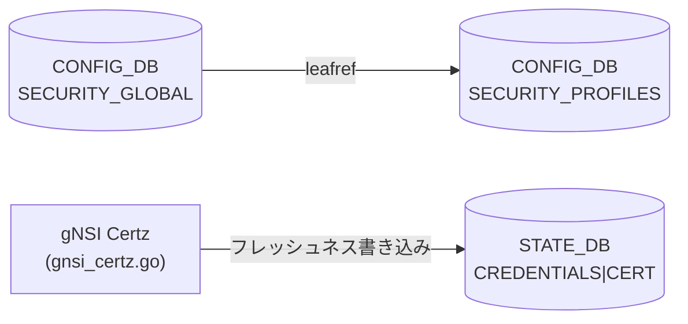

# SECURITY_PROFILES / PKI テーブル

!!! warning "裏取りステータス: Discrepancy-found"
    `SECURITY_PROFILES` テーブルを定義する `sonic-pki.yang` は `sonic-mgmt-common` の CVL テストデータスキーマとしてのみ存在し、`sonic-buildimage/src/sonic-yang-models/yang-models/` (コミュニティ master YANG) には **未マージ** (2026-05-14 時点)。実際の CONFIG_DB エントリを消費するハンドラ実装も確認できなかった。したがって本ページの内容は YANG スキーマ定義と gNSI Certz 実装の間の乖離を含む。

## 概要

`SECURITY_PROFILES` テーブルは gNSI Certz の **SSL プロファイル** (証明書バンドル) と証明書ファイル名を対応付けるための [CONFIG_DB](../../reference/glossary.md#term-config_db) テーブルとして設計されている[^1]。

gNSI Certz (`sonic-gnmi/gnmi_server/gnsi_certz.go`) はデフォルトプロファイル `"gnxi"` を内部で管理し、証明書フレッシュネスメタデータを **STATE_DB** の `CREDENTIALS|CERT|<profileID>` に書き込む[^2]。CONFIG_DB の `SECURITY_PROFILES` を直接参照するコードは community master では未確認。

`SECURITY_GLOBAL|global.security_profile` は `SECURITY_PROFILES` への leafref を持ち、CVL バリデーションで参照整合性を強制する設計[^1]。

<!-- cdb-mermaid -->
### データフロー (設計上)



!!! note "凡例"
    CONFIG_DB から SAI までの典型経路を `docs/reference/config-db-orch-map.md` から機械生成したミニ図。詳細・例外は本ページ本文と対応表を参照。
<!-- /cdb-mermaid -->

## key 構造

```text
SECURITY_PROFILES|<profile-name>
SECURITY_GLOBAL|global
```

- `SECURITY_PROFILES|<profile-name>` — SSL プロファイル名をキーとするエントリ
- `SECURITY_GLOBAL|global` — グローバルセキュリティプロファイル参照 (leafref)

## フィールド

### SECURITY_PROFILES|`<profile-name>`

| フィールド | 型 | デフォルト | 説明 |
|-----------|----|-----------|------|
| `certificate-name` | string | (なし、optional) | 証明書ファイル名 |

### SECURITY_GLOBAL|global

| フィールド | 型 | デフォルト | 説明 |
|-----------|----|-----------|------|
| `security_profile` | leafref → `SECURITY_PROFILES` | (なし) | アクティブなセキュリティプロファイル名 |

## 制約

- `SECURITY_GLOBAL|global.security_profile` が参照するプロファイルが存在する間は `SECURITY_PROFILES|<profile-name>` の削除が CVL バリデーションでブロックされる (`instance-in-use` エラー)[^1]
- `certificate-name` フィールドは YANG で `optional` のため省略可能だが、参照元ハンドラの実装は未確認

## 実装状況 (community master 2026-05-14)

| 項目 | 状態 |
|-----|------|
| `sonic-pki.yang` の sonic-buildimage YANG マージ | **未実装** — CVL testdata のみ |
| `SECURITY_PROFILES` を読む handler/daemon | **未確認** |
| gNSI Certz のプロファイル管理 | **実装済み** (内部 JSON ファイル、STATE_DB 経由) |
| gNSI Certz の CONFIG_DB `SECURITY_PROFILES` 参照 | **未実装** |

gNSI Certz 実装 (`gnsi_certz.go`) は CONFIG_DB を参照せず、独自の JSON メタデータファイル (`/keys/grpc-version.json`) とファイルシステムのシンボリックリンクでプロファイルを管理する[^2]。

## gNSI Certz が書き込む STATE_DB フィールド

CONFIG_DB への書き込みはないが、証明書バンドルのフレッシュネス情報が STATE_DB に記録される:

```text
CREDENTIALS|CERT|<profileID>
  certificate_version         = "V1"           (bootstrap 初期値)
  certificate_created_on      = <UnixNano 文字列>
  ca_trust_bundle_version     = "V1"           (bootstrap 初期値)
  ca_trust_bundle_created_on  = <UnixNano 文字列>
  certificate_revocation_list_bundle_version = "V1"
  authentication_policy_version = "V1"
```

デフォルトプロファイル名: `"gnxi"` (`gnsi_certz.go:30` — `defaultProfile` 定数)[^2]

<!-- defaults -->
## コード由来の暗黙デフォルト (Phase A)

> SECURITY_PROFILES YANG フィールドおよび gNSI Certz 内部デフォルトを整理する。

### `profile-name` (SECURITY_PROFILES key)

| 種別 | 値 | ソース |
|------|----|--------|
| gNSI Certz 内部デフォルト | `"gnxi"` | `gnsi_certz.go:30` — `defaultProfile` 定数 |
| YANG デフォルト | なし (key フィールドは必須) | `sonic-pki.yang:31` |

`"gnxi"` は起動時に `bootstrapDefaultProfile()` が生成するプロファイル名であり、CONFIG_DB の `SECURITY_PROFILES` キーとは直接連動しない[^2]。

---

### `certificate-name` (SECURITY_PROFILES)

| 種別 | 値 | ソース |
|------|----|--------|
| YANG デフォルト | なし (optional leaf) | `sonic-pki.yang:36-41` |
| コード由来デフォルト | 不明 (ハンドラ未実装) | — |

YANG で `default` 宣言なし。フィールドが DB に存在しない場合の runtime fallback はハンドラ未実装のため追跡不可。

---

### gNSI Certz 内部 — 証明書バンドルバージョン

| 種別 | 値 | ソース |
|------|----|--------|
| bootstrap 初期 version | `"V1"` | `gnsi_certz.go:186,193,200,207` — `bootstrapDefaultProfile()` |
| Rotate 後の version | クライアント指定値 (必須) | `gnsi_certz.go:392-394` — `version cannot be empty` バリデーション |

bootstrap 時に生成されるすべてのエンティティ (Cert / TrustBundle / CrlBundle / AuthPolicy) の version は `"V1"` 固定。Rotate RPC では `version` フィールドが空文字列の場合 `codes.InvalidArgument` エラーが返される[^2]。

---

### gNSI Certz 内部 — 証明書パスデフォルト

| エンティティ | bootstrap 時パス | ソース |
|-------------|----------------|--------|
| サーバ証明書 (`Cert`) | `Config.SrvCertFile` / シンボリックリンク `SrvCertLnk` から復元 | `gnsi_certz.go:187-191` |
| CA Trust Bundle | `Config.CaCertFile` / シンボリックリンク `CaCertLnk` から復元 | `gnsi_certz.go:194-197` |
| CRL Bundle | `Config.CertCRLConfig` ディレクトリ | `gnsi_certz.go:199-204` |
| Auth Policy | `Config.FedPolicyFile` | `gnsi_certz.go:207-211` |

各パスはコマンドライン引数 (`telemetry.go:196-207`) で設定される。シンボリックリンク (`/keys/*.lnk`) が存在しファイルが有効な場合はそちらが優先される (`restoreFromFile()` ロジック)[^2]。

<!-- evidence:
  sonic-mgmt-common/cvl/testdata/schema/sonic-pki.yang:28-44 — SECURITY_PROFILES YANG 定義
  sonic-mgmt-common/cvl/testdata/schema/sonic-security-global.yang:26-38 — SECURITY_GLOBAL leafref
  sonic-mgmt-common/cvl/cvl_test.go:2505-2535 — instance-in-use エラーテスト
  sonic-gnmi/gnmi_server/gnsi_certz.go:29-36 — 定数 (defaultProfile="gnxi", certTbl, credentialsTbl)
  sonic-gnmi/gnmi_server/gnsi_certz.go:178-222 — bootstrapDefaultProfile (Version="V1")
  sonic-gnmi/gnmi_server/gnsi_certz.go:385-416 — doUpload バリデーション (version必須)
  sonic-gnmi/gnmi_server/gnsi_certz.go:688-715 — writeEntityFreshness (STATE_DB 書き込み)
  sonic-gnmi/telemetry/telemetry.go:196-207 — CaCertLnk/SrvCertLnk/SrvKeyLnk CLI フラグデフォルト
-->
<!-- /defaults -->

<!-- ordering -->
## 書込み順依存 (Phase B)

`SECURITY_PROFILES` / `SECURITY_GLOBAL` はハンドラが community master で未実装のため、DB レベルの順序制約は CVL バリデーション層のみが強制する。gNSI Certz は CONFIG_DB を参照しないが、STATE_DB への書込みには起動内部の固定順序がある。

### 検出された順序依存

| # | 依存関係 | 方向 | 緩和策 |
|---|----------|------|--------|
| 1 | `SECURITY_PROFILES\|<profile>` 作成 → `SECURITY_GLOBAL\|global.security_profile` 設定 | **強制先行** (CVL leafref) | プロファイルが存在しない状態で `SECURITY_GLOBAL` の `security_profile` を書くと CVL が `invalid-value` エラーを返す |
| 2 | `SECURITY_GLOBAL\|global.security_profile` 削除 → `SECURITY_PROFILES\|<profile>` 削除 | **強制先行** (CVL instance-in-use) | 参照中のプロファイルを先に削除しようとすると CVL が `instance-in-use` エラーを返す (`cvl_test.go:2506-2537`) |
| 3 | gNSI Certz 起動: `loadCertzMetadata` / `bootstrapDefaultProfile` → `writeEntityFreshness` × 4 | 起動内部シーケンス (固定) | Cert → TrustBundle → CrlBundle → AuthPolicy の順で STATE_DB に書込まれる。途中でプロセスが落ちると一部エンティティのフレッシュネスのみが記録された中間状態が残る |
| 4 | gNSI Certz 起動: 全プロファイルの freshness 書込み → `saveCertzMetadata` | 起動内部シーケンス (固定) | `saveCertzMetadata` は全 `writeEntityFreshness` 完了後に呼ばれる (`gnsi_certz.go:141`) |

### 主要な制約詳細

**CVL leafref 制約 (依存 #1, #2)**: `sonic-security-global.yang` の `security_profile` leaf は `sonic-pki` YANG の `/SECURITY_PROFILES/SECURITY_PROFILES_LIST/profile-name` への leafref として定義される。CVL は SET 時に参照先の存在を検証し、DEL 時に参照元が残っていないかを `instance-in-use` タグで検証する。したがって CONFIG_DB 操作の安全な順序は「プロファイル作成 → グローバル参照設定 → グローバル参照削除 → プロファイル削除」でなければならない (`sonic-security-global.yang:29-35`, `cvl_test.go:2506-2537`)[^1]。

**gNSI Certz STATE_DB 書込み順序 (依存 #3)**: `NewGNSICertzServer()` は起動時に `s.profiles` を構築した後、各プロファイルの `ActiveEntities` を Cert → TrustBundle → CrlBundle → AuthPolicy の順で `writeEntityFreshness` で STATE_DB (`CREDENTIALS|CERT|<profileID>`) に書込む。これは `gnsi_certz.go:134-138` の固定 for-loop 内で行われ、並列化はされない[^2]。

**CONFIG_DB ハンドラ未実装による非影響 (注記)**: community master では `SECURITY_PROFILES` を消費するハンドラが存在しないため、CONFIG_DB への書込み順序が runtime の動作に影響を与える経路は現時点で確認されていない。上記 #1/#2 の制約は CVL バリデーション層のみで有効であり、orchagent / translib 等との協調順序は将来のハンドラ実装時に改めて評価が必要である。

<!-- evidence:
  sonic-mgmt-common/cvl/testdata/schema/sonic-security-global.yang:29-35 — security_profile leafref 定義
  sonic-mgmt-common/cvl/cvl_test.go:2506-2537 — instance-in-use テスト (SECURITY_PROFILES 削除ブロック)
  sonic-gnmi/gnmi_server/gnsi_certz.go:126-141 — NewGNSICertzServer: loadCertzMetadata → bootstrapDefaultProfile → writeEntityFreshness × 4 → saveCertzMetadata
  sonic-gnmi/gnmi_server/gnsi_certz.go:134-138 — Cert/TrustBundle/CrlBundle/AuthPolicy の順序固定ループ
  sonic-gnmi/gnmi_server/gnsi_certz.go:688-715 — writeEntityFreshness (STATE_DB CREDENTIALS|CERT|<profileID> 書込み)
-->
<!-- /ordering -->

<!-- cross-refs -->
## 他テーブル・コンポーネントとの参照関係 (Phase C)

詳細な調査メモは `meta/_intermediate/cdb-flow/pki-trusted-certs-cross-refs.md` を参照。

### SECURITY_PROFILES が参照する / される先

| 参照元 | 参照先 | 参照種別 | ソース |
|--------|--------|----------|--------|
| `SECURITY_GLOBAL\|global.security_profile` | `SECURITY_PROFILES\|<profile-name>` | YANG leafref (CVL バリデーション) | `sonic-security-global.yang:29-35` |

### gNSI Certz が書き込む STATE_DB テーブル

| テーブル | キー形式 | 書込みタイミング | ソース |
|---------|---------|----------------|--------|
| `CREDENTIALS\|CERT\|<profileID>` (STATE_DB) | `CREDENTIALS\|CERT\|<profileID>` | gNSI Certz 起動時・Rotate RPC 処理時 | `gnsi_certz.go:1036-1059` |

`writeCredentialsMetadataToDB()` は `common_utils.GetRedisDBClient()` 経由で STATE_DB (DB 番号 6) に接続し、`certTbl="CERT"` / `credentialsTbl="CREDENTIALS"` 定数から `GetKey()` でパスを構築する (`gnsi_certz.go:46-48`, `notification_producer.go:16`)。

### GNMI_CLIENT_CERT (CONFIG_DB) — 独立した関連テーブル

`GNMI_CLIENT_CERT` テーブルはクライアント証明書の CN ↔ gNMI ロールマッピングを格納する独立テーブルであり、`SECURITY_PROFILES` との直接的な依存関係はない。`clientCertAuth.go:259-263` が `ConfigDBConnector.Get_entry("GNMI_CLIENT_CERT", certCommonName)` を呼び出してロール解決を行う。

### community master での非連携

`SECURITY_PROFILES` を直接参照する production ハンドラ (orchagent / translib / certmgr) は community master では確認されていない。gNSI Certz のプロファイル管理は `/keys/grpc-version.json` (CertzMetaFile) とファイルシステムシンボリックリンクで独立して行われる。

<!-- evidence:
  sonic-mgmt-common/cvl/testdata/schema/sonic-security-global.yang:29-35 — security_profile leafref → SECURITY_PROFILES
  sonic-gnmi/gnmi_server/gnsi_certz.go:46-48 — certTbl="CERT", credentialsTbl="CREDENTIALS" 定数
  sonic-gnmi/gnmi_server/gnsi_certz.go:1036-1059 — writeCredentialsMetadataToDB (STATE_DB 書込み)
  sonic-gnmi/common_utils/notification_producer.go:16 — dbName="STATE_DB"
  sonic-gnmi/gnmi_server/clientCertAuth.go:259-263 — ConfigDB GNMI_CLIENT_CERT 参照 (CN→ロール解決)
-->
<!-- /cross-refs -->

<!-- failure -->
## 失敗挙動・エラーパス (Phase D)

> 詳細証跡: `meta/_intermediate/cdb-flow/pki-trusted-certs-failure.md`

### CVL バリデーション失敗

| 操作 | 失敗条件 | CVL エラー | 挙動 |
|------|----------|-----------|------|
| `SECURITY_GLOBAL\|global` SET | `security_profile` が参照する `SECURITY_PROFILES\|<profile>` が存在しない | `invalid-value` (leafref 未解決) | CONFIG_DB への書込み拒否。既存値は変更されない |
| `SECURITY_PROFILES\|<profile>` DEL | `SECURITY_GLOBAL\|global.security_profile` が当該プロファイルを参照中 | `instance-in-use` | 削除拒否。参照元の `security_profile` を先に削除するまでブロックされる |

証拠: `sonic-security-global.yang:29-35` (leafref 定義), `cvl_test.go:2506-2537`

### gNSI Certz 起動時エラー

| 条件 | 挙動 | 証拠 |
|------|------|------|
| `CertzMetaFile` 読み込み失敗 (ファイル欠損・不正 JSON) | `log.V(0).Info(err)` でログ出力のみ。処理は継続し `bootstrapDefaultProfile()` が呼ばれデフォルトプロファイルが再生成される | `gnsi_certz.go:126-127` |
| CRL ディレクトリ (`CertCRLConfig` 配下) の `os.MkdirAll` 失敗 | `log.V(1).Infof("Failed Creating CRL Flush dir: ...")` のみ。プロセス継続。後続の CRL 操作で失敗する | `gnsi_certz.go:145-155` |

### Rotate RPC 失敗パス

#### 入力バリデーション失敗 (`codes.InvalidArgument` / `codes.Aborted`)

| 条件 | gRPC コード | エラーメッセージ | 証拠 |
|------|------------|----------------|------|
| `ssl_profile_id` が未登録プロファイル | `InvalidArgument` | `"Rotate requested with invalid ssl_profile_id: %s"` | `gnsi_certz.go:287-289` |
| `entity` が空 | `InvalidArgument` | `"entity cannot be empty"` | `gnsi_certz.go:386` |
| `created_on` が空 | `InvalidArgument` | `"created_on cannot be empty"` | `gnsi_certz.go:390` |
| `version` が空文字列 | `InvalidArgument` | `"version cannot be empty"` | `gnsi_certz.go:393` |
| CRL 未設定状態で CRL entity を Upload | `Aborted` | `"CRL not configured"` | `gnsi_certz.go:406` |
| 並行 Rotate RPC (既に処理中) | `Aborted` | `"concurrent certz.Rotate RPCs are not allowed"` | `gnsi_certz.go:232-234` |

#### 証明書ファイル操作失敗とロールバック

`activateEntity` 内の `atomicSetSrvCertKeyPair` / `atomicSetCACert` がシンボリックリンク作成に失敗した場合:

- **`atomicSetSrvCertKeyPair`**: 新シンボリックリンク (`SrvCertLnk` / `SrvKeyLnk`) 作成失敗時に `restoreSymlink` で旧リンクを復元。ただし restore 自体の失敗は `_ =` で無視されるため、restore が失敗するとシンボリックリンクなし状態 (gRPC 証明書読み込み不能) が残りうる (`gnsi_certz.go:951-952`, `958-959`)
- **`atomicSetCACert`**: 同様に `restoreSymlink(oldCert, CaCertLnk)` でロールバック (`gnsi_certz.go:984`)

`saveEntities` 失敗 (ファイル書き込みエラー等) は `codes.Aborted: "Entity save err: ..."` で Rotate ストリーム全体を中断する。

#### Finalize なし終了

クライアントが Upload を送らずに Rotate ストリームを切断 (EOF) した場合、`codes.Aborted: "No Finalize message"` を返す。`ActiveEntities` に中間状態のエンティティが残る可能性があるが、次回 Rotate で上書きされる (`gnsi_certz.go:244-248`)。

### STATE_DB 書込み失敗

Redis が利用不可の場合、`writeCredentialsMetadataToDB` が `"REDIS is not available: ..."` エラーを返す。`writeEntityFreshness` はこのエラーをログ (`log.V(0).Infof`) するが処理を継続する。証明書ファイル自体は有効であり gRPC 動作に直接の影響はない (`gnsi_certz.go:1038-1042`, `688-730`)。

### 未実装 RPC

`AddProfile` / `DeleteProfile` / `GetProfileList` はすべて `codes.Unimplemented` を返す。デフォルトプロファイル `"gnxi"` を含む全プロファイルの追加・削除は RPC 経由では不可能 (`gnsi_certz.go:162-170`)。

### ハンドラ未実装による非影響

`SECURITY_PROFILES` を CONFIG_DB から読み込む production ハンドラ (orchagent / translib / certmgr) が community master に存在しないため、DB 書込みエラー (CVL バリデーション以外) が runtime 動作に影響を与える経路は現時点で確認されない。

<!-- evidence:
  sonic-mgmt-common/cvl/testdata/schema/sonic-security-global.yang:29-35 — security_profile leafref (invalid-value / instance-in-use の根拠)
  sonic-mgmt-common/cvl/cvl_test.go:2506-2537 — instance-in-use テスト
  sonic-gnmi/gnmi_server/gnsi_certz.go:126-127 — loadCertzMetadata エラー処理
  sonic-gnmi/gnmi_server/gnsi_certz.go:145-155 — MkdirAll エラー処理
  sonic-gnmi/gnmi_server/gnsi_certz.go:162-170 — Unimplemented RPC
  sonic-gnmi/gnmi_server/gnsi_certz.go:232-234 — TryLock (並行 Rotate 拒否)
  sonic-gnmi/gnmi_server/gnsi_certz.go:244-248 — EOF without Finalize
  sonic-gnmi/gnmi_server/gnsi_certz.go:286-305 — processRotateRequest (InvalidArgument)
  sonic-gnmi/gnmi_server/gnsi_certz.go:381-430 — doUpload バリデーションと Aborted エラー
  sonic-gnmi/gnmi_server/gnsi_certz.go:925-989 — atomicSetSrvCertKeyPair / atomicSetCACert ロールバック
  sonic-gnmi/gnmi_server/gnsi_certz.go:1037-1055 — writeCredentialsMetadataToDB REDIS unavailable
-->
<!-- /failure -->

<!-- constants -->
## ハードコード定数 (Phase E)

> 詳細調査メモ: `meta/_intermediate/cdb-flow/pki-trusted-certs-constants.md`

gNSI Certz は CONFIG_DB を直接参照しないため、CONFIG_DB レベルの定数は少ない。ただしプロファイル管理と STATE_DB 書込みで以下の定数が固定化される。

### プロファイル・テーブル名定数

| 定数名 | 値 | 役割 | ソース |
|--------|-----|------|--------|
| デフォルトプロファイル | `"gnxi"` | gNSI Certz 内部で起動時に自動生成されるプロファイル ID。CONFIG_DB `SECURITY_PROFILES` との連携なし | `gnsi_certz.go:30` |
| STATE_DB テーブル | `CREDENTIALS` | gNSI Certz が証明書メタデータを書き込む STATE_DB テーブル名 | `gnsi_certz.go:48` |
| STATE_DB entity ID | `CERT` / `CERT_VERSION` / `CREATED_ON` サフィックス | STATE_DB `CREDENTIALS\|CERT\|<profileID>` キーのフィールド命名規則。以下のエンティティフィールドで構成: | `gnsi_certz.go:32-40` |

### State_DB フィールド命名 (entity + suffix パターン)

| フィールド | 構成 | 値例 | ソース |
|-----------|-----|------|--------|
| `certificate_version` | `"certificate"` + `"_version"` | `"V1"` (bootstrap 初期値) | `gnsi_certz.go:33, 39, 188` |
| `certificate_created_on` | `"certificate"` + `"_created_on"` | Unix nanoseconds | `gnsi_certz.go:33, 40` |
| `ca_trust_bundle_version` | `"ca_trust_bundle"` + `"_version"` | `"V1"` (bootstrap 初期値) | `gnsi_certz.go:34, 39, 196` |
| `ca_trust_bundle_created_on` | `"ca_trust_bundle"` + `"_created_on"` | Unix nanoseconds | `gnsi_certz.go:34, 40` |
| `certificate_revocation_list_bundle_version` | `"certificate_revocation_list_bundle"` + `"_version"` | `"V1"` (bootstrap 初期値) | `gnsi_certz.go:35, 39, 203` |
| `authentication_policy_version` | `"authentication_policy"` + `"_version"` | `"V1"` (bootstrap 初期値) | `gnsi_certz.go:36, 39, 210` |

### Version 定数値 (bootstrap 初期化)

起動時 `bootstrapDefaultProfile()` で全エンティティに適用:

| バージョン | 用途 | ソース |
|-----------|------|--------|
| `"V1"` | bootstrap 時のすべてのエンティティ初期値 (Cert / TrustBundle / CrlBundle / AuthPolicy) | `gnsi_certz.go:188, 196, 203, 210` |

Rotate RPC による更新時には、クライアント指定値 (空文字列拒否) で上書きされる。

### Entity 処理順序の固定化 (enum iota)

STATE_DB 書込みおよびストリーム処理の順序は enum で定義:

```go
const (
    certType CertzType = iota      // 0: SERVER CERTIFICATE
    tbType                         // 1: CA TRUST BUNDLE
    crlType                        // 2: CRL BUNDLE
    apType                         // 3: AUTHENTICATION POLICY
)
```

この順序で `bootstrapDefaultProfile()` の for-loop (`gnsi_certz.go:134-138`) が STATE_DB への書込みを行う。並列化なし。

### CRL 管理ディレクトリ定数

| 定数 | 値 | 役割 | ソース |
|------|-----|------|--------|
| CRL デフォルトディレクトリ | `"crl"` | v0→v1 互換性のための CRL 配置先パス | `gnsi_certz.go:43` |
| Flush サフィックス | `"_flush"` | CRL flush 時のサブディレクトリ名 | `gnsi_certz.go:44` |
| 一時ディレクトリ | `"tmp"` | CRL 一時ファイル置き場 | `gnsi_certz.go:45` |

### ファイル操作

| 定数 | 値 | 用途 | ソース |
|------|-----|------|--------|
| バックアップ拡張子 | `".bak"` | Rotate 失敗時ロールバック用 (symbolinc link restore) | `gnsi_certz.go:47` |

### Integrity Manifest ファイルパス

| 定数 | デフォルト値 | 役割 | ソース |
|------|------------|------|--------|
| `integrityManifestFile` | `"/mbm/boot_manifest.cbor"` | gNSI Certz が読み込む boot integrity manifest ファイルパス（ハードコード。`srv.config.IntManFile` で上書き可能） | `gnsi_certz.go:54, 122-123` |

---

### 注記

1. **VERSION `"V1"` は bootstrap 専用**: Rotate RPC での更新時はクライアント指定値を採用。空文字列は `codes.InvalidArgument` で拒否される。

2. **`defaultProfile = "gnxi"` は CONFIG_DB 非依存**: gNSI Certz 内部管理。`SECURITY_PROFILES|<profile-name>` キーとは無関係。

3. **CONFIG_DB ハンドラ未実装**: `SECURITY_PROFILES` テーブルを読む production ハンドラが community master に存在しないため、定数がハンドラロジック（順序・デフォルト値選択）に影響を与える経路は現時点で確認されていない。

<!-- evidence:
  sonic-gnmi/gnmi_server/gnsi_certz.go:29-49 — const ブロック (defaultProfile, certTbl, credentialsTbl, versionFld, createdFld 等)
  sonic-gnmi/gnmi_server/gnsi_certz.go:91-96 — Entity type enum (certType, tbType, crlType, apType の iota)
  sonic-gnmi/gnmi_server/gnsi_certz.go:134-138 — bootstrapDefaultProfile 内 for-loop (Entity 書込み固定順序)
  sonic-gnmi/gnmi_server/gnsi_certz.go:178-222 — bootstrapDefaultProfile (Version="V1" 初期化, 4 entity)
  sonic-gnmi/gnmi_server/gnsi_certz.go:385-416 — doUpload validation (version 必須, codes.InvalidArgument)
  sonic-gnmi/gnmi_server/gnsi_certz.go:54 — integrityManifestFile default path
  sonic-gnmi/gnmi_server/gnsi_certz.go:122-123 — NewGNSICertzServer (IntManFile override)
-->
<!-- /constants -->

<!-- side-effects -->
## 副次 DB 書込・外部副作用 (Phase F)

`SECURITY_PROFILES` / `SECURITY_GLOBAL` を書き込む production ハンドラは community master に存在しないため、CONFIG_DB 操作に伴う orchagent / translib 由来の副次 DB 書込はない。ただし gNSI Certz が Rotate RPC・起動処理を通じて以下の副次作用を持つ。

### STATE_DB — `CREDENTIALS|CERT|<profileID>`

| トリガ | 操作 | キー | フィールド | 値 | ソース |
|--------|------|------|-----------|-----|--------|
| gNSI Certz 起動 (`bootstrapDefaultProfile`) | HSET | `CREDENTIALS\|CERT\|<profileID>` | `certificate_version` / `ca_trust_bundle_version` 等 6 フィールド | `"V1"` (起動初期値) | `gnsi_certz.go:134-138, 688-715` |
| Rotate RPC `activateEntity` | HSET | `CREDENTIALS\|CERT\|<profileID>` | 対応エンティティの `*_version` / `*_created_on` フィールド | クライアント指定値 | `gnsi_certz.go:502` |
| Rotate RPC `finalizeProfile` | HSET | `CREDENTIALS\|CERT\|<profileID>` | 確定済みエンティティ全フィールド | 確定値 | `gnsi_certz.go:646-685` |

DB クライアント: `common_utils.GetRedisDBClient()` — DB 番号 **6** (STATE_DB) に対して `HSET` (`gnsi_certz.go:1040-1052`, `common_utils/notification_producer.go:16`)。Redis 障害時は `"REDIS is not available"` をログ出力のみで継続（証明書ファイル自体には影響しない）。

### ファイルシステム副作用 — シンボリックリンク更新

Rotate RPC が証明書を差し替えると、以下のシンボリックリンクがアトミックに更新される:

| シンボリックリンク | 対象エンティティ | 更新関数 | ソース |
|-------------------|----------------|---------|--------|
| `cfg.SrvCertLnk` (`/keys/server_cert.lnk`) | サーバ証明書 (Cert) | `atomicSetSrvCertKeyPair` | `gnsi_certz.go:924-963` |
| `cfg.SrvKeyLnk` (`/keys/server_key.lnk`) | サーバ秘密鍵 (Cert) | `atomicSetSrvCertKeyPair` | `gnsi_certz.go:924-963` |
| `cfg.CaCertLnk` (`/keys/ca_cert.lnk`) | CA 証明書 (TrustBundle) | `atomicSetCACert` | `gnsi_certz.go:966-989` |

これらのリンクは gRPC サーバが **新規接続ごとに** `tls.LoadX509KeyPair(cfg.SrvCertLnk, cfg.SrvKeyLnk)` で読み直す (`server.go:429`)。すなわちリンク更新後に張られた新規 TLS セッションは自動的に新証明書を使用し、**gRPC サーバ再起動は不要**。既存セッションは旧証明書のまま継続する。

読み取り時は `muPath.RLock()` を保持することで、シンボリックリンク差し替え中（`muPath.Lock()` 保持）との競合が防がれる (`server.go:426-427, 449-450`)。

### CertzMetaFile — プロファイルメタデータ JSON

`saveCertzMetadata` が `/keys/grpc-version.json` (デフォルト `CertzMetaFile`) を上書き更新する。更新タイミング:

- gNSI Certz 起動直後 (`gnsi_certz.go:141`)
- Rotate RPC `finalizeProfile` 完了後 (`gnsi_certz.go:683-685`)

このファイルはプロセス再起動時に `loadCertzMetadata` で読み込まれ、証明書バージョン情報の永続化に使われる。STATE_DB や CONFIG_DB への書き込みは伴わない。

### CONFIG_DB / APPL_DB / ASIC_DB

対象なし。`SECURITY_PROFILES` を消費する translib / orchagent ハンドラが community master に存在しないため、CONFIG_DB への書込みが APPL_DB / ASIC_DB へ伝播する経路は確認されない。

<!-- evidence:
  sonic-gnmi/gnmi_server/gnsi_certz.go:134-138 — bootstrapDefaultProfile: writeEntityFreshness × 4
  sonic-gnmi/gnmi_server/gnsi_certz.go:502 — activateEntity: writeEntityFreshness
  sonic-gnmi/gnmi_server/gnsi_certz.go:646-685 — finalizeProfile: writeEntityFreshness × 4 + saveCertzMetadata
  sonic-gnmi/gnmi_server/gnsi_certz.go:688-715 — writeEntityFreshness (STATE_DB HSET)
  sonic-gnmi/gnmi_server/gnsi_certz.go:717-735 — saveCertzMetadata (CertzMetaFile JSON 書込)
  sonic-gnmi/gnmi_server/gnsi_certz.go:924-963 — atomicSetSrvCertKeyPair (SrvCertLnk / SrvKeyLnk 更新)
  sonic-gnmi/gnmi_server/gnsi_certz.go:966-989 — atomicSetCACert (CaCertLnk 更新)
  sonic-gnmi/gnmi_server/gnsi_certz.go:1036-1057 — writeCredentialsMetadataToDB (STATE_DB DB=6, REDIS unavailable 処理)
  sonic-gnmi/gnmi_server/server.go:423-434 — GetIdentityCertificatesForServer: 新規接続ごと LoadX509KeyPair + muPath.RLock
  sonic-gnmi/gnmi_server/server.go:448-460 — GetRootCertificates: 新規接続ごと ReadFile(CaCertLnk) + muPath.RLock
  sonic-gnmi/common_utils/notification_producer.go:16 — dbName="STATE_DB" (DB=6)
-->
<!-- /side-effects -->

<!-- pubsub -->
## 通信メカニズム (Phase G)

`SECURITY_PROFILES` / `SECURITY_GLOBAL` テーブルを購読するプロセスは community master では**検出されなかった**。

### Redis 購読状況

| テーブル | 購読者 | 購読方式 | ハンドラ |
|---------|--------|---------|---------|
| `SECURITY_PROFILES` | なし（ハンドラ未実装） | — | — |
| `SECURITY_GLOBAL` | なし（ハンドラ未実装） | — | — |

`sonic-pki.yang` は `sonic-buildimage` の本体 YANG には未マージであり、`SECURITY_PROFILES` を消費する orchagent / translib / certmgr ハンドラが community master に存在しない。CONFIG_DB への書込みは CVL バリデーションのみを通過し、runtime プロセスには伝播しない。

### gNSI Certz — CONFIG_DB を購読しない

gNSI Certz (`gnsi_certz.go`) はプロファイル管理に CONFIG_DB を使用しない。証明書バンドル情報は `/keys/grpc-version.json` (CertzMetaFile) とファイルシステムシンボリックリンクで管理される。STATE_DB (`CREDENTIALS|CERT|<profileID>`) への書込みは発生するが（Phase F 参照）、これは購読通知ではなく直接 HSET による**書込み**である。

### 将来の実装が想定される購読経路

`sonic-pki.yang` が `sonic-buildimage` にマージされ、対応ハンドラが実装された場合は以下の購読経路が想定される:

| 想定購読者 | 購読テーブル | 期待される動作 |
|-----------|------------|---------------|
| certmgr または translib ハンドラ | `SECURITY_PROFILES` / `SECURITY_GLOBAL` | 証明書ファイルのインストール・シンボリックリンク更新 |

ただし実装は community master 2026-05-14 時点では未存在。

> **Evidence**: `sonic-gnmi/gnmi_server/gnsi_certz.go` 全体スキャン — `ConfigDBConnector.subscribe()` / `SubscriberStateTable` / `ConsumerStateTable` の使用なし確認。`sonic-swss` / `sonic-swss-common` でも `SECURITY_PROFILES` / `SECURITY_GLOBAL` のキーワード一致なし。
<!-- /pubsub -->

<!-- platform -->
## プラットフォーム差分 (Phase H)

**プラットフォーム差なし**: `SECURITY_PROFILES` / `SECURITY_GLOBAL` テーブルおよび gNSI Certz は ASIC 種別・multi-asic / VOQ chassis 構成・SmartSwitch DPU 構成に依らず同一動作をする。

| 観点 | 結果 | 根拠 |
|------|------|------|
| ASIC 種別 (Broadcom / Mellanox / Marvell 等) | 影響なし | `SECURITY_PROFILES` を消費する SAI 経由ハンドラが community master に存在しない。証明書管理はファイルシステム + gRPC のみで ASIC SAI API を呼ばない |
| multi-asic (`is_multi_npu() == True`) | 影響なし | gNSI Certz (`gnsi_certz.go`) は `ConfigDBConnector` 引数なし (host CONFIG_DB のみ) で起動し、`asicN` namespace を iterate しない。`sonic-pki.yang` も host scope で定義されている |
| VOQ chassis (supervisor + line cards) | 各 host で独立適用 | `SECURITY_PROFILES` / `SECURITY_GLOBAL` は host scope テーブル。chassis 全体集中管理機構はなく、各 line card host で独立して CVL バリデーションが適用される |
| SmartSwitch (NPU + DPU) | 影響なし | `gnmi-native.sh` が SmartSwitch 時に ZMQ オプションを付与する (`gnmi-native.sh:88-91`) が、これは gNMI サーバ全体の通信チャネル切替であり gNSI Certz のプロファイル管理・証明書ファイル操作には影響しない。DPU 側での `SECURITY_PROFILES` ハンドラも未実装 |
| コンテナ分離 | 影響なし | gNSI Certz は `docker-sonic-gnmi` コンテナ内で動作し、ファイルシステムマウント (`/keys/`) の構成はプラットフォームによらず共通 (`gnmi-native.sh` 全体調査) |

> **根拠**: `sonic-gnmi/gnmi_server/gnsi_certz.go` 全行調査 — `is_multi_npu` / `DEVICE_METADATA` / `SmartSwitch` / `chassis` の参照なし確認。`sonic-buildimage/dockers/docker-sonic-gnmi/gnmi-native.sh` — SmartSwitch 分岐は ZMQ ポート付与のみ (`gnmi-native.sh:88-91`) で gNSI Certz 固有の設定変更なし。`sonic-mgmt-common/cvl/testdata/schema/sonic-pki.yang` — platform 条件分岐なし。
<!-- /platform -->

## 関連 CONFIG_DB / YANG / CLI

- 関連 CONFIG_DB: [`GNMI`](gnmi.md) (`GNMI|certs` で証明書パスを設定), [`TELEMETRY`](telemetry.md)
- 関連 YANG: `sonic-pki` (sonic-mgmt-common CVL testdata), `sonic-gnmi` (GNMI_CLIENT_CERT)
- 関連 CLI: なし (gNSI Certz は RPC 経由で設定)

<!-- cdb-exceptions -->
## 例外条件・特殊挙動

- **コミュニティ master 未マージ**: `sonic-pki.yang` は CVL testdata スキーマとしてのみ存在。`sonic-buildimage` YANG には含まれないため、`sonic-cfggen` / `config reload` 等は本テーブルを認識しない
- **gNSI Certz は CONFIG_DB を参照しない**: プロファイル管理は `/keys/grpc-version.json` (CertzMetaFile) とファイルシステムシンボリックリンクで行われる。CONFIG_DB の `SECURITY_PROFILES` との連携は設計上の将来課題
- **同時 Rotate 禁止**: `certzMu.TryLock()` による排他制御。並行 `certz.Rotate` RPC は `codes.Aborted` で拒否される (`gnsi_certz.go:232-235`)
- **`"gnxi"` プロファイル削除不可**: デフォルトプロファイルを削除する RPC (`DeleteProfile`) は `codes.Unimplemented` を返す (`gnsi_certz.go:165-167`)
<!-- /cdb-exceptions -->

[^1]: `sonic-mgmt-common` `cvl/testdata/schema/sonic-pki.yang` + `sonic-security-global.yang` — YANG スキーマ定義と CVL leafref テスト
[^2]: `sonic-gnmi` `gnmi_server/gnsi_certz.go` — gNSI Certz 実装。defaultProfile, bootstrapDefaultProfile, writeEntityFreshness
