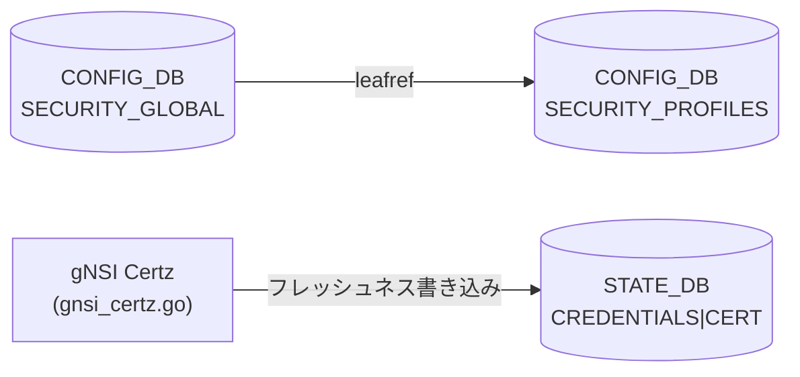

# SECURITY_PROFILES / PKI テーブル

!!! warning "裏取りステータス: Discrepancy-found"
    `SECURITY_PROFILES` テーブルを定義する `sonic-pki.yang` は `sonic-mgmt-common` の CVL テストデータスキーマとしてのみ存在し、`sonic-buildimage/src/sonic-yang-models/yang-models/` (コミュニティ master YANG) には **未マージ** (2026-05-14 時点)。実際の CONFIG_DB エントリを消費するハンドラ実装も確認できなかった。したがって本ページの内容は YANG スキーマ定義と gNSI Certz 実装の間の乖離を含む。

## 概要

`SECURITY_PROFILES` テーブルは gNSI Certz の **SSL プロファイル** (証明書バンドル) と証明書ファイル名を対応付けるための [CONFIG_DB](../../reference/glossary.md#term-config_db) テーブルとして設計されている[^1]。

gNSI Certz (`sonic-gnmi/gnmi_server/gnsi_certz.go`) はデフォルトプロファイル `"gnxi"` を内部で管理し、証明書フレッシュネスメタデータを **STATE_DB** の `CREDENTIALS|CERT|<profileID>` に書き込む[^2]。CONFIG_DB の `SECURITY_PROFILES` を直接参照するコードは community master では未確認。

`SECURITY_GLOBAL|global.security_profile` は `SECURITY_PROFILES` への leafref を持ち、CVL バリデーションで参照整合性を強制する設計[^1]。

<!-- cdb-mermaid -->
### データフロー (設計上)



!!! note "凡例"
    CONFIG_DB から SAI までの典型経路を `docs/reference/config-db-orch-map.md` から機械生成したミニ図。詳細・例外は本ページ本文と対応表を参照。
<!-- /cdb-mermaid -->

## key 構造

```text
SECURITY_PROFILES|<profile-name>
SECURITY_GLOBAL|global
```

- `SECURITY_PROFILES|<profile-name>` — SSL プロファイル名をキーとするエントリ
- `SECURITY_GLOBAL|global` — グローバルセキュリティプロファイル参照 (leafref)

## フィールド

### SECURITY_PROFILES|`<profile-name>`

| フィールド | 型 | デフォルト | 説明 |
|-----------|----|-----------|------|
| `certificate-name` | string | (なし、optional) | 証明書ファイル名 |

### SECURITY_GLOBAL|global

| フィールド | 型 | デフォルト | 説明 |
|-----------|----|-----------|------|
| `security_profile` | leafref → `SECURITY_PROFILES` | (なし) | アクティブなセキュリティプロファイル名 |

## 制約

- `SECURITY_GLOBAL|global.security_profile` が参照するプロファイルが存在する間は `SECURITY_PROFILES|<profile-name>` の削除が CVL バリデーションでブロックされる (`instance-in-use` エラー)[^1]
- `certificate-name` フィールドは YANG で `optional` のため省略可能だが、参照元ハンドラの実装は未確認

## 実装状況 (community master 2026-05-14)

| 項目 | 状態 |
|-----|------|
| `sonic-pki.yang` の sonic-buildimage YANG マージ | **未実装** — CVL testdata のみ |
| `SECURITY_PROFILES` を読む handler/daemon | **未確認** |
| gNSI Certz のプロファイル管理 | **実装済み** (内部 JSON ファイル、STATE_DB 経由) |
| gNSI Certz の CONFIG_DB `SECURITY_PROFILES` 参照 | **未実装** |

gNSI Certz 実装 (`gnsi_certz.go`) は CONFIG_DB を参照せず、独自の JSON メタデータファイル (`/keys/grpc-version.json`) とファイルシステムのシンボリックリンクでプロファイルを管理する[^2]。

## gNSI Certz が書き込む STATE_DB フィールド

CONFIG_DB への書き込みはないが、証明書バンドルのフレッシュネス情報が STATE_DB に記録される:

```text
CREDENTIALS|CERT|<profileID>
  certificate_version         = "V1"           (bootstrap 初期値)
  certificate_created_on      = <UnixNano 文字列>
  ca_trust_bundle_version     = "V1"           (bootstrap 初期値)
  ca_trust_bundle_created_on  = <UnixNano 文字列>
  certificate_revocation_list_bundle_version = "V1"
  authentication_policy_version = "V1"
```

デフォルトプロファイル名: `"gnxi"` (`gnsi_certz.go:30` — `defaultProfile` 定数)[^2]

<!-- defaults -->
## コード由来の暗黙デフォルト (Phase A)

> SECURITY_PROFILES YANG フィールドおよび gNSI Certz 内部デフォルトを整理する。

### `profile-name` (SECURITY_PROFILES key)

| 種別 | 値 | ソース |
|------|----|--------|
| gNSI Certz 内部デフォルト | `"gnxi"` | `gnsi_certz.go:30` — `defaultProfile` 定数 |
| YANG デフォルト | なし (key フィールドは必須) | `sonic-pki.yang:31` |

`"gnxi"` は起動時に `bootstrapDefaultProfile()` が生成するプロファイル名であり、CONFIG_DB の `SECURITY_PROFILES` キーとは直接連動しない[^2]。

---

### `certificate-name` (SECURITY_PROFILES)

| 種別 | 値 | ソース |
|------|----|--------|
| YANG デフォルト | なし (optional leaf) | `sonic-pki.yang:36-41` |
| コード由来デフォルト | 不明 (ハンドラ未実装) | — |

YANG で `default` 宣言なし。フィールドが DB に存在しない場合の runtime fallback はハンドラ未実装のため追跡不可。

---

### gNSI Certz 内部 — 証明書バンドルバージョン

| 種別 | 値 | ソース |
|------|----|--------|
| bootstrap 初期 version | `"V1"` | `gnsi_certz.go:186,193,200,207` — `bootstrapDefaultProfile()` |
| Rotate 後の version | クライアント指定値 (必須) | `gnsi_certz.go:392-394` — `version cannot be empty` バリデーション |

bootstrap 時に生成されるすべてのエンティティ (Cert / TrustBundle / CrlBundle / AuthPolicy) の version は `"V1"` 固定。Rotate RPC では `version` フィールドが空文字列の場合 `codes.InvalidArgument` エラーが返される[^2]。

---

### gNSI Certz 内部 — 証明書パスデフォルト

| エンティティ | bootstrap 時パス | ソース |
|-------------|----------------|--------|
| サーバ証明書 (`Cert`) | `Config.SrvCertFile` / シンボリックリンク `SrvCertLnk` から復元 | `gnsi_certz.go:187-191` |
| CA Trust Bundle | `Config.CaCertFile` / シンボリックリンク `CaCertLnk` から復元 | `gnsi_certz.go:194-197` |
| CRL Bundle | `Config.CertCRLConfig` ディレクトリ | `gnsi_certz.go:199-204` |
| Auth Policy | `Config.FedPolicyFile` | `gnsi_certz.go:207-211` |

各パスはコマンドライン引数 (`telemetry.go:196-207`) で設定される。シンボリックリンク (`/keys/*.lnk`) が存在しファイルが有効な場合はそちらが優先される (`restoreFromFile()` ロジック)[^2]。

<!-- evidence:
  sonic-mgmt-common/cvl/testdata/schema/sonic-pki.yang:28-44 — SECURITY_PROFILES YANG 定義
  sonic-mgmt-common/cvl/testdata/schema/sonic-security-global.yang:26-38 — SECURITY_GLOBAL leafref
  sonic-mgmt-common/cvl/cvl_test.go:2505-2535 — instance-in-use エラーテスト
  sonic-gnmi/gnmi_server/gnsi_certz.go:29-36 — 定数 (defaultProfile="gnxi", certTbl, credentialsTbl)
  sonic-gnmi/gnmi_server/gnsi_certz.go:178-222 — bootstrapDefaultProfile (Version="V1")
  sonic-gnmi/gnmi_server/gnsi_certz.go:385-416 — doUpload バリデーション (version必須)
  sonic-gnmi/gnmi_server/gnsi_certz.go:688-715 — writeEntityFreshness (STATE_DB 書き込み)
  sonic-gnmi/telemetry/telemetry.go:196-207 — CaCertLnk/SrvCertLnk/SrvKeyLnk CLI フラグデフォルト
-->
<!-- /defaults -->

## 関連 CONFIG_DB / YANG / CLI

- 関連 CONFIG_DB: [`GNMI`](gnmi.md) (`GNMI|certs` で証明書パスを設定), [`TELEMETRY`](telemetry.md)
- 関連 YANG: `sonic-pki` (sonic-mgmt-common CVL testdata), `sonic-gnmi` (GNMI_CLIENT_CERT)
- 関連 CLI: なし (gNSI Certz は RPC 経由で設定)

<!-- cdb-exceptions -->
## 例外条件・特殊挙動

- **コミュニティ master 未マージ**: `sonic-pki.yang` は CVL testdata スキーマとしてのみ存在。`sonic-buildimage` YANG には含まれないため、`sonic-cfggen` / `config reload` 等は本テーブルを認識しない
- **gNSI Certz は CONFIG_DB を参照しない**: プロファイル管理は `/keys/grpc-version.json` (CertzMetaFile) とファイルシステムシンボリックリンクで行われる。CONFIG_DB の `SECURITY_PROFILES` との連携は設計上の将来課題
- **同時 Rotate 禁止**: `certzMu.TryLock()` による排他制御。並行 `certz.Rotate` RPC は `codes.Aborted` で拒否される (`gnsi_certz.go:232-235`)
- **`"gnxi"` プロファイル削除不可**: デフォルトプロファイルを削除する RPC (`DeleteProfile`) は `codes.Unimplemented` を返す (`gnsi_certz.go:165-167`)
<!-- /cdb-exceptions -->

[^1]: `sonic-mgmt-common` `cvl/testdata/schema/sonic-pki.yang` + `sonic-security-global.yang` — YANG スキーマ定義と CVL leafref テスト
[^2]: `sonic-gnmi` `gnmi_server/gnsi_certz.go` — gNSI Certz 実装。defaultProfile, bootstrapDefaultProfile, writeEntityFreshness
