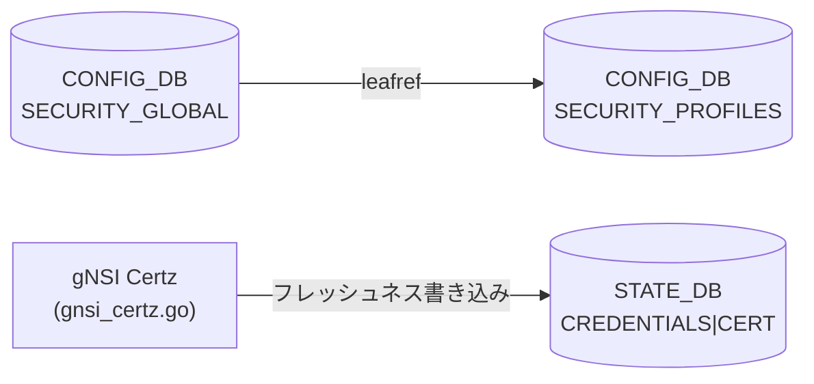

# SECURITY_PROFILES / PKI テーブル

!!! warning "裏取りステータス: Discrepancy-found"
    `SECURITY_PROFILES` テーブルを定義する `sonic-pki.yang` は `sonic-mgmt-common` の CVL テストデータスキーマとしてのみ存在し、`sonic-buildimage/src/sonic-yang-models/yang-models/` (コミュニティ master YANG) には **未マージ** (2026-05-14 時点)。実際の CONFIG_DB エントリを消費するハンドラ実装も確認できなかった。したがって本ページの内容は YANG スキーマ定義と gNSI Certz 実装の間の乖離を含む。

## 概要

`SECURITY_PROFILES` テーブルは gNSI Certz の **SSL プロファイル** (証明書バンドル) と証明書ファイル名を対応付けるための [CONFIG_DB](../../reference/glossary.md#term-config_db) テーブルとして設計されている[^1]。

gNSI Certz (`sonic-gnmi/gnmi_server/gnsi_certz.go`) はデフォルトプロファイル `"gnxi"` を内部で管理し、証明書フレッシュネスメタデータを **STATE_DB** の `CREDENTIALS|CERT|<profileID>` に書き込む[^2]。CONFIG_DB の `SECURITY_PROFILES` を直接参照するコードは community master では未確認。

`SECURITY_GLOBAL|global.security_profile` は `SECURITY_PROFILES` への leafref を持ち、CVL バリデーションで参照整合性を強制する設計[^1]。

<!-- cdb-mermaid -->
### データフロー (設計上)



!!! note "凡例"
    CONFIG_DB から SAI までの典型経路を `docs/reference/config-db-orch-map.md` から機械生成したミニ図。詳細・例外は本ページ本文と対応表を参照。
<!-- /cdb-mermaid -->

## key 構造

```text
SECURITY_PROFILES|<profile-name>
SECURITY_GLOBAL|global
```

- `SECURITY_PROFILES|<profile-name>` — SSL プロファイル名をキーとするエントリ
- `SECURITY_GLOBAL|global` — グローバルセキュリティプロファイル参照 (leafref)

## フィールド

### SECURITY_PROFILES|`<profile-name>`

| フィールド | 型 | デフォルト | 説明 |
|-----------|----|-----------|------|
| `certificate-name` | string | (なし、optional) | 証明書ファイル名 |

### SECURITY_GLOBAL|global

| フィールド | 型 | デフォルト | 説明 |
|-----------|----|-----------|------|
| `security_profile` | leafref → `SECURITY_PROFILES` | (なし) | アクティブなセキュリティプロファイル名 |

## 制約

- `SECURITY_GLOBAL|global.security_profile` が参照するプロファイルが存在する間は `SECURITY_PROFILES|<profile-name>` の削除が CVL バリデーションでブロックされる (`instance-in-use` エラー)[^1]
- `certificate-name` フィールドは YANG で `optional` のため省略可能だが、参照元ハンドラの実装は未確認

## 実装状況 (community master 2026-05-14)

| 項目 | 状態 |
|-----|------|
| `sonic-pki.yang` の sonic-buildimage YANG マージ | **未実装** — CVL testdata のみ |
| `SECURITY_PROFILES` を読む handler/daemon | **未確認** |
| gNSI Certz のプロファイル管理 | **実装済み** (内部 JSON ファイル、STATE_DB 経由) |
| gNSI Certz の CONFIG_DB `SECURITY_PROFILES` 参照 | **未実装** |

gNSI Certz 実装 (`gnsi_certz.go`) は CONFIG_DB を参照せず、独自の JSON メタデータファイル (`/keys/grpc-version.json`) とファイルシステムのシンボリックリンクでプロファイルを管理する[^2]。

## gNSI Certz が書き込む STATE_DB フィールド

CONFIG_DB への書き込みはないが、証明書バンドルのフレッシュネス情報が STATE_DB に記録される:

```text
CREDENTIALS|CERT|<profileID>
  certificate_version         = "V1"           (bootstrap 初期値)
  certificate_created_on      = <UnixNano 文字列>
  ca_trust_bundle_version     = "V1"           (bootstrap 初期値)
  ca_trust_bundle_created_on  = <UnixNano 文字列>
  certificate_revocation_list_bundle_version = "V1"
  authentication_policy_version = "V1"
```

デフォルトプロファイル名: `"gnxi"` (`gnsi_certz.go:30` — `defaultProfile` 定数)[^2]

<!-- defaults -->
## コード由来の暗黙デフォルト (Phase A)

> SECURITY_PROFILES YANG フィールドおよび gNSI Certz 内部デフォルトを整理する。

### `profile-name` (SECURITY_PROFILES key)

| 種別 | 値 | ソース |
|------|----|--------|
| gNSI Certz 内部デフォルト | `"gnxi"` | `gnsi_certz.go:30` — `defaultProfile` 定数 |
| YANG デフォルト | なし (key フィールドは必須) | `sonic-pki.yang:31` |

`"gnxi"` は起動時に `bootstrapDefaultProfile()` が生成するプロファイル名であり、CONFIG_DB の `SECURITY_PROFILES` キーとは直接連動しない[^2]。

---

### `certificate-name` (SECURITY_PROFILES)

| 種別 | 値 | ソース |
|------|----|--------|
| YANG デフォルト | なし (optional leaf) | `sonic-pki.yang:36-41` |
| コード由来デフォルト | 不明 (ハンドラ未実装) | — |

YANG で `default` 宣言なし。フィールドが DB に存在しない場合の runtime fallback はハンドラ未実装のため追跡不可。

---

### gNSI Certz 内部 — 証明書バンドルバージョン

| 種別 | 値 | ソース |
|------|----|--------|
| bootstrap 初期 version | `"V1"` | `gnsi_certz.go:186,193,200,207` — `bootstrapDefaultProfile()` |
| Rotate 後の version | クライアント指定値 (必須) | `gnsi_certz.go:392-394` — `version cannot be empty` バリデーション |

bootstrap 時に生成されるすべてのエンティティ (Cert / TrustBundle / CrlBundle / AuthPolicy) の version は `"V1"` 固定。Rotate RPC では `version` フィールドが空文字列の場合 `codes.InvalidArgument` エラーが返される[^2]。

---

### gNSI Certz 内部 — 証明書パスデフォルト

| エンティティ | bootstrap 時パス | ソース |
|-------------|----------------|--------|
| サーバ証明書 (`Cert`) | `Config.SrvCertFile` / シンボリックリンク `SrvCertLnk` から復元 | `gnsi_certz.go:187-191` |
| CA Trust Bundle | `Config.CaCertFile` / シンボリックリンク `CaCertLnk` から復元 | `gnsi_certz.go:194-197` |
| CRL Bundle | `Config.CertCRLConfig` ディレクトリ | `gnsi_certz.go:199-204` |
| Auth Policy | `Config.FedPolicyFile` | `gnsi_certz.go:207-211` |

各パスはコマンドライン引数 (`telemetry.go:196-207`) で設定される。シンボリックリンク (`/keys/*.lnk`) が存在しファイルが有効な場合はそちらが優先される (`restoreFromFile()` ロジック)[^2]。

<!-- evidence:
  sonic-mgmt-common/cvl/testdata/schema/sonic-pki.yang:28-44 — SECURITY_PROFILES YANG 定義
  sonic-mgmt-common/cvl/testdata/schema/sonic-security-global.yang:26-38 — SECURITY_GLOBAL leafref
  sonic-mgmt-common/cvl/cvl_test.go:2505-2535 — instance-in-use エラーテスト
  sonic-gnmi/gnmi_server/gnsi_certz.go:29-36 — 定数 (defaultProfile="gnxi", certTbl, credentialsTbl)
  sonic-gnmi/gnmi_server/gnsi_certz.go:178-222 — bootstrapDefaultProfile (Version="V1")
  sonic-gnmi/gnmi_server/gnsi_certz.go:385-416 — doUpload バリデーション (version必須)
  sonic-gnmi/gnmi_server/gnsi_certz.go:688-715 — writeEntityFreshness (STATE_DB 書き込み)
  sonic-gnmi/telemetry/telemetry.go:196-207 — CaCertLnk/SrvCertLnk/SrvKeyLnk CLI フラグデフォルト
-->
<!-- /defaults -->

<!-- ordering -->
## 書込み順依存 (Phase B)

`SECURITY_PROFILES` / `SECURITY_GLOBAL` はハンドラが community master で未実装のため、DB レベルの順序制約は CVL バリデーション層のみが強制する。gNSI Certz は CONFIG_DB を参照しないが、STATE_DB への書込みには起動内部の固定順序がある。

### 検出された順序依存

| # | 依存関係 | 方向 | 緩和策 |
|---|----------|------|--------|
| 1 | `SECURITY_PROFILES\|<profile>` 作成 → `SECURITY_GLOBAL\|global.security_profile` 設定 | **強制先行** (CVL leafref) | プロファイルが存在しない状態で `SECURITY_GLOBAL` の `security_profile` を書くと CVL が `invalid-value` エラーを返す |
| 2 | `SECURITY_GLOBAL\|global.security_profile` 削除 → `SECURITY_PROFILES\|<profile>` 削除 | **強制先行** (CVL instance-in-use) | 参照中のプロファイルを先に削除しようとすると CVL が `instance-in-use` エラーを返す (`cvl_test.go:2506-2537`) |
| 3 | gNSI Certz 起動: `loadCertzMetadata` / `bootstrapDefaultProfile` → `writeEntityFreshness` × 4 | 起動内部シーケンス (固定) | Cert → TrustBundle → CrlBundle → AuthPolicy の順で STATE_DB に書込まれる。途中でプロセスが落ちると一部エンティティのフレッシュネスのみが記録された中間状態が残る |
| 4 | gNSI Certz 起動: 全プロファイルの freshness 書込み → `saveCertzMetadata` | 起動内部シーケンス (固定) | `saveCertzMetadata` は全 `writeEntityFreshness` 完了後に呼ばれる (`gnsi_certz.go:141`) |

### 主要な制約詳細

**CVL leafref 制約 (依存 #1, #2)**: `sonic-security-global.yang` の `security_profile` leaf は `sonic-pki` YANG の `/SECURITY_PROFILES/SECURITY_PROFILES_LIST/profile-name` への leafref として定義される。CVL は SET 時に参照先の存在を検証し、DEL 時に参照元が残っていないかを `instance-in-use` タグで検証する。したがって CONFIG_DB 操作の安全な順序は「プロファイル作成 → グローバル参照設定 → グローバル参照削除 → プロファイル削除」でなければならない (`sonic-security-global.yang:29-35`, `cvl_test.go:2506-2537`)[^1]。

**gNSI Certz STATE_DB 書込み順序 (依存 #3)**: `NewGNSICertzServer()` は起動時に `s.profiles` を構築した後、各プロファイルの `ActiveEntities` を Cert → TrustBundle → CrlBundle → AuthPolicy の順で `writeEntityFreshness` で STATE_DB (`CREDENTIALS|CERT|<profileID>`) に書込む。これは `gnsi_certz.go:134-138` の固定 for-loop 内で行われ、並列化はされない[^2]。

**CONFIG_DB ハンドラ未実装による非影響 (注記)**: community master では `SECURITY_PROFILES` を消費するハンドラが存在しないため、CONFIG_DB への書込み順序が runtime の動作に影響を与える経路は現時点で確認されていない。上記 #1/#2 の制約は CVL バリデーション層のみで有効であり、orchagent / translib 等との協調順序は将来のハンドラ実装時に改めて評価が必要である。

<!-- evidence:
  sonic-mgmt-common/cvl/testdata/schema/sonic-security-global.yang:29-35 — security_profile leafref 定義
  sonic-mgmt-common/cvl/cvl_test.go:2506-2537 — instance-in-use テスト (SECURITY_PROFILES 削除ブロック)
  sonic-gnmi/gnmi_server/gnsi_certz.go:126-141 — NewGNSICertzServer: loadCertzMetadata → bootstrapDefaultProfile → writeEntityFreshness × 4 → saveCertzMetadata
  sonic-gnmi/gnmi_server/gnsi_certz.go:134-138 — Cert/TrustBundle/CrlBundle/AuthPolicy の順序固定ループ
  sonic-gnmi/gnmi_server/gnsi_certz.go:688-715 — writeEntityFreshness (STATE_DB CREDENTIALS|CERT|<profileID> 書込み)
-->
<!-- /ordering -->

<!-- cross-refs -->
## 他テーブル・コンポーネントとの参照関係 (Phase C)

詳細な調査メモは `meta/_intermediate/cdb-flow/pki-trusted-certs-cross-refs.md` を参照。

### SECURITY_PROFILES が参照する / される先

| 参照元 | 参照先 | 参照種別 | ソース |
|--------|--------|----------|--------|
| `SECURITY_GLOBAL\|global.security_profile` | `SECURITY_PROFILES\|<profile-name>` | YANG leafref (CVL バリデーション) | `sonic-security-global.yang:29-35` |

### gNSI Certz が書き込む STATE_DB テーブル

| テーブル | キー形式 | 書込みタイミング | ソース |
|---------|---------|----------------|--------|
| `CREDENTIALS\|CERT\|<profileID>` (STATE_DB) | `CREDENTIALS\|CERT\|<profileID>` | gNSI Certz 起動時・Rotate RPC 処理時 | `gnsi_certz.go:1036-1059` |

`writeCredentialsMetadataToDB()` は `common_utils.GetRedisDBClient()` 経由で STATE_DB (DB 番号 6) に接続し、`certTbl="CERT"` / `credentialsTbl="CREDENTIALS"` 定数から `GetKey()` でパスを構築する (`gnsi_certz.go:46-48`, `notification_producer.go:16`)。

### GNMI_CLIENT_CERT (CONFIG_DB) — 独立した関連テーブル

`GNMI_CLIENT_CERT` テーブルはクライアント証明書の CN ↔ gNMI ロールマッピングを格納する独立テーブルであり、`SECURITY_PROFILES` との直接的な依存関係はない。`clientCertAuth.go:259-263` が `ConfigDBConnector.Get_entry("GNMI_CLIENT_CERT", certCommonName)` を呼び出してロール解決を行う。

### community master での非連携

`SECURITY_PROFILES` を直接参照する production ハンドラ (orchagent / translib / certmgr) は community master では確認されていない。gNSI Certz のプロファイル管理は `/keys/grpc-version.json` (CertzMetaFile) とファイルシステムシンボリックリンクで独立して行われる。

<!-- evidence:
  sonic-mgmt-common/cvl/testdata/schema/sonic-security-global.yang:29-35 — security_profile leafref → SECURITY_PROFILES
  sonic-gnmi/gnmi_server/gnsi_certz.go:46-48 — certTbl="CERT", credentialsTbl="CREDENTIALS" 定数
  sonic-gnmi/gnmi_server/gnsi_certz.go:1036-1059 — writeCredentialsMetadataToDB (STATE_DB 書込み)
  sonic-gnmi/common_utils/notification_producer.go:16 — dbName="STATE_DB"
  sonic-gnmi/gnmi_server/clientCertAuth.go:259-263 — ConfigDB GNMI_CLIENT_CERT 参照 (CN→ロール解決)
-->
<!-- /cross-refs -->

<!-- failure -->
## 失敗挙動 (Phase D)

`SECURITY_PROFILES` / `SECURITY_GLOBAL` の失敗経路は **CVL バリデーション層** と **gNSI Certz RPC 層** の 2 つに分かれる。community master ではこれらのテーブルを消費する orchagent/translib ハンドラが未実装のため、CONFIG_DB 書き込み時の失敗は CVL のみが制御する。

### CVL バリデーション失敗

#### SET 時

| 操作 | 失敗条件 | CVL エラーコード | ErrAppTag |
|------|---------|-----------------|-----------|
| `SECURITY_GLOBAL\|global security_profile=X` 書き込み | `SECURITY_PROFILES\|X` が存在しない | `CVL_SEMANTIC_ERROR` | `invalid-value` (leafref 違反) |

#### DEL 時

| 操作 | 失敗条件 | CVL エラーコード | ErrAppTag |
|------|---------|-----------------|-----------|
| `SECURITY_PROFILES\|X` 削除 | `SECURITY_GLOBAL\|global.security_profile=X` が参照中 | `CVL_SEMANTIC_ERROR` | `instance-in-use` |

CVL エラーは呼び出し元 (`sonic-configd` / `translib`) に返却され、CONFIG_DB への書き込みは行われない。`cvl_test.go:2506-2537` の `TestValidateEditConfig_Delete_Dep_Leafref_singleton` が `instance-in-use` エラーを確認している。

### gNSI Certz Rotate RPC 失敗

`certz.Rotate` は双方向 streaming RPC であり、失敗時は `revertProfile()` を呼んで変更をロールバックする。

| 失敗ケース | gRPC ステータスコード | `revertProfile` 呼出し |
|-----------|---------------------|----------------------|
| 並行 Rotate 試行 (`certzMu.TryLock()` 失敗) | `codes.Aborted` — "concurrent certz.Rotate RPCs are not allowed" | 不要（未着手） |
| ストリーム途中で EOF (Finalize なし) | `codes.Aborted` — "No Finalize message" | あり |
| ストリーム recv エラー | `codes.Aborted` — "Stream recv err: ..." | あり |
| `processRotateRequest` 失敗 | `codes.Aborted` — "Process err: ..." | あり |
| `finalizeProfile` 失敗 | `codes.Unknown` — "Failed to remove the old credentials: ..." | — |

`revertProfile` はロールバック処理を行うが、**gNSI Certz プロセスがクラッシュした場合**（`writeEntityFreshness` ループの途中）は、一部エンティティのフレッシュネスのみが STATE_DB に書き込まれた中間状態が残りうる。CONFIG_DB は無影響。

### Upload 内バリデーション失敗 (doUpload)

| 失敗ケース | gRPC ステータスコード |
|-----------|---------------------|
| `entities` が空 | `codes.InvalidArgument` — "entity cannot be empty" |
| `created_on == 0` | `codes.InvalidArgument` — "created_on cannot be empty" |
| `version` が空文字 | `codes.InvalidArgument` — "version cannot be empty" |
| CRL エンティティ & `CertCRLConfig` 未設定 | `codes.Aborted` — "CRL not configured" |
| エンティティ型が不明 | `codes.Internal` — "failed to find entity type: ..." |
| `saveEntities` 失敗 (ファイル書き込みエラー等) | `codes.Aborted` — "Entity save err: ..." |
| `activateEntity` 失敗 | `codes.Aborted` — "Entity activate err: ..." |

### 未実装 RPC (Unimplemented)

| RPC | gRPC ステータスコード |
|-----|---------------------|
| `AddProfile` | `codes.Unimplemented` — "method AddProfile not implemented" |
| `DeleteProfile` | `codes.Unimplemented` — "method DeleteProfile not implemented" |
| `GetProfileList` | `codes.Unimplemented` — "method GetProfileList not implemented" |

<!-- evidence:
  sonic-mgmt-common/cvl/cvl_test.go:2506-2537 — TestValidateEditConfig_Delete_Dep_Leafref_singleton (instance-in-use)
  sonic-mgmt-common/cvl/testdata/schema/sonic-security-global.yang:29-35 — security_profile leafref (invalid-value on missing ref)
  sonic-gnmi/gnmi_server/gnsi_certz.go:232-235 — certzMu.TryLock() → codes.Aborted (concurrent Rotate)
  sonic-gnmi/gnmi_server/gnsi_certz.go:247-254 — EOF/recv-error → revertProfile → codes.Aborted
  sonic-gnmi/gnmi_server/gnsi_certz.go:260-262 — finalizeProfile 失敗 → codes.Unknown
  sonic-gnmi/gnmi_server/gnsi_certz.go:274-276 — processRotateRequest 失敗 → revertProfile → codes.Aborted
  sonic-gnmi/gnmi_server/gnsi_certz.go:385-427 — doUpload バリデーション (entity/created_on/version/CRL/save/activate)
  sonic-gnmi/gnmi_server/gnsi_certz.go:163-169 — AddProfile/DeleteProfile/GetProfileList → codes.Unimplemented
  sonic-gnmi/gnmi_server/gnsi_certz.go:134-138 — writeEntityFreshness 途中クラッシュで STATE_DB 中間状態残存リスク
-->
<!-- /failure -->

## 関連 CONFIG_DB / YANG / CLI

- 関連 CONFIG_DB: [`GNMI`](gnmi.md) (`GNMI|certs` で証明書パスを設定), [`TELEMETRY`](telemetry.md)
- 関連 YANG: `sonic-pki` (sonic-mgmt-common CVL testdata), `sonic-gnmi` (GNMI_CLIENT_CERT)
- 関連 CLI: なし (gNSI Certz は RPC 経由で設定)

<!-- cdb-exceptions -->
## 例外条件・特殊挙動

- **コミュニティ master 未マージ**: `sonic-pki.yang` は CVL testdata スキーマとしてのみ存在。`sonic-buildimage` YANG には含まれないため、`sonic-cfggen` / `config reload` 等は本テーブルを認識しない
- **gNSI Certz は CONFIG_DB を参照しない**: プロファイル管理は `/keys/grpc-version.json` (CertzMetaFile) とファイルシステムシンボリックリンクで行われる。CONFIG_DB の `SECURITY_PROFILES` との連携は設計上の将来課題
- **同時 Rotate 禁止**: `certzMu.TryLock()` による排他制御。並行 `certz.Rotate` RPC は `codes.Aborted` で拒否される (`gnsi_certz.go:232-235`)
- **`"gnxi"` プロファイル削除不可**: デフォルトプロファイルを削除する RPC (`DeleteProfile`) は `codes.Unimplemented` を返す (`gnsi_certz.go:165-167`)
<!-- /cdb-exceptions -->

[^1]: `sonic-mgmt-common` `cvl/testdata/schema/sonic-pki.yang` + `sonic-security-global.yang` — YANG スキーマ定義と CVL leafref テスト
[^2]: `sonic-gnmi` `gnmi_server/gnsi_certz.go` — gNSI Certz 実装。defaultProfile, bootstrapDefaultProfile, writeEntityFreshness
