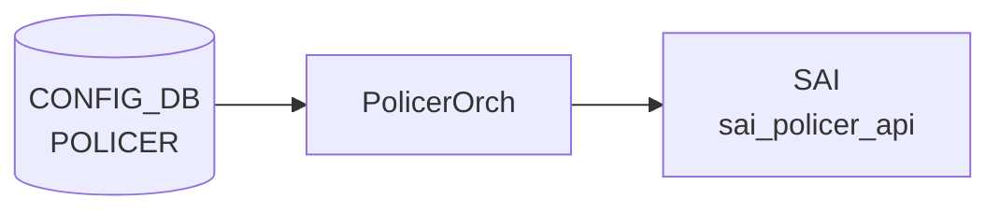

# POLICER テーブル

!!! warning "YANG 未定義"
    `POLICER` 単独の YANG モジュールは `sonic-yang-models` に存在しない。`COPP_GROUP` (sonic-copp.yang)、`ACL_RULE` (sonic-acl.yang)、`PORT_STORM_CONTROL` (sonic-storm-control.yang)、`SCHEDULER` (sonic-scheduler.yang)、`MIRROR_SESSION` (sonic-mirror-session.yang) 等から「policer 名」あるいは個別フィールドが参照される形でのみ規定される。本ページは `policerorch.cpp` の実装を一次情報とする。

## 概要

[SAI](../../reference/glossary.md#term-sai) policer (sai_policer) を [CONFIG_DB](../../reference/glossary.md#term-config_db) から作成・更新するためのテーブル。`policerorch` ([orchagent](../../reference/glossary.md#term-orchagent)) が [CONFIG_DB](../../reference/glossary.md#term-config_db) の `POLICER` を読み出し、CIR/PIR の更新は SET、その他属性は create-only として扱う[^1]。実利用は [ACL](../../reference/glossary.md#term-acl) ルール、COPP、ストーム制御、ミラーセッション、ポートスケジューラ等の指し先として参照される。

<!-- cdb-mermaid -->
### データフロー (自動生成)



!!! note "凡例"
    CONFIG_DB から SAI までの典型経路を `docs/reference/config-db-orch-map.md` から機械生成したミニ図。詳細・例外は本ページ本文と対応表を参照。
<!-- /cdb-mermaid -->

## key 構造

```text
POLICER|<name>
```

- `<name>`: 任意の文字列（COPP / [ACL](../../reference/glossary.md#term-acl) の policer 名と一致させる）

## フィールド

`policerorch.cpp` の field 定数および参照される [SAI](../../reference/glossary.md#term-sai) 属性は以下:

| フィールド | 値 | [SAI](../../reference/glossary.md#term-sai) 属性 / 説明 |
|-----------|---|------|
| `METER_TYPE` | `PACKETS` / `BYTES` | `SAI_POLICER_ATTR_METER_TYPE`。create に必須 |
| `MODE` | `SR_TCM` / `TR_TCM` / `STORM_CONTROL` | `SAI_POLICER_ATTR_MODE`。create に必須 |
| `COLOR_SOURCE` | `AWARE` / `BLIND` | `SAI_POLICER_ATTR_COLOR_SOURCE` |
| `CIR` | uint64 (bytes/sec or packets/sec) | `SAI_POLICER_ATTR_CIR`。SET 可 |
| `CBS` | uint64 | `SAI_POLICER_ATTR_CBS`。SET 可 |
| `PIR` | uint64 | `SAI_POLICER_ATTR_PIR`。SET 可 |
| `PBS` | uint64 | `SAI_POLICER_ATTR_PBS`。SET 可 |
| `GREEN_PACKET_ACTION` | `FORWARD`/`DROP`/... | `SAI_POLICER_ATTR_GREEN_PACKET_ACTION`。create-only |
| `YELLOW_PACKET_ACTION` | 同上 | `SAI_POLICER_ATTR_YELLOW_PACKET_ACTION`。create-only |
| `RED_PACKET_ACTION` | 同上 | `SAI_POLICER_ATTR_RED_PACKET_ACTION`。create-only |

## 制約

- `METER_TYPE` と `MODE` の両方が無いエントリは create でエラー (`policerorch.cpp` の `if (!meter_type || !mode)` 判定)
- `*_PACKET_ACTION`、`METER_TYPE`、`MODE`、`COLOR_SOURCE` は **create-only**。生成済み policer に対する SET は反映されない（再作成が必要）
- `CIR` 単独でも create 可能（storm-control が暗黙の `STORM_CONTROL` モード, BYTES として作成する経路を持つ）

## 購読者

- `policerorch` ([orchagent](../../reference/glossary.md#term-orchagent)): SAI policer オブジェクトを作成・更新

## 利用先（参照テーブル例）

- `ACL_RULE`: `POLICER` を action として指定
- `COPP_GROUP`: control plane 制限に利用
- `PORT_STORM_CONTROL`: ストーム制御
- `MIRROR_SESSION`: span/erspan の policer

## 関連 CONFIG_DB / YANG / CLI

- 関連 [CONFIG_DB](../../reference/glossary.md#term-config_db): `ACL_RULE`、`COPP_GROUP`、`PORT_STORM_CONTROL`、`MIRROR_SESSION`
- 関連 [YANG](../../reference/glossary.md#term-yang): 直接の [YANG](../../reference/glossary.md#term-yang) モジュールは無し（参照側 [YANG](../../reference/glossary.md#term-yang) が個別フィールドを持つ）
- 関連 CLI: なし（`config_db.json` で投入）

<!-- constants -->
## ハードコード定数 (Phase E)

> 根拠: `policerorch.cpp` 全行精読。evidence: `meta/_intermediate/cdb-flow/policer-constants.md`

### enum マップ — CONFIG_DB 値 → SAI 属性

#### MODE (`policer_mode_map`, `policerorch.cpp:39-43`)

| CONFIG_DB 値 | SAI 属性値 |
|-------------|-----------|
| `SR_TCM` | `SAI_POLICER_MODE_SR_TCM` |
| `TR_TCM` | `SAI_POLICER_MODE_TR_TCM` |
| `STORM_CONTROL` | `SAI_POLICER_MODE_STORM_CONTROL` |

#### COLOR_SOURCE (`policer_color_source_map`, `policerorch.cpp:45-48`)

| CONFIG_DB 値 | SAI 属性値 |
|-------------|-----------|
| `AWARE` | `SAI_POLICER_COLOR_SOURCE_AWARE` |
| `BLIND` | `SAI_POLICER_COLOR_SOURCE_BLIND` |

#### \*_PACKET_ACTION (`packet_action_map`, `policerorch.cpp:50-59`)

| CONFIG_DB 値 | SAI 属性値 |
|-------------|-----------|
| `FORWARD` | `SAI_PACKET_ACTION_FORWARD` |
| `DROP` | `SAI_PACKET_ACTION_DROP` |
| `COPY` | `SAI_PACKET_ACTION_COPY` |
| `COPY_CANCEL` | `SAI_PACKET_ACTION_COPY_CANCEL` |
| `TRAP` | `SAI_PACKET_ACTION_TRAP` |
| `LOG` | `SAI_PACKET_ACTION_LOG` |
| `DENY` | `SAI_PACKET_ACTION_DENY` |
| `TRANSIT` | `SAI_PACKET_ACTION_TRANSIT` |

ドキュメント外の値 (`COPY` / `COPY_CANCEL` / `TRAP` / `LOG` / `DENY` / `TRANSIT`) も実装では受理されるが、SAI 対応状況は ASIC 依存。

### storm-control ハードコード固定値 (`policerorch.cpp:156-169`)

PORT_STORM_CONTROL テーブル経由で policer を作成する際、以下の SAI 属性はコードでハードコードされ CONFIG_DB フィールドを無視する:

| SAI 属性 | ハードコード値 | コード根拠 |
|---------|-------------|----------|
| `SAI_POLICER_ATTR_METER_TYPE` | `SAI_METER_TYPE_BYTES` | `policerorch.cpp:157-159` — `/*Meter type hardcoded to BYTES*/` |
| `SAI_POLICER_ATTR_MODE` | `SAI_POLICER_MODE_STORM_CONTROL` | `policerorch.cpp:161-164` — `/*Policer mode hardcoded to STORM_CONTROL*/` |
| `SAI_POLICER_ATTR_RED_PACKET_ACTION` | `SAI_PACKET_ACTION_DROP` | `policerorch.cpp:166-169` — `/*Red Packet Action hardcoded to DROP*/` |

### KBPS → CIR 変換式 (`policerorch.cpp:181-184`)

```
SAI CIR (bytes/sec) = stoul(KBPS) × 1000 / 8
```

整数演算のため端数切り捨てが発生する。例: `KBPS=1` → CIR = 125 bytes/sec。

### storm_type → SAI ポート属性マッピング (`policerorch.cpp:204-219`)

| PORT_STORM_CONTROL `storm_type` | SAI ポート属性 |
|--------------------------------|--------------|
| `broadcast` | `SAI_PORT_ATTR_BROADCAST_STORM_CONTROL_POLICER_ID` |
| `unknown-unicast` | `SAI_PORT_ATTR_FLOOD_STORM_CONTROL_POLICER_ID` |
| `unknown-multicast` | `SAI_PORT_ATTR_MULTICAST_STORM_CONTROL_POLICER_ID` |
| その他 | `SWSS_LOG_ERROR("Unknown storm_type %s")` + `task_failed` |

### 内部 policer 命名規則 (`policerorch.cpp:146`)

storm-control 由来の SAI policer は `POLICER` テーブルとは独立した内部名で管理される:

```
"_" + interface_name + "_" + storm_type
# 例: "_Ethernet0_broadcast"
```

`m_syncdPolicers` マップのキーとして使用されるが、CONFIG_DB には公開されない。

<!-- /constants -->

<!-- defaults -->
## コード由来の暗黙デフォルト (Phase A)

> 根拠: `policerorch.cpp` 全行精読。evidence: `meta/_intermediate/cdb-flow/policer-defaults.md`

| フィールド | 省略時の実挙動 | 分類 |
|-----------|--------------|------|
| `METER_TYPE` | ERROR ログ出力後に SAI `create_policer()` が続行 → SAI エラー。エントリは `m_toSync` から削除されリトライなし | 必須欠落バグ (silent-proceed) |
| `MODE` | 同上 | 必須欠落バグ (silent-proceed) |
| `COLOR_SOURCE` | SAI プラットフォームデフォルト (SAI 仕様では `BLIND`、ASIC 依存) | platform-dependent |
| `CIR` / `CBS` / `PIR` / `PBS` | SAI へ渡されない → SAI デフォルト 0 (unlimited または platform-defined) | platform-dependent |
| `GREEN_PACKET_ACTION` | SAI デフォルト `FORWARD` (ASIC 依存) | platform-dependent |
| `YELLOW_PACKET_ACTION` | SAI デフォルト `FORWARD` (ASIC 依存) | platform-dependent |
| `RED_PACKET_ACTION` | SAI デフォルト `DROP` (ASIC 依存) | platform-dependent |

### storm-control 経由のハードコード (PORT_STORM_CONTROL テーブル)

CONFIG_DB の `METER_TYPE`/`MODE`/`RED_PACKET_ACTION` を無視し、以下をコードで固定する:

| 属性 | 固定値 | コード根拠 |
|-----|--------|-----------|
| `METER_TYPE` | `BYTES` | `policerorch.cpp:157-159` |
| `MODE` | `STORM_CONTROL` | `policerorch.cpp:162-164` |
| `RED_PACKET_ACTION` | `DROP` | `policerorch.cpp:167-169` |
| `KBPS` (入力) → `CIR` (SAI) | `kbps × 1000 / 8` bytes/sec | `policerorch.cpp:181-184` |

storm-control update パスでは **`CIR` のみ** SAI に渡す。`CBS` は update されない (`policerorch.cpp:252-253`)。

### create-only フィールド (UPDATE 時 silently ignored)

既存 policer への SET では `CIR`/`CBS`/`PIR`/`PBS` のみ SAI に渡す。`METER_TYPE`/`MODE`/`COLOR_SOURCE`/`*_PACKET_ACTION` は **policerorch がフィルタして破棄** する (`policerorch.cpp:527-533`)。

### 実装で受理される packet_action 値 (ドキュメント未掲載分)

`packet_action_map` (`policerorch.cpp:50-59`) には `FORWARD`/`DROP` に加え `COPY`/`COPY_CANCEL`/`TRAP`/`LOG`/`DENY`/`TRANSIT` も定義されている。SAI 側の対応状況は ASIC 依存。

<!-- /defaults -->

<!-- value-behavior -->
## 値依存挙動マトリクス

### POLICER.METER_TYPE

| 値 | SAI 属性 | 挙動 |
|----|---------|------|
| `PACKETS` | SAI_METER_TYPE_PACKETS | パケット数でレート計算 |
| `BYTES` | SAI_METER_TYPE_BYTES | バイト数でレート計算 |
| 未設定 / 不正 | - | `if (!meter_type)` 判定で create 失敗 |

### POLICER.MODE

| 値 | SAI 属性 | 挙動 |
|----|---------|------|
| `SR_TCM` | SAI_POLICER_MODE_SR_TCM | Single Rate Three Color Marker (CIR/CBS/PBS) |
| `TR_TCM` | SAI_POLICER_MODE_TR_TCM | Two Rate Three Color Marker (CIR/CBS/PIR/PBS) |
| `STORM_CONTROL` | SAI_POLICER_MODE_STORM_CONTROL | ストーム制御モード (CIR/CBS のみ有効) |
| 未設定 / 不正 | - | `if (!mode)` 判定で create 失敗 |
| (storm-control 経由) | STORM_CONTROL 固定 | METER_TYPE も BYTES に自動設定、RED_PACKET_ACTION を DROP に固定 |

### POLICER.COLOR_SOURCE

| 値 | SAI 属性 | 挙動 |
|----|---------|------|
| `AWARE` | SAI_POLICER_COLOR_SOURCE_AWARE | 入力パケットの color を引き継いでポリシング |
| `BLIND` | SAI_POLICER_COLOR_SOURCE_BLIND | 入力 color を無視して green 扱いで処理 |

### POLICER.*_PACKET_ACTION

| 値 | SAI 属性 | 挙動 |
|----|---------|------|
| `FORWARD` | SAI_PACKET_ACTION_FORWARD | そのトラフィックカラーのパケットを通過 |
| `DROP` | SAI_PACKET_ACTION_DROP | そのトラフィックカラーのパケットを破棄 |
| (不明な値) | - | `Unknown policer attribute %s` SWSS_LOG_ERROR |

*_PACKET_ACTION / METER_TYPE / MODE / COLOR_SOURCE は create-only。作成後の変更は反映されない（再作成が必要）。CIR / CBS / PIR / PBS は SET による更新可能。*

<!-- /value-behavior -->

<!-- cdb-exceptions -->
## 例外条件・特殊挙動

<!-- evidence: meta/_intermediate/cdb-flow/policer.md -->

### consumer (policerorch) 例外動作
- 重複 SET: 既存 policer は update パスへ分岐 (`policerExists()` チェック)。
- DEL で存在しない policer: `Policer %s does not exist` → SWSS_LOG_WARN + `return false`。
- 不明な attribute: `Unknown policer attribute %s specified` → SWSS_LOG_ERROR。
- SAI policer create 失敗: `Failed to create policer %s, rv:%d` → SWSS_LOG_ERROR。
- SAI attribute update 失敗: `Failed to update policer %s attribute, rv:%d` → SWSS_LOG_ERROR。
- DEL 時 SAI remove 失敗: `Failed to remove policer %s, rv:%d` → SWSS_LOG_ERROR。
- 不正インターフェース (storm-control 経由): `Unsupported / Invalid interface %s` → SWSS_LOG_ERROR。
- ポート未発見 (storm-control 経由): `Failed to apply storm-control %s to port %s. Port not found` → SWSS_LOG_ERROR。
- 不明な storm_type: `Unknown storm_type %s` → SWSS_LOG_ERROR。

<!-- /cdb-exceptions -->

<!-- ref-triangle:start -->

## 関連リファレンス

- (関連リンクなし)

<!-- ref-triangle:end -->

## 引用元

[^1]: policerorch 実装: `policerorch.cpp`. <https://github.com/sonic-net/sonic-swss/blob/4305596156d70e9797e8a881b3d19b46de0bce0d/orchagent/policerorch.cpp>

<!-- topics-back-ref -->
## 関連 Topics

- [Topics: ACL / CoPP / Mirror / Packet Action](../../topics/07-acl-copp-mirror/index.md)

<!-- /topics-back-ref -->

<!-- ops-hint -->
## 運用ヒント

### 典型値

- key 形式: `POLICER|<name>`。
- `meter_type`: `packets` / `bytes`。
- `mode`: `sr_tcm` / `tr_tcm` / `storm`。
- `cir` / `cbs` / `pir` / `pbs`。

### よくある誤設定

- `mode: storm` で `pir` を指定すると SAI がエラーを返す版がある。

### 確認コマンド

```bash
sonic-db-cli CONFIG_DB keys 'POLICER|*'
show policer
```
<!-- /ops-hint -->

<!-- runtime-trace -->
## CDB → 実コンテナ動作トレース

### 段階 1: Consumer 登録

- **[orchagent](../../reference/glossary.md#term-orchagent) / PolicerOrch** (`sonic-swss/orchagent/policerorch.cpp`): `POLICER` テーブルを `SubscriberStateTable` で購読。

### 段階 2: CFG → APPL 翻訳

- PolicerOrch がエントリを解析し SAI policer オブジェクトを作成。他の orch (MirrorOrch, AclOrch) から leafref 参照される。
- APP_DB への書き込みなし。

### 段階 3: APPL → SAI

- PolicerOrch が `sai_policer_api->create_policer()` を呼び出して SAI POLICER を作成。
- `meter_type`, `mode`, `cir`, `cbs`, `pir`, `pbs`, `action` を SAI 属性にマッピング。

### 段階 4: タイミング + 副作用

- POLICER オブジェクト作成後、MIRROR_SESSION や [ACL](../../reference/glossary.md#term-acl) から参照されることで有効化。
- 副作用: policer 削除時に MirrorOrch/AclOrch が参照している場合、削除は失敗 (`policer is still referenced`)。

<!-- /runtime-trace -->
<!-- entry-points -->
## 書き込み入り口 (Direction A)

POLICER テーブルへの書き込みが発生するコード経路を網羅的に調査した結果。

### CLI

  - 専用 CLI なし — `sonic-cfggen` または `acl_loader` 経由

### minigraph / sonic-cfggen

minigraph.py に POLICER 生成なし

### REST / gNMI

REST/[gNMI](../../reference/glossary.md#term-gnmi) 書き込み経路なし

### db_migrator

db_migrator.py での POLICER マイグレーションなし

### ビルド時デフォルト (build-time default)

なし

### ハードコードデフォルト / ランタイム注入

なし

### 死活・デッドコード

`acl_loader/main.py` が POLICER テーブルを参照する (読み取り専用); 直接 set_entry なし — `sonic load_minigraph` での JSON 投入が主経路
<!-- /entry-points -->

<!-- glossary-links-injected: 849eee828f8c -->

<!-- derivation -->
## 派生・条件付き登録 (Phase 6/7)

### Phase 6: 自動派生

minigraph.py および init_cfg.json.j2 からの `POLICER` 自動派生はなし。CLI (`config policer`) による手動設定のみ。`MIRROR_SESSION` の `policer` フィールドから参照されるが、`POLICER` エントリ自体は手動作成が必要。

### Phase 7: 条件付き登録

| 条件 | 影響 | ソース |
|---|---|---|
| `PolicerOrch` は常時登録 (platform 非依存) | `CFG_POLICER_TABLE_NAME` + `CFG_PORT_STORM_CONTROL_TABLE_NAME` を同一インスタンスで購読 | `orchdaemon.cpp:396-402` |
| `gPortsOrch->allPortsReady()` が false | `doTask()` を早期リターン | `sonic-swss/orchagent/policerorch.cpp:379-382` |

### グレップカバレッジ

| 項目 | hit 数 | 証跡 |
|---|---|---|
| PolicerOrch 登録 | 1 | `orchdaemon.cpp:396-402` |
| allPortsReady guard | 1 | `policerorch.cpp:379-382` |

<!-- /derivation -->

<!-- handler-branching -->
### Phase 8: Handler メソッド内分岐

`PolicerOrch::doTask()` の分岐:

| Handler | メソッド | 分岐条件 | 効果 | evidence |
|---|---|---|---|---|
| `PolicerOrch` | `doTask()` | `table_name == CFG_PORT_STORM_CONTROL_TABLE_NAME` | `handlePortStormControlTable()` にディスパッチ (POLICER とは別ハンドラ) | `sonic-swss/orchagent/policerorch.cpp:394-407` |
| `PolicerOrch` | `doTask()` SET | `m_syncdPolicers.find(key) != end` | `update = true` → 既存ポリサーの属性更新処理へ | `policerorch.cpp:411` |
| `PolicerOrch` | `doTask()` SET | `!update && (!meter_type || !mode)` | ERROR ログ + 処理継続 (meter_type と mode は必須) | `policerorch.cpp:491-495` |
| `PolicerOrch` | `doTask()` SET | SAI `create_policer()` ≠ `SAI_STATUS_SUCCESS` → `task_need_retry` | `it++` (リトライ) | `policerorch.cpp:498-508` |
| `PolicerOrch` | `doTask()` SET | フィールド名が既知の enum 外 | ERROR ログ + `continue` (フィールドスキップ) | `policerorch.cpp:478-483` |
| `PolicerOrch` | `doTask()` DEL | ポリサーが参照カウント > 0 | ERROR ログ + it++ (参照中は削除スキップ) | `policerorch.cpp` |

> **スキャン証跡**: `policerorch.cpp:374-520` を全行読了、6 件分岐抽出。PolicerOrch が PORT_STORM_CONTROL も兼務することを確認 — 誤読なし。

<!-- /handler-branching -->

<!-- platform -->
## プラットフォーム差異 (Phase H)

> 根拠: `policerorch.cpp` 全行精読、`orchdaemon.cpp:1292-1312`。evidence: `meta/_intermediate/cdb-flow/policer-platform.md`

### SAI Capability クエリ

`policerorch.cpp` 内に `sai_query_attribute_capability()` / `sai_query_enum_capabilities()` の呼び出しは**存在しない**。実行時の ASIC 対応可否は SAI ライブラリ層に委ねられ、orchagent 自体は能力クエリを行わない。

### ベンダー別 MODE / packet_action サポート差

orchagent は `SR_TCM` / `TR_TCM` / `STORM_CONTROL` の 3 モードをすべて定義しているが、SAI レイヤの対応は ASIC ベンダー依存:

| モード | SAI 定数 | ASIC 側サポート |
|--------|----------|----------------|
| `SR_TCM` | `SAI_POLICER_MODE_SR_TCM` | ASIC 依存 |
| `TR_TCM` | `SAI_POLICER_MODE_TR_TCM` | ASIC 依存 |
| `STORM_CONTROL` | `SAI_POLICER_MODE_STORM_CONTROL` | ASIC 依存 |

SAI が未対応モードを拒否した場合、`create_policer()` が `SAI_STATUS_NOT_SUPPORTED` 等を返し、`handleSaiCreateStatus` の返値次第で `task_need_retry` またはエントリ消失となる。

`packet_action_map` に定義された `COPY` / `COPY_CANCEL` / `TRAP` / `LOG` / `DENY` / `TRANSIT` も ASIC 対応は不定 (`policerorch.cpp:50-59`)。

### PORT_STORM_CONTROL の対応差

#### インターフェース種別制限 (orch レベル)

`handlePortStormControlTable()` は `"Ethernet"` プレフィックスのインターフェースのみ対応する (`policerorch.cpp:131-137`)。[PortChannel](../../reference/glossary.md#term-portchannel) / Vlan 等は `task_success` で無視される:

| インターフェース種別 | 結果 |
|---------------------|------|
| `Ethernet*` | 対応 |
| `PortChannel*` / `Vlan*` 等 | SWSS_LOG_ERROR 出力 + 無視 (task_success) |

#### ASIC 側 SAI 属性

| storm_type | SAI ポート属性 | ASIC 依存 |
|-----------|---------------|-----------|
| `broadcast` | `SAI_PORT_ATTR_BROADCAST_STORM_CONTROL_POLICER_ID` | あり |
| `unknown-unicast` | `SAI_PORT_ATTR_FLOOD_STORM_CONTROL_POLICER_ID` | あり |
| `unknown-multicast` | `SAI_PORT_ATTR_MULTICAST_STORM_CONTROL_POLICER_ID` | あり |

`set_port_attribute()` が失敗した場合は SAI policer をロールバックして `task_need_retry` を返す (`policerorch.cpp:291-313`)。

#### CBS 更新制限

storm-control UPDATE パスでは `CIR` のみ SAI に渡し、`CBS` は更新されない (`policerorch.cpp:252-253`)。

### VOQ / Chassis 差異

| デプロイ形態 | PolicerOrch 登録 | 備考 |
|-------------|-----------------|------|
| 通常ノード (`OrchDaemon`) | 登録あり | POLICER + PORT_STORM_CONTROL 両テーブルを購読 |
| Fabric カード (`FabricOrchDaemon`) | **登録なし** | `FabricOrchDaemon::init()` には policer 登録コードが存在しない (`orchdaemon.cpp:1292-1312`) |
| [SmartSwitch](../../reference/glossary.md#term-smartswitch) [DPU](../../reference/glossary.md#term-dpu) (`DpuOrchDaemon`) | 登録あり | `OrchDaemon::init()` を継承するため policer は機能する |

[VOQ](../../reference/glossary.md#term-voq) Chassis の Fabric カード上では policer および storm-control は**動作しない**。

<!-- /platform -->

<!-- ordering -->
## 書込み順依存 (Phase B)

> 根拠: `policerorch.cpp` L374-589 全行精読、`mirrororch.cpp` L432-441、`orchdaemon.cpp` L396-402。evidence: `meta/_intermediate/cdb-flow/policer-ordering.md`

### 順序依存サマリ

| # | 依存関係 | 方向 | 緩和策 |
|---|----------|------|--------|
| 1 | `allPortsReady()` 完了 → POLICER 処理 | 強制先行 | なし（PortsOrch 起動完了待ち） |
| 2 | POLICER 作成 → MIRROR_SESSION SET (policer 指定時) | 推奨先行（未作成でも session 自体は作成されるが policer 未 attach） | policer 作成後に session を DEL → SET で再設定 |
| 3 | create-only フィールドは初回 SET に含める必須 | 必須（後送り不可、サイレント破棄） | 再作成（DEL → SET）で変更 |
| 4 | 参照先（MIRROR_SESSION 等）DEL → POLICER DEL | 強制先行（参照残存中は SAI 削除がブロック） | 参照テーブルを先に DEL |
| 5 | PORT_STORM_CONTROL 依存ポートの PortsOrch 登録 | 自動 retry で調停 | `task_need_retry` により次のループで再試行 |
| 6 | SAI create / set 失敗 → 自動 retry | 自動（一時エラー時） | `task_need_retry` 機構 |
| 7 | orchagent 再起動後 MIRROR_SESSION + POLICER replay 整合 | 手動復旧が必要な場合あり | MIRROR_SESSION の DEL → SET |

### 詳細

#### 1. PortsOrch 初期化ガード

`doTask()` 冒頭 (`policerorch.cpp:379`) で `gPortsOrch->allPortsReady()` が false の間は即 return する。POLICER / PORT_STORM_CONTROL の両テーブル処理がブロックされるため、PortsOrch の起動完了前に書き込んだエントリは一括キューイングされ、ポート初期化完了後に処理される。

#### 2. MIRROR_SESSION への policer attach は SET 時のみ

`MirrorOrch` は MIRROR_SESSION の SET 処理時にのみ `policerExists()` を確認し、存在する場合に `increaseRefCount()` を呼んで attach する (`mirrororch.cpp:432-441`)。POLICER が存在しない状態で MIRROR_SESSION を SET すると、session は作成されるが policer が attach されないまま動作する。後から POLICER を作成しても自動的な再 attach は発生しない。

#### 3. create-only フィールドの制約（UPDATE 時のサイレント破棄）

新規作成（`update = false`）時: `METER_TYPE` と `MODE` の両方が必要。欠落した場合は ERROR ログを出力した後に `create_policer()` を呼び続け SAI エラーとなる（`policerorch.cpp:491-495`）。  
更新（`update = true`）時: `METER_TYPE` / `MODE` / `COLOR_SOURCE` / `*_PACKET_ACTION` はコードでフィルタして SAI に渡されない（`policerorch.cpp:527-533`）。これらの変更には DEL → SET による再作成が必要。

#### 4. 参照カウントによる DEL ブロック

`m_policerRefCounts[key] > 0` の間は DEL を `it++` で保留し続ける (`policerorch.cpp:563-568`)。参照カウントは MirrorOrch 等が `increaseRefCount()` / `decreaseRefCount()` で管理する。POLICER を削除するには、参照している MIRROR_SESSION / COPP_GROUP / PORT_STORM_CONTROL を先に DEL または参照解除する必要がある。

<!-- /ordering -->

<!-- failure -->
## 失敗挙動 (Phase D)

> 根拠: `policerorch.cpp` L374-589 全行精読。evidence: `meta/_intermediate/cdb-flow/policer-failure.md`

### SET (create) 失敗

| ケース | コード箇所 | 挙動 | 結果 |
|--------|-----------|------|------|
| `METER_TYPE` / `MODE` 欠落 | `policerorch.cpp:491-495` | ERROR ログ出力後に **return せず** `create_policer()` を呼び続ける (silent-proceed バグ) | SAI エラー → `handleSaiCreateStatus` 判定へ |
| SAI `create_policer()` 失敗 | `policerorch.cpp:500-508` | `handleSaiCreateStatus` が `task_need_retry` → `it++` (キュー保留・リトライ)。それ以外 → `erase(it)` (エントリ消失、再 SET 必要) | エラーログのみ残る |
| 不明フィールド | `policerorch.cpp:478-483` | ERROR ログ + `continue` (当該フィールドをスキップして残りを処理) | `create_policer()` は呼ばれる |

#### METER_TYPE / MODE 欠落の silent-proceed 詳細

```
// policerorch.cpp:491-495
if (!meter_type || !mode)
{
    SWSS_LOG_ERROR("Failed to create policer %s, missing mandatory fields", key.c_str());
}
// ← return がない。次行の create_policer() が実行される
sai_status_t status = sai_policer_api->create_policer(...);
```

欠落があっても `create_policer()` が呼ばれるため SAI エラーが発生する。その後 `handleSaiCreateStatus` の返値が `task_need_retry` 以外なら `erase(it)` されてエントリが消失する。

### SET (update) 失敗

| ケース | コード箇所 | 挙動 |
|--------|-----------|------|
| SAI `set_policer_attribute()` 失敗 | `policerorch.cpp:535-546` | `task_need_retry` → `it++` 保留。それ以外 → `erase(it)` (エントリ消失) |
| create-only フィールドを UPDATE で送信 | `policerorch.cpp:527-533` | SAI に渡さずサイレント破棄 (エラーログなし) |

### DEL 失敗

| ケース | コード箇所 | ログレベル | 挙動 |
|--------|-----------|-----------|------|
| 存在しない policer の DEL | `policerorch.cpp:556-560` | ERROR | `erase(it)` (冪等的に消去) |
| 参照カウント > 0 の DEL | `policerorch.cpp:563-568` | **INFO** | `it++` (永続保留・エラーにならない) |
| SAI `remove_policer()` 失敗 | `policerorch.cpp:573-581` | ERROR | `task_need_retry` → `it++`。それ以外 → `erase(it)` |

!!! warning "参照中の DEL はサイレントにブロックされる"
    `m_policerRefCounts[key] > 0` のまま DEL を送ると `SWSS_LOG_INFO` (INFO レベル) のみで `it++` され続け、MIRROR_SESSION / COPP_GROUP / PORT_STORM_CONTROL が参照を解放するまで消えない。`show policer` 等で確認できないため「削除したはずなのに残っている」と見えることがある。

### storm-control 経由の固有失敗

| ケース | コード箇所 | task 返値 | 挙動 |
|--------|-----------|----------|------|
| Ethernet 以外のインターフェース | `policerorch.cpp:132-137` | `task_success` | `erase(it)` (再試行なし・エラーログのみ) |
| ポート未発見 (`getPort` 失敗) | `policerorch.cpp:139-144` | `task_success` | 同上 |
| CIR 欠落 | `policerorch.cpp:195-200` | `task_failed` | `erase(it)` (再試行なし) |
| 不明 storm_type | `policerorch.cpp:218-220` | `task_failed` | 同上 |
| `set_port_attribute` 失敗 | `policerorch.cpp:291-313` | `task_need_retry` | 作成済み SAI policer を即 `remove_policer` して `m_syncdPolicers` から削除 → 次ループで再作成 |

!!! note "storm-control の set_port_attribute 失敗時のロールバック"
    `create_policer()` 成功後に `set_port_attribute()` が失敗すると、SAI policer を `remove_policer()` で削除してから `task_need_retry` を返す。これにより次ループで最初から再作成を試みる。ただし `remove_policer()` が失敗した場合は SAI 上に孤立した policer が残る可能性がある (`policerorch.cpp:299-305` に TODO コメントあり)。

<!-- /failure -->

<!-- cross-refs -->
## 暗黙参照テーブル (Phase C)

`POLICER` は YANG 未定義テーブルのため leafref は存在しない。以下はすべて実装レベルの暗黙参照。

> evidence: `meta/_intermediate/cdb-flow/policer-cross-refs.md`

| 参照元テーブル / リソース | 参照方向 | 条件 | 参照元 evidence |
|--------------------------|---------|------|----------------|
| `MIRROR_SESSION.policer` | POLICER を消費 (OID 取得 + refcount++) | `policer` フィールド指定時。POLICER 不在 → `task_need_retry`、追加後に自動再処理 | `mirrororch.cpp:432-441` (`policerExists()` / `increaseRefCount()`) |
| `ACL_RULE` (標準 aclorch) | 表示目的のみ (読み取り) | `aclshow` コマンド実行時。orchagent の `aclorch.cpp` は POLICER を直接参照しない | `acl_loader/main.py:254-266` (`read_policers_info()`) |
| `ACL_RULE` (P4 orch) | POLICER OID 取得 + ACL action 設定 | P4 ACL rule に policer action を指定したとき | `p4orch/acl_util.cpp` |
| `COPP_GROUP` | 直接参照なし (インライン policer) | 常時。COPP_GROUP 自身に policer 属性をインライン定義し、CoppOrch が独立した SAI policer を生成。`POLICER` テーブルとはリンクしない | `copporch.cpp` `trapGroupAddPolicer()` |
| `PORT_STORM_CONTROL` | 内部 SAI policer 生成 (POLICER テーブルとは独立) | PORT_STORM_CONTROL SET/DEL 時。PolicerOrch が兼務し、`handlePortStormControlTable()` にディスパッチ。`POLICER` テーブルへのエントリは生成しない | `policerorch.cpp:394-407`, `orchdaemon.cpp:396-402` |

!!! note "COPP_GROUP と PORT_STORM_CONTROL は POLICER テーブルをキーで参照しない"
    `COPP_GROUP` はポリサー属性をインラインで保持し、`POLICER` テーブルとは別物の SAI policer を生成する。
    `PORT_STORM_CONTROL` は PolicerOrch 内部で SAI policer を生成するが、`POLICER` テーブルには書き込まない。
    いずれも `POLICER` テーブルへの leafref / 外部キー参照は発生しない。

!!! note "MIRROR_SESSION との参照カウント"
    `MirrorOrch` が `increaseRefCount()` / `decreaseRefCount()` を対称的に呼ぶ。
    MIRROR_SESSION を DEL せずに POLICER を削除しようとすると `m_policerRefCounts[key] > 0` のまま保留され続ける（`policerorch.cpp:563-568`）。
    削除順序: MIRROR_SESSION (DEL) → POLICER (DEL) の順が必須。

<!-- /cross-refs -->

<!-- pubsub -->
## 通信メカニズム (Phase G)

> evidence: `meta/_intermediate/cdb-flow/policer-pubsub.md`

### 購読 API — `SubscriberStateTable` (keyspace 通知ベース)

`orchdaemon.cpp:396-402` で `POLICER` テーブルと `PORT_STORM_CONTROL` テーブルの 2 本が `TableConnector(m_configDb, ...)` として生成され、`PolicerOrch` コンストラクタの `tableNames` 引数に渡される。

```cpp
// orchdaemon.cpp:396-402
vector<TableConnector> policer_tables = {
    TableConnector(m_configDb, CFG_POLICER_TABLE_NAME),
    TableConnector(m_configDb, CFG_PORT_STORM_CONTROL_TABLE_NAME)
};
gPolicerOrch = new PolicerOrch(policer_tables, gPortsOrch);
```

`PolicerOrch(tableNames, portOrch)` は基底クラス `Orch(tableNames)` を呼び出す (`policerorch.cpp:116`)。`Orch` コンストラクタは各 `TableConnector` に対して `addConsumer()` を呼び (`orch.cpp:1186-1196`)、CONFIG_DB の場合は **`SubscriberStateTable`** を選択する:

```cpp
// orch.cpp:1186-1196
void Orch::addConsumer(DBConnector *db, string tableName, int pri)
{
    if (db->getDbId() == CONFIG_DB || db->getDbId() == STATE_DB || ...)
        addExecutor(new Consumer(
            new SubscriberStateTable(db, tableName,
                TableConsumable::DEFAULT_POP_BATCH_SIZE, pri),
            this, tableName));
    else
        addExecutor(new Consumer(
            new ConsumerStateTable(db, tableName, gBatchSize, pri),
            this, tableName));
}
```

`SubscriberStateTable` は [Redis](../../reference/glossary.md#term-redis) **keyspace 通知** (`__keyspace@<dbId>__:POLICER|*` への `PSUBSCRIBE`) を購読し、通知受信後に `HGETALL` で値を再取得してから `pops()` で `(key, op, fvs)` タプル列を返す。バッチサイズは `DEFAULT_POP_BATCH_SIZE = 128`。

### Producer/Consumer ペア

| 区間 | 方式 | チャンネル / API |
|------|------|----------------|
| CLI / [sonic-cfggen](../../reference/glossary.md#term-sonic-cfggen) → CONFIG_DB `POLICER` | `HSET` (素の [Redis](../../reference/glossary.md#term-redis) write) | PUBLISH 発行なし; [Redis](../../reference/glossary.md#term-redis) keyspace 通知が自動発火 |
| CONFIG_DB `POLICER` → `PolicerOrch` | `SubscriberStateTable` (`PSUBSCRIBE __keyspace@...`) | `__keyspace@<configDbId>__:POLICER|*` |
| CONFIG_DB `PORT_STORM_CONTROL` → `PolicerOrch` | `SubscriberStateTable` | `__keyspace@<configDbId>__:PORT_STORM_CONTROL|*` |
| `PolicerOrch` → SAI | `sai_policer_api->create/set/remove_policer()` | 直接 C API 呼び出し; DB 書込みなし |
| `PolicerOrch` (OID) → `MirrorOrch` | `increaseRefCount()` / `decreaseRefCount()` | プロセス内メソッド呼び出し; DB 非経由 |

### SAI Policer API 呼び出し経路

```
CONFIG_DB POLICER|<name>  HSET
        ↓  (keyspace 通知)
  SubscriberStateTable.pops()
        ↓
  Consumer.execute() → PolicerOrch::doTask(Consumer&)
        ↓
  [table_name == CFG_PORT_STORM_CONTROL_TABLE_NAME?]
    Yes → handlePortStormControlTable()
           ↓
           sai_policer_api->create_policer()  (METER_TYPE=BYTES, MODE=STORM_CONTROL 固定)
           sai_port_api->set_port_attribute()
    No  → SET: create_policer() / set_policer_attribute()
           DEL: remove_policer()
```

APP_DB への書き込みは行われない。`PolicerOrch` は生成した SAI OID を `m_syncdPolicers` (map<string, sai_object_id_t>) に保持し、`MirrorOrch` 等から `getPolicerOid()` で取得される。

### Observer パターン (参照カウント)

`PolicerOrch` は GoF Observer ではなく **参照カウント方式** で OID ライフサイクルを管理する。

| メソッド | 呼び出し元 | 説明 |
|---------|-----------|------|
| `increaseRefCount(name)` | `MirrorOrch` (MIRROR_SESSION SET 時) | `m_policerRefCounts[name]++` |
| `decreaseRefCount(name)` | `MirrorOrch` (MIRROR_SESSION DEL 時) | `m_policerRefCounts[name]--` |
| `policerExists(name)` | `MirrorOrch`, `AclOrch` (P4) | `m_syncdPolicers.find(name) != end` |
| `getPolicerOid(name, oid)` | `MirrorOrch`, `AclOrch` (P4) | SAI OID を out-param で返す |

`m_policerRefCounts[key] > 0` の間、DEL は `it++` で永続保留される。明示的な pub/sub イベントは発生せず、MirrorOrch → PolicerOrch 間はプロセス内の直接呼び出しで完結する。

### select() ループとの関係

`OrchDaemon` のメインループ (`orchdaemon.cpp:959`) が `m_select->select(&s, SELECT_TIMEOUT=1000ms)` で待機し、`SubscriberStateTable` からの fd 通知で wake する。`Consumer::execute()` がポップして `PolicerOrch::doTask()` を呼ぶ。`allPortsReady()` が false の間は `doTask()` 冒頭で即 return（キュー保持）。

### Retry 機構

`task_need_retry` が返った場合は `it++` でエントリをキューに残し、次の select wake 時に再処理する。`task_success` / `task_failed` の場合は `erase(it)` でキューから除去する。

<!-- /pubsub -->

<!-- side-effects -->
## 副次 DB 書込 (Phase F)

> 根拠: `policerorch.cpp` 全行精読、`crmorch.cpp` / `p4orch/acl_rule_manager.cpp` 確認。evidence: `meta/_intermediate/cdb-flow/policer-side-effects.md`

### ASIC_DB

| 操作 | SAI API | [ASIC_DB](../../reference/glossary.md#term-asic_db) エントリ | 発生条件 |
|------|---------|-----------------|---------|
| policer 作成 | `sai_policer_api->create_policer()` | `ASIC_STATE:SAI_OBJECT_TYPE_POLICER:<oid>` | POLICER SET (新規) / PORT_STORM_CONTROL SET (新規) |
| policer 属性更新 | `sai_policer_api->set_policer_attribute()` | 同上 | POLICER SET (update) — CIR/CBS/PIR/PBS のみ |
| policer 削除 | `sai_policer_api->remove_policer()` | 同上 (DEL) | POLICER DEL / PORT_STORM_CONTROL DEL |
| port storm-control attach | `sai_port_api->set_port_attribute()` | `ASIC_STATE:SAI_OBJECT_TYPE_PORT:<port_oid>` | PORT_STORM_CONTROL SET/DEL で policer OID をポートへ紐付け・解除 |

storm-control 経由の SAI port 属性:

| storm_type | SAI_PORT 属性 |
|-----------|--------------|
| `broadcast` | `SAI_PORT_ATTR_BROADCAST_STORM_CONTROL_POLICER_ID` |
| `unknown-unicast` | `SAI_PORT_ATTR_FLOOD_STORM_CONTROL_POLICER_ID` |
| `unknown-multicast` | `SAI_PORT_ATTR_MULTICAST_STORM_CONTROL_POLICER_ID` |

evidence: `policerorch.cpp:204-215`, `policerorch.cpp:322-340`

### COUNTERS_DB

`policerorch.cpp` は [COUNTERS_DB](../../reference/glossary.md#term-counters_db) に書き込まない。

policer 統計 (`SAI_POLICER_STAT_GREEN/YELLOW/RED_PACKETS/BYTES`) は **P4 ACL ルールに紐付いた policer のみ** P4 ACL rule manager が収集し [COUNTERS_DB](../../reference/glossary.md#term-counters_db) へ書き込む。標準 `POLICER` テーブル由来の policer には [COUNTERS_DB](../../reference/glossary.md#term-counters_db) 統計書込なし。

evidence: `p4orch/acl_rule_manager.cpp:762-804`

### CRM カウンタ

`crmorch.cpp` に `SAI_OBJECT_TYPE_POLICER` への参照はゼロ件。PolicerOrch は [CRM](../../reference/glossary.md#term-crm) カウンタを更新しない。policer オブジェクトは [CRM](../../reference/glossary.md#term-crm) リソース管理の対象外。

<!-- /side-effects -->

<!-- glossary-links-injected: 09d906734655 -->
