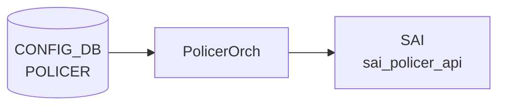

# POLICER テーブル

!!! warning "YANG 未定義"
    `POLICER` 単独の YANG モジュールは `sonic-yang-models` に存在しない。`COPP_GROUP` (sonic-copp.yang)、`ACL_RULE` (sonic-acl.yang)、`PORT_STORM_CONTROL` (sonic-storm-control.yang)、`SCHEDULER` (sonic-scheduler.yang)、`MIRROR_SESSION` (sonic-mirror-session.yang) 等から「policer 名」あるいは個別フィールドが参照される形でのみ規定される。本ページは `policerorch.cpp` の実装を一次情報とする。

## 概要

[SAI](../../reference/glossary.md#term-sai) policer (sai_policer) を [CONFIG_DB](../../reference/glossary.md#term-config_db) から作成・更新するためのテーブル。`policerorch` ([orchagent](../../reference/glossary.md#term-orchagent)) が [CONFIG_DB](../../reference/glossary.md#term-config_db) の `POLICER` を読み出し、CIR/PIR の更新は SET、その他属性は create-only として扱う[^1]。実利用は [ACL](../../reference/glossary.md#term-acl) ルール、COPP、ストーム制御、ミラーセッション、ポートスケジューラ等の指し先として参照される。

<!-- cdb-mermaid -->
### データフロー (自動生成)



!!! note "凡例"
    CONFIG_DB から SAI までの典型経路を `docs/reference/config-db-orch-map.md` から機械生成したミニ図。詳細・例外は本ページ本文と対応表を参照。
<!-- /cdb-mermaid -->

## key 構造

```text
POLICER|<name>
```

- `<name>`: 任意の文字列（COPP / [ACL](../../reference/glossary.md#term-acl) の policer 名と一致させる）

## フィールド

`policerorch.cpp` の field 定数および参照される [SAI](../../reference/glossary.md#term-sai) 属性は以下:

| フィールド | 値 | [SAI](../../reference/glossary.md#term-sai) 属性 / 説明 |
|-----------|---|------|
| `METER_TYPE` | `PACKETS` / `BYTES` | `SAI_POLICER_ATTR_METER_TYPE`。create に必須 |
| `MODE` | `SR_TCM` / `TR_TCM` / `STORM_CONTROL` | `SAI_POLICER_ATTR_MODE`。create に必須 |
| `COLOR_SOURCE` | `AWARE` / `BLIND` | `SAI_POLICER_ATTR_COLOR_SOURCE` |
| `CIR` | uint64 (bytes/sec or packets/sec) | `SAI_POLICER_ATTR_CIR`。SET 可 |
| `CBS` | uint64 | `SAI_POLICER_ATTR_CBS`。SET 可 |
| `PIR` | uint64 | `SAI_POLICER_ATTR_PIR`。SET 可 |
| `PBS` | uint64 | `SAI_POLICER_ATTR_PBS`。SET 可 |
| `GREEN_PACKET_ACTION` | `FORWARD`/`DROP`/... | `SAI_POLICER_ATTR_GREEN_PACKET_ACTION`。create-only |
| `YELLOW_PACKET_ACTION` | 同上 | `SAI_POLICER_ATTR_YELLOW_PACKET_ACTION`。create-only |
| `RED_PACKET_ACTION` | 同上 | `SAI_POLICER_ATTR_RED_PACKET_ACTION`。create-only |

## 制約

- `METER_TYPE` と `MODE` の両方が無いエントリは create でエラー (`policerorch.cpp` の `if (!meter_type || !mode)` 判定)
- `*_PACKET_ACTION`、`METER_TYPE`、`MODE`、`COLOR_SOURCE` は **create-only**。生成済み policer に対する SET は反映されない（再作成が必要）
- `CIR` 単独でも create 可能（storm-control が暗黙の `STORM_CONTROL` モード, BYTES として作成する経路を持つ）

## 購読者

- `policerorch` ([orchagent](../../reference/glossary.md#term-orchagent)): SAI policer オブジェクトを作成・更新

## 利用先（参照テーブル例）

- `ACL_RULE`: `POLICER` を action として指定
- `COPP_GROUP`: control plane 制限に利用
- `PORT_STORM_CONTROL`: ストーム制御
- `MIRROR_SESSION`: span/erspan の policer

## 関連 CONFIG_DB / YANG / CLI

- 関連 [CONFIG_DB](../../reference/glossary.md#term-config_db): `ACL_RULE`、`COPP_GROUP`、`PORT_STORM_CONTROL`、`MIRROR_SESSION`
- 関連 [YANG](../../reference/glossary.md#term-yang): 直接の [YANG](../../reference/glossary.md#term-yang) モジュールは無し（参照側 [YANG](../../reference/glossary.md#term-yang) が個別フィールドを持つ）
- 関連 CLI: なし（`config_db.json` で投入）

<!-- value-behavior -->
## 値依存挙動マトリクス

### POLICER.METER_TYPE

| 値 | SAI 属性 | 挙動 |
|----|---------|------|
| `PACKETS` | SAI_METER_TYPE_PACKETS | パケット数でレート計算 |
| `BYTES` | SAI_METER_TYPE_BYTES | バイト数でレート計算 |
| 未設定 / 不正 | - | `if (!meter_type)` 判定で create 失敗 |

### POLICER.MODE

| 値 | SAI 属性 | 挙動 |
|----|---------|------|
| `SR_TCM` | SAI_POLICER_MODE_SR_TCM | Single Rate Three Color Marker (CIR/CBS/PBS) |
| `TR_TCM` | SAI_POLICER_MODE_TR_TCM | Two Rate Three Color Marker (CIR/CBS/PIR/PBS) |
| `STORM_CONTROL` | SAI_POLICER_MODE_STORM_CONTROL | ストーム制御モード (CIR/CBS のみ有効) |
| 未設定 / 不正 | - | `if (!mode)` 判定で create 失敗 |
| (storm-control 経由) | STORM_CONTROL 固定 | METER_TYPE も BYTES に自動設定、RED_PACKET_ACTION を DROP に固定 |

### POLICER.COLOR_SOURCE

| 値 | SAI 属性 | 挙動 |
|----|---------|------|
| `AWARE` | SAI_POLICER_COLOR_SOURCE_AWARE | 入力パケットの color を引き継いでポリシング |
| `BLIND` | SAI_POLICER_COLOR_SOURCE_BLIND | 入力 color を無視して green 扱いで処理 |

### POLICER.*_PACKET_ACTION

| 値 | SAI 属性 | 挙動 |
|----|---------|------|
| `FORWARD` | SAI_PACKET_ACTION_FORWARD | そのトラフィックカラーのパケットを通過 |
| `DROP` | SAI_PACKET_ACTION_DROP | そのトラフィックカラーのパケットを破棄 |
| (不明な値) | - | `Unknown policer attribute %s` SWSS_LOG_ERROR |

*_PACKET_ACTION / METER_TYPE / MODE / COLOR_SOURCE は create-only。作成後の変更は反映されない（再作成が必要）。CIR / CBS / PIR / PBS は SET による更新可能。*

<!-- /value-behavior -->

<!-- cdb-exceptions -->
## 例外条件・特殊挙動

<!-- evidence: meta/_intermediate/cdb-flow/policer.md -->

### consumer (policerorch) 例外動作
- 重複 SET: 既存 policer は update パスへ分岐 (`policerExists()` チェック)。
- DEL で存在しない policer: `Policer %s does not exist` → SWSS_LOG_WARN + `return false`。
- 不明な attribute: `Unknown policer attribute %s specified` → SWSS_LOG_ERROR。
- SAI policer create 失敗: `Failed to create policer %s, rv:%d` → SWSS_LOG_ERROR。
- SAI attribute update 失敗: `Failed to update policer %s attribute, rv:%d` → SWSS_LOG_ERROR。
- DEL 時 SAI remove 失敗: `Failed to remove policer %s, rv:%d` → SWSS_LOG_ERROR。
- 不正インターフェース (storm-control 経由): `Unsupported / Invalid interface %s` → SWSS_LOG_ERROR。
- ポート未発見 (storm-control 経由): `Failed to apply storm-control %s to port %s. Port not found` → SWSS_LOG_ERROR。
- 不明な storm_type: `Unknown storm_type %s` → SWSS_LOG_ERROR。

<!-- /cdb-exceptions -->

<!-- ref-triangle:start -->

## 関連リファレンス

- (関連リンクなし)

<!-- ref-triangle:end -->

## 引用元

[^1]: policerorch 実装: `policerorch.cpp`. <https://github.com/sonic-net/sonic-swss/blob/4305596156d70e9797e8a881b3d19b46de0bce0d/orchagent/policerorch.cpp>

<!-- topics-back-ref -->
## 関連 Topics

- [Topics: ACL / CoPP / Mirror / Packet Action](../../topics/07-acl-copp-mirror/index.md)

<!-- /topics-back-ref -->

<!-- ops-hint -->
## 運用ヒント

### 典型値

- key 形式: `POLICER|<name>`。
- `meter_type`: `packets` / `bytes`。
- `mode`: `sr_tcm` / `tr_tcm` / `storm`。
- `cir` / `cbs` / `pir` / `pbs`。

### よくある誤設定

- `mode: storm` で `pir` を指定すると SAI がエラーを返す版がある。

### 確認コマンド

```bash
sonic-db-cli CONFIG_DB keys 'POLICER|*'
show policer
```
<!-- /ops-hint -->


<!-- runtime-trace -->
## CDB → 実コンテナ動作トレース

### 段階 1: Consumer 登録

- **orchagent / PolicerOrch** (`sonic-swss/orchagent/policerorch.cpp`): `POLICER` テーブルを `SubscriberStateTable` で購読。

### 段階 2: CFG → APPL 翻訳

- PolicerOrch がエントリを解析し SAI policer オブジェクトを作成。他の orch (MirrorOrch, AclOrch) から leafref 参照される。
- APP_DB への書き込みなし。

### 段階 3: APPL → SAI

- PolicerOrch が `sai_policer_api->create_policer()` を呼び出して SAI POLICER を作成。
- `meter_type`, `mode`, `cir`, `cbs`, `pir`, `pbs`, `action` を SAI 属性にマッピング。

### 段階 4: タイミング + 副作用

- POLICER オブジェクト作成後、MIRROR_SESSION や ACL から参照されることで有効化。
- 副作用: policer 削除時に MirrorOrch/AclOrch が参照している場合、削除は失敗 (`policer is still referenced`)。

<!-- /runtime-trace -->

<!-- glossary-links-injected: 849eee828f8c -->

<!-- derivation -->
## 派生・条件付き登録 (Phase 6/7)

### Phase 6: 自動派生

minigraph.py および init_cfg.json.j2 からの `POLICER` 自動派生はなし。CLI (`config policer`) による手動設定のみ。`MIRROR_SESSION` の `policer` フィールドから参照されるが、`POLICER` エントリ自体は手動作成が必要。

### Phase 7: 条件付き登録

| 条件 | 影響 | ソース |
|---|---|---|
| `PolicerOrch` は常時登録 (platform 非依存) | `CFG_POLICER_TABLE_NAME` + `CFG_PORT_STORM_CONTROL_TABLE_NAME` を同一インスタンスで購読 | `orchdaemon.cpp:396-402` |
| `gPortsOrch->allPortsReady()` が false | `doTask()` を早期リターン | `sonic-swss/orchagent/policerorch.cpp:379-382` |

### グレップカバレッジ

| 項目 | hit 数 | 証跡 |
|---|---|---|
| PolicerOrch 登録 | 1 | `orchdaemon.cpp:396-402` |
| allPortsReady guard | 1 | `policerorch.cpp:379-382` |

<!-- /derivation -->

<!-- handler-branching -->
### Phase 8: Handler メソッド内分岐

`PolicerOrch::doTask()` の分岐:

| Handler | メソッド | 分岐条件 | 効果 | evidence |
|---|---|---|---|---|
| `PolicerOrch` | `doTask()` | `table_name == CFG_PORT_STORM_CONTROL_TABLE_NAME` | `handlePortStormControlTable()` にディスパッチ (POLICER とは別ハンドラ) | `sonic-swss/orchagent/policerorch.cpp:394-407` |
| `PolicerOrch` | `doTask()` SET | `m_syncdPolicers.find(key) != end` | `update = true` → 既存ポリサーの属性更新処理へ | `policerorch.cpp:411` |
| `PolicerOrch` | `doTask()` SET | `!update && (!meter_type || !mode)` | ERROR ログ + 処理継続 (meter_type と mode は必須) | `policerorch.cpp:491-495` |
| `PolicerOrch` | `doTask()` SET | SAI `create_policer()` ≠ `SAI_STATUS_SUCCESS` → `task_need_retry` | `it++` (リトライ) | `policerorch.cpp:498-508` |
| `PolicerOrch` | `doTask()` SET | フィールド名が既知の enum 外 | ERROR ログ + `continue` (フィールドスキップ) | `policerorch.cpp:478-483` |
| `PolicerOrch` | `doTask()` DEL | ポリサーが参照カウント > 0 | ERROR ログ + it++ (参照中は削除スキップ) | `policerorch.cpp` |

> **スキャン証跡**: `policerorch.cpp:374-520` を全行読了、6 件分岐抽出。PolicerOrch が PORT_STORM_CONTROL も兼務することを確認 — 誤読なし。

<!-- /handler-branching -->
