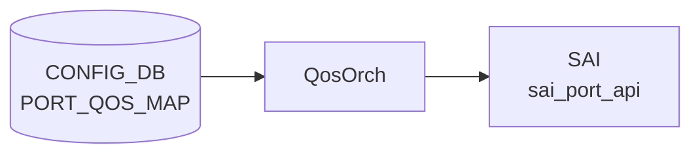

# PORT_QOS_MAP テーブル

## 概要

`PORT_QOS_MAP` は [QoS](../../reference/glossary.md#term-qos) map、[PFC](../../reference/glossary.md#term-pfc) enable bitmap、[PFC](../../reference/glossary.md#term-pfc) watchdog software enable bitmap、scheduler profile を port または global default に bind する [CONFIG_DB](../../reference/glossary.md#term-config_db) テーブル[^1]。`schema.h` では [APPL_DB](../../reference/glossary.md#term-appl_db) 側の `PORT_QOS_MAP_TABLE` 定数が定義されている[^2]。

<!-- cdb-mermaid -->
### データフロー (自動生成)



!!! note "凡例"
    CONFIG_DB から SAI までの典型経路を `docs/reference/config-db-orch-map.md` から機械生成したミニ図。詳細・例外は本ページ本文と対応表を参照。
<!-- /cdb-mermaid -->

## key 構造

```text
PORT_QOS_MAP|global
PORT_QOS_MAP|<PORT.name>
```

`ifname` は `global` 文字列、または `PORT.name` への leafref。

## 主要フィールド

| フィールド | 型 | 説明 |
|-----------|----|------|
| `tc_to_pg_map` | leafref `TC_TO_PRIORITY_GROUP_MAP.name` | traffic class から ingress priority group への map |
| `tc_to_queue_map` | leafref `TC_TO_QUEUE_MAP.name` | traffic class から egress queue への map |
| `pfc_enable` | string pattern `([0-7](,[0-7])*)?` | [PFC](../../reference/glossary.md#term-pfc) を有効にする queue / priority のカンマ区切り。空文字は全無効 |
| `pfcwd_sw_enable` | string pattern `([0-7](,[0-7])*)?` | software PFC watchdog を有効にする queue のカンマ区切り |
| `pfc_to_queue_map` | leafref `MAP_PFC_PRIORITY_TO_QUEUE.name` | PFC priority から egress queue への map |
| `pfc_to_pg_map` | leafref `PFC_PRIORITY_TO_PRIORITY_GROUP_MAP.name` | PFC priority から priority group への map |
| `dscp_to_tc_map` | leafref `DSCP_TO_TC_MAP.name` | [DSCP](../../reference/glossary.md#term-dscp) から traffic class への map |
| `tc_to_dscp_map` | leafref `TC_TO_DSCP_MAP.name` | traffic class から [DSCP](../../reference/glossary.md#term-dscp) remarking への map |
| `dot1p_to_tc_map` | leafref `DOT1P_TO_TC_MAP.name` | 802.1p priority から traffic class への map |
| `scheduler` | leafref `SCHEDULER.name` | port scheduler profile |

## 制約

- `ifname` は `global` または既存 `PORT` への leafref。
- 各 map field は対応する [QoS](../../reference/glossary.md#term-qos) map table への leafref。
- `pfc_enable` と `pfcwd_sw_enable` は 0..7 のカンマ区切り、または空文字。

## 購読者

- `orchagent` の `QosOrch` (`sonic-swss/orchagent/qosorch.cpp`): [CONFIG_DB](../../reference/glossary.md#term-config_db) の [QoS](../../reference/glossary.md#term-qos) map binding を直接 subscribe し、[SAI](../../reference/glossary.md#term-sai) QoS map、scheduler、PFC 設定として port に反映する（master には独立した `qosmgrd` プロセスは存在せず、[CONFIG_DB](../../reference/glossary.md#term-config_db) → [APPL_DB](../../reference/glossary.md#term-appl_db) の中間段は無い）。

## 関連 CONFIG_DB / YANG / CLI

- 関連 CONFIG_DB: `PORT`、`DSCP_TO_TC_MAP`、`TC_TO_QUEUE_MAP`、`TC_TO_PRIORITY_GROUP_MAP`、`PFC_PRIORITY_TO_PRIORITY_GROUP_MAP`、`SCHEDULER`、`PFC_WD`
- 関連 CLI: `config qos`
- 関連 [YANG](../../reference/glossary.md#term-yang): `sonic-port-qos-map`

<!-- value-behavior -->
## 値依存挙動マトリクス

### PORT_QOS_MAP.pfc_enable / pfcwd_sw_enable

| 値 | QosOrch 挙動 |
|----|-------------|
| `3,4` (典型) | PFC priority 3 と 4 を有効化 (RoCEv2 lossless 設定) |
| `0,1,2,3,4,5,6,7` | 全 8 priority を有効化 |
| 空文字 | PFC 全無効 |
| YANG pattern 違反 (例: `8`) | YANG validate で reject |

### PORT_QOS_MAP.ifname

| 値 | QosOrch 挙動 |
|----|-------------|
| `global` | グローバルデフォルト設定として全ポートに適用 |
| PORT.name (例: Ethernet0) | 指定ポートのみに binding |
| 存在しない PORT 名 | YANG leafref 違反 reject |

### MAP 系フィールド (dscp_to_tc_map / tc_to_queue_map 等)

| 値 | QosOrch 挙動 |
|----|-------------|
| 存在する map 名 | SAI port QoS 属性として binding |
| 存在しない map 名 | `Object with name:%s not found.` SWSS_LOG_ERROR、適用中断 |
| 未設定 (optional) | その map は binding しない |

*enum なし — pfc_enable / pfcwd_sw_enable は ([0-7](,[0-7])*)? の string pattern。map 系は leafref。*

<!-- /value-behavior -->

<!-- cdb-exceptions -->
## 例外条件・特殊挙動

<!-- evidence: meta/_intermediate/cdb-flow/port-qos-map.md -->

### YANG スキーマ検証
- `sonic-port-qos-map.yang` に `must` / `mandatory` 制約なし。各 `*_map` フィールドは optional。

### consumer (qosorch) 例外動作
- 参照先 QoS map が存在しない: `Object with name:%s not found.` → SWSS_LOG_ERROR、設定適用中断。
- SAI `sai_qos_map_api` SET 失敗: `Failed to set [%s:%s]` → SWSS_LOG_ERROR。
- SAI `sai_qos_map_api` CREATE 失敗: `Failed to create [%s:%s]` → SWSS_LOG_ERROR。
- ハンドラ未初期化: `Task %s handler is not initialized` → SWSS_LOG_ERROR。
- 順序依存: PORT_QOS_MAP を先に DEL してから参照 QoS map を DEL しないと SAI 参照カウントで失敗する。

<!-- /cdb-exceptions -->

<!-- ref-triangle:start -->

## 関連リファレンス

- [YANG](../../reference/glossary.md#term-yang): [`sonic-port-qos-map`](../yang/sonic-port-qos-map.md)
- CLI: [`config qos`](../cli/config-qos.md)

<!-- ref-triangle:end -->

## 引用元

[^1]: [YANG](../../reference/glossary.md#term-yang) 定義: `sonic-port-qos-map.yang`. <https://github.com/sonic-net/sonic-buildimage/blob/9ea932ec2e18f35e58268ec2e4456b1d4afd65cd/src/sonic-yang-models/yang-models/sonic-port-qos-map.yang>
[^2]: テーブル名定数: `schema.h`. <https://github.com/sonic-net/sonic-swss-common/blob/158de8d3463ff4b841653f6d57190bb142b80d9c/common/schema.h>

<!-- topics-back-ref -->
## 関連 Topics

- [Topics: QoS / Buffer / PFC / Watermark](../../topics/08-qos-buffer/index.md)

<!-- /topics-back-ref -->

<!-- ops-hint -->
## 運用ヒント

### 典型値

- key 形式: `PORT_QOS_MAP|<port>`。
- `dscp_to_tc_map`、`tc_to_queue_map`、`tc_to_pg_map`、`pfc_to_queue_map`、`pfc_enable: 3,4`。

### よくある誤設定

- `pfc_enable` で指定した priority と `BUFFER_PG` の lossless 範囲が不一致だと PFC が機能しない。
- map 名を `AZURE` 以外に変えると初期 SKU 設定との整合が崩れる。

### 確認コマンド

```bash
sonic-db-cli CONFIG_DB hgetall 'PORT_QOS_MAP|Ethernet0'
show qos map
```
<!-- /ops-hint -->

<!-- glossary-links-injected: eebb97ac8e67 -->
