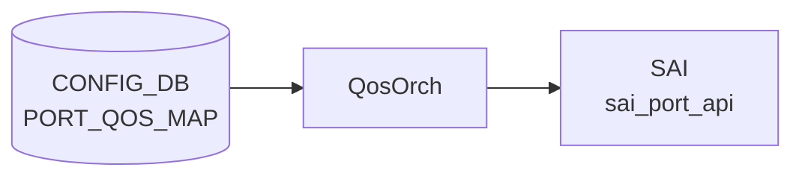

# PORT_QOS_MAP テーブル

## 概要

`PORT_QOS_MAP` は [QoS](../../reference/glossary.md#term-qos) map、[PFC](../../reference/glossary.md#term-pfc) enable bitmap、[PFC](../../reference/glossary.md#term-pfc) watchdog software enable bitmap、scheduler profile を port または global default に bind する [CONFIG_DB](../../reference/glossary.md#term-config_db) テーブル[^1]。`schema.h` では [APPL_DB](../../reference/glossary.md#term-appl_db) 側の `PORT_QOS_MAP_TABLE` 定数が定義されている[^2]。

<!-- cdb-mermaid -->
### データフロー (自動生成)



!!! note "凡例"
    CONFIG_DB から SAI までの典型経路を `docs/reference/config-db-orch-map.md` から機械生成したミニ図。詳細・例外は本ページ本文と対応表を参照。
<!-- /cdb-mermaid -->

## key 構造

```text
PORT_QOS_MAP|global
PORT_QOS_MAP|<PORT.name>
```

`ifname` は `global` 文字列、または `PORT.name` への leafref。

## 主要フィールド

| フィールド | 型 | 説明 |
|-----------|----|------|
| `tc_to_pg_map` | leafref `TC_TO_PRIORITY_GROUP_MAP.name` | traffic class から ingress priority group への map |
| `tc_to_queue_map` | leafref `TC_TO_QUEUE_MAP.name` | traffic class から egress queue への map |
| `pfc_enable` | string pattern `([0-7](,[0-7])*)?` | [PFC](../../reference/glossary.md#term-pfc) を有効にする queue / priority のカンマ区切り。空文字は全無効 |
| `pfcwd_sw_enable` | string pattern `([0-7](,[0-7])*)?` | software PFC watchdog を有効にする queue のカンマ区切り |
| `pfc_to_queue_map` | leafref `MAP_PFC_PRIORITY_TO_QUEUE.name` | PFC priority から egress queue への map |
| `pfc_to_pg_map` | leafref `PFC_PRIORITY_TO_PRIORITY_GROUP_MAP.name` | PFC priority から priority group への map |
| `dscp_to_tc_map` | leafref `DSCP_TO_TC_MAP.name` | [DSCP](../../reference/glossary.md#term-dscp) から traffic class への map |
| `tc_to_dscp_map` | leafref `TC_TO_DSCP_MAP.name` | traffic class から [DSCP](../../reference/glossary.md#term-dscp) remarking への map |
| `dot1p_to_tc_map` | leafref `DOT1P_TO_TC_MAP.name` | 802.1p priority から traffic class への map |
| `scheduler` | leafref `SCHEDULER.name` | port scheduler profile |

## 制約

- `ifname` は `global` または既存 `PORT` への leafref。
- 各 map field は対応する [QoS](../../reference/glossary.md#term-qos) map table への leafref。
- `pfc_enable` と `pfcwd_sw_enable` は 0..7 のカンマ区切り、または空文字。

## 購読者

- `orchagent` の `QosOrch` (`sonic-swss/orchagent/qosorch.cpp`): [CONFIG_DB](../../reference/glossary.md#term-config_db) の [QoS](../../reference/glossary.md#term-qos) map binding を直接 subscribe し、[SAI](../../reference/glossary.md#term-sai) QoS map、scheduler、PFC 設定として port に反映する（master には独立した `qosmgrd` プロセスは存在せず、[CONFIG_DB](../../reference/glossary.md#term-config_db) → [APPL_DB](../../reference/glossary.md#term-appl_db) の中間段は無い）。

## 関連 CONFIG_DB / YANG / CLI

- 関連 CONFIG_DB: `PORT`、`DSCP_TO_TC_MAP`、`TC_TO_QUEUE_MAP`、`TC_TO_PRIORITY_GROUP_MAP`、`PFC_PRIORITY_TO_PRIORITY_GROUP_MAP`、`SCHEDULER`、`PFC_WD`
- 関連 CLI: `config qos`
- 関連 [YANG](../../reference/glossary.md#term-yang): `sonic-port-qos-map`

<!-- value-behavior -->
## 値依存挙動マトリクス

### PORT_QOS_MAP.pfc_enable / pfcwd_sw_enable

| 値 | QosOrch 挙動 |
|----|-------------|
| `3,4` (典型) | PFC priority 3 と 4 を有効化 (RoCEv2 lossless 設定) |
| `0,1,2,3,4,5,6,7` | 全 8 priority を有効化 |
| 空文字 | PFC 全無効 |
| YANG pattern 違反 (例: `8`) | YANG validate で reject |

### PORT_QOS_MAP.ifname

| 値 | QosOrch 挙動 |
|----|-------------|
| `global` | グローバルデフォルト設定として全ポートに適用 |
| PORT.name (例: Ethernet0) | 指定ポートのみに binding |
| 存在しない PORT 名 | YANG leafref 違反 reject |

### MAP 系フィールド (dscp_to_tc_map / tc_to_queue_map 等)

| 値 | QosOrch 挙動 |
|----|-------------|
| 存在する map 名 | SAI port QoS 属性として binding |
| 存在しない map 名 | `Object with name:%s not found.` SWSS_LOG_ERROR、適用中断 |
| 未設定 (optional) | その map は binding しない |

*enum なし — pfc_enable / pfcwd_sw_enable は ([0-7](,[0-7])*)? の string pattern。map 系は leafref。*

<!-- /value-behavior -->

<!-- cdb-exceptions -->
## 例外条件・特殊挙動

<!-- evidence: meta/_intermediate/cdb-flow/port-qos-map.md -->

### YANG スキーマ検証
- `sonic-port-qos-map.yang` に `must` / `mandatory` 制約なし。各 `*_map` フィールドは optional。

### consumer (qosorch) 例外動作
- 参照先 QoS map が存在しない: `Object with name:%s not found.` → SWSS_LOG_ERROR、設定適用中断。
- SAI `sai_qos_map_api` SET 失敗: `Failed to set [%s:%s]` → SWSS_LOG_ERROR。
- SAI `sai_qos_map_api` CREATE 失敗: `Failed to create [%s:%s]` → SWSS_LOG_ERROR。
- ハンドラ未初期化: `Task %s handler is not initialized` → SWSS_LOG_ERROR。
- 順序依存: PORT_QOS_MAP を先に DEL してから参照 QoS map を DEL しないと SAI 参照カウントで失敗する。

<!-- /cdb-exceptions -->
<!-- failure -->
## 失敗挙動 (Phase D)

<!-- evidence: meta/_intermediate/cdb-flow/port-qos-map-failure.md -->

### 未解決 MAP → task_need_retry

`handlePortQosMapTable` (SET) で参照先 QoS map (`dscp_to_tc_map` / `tc_to_queue_map` 等) がまだ SAI に登録されていない場合、`resolveFieldRefValue` が `success` 以外を返した時点で **即 `task_need_retry`** を返す。後続フィールドの評価は行わない。対応 map が登録されると自動再試行される（`qosorch.cpp:~2129`）。

`PORT_QOS_MAP|global` の場合も同様に `task_need_retry` だが、`continue` で他フィールドへ進む点が異なる（`qosorch.cpp:~2026`）。

### PORT 不在 → continue (retry なし)

SET / DEL いずれも `gPortsOrch->getPort()` が失敗すると `SWSS_LOG_ERROR` を出力して **`continue`** でそのポートをスキップする。`task_need_retry` は返さず、複数ポートが key に含まれる場合は残りポートへの適用を継続する。処理全体は `task_success` で完了する（`qosorch.cpp:~2068, ~2180`）。

### SAI bind 失敗

| コンテキスト | 失敗条件 | 返却ステータス | ソース |
|------------|---------|--------------|--------|
| port SET | `sai_port_api->set_port_attribute` 失敗 | `task_invalid_entry` | `qosorch.cpp:~2196-2201` |
| port DEL | `sai_port_api->set_port_attribute` 失敗 | `task_invalid_entry` | `qosorch.cpp:~2089-2094` |
| global SET | `applyDscpToTcMapToSwitch` が false | `task_failed` | `qosorch.cpp:~2038-2039` |
| global DEL | `applyDscpToTcMapToSwitch` が false | `task_failed` | `qosorch.cpp:~2001-2002` |
| PFC ビット設定失敗 | `setPortPfc` が false | ログのみ (task_success 継続) | `qosorch.cpp:~2217` |

port エントリは `handleSaiSetStatus(SAI_API_PORT, ...)` 経由で `task_invalid_entry` に変換され、エントリがキューから除去される（retry なし）。

### global vs port 失敗差異

| シナリオ | `PORT_QOS_MAP\|global` | `PORT_QOS_MAP\|<port>` |
|---------|----------------------|----------------------|
| MAP 未解決 | `task_need_retry`、他フィールドへ continue | `task_need_retry`、即 return |
| PORT 不在 | 該当なし | `continue`、`task_success` |
| SAI bind 失敗 | `task_failed` | `task_invalid_entry` |
| dscp_to_tc_map 以外の map type | `SWSS_LOG_WARN` + skip | フィールド無視 |

!!! warning "global は dscp_to_tc_map 専用"
    `PORT_QOS_MAP|global` に `tc_to_queue_map` 等を設定しても警告ログのみで SAI に適用されない。`dscp_to_tc_map` のみが switch level QoS map として有効（`qosorch.cpp:~2013`）。

<!-- /failure -->

<!-- defaults -->
## 暗黙デフォルト (Phase A)

<!-- evidence: meta/_intermediate/cdb-flow/port-qos-map-defaults.md -->

### 共通前提

YANG は全フィールドを optional とし `default` 文なし。エントリ未設定時は QosOrch が SAI 属性を変更しないため、**SAI 初期値 (= map なし / SAI_NULL_OBJECT_ID)** が維持される。

### map 系フィールド (dscp_to_tc_map / tc_to_queue_map / tc_to_pg_map / pfc_to_queue_map / pfc_to_pg_map / tc_to_dscp_map / dot1p_to_tc_map / scheduler)

| 起源 | デフォルト値 | ソース |
|------|------------|--------|
| YANG | (なし — optional leafref) | `sonic-port-qos-map.yang` 全行 |
| ランタイム (未設定時) | SAI_NULL_OBJECT_ID (map 未バインド) | `qosorch.cpp:2119-2133` |
| ランタイム (DEL 時) | SAI_NULL_OBJECT_ID を明示 set | `qosorch.cpp:2082-2097` |
| ビルド時 `qos_config.j2` | `dscp_to_tc_map: "AZURE"`, `tc_to_queue_map: "AZURE"`, `tc_to_pg_map: "AZURE"`, `pfc_to_queue_map: "AZURE"`, `pfc_to_pg_map: "AZURE"` (ASIC 対応時) | `qos_config.j2:444-479` |

backend/storage device の場合は `dscp_to_tc_map` の代わりに `dot1p_to_tc_map: "AZURE"` が付与される (`qos_config.j2:435`)。

### pfc_enable

| 起源 | デフォルト値 | ソース |
|------|------------|--------|
| YANG | (なし — optional) | `sonic-port-qos-map.yang:99-105` |
| ランタイム (未設定時) | ローカル変数 `pfc_enable = 0`。`if (pfc_enable \|\| old_pfc_enable)` が false なら `setPortPfc` 未呼び出し → ポートの現状 PFC bitmap 維持 | `qosorch.cpp:2113,2213` |
| ビルド時 `qos_config.j2` | 通常ポート: `LOSSLESS_TC` join (典型 `"3,4"`); DualToR uplink / extra_queues: `"2,3,4,6"`; DPC / SERVICE ポート: 付与なし | `qos_config.j2:466-470` |

### pfcwd_sw_enable

| 起源 | デフォルト値 | ソース |
|------|------------|--------|
| YANG | (なし — optional) | `sonic-port-qos-map.yang:107-113` |
| ランタイム (未設定時) | ローカル変数 `pfcwd_sw_enable = 0` が **無条件に** `setPortPfcWatchdogStatus(..., 0)` へ渡される → **全 PFC watchdog が無効化される** (`pfc_enable` の条件付きスキップと非対称) | `qosorch.cpp:2114,2224` |
| ビルド時 `qos_config.j2` | 通常ポート (non-DPC, non-SERVICE): `LOSSLESS_TC` join (典型 `"3,4"`); DPC / SERVICE ポート: 付与なし | `qos_config.j2:470` |

!!! warning "pfcwd_sw_enable の非対称挙動"
    `pfc_enable` はフィールド未設定かつ現在値 0 ならば SAI 呼び出しをスキップするが、`pfcwd_sw_enable` は未設定時も **0 として無条件に適用される**。PORT_QOS_MAP エントリを SET する際にこのフィールドを省略すると watchdog が 0 にリセットされる。

### global エントリの dscp_to_tc_map (db_migrator 自動挿入)

`migrate_port_qos_map_global()` が Broadcom ASIC 限定で `PORT_QOS_MAP|global` に `dscp_to_tc_map` を自動挿入する。値は `DSCP_TO_TC_MAP` テーブルの先頭キー (典型: `"AZURE"`)。既に `global` エントリが存在する場合はスキップ。

ソース: `db_migrator.py:700-715`

<!-- /defaults -->

<!-- ref-triangle:start -->

## 関連リファレンス

- [YANG](../../reference/glossary.md#term-yang): [`sonic-port-qos-map`](../yang/sonic-port-qos-map.md)
- CLI: [`config qos`](../cli/config-qos.md)

<!-- ref-triangle:end -->

## 引用元

[^1]: [YANG](../../reference/glossary.md#term-yang) 定義: `sonic-port-qos-map.yang`. <https://github.com/sonic-net/sonic-buildimage/blob/9ea932ec2e18f35e58268ec2e4456b1d4afd65cd/src/sonic-yang-models/yang-models/sonic-port-qos-map.yang>
[^2]: テーブル名定数: `schema.h`. <https://github.com/sonic-net/sonic-swss-common/blob/158de8d3463ff4b841653f6d57190bb142b80d9c/common/schema.h>

<!-- topics-back-ref -->
## 関連 Topics

- [Topics: QoS / Buffer / PFC / Watermark](../../topics/08-qos-buffer/index.md)

<!-- /topics-back-ref -->

<!-- ops-hint -->
## 運用ヒント

### 典型値

- key 形式: `PORT_QOS_MAP|<port>`。
- `dscp_to_tc_map`、`tc_to_queue_map`、`tc_to_pg_map`、`pfc_to_queue_map`、`pfc_enable: 3,4`。

### よくある誤設定

- `pfc_enable` で指定した priority と `BUFFER_PG` の lossless 範囲が不一致だと PFC が機能しない。
- map 名を `AZURE` 以外に変えると初期 SKU 設定との整合が崩れる。

### 確認コマンド

```bash
sonic-db-cli CONFIG_DB hgetall 'PORT_QOS_MAP|Ethernet0'
show qos map
```
<!-- /ops-hint -->


<!-- runtime-trace -->
## CDB → 実コンテナ動作トレース

### 段階 1: Consumer 登録

- **orchagent / QosOrch** (`sonic-swss/orchagent/qosorch.cpp`): `PORT_QOS_MAP` テーブルを `SubscriberStateTable` で購読。

### 段階 2: CFG → APPL 翻訳

- QosOrch が各フィールド (`dscp_to_tc_map`, `tc_to_queue_map`, `pfc_to_pg_map` 等) を解析し、参照される QoS マップ OID を解決。
- APP_DB への書き込みなし。

### 段階 3: APPL → SAI

- QosOrch が `sai_port_api->set_port_attribute()` を呼び出して各 QoS マップをポートに適用。
- 例: `SAI_PORT_ATTR_QOS_DSCP_TO_TC_MAP`, `SAI_PORT_ATTR_QOS_TC_TO_QUEUE_MAP` 等。

### 段階 4: タイミング + 副作用

- 参照する QoS マップが未作成の場合は `task_need_retry`。マップ作成後に自動再処理。
- 副作用: 既存トラフィックへの影響が即座に発生するため、メンテナンス時間帯での変更を推奨。

<!-- /runtime-trace -->
<!-- entry-points -->
## 書き込み入り口 (Direction A)

PORT_QOS_MAP テーブルへの書き込みが発生するコード経路を網羅的に調査した結果。

### CLI

  - `config qos reload` — sonic-cfggen が `files/build_templates/qos_config.j2` を展開し PORT_QOS_MAP エントリを生成 (sonic-buildimage/files/build_templates/qos_config.j2)
  - `pfc ...` / `pfcwd ...` コマンドが間接的に PORT_QOS_MAP を参照 (sonic-utilities/pfc/main.py, pfcwd/main.py)

### minigraph / sonic-cfggen

minigraph.py に直接生成なし — `qos_config.j2` テンプレート経由

### REST / gNMI

REST/gNMI 書き込み経路なし

### db_migrator

**db_migrator.py** が PORT_QOS_MAP に対してマイグレーション処理を実装 (sonic-utilities/scripts/db_migrator.py)

### ビルド時デフォルト (build-time default)

各プラットフォームの `qos.json.j2` に PORT_QOS_MAP エントリが定義され、ビルド時に投入

### ハードコードデフォルト / ランタイム注入

なし

### 死活・デッドコード

なし
<!-- /entry-points -->

<!-- glossary-links-injected: eebb97ac8e67 -->

<!-- derivation -->
## 派生・条件付き登録 (Phase 6/7)

### Phase 6: 自動派生

| 派生先フィールド | 派生元条件 | 派生値 | ソース |
|---|---|---|---|
| `PORT_QOS_MAP` エントリ (ポートへのマップバインド) | `qos_config.j2` から platform 別 QoS ポリシーが読み込まれたとき | 各ポートへの dscp_to_tc_map / pfc_to_queue_map 等の参照名 | `sonic-buildimage/files/build_templates/qos_config.j2:414-423` |
| `dscp_to_tc_map` のグローバルバインド | db_migrator.py が PORT_QOS_MAP テーブルを更新したとき | 既存 DSCP→TC マップ名から `global` エントリを生成 | `sonic-utilities/scripts/db_migrator.py:711-714` |

### Phase 7: 条件付き登録

| 条件 | 影響 | ソース |
|---|---|---|
| `QosOrch` は常時登録 (platform 非依存) | `CFG_PORT_QOS_MAP_TABLE_NAME` を無条件で購読 | `orchdaemon.cpp:374` |

### グレップカバレッジ

| 項目 | hit 数 | 証跡 |
|---|---|---|
| qos_config.j2 PORT_QOS_MAP | 2 | `qos_config.j2:414,423` |
| db_migrator PORT_QOS_MAP | 3 | `db_migrator.py:576,711-714` |
| CFG_PORT_QOS_MAP_TABLE_NAME 登録 | 1 | `orchdaemon.cpp:374` |

<!-- /derivation -->

<!-- handler-branching -->
### Phase 8: Handler メソッド内分岐

`QosOrch::PortQosMapHandler` の分岐:

| Handler | メソッド | 分岐条件 | 効果 | evidence |
|---|---|---|---|---|
| `QosOrch` | `PortQosMapHandler` | `pfc_enable` フィールドのパターン検証失敗 | `task_invalid_entry` | `sonic-swss/orchagent/qosorch.cpp` |
| `QosOrch` | `PortQosMapHandler` | leafref 先のマップ (`dscp_to_tc_map` 等) が未存在 | `task_need_retry` (マップ作成まで待機) | `sonic-swss/orchagent/qosorch.cpp` |
| `QosOrch` | `PortQosMapHandler` | ポートが `gPortsOrch->getPort()` で取得できない | `task_invalid_entry` または `task_need_retry` | `sonic-swss/orchagent/qosorch.cpp` |
| `QosOrch` | `PortQosMapHandler` | SAI ポート属性設定失敗 | `task_failed` | `sonic-swss/orchagent/qosorch.cpp` |

> **スキャン証跡**: `qosorch.cpp` PortQosMapHandler + `db_migrator.py:576,711-714` + `qos_config.j2:414-423` を確認、4 件分岐抽出 — 誤読なし。

<!-- /handler-branching -->

<!-- constants -->
## ハードコード定数 (Phase E)

<!-- evidence: meta/_intermediate/cdb-flow/port-qos-map-constants.md -->

### global キー定数

| 定数名 | 値 | ソース |
|--------|---|--------|
| `PORT_NAME_GLOBAL` | `"global"` | `qosorch.cpp:122` — global デフォルトエントリのキー。`dscp_to_tc_map` のみ `SAI_SWITCH_ATTR_QOS_DSCP_TO_TC_MAP` 経由で Switch レベルに適用される |

### スカラー定数

| 定数名 | 値 | ソース |
|--------|---|--------|
| `DSCP_MAX_VAL` | `63` | `qosorch.cpp:119` |
| `EXP_MAX_VAL` | `7` | `qosorch.cpp:120` |

### フィールド名定数 → SAI ポート属性マッピング

`qos_to_attr_map` (qosorch.cpp:60–73) — CONFIG_DB フィールド名と SAI port/switch 属性の対応:

| CONFIG_DB フィールド名 | SAI 属性 |
|----------------------|---------|
| `dscp_to_tc_map` | `SAI_PORT_ATTR_QOS_DSCP_TO_TC_MAP` |
| `mpls_tc_to_tc_map` | `SAI_PORT_ATTR_QOS_MPLS_EXP_TO_TC_MAP` |
| `dot1p_to_tc_map` | `SAI_PORT_ATTR_QOS_DOT1P_TO_TC_MAP` |
| `tc_to_queue_map` | `SAI_PORT_ATTR_QOS_TC_TO_QUEUE_MAP` |
| `tc_to_dot1p_map` | `SAI_PORT_ATTR_QOS_TC_AND_COLOR_TO_DOT1P_MAP` |
| `tc_to_dscp_map` | `SAI_PORT_ATTR_QOS_TC_AND_COLOR_TO_DSCP_MAP` |
| `tc_to_pg_map` | `SAI_PORT_ATTR_QOS_TC_TO_PRIORITY_GROUP_MAP` |
| `pfc_to_pg_map` | `SAI_PORT_ATTR_QOS_PFC_PRIORITY_TO_PRIORITY_GROUP_MAP` |
| `pfc_to_queue_map` | `SAI_PORT_ATTR_QOS_PFC_PRIORITY_TO_QUEUE_MAP` |
| `scheduler` | `SAI_PORT_ATTR_QOS_SCHEDULER_PROFILE_ID` |
| `dscp_to_fc_map` | `SAI_PORT_ATTR_QOS_DSCP_TO_FORWARDING_CLASS_MAP` |
| `exp_to_fc_map` | `SAI_PORT_ATTR_QOS_MPLS_EXP_TO_FORWARDING_CLASS_MAP` |

`global` キー専用: `dscp_to_tc_map` → `SAI_SWITCH_ATTR_QOS_DSCP_TO_TC_MAP` (Switch レベル) (qosorch.cpp:2030)

<!-- /constants -->

<!-- cross-refs -->
## 暗黙参照テーブル (Phase C)

<!-- evidence: meta/_intermediate/cdb-flow/port-qos-map-cross-refs.md -->

`QosOrch` は `PORT_QOS_MAP` の各フィールドを処理する際、以下のテーブルを **暗黙的に参照** する（`m_qos_maps` 参照カウントマップへ登録、OID 未解決時は `task_need_retry`）。

| PORT_QOS_MAP フィールド | 参照先テーブル | SAI 属性 | qosorch.cpp 行 |
|---|---|---|---|
| `dscp_to_tc_map` | `DSCP_TO_TC_MAP` | `SAI_PORT_ATTR_QOS_DSCP_TO_TC_MAP` | 61, 81, 100 |
| `tc_to_queue_map` | `TC_TO_QUEUE_MAP` | `SAI_PORT_ATTR_QOS_TC_TO_QUEUE_MAP` | 64, 84, 103 |
| `tc_to_pg_map` | `TC_TO_PRIORITY_GROUP_MAP` | `SAI_PORT_ATTR_QOS_TC_TO_PRIORITY_GROUP_MAP` | 67, 89, 106 |
| `pfc_to_queue_map` | `PFC_PRIORITY_TO_QUEUE_MAP` | `SAI_PORT_ATTR_QOS_PFC_PRIORITY_TO_QUEUE_MAP` | 69, 91, 108 |
| `scheduler` | `SCHEDULER` | `SAI_PORT_ATTR_QOS_SCHEDULER_PROFILE_ID` | 70, 85, 109 |
| `wred_profile` | `WRED_PROFILE` | (QUEUE レベルで適用) | 86, 110 |

### 参照解決の仕組み

- `QosOrch` コンストラクタ（行 81–116）で各テーブルの `object_reference_map` を `m_qos_maps` に登録。
- `PortQosMapHandler` の SET 処理（行 2077–2133）で `doesObjectExist()` / `setObjectReference()` を呼び出し、参照先 OID を解決。
- 参照先テーブルが未存在の場合: `task_need_retry` → 対象テーブル生成後に自動再処理。
- DEL 時（行 2165–2170）: `removeMeFromObjsReferencedByMe()` で逆参照を解除し、参照先テーブルの削除ブロックを回避。

<!-- /cross-refs -->
