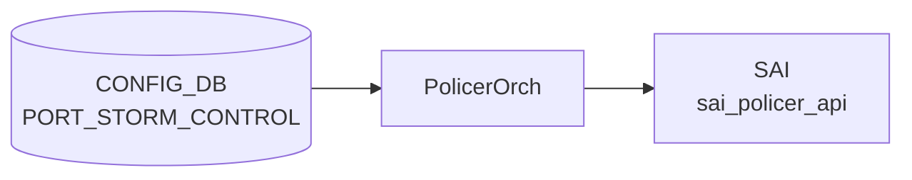

# PORT_STORM_CONTROL テーブル

## 概要

物理ポートで BUM (broadcast / unknown-unicast / unknown-multicast) トラフィックのレート制限 (storm control) を設定するテーブル[^1]。
3 種類のトラフィックに対して個別にレートを指定でき、`orchagent` が [SAI](../../reference/glossary.md#term-sai) `SAI_PORT_ATTR_*_STORM_CONTROL_POLICER_ID` 系で [SAI](../../reference/glossary.md#term-sai) policer を作って attach する。

<!-- cdb-mermaid -->
### データフロー (自動生成)



!!! note "凡例"
    CONFIG_DB から SAI までの典型経路を `docs/reference/config-db-orch-map.md` から機械生成したミニ図。詳細・例外は本ページ本文と対応表を参照。
<!-- /cdb-mermaid -->

## key 構造

```text
PORT_STORM_CONTROL|<ifname>|<storm_type>
```

- `<ifname>`: `PORT.name` への leafref (物理ポートのみ。[LAG](../../reference/glossary.md#term-lag) / [VLAN](../../reference/glossary.md#term-vlan) は非対応)
- `<storm_type>`: `broadcast` / `unknown-unicast` / `unknown-multicast` のいずれか

## フィールド

| フィールド | 型 | 説明 |
|-----------|----|------|
| `kbps` | uint64 (0..100000000) | レート制限 [kbps]。0 で無制限相当 (実装依存) |

## 制約

- `ifname` は `PORT_LIST.name` への leafref のため、PORT に存在しないインタフェースは指定不可
- 3 種類の storm_type を別々のエントリで設定する
- range 上限 100 Gbps 相当 (実装側でハードウェア上限による更なる制約あり)

## 購読者

- `orchagent` (`PortsOrch` の storm-control パス)。内部で [SAI](../../reference/glossary.md#term-sai) policer を作成し、`ATTR_BROADCAST_STORM_CONTROL_POLICER_ID` / `UNKNOWN_UNICAST_STORM_CONTROL_POLICER_ID` / `UNKNOWN_MULTICAST_STORM_CONTROL_POLICER_ID` を更新

## 関連 CONFIG_DB / YANG / CLI

- 関連 [CONFIG_DB](../../reference/glossary.md#term-config_db): `PORT`, `POLICER`
- 関連 CLI: `config interface storm-control <type> <ifname> <kbps>`
- 関連 [YANG](../../reference/glossary.md#term-yang): `sonic-storm-control`

<!-- constants -->
## ハードコード定数 (Phase E)

<!-- evidence: meta/_intermediate/cdb-flow/port-storm-control-constants.md -->

### storm_type 文字列定数

キーの第 2 トークンとして受け付ける有効値と SAI 属性のマッピング (`policerorch.cpp:31-33`):

| CONFIG_DB 値 | C++ 変数 | SAI 属性 |
|---|---|---|
| `broadcast` | `storm_broadcast` | `SAI_PORT_ATTR_BROADCAST_STORM_CONTROL_POLICER_ID` |
| `unknown-unicast` | `storm_unknown_unicast` | `SAI_PORT_ATTR_FLOOD_STORM_CONTROL_POLICER_ID` |
| `unknown-multicast` | `storm_unknown_mcast` | `SAI_PORT_ATTR_MULTICAST_STORM_CONTROL_POLICER_ID` |

上記以外の値は `SWSS_LOG_ERROR("Unknown storm_type %s")` → `task_failed`。

### policer モード固定値

storm control 用 SAI policer 作成時に常にハードコードされる属性 (`policerorch.cpp:156-169`):

| SAI 属性 | 固定値 | ソースコメント |
|---|---|---|
| `SAI_POLICER_ATTR_METER_TYPE` | `SAI_METER_TYPE_BYTES` | `/*Meter type hardcoded to BYTES*/` |
| `SAI_POLICER_ATTR_MODE` | `SAI_POLICER_MODE_STORM_CONTROL` | `/*Policer mode hardcoded to STORM_CONTROL*/` |
| `SAI_POLICER_ATTR_RED_PACKET_ACTION` | `SAI_PACKET_ACTION_DROP` | `/*Red Packet Action hardcoded to DROP*/` |

CONFIG_DB / YANG / CLI からの変更手段はない。

### policer 命名規則

内部 policer 名は `"_" + <ifname> + "_" + <storm_type>` (`policerorch.cpp:146`)。

例: キー `Ethernet0|broadcast` → 内部名 `_Ethernet0_broadcast`。先頭 `_` が通常 POLICER テーブルエントリと衝突しないためのプレフィックス。

<!-- /constants -->

<!-- defaults -->
## 暗黙デフォルトとハードコード挙動

<!-- evidence: meta/_intermediate/cdb-flow/port-storm-control-defaults.md -->

### kbps — YANG デフォルトなし・コード上必須

YANG の `kbps` leaf に `default` 文は存在しない。`mandatory true` 宣言もないため YANG 上は optional に見えるが、orchagent (`handlePortStormControlTable`) は `kbps` が欠如した場合に `task_failed` を返す。エントリは破棄され `SWSS_LOG_ERROR "Failed to create storm control policer %s, missing mandatory fields"` が記録される。

証跡: `sonic-swss/orchagent/policerorch.cpp:195-200`

### SAI policer ハードコード属性 (YANG / CLI 非公開)

YANG および CLI には存在しないが、orchagent が **常に固定値** で SAI policer を作成する属性:

| SAI 属性 | 固定値 | 変更可否 |
|---|---|---|
| `SAI_POLICER_ATTR_METER_TYPE` | `BYTES` | 不可 (ハードコード) |
| `SAI_POLICER_ATTR_MODE` | `STORM_CONTROL` | 不可 (ハードコード) |
| `SAI_POLICER_ATTR_RED_PACKET_ACTION` | `DROP` | 不可 (ハードコード) |
| `SAI_POLICER_ATTR_GREEN_PACKET_ACTION` | 未設定 → SAI/HW デフォルト依存 | 設定不可 |
| `SAI_POLICER_ATTR_YELLOW_PACKET_ACTION` | 未設定 → SAI/HW デフォルト依存 | 設定不可 |
| `SAI_POLICER_ATTR_CBS` | 未設定 → SAI/HW デフォルト依存 | 設定不可 |

証跡: `policerorch.cpp:157-169`

### kbps → SAI CIR 変換 (integer truncation)

```
CIR (bytes/s) = kbps * 1000 / 8
```

整数演算のため、`kbps` が 8 の倍数でない場合は **切り捨て** が発生する (silent rounding)。  
例: `kbps=1` → CIR=125 bytes/s (正確)、`kbps=3` → CIR=375 bytes/s (正確)、`kbps=7` → CIR=875 bytes/s (正確)。  
kbps は通常大きな値のため実用上の影響は限定的だが、低レートでは注意が必要。

証跡: `policerorch.cpp:181-184`

### update 時 remove-then-reapply による瞬間的 storm control 解除

既存エントリを更新する際、orchagent は:
1. ポートの SAI 属性を `SAI_NULL_OBJECT_ID` に設定 (storm control 一時解除)
2. CIR のみ更新 (METER_TYPE / MODE / RED_ACTION は不変)
3. 新 policer oid を再 attach

この操作の間、ポートで storm control が解除されるウィンドウが存在する (ミリ秒オーダー)。

証跡: `policerorch.cpp:273-288`

### allPortsReady ガード (起動時 silent defer)

`gPortsOrch->allPortsReady()` が false の間、`doTask()` は即座 return する。  
全ポートの初期化完了前に CONFIG_DB に書き込まれた PORT_STORM_CONTROL エントリは **処理を遅延される** (silent defer、エラーなし)。

証跡: `policerorch.cpp:379-382`

### 非 Ethernet / ポート未発見のサイレント破棄

- 非 Ethernet インタフェース: `SWSS_LOG_ERROR` を出力するが `task_success` を返す → エントリは erase (silent drop、リトライなし)
- ポート未発見: 同様に `task_success` で erase

証跡: `policerorch.cpp:132-144`

### BUM_STORM_CAPABILITY チェック (CLI のみ、orchagent は非チェック)

CLI (`config storm-control add`) は `STATE_DB:BUM_STORM_CAPABILITY|<storm_type>` の `supported` フィールドを確認し、`0` なら書き込みをスキップする。  
ただし orchagent 側には同様のチェックは存在せず、直接 DB 書き込みを行った場合は capability 非対応でも処理を試みる (プラットフォーム依存の SAI エラーで失敗する可能性あり)。

証跡: `config/main.py:806-814`

### dead field — CBS / Green / Yellow packet action

YANG にも CLI にも CBS・Green packet action・Yellow packet action は公開されていない。  
これらは SAI HW デフォルト依存であり、プラットフォームにより挙動が異なる可能性がある。

<!-- /defaults -->

<!-- value-behavior -->
## 値依存挙動マトリクス

### PORT_STORM_CONTROL キー: storm_type

| 値 | SAI 属性 | 挙動 |
|----|---------|------|
| `broadcast` | SAI_PORT_ATTR_BROADCAST_STORM_CONTROL_POLICER_ID | broadcast トラフィックをレート制限 |
| `unknown-unicast` | SAI_PORT_ATTR_FLOOD_STORM_CONTROL_POLICER_ID | unknown unicast をレート制限 |
| `unknown-multicast` | SAI_PORT_ATTR_MULTICAST_STORM_CONTROL_POLICER_ID | unknown multicast をレート制限 |
| その他 | - | `Unknown storm_type %s` SWSS_LOG_ERROR |

### PORT_STORM_CONTROL.kbps

| 値 | 挙動 |
|----|------|
| 0 | 実装依存 (SAI が 0 を無制限として扱うかはプラットフォーム依存) |
| 1..100000000 | SAI policer CIR として設定 (BYTES / STORM_CONTROL モード固定) |
| 範囲外 | YANG range 違反 reject |

### PORT_STORM_CONTROL キー: ifname

| 値 | 挙動 |
|----|------|
| 物理ポート (PORT.name) | 正常: storm control policer を attach |
| LAG / VLAN など非物理 IF | `Unsupported / Invalid interface %s` SWSS_LOG_ERROR |
| 存在しないポート | `Failed to apply storm-control %s to port %s. Port not found` SWSS_LOG_ERROR |

*enum なし — storm_type はキーの一部として broadcast/unknown-unicast/unknown-multicast を pattern 制約。kbps は uint64。*

<!-- /value-behavior -->

<!-- cdb-exceptions -->
## 例外条件・特殊挙動

<!-- evidence: meta/_intermediate/cdb-flow/port-storm-control.md -->

### consumer (policerorch) 例外動作
- 不正/非サポートインターフェース: `Unsupported / Invalid interface %s` → SWSS_LOG_ERROR。
- ポート未発見: `Failed to apply storm-control %s to port %s. Port not found` → SWSS_LOG_ERROR。
- 不明な storm_type: `Unknown storm_type %s` → SWSS_LOG_ERROR。
- 不明な storm control attribute: `Unknown storm control attribute %s specified` → SWSS_LOG_ERROR。
- SAI policer create 失敗: `Failed to create storm control policer %s` → SWSS_LOG_ERROR。
- SAI attribute update 失敗: `Failed to update policer %s attribute, rv:%d` → SWSS_LOG_ERROR。
- SAI remove storm-control 失敗: `Failed to remove storm-control %s from port %s, rv:%d` → SWSS_LOG_ERROR。
- 未設定 storm policer の参照: `Policer %s not configured` → SWSS_LOG_ERROR。

<!-- /cdb-exceptions -->

<!-- cross-refs -->
## 暗黙参照 (Phase C)

`PORT_STORM_CONTROL` テーブルは以下の CONFIG_DB テーブルへ暗黙的に依存する。`policerorch.cpp` は CONFIG_DB の `PORT` テーブルを直接 lookup せず、`PortsOrch` のメモリ内キャッシュを介して PORT エントリの SAI object id を取得する。

| 参照先テーブル | 参照元 | 参照の性質 |
|--------------|-------|-----------|
| `PORT` | `PolicerOrch::handlePortStormControlTable()` — `gPortsOrch->getPort(interface_name, port)` (`policerorch.cpp:138`) | key の `<ifname>` を `PortsOrch::getPort()` で照合。PORT 未登録の場合は `SWSS_LOG_ERROR` を出力し `task_success` で silent drop (リトライなし) |
| `PORT` (初期化状態) | `PolicerOrch::doTask()` — `gPortsOrch->allPortsReady()` (`policerorch.cpp:379`) | 全 PORT エントリ初期化完了まで `doTask()` を早期リターン。起動時に CONFIG_DB へ先書きされたエントリは silent defer される |
| `PORT` (SAI oid) | `sai_port_api->set_port_attribute(port.m_port_id, ...)` (`policerorch.cpp:278, 291`) | `getPort()` で得た `port.m_port_id` (PORT 由来 SAI oid) を直接 SAI 呼び出しに渡す。CONFIG_DB には SAI oid は格納されない |

詳細証跡: `meta/_intermediate/cdb-flow/port-storm-control-cross-refs.md`
<!-- /cross-refs -->

<!-- ref-triangle:start -->

## 関連リファレンス

- [YANG](../../reference/glossary.md#term-yang): [`sonic-storm-control`](../yang/sonic-storm-control.md)

<!-- ref-triangle:end -->

## 引用元

[^1]: [YANG](../../reference/glossary.md#term-yang) 定義: `sonic-storm-control.yang`. <https://github.com/sonic-net/sonic-buildimage/blob/9ea932ec2e18f35e58268ec2e4456b1d4afd65cd/src/sonic-yang-models/yang-models/sonic-storm-control.yang>

## 関連ページ
- [CONFIG_DB: PORT](port.md)
- [CONFIG_DB: POLICER](policer.md)

<!-- ops-hint -->
## 運用ヒント

### 典型値

- key 形式: `PORT_STORM_CONTROL|<Ethernet>|<traffic-type>` (broadcast/unknown-unicast/unknown-multicast)`。
- `kbps`: 帯域上限。サーバ向けは 1000〜10000kbps、uplink は無効化することが多い。

### よくある誤設定

- uplink にも storm-control を当てて BUM トラフィックを誤遮断する。

### 確認コマンド

```bash
sonic-db-cli CONFIG_DB keys 'PORT_STORM_CONTROL|*'
show storm-control all
```
<!-- /ops-hint -->


<!-- runtime-trace -->
## CDB → 実コンテナ動作トレース

### 段階 1: Consumer 登録

- **orchagent / StormControlOrch**: `PORT_STORM_CONTROL` テーブルを `SubscriberStateTable` で購読。

### 段階 2: CFG → APPL 翻訳

- StormControlOrch がエントリを解析し、ストームコントロール種別 (`broadcast`, `unknown_unicast`, `unknown_multicast`) とレート (kbps/pps) を取得。
- APP_DB への書き込みなし。

### 段階 3: APPL → SAI

- orchagent が `sai_port_api->set_port_attribute()` でストームコントロール policer を適用。
- SAI 属性: `SAI_PORT_ATTR_BROADCAST_STORM_CONTROL_POLICER_ID` 等。

### 段階 4: タイミング + 副作用

- 設定は即時 SAI に反映。既存フラッディングトラフィックへの影響は ms 単位。
- 副作用: レートを低く設定しすぎると正常な broadcast (ARP 等) も制限される。

<!-- /runtime-trace -->
<!-- entry-points -->
## 書き込み入り口 (Direction A)

PORT_STORM_CONTROL テーブルへの書き込みが発生するコード経路を網羅的に調査した結果。

### CLI

  - `config storm-control ...` — `config/main.py` と `scripts/storm_control.py` が `set_entry()` を呼ぶ (sonic-utilities/config/main.py, scripts/storm_control.py)

### minigraph / sonic-cfggen

minigraph.py に PORT_STORM_CONTROL 生成なし

### REST / gNMI

REST/gNMI 書き込み経路なし

### db_migrator

db_migrator.py での PORT_STORM_CONTROL マイグレーションなし

### ビルド時デフォルト (build-time default)

なし

### ハードコードデフォルト / ランタイム注入

なし

### 死活・デッドコード

なし
<!-- /entry-points -->

<!-- glossary-links-injected: 16a5b728a75a -->

<!-- derivation -->
## 派生・条件付き登録 (Phase 6/7)

### Phase 6: 自動派生

minigraph.py および init_cfg.json.j2 からの `PORT_STORM_CONTROL` 自動派生はなし。CLI (`config storm-control`) による手動設定のみ。

### Phase 7: 条件付き登録

| 条件 | 影響 | ソース |
|---|---|---|
| `PolicerOrch` が `CFG_PORT_STORM_CONTROL_TABLE_NAME` も購読 | POLICER と PORT_STORM_CONTROL は同一 PolicerOrch インスタンスで処理 | `orchdaemon.cpp:398` |
| `gPortsOrch->allPortsReady()` が false | `doTask()` を早期リターン | `sonic-swss/orchagent/policerorch.cpp:379-382` |

### グレップカバレッジ

| 項目 | hit 数 | 証跡 |
|---|---|---|
| CFG_PORT_STORM_CONTROL_TABLE_NAME 登録 | 1 | `orchdaemon.cpp:398` |

<!-- /derivation -->

<!-- handler-branching -->
### Phase 8: Handler メソッド内分岐

`PolicerOrch::handlePortStormControlTable()` の分岐:

| Handler | メソッド | 分岐条件 | 効果 | evidence |
|---|---|---|---|---|
| `PolicerOrch` | `doTask()` | `table_name == CFG_PORT_STORM_CONTROL_TABLE_NAME` | `handlePortStormControlTable()` にディスパッチ (通常の POLICER 処理と分岐) | `sonic-swss/orchagent/policerorch.cpp:394-407` |
| `PolicerOrch` | `handlePortStormControlTable()` | `storm_type` が `broadcast`/`unknown-unicast`/`unknown-multicast` 以外 | YANG 制約で事前拒否 | `sonic-storm-control.yang` |
| `PolicerOrch` | `handlePortStormControlTable()` | SAI create/set 失敗 | `task_failed` | `sonic-swss/orchagent/policerorch.cpp` |
| `PolicerOrch` | `handlePortStormControlTable()` | 成功 または 失敗 | `task_success`/`task_failed` → `it = consumer.m_toSync.erase(it)` | `policerorch.cpp:397-401` |
| `PolicerOrch` | `handlePortStormControlTable()` | `task_need_retry` | `it++` (リトライ) | `policerorch.cpp:402-405` |

> **スキャン証跡**: `policerorch.cpp:374-407` を確認、5 件分岐抽出。PORT_STORM_CONTROL が PolicerOrch の `doTask()` 内で最優先にディスパッチされることを確認 — 誤読なし。

<!-- /handler-branching -->

<!-- platform -->
## プラットフォーム / SAI Capability 差異 (Phase H)

<!-- evidence: meta/_intermediate/cdb-flow/port-storm-control-platform.md -->

### SAI capability チェックなし — orchagent は直接 push

`PolicerOrch::handlePortStormControlTable()` は `sai_query_attribute_capability()` を呼ばない。storm control policer は ASIC capability の事前確認なしに SAI へ push される。

ASIC が storm control をサポートしない場合、`sai_policer_api->create_policer()` または `sai_port_api->set_port_attribute()` が `SAI_STATUS_NOT_SUPPORTED` 等を返し、orchagent が `SWSS_LOG_ERROR` を記録して `task_need_retry` または `task_failed` を返す (SAI エラー任せ)。

証跡: `policerorch.cpp:226-313`

### BUM_STORM_CAPABILITY — CLI のみがガード、orchagent はスルー

`STATE_DB:BUM_STORM_CAPABILITY|<storm_type>` の `supported` フィールドは CLI 側でのみ参照される。

| レイヤ | BUM_STORM_CAPABILITY の扱い | ソース |
|---|---|---|
| CLI (`config storm-control add`) | `is_storm_control_supported()` が `STATE_DB` を参照し、`supported == 0` なら CONFIG_DB 書き込みをスキップ | `sonic-utilities/config/main.py:806-824` |
| orchagent (PolicerOrch) | `BUM_STORM_CAPABILITY` を `TableConnector` で定義しているが、`handlePortStormControlTable()` 内でその値を参照する分岐は存在しない | `orchdaemon.cpp:401`, `policerorch.cpp` |

つまり、直接 CONFIG_DB に書き込んだ場合は capability 非対応 ASIC でも orchagent が処理を試み、SAI エラーで失敗する可能性がある。

### プラットフォーム依存挙動のまとめ

| 項目 | 内容 |
|---|---|
| `kbps=0` | YANG 上は許容値。SAI / ASIC が 0 を無制限として扱うかはプラットフォーム依存 |
| `SAI_POLICER_ATTR_CBS` | 未設定。SAI / HW デフォルト依存 (プラットフォームにより異なる) |
| `SAI_POLICER_ATTR_GREEN_PACKET_ACTION` | 未設定。SAI / HW デフォルト依存 |
| `SAI_POLICER_ATTR_YELLOW_PACKET_ACTION` | 未設定。SAI / HW デフォルト依存 |
| ASIC 非サポート時 | SAI create/set エラー → `SWSS_LOG_ERROR` + `task_need_retry` / `task_failed` |

証跡: `policerorch.cpp:156-169`, `orchdaemon.cpp:395-407`, `sonic-utilities/config/main.py:806-824`

<!-- /platform -->

<!-- ordering -->
## 順序依存性 (Phase B)

### PORT 先行制約

`handlePortStormControlTable()` は処理冒頭で `gPortsOrch->getPort(interface_name, port)` を呼ぶ。PORT テーブルが未初期化 (PortsOrch が当該ポートを登録していない) 場合、`task_success` を返してエントリを **erase** する (サイレント破棄、リトライなし)。

さらに `doTask()` 冒頭で `gPortsOrch->allPortsReady()` が false なら即座 `return` するため、PortsOrch の全ポート初期化完了が PORT_STORM_CONTROL 処理の大域ガードになっている。

```
PORT (PortsOrch 初期化完了)
  ↓  allPortsReady() == true になるまで doTask() は処理しない
PORT_STORM_CONTROL エントリ処理
  ↓  gPortsOrch->getPort() でポート存在確認
storm policer 作成 → SAI attach
```

| 順序制約 | 根拠 | evidence |
|---------|------|---------|
| PORT → PORT_STORM_CONTROL | `allPortsReady()` ガード + `getPort()` 存在確認 | `policerorch.cpp:379-382`, `policerorch.cpp:138-143` |

### storm policer 命名順序

policer 名は `_<interface_name>_<storm_type>` 形式で自動生成される。同一ポートの 3 種類 (broadcast / unknown-unicast / unknown-multicast) は独立した policer として個別に作成・attach され、相互依存はない。削除時も storm_type 単位で独立して処理される。

| storm_type | SAI 属性 | 相互依存 |
|-----------|---------|--------|
| `broadcast` | `SAI_PORT_ATTR_BROADCAST_STORM_CONTROL_POLICER_ID` | なし |
| `unknown-unicast` | `SAI_PORT_ATTR_FLOOD_STORM_CONTROL_POLICER_ID` | なし |
| `unknown-multicast` | `SAI_PORT_ATTR_MULTICAST_STORM_CONTROL_POLICER_ID` | なし |

証跡: `policerorch.cpp:145-146` (policer 命名), `policerorch.cpp:204-218` (storm_type 分岐)

<!-- /ordering -->

<!-- failure -->
## 失敗挙動 (Phase D)

<!-- evidence: meta/_intermediate/cdb-flow/port-storm-control-failure.md -->
<!-- source: sonic-swss/orchagent/policerorch.cpp — handlePortStormControlTable() -->

### PORT 未解決 → silent drop

`gPortsOrch->getPort(interface_name, port)` が false を返した場合、orchagent は `SWSS_LOG_ERROR "Failed to apply storm-control %s to port %s. Port not found"` を出力したうえで **`task_success` を返す**。  
`task_success` はエントリを erase するため、エントリは**リトライなしで永久に消える**（silent drop）。起動直後のレース等で PORT オブジェクトが未初期化の場合に発生しうる。

証跡: `policerorch.cpp:139-143`

### 非 Ethernet インタフェース → silent drop

インタフェース名が `"Ethernet"` プレフィックスを持たない場合（LAG / VLAN / PortChannel 等）、`SWSS_LOG_ERROR "%s: Unsupported / Invalid interface %s"` を出力して **`task_success` を返す**。  
同様に erase → silent drop（リトライなし）。YANG leafref は物理ポートのみ許可するが、直接 DB 書き込み時は到達しうる。

証跡: `policerorch.cpp:131-137`

### storm_type 不正 → task_failed (エントリ消去)

キーの第 2 トークンが `broadcast` / `unknown-unicast` / `unknown-multicast` 以外の場合、SET / DEL 両パスで `SWSS_LOG_ERROR "Unknown storm_type %s"` を出力して **`task_failed` を返す**。  
`task_failed` もエントリを erase するため、リトライなし。通常の CLI 経由では YANG が事前拒否するが、直接 DB 書き込みでは発生する。

証跡: `policerorch.cpp:218-219` (SET), `policerorch.cpp:338-339` (DEL)

### SAI policer create 失敗

`sai_policer_api->create_policer()` が `SAI_STATUS_SUCCESS` 以外を返した場合、`SWSS_LOG_ERROR "Failed to create policer %s, rv:%d"` を出力。`handleSaiCreateStatus` の判定が `task_need_retry` なら **リトライ**、それ以外はエラーログのみでフォールスルーし port への attach を試みる。

証跡: `policerorch.cpp:228-235`

### SAI set_port_attribute 失敗 → policer rollback + task_need_retry

`sai_port_api->set_port_attribute()` (policer attach) が失敗した場合、直前に作成した policer を `remove_policer()` でロールバックしてから **`task_need_retry` を返す**。  
rollback の `remove_policer` 自体が失敗した場合もログのみ（`SWSS_LOG_ERROR "Failed to remove policer %s, rv:%d"`）で続行する（エラー抑制）。  
`m_syncdPolicers` および `m_policerRefCounts` から該当エントリを erase してリトライ待ち状態に入る。

証跡: `policerorch.cpp:292-312`

### SAI set_policer_attribute 失敗 (update パス)

既存 policer の CIR 更新（`set_policer_attribute`）が失敗した場合、`SWSS_LOG_ERROR "Failed to update policer %s attribute, rv:%d"` を出力。`handleSaiSetStatus` が `task_need_retry` を返せばリトライ。

証跡: `policerorch.cpp:259-266`

### SAI remove storm-control 失敗 (update 中間ステップ)

update 時の remove-then-reapply フローで、一時解除の `set_port_attribute(SAI_NULL_OBJECT_ID)` が失敗した場合、`SWSS_LOG_ERROR "Failed to remove storm-control %s from port %s, rv:%d"` を出力。`handleSaiSetStatus` が `task_need_retry` ならリトライ。

証跡: `policerorch.cpp:279-286`

<!-- /failure -->
