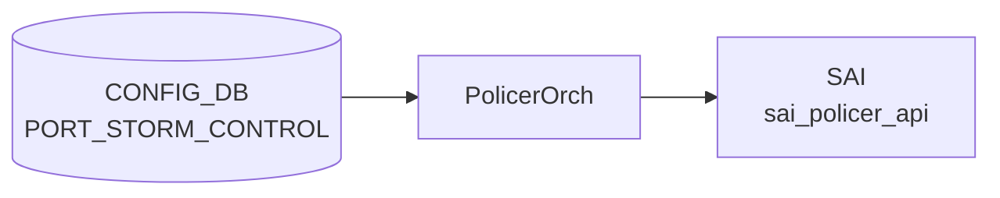

# PORT_STORM_CONTROL テーブル

## 概要

物理ポートで BUM (broadcast / unknown-unicast / unknown-multicast) トラフィックのレート制限 (storm control) を設定するテーブル[^1]。
3 種類のトラフィックに対して個別にレートを指定でき、`orchagent` が [SAI](../../reference/glossary.md#term-sai) `SAI_PORT_ATTR_*_STORM_CONTROL_POLICER_ID` 系で [SAI](../../reference/glossary.md#term-sai) policer を作って attach する。

<!-- cdb-mermaid -->
### データフロー (自動生成)



!!! note "凡例"
    CONFIG_DB から SAI までの典型経路を `docs/reference/config-db-orch-map.md` から機械生成したミニ図。詳細・例外は本ページ本文と対応表を参照。
<!-- /cdb-mermaid -->

## key 構造

```text
PORT_STORM_CONTROL|<ifname>|<storm_type>
```

- `<ifname>`: `PORT.name` への leafref (物理ポートのみ。[LAG](../../reference/glossary.md#term-lag) / [VLAN](../../reference/glossary.md#term-vlan) は非対応)
- `<storm_type>`: `broadcast` / `unknown-unicast` / `unknown-multicast` のいずれか

## フィールド

| フィールド | 型 | 説明 |
|-----------|----|------|
| `kbps` | uint64 (0..100000000) | レート制限 [kbps]。0 で無制限相当 (実装依存) |

## 制約

- `ifname` は `PORT_LIST.name` への leafref のため、PORT に存在しないインタフェースは指定不可
- 3 種類の storm_type を別々のエントリで設定する
- range 上限 100 Gbps 相当 (実装側でハードウェア上限による更なる制約あり)

## 購読者

- `orchagent` (`PortsOrch` の storm-control パス)。内部で [SAI](../../reference/glossary.md#term-sai) policer を作成し、`ATTR_BROADCAST_STORM_CONTROL_POLICER_ID` / `UNKNOWN_UNICAST_STORM_CONTROL_POLICER_ID` / `UNKNOWN_MULTICAST_STORM_CONTROL_POLICER_ID` を更新

## 関連 CONFIG_DB / YANG / CLI

- 関連 [CONFIG_DB](../../reference/glossary.md#term-config_db): `PORT`, `POLICER`
- 関連 CLI: `config interface storm-control <type> <ifname> <kbps>`
- 関連 [YANG](../../reference/glossary.md#term-yang): `sonic-storm-control`

<!-- ref-triangle:start -->

## 関連リファレンス

- [YANG](../../reference/glossary.md#term-yang): [`sonic-storm-control`](../yang/sonic-storm-control.md)

<!-- ref-triangle:end -->

## 引用元

[^1]: [YANG](../../reference/glossary.md#term-yang) 定義: `sonic-storm-control.yang`. <https://github.com/sonic-net/sonic-buildimage/blob/9ea932ec2e18f35e58268ec2e4456b1d4afd65cd/src/sonic-yang-models/yang-models/sonic-storm-control.yang>

## 関連ページ
- [CONFIG_DB: PORT](port.md)
- [CONFIG_DB: POLICER](policer.md)

<!-- ops-hint -->
## 運用ヒント

### 典型値

- key 形式: `PORT_STORM_CONTROL|<Ethernet>|<traffic-type>` (broadcast/unknown-unicast/unknown-multicast)`。
- `kbps`: 帯域上限。サーバ向けは 1000〜10000kbps、uplink は無効化することが多い。

### よくある誤設定

- uplink にも storm-control を当てて BUM トラフィックを誤遮断する。

### 確認コマンド

```bash
sonic-db-cli CONFIG_DB keys 'PORT_STORM_CONTROL|*'
show storm-control all
```
<!-- /ops-hint -->

<!-- glossary-links-injected: 16a5b728a75a -->
