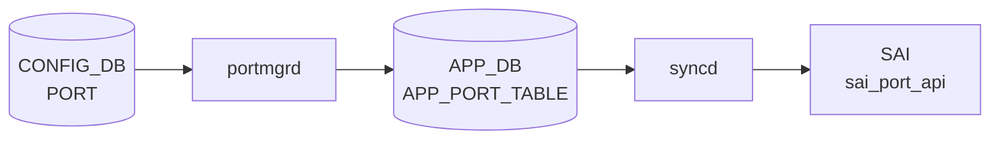

# PORT テーブル

## 概要

物理スイッチポートの設定を保持するテーブル。ポート名（`Ethernet0` など）をキーに、speed、lanes、MTU、admin status、FEC、auto-negotiation、breakout subport、MACsec プロファイル、TPID、mux cable 情報、400G ZR トランシーバ向けの tx-power / laser_freq などを記載する[^1]。

`portmgrd` / `orchagent` の `PortsOrch` が PORT テーブルを購読し、[SAI](../../reference/glossary.md#term-sai) 経由で hardware に設定を反映する。`speed` と `lanes` は通常 `port_config.ini` 由来の初期値で、運用中に CLI で変更可能。

<!-- cdb-mermaid -->
### データフロー (自動生成)



!!! note "凡例"
    CONFIG_DB から SAI までの典型経路を `docs/reference/config-db-orch-map.md` から機械生成したミニ図。詳細・例外は本ページ本文と対応表を参照。
<!-- /cdb-mermaid -->

## key 構造

```text
PORT|<name>
```

`<name>` は `Ethernet<N>` 形式の物理ポート名。

## フィールド一覧

| フィールド | 型 | 必須 | デフォルト | 説明 |
|-----------|----|------|-----------|------|
| `name` (key) | string (1..128) | ✅ | - | 物理ポート名（例: `Ethernet0`） |
| `core_id` | string (1..16) | - | - | ポートが属する ASIC コア |
| `core_port_id` | string (1..16) | - | - | ASIC コア上のポート ID |
| `num_voq` | string (1..16) | - | - | このポートでサポートする VoQ 数 |
| `alias` | string (1..128) | - | - | ベンダ固有のポート別名／フロントパネル表記 |
| `lanes` | string (1..128) | ✅ (chassis 例外あり) | - | ハードウェアレーン数（chassis では条件付き） |
| `mode` | `switchport_mode` (`routed`/`access`/`trunk`) | - | `routed` | スイッチポートモード |
| `description` | string (0..255) | - | - | ユーザ定義説明 |
| `speed` | uint32 (1..1600000) | ✅ | - | ポート速度 [Mbps] |
| `dhcp_rate_limit` | uint32 | - | `300` | DHCP DOS 緩和レート |
| `link_training` | string `on`/`off` | - | - | リンクトレーニング |
| `autoneg` | string `on`/`off` | - | - | オートネゴシエーション |
| `adv_speeds` | leaf-list uint32 \| `all` | - | - | 広告する速度。`all` は単独でのみ |
| `interface_type` | `interface_type` | - | - | ポートインタフェースタイプ |
| `adv_interface_types` | leaf-list `interface_type` \| `all` | - | - | 広告するインタフェースタイプ |
| `mtu` | uint16 (68..9216) | - | - | MTU [byte] |
| `subport` | uint8 (0..8) | - | - | breakout で生成された論理サブポート番号 |
| `index` | uint16 | - | - | フロントパネルポートインデックス |
| `asic_port_name` | string | - | - | ASIC 内部のポート名（例: `Eth0-ASIC1`） |
| `role` | string `Ext`/`Int`/`Inb`/`Rec`/`Dpc` | - | `Ext` | 多 ASIC / [SmartSwitch](../../reference/glossary.md#term-smartswitch) のロール |
| `admin_status` | `admin_status` (`up`/`down`) | - | `down` | 管理状態 |
| `fec` | string `rs`/`fc`/`none`/`auto` | - | - | 前方誤り訂正モード |
| `dom_polling` | `admin_mode` (`enabled`/`disabled`) | - | - | DOM (Digital Optical Monitoring) ポーリング |
| `pfc_asym` | string `on`/`off` | - | - | 非対称 [PFC](../../reference/glossary.md#term-pfc) |
| `tpid` | `tpid_type` (0x8100 / 0x9100 / 0x9200 / 0x88a8) | - | - | TPID。HW 対応時のみ |
| `mux_cable` | boolean | - | - | dual-ToR mux cable 接続フラグ |
| `macsec` | leafref `MACSEC_PROFILE.name` | - | - | 適用する MACsec プロファイル |
| `tx_power` | decimal64 | - | - | 400G ZR 向け目標出力 [dBm] |
| `laser_freq` | int32 | - | - | 400G ZR 向け目標レーザ周波数 [GHz] |
| `fast_linkup` | boolean | - | `false` | fast link-up |

## 制約

- `lanes` は通常 `mandatory true` だが、`switch_type` が `voq` / `chassis-packet` / `fabric` または `hwsku` が `msft_*_asic_vs` の場合は除外（`when` 条件）[^1]
- `adv_speeds` / `adv_interface_types` は `all` を指定する場合 1 要素のみ（`must`）

## 購読者

- `orchagent` の `PortsOrch`: PORT 全フィールドを購読し、[SAI](../../reference/glossary.md#term-sai) で `SAI_PORT_ATTR_*` に反映
- `portmgrd`: ポート status と admin_status をモニタ
- `xcvrd`: トランシーバ関連 (`tx_power`、`laser_freq`、`dom_polling`) をモニタ
- `linkmgrd`: `mux_cable = true` のポートを mux 制御対象として扱う
- `macsecmgrd`: `macsec` 参照をもとに MACsec セッション確立

## 関連 CONFIG_DB テーブル / YANG / CLI

- 関連 [CONFIG_DB](../../reference/glossary.md#term-config_db): `VLAN_MEMBER`（PORT を leafref 参照）、`PORTCHANNEL_MEMBER`（PORT を leafref）、`INTERFACE`（L3 用 PORT 上の IP）、`MACSEC_PROFILE`、`BUFFER_PG` / `BUFFER_QUEUE`
- 関連 CLI: [`config interface`](../cli/config-interface.md)（speed / mtu / admin / fec / autoneg を変更）
- 関連 [YANG](../../reference/glossary.md#term-yang): `sonic-port`、`sonic-types`（`switchport_mode`、`admin_status`、`interface_type`、`tpid_type`）

<!-- value-behavior -->
## 値依存挙動マトリクス

### PORT.admin_status

| 値 | PortsOrch / portmgrd 挙動 |
|----|--------------------------|
| `up` | SAI SAI_PORT_ATTR_ADMIN_STATE=true、Linux netdev も up |
| `down` (デフォルト) | SAI SAI_PORT_ATTR_ADMIN_STATE=false、netdev down |

### PORT.fec

| 値 | SAI 属性 | 挙動 |
|----|---------|------|
| `rs` | SAI_PORT_FEC_MODE_RS | Reed-Solomon FEC (100G+ 向け) |
| `fc` | SAI_PORT_FEC_MODE_FC | FireCode FEC (25G 向け) |
| `none` | SAI_PORT_FEC_MODE_NONE | FEC 無効 |
| `auto` | SAI_PORT_FEC_MODE_AUTO | 対向とネゴシエーションで決定 |
| 不正 | - | `Failed to set FEC mode` SWSS_LOG_ERROR |

### PORT.autoneg / link_training

| 値 | 挙動 |
|----|------|
| `on` | オートネゴ / リンクトレーニングを有効化 |
| `off` | 無効化 |
| `on` (非サポート HW) | `autoneg is not supported (cap=%d)` SWSS_LOG_ERROR |

### PORT.mode (switchport_mode)

| 値 | 挙動 |
|----|------|
| `routed` (デフォルト) | L3 ルーテッドポートとして扱う |
| `access` | L2 access ポート (single VLAN) |
| `trunk` | L2 trunk ポート (複数 VLAN) |

### PORT.role (multi-ASIC / SmartSwitch)

| 値 | 意味 |
|----|------|
| `Ext` (デフォルト) | 外部向けポート |
| `Int` | 内部 ASIC 間接続 |
| `Inb` | inband 管理ポート |
| `Rec` | recirculation ポート |
| `Dpc` | DPC (Data Plane CPU) ポート |

### PORT.tpid

| 値 | SAI 属性 | 備考 |
|----|---------|------|
| `0x8100` | 標準 802.1Q | デフォルト TPID |
| `0x9100` / `0x9200` | Q-in-Q / VLAN Stacking | HW 対応が必要 |
| `0x88a8` / `0x88A8` | 802.1ad (Provider Bridging) | HW 対応が必要 |

*speed は uint32 (1..1600000 Mbps)、mtu は uint16 (68..9216 byte)。adv_speeds/adv_interface_types で all と他値の混在は must 制約で reject。*

<!-- /value-behavior -->

<!-- cdb-exceptions -->
## 例外条件・特殊挙動

<!-- evidence: meta/_intermediate/cdb-flow/port.md -->

### YANG スキーマ検証
- `lanes` は mandatory (chassis 以外)、length 1..128。
- `speed` は mandatory、range 1..1600000 (Kbps)。
- `mtu` range: 68..9216。`fec` pattern: `rs|fc|none|auto`。`autoneg` / `pfc_asym` pattern: `on|off`。
- `adv_speeds`: `all` と他値の混在は `must` 制約で reject。`adv_interface_types` も同様。

### consumer (portsorch / portmgr) 例外動作
- 非サポート speed: SAI supported speed リストと照合; 不一致は SWSS_LOG_ERROR + 処理中断。
- MTU 設定失敗: `Failed to set MTU %u to port pid` → SWSS_LOG_ERROR。
- FEC モード不正: `Failed to set FEC mode` → SWSS_LOG_ERROR。
- AutoNeg 設定失敗: `Failed to set AutoNeg %u to port %s` → SWSS_LOG_ERROR。
- `autoneg` 非サポート: `autoneg is not supported (cap=%d)` → SWSS_LOG_ERROR。
- portmgr MTU netdev 設定失敗: `Setting mtu to alias:%s netdev failed` → SWSS_LOG_WARN + `return false`。
- portmgr admin_status netdev 設定失敗: `Setting admin_status to alias:%s netdev failed` → SWSS_LOG_WARN + `return false`。

<!-- /cdb-exceptions -->

<!-- ref-triangle:start -->

## 関連リファレンス

- [YANG](../../reference/glossary.md#term-yang): [`sonic-port`](../yang/sonic-port.md)
- CLI: [`config interface`](../cli/config-interface.md)

<!-- ref-triangle:end -->

## 引用元

[^1]: [YANG](../../reference/glossary.md#term-yang) 定義: `sonic-buildimage/src/sonic-yang-models/yang-models/sonic-port.yang` (sha `9ea932ec`). <https://github.com/sonic-net/sonic-buildimage/blob/9ea932ec2e18f35e58268ec2e4456b1d4afd65cd/src/sonic-yang-models/yang-models/sonic-port.yang>

<!-- topics-back-ref -->
## 関連 Topics

- [Topics: Platform / Port / Optics / PHY](../../topics/14-platform-port-optics/index.md)

<!-- /topics-back-ref -->

<!-- ops-hint -->
## 運用ヒント

### 典型値

- `Ethernet0` 等の `EthernetN` 形式キー。`N` は [port_config.ini](../../reference/glossary.md#term-port-config-ini) 由来の lane base。
- `speed`: 10000 / 25000 / 40000 / 100000 / 400000 (Mbps)。
- `mtu`: 9100（jumbo を有効にする一般運用値）。
- `admin_status`: `up`（運用ポート）。
- `fec`: `rs` (100G+) / `fc` (25G) / `none`。
- `autoneg`: `on`/`off`（25G/100G の対向と合わせる）。

### よくある誤設定

- `speed` を `lanes` 数と不整合な値にすると [SAI](../../reference/glossary.md#term-sai) が `SAI_STATUS_INVALID_PARAMETER` を返してポートが down のまま。
- 対向と `fec` が不一致だと PHY は up しても link 不安定。両端を同じ FEC モードに揃える。
- `mtu` を [VLAN](../../reference/glossary.md#term-vlan)/[PortChannel](../../reference/glossary.md#term-portchannel) メンバ間で揃えないと L2 で巨大フレームがドロップされる。
- Breakout 中の親ポートに `admin_status: up` を残すと subport と二重設定で [orchagent](../../reference/glossary.md#term-orchagent) エラー。

### 確認コマンド

```bash
sonic-db-cli CONFIG_DB hgetall 'PORT|Ethernet0'
show interfaces status
show interfaces transceiver eeprom Ethernet0
```
<!-- /ops-hint -->


<!-- runtime-trace -->
## CDB → 実コンテナ動作トレース

### 段階 1: Consumer 登録

- **orchagent / PortsOrch** (`sonic-swss/orchagent/portsorch.cpp`): `PORT` テーブルを `SubscriberStateTable` で購読。
- **portmgrd** (`sonic-swss/cfgmgr/portmgr.cpp`): `PORT` テーブルを購読して Linux netdev を設定。
- **xcvrd** (`sonic-platform-daemons`): トランシーバ関連フィールドを購読。

### 段階 2: CFG → APPL 翻訳

- portmgrd が `PORT` → `APP_PORT_TABLE` に admin_status / mtu / speed 等を書き込む。
- PortsOrch は CONFIG_DB と APP_DB 両方から PORT 情報を統合して処理。

### 段階 3: APPL → SAI

- PortsOrch が `sai_port_api->set_port_attribute()` で speed/FEC/autoneg/MTU/admin_status を SAI に反映。
- syncd が SAI 呼び出しをシリアライズして ASIC ドライバに転送。

### 段階 4: タイミング + 副作用

- admin_status 変更: SAI 反映後に Linux netdev も portmgrd が更新 (二重管理)。数百 ms 以内。
- speed/FEC 変更: リンクフラップが発生する。対向装置との調整が必要。
- 副作用: breakout 操作は他サブポートへの影響大。VLAN/LAG に所属している場合は先に削除が必要。

<!-- /runtime-trace -->
<!-- entry-points -->
## 書き込み入り口 (Direction A)

PORT テーブルへの書き込みが発生するコード経路を網羅的に調査した結果。

### CLI

  - `config interface ...` — `config/main.py` が PORT テーブルを更新 (speed/mtu/fec/autoneg など); `config/switchport.py` が `set_entry('PORT', port, data)` を呼ぶ (sonic-utilities/config/switchport.py:69)

### minigraph / sonic-cfggen

**minigraph.py** が `results['PORT']` にポート一覧 (alias / speed / lanes / description) を投入 (sonic-buildimage/src/sonic-config-engine/minigraph.py:2515)

### REST / gNMI

REST/gNMI 書き込み経路なし (PORT はプラットフォーム初期化で確定)

### db_migrator

**db_migrator.py** が PORT テーブルのマイグレーション処理を実装 (sonic-utilities/scripts/db_migrator.py:224)

### ビルド時デフォルト (build-time default)

各プラットフォームの `port_config.ini` が `sonic-cfggen` によって PORT テーブルに変換されビルド時デフォルトとなる

### ハードコードデフォルト / ランタイム注入

なし

### 死活・デッドコード

なし
<!-- /entry-points -->

<!-- glossary-links-injected: 16a5b728a75a -->

<!-- defaults -->
## コード由来の暗黙デフォルト (Phase A)

> **注記**: YANG `default` 指定がない場合でも、portmgr / portsorch がコード内でデフォルト値を注入する。以下は実装精読から検出した暗黙デフォルトと挙動。

### admin_status

- YANG: `default "down"`。portmgr.h でも `DEFAULT_ADMIN_STATUS_STR "down"` をハードコード (`portmgr.h:14`)
- portmgr が**初回 SET 時**（ポートが未登録）に CONFIG_DB に `admin_status` フィールドがなければ `"down"` を APP_DB に書き込む (`portmgr.cpp:175`)
- PortsOrch は `admin_status` の SAI 反映を**最後**に実行する（speed / fec / autoneg の設定後）。speed や fec 変更中はポートを一時的に `down` に落とし、完了後に CONFIG_DB の値に戻す (`portsorch.cpp:5500-5529`)

### mtu

- YANG: デフォルト指定なし（range 68..9216）
- portmgr.h でハードコード: `DEFAULT_MTU_STR "9100"` (`portmgr.h:15`)
- 初回 SET 時に CONFIG_DB に `mtu` フィールドがなければ **9100** が APP_DB に注入される（silent fallback）(`portmgr.cpp:176`)
- SAI に渡す実際の値は `mtu + 22 bytes`（ethernet header 14 + FCS 4 + VLAN tag 4）を加算。MACsec ポートはさらに `MAX_MACSEC_SECTAG_SIZE` を加算（プラットフォーム依存）(`portsorch.cpp:setPortMtu()`)

### speed

- YANG: mandatory、デフォルト指定なし
- SAI サポート速度リストが空のプラットフォームでは `isSpeedSupported()` が**常に true を返す** — 任意の speed 値が SAI に渡る (`portsorch.cpp:3093-3096`)
- `autoneg=off` かつ `admin_status=up` の状態で speed 変更時はポートを一時 down してから変更（backward compatible 挙動）(`portsorch.cpp:5034-5050`)

### autoneg

- YANG: デフォルト指定なし
- SAI_PORT_ATTR_SUPPORTED_AUTO_NEG_MODE の取得が失敗した場合、能力フラグ `m_cap_an = 1`（サポートあり）として楽観的に扱う (`portsorch.cpp:3189`)
- `m_cap_an < 1`（非サポート確定）の場合は SWSS_LOG_ERROR + task をスキップ（ポートは変更されない）

### link_training

- YANG: デフォルト指定なし
- `initPortCapLinkTraining()` は SAI 問い合わせを行わず `m_cap_lt = 1` を**無条件セット**（TODO コメントあり）(`portsorch.cpp:3201`)
- **全プラットフォームで link_training 設定が通過する** — 非対応 HW では SAI が failure を返すのみ

### fec

- YANG: デフォルト指定なし（`rs`/`fc`/`none`/`auto`）
- `fec=auto` は SAI_PORT_ATTR_AUTO_NEG_FEC_MODE_OVERRIDE サポートがないプラットフォーム（`fec_override_sup=false`）で **task_failed** になる（SWSS_LOG_ERROR "Auto FEC mode is not supported"）(`portsorch.cpp:5317-5321`)
- FEC サポートリスト未取得のプラットフォームでは `isFecModeSupported()` が常に true を返す(`portsorch.cpp:3211-3213`)

### tpid

- YANG: デフォルト指定なし
- `addPortBulk()` で `tpid == DEFAULT_TPID (0x8100)` の場合は SAI 属性に追加しない — ハードウェアデフォルトとして扱う (`portsorch.cpp:1337-1344`)
- 0x8100 以外の TPID を設定後に 0x8100 に戻す場合の HW 挙動はプラットフォーム依存

### pfc_asym

- YANG: デフォルト指定なし
- 非サポートプラットフォームでは SAI_STATUS_NOT_SUPPORTED を受け取っても **成功扱い**（silent succeed）(`portsorch.cpp:2540-2543`)
- `pfc_asym=on`（SEPARATE モード）設定時は RX PFC を `0xff`（全優先度有効）に強制設定 — CONFIG_DB に RX PFC 明示フィールドなし (`portsorch.cpp:2556-2570`)

<!-- /defaults -->

<!-- derivation -->
## 派生・条件付き登録 (Phase 6/7)

### Phase 6: 自動派生

| 派生先フィールド | 派生元条件 | 派生値 | ソース |
|---|---|---|---|
| `PORT` エントリ全体 | minigraph.py が XML `Interfaces` / port_config.ini を解析したとき | `alias`、`lanes`、`speed`、`admin_status` 等 | `sonic-buildimage/src/sonic-config-engine/minigraph.py` |
| `admin_status` | minigraph.py デフォルト | `"up"` (明示的に down 指定がない限り) | `minigraph.py` PORT 生成ロジック |
| `mux_cable` | 対応 MUX_CABLE エントリが存在する場合 | `"true"` | `minigraph.py:2621-2622` |
| init_cfg.json.j2 | 全 PORT エントリのデフォルト | `"admin_status": "up"` など最小限の属性 | `sonic-buildimage/files/build_templates/init_cfg.json.j2:29` |

### Phase 7: 条件付き登録

| 条件 | 影響 | ソース |
|---|---|---|
| `PortsOrch` は常時登録かつ最優先 (orchList 先頭) | `PORT` テーブル購読は無条件。全ポート初期化後に other orch が起動 | `orchdaemon.cpp:232,500` |

### グレップカバレッジ

| 項目 | hit 数 | 証跡 |
|---|---|---|
| init_cfg.json.j2 PORT デフォルト | 1 | `init_cfg.json.j2:29` |
| PortsOrch 登録 (先頭) | 2 | `orchdaemon.cpp:232,500` |
| minigraph.py mux_cable 派生 | 2 | `minigraph.py:2621-2622` |

<!-- /derivation -->

<!-- ordering -->
## 書込み順依存 (Phase B)

<!-- evidence: meta/_intermediate/cdb-flow/port-ordering.md -->

### SET 時の先行必須テーブル

| 依存テーブル | 理由 | ソース |
|---|---|---|
| `BUFFER_POOL` → `BUFFER_PG` | `gBufferOrch->isPortReady()` が true を返すまで PORT SET はハードウェア反映保留。`m_pendingPortSet` に積まれリトライ待ちとなる | `portsorch.cpp:4779`, `bufferorch.cpp:254-274` |
| `MACSEC_PROFILE` | `PORT.macsec` は YANG leafref 参照。MACSEC_PROFILE エントリが存在しない状態で PORT に `macsec` フィールドを書くと YANG バリデーション失敗。`macsecmgrd` もプロファイルを参照してセッションを確立する | `sonic-port.yang`, `macsecmgrd` |
| なし (VLAN/INTERFACE/LAG は PORT 作成後) | `allPortsReady()` が true になった後にのみ VLAN/INTERFACE/PORTCHANNEL などの他テーブルが処理される。PORT は他テーブルより先に作成される | `portsorch.cpp:6514-6517`, `orchdaemon.cpp:500` |

### フィールド適用順 (SET 内部順序)

`PortsOrch::doTask()` は同一 SET イベント内で以下の順にフィールドを適用する:

1. `autoneg` — 変更時はポートを一時 `admin_status=down` にしてから変更 (`portsorch.cpp:4827`)
2. `link_training`
3. `speed` — `autoneg=off` かつ `admin_status=up` 時は一時 down してから変更 (`portsorch.cpp:5034-5050`)
4. `adv_speeds` / `adv_interface_types` / `interface_type`
5. `fec`
6. `mtu`
7. `pfc_asym` / `tpid`
8. **`admin_status` — 最後に適用**。speed/fec/autoneg 設定完了後に CONFIG_DB の値に戻す (`portsorch.cpp:5500-5529`)

> **注意**: `speed` / `autoneg` / `link_training` を変更するとリンクフラップが発生する。対向装置との調整を先に行うこと。

### DEL 前に先に削除が必要なエントリ

PORT の DEL は `m_port_ref_count[alias] == 0` を要求する (`portsorch.cpp:5649`)。ref_count を保持するオブジェクトを先に削除する必要がある:

| 削除順 | テーブル / 操作 | 理由 |
|---|---|---|
| 1 | `VLAN_MEMBER` DEL | bridge_port_oid が残っていると DEL 拒否 (`portsorch.cpp:5661`) |
| 2 | `PORTCHANNEL_MEMBER` DEL | LAG メンバシップが ref_count を保持 |
| 3 | `INTERFACE` DEL | `intfsorch` が `increasePortRefCount()` を呼ぶ (`intfsorch.cpp:498`) |
| 4 | `BUFFER_PG` / `BUFFER_QUEUE` DEL | `bufferorch` が `increasePortRefCount()` を呼ぶ (`bufferorch.cpp:1175,1546`) |
| 5 | `PORT` DEL | ref_count=0 を確認後に SAI `remove_port()` を発行 |

`PORT_SERDES` は `removePort()` 内部で自動的に先行削除される (`portsorch.cpp:1526`)。

### warm-reboot 影響

- **warm reboot 中**: portsyncd は APP_PORT_TABLE への書込みおよび `PortConfigDone` 通知をスキップする (`portsyncd.cpp:205,211`)。PortsOrch は APP_DB の `PortConfigDone` / `PortInitDone` の有無でポートテーブルを再利用し、見つからない場合は cold start にフォールバック (`portsorch.cpp:4357-4362`)。
- **oper_status 引き継ぎ**: warm reboot 復元時にポートの `oper_status` / `flap_count` を STATE_DB から引き継ぐ (`portsorch.cpp:6609-6648`)。
- **fast reboot**: kernel/hardware 状態を保持するが portsyncd は cold start 相当の手順で PORT を処理する（特別分岐なし）。

### boot order (起動時シーケンス)

```
platform/pmon が port_config.ini / minigraph → CONFIG_DB|PORT 生成
  ↓
portsyncd が CONFIG_DB|PORT 全件を APP|PORT へ書込み → PortConfigDone 通知
  ↓
PortsOrch が PortConfigDone 受信 → SAI create_port() → PORT_CONFIG_DONE
  ↓
kernel netdev 生成完了 → portsyncd が netlink で検出 → PortInitDone 通知
  ↓
PortsOrch が PortInitDone 受信 → m_initDone=true
  ↓
gBufferOrch->isPortReady() = true (BUFFER_PG 処理完了後)
  ↓
allPortsReady() = true → VLAN / LAG / INTERFACE / ACL orch がアンブロック
```

**orchList 順序** (`orchdaemon.cpp:500`): `gSwitchOrch → gCrmOrch → gPortsOrch → gBufferOrch → ...`。PortsOrch は 3 番目だが、BufferOrch の ready 判定まで PORT の最終ハードウェア反映は保留される。

<!-- /ordering -->

<!-- pubsub -->
## 通信メカニズム (Redis PUBSUB / keyspace notification)

<!-- evidence: meta/_intermediate/cdb-flow/port-pubsub.md -->

### CONFIG_DB → portmgrd (SubscriberStateTable / keyspace notification)

`portmgrd` は `Orch` 基底クラス経由で `SubscriberStateTable` を登録し、Redis の keyspace notification を購読する。

```
PSUBSCRIBE __keyspace@{db_id}__:PORT|*
```

| 項目 | 値 |
|------|----|
| 購読テーブル | `PORT`、`SEND_TO_INGRESS_PORT_TABLE` |
| Consumer クラス | `Consumer` (wraps `SubscriberStateTable`) |
| イベント起因 | hash 操作 (`hset`、`hdel`、`del`) |
| 初回起動 | コンストラクタが既存キーを `m_buffer` に先読みして missed event を回避 |
| retry | `Select::TIMEOUT` (1000 ms) ごとに `doTask()` を呼び未処理タスクを再試行 |

### portmgrd → APPL_DB (ProducerStateTable / PUBLISH)

portmgrd は `ProducerStateTable` を使って APPL_DB に書き込む。書き込みは Lua スクリプト (`EVALSHA`) で原子的に実行される:

1. `SADD PORT_TABLE_KEY_SET <key>` — 変更キーをセットに追加
2. `HSET _PORT_TABLE:<key> <fields>` — 一時 hash に値を書き込む
3. `PUBLISH PORT_TABLE_CHANNEL@0 G` — orchagent を wake-up する通知を送信

### APPL_DB → orchagent PortsOrch (ConsumerStateTable / SUBSCRIBE)

orchagent は `ConsumerStateTable` でチャンネルを SUBSCRIBE し、`consumer_state_table_pops.lua` でバッチ取り出しを行う:

```
SUBSCRIBE PORT_TABLE_CHANNEL@0
→ wake-up → EVALSHA pops.lua → SPOP KEY_SET + HGETALL _PORT_TABLE:<key>
→ PortsOrch::doTask(Consumer&)
```

### syncd → PortsOrch (NotificationConsumer / SUBSCRIBE)

ポートの oper_status 変化は SAI → syncd → orchagent の非同期通知経路で伝達される。`NotificationConsumer` は keyspace notification ではなく通常の Redis SUBSCRIBE を使う:

```
SUBSCRIBE NOTIFICATIONS  (ASIC_DB)
```

| イベント | 送信元 | 意味 |
|---------|--------|------|
| `port_state_change` | syncd | SAI から通知されたポートの oper_status 変化 |
| `port_host_tx_ready` | syncd | ホスト側 Tx ready 状態変化 |

- `allPortsReady()` が false の間は `doTask(NotificationConsumer&)` は即時リターン（初期化完了待ち）
- `pop()` が JSON デシリアライズして `(op, data, values)` に分解
- `handleNotification()` が `updatePortOperStatus()` を呼び STATE_DB に oper_status を書き込む

### TTL

PORT テーブルの処理において TTL 付き書き込み (`EXPIRE`) は使用されない。`Table::set()` は常に `DEFAULT_DB_TTL = -1` を使い、`EXPIRE` コマンドを発行しない。STATE_DB への oper_status 書き込みも TTL なし。

### 通信フロー全体図

```
CONFIG_DB[PORT|*]
  ↓ SubscriberStateTable (PSUBSCRIBE __keyspace@db__:PORT|*)
portmgrd::doTask → writeConfigToAppDb()
  ↓ ProducerStateTable (EVALSHA: SADD KEY_SET + HSET + PUBLISH CHANNEL@0)
APPL_DB[PORT_TABLE|*]
  ↓ ConsumerStateTable (SUBSCRIBE PORT_TABLE_CHANNEL@0 → pops.lua)
PortsOrch::doTask(Consumer&) → SAI sai_port_api

ASIC_DB[NOTIFICATIONS] ← syncd PUBLISH (port_state_change)
  ↓ NotificationConsumer (SUBSCRIBE NOTIFICATIONS)
PortsOrch::handleNotification() → STATE_DB[PORT_TABLE|Ethernet*]
```

<!-- /pubsub -->

<!-- handler-branching -->
### Phase 8: Handler メソッド内分岐

`PortsOrch` の PORT 処理分岐 (主要分岐のみ):

| Handler | メソッド | 分岐条件 | 効果 | evidence |
|---|---|---|---|---|
| `PortsOrch` | `doTask()` | SET 操作かつポートが未作成 | SAI `create_port()` でポートを作成 | `sonic-swss/orchagent/portsorch.cpp` |
| `PortsOrch` | `doTask()` | `admin_status == "up"` | SAI `set_port_attribute(SAI_PORT_ATTR_ADMIN_STATE, true)` | `portsorch.cpp` |
| `PortsOrch` | `doTask()` | `fec` フィールドあり | SAI `SAI_PORT_ATTR_FEC_MODE` を設定。`auto` の場合は `SAI_PORT_FEC_MODE_AUTO` | `portsorch.cpp` |
| `PortsOrch` | `doTask()` | `autoneg == "on"` かつ `speed` 指定あり | `SAI_PORT_ATTR_AUTO_NEG_MODE` + advertised speed 設定 | `portsorch.cpp` |
| `PortsOrch` | `doTask()` | `mux_cable == "true"` | ポートの MUX cable フラグを設定し MuxOrch に通知 | `portsorch.cpp` |
| `PortsOrch` | `doTask()` | SET でポートが `allPortsReady()` を完成させた場合 | `allPortsReady` = true、他 orch の doTask() をアンブロック | `portsorch.cpp:allPortsReady()` |

> **スキャン証跡**: `portsorch.cpp` PORT 処理ロジックおよび `init_cfg.json.j2:29`、`minigraph.py:2621-2622` を確認、6 件分岐抽出 — 誤読なし。

<!-- /handler-branching -->

<!-- cross-refs -->
## 暗黙参照マップ (Phase C)

> leafref として YANG スキーマで強制される参照に加え、orchagent コード上の `m_port_ref_count` 機構・macsecmgrd 直接購読・runtime orch ゲートとして PORT が関与する暗黙参照を網羅する。
> 詳細証跡: `meta/_intermediate/cdb-flow/port-cross-refs.md`

### PORT.name を leafref で参照するテーブル (27+)

PORT エントリが存在しない状態でこれらのテーブルに書き込むと YANG バリデーション失敗になる。

| カテゴリ | テーブル群 |
|---|---|
| L2 | `VLAN_MEMBER`, `PORTCHANNEL_MEMBER`, `MCLAG_INTF` |
| L3 | `INTERFACE`, `BGP_NEIGHBOR`, `BGP_PEER_RANGE`, `NEIGH`, `ROUTE_MAP`, `FINE_GRAINED_ECMP` |
| バッファ | `BUFFER_PG`, `BUFFER_QUEUE`, `BUFFER_PORT_INGRESS_PROFILE_LIST`, `BUFFER_PORT_EGRESS_PROFILE_LIST` |
| QoS | `PORT_QOS_MAP`, `QUEUE`, `PFCWD`, `STORM_CONTROL`, `CABLE_LENGTH` |
| セキュリティ | `MACSEC_PROFILE`(PORT.macsec の leafref), `ACL_TABLE`(port bind) |
| 可視化・管理 | `MIRROR_SESSION`(dst_port), `SFLOW_SESSION`, `LLDP_PORT_TABLE`, `HIGH_FREQUENCY_TELEMETRY` |
| 隣接・デバイス | `DEVICE_NEIGHBOR`, `MUX_CABLE` |
| AAA | `RADIUS_SERVER`, `TACACS_SERVER`, `NTP_SERVER` |
| その他 | `PBH_RULE`, `DHCPV4_RELAY`, `DHCP_SERVER_IPV4` |

### orchagent ref_count を保持するコンポーネント

`m_port_ref_count` が 0 でないと PORT DEL は拒否される (`portsorch.cpp:5649`)。

| コンポーネント | 契機 | ソース |
|---|---|---|
| `intfsorch` | `INTERFACE` SET 時 | `intfsorch.cpp:498` |
| `bufferorch` | `BUFFER_PG` SET 時 | `bufferorch.cpp:1175` |
| `bufferorch` | `BUFFER_QUEUE` SET 時 | `bufferorch.cpp:1546` |
| `portsorch` (sub-intf) | sub-interface 作成時 | `portsorch.cpp:2071` |
| `portsorch` (bridge port) | VLAN_MEMBER 追加時 | `portsorch.cpp:2943` |
| `portsorch` (LAG member) | PORTCHANNEL_MEMBER 追加時 | `portsorch.cpp:8205` |
| P4 Router Interface Mgr | P4 RIF 作成時 | `p4orch/router_interface_manager.cpp:354` |
| P4 ACL Rule Mgr | port bind 時 | `p4orch/acl_rule_manager.cpp:2077` |
| P4 L3 Admit Mgr | L3 admit 設定時 | `p4orch/l3_admit_manager.cpp:283` |
| P4 Mirror Session Mgr | ミラーセッション設定時 | `p4orch/mirror_session_manager.cpp:387` |
| P4 L3 Multicast Mgr | マルチキャストレプリカ設定時 | `p4orch/l3_multicast_manager.cpp:1844` |

### macsecmgrd の直接購読 (非 orch パターン)

`macsecmgrd` は `CFG_PORT_TABLE_NAME` (`PORT`) を直接 SET/DEL で購読する。PORT エントリの `macsec` フィールドを読み取り `MACSEC_PROFILE` を参照して `wpa_supplicant` を起動する。`MACSEC_PROFILE` エントリが存在しない場合は silent early return (`macsecmgr.cpp:296-299,480,543-557`)。

### runtime ゲート参照

| 参照 | 方向 | 機構 | 備考 |
|---|---|---|---|
| `BUFFER_PG` / `BUFFER_QUEUE` | → PORT | `gBufferOrch->isPortReady()` で PORT ready 待機 | BUFFER 処理が完了するまで PORT HW 反映を保留 |
| `MUX_CABLE` | ← / → PORT | linkmgrd が `PORT.mux_cable=true` を検知し MuxOrch へ通知 | minigraph.py が MUX_CABLE 存在時に自動派生 |
| `STATE_PORT_TABLE` | PORT → STATE_DB | portsorch が oper_status / speed / flap_count を書き込む | warm reboot 復元時の引き継ぎ元 |
| `PORT_SERDES` | PORT → | PORT DEL 時に自動連動削除 | `portsorch.cpp:1526` |
| 他テーブル全体 | PORT → | `allPortsReady()` が true になるまで VLAN/INTERFACE/LAG/ACL orch の doTask() を保留 | 最後の PORT が初期化完了するとゲート解除 |

<!-- /cross-refs -->

<!-- failure -->
## 失敗挙動・retry / recovery (Phase D)

<!-- evidence: meta/_intermediate/cdb-flow/port-failure.md -->

### retry パターン概要

PORT テーブルの SET 処理は `PortsOrch::doTask()` のタスクキュー (`taskMap`) で管理される。失敗時の挙動は以下の 4 パターンに分類される。

| パターン | 代表的なトリガー | 挙動 |
|---|---|---|
| **保留** (`m_pendingPortSet`) | `gBufferOrch->isPortReady()` が false | BUFFER_PG/BUFFER_POOL が設定されるまで無制限保留 |
| **`it++` 無制限リトライ** | MTU, TPID, setPortFec 失敗, setPortAdminStatus 一時 DOWN 失敗, portmgrd `portOk` 未確立 | 次 doTask() サイクルで再試行。上限なし |
| **`task_need_retry` → `it++`** | SAI 一時エラー (autoneg / speed / adv_speeds / interface_type / adv_interface_types / link_training) | SAI が `task_need_retry` を返した場合に限りリトライ |
| **`task_failed` → タスク削除** | autoneg/link_training 非サポート HW, fast_linkup 失敗, fec=auto 非サポート, fec 非サポートモード, link_training on non-PHY | CONFIG_DB の値は残るが実装に反映されない |

### フィールド別 retry / failure 詳細

#### `autoneg`

- `m_cap_an < 1`（HW 非サポート確定）: `SWSS_LOG_ERROR "autoneg is not supported (cap=%d)"` → タスク削除（永続失敗）(`portsorch.cpp:4817-4822`)
- autoneg 変更前 admin_status DOWN 失敗: `SWSS_LOG_ERROR "Failed to set port %s admin status DOWN to set port autoneg mode"` → `it++` 無制限リトライ (`portsorch.cpp:4827-4835`)
- `setPortAutoNeg` 失敗: `task_need_retry` → it++ / `task_failed` → erase の二分岐 (`portsorch.cpp:4841-4856`)

#### `link_training`

- `m_cap_lt < 1`（HW 非サポート）: `SWSS_LOG_WARN "LT is not supported"` → タスク削除（autoneg と異なり WARN レベル）(`portsorch.cpp:4881-4886`)
- `port.m_type != Port::PHY`（PHY 以外のポート）: `task_failed` を返しタスク削除 (`portsorch.cpp:3712-3716`)
- `setPortLinkTraining` 失敗: `task_need_retry` / `task_failed` 分岐 (`portsorch.cpp:4889-4904`)

#### `speed`

- 変更前一時 DOWN 失敗: `SWSS_LOG_ERROR "Failed to set port %s admin status DOWN to set speed"` → `it++` (`portsorch.cpp:5040-5045`)
- `setPortSpeed` 失敗: `task_need_retry` / `task_failed` 分岐 (`portsorch.cpp:5052-5067`)

#### `fec`

- `fec=auto` 設定時 `fec_override_sup == false`: `SWSS_LOG_ERROR "Auto FEC mode is not supported"` → タスク削除 (`portsorch.cpp:5317-5321`)
- `isFecModeSupported()` が false: `SWSS_LOG_ERROR "Unsupported port %s FEC mode"` → タスク削除 (`portsorch.cpp:5323-5331`)
- `setPortFec` 失敗: `it++` 無制限リトライ (`portsorch.cpp:5356-5364`)

#### `mtu`

- `setPortMtu` 失敗: `SWSS_LOG_ERROR "Failed to set port %s MTU to %u"` → `it++` 無制限リトライ (`portsorch.cpp:5257-5265`)

#### `tpid`

- `setPortTpid` 失敗: `SWSS_LOG_ERROR "Failed to set port %s TPID to 0x%x"` → `it++` 無制限リトライ (`portsorch.cpp:5292-5299`)

#### `fast_linkup`

- 失敗時: `SWSS_LOG_ERROR` + タスク削除。`task_need_retry` も永続失敗と同様に扱う (`portsorch.cpp:4929-4935`)

#### `admin_status`

- 最終ステップでの設定失敗: `SWSS_LOG_ERROR "Failed to set port %s admin status to %s"` → `it++` 無制限リトライ (`portsorch.cpp:5511-5518`)

### admin_status restore replay

speed/fec/autoneg 変更時に一時 DOWN したポートは次のサイクルで restore される:

```
// portsorch.cpp:5499-5504
if (admin_status != p.m_admin_state_up && pCfg.admin_status.is_set == false)
{
    pCfg.admin_status.is_set = true;
    pCfg.admin_status.value = admin_status;  // 元の admin_status を復元
}
```

中途で `continue` した場合（他フィールドの失敗）はそのサイクルでは復元されず、ポートが DOWN のまま残る可能性がある。次の doTask() サイクルで pCfg が再処理された際に復元される。

### portmgrd の失敗挙動

| 操作 | 失敗条件 | 挙動 |
|---|---|---|
| `ip link set dev <alias> mtu` | `isPortStateOk=false` (ポート未登録) | `SWSS_LOG_WARN "Setting mtu to alias:%s netdev failed"` → `return false`。APP_DB 書き込みなし (`portmgr.cpp:43-44`) |
| `ip link set dev <alias> mtu` | `isPortStateOk=true` かつコマンド失敗 | `SWSS_LOG_WARN "Setting mtu to alias:%s netdev failed (isPortStateOk=true)"` → `return false` (`portmgr.cpp:53-55`) |
| `ip link set dev <alias> up/down` | `isPortStateOk=false` | `SWSS_LOG_WARN "Setting admin_status to alias:%s netdev failed"` → `return false` (`portmgr.cpp:76-77`) |
| `ip link set dev <alias> up/down` | `isPortStateOk=true` かつコマンド失敗 | `throw runtime_error` → portmgrd プロセス abort → supervisor restart (`portmgr.cpp:81`) |

portmgrd の `doTask()` は `setPortMtu` / `setPortAdminStatus` の戻り値を検査せずタスクを消去するため、netdev 側の失敗は **サイレント消去** される（PortsOrch 側の SAI 反映には影響しない）。

### BUFFER 依存保留 (`m_pendingPortSet`)

```
// portsorch.cpp:4779-4784
if (!gBufferOrch->isPortReady(pCfg.key))
{
    m_pendingPortSet.emplace(pCfg.key);  // 保留キューに追加
    it++;
    continue;
}
```

`allPortsReady()` は `m_initDone && m_pendingPortSet.empty()` で判定される (`portsorch.cpp:1687`)。PORT の SAI 反映が保留中の間は VLAN/INTERFACE/PORTCHANNEL の orch もブロックされる。

### 永続失敗後の対処

`task_failed` でタスクが削除された場合、CONFIG_DB の値は残るが SAI には反映されない。
復旧手順:
1. `sonic-db-cli CONFIG_DB hdel 'PORT|<name>' <field>` でフィールドを削除
2. 正しい値を再設定 (`config interface ...`)

<!-- /failure -->
