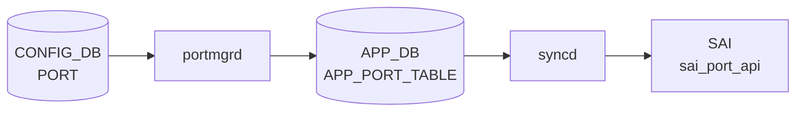

# PORT テーブル

## 概要

物理スイッチポートの設定を保持するテーブル。ポート名（`Ethernet0` など）をキーに、speed、lanes、MTU、admin status、FEC、auto-negotiation、breakout subport、MACsec プロファイル、TPID、mux cable 情報、400G ZR トランシーバ向けの tx-power / laser_freq などを記載する[^1]。

`portmgrd` / `orchagent` の `PortsOrch` が PORT テーブルを購読し、[SAI](../../reference/glossary.md#term-sai) 経由で hardware に設定を反映する。`speed` と `lanes` は通常 `port_config.ini` 由来の初期値で、運用中に CLI で変更可能。

<!-- cdb-mermaid -->
### データフロー (自動生成)



!!! note "凡例"
    CONFIG_DB から SAI までの典型経路を `docs/reference/config-db-orch-map.md` から機械生成したミニ図。詳細・例外は本ページ本文と対応表を参照。
<!-- /cdb-mermaid -->

## key 構造

```text
PORT|<name>
```

`<name>` は `Ethernet<N>` 形式の物理ポート名。

## フィールド一覧

| フィールド | 型 | 必須 | デフォルト | 説明 |
|-----------|----|------|-----------|------|
| `name` (key) | string (1..128) | ✅ | - | 物理ポート名（例: `Ethernet0`） |
| `core_id` | string (1..16) | - | - | ポートが属する ASIC コア |
| `core_port_id` | string (1..16) | - | - | ASIC コア上のポート ID |
| `num_voq` | string (1..16) | - | - | このポートでサポートする VoQ 数 |
| `alias` | string (1..128) | - | - | ベンダ固有のポート別名／フロントパネル表記 |
| `lanes` | string (1..128) | ✅ (chassis 例外あり) | - | ハードウェアレーン数（chassis では条件付き） |
| `mode` | `switchport_mode` (`routed`/`access`/`trunk`) | - | `routed` | スイッチポートモード |
| `description` | string (0..255) | - | - | ユーザ定義説明 |
| `speed` | uint32 (1..1600000) | ✅ | - | ポート速度 [Mbps] |
| `dhcp_rate_limit` | uint32 | - | `300` | DHCP DOS 緩和レート |
| `link_training` | string `on`/`off` | - | - | リンクトレーニング |
| `autoneg` | string `on`/`off` | - | - | オートネゴシエーション |
| `adv_speeds` | leaf-list uint32 \| `all` | - | - | 広告する速度。`all` は単独でのみ |
| `interface_type` | `interface_type` | - | - | ポートインタフェースタイプ |
| `adv_interface_types` | leaf-list `interface_type` \| `all` | - | - | 広告するインタフェースタイプ |
| `mtu` | uint16 (68..9216) | - | - | MTU [byte] |
| `subport` | uint8 (0..8) | - | - | breakout で生成された論理サブポート番号 |
| `index` | uint16 | - | - | フロントパネルポートインデックス |
| `asic_port_name` | string | - | - | ASIC 内部のポート名（例: `Eth0-ASIC1`） |
| `role` | string `Ext`/`Int`/`Inb`/`Rec`/`Dpc` | - | `Ext` | 多 ASIC / [SmartSwitch](../../reference/glossary.md#term-smartswitch) のロール |
| `admin_status` | `admin_status` (`up`/`down`) | - | `down` | 管理状態 |
| `fec` | string `rs`/`fc`/`none`/`auto` | - | - | 前方誤り訂正モード |
| `dom_polling` | `admin_mode` (`enabled`/`disabled`) | - | - | DOM (Digital Optical Monitoring) ポーリング |
| `pfc_asym` | string `on`/`off` | - | - | 非対称 [PFC](../../reference/glossary.md#term-pfc) |
| `tpid` | `tpid_type` (0x8100 / 0x9100 / 0x9200 / 0x88a8) | - | - | TPID。HW 対応時のみ |
| `mux_cable` | boolean | - | - | dual-ToR mux cable 接続フラグ |
| `macsec` | leafref `MACSEC_PROFILE.name` | - | - | 適用する MACsec プロファイル |
| `tx_power` | decimal64 | - | - | 400G ZR 向け目標出力 [dBm] |
| `laser_freq` | int32 | - | - | 400G ZR 向け目標レーザ周波数 [GHz] |
| `fast_linkup` | boolean | - | `false` | fast link-up |

## 制約

- `lanes` は通常 `mandatory true` だが、`switch_type` が `voq` / `chassis-packet` / `fabric` または `hwsku` が `msft_*_asic_vs` の場合は除外（`when` 条件）[^1]
- `adv_speeds` / `adv_interface_types` は `all` を指定する場合 1 要素のみ（`must`）

## 購読者

- `orchagent` の `PortsOrch`: PORT 全フィールドを購読し、[SAI](../../reference/glossary.md#term-sai) で `SAI_PORT_ATTR_*` に反映
- `portmgrd`: ポート status と admin_status をモニタ
- `xcvrd`: トランシーバ関連 (`tx_power`、`laser_freq`、`dom_polling`) をモニタ
- `linkmgrd`: `mux_cable = true` のポートを mux 制御対象として扱う
- `macsecmgrd`: `macsec` 参照をもとに MACsec セッション確立

## 関連 CONFIG_DB テーブル / YANG / CLI

- 関連 [CONFIG_DB](../../reference/glossary.md#term-config_db): `VLAN_MEMBER`（PORT を leafref 参照）、`PORTCHANNEL_MEMBER`（PORT を leafref）、`INTERFACE`（L3 用 PORT 上の IP）、`MACSEC_PROFILE`、`BUFFER_PG` / `BUFFER_QUEUE`
- 関連 CLI: [`config interface`](../cli/config-interface.md)（speed / mtu / admin / fec / autoneg を変更）
- 関連 [YANG](../../reference/glossary.md#term-yang): `sonic-port`、`sonic-types`（`switchport_mode`、`admin_status`、`interface_type`、`tpid_type`）

<!-- cdb-exceptions -->
## 例外条件・特殊挙動

<!-- evidence: meta/_intermediate/cdb-flow/port.md -->

### YANG スキーマ検証
- `lanes` は mandatory (chassis 以外)、length 1..128。
- `speed` は mandatory、range 1..1600000 (Kbps)。
- `mtu` range: 68..9216。`fec` pattern: `rs|fc|none|auto`。`autoneg` / `pfc_asym` pattern: `on|off`。
- `adv_speeds`: `all` と他値の混在は `must` 制約で reject。`adv_interface_types` も同様。

### consumer (portsorch / portmgr) 例外動作
- 非サポート speed: SAI supported speed リストと照合; 不一致は SWSS_LOG_ERROR + 処理中断。
- MTU 設定失敗: `Failed to set MTU %u to port pid` → SWSS_LOG_ERROR。
- FEC モード不正: `Failed to set FEC mode` → SWSS_LOG_ERROR。
- AutoNeg 設定失敗: `Failed to set AutoNeg %u to port %s` → SWSS_LOG_ERROR。
- `autoneg` 非サポート: `autoneg is not supported (cap=%d)` → SWSS_LOG_ERROR。
- portmgr MTU netdev 設定失敗: `Setting mtu to alias:%s netdev failed` → SWSS_LOG_WARN + `return false`。
- portmgr admin_status netdev 設定失敗: `Setting admin_status to alias:%s netdev failed` → SWSS_LOG_WARN + `return false`。

<!-- /cdb-exceptions -->

<!-- ref-triangle:start -->

## 関連リファレンス

- [YANG](../../reference/glossary.md#term-yang): [`sonic-port`](../yang/sonic-port.md)
- CLI: [`config interface`](../cli/config-interface.md)

<!-- ref-triangle:end -->

## 引用元

[^1]: [YANG](../../reference/glossary.md#term-yang) 定義: `sonic-buildimage/src/sonic-yang-models/yang-models/sonic-port.yang` (sha `9ea932ec`). <https://github.com/sonic-net/sonic-buildimage/blob/9ea932ec2e18f35e58268ec2e4456b1d4afd65cd/src/sonic-yang-models/yang-models/sonic-port.yang>

<!-- topics-back-ref -->
## 関連 Topics

- [Topics: Platform / Port / Optics / PHY](../../topics/14-platform-port-optics/index.md)

<!-- /topics-back-ref -->

<!-- ops-hint -->
## 運用ヒント

### 典型値

- `Ethernet0` 等の `EthernetN` 形式キー。`N` は [port_config.ini](../../reference/glossary.md#term-port-config-ini) 由来の lane base。
- `speed`: 10000 / 25000 / 40000 / 100000 / 400000 (Mbps)。
- `mtu`: 9100（jumbo を有効にする一般運用値）。
- `admin_status`: `up`（運用ポート）。
- `fec`: `rs` (100G+) / `fc` (25G) / `none`。
- `autoneg`: `on`/`off`（25G/100G の対向と合わせる）。

### よくある誤設定

- `speed` を `lanes` 数と不整合な値にすると [SAI](../../reference/glossary.md#term-sai) が `SAI_STATUS_INVALID_PARAMETER` を返してポートが down のまま。
- 対向と `fec` が不一致だと PHY は up しても link 不安定。両端を同じ FEC モードに揃える。
- `mtu` を [VLAN](../../reference/glossary.md#term-vlan)/[PortChannel](../../reference/glossary.md#term-portchannel) メンバ間で揃えないと L2 で巨大フレームがドロップされる。
- Breakout 中の親ポートに `admin_status: up` を残すと subport と二重設定で [orchagent](../../reference/glossary.md#term-orchagent) エラー。

### 確認コマンド

```bash
sonic-db-cli CONFIG_DB hgetall 'PORT|Ethernet0'
show interfaces status
show interfaces transceiver eeprom Ethernet0
```
<!-- /ops-hint -->

<!-- glossary-links-injected: 16a5b728a75a -->
