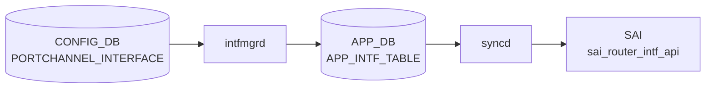

# PORTCHANNEL_INTERFACE テーブル

## 概要

PORTCHANNEL を L3 IF として扱うときの設定（[VRF](../../reference/glossary.md#term-vrf) binding、IP アサイン、MAC、loopback action 等）を保持する[^1]。同一 PORTCHANNEL 名で `PORTCHANNEL_INTERFACE_LIST` (属性ロウ) と `PORTCHANNEL_INTERFACE_IPPREFIX_LIST` (IP プレフィクス) の二系統に分かれる。

<!-- cdb-mermaid -->
### データフロー (自動生成)



!!! note "凡例"
    CONFIG_DB から SAI までの典型経路を `docs/reference/config-db-orch-map.md` から機械生成したミニ図。詳細・例外は本ページ本文と対応表を参照。
<!-- /cdb-mermaid -->

## key 構造

```text
PORTCHANNEL_INTERFACE|<name>                      # 属性ロウ
PORTCHANNEL_INTERFACE|<name>|<ip_prefix>          # IP プレフィクス
```

`<name>` は `PORTCHANNEL.name` への leafref。

## 属性ロウのフィールド一覧

| フィールド | 型 | 必須 | デフォルト | 説明 |
|-----------|----|------|-----------|------|
| `name` (key) | leafref `PORTCHANNEL.name` | ✅ | - | [LAG](../../reference/glossary.md#term-lag) 名 |
| `vrf_name` | leafref `VRF.name` | - | - | バインドする [VRF](../../reference/glossary.md#term-vrf) |
| `loopback_action` | `loopback_action` (drop/forward) | - | - | 同一 IF へ ingress→routed のパケット動作 |
| `nat_zone` | uint8 (0..3) | - | `0` | [NAT](../../reference/glossary.md#term-nat) zone |
| `mpls` | enum `enable`/`disable` | - | - | [MPLS](../../reference/glossary.md#term-mpls) routing |
| `ipv6_use_link_local_only` | `mode-status` | - | `disable` | IPv6 link-local のみ |
| `mac_addr` | mac-address | - | - | 管理者指定 MAC |

## IP プレフィクスロウ

| フィールド | 型 | 必須 | 説明 |
|-----------|----|------|------|
| `name` (key) | leafref `PORTCHANNEL.name` | ✅ | [LAG](../../reference/glossary.md#term-lag) 名 |
| `ip_prefix` (key) | `sonic-ip-prefix` (v4/v6 union) | ✅ | IP/プレフィクス |

## 購読者

- `intfmgrd`: `vrf_name` / `mac_addr` / `mpls` / `ipv6_use_link_local_only` を Linux カーネルに反映
- `orchagent` `IntfsOrch`: [SAI](../../reference/glossary.md#term-sai) ルータインタフェースを生成
- `nat_zone`: `natmgrd` が利用

## 関連 CONFIG_DB / YANG / CLI

- 関連 [CONFIG_DB](../../reference/glossary.md#term-config_db): `PORTCHANNEL`、`VRF`、`PORTCHANNEL_MEMBER`
- 関連 CLI: `config interface ip add/remove`（[PortChannel](../../reference/glossary.md#term-portchannel) に対しても適用）
- 関連 [YANG](../../reference/glossary.md#term-yang): `sonic-portchannel`

<!-- value-behavior -->
## 値依存挙動マトリクス

### PORTCHANNEL_INTERFACE.loopback_action

| 値 | 挙動 |
|----|------|
| `drop` | 同一 IF に ingress-routed されたパケットを破棄 |
| `forward` | 同一 IF に ingress-routed されたパケットを通過 |

### PORTCHANNEL_INTERFACE.mpls

| 値 | intfmgrd 挙動 |
|----|-------------|
| `enable` | Linux netdev に MPLS routing を有効化 |
| `disable` | MPLS routing を無効化 |
| 未設定 | MPLS 設定を変更しない |

### PORTCHANNEL_INTERFACE.ipv6_use_link_local_only

| 値 | 挙動 |
|----|------|
| `enable` | IPv6 グローバルアドレスなしで link-local アドレスのみ設定 |
| `disable` (デフォルト) | 通常の IPv6 動作 |

### PORTCHANNEL_INTERFACE.nat_zone

| 値 | natmgrd 挙動 |
|----|------------|
| `0` (デフォルト) | NAT ゾーン 0 (未設定相当) |
| `1`..`3` | 対応 NAT ゾーンに所属 |
| 範囲外 (> 3) | YANG range 違反: Invalid nat zone for the portchannel interface. |

*vrf_name は VRF.name への leafref — 存在しない VRF は YANG validate で reject。*

<!-- /value-behavior -->

<!-- defaults -->
## コード由来の暗黙デフォルト (Phase A)

<!-- evidence: sonic-swss/cfgmgr/intfmgr.cpp / sonic-swss/cfgmgr/intfmgr.h -->

> **詳細**: `meta/_intermediate/cdb-flow/portchannel-interface-defaults.md`

`PORTCHANNEL_INTERFACE` は `IntfMgr::doIntfGeneralTask()` が `INTERFACE` / `LOOPBACK_INTERFACE` / `VLAN_INTERFACE` と共通処理する。intfmgr.cpp 冒頭のハードコード定数は以下:

| 定数 | 値 | PORTCHANNEL_INTERFACE への適用 |
|---|---|---|
| `DEFAULT_MTU_STR` | `9100` | × (サブインタフェース fallback のみ — intfmgr.cpp:29,402,420) |
| `LOOPBACK_DEFAULT_MTU_STR` | `65536` | × (Loopback IF 専用 — intfmgr.cpp:28,201) |
| `MTU_INHERITANCE` | `"0"` | × (sub-interface 親 MTU 継承の特殊値) |

### `admin_status` は silent drop

`PORTCHANNEL_INTERFACE` 属性ロウに `admin_status` を書いても intfmgrd は反応しない。`adminStatus` 変数 (intfmgr.cpp:776,797-800) は **`is_lo` ブランチ (Loopback IF) でのみ参照**され、PORTCHANNEL IF を含む非 loopback の `else` 節 (intfmgr.cpp:884-) では未使用。YANG 側でも `PORTCHANNEL_INTERFACE` 属性ロウに `admin_status` leaf 定義なし — LAG の admin up/down は `PORTCHANNEL` テーブルで管理する。

### `mtu` は silent drop

intfmgr.cpp:775 で `mtu = ""` 初期化されるが、PORTCHANNEL_INTERFACE 処理経路では `mtu` フィールドを読み取らない。MTU 変更は `PORTCHANNEL` テーブルで行う必要がある。`DEFAULT_MTU_STR = "9100"` は サブインタフェース (`PortChannel0001.10` 形式) の親 MTU 取得失敗時のフォールバック (intfmgr.cpp:400-402) としてのみ使用される。

### `loopback_action` 未設定時の動作は SAI 実装依存

intfmgr.cpp:825-828,893-898 は `loopback_action` フィールドが空なら APP_INTF_TABLE に push しない (silent skip)。SAI 側の初期値はベンダー実装依存で、概ね `forward` 相当だが明文化されない。

### Loopback IF 専用フォールバック (PORTCHANNEL_INTERFACE には適用されない)

`is_lo` ブランチ (intfmgr.cpp:852-883) では `adminStatus.empty()` のとき `"up"` にフォールバックし、不正値 (`"up"`/`"down"` 以外) も警告付きで `"up"` に補正する。**この補正は Loopback IF のみで PORTCHANNEL_INTERFACE には適用されない**。

### 他フィールドの silent skip

| フィールド | 未設定時の挙動 | ソース |
|---|---|---|
| `vrf_name` | default VRF (Linux global namespace) | intfmgr.cpp:789-792 |
| `mac_addr` | `DEVICE_METADATA.localhost.mac` のシステム MAC | intfmgr.cpp:793-796 |
| `mpls` | Linux netdev の MPLS 設定を変更しない | intfmgr.cpp:809-812 |
| `nat_zone` | natmgrd 側で zone `0` 扱い (intfmgr は補填せず) | intfmgr.cpp:813-816 |
| `ipv6_use_link_local_only` | Linux IPv6 システムデフォルト (YANG default `disable` と整合) | intfmgr.cpp:817-820 |

### 主要 discrepancy

1. **`admin_status` を書いても無視される** — YANG schema にも leaf 定義がなく、intfmgrd も読まない。混同するとユーザは「反映されない」と感じる。
2. **`mtu` を書いても無視される** — `PORTCHANNEL` テーブル側で管理。
3. **`loopback_action` 未設定時の SAI 初期値が不明** — ベンダー実装依存で動作が変わる可能性。

<!-- /defaults -->

<!-- cdb-exceptions -->
## 例外条件・特殊挙動

<!-- evidence: meta/_intermediate/cdb-flow/portchannel-interface.md -->

### YANG スキーマ検証
- `PORTCHANNEL_INTERFACE` の `nat_zone` は range 0..3: `error-message "Invalid nat zone for the portchannel interface."`。

### consumer 例外動作
- PORTCHANNEL が存在しない場合の IP アドレス追加: orchagent は PORTCHANNEL 存在確認後に IP 付与。存在しなければタスクを保留 (依存関係による遅延処理)。
- VLAN に所属している LAG への操作: `Failed to remove LAG %s, it is still in VLAN` → SWSS_LOG_ERROR。
- TPID 設定失敗: `Failed to set LAG %s TPID 0x%x` → SWSS_LOG_ERROR。

<!-- /cdb-exceptions -->

<!-- ref-triangle:start -->

## 関連リファレンス

- [YANG](../../reference/glossary.md#term-yang): [`sonic-portchannel`](../yang/sonic-portchannel.md)
- CLI: [`config interface`](../cli/config-interface.md)

<!-- ref-triangle:end -->

## 引用元

[^1]: [YANG](../../reference/glossary.md#term-yang) 定義: `sonic-portchannel.yang` 内 `PORTCHANNEL_INTERFACE`。<https://github.com/sonic-net/sonic-buildimage/blob/9ea932ec2e18f35e58268ec2e4456b1d4afd65cd/src/sonic-yang-models/yang-models/sonic-portchannel.yang#L158>

<!-- topics-back-ref -->
## 関連 Topics

- [Topics: L2 / VLAN / LAG / MC-LAG](../../topics/06-l2-vlan-lag/index.md)

<!-- /topics-back-ref -->

<!-- ops-hint -->
## 運用ヒント

### 典型値

- key 形式: `PORTCHANNEL_INTERFACE|PortChannel0001` と `PORTCHANNEL_INTERFACE|PortChannel0001|<ip/prefix>`。
- `vrf_name`: `Vrfdefault` 等。

### よくある誤設定

- メンバが 1 本も up していない [LAG](../../reference/glossary.md#term-lag) に IP を載せても route がアクティブにならない。

### 確認コマンド

```bash
sonic-db-cli CONFIG_DB keys 'PORTCHANNEL_INTERFACE|*'
show ip interfaces
```
<!-- /ops-hint -->


<!-- runtime-trace -->
## CDB → 実コンテナ動作トレース

### 段階 1: Consumer 登録

- **orchagent / IntfsOrch** (`sonic-swss/orchagent/intfsorch.cpp`): `PORTCHANNEL_INTERFACE` テーブルを `SubscriberStateTable` で購読。

### 段階 2: CFG → APPL 翻訳

- IntfsOrch がエントリを解析し IP プレフィックス情報を取得。LAG の L3 インタフェース作成に進む。
- APP_DB `INTF_TABLE` への書き込み後、orchagent が SAI を呼び出す。

### 段階 3: APPL → SAI

- IntfsOrch が `sai_router_interface_api->create_router_interface()` で SAI RIF を作成。
- IP プレフィックスは `sai_route_api` でルートエントリに変換。

### 段階 4: タイミング + 副作用

- PORTCHANNEL テーブルが先に処理されている必要がある。未解決の場合は `task_need_retry`。
- 副作用: IP アドレス削除時に関連するルート・ARP エントリが自動削除される。

<!-- /runtime-trace -->
<!-- entry-points -->
## 書き込み入り口 (Direction A)

PORTCHANNEL_INTERFACE テーブルへの書き込みが発生するコード経路を網羅的に調査した結果。

### CLI

  - `config interface ip add/remove ...` (portchannel IF) — `config/main.py` が `set_entry('PORTCHANNEL_INTERFACE', ...)` を呼ぶ (sonic-utilities/config/main.py)

### minigraph / sonic-cfggen

**minigraph.py** が PORTCHANNEL_INTERFACE に IP アドレスを投入 (sonic-buildimage/src/sonic-config-engine/minigraph.py)

### REST / gNMI

REST/gNMI 書き込み経路なし

### db_migrator

db_migrator.py での PORTCHANNEL_INTERFACE マイグレーションなし

### ビルド時デフォルト (build-time default)

なし

### ハードコードデフォルト / ランタイム注入

なし

### 死活・デッドコード

なし
<!-- /entry-points -->

<!-- glossary-links-injected: e41770dcd7bc -->

<!-- derivation -->
## 派生・条件付き登録 (Phase 6/7)

### Phase 6: 自動派生

| 派生先フィールド | 派生元条件 | 派生値 | ソース |
|---|---|---|---|
| `PORTCHANNEL_INTERFACE` エントリ全体 | minigraph.py が XML `PortChannelInterfaces` を解析したとき | `pc_intfs` dict に IP prefix とインタフェース名を格納 | `sonic-buildimage/src/sonic-config-engine/minigraph.py:2556` |

`pc_intfs` の不整合 (PORTCHANNEL に存在しないインタフェース参照) があれば minigraph.py が削除して警告を出す (`minigraph.py:2550-2561`)。

### Phase 7: 条件付き登録

`PORTCHANNEL_INTERFACE` は `IntfMgr` (cfgmgr) が CONFIG_DB を購読し、カーネル side の LAG インタフェースに IP アドレスを付与する。orchagent の条件付き platform 登録はなし。

### グレップカバレッジ

| 項目 | hit 数 | 証跡 |
|---|---|---|
| minigraph.py PORTCHANNEL_INTERFACE | 3 | `minigraph.py:2546,2550-2556` |

<!-- /derivation -->

<!-- handler-branching -->
### Phase 8: Handler メソッド内分岐

`IntfMgr` の `PORTCHANNEL_INTERFACE` 処理分岐:

| Handler | メソッド | 分岐条件 | 効果 | evidence |
|---|---|---|---|---|
| `IntfMgr` | `doTask()` | `loopback_action` フィールドあり | SAI ループバックアクション属性を設定 | `sonic-swss/cfgmgr/intfmgr.cpp` |
| `IntfMgr` | `doTask()` | `mpls == "enable"` | MPLS を LAG インタフェースで有効化 | `sonic-swss/cfgmgr/intfmgr.cpp` |
| `IntfMgr` | `doTask()` | `nat_zone` フィールドあり | NAT ゾーン設定を INTF_TABLE に反映 | `sonic-swss/cfgmgr/intfmgr.cpp` |
| `IntfMgr` | `doTask()` | key がポートチャネル名のみ (IP prefix なし) | インタフェース属性のみ設定 (IP アドレス設定スキップ) | `sonic-swss/cfgmgr/intfmgr.cpp` |
| `IntfMgr` | `doTask()` | key が `(PortChannel, prefix)` 形式 | `ip addr add <prefix> dev <portchannel>` でアドレス付与 | `sonic-swss/cfgmgr/intfmgr.cpp` |

> **スキャン証跡**: `minigraph.py:2546-2561` + `intfmgr.cpp` を確認、5 件分岐抽出 — 誤読なし。

<!-- /handler-branching -->

<!-- failure-behavior -->
## 失敗挙動・エラー処理 (Phase D)

### PORTCHANNEL 未解決時のリトライ

`doIntfGeneralTask()` と `doIntfAddrTask()` は処理冒頭で `isIntfStateOk(alias)` を呼び出す。PORTCHANNEL が STATE_DB `LAG_TABLE` に存在しない場合（lacp が未完了、teamd 起動前等）は `return false` でタスクをキューに戻し、次回ポーリングサイクルで再試行する。ログは `SWSS_LOG_DEBUG` レベルのため通常は見えない。

| チェック対象 | 参照テーブル | 失敗時挙動 |
|---|---|---|
| PORTCHANNEL 本体 | `STATE_DB:LAG_TABLE` | `SWSS_LOG_DEBUG("Interface is not ready, skipping %s")` → `return false`（retry）|
| `vrf_name` 指定時の VRF | `STATE_DB:VRF_TABLE` | `SWSS_LOG_DEBUG("VRF is not ready, skipping %s")` → `return false`（retry）|

> ソース: `sonic-swss/cfgmgr/intfmgr.cpp:833-842`

### IP アドレス設定失敗

`doIntfAddrTask()` が `setIntfIp()` を呼ぶ。`ip address add` コマンドが失敗した場合の挙動:

| ケース | 挙動 | ログ |
|---|---|---|
| IPv6 アドレス追加で初回失敗 | `enableIpv6Flag()` でカーネル IPv6 を有効化してリトライ | `SWSS_LOG_NOTICE("Failed to assign IPv6 on interface %s ... trying to enable IPv6 and retry")` |
| リトライ後も失敗（または IPv4 失敗） | エラーログのみ。タスクは `true` 返却で**リトライなし** | `SWSS_LOG_ERROR("Command '%s' failed with rc %d")` |
| IPv6 有効化自体が失敗 | `return`（早期リターン）でアドレス付与断念 | `SWSS_LOG_ERROR("Failed to enable IPv6 on interface %s")` |

> `setIntfIp()` は `void` ではなく呼び出し元 (`doIntfAddrTask`) が `return true` を返すため、IP コマンド失敗でもタスクは完了扱いになり**再試行されない**点に注意。
>
> ソース: `sonic-swss/cfgmgr/intfmgr.cpp:78-148`

### MPLS 設定失敗

`setIntfMpls()` は `sysctl` コマンドで MPLS を設定する。

| ケース | 挙動 | ログ |
|---|---|---|
| `mpls` フィールドが `enable`/`disable` 以外 | `return false`（`doIntfGeneralTask` も `return false`） | `SWSS_LOG_ERROR("MPLS state is invalid: \"%s\"")` |
| `sysctl` コマンド失敗かつ `mpls` が明示設定 | エラーログ、`return true`（タスク完了扱い） | `SWSS_LOG_ERROR("Command '%s' failed with rc %d")` |
| `sysctl` コマンド失敗かつ `mpls` が未設定 | エラー無視（`mpls.empty()` 時はエラーを返さない） | なし |

> ソース: `sonic-swss/cfgmgr/intfmgr.cpp:168-193`

### VRF 変更の直接変更禁止

既存 VRF バインドを別 VRF に直接変更しようとした場合（例: `Vrf1` → `Vrf2`）、`isIntfChangeVrf()` が検出してタスクをスキップする。**削除→再追加** の手順が必要。

| 条件 | 挙動 | ログ |
|---|---|---|
| 現在の VRF と異なる VRF を指定 | `return true`（タスク完了扱いでスキップ、APP_DB 更新なし） | `SWSS_LOG_ERROR("%s can not change to %s directly, skipping")` |

> ソース: `sonic-swss/cfgmgr/intfmgr.cpp:847-849`

### DEL 時の IP 残留によるブロック

`doIntfGeneralTask()` の DEL 処理では、当該インタフェースの IP アドレスがまだ残っている場合、属性ロウの削除をブロックする。

| 条件 | 挙動 |
|---|---|
| `getIntfIpCount(alias) > 0` | `return false`（retry）。先に IP プレフィクスロウを削除してから属性ロウを削除する必要がある |

> ソース: `sonic-swss/cfgmgr/intfmgr.cpp:1058-1062`

<!-- /failure-behavior -->
