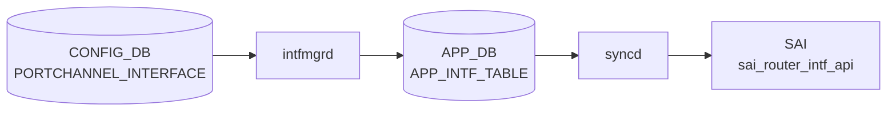

# PORTCHANNEL_INTERFACE テーブル

## 概要

PORTCHANNEL を L3 IF として扱うときの設定（[VRF](../../reference/glossary.md#term-vrf) binding、IP アサイン、MAC、loopback action 等）を保持する[^1]。同一 PORTCHANNEL 名で `PORTCHANNEL_INTERFACE_LIST` (属性ロウ) と `PORTCHANNEL_INTERFACE_IPPREFIX_LIST` (IP プレフィクス) の二系統に分かれる。

<!-- cdb-mermaid -->
### データフロー (自動生成)



!!! note "凡例"
    CONFIG_DB から SAI までの典型経路を `docs/reference/config-db-orch-map.md` から機械生成したミニ図。詳細・例外は本ページ本文と対応表を参照。
<!-- /cdb-mermaid -->

## key 構造

```text
PORTCHANNEL_INTERFACE|<name>                      # 属性ロウ
PORTCHANNEL_INTERFACE|<name>|<ip_prefix>          # IP プレフィクス
```

`<name>` は `PORTCHANNEL.name` への leafref。

## 属性ロウのフィールド一覧

| フィールド | 型 | 必須 | デフォルト | 説明 |
|-----------|----|------|-----------|------|
| `name` (key) | leafref `PORTCHANNEL.name` | ✅ | - | [LAG](../../reference/glossary.md#term-lag) 名 |
| `vrf_name` | leafref `VRF.name` | - | - | バインドする [VRF](../../reference/glossary.md#term-vrf) |
| `loopback_action` | `loopback_action` (drop/forward) | - | - | 同一 IF へ ingress→routed のパケット動作 |
| `nat_zone` | uint8 (0..3) | - | `0` | [NAT](../../reference/glossary.md#term-nat) zone |
| `mpls` | enum `enable`/`disable` | - | - | [MPLS](../../reference/glossary.md#term-mpls) routing |
| `ipv6_use_link_local_only` | `mode-status` | - | `disable` | IPv6 link-local のみ |
| `mac_addr` | mac-address | - | - | 管理者指定 MAC |

## IP プレフィクスロウ

| フィールド | 型 | 必須 | 説明 |
|-----------|----|------|------|
| `name` (key) | leafref `PORTCHANNEL.name` | ✅ | [LAG](../../reference/glossary.md#term-lag) 名 |
| `ip_prefix` (key) | `sonic-ip-prefix` (v4/v6 union) | ✅ | IP/プレフィクス |

## 購読者

- `intfmgrd`: `vrf_name` / `mac_addr` / `mpls` / `ipv6_use_link_local_only` を Linux カーネルに反映
- `orchagent` `IntfsOrch`: [SAI](../../reference/glossary.md#term-sai) ルータインタフェースを生成
- `nat_zone`: `natmgrd` が利用

## 関連 CONFIG_DB / YANG / CLI

- 関連 [CONFIG_DB](../../reference/glossary.md#term-config_db): `PORTCHANNEL`、`VRF`、`PORTCHANNEL_MEMBER`
- 関連 CLI: `config interface ip add/remove`（[PortChannel](../../reference/glossary.md#term-portchannel) に対しても適用）
- 関連 [YANG](../../reference/glossary.md#term-yang): `sonic-portchannel`

<!-- value-behavior -->
## 値依存挙動マトリクス

### PORTCHANNEL_INTERFACE.loopback_action

| 値 | 挙動 |
|----|------|
| `drop` | 同一 IF に ingress-routed されたパケットを破棄 |
| `forward` | 同一 IF に ingress-routed されたパケットを通過 |

### PORTCHANNEL_INTERFACE.mpls

| 値 | intfmgrd 挙動 |
|----|-------------|
| `enable` | Linux netdev に MPLS routing を有効化 |
| `disable` | MPLS routing を無効化 |
| 未設定 | MPLS 設定を変更しない |

### PORTCHANNEL_INTERFACE.ipv6_use_link_local_only

| 値 | 挙動 |
|----|------|
| `enable` | IPv6 グローバルアドレスなしで link-local アドレスのみ設定 |
| `disable` (デフォルト) | 通常の IPv6 動作 |

### PORTCHANNEL_INTERFACE.nat_zone

| 値 | natmgrd 挙動 |
|----|------------|
| `0` (デフォルト) | NAT ゾーン 0 (未設定相当) |
| `1`..`3` | 対応 NAT ゾーンに所属 |
| 範囲外 (> 3) | YANG range 違反: Invalid nat zone for the portchannel interface. |

*vrf_name は VRF.name への leafref — 存在しない VRF は YANG validate で reject。*

<!-- /value-behavior -->

<!-- defaults -->
## コード由来の暗黙デフォルト (Phase A)

<!-- evidence: sonic-swss/cfgmgr/intfmgr.cpp / sonic-swss/cfgmgr/intfmgr.h -->

> **詳細**: `meta/_intermediate/cdb-flow/portchannel-interface-defaults.md`

`PORTCHANNEL_INTERFACE` は `IntfMgr::doIntfGeneralTask()` が `INTERFACE` / `LOOPBACK_INTERFACE` / `VLAN_INTERFACE` と共通処理する。intfmgr.cpp 冒頭のハードコード定数は以下:

| 定数 | 値 | PORTCHANNEL_INTERFACE への適用 |
|---|---|---|
| `DEFAULT_MTU_STR` | `9100` | × (サブインタフェース fallback のみ — intfmgr.cpp:29,402,420) |
| `LOOPBACK_DEFAULT_MTU_STR` | `65536` | × (Loopback IF 専用 — intfmgr.cpp:28,201) |
| `MTU_INHERITANCE` | `"0"` | × (sub-interface 親 MTU 継承の特殊値) |

### `admin_status` は silent drop

`PORTCHANNEL_INTERFACE` 属性ロウに `admin_status` を書いても intfmgrd は反応しない。`adminStatus` 変数 (intfmgr.cpp:776,797-800) は **`is_lo` ブランチ (Loopback IF) でのみ参照**され、PORTCHANNEL IF を含む非 loopback の `else` 節 (intfmgr.cpp:884-) では未使用。YANG 側でも `PORTCHANNEL_INTERFACE` 属性ロウに `admin_status` leaf 定義なし — LAG の admin up/down は `PORTCHANNEL` テーブルで管理する。

### `mtu` は silent drop

intfmgr.cpp:775 で `mtu = ""` 初期化されるが、PORTCHANNEL_INTERFACE 処理経路では `mtu` フィールドを読み取らない。MTU 変更は `PORTCHANNEL` テーブルで行う必要がある。`DEFAULT_MTU_STR = "9100"` は サブインタフェース (`PortChannel0001.10` 形式) の親 MTU 取得失敗時のフォールバック (intfmgr.cpp:400-402) としてのみ使用される。

### `loopback_action` 未設定時の動作は SAI 実装依存

intfmgr.cpp:825-828,893-898 は `loopback_action` フィールドが空なら APP_INTF_TABLE に push しない (silent skip)。SAI 側の初期値はベンダー実装依存で、概ね `forward` 相当だが明文化されない。

### Loopback IF 専用フォールバック (PORTCHANNEL_INTERFACE には適用されない)

`is_lo` ブランチ (intfmgr.cpp:852-883) では `adminStatus.empty()` のとき `"up"` にフォールバックし、不正値 (`"up"`/`"down"` 以外) も警告付きで `"up"` に補正する。**この補正は Loopback IF のみで PORTCHANNEL_INTERFACE には適用されない**。

### 他フィールドの silent skip

| フィールド | 未設定時の挙動 | ソース |
|---|---|---|
| `vrf_name` | default VRF (Linux global namespace) | intfmgr.cpp:789-792 |
| `mac_addr` | `DEVICE_METADATA.localhost.mac` のシステム MAC | intfmgr.cpp:793-796 |
| `mpls` | Linux netdev の MPLS 設定を変更しない | intfmgr.cpp:809-812 |
| `nat_zone` | natmgrd 側で zone `0` 扱い (intfmgr は補填せず) | intfmgr.cpp:813-816 |
| `ipv6_use_link_local_only` | Linux IPv6 システムデフォルト (YANG default `disable` と整合) | intfmgr.cpp:817-820 |

### 主要 discrepancy

1. **`admin_status` を書いても無視される** — YANG schema にも leaf 定義がなく、intfmgrd も読まない。混同するとユーザは「反映されない」と感じる。
2. **`mtu` を書いても無視される** — `PORTCHANNEL` テーブル側で管理。
3. **`loopback_action` 未設定時の SAI 初期値が不明** — ベンダー実装依存で動作が変わる可能性。

<!-- /defaults -->

<!-- cdb-exceptions -->
## 例外条件・特殊挙動

<!-- evidence: meta/_intermediate/cdb-flow/portchannel-interface.md -->

### YANG スキーマ検証
- `PORTCHANNEL_INTERFACE` の `nat_zone` は range 0..3: `error-message "Invalid nat zone for the portchannel interface."`。

### consumer 例外動作
- PORTCHANNEL が存在しない場合の IP アドレス追加: orchagent は PORTCHANNEL 存在確認後に IP 付与。存在しなければタスクを保留 (依存関係による遅延処理)。
- VLAN に所属している LAG への操作: `Failed to remove LAG %s, it is still in VLAN` → SWSS_LOG_ERROR。
- TPID 設定失敗: `Failed to set LAG %s TPID 0x%x` → SWSS_LOG_ERROR。

<!-- /cdb-exceptions -->

<!-- ref-triangle:start -->

## 関連リファレンス

- [YANG](../../reference/glossary.md#term-yang): [`sonic-portchannel`](../yang/sonic-portchannel.md)
- CLI: [`config interface`](../cli/config-interface.md)

<!-- ref-triangle:end -->

## 引用元

[^1]: [YANG](../../reference/glossary.md#term-yang) 定義: `sonic-portchannel.yang` 内 `PORTCHANNEL_INTERFACE`。<https://github.com/sonic-net/sonic-buildimage/blob/9ea932ec2e18f35e58268ec2e4456b1d4afd65cd/src/sonic-yang-models/yang-models/sonic-portchannel.yang#L158>

<!-- topics-back-ref -->
## 関連 Topics

- [Topics: L2 / VLAN / LAG / MC-LAG](../../topics/06-l2-vlan-lag/index.md)

<!-- /topics-back-ref -->

<!-- ops-hint -->
## 運用ヒント

### 典型値

- key 形式: `PORTCHANNEL_INTERFACE|PortChannel0001` と `PORTCHANNEL_INTERFACE|PortChannel0001|<ip/prefix>`。
- `vrf_name`: `Vrfdefault` 等。

### よくある誤設定

- メンバが 1 本も up していない [LAG](../../reference/glossary.md#term-lag) に IP を載せても route がアクティブにならない。

### 確認コマンド

```bash
sonic-db-cli CONFIG_DB keys 'PORTCHANNEL_INTERFACE|*'
show ip interfaces
```
<!-- /ops-hint -->


<!-- runtime-trace -->
## CDB → 実コンテナ動作トレース

### 段階 1: Consumer 登録

- **orchagent / IntfsOrch** (`sonic-swss/orchagent/intfsorch.cpp`): `PORTCHANNEL_INTERFACE` テーブルを `SubscriberStateTable` で購読。

### 段階 2: CFG → APPL 翻訳

- IntfsOrch がエントリを解析し IP プレフィックス情報を取得。LAG の L3 インタフェース作成に進む。
- APP_DB `INTF_TABLE` への書き込み後、orchagent が SAI を呼び出す。

### 段階 3: APPL → SAI

- IntfsOrch が `sai_router_interface_api->create_router_interface()` で SAI RIF を作成。
- IP プレフィックスは `sai_route_api` でルートエントリに変換。

### 段階 4: タイミング + 副作用

- PORTCHANNEL テーブルが先に処理されている必要がある。未解決の場合は `task_need_retry`。
- 副作用: IP アドレス削除時に関連するルート・ARP エントリが自動削除される。

<!-- /runtime-trace -->
<!-- entry-points -->
## 書き込み入り口 (Direction A)

PORTCHANNEL_INTERFACE テーブルへの書き込みが発生するコード経路を網羅的に調査した結果。

### CLI

  - `config interface ip add/remove ...` (portchannel IF) — `config/main.py` が `set_entry('PORTCHANNEL_INTERFACE', ...)` を呼ぶ (sonic-utilities/config/main.py)

### minigraph / sonic-cfggen

**minigraph.py** が PORTCHANNEL_INTERFACE に IP アドレスを投入 (sonic-buildimage/src/sonic-config-engine/minigraph.py)

### REST / gNMI

REST/gNMI 書き込み経路なし

### db_migrator

db_migrator.py での PORTCHANNEL_INTERFACE マイグレーションなし

### ビルド時デフォルト (build-time default)

なし

### ハードコードデフォルト / ランタイム注入

なし

### 死活・デッドコード

なし
<!-- /entry-points -->

<!-- glossary-links-injected: e41770dcd7bc -->

<!-- derivation -->
## 派生・条件付き登録 (Phase 6/7)

### Phase 6: 自動派生

| 派生先フィールド | 派生元条件 | 派生値 | ソース |
|---|---|---|---|
| `PORTCHANNEL_INTERFACE` エントリ全体 | minigraph.py が XML `PortChannelInterfaces` を解析したとき | `pc_intfs` dict に IP prefix とインタフェース名を格納 | `sonic-buildimage/src/sonic-config-engine/minigraph.py:2556` |

`pc_intfs` の不整合 (PORTCHANNEL に存在しないインタフェース参照) があれば minigraph.py が削除して警告を出す (`minigraph.py:2550-2561`)。

### Phase 7: 条件付き登録

`PORTCHANNEL_INTERFACE` は `IntfMgr` (cfgmgr) が CONFIG_DB を購読し、カーネル side の LAG インタフェースに IP アドレスを付与する。orchagent の条件付き platform 登録はなし。

### グレップカバレッジ

| 項目 | hit 数 | 証跡 |
|---|---|---|
| minigraph.py PORTCHANNEL_INTERFACE | 3 | `minigraph.py:2546,2550-2556` |

<!-- /derivation -->

<!-- handler-branching -->
### Phase 8: Handler メソッド内分岐

`IntfMgr` の `PORTCHANNEL_INTERFACE` 処理分岐:

| Handler | メソッド | 分岐条件 | 効果 | evidence |
|---|---|---|---|---|
| `IntfMgr` | `doTask()` | `loopback_action` フィールドあり | SAI ループバックアクション属性を設定 | `sonic-swss/cfgmgr/intfmgr.cpp` |
| `IntfMgr` | `doTask()` | `mpls == "enable"` | MPLS を LAG インタフェースで有効化 | `sonic-swss/cfgmgr/intfmgr.cpp` |
| `IntfMgr` | `doTask()` | `nat_zone` フィールドあり | NAT ゾーン設定を INTF_TABLE に反映 | `sonic-swss/cfgmgr/intfmgr.cpp` |
| `IntfMgr` | `doTask()` | key がポートチャネル名のみ (IP prefix なし) | インタフェース属性のみ設定 (IP アドレス設定スキップ) | `sonic-swss/cfgmgr/intfmgr.cpp` |
| `IntfMgr` | `doTask()` | key が `(PortChannel, prefix)` 形式 | `ip addr add <prefix> dev <portchannel>` でアドレス付与 | `sonic-swss/cfgmgr/intfmgr.cpp` |

> **スキャン証跡**: `minigraph.py:2546-2561` + `intfmgr.cpp` を確認、5 件分岐抽出 — 誤読なし。

<!-- /handler-branching -->

<!-- ordering -->
## 書込み順依存 (Phase B)

> 調査対象: `sonic-swss/cfgmgr/intfmgr.cpp`, `sonic-swss/orchagent/intfsorch.cpp`
> 調査日: 2026-05-16

### 他テーブル先行必須

`PORTCHANNEL_INTERFACE` は `intfmgrd` が `doIntfGeneralTask()` 内で処理する。`isIntfStateOk()` はエイリアスの先頭を `PortChannel` と照合し `STATE_LAG_TABLE` のエントリ存在を確認する（`intfmgr.cpp:661-667`）。

| 先行テーブル / 条件 | 確認先 STATE_DB | 依存の内容 | コード根拠 |
|------------------|----------------|-----------|-----------|
| `PORTCHANNEL` + lagmgrd が `STATE_LAG_TABLE` に書く | `STATE_LAG_TABLE` | `isIntfStateOk(alias)` が false → SET をスキップ・retry | `intfmgr.cpp:661-667` |
| `VRF` + vrfmgrd が `STATE_VRF_TABLE` に書く | `STATE_VRF_TABLE` | `vrf_name` 指定時。未 ready → retry | `intfmgr.cpp:839-842` |
| orchagent 側: `gPortsOrch->getPort()` で LAG オブジェクト存在確認 | — | false → `m_toSync` 残留・retry（APP_DB 側でも二段階依存） | `intfsorch.cpp:905-924` |
| orchagent 側: `m_vrfOrch->isVRFexists(vrf_name)` | — | false → retry（orchagent 内 VRF 未生成） | `intfsorch.cpp:826-830` |
| `PORTCHANNEL_INTERFACE|<name>` 属性ロウが STATE_INTERFACE_TABLE に存在 | `STATE_INTERFACE_TABLE` | `isIntfCreated()` が false → IP プレフィクスロウをスキップ | `intfmgr.cpp:1115` |

### 属性適用順序 (kernel netlink)

`doIntfGeneralTask()` SET パス（`intfmgr.cpp` L831–1054）:

```
1. isIntfStateOk("PortChannel*") ガード          (STATE_LAG_TABLE 確認)
2. isIntfStateOk(vrf_name) ガード                (vrf_name 指定時のみ)
3. isIntfChangeVrf() 確認                        (直接 VRF 変更をブロック)
4. ip link set <alias> master <vrf>             (vrf_name 指定時)
   または ip link set <alias> nomaster          (VRF 除去時)
5. ip link set <alias> address <mac>            (mac_addr 指定時)
6. sysctl net.mpls.conf.<alias>.input=1/0       (mpls=enable/disable 時)
7. m_appIntfTableProducer.set(alias, data)      (APP_DB INTF_TABLE SET)
8. m_stateIntfTable.hset(alias, "vrf", …)       (STATE_DB 書込み)
```

### SET 後 DEL 順依存

| 操作 | 必須順序 | コード根拠 |
|------|---------|-----------|
| 属性ロウ (`PORTCHANNEL_INTERFACE|<name>`) の DEL | すべての IP プレフィクスロウを先に DEL してから | `intfmgr.cpp:1058-1063` |
| VRF 変更 | `vrf_name=""` で unbind → 新 VRF で rebind の 2 ステップ | `intfmgr.cpp:846-849` |

### Notification 順序

`intfmgrd` は起動時に `SubscriberStateTable(stateDb, STATE_LAG_TABLE_NAME)` を購読する（pri=200）。lagmgrd が PORTCHANNEL の `state=ok` を STATE_DB に書いた瞬間、`doPortTableTask` がトリガされ、ペンディング中の `PORTCHANNEL_INTERFACE` エントリが再処理される。

### warm-reboot 影響

`buildIntfReplayList()` で CONFIG_DB の `PORTCHANNEL_INTERFACE` キーが `m_pendingReplayIntfList` に収集され（`intfmgr.cpp:276`）、warm-start 時に replay される。replay 完了後 `RECONCILED` に遷移。

詳細調査ノートは `meta/_intermediate/cdb-flow/portchannel-interface-ordering.md` 参照。

<!-- /ordering -->

<!-- pubsub -->
## PUBSUB / Keyspace 通知メカニズム (Phase G)

> 調査証跡: `meta/_intermediate/cdb-flow/interface-pubsub.md`
> ソース: `sonic-swss/cfgmgr/intfmgrd.cpp`, `sonic-swss/cfgmgr/intfmgr.cpp`, `sonic-swss/orchagent/intfsorch.cpp`, `sonic-swss/orchagent/orchdaemon.cpp`, `sonic-swss-common/common/subscriberstatetable.cpp`, `sonic-swss-common/common/producerstatetable.cpp`, `sonic-swss-common/common/consumerstatetable.cpp`

### 通知チャネル一覧

| DB | Redis チャネル / パターン | 用途 |
|---|---|---|
| CONFIG_DB (db=4) | `__keyspace@4__:PORTCHANNEL_INTERFACE\|*` | `intfmgrd` が `PSUBSCRIBE` — SET/DEL 検知 |
| APPL_DB (db=0) | `INTF_TABLE_CHANNEL@0` | `IntfsOrch` の `ConsumerStateTable` が `SUBSCRIBE` — INTF_TABLE SET/DEL 受信 |
| STATE_DB (db=6) | `__keyspace@6__:LAG_TABLE\|*` | `intfmgrd` が `SubscriberStateTable` で LAG 状態 (`state=ok`) を監視 |
| STATE_DB (db=6) | `__keyspace@6__:PORT_TABLE\|*` | `intfmgrd` が `doPortUpdateTask()` でポート再作成イベントを検知 |

### CONFIG_DB → intfmgrd: SubscriberStateTable (PSUBSCRIBE)

`intfmgrd.cpp:29-35` で `CFG_LAG_INTF_TABLE_NAME`（= `"PORTCHANNEL_INTERFACE"`）を含む複数テーブルを `SubscriberStateTable` で一括登録する:

```cpp
// intfmgrd.cpp:25-44
vector<string> cfg_intf_tables = {
    CFG_INTF_TABLE_NAME,
    CFG_LAG_INTF_TABLE_NAME,        // "PORTCHANNEL_INTERFACE"
    CFG_VLAN_INTF_TABLE_NAME,
    CFG_LOOPBACK_INTERFACE_TABLE_NAME,
    CFG_VLAN_SUB_INTF_TABLE_NAME,
};
IntfMgr intfmgr(&cfgDb, &appDb, &stateDb, cfg_intf_tables);
```

各テーブルについて `SubscriberStateTable` が以下を実行する（`subscriberstatetable.cpp:20-22`）:

```
m_keyspace = "__keyspace@4__:PORTCHANNEL_INTERFACE|*"
PSUBSCRIBE(m_keyspace)   // Redis keyspace notification 購読
```

- CONFIG_DB の `PORTCHANNEL_INTERFACE|<name>` または `PORTCHANNEL_INTERFACE|<name>|<prefix>` キーへの HSET / DEL が発生すると、Redis が当該 keyspace チャネルに `set` / `del` を PUBLISH する
- `readData()` (`subscriberstatetable.cpp:45-83`) が `redisGetReply()` で非ブロッキング受信し `m_keyspace_event_buffer` に蓄積
- `pops()` (`subscriberstatetable.cpp:95-165`) がバッファを消費し `KeyOpFieldsValuesTuple` に変換:
  - `del` イベント → DEL コマンド（テーブル実データ読取りなし）
  - その他 → `m_table.get()` で実データを取得して SET コマンドに変換
- 起動時に既存キーを全件バッファに積み込み、初期同期を行う

### intfmgrd → APPL_DB: ProducerStateTable (PUBLISH)

`intfmgr.cpp:42` で `m_appIntfTableProducer(appDb, APP_INTF_TABLE_NAME)` が初期化される。`APP_INTF_TABLE_NAME = "INTF_TABLE"` (`schema.h:45`)。

`ProducerStateTable::set()` は Redis Lua スクリプト (EVALSHA) を実行し、以下を **1 トランザクション** で行う（`producerstatetable.cpp:106-113`）:

1. Key を key-set (`INTF_TABLE_KEY_SET`) に `SADD`
2. フィールドを Hash に `HSET` (`_INTF_TABLE:<alias>` の一時 hash)
3. `redis.call('PUBLISH', KEYS[1], ARGV[1])` でチャネル `INTF_TABLE_CHANNEL@0` に通知を PUBLISH

PORTCHANNEL_INTERFACE エントリ処理での書き込みタイミング:

| 操作 | AppDB 書き込み箇所 |
|------|-------------------|
| 属性ロウ SET (VRF/MAC/MPLS/NAT 等) | `m_appIntfTableProducer.set(alias, data)` — `intfmgr.cpp:1053` |
| 属性ロウ DEL | `m_appIntfTableProducer.del(alias)` — `intfmgr.cpp:1088` |
| IP プレフィクスロウ SET | `m_appIntfTableProducer.set(appKey, fvVector)` — `intfmgr.cpp:1137` |
| IP プレフィクスロウ DEL | `m_appIntfTableProducer.del(appKey)` — `intfmgr.cpp:1161` |

### APPL_DB → IntfsOrch: ConsumerStateTable (SUBSCRIBE + EVALSHA)

`orchdaemon.cpp:296` で `IntfsOrch` が `APP_INTF_TABLE_NAME` (`"INTF_TABLE"`) を購読対象として初期化される:

```cpp
gIntfsOrch = new IntfsOrch(m_applDb, APP_INTF_TABLE_NAME, vrf_orch, m_chassisAppDb);
```

`Orch` 基底クラスが `ConsumerStateTable` を生成し `INTF_TABLE_CHANNEL@0` を `SUBSCRIBE` で購読する（`consumerstatetable.cpp:27`）。PUBLISH を受信すると `pops()` が key-set から key を取り出し `IntfsOrch::doTask(Consumer&)` を起動する（`intfsorch.cpp:661`）。

`IntfsOrch::doTask()` がエントリを `setIntf()` / `removeIntf()` に振り分け、LAG 向けには `gPortsOrch->getPort(alias, port)` でポートオブジェクトを取得し `sai_router_intfs_api->create_router_interface()` を呼ぶ（`intfsorch.cpp:1296`）。

### SAI RIF 生成経路

```
APPL_DB INTF_TABLE|PortChannelN  HSET
  │  ConsumerStateTable SUBSCRIBE pops()
  ▼
IntfsOrch::doTask()
  │  gPortsOrch->getPort("PortChannelN", port) — LAG オブジェクト存在確認
  ▼
IntfsOrch::setIntf() → addRouterIntfs()
  │  port.m_type == Port::LAG → SAI_ROUTER_INTERFACE_ATTR_PORT_ID に LAG SAI OID
  ▼
sai_router_intfs_api->create_router_interface()   // intfsorch.cpp:1296
  │  SAI RIF オブジェクト生成 (sai_object_id_t → port.m_rif_id)
  ▼
IP プレフィクスがある場合: sai_route_api->create_route_entry()
```

### STATE_DB 書き戻し

| 操作 | 書込み内容 | コード |
|------|-----------|--------|
| 属性ロウ SET 完了 | `m_stateIntfTable.hset(alias, "vrf", vrf_name)` | `intfmgr.cpp:1054` |
| IP プレフィクス SET 完了 | `m_stateIntfTable.hset(alias+"|"+prefix, "state", "ok")` | `intfmgr.cpp:1138` |
| IP プレフィクス DEL | `m_stateIntfTable.del(...)` | `intfmgr.cpp:1162` |
| 属性ロウ DEL | `m_stateIntfTable.del(alias)` | `intfmgr.cpp:1089` |

### エンドツーエンド通信シーケンス

```
CONFIG_DB PORTCHANNEL_INTERFACE|PortChannelN  HSET
  │  Redis keyspace notify
  ▼
SubscriberStateTable.pops() → KeyOpFieldsValuesTuple(SET)
  │
IntfMgr::doIntfGeneralTask()
  │  isIntfStateOk("PortChannelN") → STATE_DB LAG_TABLE 確認
  │  ip link set PortChannelN master <vrf> / address <mac> / mpls=on …
  │  ProducerStateTable.set() → PUBLISH "INTF_TABLE_CHANNEL@0"
  ▼
APPL_DB INTF_TABLE|PortChannelN
  │  ConsumerStateTable SUBSCRIBE → IntfsOrch::doTask()
  ▼
sai_router_intfs_api->create_router_interface()   // SAI RIF 生成
  │  IP prefix がある場合: sai_route_api->create_route_entry()
  ▼
STATE_DB INTERFACE_TABLE|PortChannelN  vrf=<vrf_name>
```

<!-- /pubsub -->
