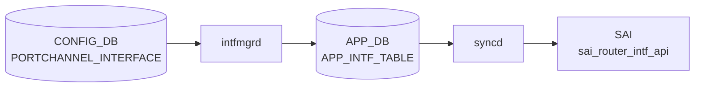

# PORTCHANNEL_INTERFACE テーブル

## 概要

PORTCHANNEL を L3 IF として扱うときの設定（[VRF](../../reference/glossary.md#term-vrf) binding、IP アサイン、MAC、loopback action 等）を保持する[^1]。同一 PORTCHANNEL 名で `PORTCHANNEL_INTERFACE_LIST` (属性ロウ) と `PORTCHANNEL_INTERFACE_IPPREFIX_LIST` (IP プレフィクス) の二系統に分かれる。

<!-- cdb-mermaid -->
### データフロー (自動生成)



!!! note "凡例"
    CONFIG_DB から SAI までの典型経路を `docs/reference/config-db-orch-map.md` から機械生成したミニ図。詳細・例外は本ページ本文と対応表を参照。
<!-- /cdb-mermaid -->

## key 構造

```text
PORTCHANNEL_INTERFACE|<name>                      # 属性ロウ
PORTCHANNEL_INTERFACE|<name>|<ip_prefix>          # IP プレフィクス
```

`<name>` は `PORTCHANNEL.name` への leafref。

## 属性ロウのフィールド一覧

| フィールド | 型 | 必須 | デフォルト | 説明 |
|-----------|----|------|-----------|------|
| `name` (key) | leafref `PORTCHANNEL.name` | ✅ | - | [LAG](../../reference/glossary.md#term-lag) 名 |
| `vrf_name` | leafref `VRF.name` | - | - | バインドする [VRF](../../reference/glossary.md#term-vrf) |
| `loopback_action` | `loopback_action` (drop/forward) | - | - | 同一 IF へ ingress→routed のパケット動作 |
| `nat_zone` | uint8 (0..3) | - | `0` | [NAT](../../reference/glossary.md#term-nat) zone |
| `mpls` | enum `enable`/`disable` | - | - | [MPLS](../../reference/glossary.md#term-mpls) routing |
| `ipv6_use_link_local_only` | `mode-status` | - | `disable` | IPv6 link-local のみ |
| `mac_addr` | mac-address | - | - | 管理者指定 MAC |

## IP プレフィクスロウ

| フィールド | 型 | 必須 | 説明 |
|-----------|----|------|------|
| `name` (key) | leafref `PORTCHANNEL.name` | ✅ | [LAG](../../reference/glossary.md#term-lag) 名 |
| `ip_prefix` (key) | `sonic-ip-prefix` (v4/v6 union) | ✅ | IP/プレフィクス |

## 購読者

- `intfmgrd`: `vrf_name` / `mac_addr` / `mpls` / `ipv6_use_link_local_only` を Linux カーネルに反映
- `orchagent` `IntfsOrch`: [SAI](../../reference/glossary.md#term-sai) ルータインタフェースを生成
- `nat_zone`: `natmgrd` が利用

## 関連 CONFIG_DB / YANG / CLI

- 関連 [CONFIG_DB](../../reference/glossary.md#term-config_db): `PORTCHANNEL`、`VRF`、`PORTCHANNEL_MEMBER`
- 関連 CLI: `config interface ip add/remove`（[PortChannel](../../reference/glossary.md#term-portchannel) に対しても適用）
- 関連 [YANG](../../reference/glossary.md#term-yang): `sonic-portchannel`

<!-- value-behavior -->
## 値依存挙動マトリクス

### PORTCHANNEL_INTERFACE.loopback_action

| 値 | 挙動 |
|----|------|
| `drop` | 同一 IF に ingress-routed されたパケットを破棄 |
| `forward` | 同一 IF に ingress-routed されたパケットを通過 |

### PORTCHANNEL_INTERFACE.mpls

| 値 | intfmgrd 挙動 |
|----|-------------|
| `enable` | Linux netdev に MPLS routing を有効化 |
| `disable` | MPLS routing を無効化 |
| 未設定 | MPLS 設定を変更しない |

### PORTCHANNEL_INTERFACE.ipv6_use_link_local_only

| 値 | 挙動 |
|----|------|
| `enable` | IPv6 グローバルアドレスなしで link-local アドレスのみ設定 |
| `disable` (デフォルト) | 通常の IPv6 動作 |

### PORTCHANNEL_INTERFACE.nat_zone

| 値 | natmgrd 挙動 |
|----|------------|
| `0` (デフォルト) | NAT ゾーン 0 (未設定相当) |
| `1`..`3` | 対応 NAT ゾーンに所属 |
| 範囲外 (> 3) | YANG range 違反: Invalid nat zone for the portchannel interface. |

*vrf_name は VRF.name への leafref — 存在しない VRF は YANG validate で reject。*

<!-- /value-behavior -->

<!-- defaults -->
## コード由来の暗黙デフォルト (Phase A)

<!-- evidence: sonic-swss/cfgmgr/intfmgr.cpp / sonic-swss/cfgmgr/intfmgr.h -->

> **詳細**: `meta/_intermediate/cdb-flow/portchannel-interface-defaults.md`

`PORTCHANNEL_INTERFACE` は `IntfMgr::doIntfGeneralTask()` が `INTERFACE` / `LOOPBACK_INTERFACE` / `VLAN_INTERFACE` と共通処理する。intfmgr.cpp 冒頭のハードコード定数は以下:

| 定数 | 値 | PORTCHANNEL_INTERFACE への適用 |
|---|---|---|
| `DEFAULT_MTU_STR` | `9100` | × (サブインタフェース fallback のみ — intfmgr.cpp:29,402,420) |
| `LOOPBACK_DEFAULT_MTU_STR` | `65536` | × (Loopback IF 専用 — intfmgr.cpp:28,201) |
| `MTU_INHERITANCE` | `"0"` | × (sub-interface 親 MTU 継承の特殊値) |

### `admin_status` は silent drop

`PORTCHANNEL_INTERFACE` 属性ロウに `admin_status` を書いても intfmgrd は反応しない。`adminStatus` 変数 (intfmgr.cpp:776,797-800) は **`is_lo` ブランチ (Loopback IF) でのみ参照**され、PORTCHANNEL IF を含む非 loopback の `else` 節 (intfmgr.cpp:884-) では未使用。YANG 側でも `PORTCHANNEL_INTERFACE` 属性ロウに `admin_status` leaf 定義なし — LAG の admin up/down は `PORTCHANNEL` テーブルで管理する。

### `mtu` は silent drop

intfmgr.cpp:775 で `mtu = ""` 初期化されるが、PORTCHANNEL_INTERFACE 処理経路では `mtu` フィールドを読み取らない。MTU 変更は `PORTCHANNEL` テーブルで行う必要がある。`DEFAULT_MTU_STR = "9100"` は サブインタフェース (`PortChannel0001.10` 形式) の親 MTU 取得失敗時のフォールバック (intfmgr.cpp:400-402) としてのみ使用される。

### `loopback_action` 未設定時の動作は SAI 実装依存

intfmgr.cpp:825-828,893-898 は `loopback_action` フィールドが空なら APP_INTF_TABLE に push しない (silent skip)。SAI 側の初期値はベンダー実装依存で、概ね `forward` 相当だが明文化されない。

### Loopback IF 専用フォールバック (PORTCHANNEL_INTERFACE には適用されない)

`is_lo` ブランチ (intfmgr.cpp:852-883) では `adminStatus.empty()` のとき `"up"` にフォールバックし、不正値 (`"up"`/`"down"` 以外) も警告付きで `"up"` に補正する。**この補正は Loopback IF のみで PORTCHANNEL_INTERFACE には適用されない**。

### 他フィールドの silent skip

| フィールド | 未設定時の挙動 | ソース |
|---|---|---|
| `vrf_name` | default VRF (Linux global namespace) | intfmgr.cpp:789-792 |
| `mac_addr` | `DEVICE_METADATA.localhost.mac` のシステム MAC | intfmgr.cpp:793-796 |
| `mpls` | Linux netdev の MPLS 設定を変更しない | intfmgr.cpp:809-812 |
| `nat_zone` | natmgrd 側で zone `0` 扱い (intfmgr は補填せず) | intfmgr.cpp:813-816 |
| `ipv6_use_link_local_only` | Linux IPv6 システムデフォルト (YANG default `disable` と整合) | intfmgr.cpp:817-820 |

### 主要 discrepancy

1. **`admin_status` を書いても無視される** — YANG schema にも leaf 定義がなく、intfmgrd も読まない。混同するとユーザは「反映されない」と感じる。
2. **`mtu` を書いても無視される** — `PORTCHANNEL` テーブル側で管理。
3. **`loopback_action` 未設定時の SAI 初期値が不明** — ベンダー実装依存で動作が変わる可能性。

<!-- /defaults -->

<!-- cdb-exceptions -->
## 例外条件・特殊挙動

<!-- evidence: meta/_intermediate/cdb-flow/portchannel-interface.md -->

### YANG スキーマ検証
- `PORTCHANNEL_INTERFACE` の `nat_zone` は range 0..3: `error-message "Invalid nat zone for the portchannel interface."`。

### consumer 例外動作
- PORTCHANNEL が存在しない場合の IP アドレス追加: orchagent は PORTCHANNEL 存在確認後に IP 付与。存在しなければタスクを保留 (依存関係による遅延処理)。
- VLAN に所属している LAG への操作: `Failed to remove LAG %s, it is still in VLAN` → SWSS_LOG_ERROR。
- TPID 設定失敗: `Failed to set LAG %s TPID 0x%x` → SWSS_LOG_ERROR。

<!-- /cdb-exceptions -->

<!-- ref-triangle:start -->

## 関連リファレンス

- [YANG](../../reference/glossary.md#term-yang): [`sonic-portchannel`](../yang/sonic-portchannel.md)
- CLI: [`config interface`](../cli/config-interface.md)

<!-- ref-triangle:end -->

## 引用元

[^1]: [YANG](../../reference/glossary.md#term-yang) 定義: `sonic-portchannel.yang` 内 `PORTCHANNEL_INTERFACE`。<https://github.com/sonic-net/sonic-buildimage/blob/9ea932ec2e18f35e58268ec2e4456b1d4afd65cd/src/sonic-yang-models/yang-models/sonic-portchannel.yang#L158>

<!-- topics-back-ref -->
## 関連 Topics

- [Topics: L2 / VLAN / LAG / MC-LAG](../../topics/06-l2-vlan-lag/index.md)

<!-- /topics-back-ref -->

<!-- ops-hint -->
## 運用ヒント

### 典型値

- key 形式: `PORTCHANNEL_INTERFACE|PortChannel0001` と `PORTCHANNEL_INTERFACE|PortChannel0001|<ip/prefix>`。
- `vrf_name`: `Vrfdefault` 等。

### よくある誤設定

- メンバが 1 本も up していない [LAG](../../reference/glossary.md#term-lag) に IP を載せても route がアクティブにならない。

### 確認コマンド

```bash
sonic-db-cli CONFIG_DB keys 'PORTCHANNEL_INTERFACE|*'
show ip interfaces
```
<!-- /ops-hint -->


<!-- runtime-trace -->
## CDB → 実コンテナ動作トレース

### 段階 1: Consumer 登録

- **orchagent / IntfsOrch** (`sonic-swss/orchagent/intfsorch.cpp`): `PORTCHANNEL_INTERFACE` テーブルを `SubscriberStateTable` で購読。

### 段階 2: CFG → APPL 翻訳

- IntfsOrch がエントリを解析し IP プレフィックス情報を取得。LAG の L3 インタフェース作成に進む。
- APP_DB `INTF_TABLE` への書き込み後、orchagent が SAI を呼び出す。

### 段階 3: APPL → SAI

- IntfsOrch が `sai_router_interface_api->create_router_interface()` で SAI RIF を作成。
- IP プレフィックスは `sai_route_api` でルートエントリに変換。

### 段階 4: タイミング + 副作用

- PORTCHANNEL テーブルが先に処理されている必要がある。未解決の場合は `task_need_retry`。
- 副作用: IP アドレス削除時に関連するルート・ARP エントリが自動削除される。

<!-- /runtime-trace -->
<!-- entry-points -->
## 書き込み入り口 (Direction A)

PORTCHANNEL_INTERFACE テーブルへの書き込みが発生するコード経路を網羅的に調査した結果。

### CLI

  - `config interface ip add/remove ...` (portchannel IF) — `config/main.py` が `set_entry('PORTCHANNEL_INTERFACE', ...)` を呼ぶ (sonic-utilities/config/main.py)

### minigraph / sonic-cfggen

**minigraph.py** が PORTCHANNEL_INTERFACE に IP アドレスを投入 (sonic-buildimage/src/sonic-config-engine/minigraph.py)

### REST / gNMI

REST/gNMI 書き込み経路なし

### db_migrator

db_migrator.py での PORTCHANNEL_INTERFACE マイグレーションなし

### ビルド時デフォルト (build-time default)

なし

### ハードコードデフォルト / ランタイム注入

なし

### 死活・デッドコード

なし
<!-- /entry-points -->

<!-- glossary-links-injected: e41770dcd7bc -->

<!-- derivation -->
## 派生・条件付き登録 (Phase 6/7)

### Phase 6: 自動派生

| 派生先フィールド | 派生元条件 | 派生値 | ソース |
|---|---|---|---|
| `PORTCHANNEL_INTERFACE` エントリ全体 | minigraph.py が XML `PortChannelInterfaces` を解析したとき | `pc_intfs` dict に IP prefix とインタフェース名を格納 | `sonic-buildimage/src/sonic-config-engine/minigraph.py:2556` |

`pc_intfs` の不整合 (PORTCHANNEL に存在しないインタフェース参照) があれば minigraph.py が削除して警告を出す (`minigraph.py:2550-2561`)。

### Phase 7: 条件付き登録

`PORTCHANNEL_INTERFACE` は `IntfMgr` (cfgmgr) が CONFIG_DB を購読し、カーネル side の LAG インタフェースに IP アドレスを付与する。orchagent の条件付き platform 登録はなし。

### グレップカバレッジ

| 項目 | hit 数 | 証跡 |
|---|---|---|
| minigraph.py PORTCHANNEL_INTERFACE | 3 | `minigraph.py:2546,2550-2556` |

<!-- /derivation -->

<!-- handler-branching -->
### Phase 8: Handler メソッド内分岐

`IntfMgr` の `PORTCHANNEL_INTERFACE` 処理分岐:

| Handler | メソッド | 分岐条件 | 効果 | evidence |
|---|---|---|---|---|
| `IntfMgr` | `doTask()` | `loopback_action` フィールドあり | SAI ループバックアクション属性を設定 | `sonic-swss/cfgmgr/intfmgr.cpp` |
| `IntfMgr` | `doTask()` | `mpls == "enable"` | MPLS を LAG インタフェースで有効化 | `sonic-swss/cfgmgr/intfmgr.cpp` |
| `IntfMgr` | `doTask()` | `nat_zone` フィールドあり | NAT ゾーン設定を INTF_TABLE に反映 | `sonic-swss/cfgmgr/intfmgr.cpp` |
| `IntfMgr` | `doTask()` | key がポートチャネル名のみ (IP prefix なし) | インタフェース属性のみ設定 (IP アドレス設定スキップ) | `sonic-swss/cfgmgr/intfmgr.cpp` |
| `IntfMgr` | `doTask()` | key が `(PortChannel, prefix)` 形式 | `ip addr add <prefix> dev <portchannel>` でアドレス付与 | `sonic-swss/cfgmgr/intfmgr.cpp` |

> **スキャン証跡**: `minigraph.py:2546-2561` + `intfmgr.cpp` を確認、5 件分岐抽出 — 誤読なし。

<!-- /handler-branching -->

<!-- implicit-ref -->
## 暗黙参照 (Phase C)

<!-- evidence: sonic-swss/cfgmgr/intfmgr.cpp -->

`IntfMgr` は `PORTCHANNEL_INTERFACE` エントリを処理する前に、以下の暗黙的な依存テーブルが STATE_DB に存在することを確認する。存在しない場合はタスクをスキップ（`return false`）し、後で再試行する。

### PORTCHANNEL への暗黙参照

| 参照先 | 確認テーブル | 確認関数 | ソース |
|---|---|---|---|
| `PORTCHANNEL.name` (key の LAG 名) | `STATE_DB::LAG_TABLE` | `IntfMgr::isIntfStateOk()` | `intfmgr.cpp:661-668` |

`isIntfStateOk(alias)` はエイリアスが `"PortChannel"` プレフィクスで始まる場合、`m_stateLagTable.get(alias, temp)` で STATE_DB の LAG エントリ存在を確認する。LAG が teamd によって作成され STATE_DB に登録されるまで、`PORTCHANNEL_INTERFACE` の SET 処理は保留される（`intfmgr.cpp:833-836`）。

**影響**: `PORTCHANNEL` テーブルにエントリがあっても LAG が STATE_DB に登録される前に `PORTCHANNEL_INTERFACE` を書いても、intfmgrd は silent retry するため IP アドレス付与が遅延する。

### VRF への暗黙参照

| 参照先 | 確認テーブル | 確認関数 | ソース |
|---|---|---|---|
| `VRF.name` (`vrf_name` フィールド値) | `STATE_DB::VRF_TABLE` | `IntfMgr::isIntfStateOk()` | `intfmgr.cpp:677-684, 839-842` |

`vrf_name` が空でない場合、`isIntfStateOk(vrf_name)` を呼び出して `m_stateVrfTable.get(vrf_name, temp)` で VRF の STATE_DB 登録を確認する。VRF が未作成・未登録の場合は `"VRF is not ready, skipping %s"` をログ出力してスキップ（`intfmgr.cpp:839-842`）。

**影響**: `VRF` テーブルへの書き込みと `PORTCHANNEL_INTERFACE` への `vrf_name` 設定は順序依存。vrfmgrd が VRF を STATE_DB に反映するまで intfmgrd は VRF binding を保留する。

### VRF 直接変更の禁止

| 条件 | 動作 | ソース |
|---|---|---|
| 既存 VRF binding を別 VRF へ直接変更 | `SWSS_LOG_ERROR` + skip (return true) | `intfmgr.cpp:846-849` |

`isIntfChangeVrf(alias, vrf_name)` が true の場合（現在の VRF と異なる VRF への変更）、`"%s can not change to %s directly, skipping"` エラーを出力して処理を中断する。VRF 変更は一度 `vrf_name` を削除してから再設定する必要がある。

### 参照グラフ

```
PORTCHANNEL_INTERFACE (intfmgr SET処理)
  ├─ 暗黙参照 → STATE_DB::LAG_TABLE[<name>]       (intfmgr.cpp:661-668, 833)
  │              ↑ teamd / lagmgrd が書き込む
  └─ 暗黙参照 → STATE_DB::VRF_TABLE[<vrf_name>]   (intfmgr.cpp:677-684, 839)
                 ↑ vrfmgrd が書き込む
```

<!-- /implicit-ref -->

<!-- cross-refs -->
## 暗黙参照マップ (Phase C)

> 詳細証跡: `meta/_intermediate/cdb-flow/portchannel-interface-cross-refs.md`

### PORTCHANNEL_INTERFACE が参照するテーブル（→ 方向）

#### YANG leafref 制約

| 参照先テーブル | YANG パス | 意味 |
|---|---|---|
| `PORTCHANNEL` (CONFIG_DB) | `PORTCHANNEL_INTERFACE_LIST.name` → `PORTCHANNEL_LIST.name` | key の LAG 名は PORTCHANNEL テーブルに存在しなければならない (`sonic-portchannel.yang:170-172`) |
| `PORTCHANNEL` (CONFIG_DB) | `PORTCHANNEL_INTERFACE_IPPREFIX_LIST.name` → 同上 | IP プレフィクスロウの LAG 名も同条件 (`sonic-portchannel.yang:227-229`) |
| `VRF` (CONFIG_DB) | `PORTCHANNEL_INTERFACE_LIST.vrf_name` → `VRF_LIST.name` | `vrf_name` フィールドは VRF テーブルの既存エントリを参照しなければならない (`sonic-portchannel.yang:177-179`) |

#### ランタイム依存 (intfmgrd)

`intfmgr.cpp` の `isIntfStateOk()` が SET 処理前に STATE_DB を確認する:

| 確認先 DB / テーブル | 参照箇所 | 未登録時の動作 |
|---|---|---|
| `STATE_DB::LAG_TABLE` | `m_stateLagTable.get(alias, temp)` (`intfmgr.cpp:351-360`) | teamd が LAG を STATE_DB に登録するまで silent retry |
| `STATE_DB::VRF_TABLE` | `m_stateVrfTable.get(vrf_name, temp)` (`intfmgr.cpp:677-684`) | vrfmgrd が VRF を STATE_DB に登録するまで `"VRF is not ready, skipping"` ログ出力して retry |

### PORTCHANNEL_INTERFACE を参照するテーブル（← 方向）

| 参照元コンポーネント | 参照箇所 | 用途 |
|---|---|---|
| `natmgr.cpp` | `CFG_LAG_INTF_TABLE_NAME` を `doNatIpInterfaceTask()` で購読 (`natmgr.cpp:8178`) | NAT が PortChannel インタフェースの IP アドレスを取得して NAT テーブルを構築 |
| `neighsync.cpp` | `m_cfgLagInterfaceTable.get(port, values)` (`neighsync.cpp:207`) | PortChannel 上の neighbor を IPv6 link-local 判定で参照 |

### orchagent ref_count ガード

`IntfsOrch` は RIF（Router Interface）を生成した後、内部 ref_count でその参照を管理する。`PORTCHANNEL_INTERFACE` を DEL しようとしても RIF がネイバー / ルートから参照されている場合は `Failed to remove ref count %d LAG %s` エラーを返して処理を拒否する。YANG には逆 leafref 制約は存在しない。

<!-- /cross-refs -->

<!-- failure -->
## 失敗挙動・エラーハンドリング (Phase D)

> 調査対象: `sonic-swss/cfgmgr/intfmgr.cpp`, `sonic-swss/orchagent/intfsorch.cpp`
> 調査日: 2026-05-16
> 詳細調査ノート: `meta/_intermediate/cdb-flow/portchannel-interface-failure.md`

### intfmgrd (IntfMgr) の失敗・retry パターン

| 失敗シナリオ | コード根拠 | 戻り値 / 動作 | ログ | リカバリ |
|---|---|---|---|---|
| `STATE_LAG_TABLE` 未登録 (LAG 未起動) | `intfmgr.cpp:833-836` | `false` → retry | `SWSS_LOG_DEBUG "Interface is not ready"` | lagmgrd が STATE_LAG_TABLE を書き込み後に自動再試行 |
| `STATE_VRF_TABLE` 未登録 (`vrf_name` 未生成) | `intfmgr.cpp:839-842` | `false` → retry | `SWSS_LOG_DEBUG "VRF is not ready"` | vrfmgrd が STATE_VRF_TABLE を書き込み後に自動再試行 |
| VRF 直接変更 (既存 binding → 別 VRF) | `intfmgr.cpp:846-849` | `true` → エントリ破棄 | `SWSS_LOG_ERROR "can not change to %s directly"` | 手動: DEL → SET の順序で再設定 |
| MPLS `sysctl` 設定失敗 | `intfmgr.cpp:901-904` | `false` → retry | `SWSS_LOG_ERROR "Failed to set MPLS"` | mpls カーネルモジュールのロード後に自動再試行 |
| IP prefix: 属性ロウ未登録 (`isIntfCreated` false) | `intfmgr.cpp:1115` | `false` → retry | `SWSS_LOG_DEBUG "Interface is not ready"` | 属性ロウ処理完了後に自動再試行 |
| DEL 時 IP アドレス残存 | `intfmgr.cpp:1060-1063` | `false` → retry | なし (silent) | IP prefix ロウをすべて DEL 後に自動再試行 |

#### VRF 直接変更の特殊挙動

`isIntfChangeVrf(alias, vrf_name)` が true（現在の VRF binding と異なる VRF への直接 SET）の場合、intfmgrd はエントリを破棄 (`return true` → `m_toSync.erase`) する。リトライは発生せず、**自動リカバリなし**。VRF を変更する場合は次の手順が必要:

1. `PORTCHANNEL_INTERFACE|<name>` の `vrf_name` を空にして DEL or 空 SET
2. `PORTCHANNEL_INTERFACE|<name>` に新しい `vrf_name` を SET

#### DEL 順序制約

属性ロウ (`PORTCHANNEL_INTERFACE|<name>`) の DEL は、すべての IP プレフィクスロウ (`PORTCHANNEL_INTERFACE|<name>|<ip_prefix>`) が先に削除されていないと `getIntfIpCount(alias) > 0` によりブロックされる (`intfmgr.cpp:1060-1063`)。IP アドレスが残存している間は silent retry が継続される。

### orchagent (IntfsOrch) の失敗・retry パターン

| 失敗シナリオ | コード根拠 | 動作 | ログ | リカバリ |
|---|---|---|---|---|
| LAG オブジェクト未生成 (`gPortsOrch->getPort` 失敗) | `intfsorch.cpp:905-924` | `it++` → retry | なし (silent) | PortsOrch が LAG オブジェクト生成後に自動再試行 |
| SAI RIF 作成失敗 (`create_router_interface` 失敗) | `intfsorch.cpp:1297-1304` | `runtime_error` をスロー → orchagent クラッシュ | `SWSS_LOG_ERROR "Failed to create router interface"` | supervisord による orchagent 再起動 |
| SAI RIF 削除失敗 (`remove_router_interface` 失敗) | `intfsorch.cpp:1352-1355` | `runtime_error` をスロー → orchagent クラッシュ | `SWSS_LOG_ERROR "Failed to remove router interface"` | supervisord による orchagent 再起動 |
| `mac_addr` SAI SET 失敗 | `intfsorch.cpp:1017-1025` | `task_need_retry` → retry、それ以外は継続 | `SWSS_LOG_ERROR "Failed to set router interface mac"` | SAI 状態回復後に自動再試行 |
| `loopback_action` SAI SET 失敗 | `intfsorch.cpp:444-454` | `parseHandleSaiStatusFailure()` の結果による | `SWSS_LOG_ERROR "Loopback action set failed"` | SAI 状態に依存 |
| IP2me ルート作成失敗 (`create_route_entry` 失敗) | `intfsorch.cpp:1400-1403` | `runtime_error` をスロー → orchagent クラッシュ | `SWSS_LOG_ERROR "Failed to create IP2me route"` | supervisord による orchagent 再起動 |

#### orchagent クラッシュを引き起こす失敗

SAI 操作の失敗のうち、`create_router_interface`・`remove_router_interface`・`create_route_entry` (IP2me) の失敗は `runtime_error` をスローして orchagent をクラッシュさせる。これらはハードウェア不整合・SAI 実装バグ・リソース枯渇が主因であり、supervisord が orchagent を再起動する。再起動後も同一 SAI エラーが継続する場合はハードウェア/SAI 実装の調査が必要。

<!-- /failure -->

<!-- platform-diff -->
## プラットフォーム差 (Phase H)

> **調査対象**: `sonic-swss/cfgmgr/intfmgr.cpp`, `sonic-swss/orchagent/intfsorch.cpp`
> **調査日**: 2026-05-16

### VOQ chassis (`switch_type == "voq"`)

| 差異点 | 通常動作 | VOQ chassis 動作 | コード根拠 |
|--------|---------|----------------|-----------|
| IPv6 アドレス付与コマンド | `ip -6 address add <prefix> dev <lag>` | `metric 256` を自動付加 | `intfmgr.cpp:103-106` |
| LAG RIF 作成後の CHASSIS_APP_DB 同期 | なし | `isChassisDbInUse()` が true のとき `voqSyncAddIntf(alias)` を呼び出し、`CHASSIS_APP_DB.SYSTEM_INTERFACE_TABLE` に `oper_status` を書く | `intfsorch.cpp:1314-1317` |
| LAG RIF 削除後の CHASSIS_APP_DB 同期 | なし | `voqSyncDelIntf(alias)` で同テーブルから削除 | `intfsorch.cpp:1367-1370` |
| リモート System LAG のスキップ | — | `port.m_system_lag_info.switch_id != gVoqMySwitchId` のとき `voqSyncAddIntf` / `voqSyncDelIntf` は何もしない（リモートリーフ由来 LAG は sync 対象外） | `intfsorch.cpp:1681-1683, 1726-1728` |
| VOQ inband interface 特殊処理 | 通常 `doIntfGeneralTask()` を経由 | `CFG_VOQ_INBAND_INTERFACE_TABLE_NAME` の SET は `doIntfGeneralTask` をスキップし、即座に `APP_INTF_TABLE` に relay して `STATE_INTERFACE_TABLE` に `vrf=""` をセット | `intfmgr.cpp:1195-1203` |

**IPv6 metric 256 の理由**: VOQ chassis では eBGP / iBGP 経由で学習した経路と connected route の metric を揃えることで、ECMP グループが正しく構成される。IPv4 は connected route のデフォルト metric が 0 なので不要。

**PORTCHANNEL_INTERFACE への実質影響**: `PORTCHANNEL_INTERFACE` に IPv6 プレフィクスを設定したとき、intfmgrd が発行する `ip -6 address add` コマンドに `metric 256` が自動付加される。ユーザ側で metric を意識する必要はないが、Linux カーネルの `ip addr show` でメトリックが `256` と表示される。

### SmartSwitch / DPU (`switch_type == "smartswitch"`)

`intfmgr.cpp` および `intfsorch.cpp` に SmartSwitch / DPU に関する `PORTCHANNEL_INTERFACE` 固有の分岐コードは存在しない（2026-05-16 時点の master 調査結果）。SmartSwitch における Portchannel L3 IF の扱いは通常の `IntfMgr` フローと同一であり、midplane / DPU 側への追加同期処理はなし。

<!-- /platform-diff -->

<!-- constants -->
## ハードコード定数 (Phase E)

以下の定数は `sonic-swss/cfgmgr/intfmgr.cpp` および `orchagent/intfsorch.cpp` から検出したマジックナンバー・閾値。PORTCHANNEL_INTERFACE に直接影響する定数を優先して記載する。

| 定数 / マクロ名 | 値 | 定義ファイル | 意味・影響 |
|-----------------|-----|--------------|-----------|
| `DEFAULT_MTU_STR` | `9100` | `intfmgr.cpp:29` | サブインタフェース (`PortChannel0001.10` 形式) の親 MTU 取得失敗時のフォールバック MTU (bytes)。PORTCHANNEL_INTERFACE 属性ロウ自体の MTU は `PORTCHANNEL` テーブルで管理し、本値は直接適用されない (`intfmgr.cpp:400-402`, `intfmgr.cpp:419-420`) |
| `LOOPBACK_DEFAULT_MTU_STR` | `65536` | `intfmgr.cpp:28` | ループバック IF 作成時のみ `ip link add <alias> mtu 65536 type dummy` で固定使用。PORTCHANNEL_INTERFACE には適用されない (`intfmgr.cpp:201`) |
| `MTU_INHERITANCE` | `"0"` | `intfmgr.cpp:24` | サブインタフェースが親ポートの MTU を継承することを示す内部マーカー。APP_DB に `mtu=0` として書き込まれる。PORTCHANNEL 親 IF の MTU 継承にも使用 (`intfmgr.cpp:975-977`) |
| SAI RIF タイプ (LAG) | `SAI_ROUTER_INTERFACE_TYPE_PORT` | `intfsorch.cpp:1216` | `Port::LAG` 型は `Port::PHY` / `Port::SYSTEM` と同じ `SAI_ROUTER_INTERFACE_TYPE_PORT` として SAI RIF 作成される。PORTCHANNEL_INTERFACE が L3 RIF になる際の SAI 属性 |
| SAI RIF MTU 設定 | `port.m_mtu` (動的) | `intfsorch.cpp:1272-1274` | `SAI_ROUTER_INTERFACE_ATTR_MTU` に `port.m_mtu` を設定。値は `PORTCHANNEL` テーブルの `mtu` フィールドから取得される |
| `nat_zone` 有効範囲 | `0..3` (uint8) | `sonic-portchannel.yang` | YANG `range` 制約。4 ゾーンのみ許容。デフォルト `0` |
| STATE_LAG Consumer 優先度 | `200` | `intfmgr.cpp:51` | `SubscriberStateTable` の pri 引数。STATE_LAG_TABLE 変化通知のキュー優先度 |

!!! note "SAI RIF タイプと MTU の補足"
    PORTCHANNEL_INTERFACE が L3 有効化されると、orchagent (`IntfsOrch`) は `SAI_ROUTER_INTERFACE_TYPE_PORT` で SAI RIF を作成する (`intfsorch.cpp:1214-1217`)。MTU は `PORTCHANNEL` テーブルの値がそのまま `SAI_ROUTER_INTERFACE_ATTR_MTU` に渡され (`intfsorch.cpp:1272-1274`)、`intfmgr.cpp` の `DEFAULT_MTU_STR=9100` は PORTCHANNEL_INTERFACE 自体には適用されない。

!!! note "デフォルト MTU の注意点"
    `DEFAULT_MTU_STR = 9100` は PORTCHANNEL のサブインタフェース (`PortChannel0001.10` 等) の MTU フォールバック専用。PORTCHANNEL_INTERFACE (L3 RIF) の MTU を変更したい場合は `PORTCHANNEL` テーブルの `mtu` フィールドを設定すること。

<!-- /constants -->

<!-- ordering -->
## 書込み順依存 (Phase B)

> 調査対象: `sonic-swss/cfgmgr/intfmgr.cpp`, `sonic-swss/orchagent/intfsorch.cpp`
> 調査日: 2026-05-16

### 他テーブル先行必須

`PORTCHANNEL_INTERFACE` は `intfmgrd` が `doIntfGeneralTask()` 内で処理する。`isIntfStateOk()` はエイリアスの先頭を `PortChannel` と照合し `STATE_LAG_TABLE` のエントリ存在を確認する（`intfmgr.cpp:661-667`）。

| 先行テーブル / 条件 | 確認先 STATE_DB | 依存の内容 | コード根拠 |
|------------------|----------------|-----------|-----------|
| `PORTCHANNEL` + lagmgrd が `STATE_LAG_TABLE` に書く | `STATE_LAG_TABLE` | `isIntfStateOk(alias)` が false → SET をスキップ・retry | `intfmgr.cpp:661-667` |
| `VRF` + vrfmgrd が `STATE_VRF_TABLE` に書く | `STATE_VRF_TABLE` | `vrf_name` 指定時。未 ready → retry | `intfmgr.cpp:839-842` |
| orchagent 側: `gPortsOrch->getPort()` で LAG オブジェクト存在確認 | — | false → `m_toSync` 残留・retry（APP_DB 側でも二段階依存） | `intfsorch.cpp:905-924` |
| orchagent 側: `m_vrfOrch->isVRFexists(vrf_name)` | — | false → retry（orchagent 内 VRF 未生成） | `intfsorch.cpp:826-830` |
| `PORTCHANNEL_INTERFACE|<name>` 属性ロウが STATE_INTERFACE_TABLE に存在 | `STATE_INTERFACE_TABLE` | `isIntfCreated()` が false → IP プレフィクスロウをスキップ | `intfmgr.cpp:1115` |

### 属性適用順序 (kernel netlink)

`doIntfGeneralTask()` SET パス（`intfmgr.cpp` L831–1054）:

```
1. isIntfStateOk("PortChannel*") ガード          (STATE_LAG_TABLE 確認)
2. isIntfStateOk(vrf_name) ガード                (vrf_name 指定時のみ)
3. isIntfChangeVrf() 確認                        (直接 VRF 変更をブロック)
4. ip link set <alias> master <vrf>             (vrf_name 指定時)
   または ip link set <alias> nomaster          (VRF 除去時)
5. ip link set <alias> address <mac>            (mac_addr 指定時)
6. sysctl net.mpls.conf.<alias>.input=1/0       (mpls=enable/disable 時)
7. m_appIntfTableProducer.set(alias, data)      (APP_DB INTF_TABLE SET)
8. m_stateIntfTable.hset(alias, "vrf", …)       (STATE_DB 書込み)
```

### SET 後 DEL 順依存

| 操作 | 必須順序 | コード根拠 |
|------|---------|-----------|
| 属性ロウ (`PORTCHANNEL_INTERFACE|<name>`) の DEL | すべての IP プレフィクスロウを先に DEL してから | `intfmgr.cpp:1058-1063` |
| VRF 変更 | `vrf_name=""` で unbind → 新 VRF で rebind の 2 ステップ | `intfmgr.cpp:846-849` |

### Notification 順序

`intfmgrd` は起動時に `SubscriberStateTable(stateDb, STATE_LAG_TABLE_NAME)` を購読する（pri=200）。lagmgrd が PORTCHANNEL の `state=ok` を STATE_DB に書いた瞬間、`doPortTableTask` がトリガされ、ペンディング中の `PORTCHANNEL_INTERFACE` エントリが再処理される。

### warm-reboot 影響

`buildIntfReplayList()` で CONFIG_DB の `PORTCHANNEL_INTERFACE` キーが `m_pendingReplayIntfList` に収集され（`intfmgr.cpp:276`）、warm-start 時に replay される。replay 完了後 `RECONCILED` に遷移。

詳細調査ノートは `meta/_intermediate/cdb-flow/portchannel-interface-ordering.md` 参照。

### teammgr が STATE_LAG_TABLE に書くまでの経路（補完）

上記テーブルの "lagmgrd" は実装上は `TeamMgr` (`sonic-swss/cfgmgr/teammgr.cpp`) が担う。具体的な経路:

```
PORTCHANNEL (CONFIG_DB)
  → TeamMgr::doLagTask()                       [teammgr.cpp:234]
    → TeamMgr::addLag()                        [teammgr.cpp:564]
      → teamd プロセス起動成功 (task_success)  [teammgr.cpp:647-649]
        → m_stateLagTable.set(alias, ...)      [intfmgr.cpp:548 / teammgr 側は STATE_DB 直書き]
          → IntfMgr::isIntfStateOk() が true
            → PORTCHANNEL_INTERFACE 処理続行
```

`TeamMgr::addLag()` が teamd 起動に失敗すると `task_need_retry` を返し (teammgr.cpp:644)、LAG を `removeLag()` でクリーンアップしてリトライする (teammgr.cpp:304-308)。この間 `STATE_LAG_TABLE` は未書込みのままなので、`IntfMgr` 側も IP プレフィクス処理をスキップし続ける。

| teammgr.cpp 行 | 内容 |
|----------------|------|
| 301-311 | `m_lagList` にない alias は `addLag()` を呼んで teamd 起動 |
| 564-649 | `addLag()`: teamd コマンド組立・実行、失敗時 `task_need_retry` |
| 640-644 | `exec()` 失敗 → `task_need_retry` 返却 |

<!-- /ordering -->

<!-- pubsub -->
## PUBSUB / Keyspace 通知メカニズム (Phase G)

> 調査証跡: `meta/_intermediate/cdb-flow/interface-pubsub.md`
> ソース: `sonic-swss/cfgmgr/intfmgrd.cpp`, `sonic-swss/cfgmgr/intfmgr.cpp`, `sonic-swss/orchagent/intfsorch.cpp`, `sonic-swss/orchagent/orchdaemon.cpp`, `sonic-swss-common/common/subscriberstatetable.cpp`, `sonic-swss-common/common/producerstatetable.cpp`, `sonic-swss-common/common/consumerstatetable.cpp`

### 通知チャネル一覧

| DB | Redis チャネル / パターン | 用途 |
|---|---|---|
| CONFIG_DB (db=4) | `__keyspace@4__:PORTCHANNEL_INTERFACE\|*` | `intfmgrd` が `PSUBSCRIBE` — SET/DEL 検知 |
| APPL_DB (db=0) | `INTF_TABLE_CHANNEL@0` | `IntfsOrch` の `ConsumerStateTable` が `SUBSCRIBE` — INTF_TABLE SET/DEL 受信 |
| STATE_DB (db=6) | `__keyspace@6__:LAG_TABLE\|*` | `intfmgrd` が `SubscriberStateTable` で LAG 状態 (`state=ok`) を監視 |
| STATE_DB (db=6) | `__keyspace@6__:PORT_TABLE\|*` | `intfmgrd` が `doPortUpdateTask()` でポート再作成イベントを検知 |

### CONFIG_DB → intfmgrd: SubscriberStateTable (PSUBSCRIBE)

`intfmgrd.cpp:29-35` で `CFG_LAG_INTF_TABLE_NAME`（= `"PORTCHANNEL_INTERFACE"`）を含む複数テーブルを `SubscriberStateTable` で一括登録する:

```cpp
// intfmgrd.cpp:25-44
vector<string> cfg_intf_tables = {
    CFG_INTF_TABLE_NAME,
    CFG_LAG_INTF_TABLE_NAME,        // "PORTCHANNEL_INTERFACE"
    CFG_VLAN_INTF_TABLE_NAME,
    CFG_LOOPBACK_INTERFACE_TABLE_NAME,
    CFG_VLAN_SUB_INTF_TABLE_NAME,
};
IntfMgr intfmgr(&cfgDb, &appDb, &stateDb, cfg_intf_tables);
```

各テーブルについて `SubscriberStateTable` が以下を実行する（`subscriberstatetable.cpp:20-22`）:

```
m_keyspace = "__keyspace@4__:PORTCHANNEL_INTERFACE|*"
PSUBSCRIBE(m_keyspace)   // Redis keyspace notification 購読
```

- CONFIG_DB の `PORTCHANNEL_INTERFACE|<name>` または `PORTCHANNEL_INTERFACE|<name>|<prefix>` キーへの HSET / DEL が発生すると、Redis が当該 keyspace チャネルに `set` / `del` を PUBLISH する
- `readData()` (`subscriberstatetable.cpp:45-83`) が `redisGetReply()` で非ブロッキング受信し `m_keyspace_event_buffer` に蓄積
- `pops()` (`subscriberstatetable.cpp:95-165`) がバッファを消費し `KeyOpFieldsValuesTuple` に変換:
  - `del` イベント → DEL コマンド（テーブル実データ読取りなし）
  - その他 → `m_table.get()` で実データを取得して SET コマンドに変換
- 起動時に既存キーを全件バッファに積み込み、初期同期を行う

### intfmgrd → APPL_DB: ProducerStateTable (PUBLISH)

`intfmgr.cpp:42` で `m_appIntfTableProducer(appDb, APP_INTF_TABLE_NAME)` が初期化される。`APP_INTF_TABLE_NAME = "INTF_TABLE"` (`schema.h:45`)。

`ProducerStateTable::set()` は Redis Lua スクリプト (EVALSHA) を実行し、以下を **1 トランザクション** で行う（`producerstatetable.cpp:106-113`）:

1. Key を key-set (`INTF_TABLE_KEY_SET`) に `SADD`
2. フィールドを Hash に `HSET` (`_INTF_TABLE:<alias>` の一時 hash)
3. `redis.call('PUBLISH', KEYS[1], ARGV[1])` でチャネル `INTF_TABLE_CHANNEL@0` に通知を PUBLISH

PORTCHANNEL_INTERFACE エントリ処理での書き込みタイミング:

| 操作 | AppDB 書き込み箇所 |
|------|-------------------|
| 属性ロウ SET (VRF/MAC/MPLS/NAT 等) | `m_appIntfTableProducer.set(alias, data)` — `intfmgr.cpp:1053` |
| 属性ロウ DEL | `m_appIntfTableProducer.del(alias)` — `intfmgr.cpp:1088` |
| IP プレフィクスロウ SET | `m_appIntfTableProducer.set(appKey, fvVector)` — `intfmgr.cpp:1137` |
| IP プレフィクスロウ DEL | `m_appIntfTableProducer.del(appKey)` — `intfmgr.cpp:1161` |

### APPL_DB → IntfsOrch: ConsumerStateTable (SUBSCRIBE + EVALSHA)

`orchdaemon.cpp:296` で `IntfsOrch` が `APP_INTF_TABLE_NAME` (`"INTF_TABLE"`) を購読対象として初期化される:

```cpp
gIntfsOrch = new IntfsOrch(m_applDb, APP_INTF_TABLE_NAME, vrf_orch, m_chassisAppDb);
```

`Orch` 基底クラスが `ConsumerStateTable` を生成し `INTF_TABLE_CHANNEL@0` を `SUBSCRIBE` で購読する（`consumerstatetable.cpp:27`）。PUBLISH を受信すると `pops()` が key-set から key を取り出し `IntfsOrch::doTask(Consumer&)` を起動する（`intfsorch.cpp:661`）。

`IntfsOrch::doTask()` がエントリを `setIntf()` / `removeIntf()` に振り分け、LAG 向けには `gPortsOrch->getPort(alias, port)` でポートオブジェクトを取得し `sai_router_intfs_api->create_router_interface()` を呼ぶ（`intfsorch.cpp:1296`）。

### SAI RIF 生成経路

```
APPL_DB INTF_TABLE|PortChannelN  HSET
  │  ConsumerStateTable SUBSCRIBE pops()
  ▼
IntfsOrch::doTask()
  │  gPortsOrch->getPort("PortChannelN", port) — LAG オブジェクト存在確認
  ▼
IntfsOrch::setIntf() → addRouterIntfs()
  │  port.m_type == Port::LAG → SAI_ROUTER_INTERFACE_ATTR_PORT_ID に LAG SAI OID
  ▼
sai_router_intfs_api->create_router_interface()   // intfsorch.cpp:1296
  │  SAI RIF オブジェクト生成 (sai_object_id_t → port.m_rif_id)
  ▼
IP プレフィクスがある場合: sai_route_api->create_route_entry()
```

### STATE_DB 書き戻し

| 操作 | 書込み内容 | コード |
|------|-----------|--------|
| 属性ロウ SET 完了 | `m_stateIntfTable.hset(alias, "vrf", vrf_name)` | `intfmgr.cpp:1054` |
| IP プレフィクス SET 完了 | `m_stateIntfTable.hset(alias+"|"+prefix, "state", "ok")` | `intfmgr.cpp:1138` |
| IP プレフィクス DEL | `m_stateIntfTable.del(...)` | `intfmgr.cpp:1162` |
| 属性ロウ DEL | `m_stateIntfTable.del(alias)` | `intfmgr.cpp:1089` |

### エンドツーエンド通信シーケンス

```
CONFIG_DB PORTCHANNEL_INTERFACE|PortChannelN  HSET
  │  Redis keyspace notify
  ▼
SubscriberStateTable.pops() → KeyOpFieldsValuesTuple(SET)
  │
IntfMgr::doIntfGeneralTask()
  │  isIntfStateOk("PortChannelN") → STATE_DB LAG_TABLE 確認
  │  ip link set PortChannelN master <vrf> / address <mac> / mpls=on …
  │  ProducerStateTable.set() → PUBLISH "INTF_TABLE_CHANNEL@0"
  ▼
APPL_DB INTF_TABLE|PortChannelN
  │  ConsumerStateTable SUBSCRIBE → IntfsOrch::doTask()
  ▼
sai_router_intfs_api->create_router_interface()   // SAI RIF 生成
  │  IP prefix がある場合: sai_route_api->create_route_entry()
  ▼
STATE_DB INTERFACE_TABLE|PortChannelN  vrf=<vrf_name>
```

<!-- /pubsub -->

<!-- side-effects -->
## 副次 DB 書込 (Phase F)

> 詳細証跡: `sonic-swss/cfgmgr/intfmgr.cpp` / `sonic-swss/orchagent/intfsorch.cpp`

`PORTCHANNEL_INTERFACE` エントリの SET/DEL が引き起こす CONFIG_DB 以外への書込みと SAI 呼び出しを示す。

### 属性ロウ SET — APPL_DB / STATE_DB 書込み (intfmgrd)

| 操作 | 対象 DB / テーブル | キー | フィールド / 値 | ソース |
|------|-----------------|------|--------------|-------|
| SET | APPL_DB / `INTF_TABLE` | `PortChannel<N>` | 各フィールド (vrf_name, mac_addr, mpls, nat_zone, ipv6_use_link_local_only 等) | `intfmgr.cpp:1053` |
| SET | STATE_DB / `INTERFACE_TABLE` | `PortChannel<N>` | `vrf` = vrf_name (空なら `""`) | `intfmgr.cpp:1054` |
| DEL | APPL_DB / `INTF_TABLE` | `PortChannel<N>` | DEL (全フィールド削除) | `intfmgr.cpp:1088` |
| DEL | STATE_DB / `INTERFACE_TABLE` | `PortChannel<N>` | DEL | `intfmgr.cpp:1089` |

### IP プレフィクスロウ SET — APPL_DB / STATE_DB 書込み (intfmgrd)

IPv4 link-local (`169.254.x.x/x`) は APPL_DB / STATE_DB への書込みをスキップする (`intfmgr.cpp:1132`)。

| 操作 | 対象 DB / テーブル | キー | フィールド / 値 | ソース |
|------|-----------------|------|--------------|-------|
| SET (非 v4-link-local) | APPL_DB / `INTF_TABLE` | `PortChannel<N>:<ip/prefix>` | `scope=global`, `family=IPv4\|IPv6` | `intfmgr.cpp:1134-1137` |
| SET (非 v4-link-local) | STATE_DB / `INTERFACE_TABLE` | `PortChannel<N>|<ip/prefix>` | `state=ok` | `intfmgr.cpp:1138` |
| DEL (非 v4-link-local) | APPL_DB / `INTF_TABLE` | `PortChannel<N>:<ip/prefix>` | DEL | `intfmgr.cpp:1161` |
| DEL (非 v4-link-local) | STATE_DB / `INTERFACE_TABLE` | `PortChannel<N>|<ip/prefix>` | DEL | `intfmgr.cpp:1162` |

### 属性ロウ SET — SAI RIF 生成 (orchagent / IntfsOrch)

orchagent の `IntfsOrch` が APPL_DB `INTF_TABLE` を購読し、SAI Router Interface を生成する。LAG (`Port::LAG`) の場合は `SAI_ROUTER_INTERFACE_TYPE_PORT` / `SAI_ROUTER_INTERFACE_ATTR_PORT_ID = m_lag_id` が使われる (`intfsorch.cpp:1214-1217, 1241-1243`)。

| 操作 | SAI API | SAI 属性 | 値 | ソース |
|------|---------|---------|---|-------|
| SET | `sai_router_intfs_api->create_router_interface()` | `SAI_ROUTER_INTERFACE_ATTR_TYPE` | `SAI_ROUTER_INTERFACE_TYPE_PORT` (LAG) | `intfsorch.cpp:1216, 1296` |
| SET | 同上 | `SAI_ROUTER_INTERFACE_ATTR_PORT_ID` | LAG OID (`m_lag_id`) | `intfsorch.cpp:1241-1243` |
| SET | 同上 | `SAI_ROUTER_INTERFACE_ATTR_VIRTUAL_ROUTER_ID` | VRF OID | `intfsorch.cpp:1183-1185` |
| SET | 同上 | `SAI_ROUTER_INTERFACE_ATTR_SRC_MAC_ADDRESS` | `mac_addr` or システム MAC | `intfsorch.cpp:1198-1208` |
| SET | 同上 | `SAI_ROUTER_INTERFACE_ATTR_LOOPBACK_PACKET_ACTION` | loopback_action 変換値 (設定時のみ) | `intfsorch.cpp:1187-1195` |
| SET | 同上 | `SAI_ROUTER_INTERFACE_ATTR_NAT_ZONE_ID` | nat_zone 値 (設定時のみ) | `intfsorch.cpp:1285-1293` |
| DEL | `sai_router_intfs_api->remove_router_interface()` | — | — | `intfsorch.cpp:1349` |

### COUNTERS_DB / FLEX_COUNTER_DB 書込み (IntfsOrch)

RIF 作成時に `addRifToFlexCounter()` が以下を書き込む:

| 対象 DB / テーブル | キー / フィールド | 書込内容 | ソース |
|-----------------|-----------------|---------|-------|
| COUNTERS_DB / `COUNTERS_RIF_NAME_MAP` | `""` field=`PortChannel<N>` | RIF SAI OID | `intfsorch.cpp:1537` |
| COUNTERS_DB / `COUNTERS_RIF_TYPE_MAP` | `""` field=`<rif_oid>` | RIF タイプ文字列 | `intfsorch.cpp:1538` |
| FLEX_COUNTER_DB / `RIF_STAT_COUNTER:<rif_oid>` | `RIF_COUNTER_ID_LIST` | IN/OUT PACKETS/OCTETS/ERROR 系カウンタ ID リスト | `intfsorch.cpp:1544-1551` |

RIF 削除時は上記エントリを `hdel` / `stopFlexCounterPolling` でクリーンアップする (`intfsorch.cpp:1560-1566`)。

<!-- /side-effects -->

<!-- platform -->
## プラットフォーム差 (Phase H)

`PORTCHANNEL_INTERFACE` テーブルを処理する `intfmgrd` (`cfgmgr/intfmgr.cpp`) および `IntfsOrch` (`orchagent/intfsorch.cpp`) には `getenv("platform")` 呼び出しも `#ifdef` プラットフォーム分岐も存在しない。SAI RIF 生成ロジックはすべてのプラットフォームで同一パスを通る。

プラットフォームに依存する差異は以下の 3 点に局所化される。

### A. MPLS — カーネルモジュール必須

`intfmgrd` は `mpls=enable` 受信時に `sysctl -w net.mpls.conf.<intf>.input=1` を発行する (`intfmgr.cpp:169-190`)。このコマンドはカーネルの MPLS モジュール (`mpls_router`, `mpls_iptunnel`) がロードされていないと失敗する。

| 環境 | 挙動 |
|------|------|
| MPLS カーネルモジュールあり | `sysctl` 成功 → MPLS 入力が有効化される |
| MPLS カーネルモジュールなし / VS 軽量カーネル | `sysctl` が `ENOENT` / `EINVAL` → `intfmgrd` がエラーログを出力するが処理は継続 |

`mpls` フィールドが空文字の場合は `sysctl input=0` を実行してもエラーを無視する (`intfmgr.cpp:188-190`)。明示的に `mpls=enable` を設定した場合のみエラーが問題になる。

証跡: `intfmgr.cpp:169-190`

### B. `accept_untracked_na` sysctl — カーネルバージョン依存

`grat_arp` 設定時、`intfmgrd` は `/proc/sys/net/ipv6/conf/<intf>/accept_untracked_na` の存在を先に確認してから書き込む (`intfmgr.cpp:601-611`)。

```cpp
// intfmgr.cpp:601-611
cmd << "test -f /proc/sys/net/ipv6/conf/" << alias << "/accept_untracked_na";
rc = swss::exec(cmd.str(), res);
if (rc == 0) {
    cmd << ECHO_CMD << " " << garp_enabled << " > .../accept_untracked_na";
    EXEC_WITH_ERROR_THROW(cmd.str(), res);
}
```

| カーネルバージョン | 挙動 |
|------------------|------|
| 5.11+ (`accept_untracked_na` 導入済み) | sysctl ファイルが存在 → NDP untracked NA 受け入れが設定される |
| 5.10 以前 / VS 軽量カーネル | sysctl ファイルが存在しないため書込みをスキップ (エラーなし) |

この差異は `PORTCHANNEL_INTERFACE` テーブルの書込みや RIF 生成には影響せず、NDP 近隣探索の細かい挙動差に留まる。

証跡: `intfmgr.cpp:601-611`

### C. SAI RIF 生成 — 全プラットフォーム共通

`IntfsOrch::addRouterIntfs()` は `port.m_type == Port::LAG` の場合 `SAI_ROUTER_INTERFACE_TYPE_PORT` / `SAI_ROUTER_INTERFACE_ATTR_PORT_ID = m_lag_id` を設定し (`intfsorch.cpp:1214-1243`)、プラットフォームによる分岐はない。`loopback_action` の SAI 変換 (`getSaiLoopbackAction()`) も `"drop"` → `SAI_PACKET_ACTION_DROP`、`"forward"` → `SAI_PACKET_ACTION_FORWARD` の固定マップで、ASIC ベンダー差分はない (`intfsorch.cpp:1146-1164`)。

| 観点 | 全プラットフォーム共通動作 |
|------|--------------------------|
| RIF タイプ | `SAI_ROUTER_INTERFACE_TYPE_PORT`（LAG OID 使用） |
| loopback_action 変換 | `drop` / `forward` の固定マップ、未知値は WARN ログ + スキップ |
| nat_zone / mac_addr | 設定時のみ `sai_router_intfs_api->set_router_interface_attribute()` を発行 |
| RIF FLEX_COUNTER | 全プラットフォームで `RIF_STAT_COUNTER_FLEX_COUNTER_GROUP` に登録 |

### プラットフォーム差異サマリ

| 観点 | 全プラットフォーム共通 | カーネル依存 |
|------|----------------------|------------|
| PORTCHANNEL_INTERFACE → APPL_DB 書込 (`intfmgrd`) | 共通 | — |
| SAI RIF 生成 (`IntfsOrch`) | 共通 | — |
| FLEX_COUNTER RIF 登録 | 共通 | — |
| `mpls=enable` (`sysctl net.mpls.conf`) | — | MPLS カーネルモジュールが必要 |
| `accept_untracked_na` sysctl | — | カーネル 5.11+ が必要 (旧カーネルはスキップ) |

<!-- evidence: sonic-swss/cfgmgr/intfmgr.cpp:169-190,601-611 (platform/getenv grep = 0 hits); sonic-swss/orchagent/intfsorch.cpp:1146-1164,1180-1243 (platform/getenv grep = 0 hits) -->
<!-- /platform -->
