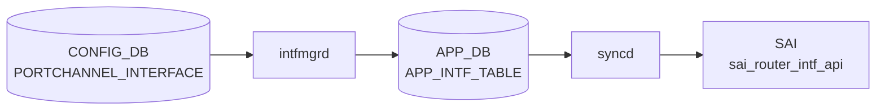

# PORTCHANNEL_INTERFACE テーブル

## 概要

PORTCHANNEL を L3 IF として扱うときの設定（[VRF](../../reference/glossary.md#term-vrf) binding、IP アサイン、MAC、loopback action 等）を保持する[^1]。同一 PORTCHANNEL 名で `PORTCHANNEL_INTERFACE_LIST` (属性ロウ) と `PORTCHANNEL_INTERFACE_IPPREFIX_LIST` (IP プレフィクス) の二系統に分かれる。

<!-- cdb-mermaid -->
### データフロー (自動生成)



!!! note "凡例"
    CONFIG_DB から SAI までの典型経路を `docs/reference/config-db-orch-map.md` から機械生成したミニ図。詳細・例外は本ページ本文と対応表を参照。
<!-- /cdb-mermaid -->

## key 構造

```text
PORTCHANNEL_INTERFACE|<name>                      # 属性ロウ
PORTCHANNEL_INTERFACE|<name>|<ip_prefix>          # IP プレフィクス
```

`<name>` は `PORTCHANNEL.name` への leafref。

## 属性ロウのフィールド一覧

| フィールド | 型 | 必須 | デフォルト | 説明 |
|-----------|----|------|-----------|------|
| `name` (key) | leafref `PORTCHANNEL.name` | ✅ | - | [LAG](../../reference/glossary.md#term-lag) 名 |
| `vrf_name` | leafref `VRF.name` | - | - | バインドする [VRF](../../reference/glossary.md#term-vrf) |
| `loopback_action` | `loopback_action` (drop/forward) | - | - | 同一 IF へ ingress→routed のパケット動作 |
| `nat_zone` | uint8 (0..3) | - | `0` | [NAT](../../reference/glossary.md#term-nat) zone |
| `mpls` | enum `enable`/`disable` | - | - | [MPLS](../../reference/glossary.md#term-mpls) routing |
| `ipv6_use_link_local_only` | `mode-status` | - | `disable` | IPv6 link-local のみ |
| `mac_addr` | mac-address | - | - | 管理者指定 MAC |

## IP プレフィクスロウ

| フィールド | 型 | 必須 | 説明 |
|-----------|----|------|------|
| `name` (key) | leafref `PORTCHANNEL.name` | ✅ | [LAG](../../reference/glossary.md#term-lag) 名 |
| `ip_prefix` (key) | `sonic-ip-prefix` (v4/v6 union) | ✅ | IP/プレフィクス |

## 購読者

- `intfmgrd`: `vrf_name` / `mac_addr` / `mpls` / `ipv6_use_link_local_only` を Linux カーネルに反映
- `orchagent` `IntfsOrch`: [SAI](../../reference/glossary.md#term-sai) ルータインタフェースを生成
- `nat_zone`: `natmgrd` が利用

## 関連 CONFIG_DB / YANG / CLI

- 関連 [CONFIG_DB](../../reference/glossary.md#term-config_db): `PORTCHANNEL`、`VRF`、`PORTCHANNEL_MEMBER`
- 関連 CLI: `config interface ip add/remove`（[PortChannel](../../reference/glossary.md#term-portchannel) に対しても適用）
- 関連 [YANG](../../reference/glossary.md#term-yang): `sonic-portchannel`

<!-- value-behavior -->
## 値依存挙動マトリクス

### PORTCHANNEL_INTERFACE.loopback_action

| 値 | 挙動 |
|----|------|
| `drop` | 同一 IF に ingress-routed されたパケットを破棄 |
| `forward` | 同一 IF に ingress-routed されたパケットを通過 |

### PORTCHANNEL_INTERFACE.mpls

| 値 | intfmgrd 挙動 |
|----|-------------|
| `enable` | Linux netdev に MPLS routing を有効化 |
| `disable` | MPLS routing を無効化 |
| 未設定 | MPLS 設定を変更しない |

### PORTCHANNEL_INTERFACE.ipv6_use_link_local_only

| 値 | 挙動 |
|----|------|
| `enable` | IPv6 グローバルアドレスなしで link-local アドレスのみ設定 |
| `disable` (デフォルト) | 通常の IPv6 動作 |

### PORTCHANNEL_INTERFACE.nat_zone

| 値 | natmgrd 挙動 |
|----|------------|
| `0` (デフォルト) | NAT ゾーン 0 (未設定相当) |
| `1`..`3` | 対応 NAT ゾーンに所属 |
| 範囲外 (> 3) | YANG range 違反: Invalid nat zone for the portchannel interface. |

*vrf_name は VRF.name への leafref — 存在しない VRF は YANG validate で reject。*

<!-- /value-behavior -->

<!-- cdb-exceptions -->
## 例外条件・特殊挙動

<!-- evidence: meta/_intermediate/cdb-flow/portchannel-interface.md -->

### YANG スキーマ検証
- `PORTCHANNEL_INTERFACE` の `nat_zone` は range 0..3: `error-message "Invalid nat zone for the portchannel interface."`。

### consumer 例外動作
- PORTCHANNEL が存在しない場合の IP アドレス追加: orchagent は PORTCHANNEL 存在確認後に IP 付与。存在しなければタスクを保留 (依存関係による遅延処理)。
- VLAN に所属している LAG への操作: `Failed to remove LAG %s, it is still in VLAN` → SWSS_LOG_ERROR。
- TPID 設定失敗: `Failed to set LAG %s TPID 0x%x` → SWSS_LOG_ERROR。

<!-- /cdb-exceptions -->

<!-- ref-triangle:start -->

## 関連リファレンス

- [YANG](../../reference/glossary.md#term-yang): [`sonic-portchannel`](../yang/sonic-portchannel.md)
- CLI: [`config interface`](../cli/config-interface.md)

<!-- ref-triangle:end -->

## 引用元

[^1]: [YANG](../../reference/glossary.md#term-yang) 定義: `sonic-portchannel.yang` 内 `PORTCHANNEL_INTERFACE`。<https://github.com/sonic-net/sonic-buildimage/blob/9ea932ec2e18f35e58268ec2e4456b1d4afd65cd/src/sonic-yang-models/yang-models/sonic-portchannel.yang#L158>

<!-- topics-back-ref -->
## 関連 Topics

- [Topics: L2 / VLAN / LAG / MC-LAG](../../topics/06-l2-vlan-lag/index.md)

<!-- /topics-back-ref -->

<!-- ops-hint -->
## 運用ヒント

### 典型値

- key 形式: `PORTCHANNEL_INTERFACE|PortChannel0001` と `PORTCHANNEL_INTERFACE|PortChannel0001|<ip/prefix>`。
- `vrf_name`: `Vrfdefault` 等。

### よくある誤設定

- メンバが 1 本も up していない [LAG](../../reference/glossary.md#term-lag) に IP を載せても route がアクティブにならない。

### 確認コマンド

```bash
sonic-db-cli CONFIG_DB keys 'PORTCHANNEL_INTERFACE|*'
show ip interfaces
```
<!-- /ops-hint -->


<!-- runtime-trace -->
## CDB → 実コンテナ動作トレース

### 段階 1: Consumer 登録

- **orchagent / IntfsOrch** (`sonic-swss/orchagent/intfsorch.cpp`): `PORTCHANNEL_INTERFACE` テーブルを `SubscriberStateTable` で購読。

### 段階 2: CFG → APPL 翻訳

- IntfsOrch がエントリを解析し IP プレフィックス情報を取得。LAG の L3 インタフェース作成に進む。
- APP_DB `INTF_TABLE` への書き込み後、orchagent が SAI を呼び出す。

### 段階 3: APPL → SAI

- IntfsOrch が `sai_router_interface_api->create_router_interface()` で SAI RIF を作成。
- IP プレフィックスは `sai_route_api` でルートエントリに変換。

### 段階 4: タイミング + 副作用

- PORTCHANNEL テーブルが先に処理されている必要がある。未解決の場合は `task_need_retry`。
- 副作用: IP アドレス削除時に関連するルート・ARP エントリが自動削除される。

<!-- /runtime-trace -->

<!-- glossary-links-injected: e41770dcd7bc -->
