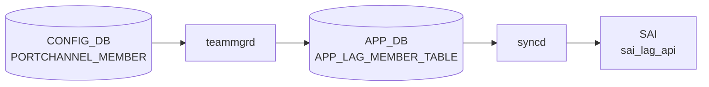

# PORTCHANNEL_MEMBER テーブル

## 概要

PORTCHANNEL とその物理メンバ PORT の対応を保持する。`teammgrd` がこの関係を読み、teamd の `enslave` 操作を実行する[^1]。

<!-- cdb-mermaid -->
### データフロー (自動生成)



!!! note "凡例"
    CONFIG_DB から SAI までの典型経路を `docs/reference/config-db-orch-map.md` から機械生成したミニ図。詳細・例外は本ページ本文と対応表を参照。
<!-- /cdb-mermaid -->

## key 構造

```
PORTCHANNEL_MEMBER|<portchannel_name>|<port_name>
```

両 key とも leafref で、`PORTCHANNEL.name` と `PORT.name` を参照する。

## フィールド一覧

| フィールド | 型 | 必須 | デフォルト | 説明 |
|-----------|----|------|-----------|------|
| `name` (key) | leafref `PORTCHANNEL.name` | ✅ | - | 親 PORTCHANNEL |
| `port` (key) | leafref `PORT.name` | ✅ | - | メンバ物理ポート |

このテーブルは key のみで、付加フィールドを持たない。

## 購読者

- `teammgrd`: メンバの追加・削除を teamd に伝達
- `orchagent` `LagOrch`: SAI LAG member を生成・削除

## 関連 CONFIG_DB / YANG / CLI

- 関連 CONFIG_DB: `PORTCHANNEL`、`PORT`、`VLAN_MEMBER` (PORTCHANNEL_MEMBER に登録された port は VLAN_MEMBER に登録不可、`must` 制約は VLAN 側)
- 関連 CLI: `config portchannel member add/del`
- 関連 YANG: `sonic-portchannel`

<!-- ref-triangle:start -->

## 関連リファレンス

- YANG: [`sonic-portchannel`](../yang/sonic-portchannel.md)
- CLI: [`config portchannel member`](../cli/config-portchannel.md)

<!-- ref-triangle:end -->

## 引用元

[^1]: YANG 定義: `sonic-portchannel.yang` 内 `PORTCHANNEL_MEMBER`。<https://github.com/sonic-net/sonic-buildimage/blob/9ea932ec2e18f35e58268ec2e4456b1d4afd65cd/src/sonic-yang-models/yang-models/sonic-portchannel.yang#L130>

<!-- topics-back-ref -->
## 関連 Topics

- [Topics: L2 / VLAN / LAG / MC-LAG](../../topics/06-l2-vlan-lag/index.md)

<!-- /topics-back-ref -->
