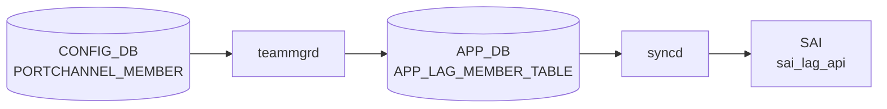

# PORTCHANNEL_MEMBER テーブル

## 概要

PORTCHANNEL とその物理メンバ PORT の対応を保持する。`teammgrd` がこの関係を読み、[teamd](../../reference/glossary.md#term-teamd-teamsyncd-teammgrd) の `enslave` 操作を実行する[^1]。

<!-- cdb-mermaid -->
### データフロー (自動生成)



!!! note "凡例"
    CONFIG_DB から SAI までの典型経路を `docs/reference/config-db-orch-map.md` から機械生成したミニ図。詳細・例外は本ページ本文と対応表を参照。
<!-- /cdb-mermaid -->

## key 構造

```text
PORTCHANNEL_MEMBER|<portchannel_name>|<port_name>
```

両 key とも leafref で、`PORTCHANNEL.name` と `PORT.name` を参照する。

## フィールド一覧

| フィールド | 型 | 必須 | デフォルト | 説明 |
|-----------|----|------|-----------|------|
| `name` (key) | leafref `PORTCHANNEL.name` | ✅ | - | 親 PORTCHANNEL |
| `port` (key) | leafref `PORT.name` | ✅ | - | メンバ物理ポート |

このテーブルは key のみで、付加フィールドを持たない。

## 購読者

- `teammgrd`: メンバの追加・削除を [teamd](../../reference/glossary.md#term-teamd-teamsyncd-teammgrd) に伝達
- `orchagent` `LagOrch`: [SAI](../../reference/glossary.md#term-sai) [LAG](../../reference/glossary.md#term-lag) member を生成・削除

## 関連 CONFIG_DB / YANG / CLI

- 関連 [CONFIG_DB](../../reference/glossary.md#term-config_db): `PORTCHANNEL`、`PORT`、`VLAN_MEMBER` (PORTCHANNEL_MEMBER に登録された port は VLAN_MEMBER に登録不可、`must` 制約は VLAN 側)
- 関連 CLI: `config portchannel member add/del`
- 関連 [YANG](../../reference/glossary.md#term-yang): `sonic-portchannel`

<!-- value-behavior -->
## 値依存挙動マトリクス

### PORTCHANNEL_MEMBER キー: name / port

| フィールド | 値 | 挙動 |
|-----------|---|------|
| `name` | 存在する PORTCHANNEL 名 | teammgrd が teamd に enslave 要求、LagOrch が SAI LAG member 追加 |
| `name` | 存在しない PORTCHANNEL 名 | YANG leafref 違反 reject |
| `port` | 存在する PORT 名 | 物理ポートを LAG に bind |
| `port` | 存在しない PORT 名 | YANG leafref 違反 reject |
| `port` | PHY / SYSTEM 型以外 | `LAG member port has to be of type PHY or SYSTEM` SWSS_LOG_ERROR |
| `port` | 異なる ASIC の switch_id (chassis) | `System lag switch id mismatch` SWSS_LOG_ERROR |

*このテーブルはキー (name, port) のみで付加フィールドを持たない。enum なし。*

<!-- /value-behavior -->

<!-- defaults -->
## フィールドデフォルト (コード由来)

`PORTCHANNEL_MEMBER` は key-only テーブルであり付加フィールドを持たない。
エントリの値は常に空ハッシュ `{}` で、デフォルト設定値は存在しない。

| フィールド | デフォルト | 由来 |
|-----------|-----------|------|
| `name` (key) | なし (必須) | YANG leafref キー — `sonic-portchannel.yang` L140-145 |
| `port` (key) | なし (必須) | YANG leafref キー — `sonic-portchannel.yang` L147-153 |

> **ソース**: `sonic-portchannel.yang` L134-154、`minigraph.py` L967 (`pc_members[(pcintfname, pcmbr_list[i])] = {}`)
<!-- /defaults -->

<!-- cdb-exceptions -->
## 例外条件・特殊挙動

<!-- evidence: meta/_intermediate/cdb-flow/portchannel-member.md -->

### YANG スキーマ検証
- key `(name, port)` は PORTCHANNEL と PORT への leafref。参照先が存在しない場合は YANG validate で reject。

### consumer (portsorch / teammgr) 例外動作
- メンバーポートが PHY/SYSTEM 型以外: `LAG member port has to be of type PHY or SYSTEM` → SWSS_LOG_ERROR。
- chassis 環境で switch id ミスマッチ: `System lag switch id mismatch. Lag %s switch id: %d, Member %s switch id: %d` → SWSS_LOG_ERROR。
- DEL で存在しないメンバー: `Member %s not found in LAG %s` → SWSS_LOG_WARN。
- SAI LAG member add 失敗: `Failed to add member %s to LAG %s` → SWSS_LOG_ERROR。
- SAI LAG member remove 失敗: `Failed to remove member %s from LAG %s` → SWSS_LOG_ERROR。
- teamd でポート未発見: `Unable to find port %s` → SWSS_LOG_WARN。

<!-- /cdb-exceptions -->

<!-- failure -->
## 失敗挙動マトリクス (Phase D)

<!-- evidence: meta/_intermediate/cdb-flow/portchannel-member-failure.md -->

### 失敗シナリオ一覧

| 失敗シナリオ | 挙動 | ログレベル | リカバリ |
|---|---|---|---|
| YANG leafref 違反 (`name`/`port` 参照先なし) | config-load で reject（DB 書き込みなし） | — | エントリ作成前に拒否 |
| `STATE_PORT_TABLE` 未準備（ポート `state != ok`） | 暗黙 continue（リトライ待機） | なし | portmgrd が STATE_DB を更新後に自動解消 |
| `STATE_LAG_TABLE` 未準備（teamd 未起動） | 暗黙 continue（リトライ待機） | なし | teamd 起動後に自動解消 |
| MACsec Ingress SA 未確立（MACsec 有効時のみ） | 暗黙 continue（リトライ待機） | `SWSS_LOG_INFO` | SA 確立後に自動解消 |
| `ip link show <member>` 失敗（kernel netdev 不在） | `task_ignore`（エントリ破棄） | `SWSS_LOG_WARN`: `Unable to find port %s` | エントリ破棄。ポート復旧後に再投入必要 |
| ポートが既に別 LAG にスレーブ済み | `task_ignore`（ログなし） | なし | べき等処理 |
| `teamdctl port add` 失敗 + ポート admin-up | `task_need_retry`（自動再試行） | `SWSS_LOG_INFO`: `Failed to add %s to port channel %s, retry...` | portmgrd 競合とみなし自動再試行 (`teammgr.cpp:779`) |
| `teamdctl port add` 失敗 + ポート admin-down | `task_failed`（エントリ破棄） | `SWSS_LOG_ERROR`: `Failed to add %s to port channel %s` | 手動介入必要 (`teammgr.cpp:785`) |
| ポート型が PHY / SYSTEM 以外 | エントリ消去（リトライなし） | `SWSS_LOG_ERROR`: `LAG member port has to be of type PHY or SYSTEM` | ポート型修正後に再投入 (`portsorch.cpp:6292`) |
| chassis 環境で switch_id ミスマッチ | エントリ消去（リトライなし） | `SWSS_LOG_ERROR`: `System lag switch id mismatch...` | 設計見直し必要 (`portsorch.cpp:6311`) |
| VLAN_MEMBER 競合（同一ポートが VLAN_MEMBER 在籍中） | 暗黙 skip（ループ継続） | `SWSS_LOG_DEBUG`: `Port %s is still a member of %zu VLAN(s)...` | `VLAN_MEMBER` DEL 後に自動解消 (`portsorch.cpp:6340`) |
| SAI `create_lag_member` 失敗 | SAI ステータス依存（`handleSaiCreateStatus`） | `SWSS_LOG_ERROR`: `Failed to add member %s to LAG %s...` | SAI 依存（プラットフォーム固有） |
| SAI `remove_lag_member` 失敗 | SAI ステータス依存（`handleSaiRemoveStatus`） | `SWSS_LOG_ERROR`: `Failed to remove member %s from LAG %s...` | SAI 依存 |
| DEL 時にメンバーが存在しない (`m_lag_member_id == 0`) | エントリ消去 | `SWSS_LOG_WARN`: `Member %s not found in LAG %s...` | べき等（無害） |
| `DEVICE_METADATA|localhost|mac` 欠如 | `teammgrd` 起動時に例外スロー → コンテナ停止 | — | MAC アドレス設定後にコンテナ再起動 (`teammgr.cpp:61`) |

### リトライ上限と無限ループ

`teammgrd` の select ループには `task_need_retry` のリトライ上限カウンタが存在しない。
`m_toSync` はエントリを保持し続け、次の select イテレーションで再試行する設計（無限リトライ）。
依存状態（`STATE_LAG_TABLE`・`STATE_PORT_TABLE`・MACsec SA）が解消されれば自然に成功する。

### VLAN_MEMBER 競合の詳細

- orchagent は `m_portVlanMember[port].size() > 0` の場合に LAG member 追加を **skip**（エラーではなく継続ループ）。
- YANG `must` 制約 (`sonic-vlan.yang:302`) と CLI ガード (`config/vlan.py:379`) で二重に防御されているため、
  通常は YANG validate / CLI 拒否で config-load 前に排除される。
  しかし `sonic-db-cli` 直接書き込みなど YANG バリデーションをバイパスした場合は orchagent ループに到達しうる。

<!-- /failure -->

<!-- ref-triangle:start -->

## 関連リファレンス

- [YANG](../../reference/glossary.md#term-yang): [`sonic-portchannel`](../yang/sonic-portchannel.md)
- CLI: [`config portchannel member`](../cli/config-portchannel.md)

<!-- ref-triangle:end -->

## 引用元

[^1]: [YANG](../../reference/glossary.md#term-yang) 定義: `sonic-portchannel.yang` 内 `PORTCHANNEL_MEMBER`。<https://github.com/sonic-net/sonic-buildimage/blob/9ea932ec2e18f35e58268ec2e4456b1d4afd65cd/src/sonic-yang-models/yang-models/sonic-portchannel.yang#L130>

<!-- topics-back-ref -->
## 関連 Topics

- [Topics: L2 / VLAN / LAG / MC-LAG](../../topics/06-l2-vlan-lag/index.md)

<!-- /topics-back-ref -->

<!-- ops-hint -->
## 運用ヒント

### 典型値

- key 形式: `PORTCHANNEL_MEMBER|PortChannel0001|Ethernet0`。
- 値は空 hash（メンバ関係の存在自体が意味を持つ）。

### よくある誤設定

- VLAN_MEMBER に同じ Ethernet が残ったまま PORTCHANNEL_MEMBER に追加すると [orchagent](../../reference/glossary.md#term-orchagent) エラー。
- L3 IP を持つポートを [LAG](../../reference/glossary.md#term-lag) メンバに入れると INTERFACE 側が孤立。

### 確認コマンド

```bash
sonic-db-cli CONFIG_DB keys 'PORTCHANNEL_MEMBER|PortChannel0001|*'
show interfaces portchannel
```
<!-- /ops-hint -->


<!-- runtime-trace -->
## CDB → 実コンテナ動作トレース

### 段階 1: Consumer 登録

- **orchagent / PortsOrch**: `PORTCHANNEL_MEMBER` テーブルを `SubscriberStateTable` で購読。
- **teammgrd** (`sonic-swss/cfgmgr/teammgr.cpp`): LAG メンバの追加・削除を `teamd` に伝達。

### 段階 2: CFG → APPL 翻訳

- teammgrd が `teamd` プロセスにポートの追加/削除を UNIX ソケット経由で通知。
- APP_DB `LAG_MEMBER_TABLE` に書き込み。

### 段階 3: APPL → SAI

- PortsOrch が APP_DB を読み `sai_lag_api->create_lag_member()` / `remove_lag_member()` を呼び出し。
- LACP が有効な場合は teamd がネゴシエーションを担う。

### 段階 4: タイミング + 副作用

- メンバ追加後 LACP ネゴシエーションが完了するまで数秒 (設定依存)。
- 副作用: メンバ削除時にそのポートのトラフィックは他メンバにハッシュ再分散される。

<!-- /runtime-trace -->
<!-- entry-points -->
## 書き込み入り口 (Direction A)

PORTCHANNEL_MEMBER テーブルへの書き込みが発生するコード経路を網羅的に調査した結果。

### CLI

  - `config portchannel member add/del ...` — `config/main.py` が `set_entry('PORTCHANNEL_MEMBER', ...)` を呼ぶ (sonic-utilities/config/main.py)

### minigraph / sonic-cfggen

**minigraph.py** が PORTCHANNEL_MEMBER を生成し投入 (sonic-buildimage/src/sonic-config-engine/minigraph.py)

### REST / gNMI

REST/gNMI 書き込み経路なし

### db_migrator

db_migrator.py での PORTCHANNEL_MEMBER マイグレーションなし

### ビルド時デフォルト (build-time default)

なし

### ハードコードデフォルト / ランタイム注入

なし

### 死活・デッドコード

なし
<!-- /entry-points -->

<!-- ordering -->
## 書込み順依存 (Phase B)

<!-- evidence: sonic-swss/cfgmgr/teammgr.cpp; sonic-swss/orchagent/portsorch.cpp -->

### SET 順序（必須）

1. **`PORTCHANNEL` → `PORTCHANNEL_MEMBER`**: `TeamMgr::doLagMemberTask()` は `isLagStateOk(lag)` で `STATE_LAG_TABLE` に対象 LAG のエントリが存在するかを確認し、存在しなければ当該タスクをキューに残してリトライ待機する (`teammgr.cpp:89-102, 357`)。`PORTCHANNEL` エントリを先に SET し、teamd が起動して `STATE_LAG_TABLE` に登録されるまで `PORTCHANNEL_MEMBER` の適用は自動的に保留される。
2. **STATE_PORT_TABLE ready → `PORTCHANNEL_MEMBER`**: メンバーとなる物理ポートが `STATE_PORT_TABLE` に `state=ok` で登録されていることも同じチェックで確認される (`teammgr.cpp:67-87, 357`)。portmgrd が STATE_DB に書くまで自動リトライ待機する。
3. **`VLAN_MEMBER` DEL → `PORTCHANNEL_MEMBER` SET（同一ポート）**: orchagent は `m_portVlanMember[port].size() > 0` の場合（VLAN_MEMBER に登録済みのポート）は LAG メンバー追加をスキップする (`portsorch.cpp:6337-6343`)。先に対象ポートを `VLAN_MEMBER` から削除してから `PORTCHANNEL_MEMBER` を SET すること。
4. **MACsec Ingress SA ready → `PORTCHANNEL_MEMBER` SET（MACsec 有効時のみ）**: MACsec が設定されたポートの場合、`isMACsecIngressSAOk()` が true になるまで SET が保留される (`teammgr.cpp:362-366`)。

### DEL 順序（推奨）

1. **`PORTCHANNEL_MEMBER` DEL → `PORTCHANNEL` DEL**: PORTCHANNEL を先に DEL すると teamd プロセスが停止し、残存する `PORTCHANNEL_MEMBER` タスクが孤立するリスクがある。**先に全メンバーを DEL してから PORTCHANNEL を DEL すること**。

### warm-reboot / restart 影響

- **swss docker restart**: warm-start パスでは `TeamMgr` コンストラクタが `m_lagList` を再構築し、`doPortUpdateTask()` が STATE_PORT_TABLE の通知をトリガとして PORTCHANNEL_MEMBER を自動再 enslave する (`teammgr.cpp:439-473`)。
- **teamdctl port add の IFF_UP 競合**: `addLagMember()` でポートを admin down にしてから enslave する際、portmgrd 等が並行して admin up を試みると `task_need_retry` で自動リトライする (`teammgr.cpp:769-781`)。通常は数回のリトライで収束する。

### 典型的な設定手順

```
# 1. PORTCHANNEL 作成（admin_status, min_links 等）
SET PORTCHANNEL|PortChannel0001  admin_status=up,min_links=1

# 2. STATE_LAG_TABLE ready 待機（teamd 起動・LAG 作成後に自動）

# 3. PORTCHANNEL_MEMBER 追加（PORT も STATE_PORT_TABLE ready 済みであること）
SET PORTCHANNEL_MEMBER|PortChannel0001|Ethernet0  {}

# 削除時は逆順
DEL PORTCHANNEL_MEMBER|PortChannel0001|Ethernet0
DEL PORTCHANNEL|PortChannel0001
```

<!-- /ordering -->

<!-- glossary-links-injected: 38b4c0ae7d80 -->

<!-- derivation -->
## 派生・条件付き登録 (Phase 6/7)

### Phase 6: 自動派生

| 派生先フィールド | 派生元条件 | 派生値 | ソース |
|---|---|---|---|
| `PORTCHANNEL_MEMBER` エントリ全体 | minigraph.py が XML `PortChannelInterfaces` → `PortChannel` → メンバポートを解析したとき | `{(PortChannel名, ポート名): {}}` | `sonic-buildimage/src/sonic-config-engine/minigraph.py:2547` |

`PORTCHANNEL_MEMBER` は key-only テーブル (フィールドなし)。minigraph.py が自動生成し、port_config.ini に存在しないポートは除外される (`minigraph.py:2531-2545`)。

### Phase 7: 条件付き登録

`PORTCHANNEL_MEMBER` は `TeamMgr` (`cfgmgr/teammgr.cpp`) が CONFIG_DB を購読し `teamd` にメンバ追加/削除を通知する。`orchdaemon.cpp` の条件付き登録なし。

### グレップカバレッジ

| 項目 | hit 数 | 証跡 |
|---|---|---|
| minigraph.py PORTCHANNEL_MEMBER | 3 | `minigraph.py:2547,2531-2545` |

<!-- /derivation -->

<!-- handler-branching -->
### Phase 8: Handler メソッド内分岐

`TeamMgr::doLagMemberTask()` の分岐:

| Handler | メソッド | 分岐条件 | 効果 | evidence |
|---|---|---|---|---|
| `TeamMgr` | `doTask()` | `table == CFG_LAG_MEMBER_TABLE_NAME` | `doLagMemberTask()` にディスパッチ | `sonic-swss/cfgmgr/teammgr.cpp:161-163` |
| `TeamMgr` | `doLagMemberTask()` | `!isLagStateOk(alias)` または LAG が未作成 | `task_need_retry` (LAG 作成まで待機) | `sonic-swss/cfgmgr/teammgr.cpp` |
| `TeamMgr` | `doLagMemberTask()` | SET 操作 | `teamdctl <lag> port add <member>` でメンバをポートチャネルに追加 | `sonic-swss/cfgmgr/teammgr.cpp` |
| `TeamMgr` | `doLagMemberTask()` | DEL 操作 | `teamdctl <lag> port remove <member>` でメンバを削除 | `sonic-swss/cfgmgr/teammgr.cpp` |

> **スキャン証跡**: `teammgr.cpp:149-169` + `minigraph.py:2547` を確認、4 件分岐抽出。PORTCHANNEL_MEMBER は key-only テーブルであることを確認 — 誤読なし。

<!-- /handler-branching -->

<!-- pubsub -->
## 通信メカニズム (Phase G)

`PORTCHANNEL_MEMBER` の CONFIG_DB Consumer 経路は **CONFIG_DB → TeamMgr → teamd (UNIX ソケット) → APP_DB → PortsOrch → SAI** の 3 段構成である。

### 1. CONFIG_DB → TeamMgr: SubscriberStateTable (keyspace PSUBSCRIBE)

`teammgrd.cpp:55-65` で `CFG_LAG_MEMBER_TABLE_NAME` (`"PORTCHANNEL_MEMBER"`) を `TableConnector` として登録。
`Orch(tables)` 内部で `SubscriberStateTable` が生成され、Redis CONFIG_DB (db_id=4) に対して
`__keyspace@4__:PORTCHANNEL_MEMBER|*` を PSUBSCRIBE する。

| 項目 | 値 |
|------|-----|
| 購読クラス | `SubscriberStateTable` (CONFIG_DB / keyspace 通知) |
| keyspace パターン | `__keyspace@4__:PORTCHANNEL_MEMBER\|*` |
| key 区切り | `PORTCHANNEL_MEMBER\|<lag>\|<member>` |
| POP_BATCH_SIZE | `TableConsumable::DEFAULT_POP_BATCH_SIZE` = 128 |
| 優先度 (`pri`) | 0 (TableConnector 既定) |
| 起動時スナップショット | 既存エントリを SET イベントとして再配信 |
| ディスパッチ | `Consumer::execute()` → `TeamMgr::doTask()` → `table == CFG_LAG_MEMBER_TABLE_NAME` → `doLagMemberTask()` (`teammgr.cpp:161-163`) |

### 2. TeamMgr → teamd: UNIX ソケット (teamdctl)

`doLagMemberTask()` は APP_DB を経由せず `teamdctl` コマンド (UNIX ソケット `/var/run/teamd/<lag>.ctl`) で
teamd プロセスに直接ポートの追加/削除を指示する。この経路は Redis PUBLISH を使用しない。

- **SET**: `teamdctl <lag> port add <member>` — LACP ネゴシエーション開始
- **DEL**: `teamdctl <lag> port remove <member>` — LACP 切断

### 3. TeamMgr → APP_DB: ProducerStateTable (PUBLISH)

teamd 操作完了後、TeamMgr が APP_DB `LAG_MEMBER_TABLE` (= `APP_LAG_MEMBER_TABLE_NAME`) に
`ProducerStateTable::set()` / `del()` で書き込む。Lua スクリプト (EVALSHA) が key-set に SADD し、
チャネル `LAG_MEMBER_TABLE_CHANNEL@0` に PUBLISH する。

### 4. APP_DB → PortsOrch: ConsumerStateTable (SUBSCRIBE + EVALSHA) → SAI lag_member

`portsorch.cpp:4388` で起動時スナップショット (`addExistingData(APP_LAG_MEMBER_TABLE_NAME)`)、
`portsorch.cpp:6531` で `doLagMemberTask(consumer)` にディスパッチ。
`sai_lag_api->create_lag_member()` / `remove_lag_member()` (`portsorch.cpp:8172, 8221`) を呼び出す。

| DB | Redis チャネル / パターン | 用途 |
|---|---|---|
| CONFIG_DB (db=4) | `__keyspace@4__:PORTCHANNEL_MEMBER\|*` | TeamMgr が PSUBSCRIBE |
| teamd (UNIX ソケット) | `/var/run/teamd/<lag>.ctl` | teamdctl port add/remove |
| APPL_DB (db=0) | `LAG_MEMBER_TABLE_CHANNEL@0` | PortsOrch の ConsumerStateTable が SUBSCRIBE |
| STATE_DB (db=6) | `__keyspace@6__:LAG_TABLE\|*` | TeamMgr が isLagStateOk() で LAG 状態監視 |

<!-- evidence: meta/_intermediate/cdb-flow/portchannel-member-pubsub.md -->
<!-- /pubsub -->

<!-- cross-refs -->
## 暗黙参照マップ (Phase C)

> leafref として YANG スキーマで強制される参照に加え、orchagent `m_port_ref_count` 機構・teammgrd runtime ゲート・CLI ガード・YANG `must` 制約として PORTCHANNEL_MEMBER が関与する暗黙参照を網羅する。
> 詳細証跡: `meta/_intermediate/cdb-flow/portchannel-member-cross-refs.md`

### PORTCHANNEL_MEMBER が参照する下流テーブル / リソース

| 対象 | 参照機構 | 効果 |
|---|---|---|
| `PORTCHANNEL` (`name`) | YANG leafref | 存在しない PORTCHANNEL 名は config-load で reject |
| `PORT` (`port`) | YANG leafref | 存在しない PORT 名は config-load で reject |
| `STATE_LAG_TABLE` | runtime ゲート (`TeamMgr::isLagStateOk`) | teamd が LAG を STATE_LAG_TABLE に登録するまで SET を保留 (`teammgr.cpp:89-102`) |
| `STATE_PORT_TABLE` | runtime ゲート (`TeamMgr::doPortUpdateTask`) | ポートが `state=ok` になるまで enslave を保留 (`teammgr.cpp:67-87`) |
| `STATE_MACSEC_INGRESS_SA_TABLE` | runtime ゲート (`isMACsecIngressSAOk`, MACsec 有効時のみ) | MACsec Ingress SA が ready になるまで enslave を保留 (`teammgr.cpp:362-366`) |
| `DEVICE_METADATA|localhost|mac` | 起動時読み取り (teammgrd) | PortChannel の switch MAC 設定に使用; 欠如で teammgrd 起動失敗 (`teammgr.cpp:54-57`) |

### PORTCHANNEL_MEMBER を参照する上流コンポーネント

| 参照元 | 参照機構 | 効果 |
|---|---|---|
| `VLAN_MEMBER` | YANG `must` 制約 (`sonic-vlan.yang:302-304`) | ポートが PORTCHANNEL_MEMBER に存在する間、同一ポートの VLAN_MEMBER 追加を YANG バリデーションで禁止 |
| `config vlan member add` (CLI) | `config/vlan.py:379` `get_table('PORTCHANNEL_MEMBER')` | ポートが PORTCHANNEL_MEMBER 在籍中は `ctx.fail()` で拒否 |
| `config switchport mode` (CLI) | `config/switchport.py:44-47` `get_table('PORTCHANNEL_MEMBER')` | ポートが PORTCHANNEL_MEMBER 在籍中は `ctx.fail()` で拒否 |
| `config stp` (CLI) | `config/stp.py:331` `get_table('PORTCHANNEL_MEMBER')` | LAG メンバーポートの判定に使用 |
| `PORT` DEL guard | `m_port_ref_count` (portsorch.cpp:8205, 8253, 5649) | PORTCHANNEL_MEMBER 在籍中は対応 PORT の DEL を拒否 |
| `multi_asic` (sonic-py-common) | `multi_asic.py:410,435` `get_keys('PORTCHANNEL_MEMBER')` | LAG メンバーの internal/backend 属性を伝播; マルチ ASIC 環境の backend LAG 判定に使用 |
| `show interfaces portchannel` (CLI) | `show/interfaces/__init__.py:1141,1173` | メンバーポート一覧を表示 |

### VLAN_MEMBER との相互排他 (詳細)

同一物理ポートは PORTCHANNEL_MEMBER と VLAN_MEMBER に同時に登録できない。  
制約は 2 層で実装されている:

1. **YANG `must` 制約** (`sonic-vlan.yang:302`): config-load / `sonic-cfggen` 時に自動 reject
2. **CLI ガード** (`config/vlan.py:379`): `config vlan member add` 実行時に即時 `ctx.fail()`

LAG を VLAN に trunk させる場合は PORTCHANNEL_MEMBER として物理ポートを追加した後、LAG インタフェース名 (`PortChannel0001`) を `VLAN_MEMBER` に追加する。物理ポートを直接 VLAN_MEMBER に追加するのではない点に注意。

<!-- /cross-refs -->
