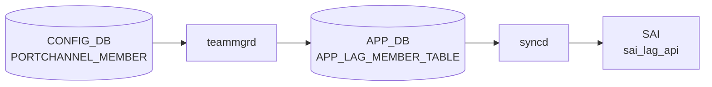

# PORTCHANNEL_MEMBER テーブル

## 概要

PORTCHANNEL とその物理メンバ PORT の対応を保持する。`teammgrd` がこの関係を読み、[teamd](../../reference/glossary.md#term-teamd-teamsyncd-teammgrd) の `enslave` 操作を実行する[^1]。

<!-- cdb-mermaid -->
### データフロー (自動生成)



!!! note "凡例"
    CONFIG_DB から SAI までの典型経路を `docs/reference/config-db-orch-map.md` から機械生成したミニ図。詳細・例外は本ページ本文と対応表を参照。
<!-- /cdb-mermaid -->

## key 構造

```text
PORTCHANNEL_MEMBER|<portchannel_name>|<port_name>
```

両 key とも leafref で、`PORTCHANNEL.name` と `PORT.name` を参照する。

## フィールド一覧

| フィールド | 型 | 必須 | デフォルト | 説明 |
|-----------|----|------|-----------|------|
| `name` (key) | leafref `PORTCHANNEL.name` | ✅ | - | 親 PORTCHANNEL |
| `port` (key) | leafref `PORT.name` | ✅ | - | メンバ物理ポート |

このテーブルは key のみで、付加フィールドを持たない。

## 購読者

- `teammgrd`: メンバの追加・削除を [teamd](../../reference/glossary.md#term-teamd-teamsyncd-teammgrd) に伝達
- `orchagent` `LagOrch`: [SAI](../../reference/glossary.md#term-sai) [LAG](../../reference/glossary.md#term-lag) member を生成・削除

## 関連 CONFIG_DB / YANG / CLI

- 関連 [CONFIG_DB](../../reference/glossary.md#term-config_db): `PORTCHANNEL`、`PORT`、`VLAN_MEMBER` (PORTCHANNEL_MEMBER に登録された port は VLAN_MEMBER に登録不可、`must` 制約は VLAN 側)
- 関連 CLI: `config portchannel member add/del`
- 関連 [YANG](../../reference/glossary.md#term-yang): `sonic-portchannel`

<!-- value-behavior -->
## 値依存挙動マトリクス

### PORTCHANNEL_MEMBER キー: name / port

| フィールド | 値 | 挙動 |
|-----------|---|------|
| `name` | 存在する PORTCHANNEL 名 | teammgrd が teamd に enslave 要求、LagOrch が SAI LAG member 追加 |
| `name` | 存在しない PORTCHANNEL 名 | YANG leafref 違反 reject |
| `port` | 存在する PORT 名 | 物理ポートを LAG に bind |
| `port` | 存在しない PORT 名 | YANG leafref 違反 reject |
| `port` | PHY / SYSTEM 型以外 | `LAG member port has to be of type PHY or SYSTEM` SWSS_LOG_ERROR |
| `port` | 異なる ASIC の switch_id (chassis) | `System lag switch id mismatch` SWSS_LOG_ERROR |

*このテーブルはキー (name, port) のみで付加フィールドを持たない。enum なし。*

<!-- /value-behavior -->

<!-- cdb-exceptions -->
## 例外条件・特殊挙動

<!-- evidence: meta/_intermediate/cdb-flow/portchannel-member.md -->

### YANG スキーマ検証
- key `(name, port)` は PORTCHANNEL と PORT への leafref。参照先が存在しない場合は YANG validate で reject。

### consumer (portsorch / teammgr) 例外動作
- メンバーポートが PHY/SYSTEM 型以外: `LAG member port has to be of type PHY or SYSTEM` → SWSS_LOG_ERROR。
- chassis 環境で switch id ミスマッチ: `System lag switch id mismatch. Lag %s switch id: %d, Member %s switch id: %d` → SWSS_LOG_ERROR。
- DEL で存在しないメンバー: `Member %s not found in LAG %s` → SWSS_LOG_WARN。
- SAI LAG member add 失敗: `Failed to add member %s to LAG %s` → SWSS_LOG_ERROR。
- SAI LAG member remove 失敗: `Failed to remove member %s from LAG %s` → SWSS_LOG_ERROR。
- teamd でポート未発見: `Unable to find port %s` → SWSS_LOG_WARN。

<!-- /cdb-exceptions -->

<!-- ref-triangle:start -->

## 関連リファレンス

- [YANG](../../reference/glossary.md#term-yang): [`sonic-portchannel`](../yang/sonic-portchannel.md)
- CLI: [`config portchannel member`](../cli/config-portchannel.md)

<!-- ref-triangle:end -->

## 引用元

[^1]: [YANG](../../reference/glossary.md#term-yang) 定義: `sonic-portchannel.yang` 内 `PORTCHANNEL_MEMBER`。<https://github.com/sonic-net/sonic-buildimage/blob/9ea932ec2e18f35e58268ec2e4456b1d4afd65cd/src/sonic-yang-models/yang-models/sonic-portchannel.yang#L130>

<!-- topics-back-ref -->
## 関連 Topics

- [Topics: L2 / VLAN / LAG / MC-LAG](../../topics/06-l2-vlan-lag/index.md)

<!-- /topics-back-ref -->

<!-- ops-hint -->
## 運用ヒント

### 典型値

- key 形式: `PORTCHANNEL_MEMBER|PortChannel0001|Ethernet0`。
- 値は空 hash（メンバ関係の存在自体が意味を持つ）。

### よくある誤設定

- VLAN_MEMBER に同じ Ethernet が残ったまま PORTCHANNEL_MEMBER に追加すると [orchagent](../../reference/glossary.md#term-orchagent) エラー。
- L3 IP を持つポートを [LAG](../../reference/glossary.md#term-lag) メンバに入れると INTERFACE 側が孤立。

### 確認コマンド

```bash
sonic-db-cli CONFIG_DB keys 'PORTCHANNEL_MEMBER|PortChannel0001|*'
show interfaces portchannel
```
<!-- /ops-hint -->


<!-- runtime-trace -->
## CDB → 実コンテナ動作トレース

### 段階 1: Consumer 登録

- **orchagent / PortsOrch**: `PORTCHANNEL_MEMBER` テーブルを `SubscriberStateTable` で購読。
- **teammgrd** (`sonic-swss/cfgmgr/teammgr.cpp`): LAG メンバの追加・削除を `teamd` に伝達。

### 段階 2: CFG → APPL 翻訳

- teammgrd が `teamd` プロセスにポートの追加/削除を UNIX ソケット経由で通知。
- APP_DB `LAG_MEMBER_TABLE` に書き込み。

### 段階 3: APPL → SAI

- PortsOrch が APP_DB を読み `sai_lag_api->create_lag_member()` / `remove_lag_member()` を呼び出し。
- LACP が有効な場合は teamd がネゴシエーションを担う。

### 段階 4: タイミング + 副作用

- メンバ追加後 LACP ネゴシエーションが完了するまで数秒 (設定依存)。
- 副作用: メンバ削除時にそのポートのトラフィックは他メンバにハッシュ再分散される。

<!-- /runtime-trace -->
<!-- entry-points -->
## 書き込み入り口 (Direction A)

PORTCHANNEL_MEMBER テーブルへの書き込みが発生するコード経路を網羅的に調査した結果。

### CLI

  - `config portchannel member add/del ...` — `config/main.py` が `set_entry('PORTCHANNEL_MEMBER', ...)` を呼ぶ (sonic-utilities/config/main.py)

### minigraph / sonic-cfggen

**minigraph.py** が PORTCHANNEL_MEMBER を生成し投入 (sonic-buildimage/src/sonic-config-engine/minigraph.py)

### REST / gNMI

REST/gNMI 書き込み経路なし

### db_migrator

db_migrator.py での PORTCHANNEL_MEMBER マイグレーションなし

### ビルド時デフォルト (build-time default)

なし

### ハードコードデフォルト / ランタイム注入

なし

### 死活・デッドコード

なし
<!-- /entry-points -->

<!-- glossary-links-injected: 38b4c0ae7d80 -->

<!-- derivation -->
## 派生・条件付き登録 (Phase 6/7)

### Phase 6: 自動派生

| 派生先フィールド | 派生元条件 | 派生値 | ソース |
|---|---|---|---|
| `PORTCHANNEL_MEMBER` エントリ全体 | minigraph.py が XML `PortChannelInterfaces` → `PortChannel` → メンバポートを解析したとき | `{(PortChannel名, ポート名): {}}` | `sonic-buildimage/src/sonic-config-engine/minigraph.py:2547` |

`PORTCHANNEL_MEMBER` は key-only テーブル (フィールドなし)。minigraph.py が自動生成し、port_config.ini に存在しないポートは除外される (`minigraph.py:2531-2545`)。

### Phase 7: 条件付き登録

`PORTCHANNEL_MEMBER` は `TeamMgr` (`cfgmgr/teammgr.cpp`) が CONFIG_DB を購読し `teamd` にメンバ追加/削除を通知する。`orchdaemon.cpp` の条件付き登録なし。

### グレップカバレッジ

| 項目 | hit 数 | 証跡 |
|---|---|---|
| minigraph.py PORTCHANNEL_MEMBER | 3 | `minigraph.py:2547,2531-2545` |

<!-- /derivation -->

<!-- handler-branching -->
### Phase 8: Handler メソッド内分岐

`TeamMgr::doLagMemberTask()` の分岐:

| Handler | メソッド | 分岐条件 | 効果 | evidence |
|---|---|---|---|---|
| `TeamMgr` | `doTask()` | `table == CFG_LAG_MEMBER_TABLE_NAME` | `doLagMemberTask()` にディスパッチ | `sonic-swss/cfgmgr/teammgr.cpp:161-163` |
| `TeamMgr` | `doLagMemberTask()` | `!isLagStateOk(alias)` または LAG が未作成 | `task_need_retry` (LAG 作成まで待機) | `sonic-swss/cfgmgr/teammgr.cpp` |
| `TeamMgr` | `doLagMemberTask()` | SET 操作 | `teamdctl <lag> port add <member>` でメンバをポートチャネルに追加 | `sonic-swss/cfgmgr/teammgr.cpp` |
| `TeamMgr` | `doLagMemberTask()` | DEL 操作 | `teamdctl <lag> port remove <member>` でメンバを削除 | `sonic-swss/cfgmgr/teammgr.cpp` |

> **スキャン証跡**: `teammgr.cpp:149-169` + `minigraph.py:2547` を確認、4 件分岐抽出。PORTCHANNEL_MEMBER は key-only テーブルであることを確認 — 誤読なし。

<!-- /handler-branching -->
