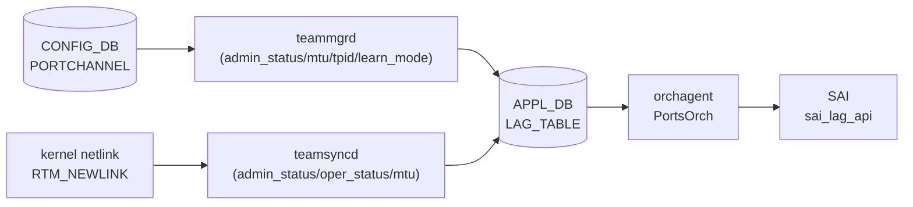

# APPL_DB LAG_TABLE (portchannel ステータス)

## 概要

`APPL_DB LAG_TABLE` は [LAG](../../reference/glossary.md#term-lag) (Link Aggregation Group) の実効設定と運用状態を保持する [APPL_DB](../../reference/glossary.md#term-appl_db) テーブル。
CONFIG_DB `PORTCHANNEL` テーブルとは別物であり、以下の 2 つのプロセスが書き込む[^1][^2]:

1. **teamsyncd** — カーネル netlink の `RTM_NEWLINK` イベントを受けて `admin_status` / `oper_status` / `mtu` を APPL_DB に書き込む
2. **teammgrd** — CONFIG_DB `PORTCHANNEL` テーブルの変更を監視し `admin_status` / `mtu` / `tpid` / `learn_mode` を APPL_DB に反映する。初回書き込み時はコード由来のデフォルト値を補完する



## key 構造

```text
LAG_TABLE:<lag_name>
```

`<lag_name>` は `PortChannel<N>` 形式 (例: `PortChannel0001`)。

## フィールド一覧

| フィールド | 型 | 書き込み元 | デフォルト | 説明 |
|-----------|----|-----------|-----------|------|
| `admin_status` | `up`/`down` | teamsyncd / teammgrd | `"down"` ※1 | 管理状態 |
| `oper_status` | `up`/`down` | teamsyncd | `"down"` ※2 | 実効運用状態 |
| `mtu` | uint (文字列) | teamsyncd / teammgrd | `"9100"` ※3 | MTU [byte] |
| `tpid` | hex string | teammgrd | (省略可) | TPID (CONFIG_DB に値がある場合のみ書かれる) |
| `learn_mode` | string | teammgrd | (省略可) | MAC 学習モード (CONFIG_DB に値がある場合のみ書かれる) |

> ※1, ※2, ※3 は「コード由来の暗黙デフォルト」参照

## 購読者

- **orchagent (PortsOrch)**: `APP_LAG_TABLE` を `SubscriberStateTable` で読み取り、`sai_lag_api->create_lag()` で SAI LAG オブジェクトを作成する。`oper_status` / `mtu` / `learn_mode` / `tpid` を SAI 属性に反映する
- **intfmgrd**: `STATE_LAG_TABLE` (STATE_DB) の `state: ok` を確認してから LAG インタフェースの設定を適用する

<!-- defaults -->
## コード由来の暗黙デフォルト (Phase A)

> **注記**: YANG `default` 指定がない APPL_DB フィールドでも、teamsyncd / teammgrd がコード内でデフォルト値を注入する。以下は実装精読から検出した暗黙デフォルトと挙動。

### admin_status

- **portmgr.h:14** `#define DEFAULT_ADMIN_STATUS_STR "down"` でハードコード
- teammgrd の `doLagTask()` が SET 操作時に変数 `admin_status` をこのデフォルトで初期化する (`teammgr.cpp:251`)
- CONFIG_DB `PORTCHANNEL` に `admin_status` フィールドが存在する場合はその値を使い (`teammgr.cpp:271-273`)、存在しない場合は `"down"` が APPL_DB に書き込まれる
- teamsyncd は RTM_NEWLINK イベントで `rtnl_link_get_flags(link) & IFF_UP` の結果を書き込む (`teamsync.cpp:151`)。teamd がデバイスを作成した直後は IFF_UP が立っているため `"up"` になることもある
- **実質的な初期値**: CONFIG_DB に `admin_status` フィールドがない場合は `"down"`

**暗黙デフォルト**: `"down"` (portmgr.h:14、teammgr.cpp:251)

### oper_status

- teamsyncd が RTM_NEWLINK イベントで `rtnl_link_get_flags(link) & IFF_LOWER_UP` の結果を書き込む (`teamsync.cpp:152`)
- LAG 作成直後はメンバが存在しないため `IFF_LOWER_UP` は立たず `"down"` が書かれる
- LACP ネゴシエーション完了後にメンバがアクティブになると teamsyncd が RTM_NEWLINK を受け `"up"` に更新する
- orchagent (PortsOrch) は `oper_status` フィールドを読み取り (`portsorch.cpp:6088-6096`)、SAI に反映する。orchagent が APPL_DB の `oper_status` を書き戻す処理はない (STATE_DB または SAI 通知に基づく)

**暗黙デフォルト**: `"down"` (LAG 作成直後、メンバなし状態での IFF_LOWER_UP 未セット)

### mtu

- **portmgr.h:15** `#define DEFAULT_MTU_STR "9100"` でハードコード
- teammgrd の `doLagTask()` が SET 操作時に変数 `mtu` をこのデフォルトで初期化する (`teammgr.cpp:252`)
- CONFIG_DB `PORTCHANNEL` に `mtu` フィールドが存在する場合はその値を使い (`teammgr.cpp:277-281`)、存在しない場合は `"9100"` が `setLagMtu()` 経由で APPL_DB に書き込まれる (`teammgr.cpp:512-515`)
- teamsyncd は RTM_NEWLINK 時に `rtnl_link_get_mtu(link)` でカーネルから実際の MTU を取得して書き込む (`teamsync.cpp:140, 153`)

**暗黙デフォルト**: `"9100"` (portmgr.h:15、teammgr.cpp:252 / CONFIG_DB に mtu フィールドがない場合)

### tpid

- teammgrd の `setLagTpid()` が CONFIG_DB に `tpid` フィールドがある場合のみ APPL_DB に書き込む (`teammgr.cpp:542-545`)
- CONFIG_DB `PORTCHANNEL` に `tpid` がない場合は APPL_DB にも書かれない
- orchagent が `tpid` を読み取り SAI の LAG TPID 属性に反映する (`portsorch.cpp:6106-6112`)

**暗黙デフォルト**: 存在しない (CONFIG_DB に `tpid` フィールドがある場合のみ書かれる)

### learn_mode

- teammgrd の `setLagLearnMode()` が CONFIG_DB に `learn_mode` フィールドがある場合のみ APPL_DB に書き込む (`teammgr.cpp:556-559`)
- CONFIG_DB `PORTCHANNEL` に `learn_mode` がない場合は APPL_DB にも書かれない

**暗黙デフォルト**: 存在しない (CONFIG_DB に `learn_mode` フィールドがある場合のみ書かれる)

### state (STATE_DB 専用)

- teamsyncd の `addLag()` は `state: "ok"` を **STATE_DB** の `LAG_TABLE` (`STATE_LAG_TABLE_NAME`) に書き込む (`teamsync.cpp:175, 203`)
- `state` フィールドは APPL_DB LAG_TABLE には書かれない。STATE_DB の `LAG_TABLE|<lag_name>|state` = `"ok"` が LAG の準備完了サインとして intfmgrd 等が利用する

**暗黙デフォルト**: APPL_DB には存在しない (STATE_DB のみ)

<!-- /defaults -->

<!-- ordering -->
## 書込み順依存 (Phase B)

APPL_DB `LAG_TABLE` への書き込みは **teamsyncd** (カーネル RTM_NEWLINK 駆動) と **teammgrd** (CONFIG_DB PORTCHANNEL 変更駆動) の 2 プロセスが担う。両者の間と orchagent (consumer) 側に以下の順序依存がある。

### 検出された順序依存

| # | 依存関係 | 方向 | 緩和策 |
|---|----------|------|--------|
| 1 | `APPL_DB LAG_TABLE` 書込み → `STATE_DB LAG_TABLE` 書込み | **強制先行** (teamsyncd 内) | team instance 生成成功後のみ STATE_DB に書かれる |
| 2 | `PortConfigDone` / `allPortsReady()` → orchagent LAG 処理開始 | **強制先行** | portsyncd ready まで orchagent は LAG_TABLE を処理しない |
| 3 | `STATE_DB LAG_TABLE` ready → `PORTCHANNEL_MEMBER` SET 処理 | **強制先行** | teammgrd が `isLagStateOk()` チェックで自動リトライ待機 |
| 4 | `LAG_MEMBER_TABLE` 全 DEL → `LAG_TABLE` DEL | 推奨先行 | 逆順では orchagent が non-empty LAG エラーを返す |
| 5 | `INTF_TABLE` / `VLAN_MEMBER` DEL → `LAG_TABLE` DEL | **強制先行** (ref_count / VLAN 制約) | 参照解放まで SAI DEL が拒否される |

### 主要な制約詳細

**APPL_DB → STATE_DB 書込み順 (依存 #1)**: teamsyncd `addLag()` は RTM_NEWLINK 受信時にまず `m_lagTable.set(lagName, fvVector)` で APPL_DB を書き込み、その後 `TeamPortSync` オブジェクトの生成に成功した場合のみ `m_stateLagTable.set(lagName, fvVector)` で STATE_DB を書き込む (`teamsync.cpp:157, 175, 203`)。コードコメントに明示: "STATE_DB is written only after the team instance is successfully created to prevent dependent services (e.g. intfmgrd) from acting on a LAG that teamd has not yet finished setting up"。team_init() が EADDRNOTAVAIL で失敗した場合、APPL_DB は書かれても STATE_DB は書かれない中間状態が発生し、次の RTM_NEWLINK で再試行される。

**teammgrd フィールド適用順 (依存 #1 補足)**: `doLagTask()` (`teammgr.cpp:303-323`) のフィールド適用順は (1) `addLag()` → teamd プロセス起動、(2) `setLagAdminStatus()` → `ip link set` でカーネル状態変更（RTM_NEWLINK 経由で teamsyncd が APPL_DB を更新）、(3) `setLagMtu()` → `ip link set mtu` 後に `m_appLagTable.set()` で APPL_DB の `mtu` を直接書込み (`teammgr.cpp:512-515`)、(4) `setLagLearnMode()` / `setLagTpid()` → APPL_DB に直接書込み。`addLag()` が `task_need_retry` を返した場合、後続フィールドは一切処理されない。

**orchagent LAG 処理ブロック (依存 #2)**: orchagent は `allPortsReady()` が true になるまで APPL_DB LAG_TABLE の処理を開始しない (`portsorch.cpp:6513-6517`)。portsyncd が CONFIG_DB|PORT を全件読んで `PortConfigDone` → `PortInitDone` を発行するまで、APPL_DB に LAG_TABLE エントリが書かれても orchagent は SAI `create_lag()` を呼ばない。

**warm reboot 時の一括適用**: teamsyncd は warm reboot 中に `m_lagTable.create_temp_view()` を利用し RTM_NEWLINK イベントを集積する。タイマー満了後 `apply_temp_view()` で APPL_DB に一括反映し、STATE_DB は reconcile 完了後にまとめて書き込まれる (`teamsync.cpp:41-43, 88-89`)。warm reboot 期間中は APPL_DB が古い値のまま STATE_DB が更新されない中間状態が続く。
<!-- /ordering -->

<!-- cross-refs -->
## 暗黙参照テーブル (Phase C)

YANG leafref を超えた他テーブル・他 DB・プロセスへの実装上の依存関係。

| 参照先 | DB / 場所 | 方向 | 契機 | 根拠コード |
|--------|-----------|------|------|-----------|
| `PORTCHANNEL` | CONFIG_DB | READ | `teammgrd` が `CFG_LAG_TABLE_NAME` を購読し SET/DEL イベントを受信するたびに `APP_LAG_TABLE_NAME` へ書き込む。`PORTCHANNEL` が CONFIG_DB に存在しない場合は APPL_DB `LAG_TABLE` への書き込みも発生しない | `teammgr.cpp:33, 157` |
| `PORTCHANNEL_MEMBER` | CONFIG_DB | READ | `teammgrd` が `CFG_LAG_MEMBER_TABLE_NAME` を購読し、`isLagStateOk()` チェック後にメンバーポートを teamd プロセスに追加する。APPL_DB `LAG_TABLE` への書き込みとは独立したテーブルだが、同一 `TeamMgr` インスタンスが管理する | `teammgr.cpp:34, 421, 518` |
| `LAG_TABLE` | STATE_DB | WRITE（副産物） | `teamsyncd` の `addLag()` が APPL_DB 書き込み成功後に `m_stateLagTable.set()` で `state: "ok"` を STATE_DB に書き込む。STATE_DB の `LAG_TABLE` は APPL_DB `LAG_TABLE` と同名だが別 DB の別テーブル | `teamsync.cpp:175, 203` |
| `LAG_TABLE` (STATE_DB) | STATE_DB | READ | `intfmgrd` が `STATE_LAG_TABLE_NAME` を `Consumer` として購読し、LAG の `state: ok` を確認してからインタフェース設定を適用する。STATE_DB キーが存在しない場合 `intfmgrd` は LAG インタフェースを処理しない | `intfmgr.cpp:51-52, 1183` |
| `COUNTERS_LAG_NAME_MAP` | COUNTERS_DB | WRITE | `portsorch` の `addLag()` が LAG SAI オブジェクト作成成功時に `m_counterLagTable->set()` で `<lag_alias>` → `<sai_oid>` マッピングを書き込む。`removeLag()` で `hdel` により削除 | `portsorch.cpp:762, 8022, 8095` |
| IntfsOrch（内部）— RIF MTU 伝播 | orchagent 内部 | CALL | `doLagTask()` が `mtu` フィールドを更新した際、LAG に RIF (Router Interface) が存在する場合は `gIntfsOrch->setRouterIntfsMtu(l)` を呼んで RIF の MTU も連動更新する。LAG の MTU 変更は L3 転送側にも波及する | `portsorch.cpp:6163` |
| `CHASSIS_APP_LAG_TABLE` | CHASSIS_APP_DB | WRITE (VoQ のみ) | VoQ モード (`gMySwitchType == "voq"`) では `addLag()` / `removeLag()` がそれぞれ `voqSyncAddLag()` / `voqSyncDelLag()` を呼び、CHASSIS_APP_DB の `CHASSIS_APP_LAG_TABLE_NAME` へ同期書き込みする。非 VoQ 環境では発生しない | `portsorch.cpp:8037-8039, 8114-8116` |
| SUBJECT_TYPE_PORT_CHANGE 通知 | orchagent 内部 | NOTIFY | `addLag()` / `removeLag()` は `notify(SUBJECT_TYPE_PORT_CHANGE, ...)` で orchagent 内の subscriber Orch（VXLAN Orch 等）に LAG の追加/削除を通知する。通知はメモリ内イベントバスを通じて伝達される（DB 書き込みなし） | `portsorch.cpp:8024-8025, 8090-8091` |

### 補足

- **STATE_DB LAG_TABLE との非対称性**: APPL_DB `LAG_TABLE` はフィールド `admin_status` / `oper_status` / `mtu` / `tpid` / `learn_mode` を持つが、STATE_DB `LAG_TABLE` は `admin_status` / `oper_status` / `mtu` / `state` を持つ。`state: ok` フィールドは APPL_DB には書かれない（STATE_DB 専用）。
- **`m_port_ref_count` による削除制御**: `removeLag()` は `m_port_ref_count[lag.m_alias] > 0` の場合に削除を拒否する。この ref_count は `INTF_TABLE` や VLAN メンバーなど、LAG を参照する他テーブルの SAI 登録数を追跡しており、参照が全解除されるまで SAI `remove_lag()` は呼ばれない（`portsorch.cpp:8047-8052`）。

<!-- /cross-refs -->

## APPL_DB LAG_TABLE と STATE_DB LAG_TABLE の区別

| 側面 | APPL_DB LAG_TABLE | STATE_DB LAG_TABLE |
|------|--------------------|-------------------|
| 書き込み元 | teamsyncd / teammgrd | teamsyncd |
| 主なフィールド | admin_status, oper_status, mtu, tpid, learn_mode | admin_status, oper_status, mtu, state |
| `state: ok` フィールド | なし | あり |
| 用途 | orchagent への設定伝達 | intfmgrd 等が LAG 準備完了を確認 |

## 確認コマンド

```bash
# APPL_DB LAG_TABLE を直接参照
sonic-db-cli APPL_DB hgetall 'LAG_TABLE:PortChannel0001'

# STATE_DB LAG_TABLE を確認
sonic-db-cli STATE_DB hgetall 'LAG_TABLE|PortChannel0001'

# portchannel の運用状態確認
show interfaces portchannel

# teamd の状態確認
teamdctl PortChannel0001 state
```

## 関連リファレンス

- CONFIG_DB: [`PORTCHANNEL テーブル`](./portchannel.md)
- CONFIG_DB: [`PORTCHANNEL_MEMBER テーブル`](./portchannel-member.md)
- CLI: [`show interfaces portchannel`](../cli/show-interfaces-portchannel.md)

## 引用元

[^1]: teamsyncd teamsync.cpp: <https://github.com/sonic-net/sonic-swss/blob/4305596156d70e9797e8a881b3d19b46de0bce0d/teamsyncd/teamsync.cpp>
[^2]: teammgrd teammgr.cpp, portmgr.h: <https://github.com/sonic-net/sonic-swss/blob/4305596156d70e9797e8a881b3d19b46de0bce0d/cfgmgr/teammgr.cpp>
