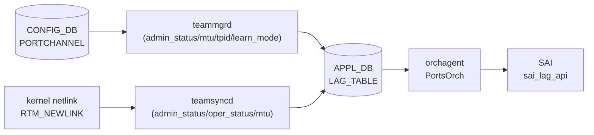
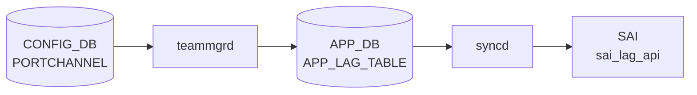

# APPL_DB LAG_TABLE (portchannel ステータス)

## 概要

`APPL_DB LAG_TABLE` は [LAG](../../reference/glossary.md#term-lag) (Link Aggregation Group) の実効設定と運用状態を保持する [APPL_DB](../../reference/glossary.md#term-appl_db) テーブル。
[CONFIG_DB](../../reference/glossary.md#term-config_db) `PORTCHANNEL` テーブルとは別物であり、以下の 2 つのプロセスが書き込む[^1][^2]:

1. **teamsyncd** — カーネル netlink の `RTM_NEWLINK` イベントを受けて `admin_status` / `oper_status` / `mtu` を [APPL_DB](../../reference/glossary.md#term-appl_db) に書き込む
2. **teammgrd** — [CONFIG_DB](../../reference/glossary.md#term-config_db) `PORTCHANNEL` テーブルの変更を監視し `admin_status` / `mtu` / `tpid` / `learn_mode` を [APPL_DB](../../reference/glossary.md#term-appl_db) に反映する。初回書き込み時はコード由来のデフォルト値を補完する



<!-- cdb-mermaid -->
### データフロー (自動生成)



!!! note "凡例"
    CONFIG_DB から SAI までの典型経路を `docs/reference/config-db-orch-map.md` から機械生成したミニ図。詳細・例外は本ページ本文と対応表を参照。
<!-- /cdb-mermaid -->

## key 構造

```text
LAG_TABLE:<lag_name>
```

`<lag_name>` は `PortChannel<N>` 形式 (例: `PortChannel0001`)。

## フィールド一覧

| フィールド | 型 | 書き込み元 | デフォルト | 説明 |
|-----------|----|-----------|-----------|------|
| `admin_status` | `up`/`down` | teamsyncd / teammgrd | `"down"` ※1 | 管理状態 |
| `oper_status` | `up`/`down` | teamsyncd | `"down"` ※2 | 実効運用状態 |
| `mtu` | uint (文字列) | teamsyncd / teammgrd | `"9100"` ※3 | MTU [byte] |
| `tpid` | hex string | teammgrd | (省略可) | TPID ([CONFIG_DB](../../reference/glossary.md#term-config_db) に値がある場合のみ書かれる) |
| `learn_mode` | string | teammgrd | (省略可) | MAC 学習モード (CONFIG_DB に値がある場合のみ書かれる) |

> ※1, ※2, ※3 は「コード由来の暗黙デフォルト」参照

## 購読者

- **[orchagent](../../reference/glossary.md#term-orchagent) (PortsOrch)**: `APP_LAG_TABLE` を `SubscriberStateTable` で読み取り、`sai_lag_api->create_lag()` で [SAI](../../reference/glossary.md#term-sai) [LAG](../../reference/glossary.md#term-lag) オブジェクトを作成する。`oper_status` / `mtu` / `learn_mode` / `tpid` を [SAI](../../reference/glossary.md#term-sai) 属性に反映する
- **[intfmgrd](../../reference/glossary.md#term-intfmgrd)**: `STATE_LAG_TABLE` ([STATE_DB](../../reference/glossary.md#term-state_db)) の `state: ok` を確認してから [LAG](../../reference/glossary.md#term-lag) インタフェースの設定を適用する

<!-- defaults -->
## コード由来の暗黙デフォルト (Phase A)

> **注記**: [YANG](../../reference/glossary.md#term-yang) `default` 指定がない APPL_DB フィールドでも、teamsyncd / teammgrd がコード内でデフォルト値を注入する。以下は実装精読から検出した暗黙デフォルトと挙動。

### admin_status

- **portmgr.h:14** `#define DEFAULT_ADMIN_STATUS_STR "down"` でハードコード
- teammgrd の `doLagTask()` が SET 操作時に変数 `admin_status` をこのデフォルトで初期化する (`teammgr.cpp:251`)
- CONFIG_DB `PORTCHANNEL` に `admin_status` フィールドが存在する場合はその値を使い (`teammgr.cpp:271-273`)、存在しない場合は `"down"` が APPL_DB に書き込まれる
- teamsyncd は RTM_NEWLINK イベントで `rtnl_link_get_flags(link) & IFF_UP` の結果を書き込む (`teamsync.cpp:151`)。[teamd](../../reference/glossary.md#term-teamd-teamsyncd-teammgrd) がデバイスを作成した直後は IFF_UP が立っているため `"up"` になることもある
- **実質的な初期値**: CONFIG_DB に `admin_status` フィールドがない場合は `"down"`

**暗黙デフォルト**: `"down"` (portmgr.h:14、teammgr.cpp:251)

### oper_status

- teamsyncd が RTM_NEWLINK イベントで `rtnl_link_get_flags(link) & IFF_LOWER_UP` の結果を書き込む (`teamsync.cpp:152`)
- LAG 作成直後はメンバが存在しないため `IFF_LOWER_UP` は立たず `"down"` が書かれる
- [LACP](../../reference/glossary.md#term-lacp) ネゴシエーション完了後にメンバがアクティブになると teamsyncd が RTM_NEWLINK を受け `"up"` に更新する
- [orchagent](../../reference/glossary.md#term-orchagent) (PortsOrch) は `oper_status` フィールドを読み取り (`portsorch.cpp:6088-6096`)、[SAI](../../reference/glossary.md#term-sai) に反映する。[orchagent](../../reference/glossary.md#term-orchagent) が APPL_DB の `oper_status` を書き戻す処理はない ([STATE_DB](../../reference/glossary.md#term-state_db) または SAI 通知に基づく)

**暗黙デフォルト**: `"down"` (LAG 作成直後、メンバなし状態での IFF_LOWER_UP 未セット)

### mtu

- **portmgr.h:15** `#define DEFAULT_MTU_STR "9100"` でハードコード
- teammgrd の `doLagTask()` が SET 操作時に変数 `mtu` をこのデフォルトで初期化する (`teammgr.cpp:252`)
- CONFIG_DB `PORTCHANNEL` に `mtu` フィールドが存在する場合はその値を使い (`teammgr.cpp:277-281`)、存在しない場合は `"9100"` が `setLagMtu()` 経由で APPL_DB に書き込まれる (`teammgr.cpp:512-515`)
- teamsyncd は RTM_NEWLINK 時に `rtnl_link_get_mtu(link)` でカーネルから実際の MTU を取得して書き込む (`teamsync.cpp:140, 153`)

**暗黙デフォルト**: `"9100"` (portmgr.h:15、teammgr.cpp:252 / CONFIG_DB に mtu フィールドがない場合)

### tpid

- teammgrd の `setLagTpid()` が CONFIG_DB に `tpid` フィールドがある場合のみ APPL_DB に書き込む (`teammgr.cpp:542-545`)
- CONFIG_DB `PORTCHANNEL` に `tpid` がない場合は APPL_DB にも書かれない
- orchagent が `tpid` を読み取り SAI の LAG TPID 属性に反映する (`portsorch.cpp:6106-6112`)

**暗黙デフォルト**: 存在しない (CONFIG_DB に `tpid` フィールドがある場合のみ書かれる)

### learn_mode

- teammgrd の `setLagLearnMode()` が CONFIG_DB に `learn_mode` フィールドがある場合のみ APPL_DB に書き込む (`teammgr.cpp:556-559`)
- CONFIG_DB `PORTCHANNEL` に `learn_mode` がない場合は APPL_DB にも書かれない

**暗黙デフォルト**: 存在しない (CONFIG_DB に `learn_mode` フィールドがある場合のみ書かれる)

### state (STATE_DB 専用)

- teamsyncd の `addLag()` は `state: "ok"` を **[STATE_DB](../../reference/glossary.md#term-state_db)** の `LAG_TABLE` (`STATE_LAG_TABLE_NAME`) に書き込む (`teamsync.cpp:175, 203`)
- `state` フィールドは APPL_DB LAG_TABLE には書かれない。STATE_DB の `LAG_TABLE|<lag_name>|state` = `"ok"` が LAG の準備完了サインとして [intfmgrd](../../reference/glossary.md#term-intfmgrd) 等が利用する

**暗黙デフォルト**: APPL_DB には存在しない (STATE_DB のみ)

<!-- /defaults -->

<!-- ordering -->
## 書込み順依存 (Phase B)

APPL_DB `LAG_TABLE` への書き込みは **teamsyncd** (カーネル RTM_NEWLINK 駆動) と **teammgrd** (CONFIG_DB PORTCHANNEL 変更駆動) の 2 プロセスが担う。両者の間と orchagent (consumer) 側に以下の順序依存がある。

### 検出された順序依存

| # | 依存関係 | 方向 | 緩和策 |
|---|----------|------|--------|
| 1 | `APPL_DB LAG_TABLE` 書込み → `STATE_DB LAG_TABLE` 書込み | **強制先行** (teamsyncd 内) | team instance 生成成功後のみ STATE_DB に書かれる |
| 2 | `PortConfigDone` / `allPortsReady()` → orchagent LAG 処理開始 | **強制先行** | [portsyncd](../../reference/glossary.md#term-portsyncd) ready まで orchagent は LAG_TABLE を処理しない |
| 3 | `STATE_DB LAG_TABLE` ready → `PORTCHANNEL_MEMBER` SET 処理 | **強制先行** | teammgrd が `isLagStateOk()` チェックで自動リトライ待機 |
| 4 | `LAG_MEMBER_TABLE` 全 DEL → `LAG_TABLE` DEL | 推奨先行 | 逆順では orchagent が non-empty LAG エラーを返す |
| 5 | `INTF_TABLE` / `VLAN_MEMBER` DEL → `LAG_TABLE` DEL | **強制先行** (ref_count / [VLAN](../../reference/glossary.md#term-vlan) 制約) | 参照解放まで SAI DEL が拒否される |

### 主要な制約詳細

**APPL_DB → STATE_DB 書込み順 (依存 #1)**: teamsyncd `addLag()` は RTM_NEWLINK 受信時にまず `m_lagTable.set(lagName, fvVector)` で APPL_DB を書き込み、その後 `TeamPortSync` オブジェクトの生成に成功した場合のみ `m_stateLagTable.set(lagName, fvVector)` で STATE_DB を書き込む (`teamsync.cpp:157, 175, 203`)。コードコメントに明示: "STATE_DB is written only after the team instance is successfully created to prevent dependent services (e.g. [intfmgrd](../../reference/glossary.md#term-intfmgrd)) from acting on a LAG that [teamd](../../reference/glossary.md#term-teamd-teamsyncd-teammgrd) has not yet finished setting up"。team_init() が EADDRNOTAVAIL で失敗した場合、APPL_DB は書かれても STATE_DB は書かれない中間状態が発生し、次の RTM_NEWLINK で再試行される。

**teammgrd フィールド適用順 (依存 #1 補足)**: `doLagTask()` (`teammgr.cpp:303-323`) のフィールド適用順は (1) `addLag()` → [teamd](../../reference/glossary.md#term-teamd-teamsyncd-teammgrd) プロセス起動、(2) `setLagAdminStatus()` → `ip link set` でカーネル状態変更（RTM_NEWLINK 経由で teamsyncd が APPL_DB を更新）、(3) `setLagMtu()` → `ip link set mtu` 後に `m_appLagTable.set()` で APPL_DB の `mtu` を直接書込み (`teammgr.cpp:512-515`)、(4) `setLagLearnMode()` / `setLagTpid()` → APPL_DB に直接書込み。`addLag()` が `task_need_retry` を返した場合、後続フィールドは一切処理されない。

**orchagent LAG 処理ブロック (依存 #2)**: orchagent は `allPortsReady()` が true になるまで APPL_DB LAG_TABLE の処理を開始しない (`portsorch.cpp:6513-6517`)。[portsyncd](../../reference/glossary.md#term-portsyncd) が CONFIG_DB|PORT を全件読んで `PortConfigDone` → `PortInitDone` を発行するまで、APPL_DB に LAG_TABLE エントリが書かれても orchagent は SAI `create_lag()` を呼ばない。

**warm reboot 時の一括適用**: teamsyncd は warm reboot 中に `m_lagTable.create_temp_view()` を利用し RTM_NEWLINK イベントを集積する。タイマー満了後 `apply_temp_view()` で APPL_DB に一括反映し、STATE_DB は reconcile 完了後にまとめて書き込まれる (`teamsync.cpp:41-43, 88-89`)。warm reboot 期間中は APPL_DB が古い値のまま STATE_DB が更新されない中間状態が続く。
<!-- /ordering -->

<!-- cross-refs -->
## 暗黙参照テーブル (Phase C)

[YANG](../../reference/glossary.md#term-yang) leafref を超えた他テーブル・他 DB・プロセスへの実装上の依存関係。

| 参照先 | DB / 場所 | 方向 | 契機 | 根拠コード |
|--------|-----------|------|------|-----------|
| `PORTCHANNEL` | CONFIG_DB | READ | `teammgrd` が `CFG_LAG_TABLE_NAME` を購読し SET/DEL イベントを受信するたびに `APP_LAG_TABLE_NAME` へ書き込む。`PORTCHANNEL` が CONFIG_DB に存在しない場合は APPL_DB `LAG_TABLE` への書き込みも発生しない | `teammgr.cpp:33, 157` |
| `PORTCHANNEL_MEMBER` | CONFIG_DB | READ | `teammgrd` が `CFG_LAG_MEMBER_TABLE_NAME` を購読し、`isLagStateOk()` チェック後にメンバーポートを teamd プロセスに追加する。APPL_DB `LAG_TABLE` への書き込みとは独立したテーブルだが、同一 `TeamMgr` インスタンスが管理する | `teammgr.cpp:34, 421, 518` |
| `LAG_TABLE` | STATE_DB | WRITE（副産物） | `teamsyncd` の `addLag()` が APPL_DB 書き込み成功後に `m_stateLagTable.set()` で `state: "ok"` を STATE_DB に書き込む。STATE_DB の `LAG_TABLE` は APPL_DB `LAG_TABLE` と同名だが別 DB の別テーブル | `teamsync.cpp:175, 203` |
| `LAG_TABLE` (STATE_DB) | STATE_DB | READ | `intfmgrd` が `STATE_LAG_TABLE_NAME` を `Consumer` として購読し、LAG の `state: ok` を確認してからインタフェース設定を適用する。STATE_DB キーが存在しない場合 `intfmgrd` は LAG インタフェースを処理しない | `intfmgr.cpp:51-52, 1183` |
| `COUNTERS_LAG_NAME_MAP` | [COUNTERS_DB](../../reference/glossary.md#term-counters_db) | WRITE | `portsorch` の `addLag()` が LAG SAI オブジェクト作成成功時に `m_counterLagTable->set()` で `<lag_alias>` → `<sai_oid>` マッピングを書き込む。`removeLag()` で `hdel` により削除 | `portsorch.cpp:762, 8022, 8095` |
| IntfsOrch（内部）— [RIF](../../reference/glossary.md#term-rif) MTU 伝播 | orchagent 内部 | CALL | `doLagTask()` が `mtu` フィールドを更新した際、LAG に [RIF](../../reference/glossary.md#term-rif) (Router Interface) が存在する場合は `gIntfsOrch->setRouterIntfsMtu(l)` を呼んで [RIF](../../reference/glossary.md#term-rif) の MTU も連動更新する。LAG の MTU 変更は L3 転送側にも波及する | `portsorch.cpp:6163` |
| `CHASSIS_APP_LAG_TABLE` | CHASSIS_APP_DB | WRITE (VoQ のみ) | VoQ モード (`gMySwitchType == "voq"`) では `addLag()` / `removeLag()` がそれぞれ `voqSyncAddLag()` / `voqSyncDelLag()` を呼び、CHASSIS_APP_DB の `CHASSIS_APP_LAG_TABLE_NAME` へ同期書き込みする。非 VoQ 環境では発生しない | `portsorch.cpp:8037-8039, 8114-8116` |
| SUBJECT_TYPE_PORT_CHANGE 通知 | orchagent 内部 | NOTIFY | `addLag()` / `removeLag()` は `notify(SUBJECT_TYPE_PORT_CHANGE, ...)` で orchagent 内の subscriber Orch（[VXLAN](../../reference/glossary.md#term-vxlan) Orch 等）に LAG の追加/削除を通知する。通知はメモリ内イベントバスを通じて伝達される（DB 書き込みなし） | `portsorch.cpp:8024-8025, 8090-8091` |

### 補足

- **STATE_DB LAG_TABLE との非対称性**: APPL_DB `LAG_TABLE` はフィールド `admin_status` / `oper_status` / `mtu` / `tpid` / `learn_mode` を持つが、STATE_DB `LAG_TABLE` は `admin_status` / `oper_status` / `mtu` / `state` を持つ。`state: ok` フィールドは APPL_DB には書かれない（STATE_DB 専用）。
- **`m_port_ref_count` による削除制御**: `removeLag()` は `m_port_ref_count[lag.m_alias] > 0` の場合に削除を拒否する。この ref_count は `INTF_TABLE` や [VLAN](../../reference/glossary.md#term-vlan) メンバーなど、LAG を参照する他テーブルの SAI 登録数を追跡しており、参照が全解除されるまで SAI `remove_lag()` は呼ばれない（`portsorch.cpp:8047-8052`）。

<!-- /cross-refs -->

<!-- failure -->
## 失敗挙動 (Phase D)

APPL_DB `LAG_TABLE` の書き込み経路（teamsyncd / teammgrd）と orchagent (PortsOrch) の消費経路それぞれで、以下の失敗パスが存在する。

### 失敗パスまとめ

| 失敗ケース | 発生箇所 | APPL_DB 影響 | STATE_DB 影響 | retry |
|-----------|---------|-------------|--------------|-------|
| teamd 起動コマンド失敗 (`exec` 失敗) | `teammgr.cpp:640-644` | なし | なし | 無制限 (`task_need_retry`) |
| teamd LAG member 追加失敗（port admin UP 競合） | `teammgr.cpp:779-781` | なし | なし | 無制限 (`task_need_retry`) |
| teamd LAG member 追加失敗（port admin DOWN のまま） | `teammgr.cpp:785-787` | なし | なし | なし (`task_failed`、ログ ERROR のみ) |
| `isPortStateOk` / `isLagStateOk` 未 ready | `teammgr.cpp:357` | なし | なし | 暗黙 retry（STATE_DB ready まで `it++; continue`） |
| `team_init()` 失敗（EADDRNOTAVAIL 等） | `teamsync.cpp:208-213` | APPL_DB にエントリ残留 | 書かれない | 次の RTM_NEWLINK で自動復旧 |
| SAI `create_lag` 失敗 | `portsorch.cpp:7994-8005` | なし | なし | 無制限 |
| SAI `remove_lag` 拒否（ref_count > 0） | `portsorch.cpp:8047-8052` | APPL_DB エントリ残留 | なし | 参照解放まで無制限 retry |

### 主要な失敗詳細

**teamd 起動失敗 → cleanup retry (依存 #1)**: `teammgrd` の `doLagTask()` は `addLag(alias, ...)` が `task_need_retry` を返した場合、すぐに `removeLag(alias)` を呼んで残留 teamd プロセスをクリーンアップし、`it++; continue` で次のイベントループに持ち越す (`teammgr.cpp:303-307`)。この間 APPL_DB `LAG_TABLE` にはエントリが書かれず、STATE_DB も書かれない。

**team_init() 失敗の中間状態**: teamsyncd `addLag()` は RTM_NEWLINK 受信時に `m_lagTable.set()` で APPL_DB を先に書き込み (`teamsync.cpp:157`)、その後 `TeamPortSync` オブジェクト生成を試みる。`team_init()` が `EADDRNOTAVAIL`（ifindex 不正）等で `std::system_error` をスローした場合、catch ブロックに入って `m_stateLagTable.set()` には到達しない (`teamsync.cpp:194-213`)。この結果、**APPL_DB に LAG_TABLE エントリが存在するが STATE_DB にはエントリが存在しない**中間状態が発生する。コードコメントに明示: "STATE_DB is written only after the team instance is successfully created to prevent dependent services (e.g. intfmgrd) from acting on a LAG that teamd has not yet finished setting up"。teamd がデバイスを再作成して次の RTM_NEWLINK が発火されると自動復旧する。

**orchagent SAI remove_lag 拒否**: `PortsOrch::removeLag()` は LAG を参照する他テーブル（INTF_TABLE / VLAN_MEMBER_TABLE 等）の SAI 登録が残っている間は SAI `remove_lag()` を呼ばない。`doLagTask()` の DEL 処理で `removeLag()` が `false` を返すと `it++` で再試行 (`portsorch.cpp:6225-6228`)。APPL_DB `LAG_TABLE` のエントリはこの間削除されない。

<!-- /failure -->

<!-- constants -->
## ハードコード定数 (Phase E)

以下の定数は `sonic-swss/cfgmgr/portmgr.h`、`sonic-swss/cfgmgr/shellcmd.h`、`sonic-swss/cfgmgr/teammgr.cpp`、`sonic-swss/teamsyncd/teamsync.h` から検出したマジックナンバー・パス・閾値。

| 定数 / マクロ名 | 値 | 定義ファイル | 意味・影響 |
|---|---|---|---|
| `DEFAULT_ADMIN_STATUS_STR` | `"down"` | `portmgr.h:14` | teammgrd が `doLagTask()` で `admin_status` 変数を初期化するデフォルト値。CONFIG_DB `PORTCHANNEL` に `admin_status` フィールドがない場合、APPL_DB に `"down"` が書き込まれる |
| `DEFAULT_MTU_STR` | `"9100"` | `portmgr.h:15` | teammgrd が `doLagTask()` で `mtu` 変数を初期化するデフォルト値。CONFIG_DB `PORTCHANNEL` に `mtu` フィールドがない場合、APPL_DB に `"9100"` が書き込まれる |
| `TEAMD_CMD` | `"/usr/bin/teamd"` | `shellcmd.h:13` | LAG 作成時 (`addLag()`) に teamd プロセスを起動するコマンドのフルパス。このパスが存在しない場合、`exec()` が失敗して `task_need_retry` が返される |
| `TEAMDCTL_CMD` | `"/usr/bin/teamdctl"` | `shellcmd.h:14` | [LACP](../../reference/glossary.md#term-lacp) key 生成 (`generateLacpKey()`) で `teamdctl ... state dump` を実行するコマンドのフルパス |
| `DEFAULT_WR_PENDING_TIMEOUT` | `70` 秒 | `teamsync.h:16` | warm reboot 時に teamsyncd が RTM_NEWLINK イベントを `temp_view` に集積する最大待機秒数。タイマー満了後 `apply_temp_view()` で APPL_DB へ一括反映される。WarmStart [YANG](../../reference/glossary.md#term-yang) で上書き可能 |
| `TEAMSYNCD_APP_NAME` | `"teamsyncd"` | `teamsync.h:14` | `WarmStart::initialize()` / `WarmStart::checkWarmStart()` に渡すアプリケーション名。warm reboot タイマー設定のキー |
| LAG warmboot dump パス | `"/var/warmboot/teamd/"` | `teammgr.cpp:573` | warmboot 時に teamd 状態ファイルを保存するディレクトリパス。このパス以下にある per-LAG バイナリから partner MAC (`partner_system_id_offset=40` bytes) を読み取ってウォームスタート後の LAG MAC を復元する |
| `partner_system_id_offset` | `40` バイト | `teammgr.cpp:581` | warmboot dump ファイル内で [LACP](../../reference/glossary.md#term-lacp) partner system ID (MAC アドレス) を読む固定バイトオフセット。LACP PDU のフォーマットに基づく値 |
| teamd runner 名 | `"lacp"` | `teammgr.cpp:609` | teamd 設定 JSON に固定埋め込みされる runner 名。[SONiC](../../reference/glossary.md#term-sonic) の LAG は常に LACP runner のみをサポートし、static LAG 等の他 runner は設定不可 |
| teamd `active: true` | `true` | `teammgr.cpp:608` | LACP runner の active/passive モード設定。[SONiC](../../reference/glossary.md#term-sonic) は常に active モードで teamd を起動する |

!!! note "DEFAULT_MTU_STR 9100 の出処"
    `DEFAULT_MTU_STR "9100"` は SONiC 全体で統一されたデフォルト MTU 値。`portmgr.h` で定義された同一マクロが portmgrd (物理ポート) と teammgrd (LAG) の両方で使用される。Jumbo Frame 標準 (9000 bytes payload + 100 bytes overhead) に由来するが、公式 HLD には明記なし。

!!! note "LACP-only 制約"
    teamd runner が `"lacp"` 固定であるため、SONiC CONFIG_DB `PORTCHANNEL` で `static_member` オプションを設定しても、実際には teamd は常に LACP ネゴシエーションを実行する。static LAG を実現するには別途カーネル bonding ドライバを使用する必要がある（SONiC master では未サポート）。

<!-- /constants -->

<!-- side-effects -->
## SET/DEL 副次 DB 書込み (Phase F)

`APPL_DB LAG_TABLE` エントリの SET / DEL が引き起こす他 DB・他テーブル・カーネルへの副次書込み一覧。

### teamsyncd による STATE_DB 書込み (teamsyncd/teamsync.cpp)

| 操作 | 対象 DB / テーブル | キー | 条件 |
|------|-----------------|------|------|
| SET: `m_stateLagTable.set(lagName, [{state, ok}])` | STATE_DB / `LAG_TABLE` | `<lag_name>` | `TeamPortSync` 生成成功時のみ[^se1] |
| DEL: `m_stateLagTable.del(lagName)` | STATE_DB / `LAG_TABLE` | `<lag_name>` | RTM_DELLINK 受信時（`delLag()` 内）[^se1] |

**ポイント**: `addLag()` は APPL_DB 書込み後に `TeamPortSync` オブジェクトの生成を試みる。team_init() が失敗した場合は APPL_DB のみ書かれ STATE_DB は書かれない。コードコメント (`teamsync.cpp:191-192`): "STATE_DB is written only after the team instance is successfully created to prevent dependent services (e.g. intfmgrd) from acting on a LAG that teamd has not yet finished setting up"。

### teammgrd による APPL_DB 副次書込み (cfgmgr/teammgr.cpp)

CONFIG_DB `PORTCHANNEL` の SET が入力だが、`setLagMtu()` は LAG 本体に加えてメンバーポートにも波及する。

| 操作 | 対象 DB / テーブル | キー | 条件 |
|------|-----------------|------|------|
| SET: `m_appLagTable.set(alias, [{mtu, <val>}])` | APPL_DB / `LAG_TABLE` | `<lag_name>` | MTU 変更時[^se2] |
| SET: `m_appPortTable.set(member, [{mtu, <val>}])` | APPL_DB / `PORT_TABLE` | `<member_port>` | MTU 変更時・現在の LAG メンバー全ポートに伝播[^se2] |

`setLagMtu()` (`teammgr.cpp:511-535`) は `m_cfgLagMemberTable.getKeys()` で現在の LAG メンバーを取得し、メンバーポートの `PORT_TABLE` にも同じ MTU を書き込む。LAG の MTU 変更はメンバーポートの APPL_DB エントリを即時書き換える副次効果を持つ。

### orchagent (PortsOrch::addLag / removeLag) による COUNTERS_DB 書込み (orchagent/portsorch.cpp)

| 操作 | 対象 DB / テーブル | キー | 条件 |
|------|-----------------|------|------|
| SET: `m_counterLagTable->set("", [{<lag_alias>, <sai_oid>}])` | [COUNTERS_DB](../../reference/glossary.md#term-counters_db) / `COUNTERS_LAG_NAME_MAP` | `""` (ハッシュフィールドで管理) | `addLag()` SAI 成功時[^se3] |
| DEL: `m_counterLagTable->hdel("", lag.m_alias)` | [COUNTERS_DB](../../reference/glossary.md#term-counters_db) / `COUNTERS_LAG_NAME_MAP` | `""` (フィールド削除) | `removeLag()` SAI 成功時[^se3] |

`COUNTERS_LAG_NAME_MAP` はハッシュ形式で `<lag_alias>` → `<sai_object_id>` のマッピングを保持する。flexcounter がこのマッピングを参照して LAG ポートの統計カウンターを収集する。

### orchagent (PortsOrch::addLag) による内部通知

`addLag()` は SAI 成功後に `notify(SUBJECT_TYPE_PORT_CHANGE, &update)` を呼ぶ (`portsorch.cpp:8015-8017`)。これにより orchagent 内の以下の Observer が連動する:

| Observer | 動作 |
|----------|------|
| `AclTable::onUpdate()` | [ACL](../../reference/glossary.md#term-acl) バインドポートとして LAG が追加された場合、[ACL](../../reference/glossary.md#term-acl) テーブルの SAI bind port リストを更新 (`aclorch.cpp:2866`) |
| `DebugCounterOrch::update()` | デバッグカウンター用ポートリストを更新 (`debugcounterorch.cpp:71`) |
| `DtelOrch::update()` | DTEL (Data Plane Telemetry) のポートバインド対象リストを更新 (`dtelorch.cpp:410`) |

### カーネル操作 (DB 外・teammgrd)

| 操作 | カーネルコマンド | 条件 |
|------|----------------|------|
| LAG 作成 | `/usr/bin/teamd -r -t <lag_name> -c <conf_json> -L /var/warmboot/teamd/ -g -d` | `addLag()` 時[^se2] |
| admin_status 変更 | `ip link set dev <lag_name> up/down` | `setLagAdminStatus()` 時[^se2] |
| MTU 変更 | `ip link set dev <lag_name> mtu <val>` | `setLagMtu()` 時[^se2] |
| LAG 削除 | `teamdctl <lag_name> state dump` → teamd 停止 | `delLag()` (doLagTask DEL パス) 時[^se2] |

[^se1]: `sonic-swss/teamsyncd/teamsync.cpp` <https://github.com/sonic-net/sonic-swss/blob/4305596156d70e9797e8a881b3d19b46de0bce0d/teamsyncd/teamsync.cpp>
[^se2]: `sonic-swss/cfgmgr/teammgr.cpp` <https://github.com/sonic-net/sonic-swss/blob/4305596156d70e9797e8a881b3d19b46de0bce0d/cfgmgr/teammgr.cpp>
[^se3]: `sonic-swss/orchagent/portsorch.cpp` <https://github.com/sonic-net/sonic-swss/blob/4305596156d70e9797e8a881b3d19b46de0bce0d/orchagent/portsorch.cpp>
<!-- /side-effects -->

<!-- pubsub -->
## Redis 通知メカニズム (Phase G)

### 書き込み側の通信構造

APPL_DB `LAG_TABLE` への書き込みは **teamsyncd** と **teammgrd** の 2 プロセスが担い、それぞれ異なるトリガーで `ProducerStateTable` を使用する。

#### カーネル netlink → teamsyncd → APPL_DB

`teamsyncd` はカーネルから `RTM_NEWLINK` / `RTM_DELLINK` イベントを受け取り、内部で `ProducerStateTable m_lagTable` (`teamsync.h:74`) を用いて APPL_DB `LAG_TABLE` に書き込む。

書き込みごとに [Redis](../../reference/glossary.md#term-redis) 側で以下の操作がアトミックに行われる (`ProducerStateTable::set()` 内部 Lua スクリプト):

```
EVALSHA <lua_sha> → SADD LAG_TABLE_KEY_SET <lag_name>
                    HSET _LAG_TABLE:<lag_name> <field> <value>
                    PUBLISH LAG_TABLE_CHANNEL@0 G
```

STATE_DB への書き込みは `Table m_stateLagTable` (`teamsync.h:75` は通常の `Table` クラス) を通じた `HSET` であり、keyspace notification が有効であれば自動的に CONFIG_DB 側購読者へ伝達される。

#### CONFIG_DB → teammgrd → APPL_DB

`teammgrd` は起動時に以下のテーブルを `TableConnector` 経由で `SubscriberStateTable` として購読し、keyspace notification を待ち受ける (`teammgrd.cpp:55-63`):

| 購読元 | DB | テーブル | 用途 |
|--------|----|---------|------|
| CONFIG_DB | 4 | `PORTCHANNEL` (`CFG_LAG_TABLE_NAME`) | LAG の作成・削除・属性変更 |
| CONFIG_DB | 4 | `PORTCHANNEL_MEMBER` (`CFG_LAG_MEMBER_TABLE_NAME`) | LAG メンバーポートの追加・削除 |
| STATE_DB | 6 | `PORT_TABLE` (`STATE_PORT_TABLE_NAME`) | 物理ポートの状態変化 (admin_status 等) |

処理完了後、`ProducerStateTable m_appLagTable` (`teammgr.h:33`) で APPL_DB `LAG_TABLE` に書き込む。

`teammgrd` のメインループはタイムアウト 1000 ms で `Select::select()` を呼び、タイムアウト時には `doTask()` で未処理タスクを再試行する (`teammgrd.cpp:80-90`):

```cpp
while (!received_sigterm) {
    ret = s.select(&sel, SELECT_TIMEOUT);  // 1000 ms
    if (ret == TIMEOUT) { teammgr.doTask(); continue; }
    ((Executor *)sel)->execute();
}
```

### 消費側 orchagent (PortsOrch) の通信構造

`orchdaemon` は `PortsOrch` に対して `APP_LAG_TABLE_NAME` を priority 44 (`portsorch_base_pri + 4`) で登録する (`orchdaemon.cpp:222`)。`PortsOrch` 内部では `ConsumerStateTable` が `LAG_TABLE_CHANNEL@0` を購読し、Lua スクリプトでキーを一括取得する:

```
SUBSCRIBE LAG_TABLE_CHANNEL@0
→ consumer_state_table_pops.lua:
    SPOP LAG_TABLE_KEY_SET
    HGETALL _LAG_TABLE:<lag_name>
→ PortsOrch::doTask() → doLagTask() → sai_lag_api->create_lag()
```

`orchdaemon` のメインループは SELECT_TIMEOUT = 1000 ms (`orchdaemon.cpp:23`) で動作し、`PortsOrch::doTask()` が `APP_PORT_TABLE` → `APP_LAG_TABLE` → `APP_LAG_MEMBER_TABLE` → `APP_VLAN_TABLE` → `APP_VLAN_MEMBER_TABLE` の順に処理する (`portsorch.cpp:6466-6489`)。

### orchagent 内部 Observer 通知

`PortsOrch::addLag()` / `removeLag()` は SAI 操作成功後に `notify(SUBJECT_TYPE_PORT_CHANGE, ...)` を呼ぶ。これは [Redis](../../reference/glossary.md#term-redis) チャネルではなく orchagent プロセス内の **Observer パターン** による同期通知である (`observer.h:18`):

| Observer | 動作 |
|----------|------|
| `AclOrch::update()` | LAG をバインドポートとして [ACL](../../reference/glossary.md#term-acl) テーブルの SAI bind port リストを更新 (`aclorch.cpp:2866`) |
| `DebugCounterOrch::update()` | デバッグカウンター用ポートリストを更新 (`debugcounterorch.cpp:71`) |
| `DTelOrch::update()` | DTEL ポートバインド対象リストを更新 (`dtelorch.cpp:410`) |
| `MirrorOrch::update()` | LAG メンバー変化を監視 (`mirrororch.cpp:185`, `SUBJECT_TYPE_LAG_MEMBER_CHANGE`) |

### 通信フロー全体図

```
kernel netlink (RTM_NEWLINK/DELLINK)
  │  teamsyncd::addLag()/delLag()
  │  ProducerStateTable::set/del
  │  EVALSHA → SADD LAG_TABLE_KEY_SET + HSET _LAG_TABLE:<key>
  │            + PUBLISH LAG_TABLE_CHANNEL@0 G
  ▼
APPL_DB[LAG_TABLE:<lag_name>]
  │  ConsumerStateTable (orchagent)
  │  SUBSCRIBE LAG_TABLE_CHANNEL@0
  │  consumer_state_table_pops.lua → SPOP + HGETALL
  ▼
PortsOrch::doLagTask() → sai_lag_api->create_lag()
  │  notify(SUBJECT_TYPE_PORT_CHANGE)  [プロセス内 Observer]
  └→ AclOrch / DebugCounterOrch / DTelOrch

CONFIG_DB[PORTCHANNEL|<lag_name>]
  │  keyspace notification (PSUBSCRIBE __keyspace@4__:PORTCHANNEL|*)
  ▼
teammgrd::doLagTask()
  │  ProducerStateTable m_appLagTable::set/del
  └→ APPL_DB[LAG_TABLE:<lag_name>]

teamsyncd::addLag() → Table::set (通常 HSET)
  └→ STATE_DB[LAG_TABLE|<lag_name>]  state: "ok"
      │  keyspace notification
      └→ intfmgrd (STATE_LAG_TABLE 購読)
```

> **Evidence**: `teamsync.h:74-75` ([ProducerStateTable](../../reference/glossary.md#term-producerstatetable) 型宣言)、`teamsync.cpp:157,175,203,241,255` (set/del 呼び出し)、`teammgrd.cpp:55-63,80-90` (SubscriberStateTable セットアップ・selectループ)、`teammgr.h:33` (m_appLagTable)、`orchdaemon.cpp:215-224` (ports_tables 優先度定義)、`portsorch.cpp:6464-6489` (doTask 処理順)、`portsorch.cpp:8017,8093` (SUBJECT_TYPE_PORT_CHANGE notify)
<!-- /pubsub -->

<!-- platform -->
## プラットフォーム差・SAI capability 分岐 (Phase H)

> 調査証跡: `meta/_intermediate/cdb-flow/portchannel-status-platform.md`

### Mellanox — LAG_MEMBER の collection/distribution 操作順が固定

LAG メンバーの enabled/disabled 状態を切り替えるとき、orchagent は `SAI_LAG_MEMBER_ATTR_INGRESS_DISABLE` (collection) と `SAI_LAG_MEMBER_ATTR_EGRESS_DISABLE` (distribution) の 2 属性を順に SET する。Mellanox SAI は collection=false かつ distribution=true の "distribution-only" 中間状態をサポートしないため、操作順がプラットフォーム依存になっている (`portsorch.cpp:6361-6382`)。

| 状態遷移 | 操作順 | 理由 |
|---------|--------|------|
| disabled → enabled | collection を先に `true` → distribution を `true` | distribution-only 中間状態を回避 |
| enabled → disabled | distribution を先に `false` → collection を `false` | distribution-only 中間状態を回避 |

コードコメントに「distribution-only mode is not supported on Mellanox platform」と明記されている。APPL_DB `LAG_TABLE` 本体への影響はないが、LAG_MEMBER の SET が SAI エラーで失敗した場合は `it++` で再試行される。

### VoQ スイッチ — `create_lag()` に `SAI_LAG_ATTR_SYSTEM_PORT_AGGREGATE_ID` 追加

通常スイッチでは `sai_lag_api->create_lag()` を 0 属性で呼び出すが、VoQ スイッチ (`gMySwitchType == "voq"`) では `SAI_LAG_ATTR_SYSTEM_PORT_AGGREGATE_ID` 属性を追加する (`portsorch.cpp:7962-7991`)。[Multi-ASIC](../../reference/glossary.md#term-multi-asic) VoQ 構成では `LagIdAllocator` でシャーシ全体でユニークな LAG ID を払い出し、LAG 名も `<hostname>|<asic>|PortChannelXXXX` 形式に変換する。さらに `voqSyncAddLag()` が CHASSIS_APP_DB `CHASSIS_APP_LAG_TABLE_NAME` にも書き込む (`portsorch.cpp:8039`)。

### `SAI_LAG_ATTR_TPID` — ASIC 対応依存

`setLagTpid()` (`portsorch.cpp:8267-8291`) は SAI capability チェックなしに `SAI_LAG_ATTR_TPID` を直接 SET する。`SAI_LAG_ATTR_TPID` に非対応の [ASIC](../../reference/glossary.md#term-asic) では `SAI_STATUS_NOT_SUPPORTED` が返り `SWSS_LOG_ERROR` が出力される。VS (Virtual Switch) SAI は `SAI_LAG_ATTR_TPID` の SET をサポートしないため、VS 環境での TPID 設定は常にエラーになる。APPL_DB の `tpid` フィールドへの書き込み (teammgrd 側) はプラットフォームに依らず行われる。

### プラットフォーム識別定数

| 定数 (orch.h) | 値 | LAG 関連の影響 |
|---|---|---|
| `MLNX_PLATFORM_SUBSTRING` | `"mellanox"` | distribution-only モード非対応。操作順を固定して中間状態を回避 |
| `VS_PLATFORM_SUBSTRING` | `"vs"` | `SAI_LAG_ATTR_TPID` SET が常にエラー |

### プラットフォーム無依存部分

- **teamsyncd**: カーネル RTM_NEWLINK 駆動のため、すべての環境で `admin_status` / `oper_status` / `mtu` の書き込みが同一
- **teammgrd**: CONFIG_DB → APPL_DB の転写ロジックにプラットフォーム分岐なし
- **STATE_DB `LAG_TABLE`**: `state: ok` 書き込みはプラットフォーム差なし
<!-- /platform -->

## APPL_DB LAG_TABLE と STATE_DB LAG_TABLE の区別

| 側面 | APPL_DB LAG_TABLE | STATE_DB LAG_TABLE |
|------|--------------------|-------------------|
| 書き込み元 | teamsyncd / teammgrd | teamsyncd |
| 主なフィールド | admin_status, oper_status, mtu, tpid, learn_mode | admin_status, oper_status, mtu, state |
| `state: ok` フィールド | なし | あり |
| 用途 | orchagent への設定伝達 | intfmgrd 等が LAG 準備完了を確認 |

## 確認コマンド

```bash
# APPL_DB LAG_TABLE を直接参照
sonic-db-cli APPL_DB hgetall 'LAG_TABLE:PortChannel0001'

# STATE_DB LAG_TABLE を確認
sonic-db-cli STATE_DB hgetall 'LAG_TABLE|PortChannel0001'

# portchannel の運用状態確認
show interfaces portchannel

# teamd の状態確認
teamdctl PortChannel0001 state
```

## 関連リファレンス

- CONFIG_DB: [`PORTCHANNEL テーブル`](./portchannel.md)
- CONFIG_DB: [`PORTCHANNEL_MEMBER テーブル`](./portchannel-member.md)
- CLI: `show interfaces portchannel`

## 引用元

[^1]: teamsyncd teamsync.cpp: <https://github.com/sonic-net/sonic-swss/blob/4305596156d70e9797e8a881b3d19b46de0bce0d/teamsyncd/teamsync.cpp>
[^2]: teammgrd teammgr.cpp, portmgr.h: <https://github.com/sonic-net/sonic-swss/blob/4305596156d70e9797e8a881b3d19b46de0bce0d/cfgmgr/teammgr.cpp>

<!-- glossary-links-injected: 5e563383a425 -->
