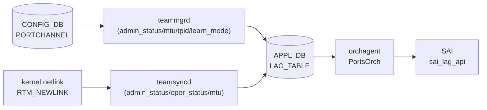

# APPL_DB LAG_TABLE (portchannel ステータス)

## 概要

`APPL_DB LAG_TABLE` は [LAG](../../reference/glossary.md#term-lag) (Link Aggregation Group) の実効設定と運用状態を保持する [APPL_DB](../../reference/glossary.md#term-appl_db) テーブル。
CONFIG_DB `PORTCHANNEL` テーブルとは別物であり、以下の 2 つのプロセスが書き込む[^1][^2]:

1. **teamsyncd** — カーネル netlink の `RTM_NEWLINK` イベントを受けて `admin_status` / `oper_status` / `mtu` を APPL_DB に書き込む
2. **teammgrd** — CONFIG_DB `PORTCHANNEL` テーブルの変更を監視し `admin_status` / `mtu` / `tpid` / `learn_mode` を APPL_DB に反映する。初回書き込み時はコード由来のデフォルト値を補完する



## key 構造

```text
LAG_TABLE:<lag_name>
```

`<lag_name>` は `PortChannel<N>` 形式 (例: `PortChannel0001`)。

## フィールド一覧

| フィールド | 型 | 書き込み元 | デフォルト | 説明 |
|-----------|----|-----------|-----------|------|
| `admin_status` | `up`/`down` | teamsyncd / teammgrd | `"down"` ※1 | 管理状態 |
| `oper_status` | `up`/`down` | teamsyncd | `"down"` ※2 | 実効運用状態 |
| `mtu` | uint (文字列) | teamsyncd / teammgrd | `"9100"` ※3 | MTU [byte] |
| `tpid` | hex string | teammgrd | (省略可) | TPID (CONFIG_DB に値がある場合のみ書かれる) |
| `learn_mode` | string | teammgrd | (省略可) | MAC 学習モード (CONFIG_DB に値がある場合のみ書かれる) |

> ※1, ※2, ※3 は「コード由来の暗黙デフォルト」参照

## 購読者

- **orchagent (PortsOrch)**: `APP_LAG_TABLE` を `SubscriberStateTable` で読み取り、`sai_lag_api->create_lag()` で SAI LAG オブジェクトを作成する。`oper_status` / `mtu` / `learn_mode` / `tpid` を SAI 属性に反映する
- **intfmgrd**: `STATE_LAG_TABLE` (STATE_DB) の `state: ok` を確認してから LAG インタフェースの設定を適用する

<!-- defaults -->
## コード由来の暗黙デフォルト (Phase A)

> **注記**: YANG `default` 指定がない APPL_DB フィールドでも、teamsyncd / teammgrd がコード内でデフォルト値を注入する。以下は実装精読から検出した暗黙デフォルトと挙動。

### admin_status

- **portmgr.h:14** `#define DEFAULT_ADMIN_STATUS_STR "down"` でハードコード
- teammgrd の `doLagTask()` が SET 操作時に変数 `admin_status` をこのデフォルトで初期化する (`teammgr.cpp:251`)
- CONFIG_DB `PORTCHANNEL` に `admin_status` フィールドが存在する場合はその値を使い (`teammgr.cpp:271-273`)、存在しない場合は `"down"` が APPL_DB に書き込まれる
- teamsyncd は RTM_NEWLINK イベントで `rtnl_link_get_flags(link) & IFF_UP` の結果を書き込む (`teamsync.cpp:151`)。teamd がデバイスを作成した直後は IFF_UP が立っているため `"up"` になることもある
- **実質的な初期値**: CONFIG_DB に `admin_status` フィールドがない場合は `"down"`

**暗黙デフォルト**: `"down"` (portmgr.h:14、teammgr.cpp:251)

### oper_status

- teamsyncd が RTM_NEWLINK イベントで `rtnl_link_get_flags(link) & IFF_LOWER_UP` の結果を書き込む (`teamsync.cpp:152`)
- LAG 作成直後はメンバが存在しないため `IFF_LOWER_UP` は立たず `"down"` が書かれる
- LACP ネゴシエーション完了後にメンバがアクティブになると teamsyncd が RTM_NEWLINK を受け `"up"` に更新する
- orchagent (PortsOrch) は `oper_status` フィールドを読み取り (`portsorch.cpp:6088-6096`)、SAI に反映する。orchagent が APPL_DB の `oper_status` を書き戻す処理はない (STATE_DB または SAI 通知に基づく)

**暗黙デフォルト**: `"down"` (LAG 作成直後、メンバなし状態での IFF_LOWER_UP 未セット)

### mtu

- **portmgr.h:15** `#define DEFAULT_MTU_STR "9100"` でハードコード
- teammgrd の `doLagTask()` が SET 操作時に変数 `mtu` をこのデフォルトで初期化する (`teammgr.cpp:252`)
- CONFIG_DB `PORTCHANNEL` に `mtu` フィールドが存在する場合はその値を使い (`teammgr.cpp:277-281`)、存在しない場合は `"9100"` が `setLagMtu()` 経由で APPL_DB に書き込まれる (`teammgr.cpp:512-515`)
- teamsyncd は RTM_NEWLINK 時に `rtnl_link_get_mtu(link)` でカーネルから実際の MTU を取得して書き込む (`teamsync.cpp:140, 153`)

**暗黙デフォルト**: `"9100"` (portmgr.h:15、teammgr.cpp:252 / CONFIG_DB に mtu フィールドがない場合)

### tpid

- teammgrd の `setLagTpid()` が CONFIG_DB に `tpid` フィールドがある場合のみ APPL_DB に書き込む (`teammgr.cpp:542-545`)
- CONFIG_DB `PORTCHANNEL` に `tpid` がない場合は APPL_DB にも書かれない
- orchagent が `tpid` を読み取り SAI の LAG TPID 属性に反映する (`portsorch.cpp:6106-6112`)

**暗黙デフォルト**: 存在しない (CONFIG_DB に `tpid` フィールドがある場合のみ書かれる)

### learn_mode

- teammgrd の `setLagLearnMode()` が CONFIG_DB に `learn_mode` フィールドがある場合のみ APPL_DB に書き込む (`teammgr.cpp:556-559`)
- CONFIG_DB `PORTCHANNEL` に `learn_mode` がない場合は APPL_DB にも書かれない

**暗黙デフォルト**: 存在しない (CONFIG_DB に `learn_mode` フィールドがある場合のみ書かれる)

### state (STATE_DB 専用)

- teamsyncd の `addLag()` は `state: "ok"` を **STATE_DB** の `LAG_TABLE` (`STATE_LAG_TABLE_NAME`) に書き込む (`teamsync.cpp:175, 203`)
- `state` フィールドは APPL_DB LAG_TABLE には書かれない。STATE_DB の `LAG_TABLE|<lag_name>|state` = `"ok"` が LAG の準備完了サインとして intfmgrd 等が利用する

**暗黙デフォルト**: APPL_DB には存在しない (STATE_DB のみ)

<!-- /defaults -->

## APPL_DB LAG_TABLE と STATE_DB LAG_TABLE の区別

| 側面 | APPL_DB LAG_TABLE | STATE_DB LAG_TABLE |
|------|--------------------|-------------------|
| 書き込み元 | teamsyncd / teammgrd | teamsyncd |
| 主なフィールド | admin_status, oper_status, mtu, tpid, learn_mode | admin_status, oper_status, mtu, state |
| `state: ok` フィールド | なし | あり |
| 用途 | orchagent への設定伝達 | intfmgrd 等が LAG 準備完了を確認 |

## 確認コマンド

```bash
# APPL_DB LAG_TABLE を直接参照
sonic-db-cli APPL_DB hgetall 'LAG_TABLE:PortChannel0001'

# STATE_DB LAG_TABLE を確認
sonic-db-cli STATE_DB hgetall 'LAG_TABLE|PortChannel0001'

# portchannel の運用状態確認
show interfaces portchannel

# teamd の状態確認
teamdctl PortChannel0001 state
```

## 関連リファレンス

- CONFIG_DB: [`PORTCHANNEL テーブル`](./portchannel.md)
- CONFIG_DB: [`PORTCHANNEL_MEMBER テーブル`](./portchannel-member.md)
- CLI: [`show interfaces portchannel`](../cli/show-interfaces-portchannel.md)

## 引用元

[^1]: teamsyncd teamsync.cpp: <https://github.com/sonic-net/sonic-swss/blob/4305596156d70e9797e8a881b3d19b46de0bce0d/teamsyncd/teamsync.cpp>
[^2]: teammgrd teammgr.cpp, portmgr.h: <https://github.com/sonic-net/sonic-swss/blob/4305596156d70e9797e8a881b3d19b46de0bce0d/cfgmgr/teammgr.cpp>
