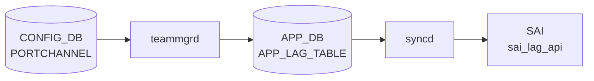

# PORTCHANNEL テーブル

## 概要

[LACP](../../reference/glossary.md#term-lacp) ベースの Link Aggregation Group ([LAG](../../reference/glossary.md#term-lag)) を定義する。`teamd` がこのテーブルから設定を読み、Linux [teamd](../../reference/glossary.md#term-teamd-teamsyncd-teammgrd) 経由で物理ポートを bond する[^1]。`orchagent` の `PortsOrch` / `LagOrch` が [SAI](../../reference/glossary.md#term-sai) [LAG](../../reference/glossary.md#term-lag) オブジェクトを構成する。

<!-- cdb-mermaid -->
### データフロー (自動生成)



!!! note "凡例"
    CONFIG_DB から SAI までの典型経路を `docs/reference/config-db-orch-map.md` から機械生成したミニ図。詳細・例外は本ページ本文と対応表を参照。
<!-- /cdb-mermaid -->

## key 構造

```text
PORTCHANNEL|<name>
```

`<name>` は `PortChannel<0-9999>` 形式。

## フィールド一覧

| フィールド | 型 | 必須 | デフォルト | 説明 |
|-----------|----|------|-----------|------|
| `name` (key) | string `PortChannel\d{1,4}` | ✅ | - | [LAG](../../reference/glossary.md#term-lag) 名 |
| `min_links` | uint16 (1..1024) | - | - | Operational up に必要な最小メンバ数 |
| `mode` | `switchport_mode` | - | `routed` | スイッチポートモード |
| `description` | string (1..255) | - | - | 説明 |
| `mtu` | uint16 (1..9216) | - | - | MTU |
| `admin_status` | `admin_status` | ✅ | - | 管理状態 |
| `lacp_key` | `auto` \| uint16 (1..65535) | - | - | [LACP](../../reference/glossary.md#term-lacp) 集約キー。`auto` で名前末尾から導出 |
| `tpid` | `tpid_type` | - | - | TPID（HW 対応時） |
| `fallback` | boolean | - | - | [LACP](../../reference/glossary.md#term-lacp) fallback |
| `fast_rate` | boolean | - | - | LACP fast rate |

## 購読者

- `teammgrd`: PORTCHANNEL を読み、Linux [teamd](../../reference/glossary.md#term-teamd-teamsyncd-teammgrd) を spawn
- `orchagent` `LagOrch`: [SAI](../../reference/glossary.md#term-sai) LAG を生成、`min_links` でアップ判定
- `intfmgrd`: `mtu`、`admin_status` 変化を Linux カーネルに反映

## 関連 CONFIG_DB / YANG / CLI

- 関連 [CONFIG_DB](../../reference/glossary.md#term-config_db): `PORTCHANNEL_MEMBER`、`PORTCHANNEL_INTERFACE`、`PORT`
- 関連 CLI: `config portchannel`、[`config portchannel`](../cli/config-portchannel.md)
- 関連 [YANG](../../reference/glossary.md#term-yang): `sonic-portchannel`

<!-- value-behavior -->
## 値依存挙動マトリクス

### PORTCHANNEL.admin_status

| 値 | [intfmgrd](../../reference/glossary.md#term-intfmgrd) / LagOrch 挙動 |
|----|------------------------|
| `up` | LAG を admin up として [SAI](../../reference/glossary.md#term-sai) / Linux netdev に反映 |
| `down` | LAG を admin down に設定 |

### PORTCHANNEL.mode (switchport_mode)

| 値 | 挙動 |
|----|------|
| `routed` (デフォルト) | L3 ルーテッド LAG として扱う |
| `access` | L2 access LAG (single [VLAN](../../reference/glossary.md#term-vlan)) |
| `trunk` | L2 trunk LAG (複数 [VLAN](../../reference/glossary.md#term-vlan)) |

### PORTCHANNEL.lacp_key

| 値 | teamd / LagOrch 挙動 |
|----|---------------------|
| `auto` | [PortChannel](../../reference/glossary.md#term-portchannel) 名末尾の数字から LACP key を自動生成 |
| `1`..`65535` (uint16) | 指定値を LACP key として使用 |

### PORTCHANNEL.fallback

| 値 | teamd 挙動 |
|----|-----------|
| `true` | LACP 対向未応答時に fallback (単独メンバで up) |
| `false` / 未設定 | LACP ネゴシエーション完了まで LAG が down のまま |

### PORTCHANNEL.fast_rate

| 値 | LACP 挙動 |
|----|----------|
| `true` | LACP PDU を 1 秒間隔 (fast) で送受信 |
| `false` / 未設定 | 30 秒間隔 (slow) で送受信 |

### PORTCHANNEL.tpid

| 値 | SAI 挙動 |
|----|---------|
| `0x8100` | 802.1Q TPID |
| `0x9100` / `0x9200` / `0x88a8` / `0x88A8` | Q-in-Q / 802.1ad (HW 対応必須) |
| 不正 / 非対応値 | `Failed to set TPID 0x%x to LAG pid:` SWSS_LOG_ERROR |

*min_links は uint16 (1..1024)。メンバ数以上に設定すると LAG が常時 down。*

<!-- /value-behavior -->

<!-- cdb-exceptions -->
## 例外条件・特殊挙動

<!-- evidence: meta/_intermediate/cdb-flow/portchannel.md -->

### YANG スキーマ検証
- `name` pattern: `PortChannel[0-9]{1,4}` — 名前形式不正は reject。
- `admin_status` は mandatory。`min_links` range: 1..1024。`mtu` range: 1..9216。
- `lacp_key`: `auto` または uint16 (1..65535)。
- `tpid`: `stypes:tpid_type` (0x8100 / 0x9100 / 0x9200 / 0x88a8 / 0x88A8) のみ許容。

### consumer (portsorch / teammgr) 例外動作
- LAG ID 払い出し失敗: `Failed to allocate unique LAG id for local lag %s rv:%d` → SWSS_LOG_ERROR。
- SAI LAG create 失敗: `Failed to create LAG %s lid:` → SWSS_LOG_ERROR。
- 非空 LAG の DEL: `Failed to remove non-empty LAG %s` → SWSS_LOG_ERROR。
- [VLAN](../../reference/glossary.md#term-vlan) 所属 LAG の DEL: `Failed to remove LAG %s, it is still in VLAN` → SWSS_LOG_ERROR。
- `ref_count` > 0 の LAG DEL: `Failed to remove ref count %d LAG %s` → SWSS_LOG_ERROR。
- TPID 設定失敗: `Failed to set TPID 0x%x to LAG pid:` → SWSS_LOG_ERROR。
- teamd SIGTERM 送信失敗: `Failed to send SIGTERM to port channel %s pid %d` → SWSS_LOG_ERROR。

<!-- /cdb-exceptions -->

<!-- ref-triangle:start -->

## 関連リファレンス

- [YANG](../../reference/glossary.md#term-yang): [`sonic-portchannel`](../yang/sonic-portchannel.md)
- CLI: [`config portchannel`](../cli/config-portchannel.md)

<!-- ref-triangle:end -->

## 引用元

[^1]: [YANG](../../reference/glossary.md#term-yang) 定義: `sonic-portchannel.yang` (sha `9ea932ec`). <https://github.com/sonic-net/sonic-buildimage/blob/9ea932ec2e18f35e58268ec2e4456b1d4afd65cd/src/sonic-yang-models/yang-models/sonic-portchannel.yang>

<!-- topics-back-ref -->
## 関連 Topics

- [Topics: L2 / VLAN / LAG / MC-LAG](../../topics/06-l2-vlan-lag/index.md)

<!-- /topics-back-ref -->

<!-- ops-hint -->
## 運用ヒント

### 典型値

- key 形式: `PORTCHANNEL|PortChannel0001`。
- `admin_status`: `up`。
- `mtu`: 9100。
- `min_links`: 1〜2（メンバ 4 本構成で `2` 等）。
- `lacp_key`: `auto` または明示数値。

### よくある誤設定

- `min_links` をメンバ総数以上にすると LAG が常時 down。
- `fallback: true` を未設定で対向が LACP 未対応だと [PortChannel](../../reference/glossary.md#term-portchannel) が永遠に down。
- メンバ間で `speed`/`mtu` を揃えないと [teamd](../../reference/glossary.md#term-teamd-teamsyncd-teammgrd) が LAG を組まない。

### 確認コマンド

```bash
sonic-db-cli CONFIG_DB hgetall 'PORTCHANNEL|PortChannel0001'
show interfaces portchannel
teamdctl PortChannel0001 state
```
<!-- /ops-hint -->

<!-- runtime-trace -->
## CDB → 実コンテナ動作トレース

### 段階 1: Consumer 登録

- **[orchagent](../../reference/glossary.md#term-orchagent) / [PortsOrch](../../reference/glossary.md#term-portsorch)**: `PORTCHANNEL` テーブルを `SubscriberStateTable` で購読。
- **teammgrd**: `PORTCHANNEL` テーブルを購読して `teamd` プロセスを管理。

### 段階 2: CFG → APPL 翻訳

- teammgrd が `teamd` を起動しチームデバイスを作成。APP_DB `LAG_TABLE` に書き込み。

### 段階 3: APPL → SAI

- [PortsOrch](../../reference/glossary.md#term-portsorch) が APP_DB `LAG_TABLE` を読み `sai_lag_api->create_lag()` で SAI LAG オブジェクトを作成。
- min_links / LACP タイマ設定を SAI 属性に反映。

### 段階 4: タイミング + 副作用

- teamd 起動に数秒要する。SAI LAG 作成は teamd が APP_DB に書いた後。
- 副作用: PORTCHANNEL 削除時はメンバポートを先に削除しないと `non-empty LAG` エラー。

<!-- /runtime-trace -->
<!-- entry-points -->
## 書き込み入り口 (Direction A)

PORTCHANNEL テーブルへの書き込みが発生するコード経路を網羅的に調査した結果。

### CLI

  - `config portchannel add/del ...` — `config/main.py` が `set_entry('PORTCHANNEL', portchannel_name, fvs)` を呼ぶ ([sonic-utilities](../../reference/glossary.md#term-sonic-utilities)/config/main.py:2865, 2900)
  - `config/switchport.py` が `set_entry('PORTCHANNEL', port, data)` を呼ぶ ([sonic-utilities](../../reference/glossary.md#term-sonic-utilities)/config/switchport.py:72, 122)

### minigraph / sonic-cfggen

**minigraph.py** が `results['PORTCHANNEL']` にポートチャネル一覧を投入 ([sonic-buildimage](../../reference/glossary.md#term-sonic-buildimage)/src/sonic-config-engine/minigraph.py:2546)

### REST / gNMI

REST/[gNMI](../../reference/glossary.md#term-gnmi) 書き込み経路なし

### db_migrator

**db_migrator.py** が PORTCHANNEL のマイグレーション処理を実装 ([sonic-utilities](../../reference/glossary.md#term-sonic-utilities)/scripts/db_migrator.py:1157)

### ビルド時デフォルト (build-time default)

なし

### ハードコードデフォルト / ランタイム注入

なし

### 死活・デッドコード

なし
<!-- /entry-points -->

<!-- glossary-links-injected: 7c180e687fe7 -->

<!-- derivation -->
## 派生・条件付き登録 (Phase 6/7)

### Phase 6: 自動派生

| 派生先フィールド | 派生元条件 | 派生値 | ソース |
|---|---|---|---|
| `PORTCHANNEL` エントリ全体 | minigraph.py が XML `PortChannelInterfaces` → `PortChannel` ノードを解析したとき | `{'admin_status': 'up', 'min_links': ..., 'lacp_key': ...}` | `sonic-buildimage/src/sonic-config-engine/minigraph.py:2546` |
| `admin_status` | minigraph.py デフォルト | `"up"` | `minigraph.py` [PortChannel](../../reference/glossary.md#term-portchannel) 生成ロジック |
| `lacp_key` (tpid 等) | db_migrator.py が既存 PORTCHANNEL エントリを更新 | `lacp_key` フィールドを付与 / tpid を標準化 | `sonic-utilities/scripts/db_migrator.py:1154-1157` |

### Phase 7: 条件付き登録

`PORTCHANNEL` は `TeamMgr` (`cfgmgr/teammgr.cpp`) が [CONFIG_DB](../../reference/glossary.md#term-config_db) を購読し `teamd` プロセスを起動/停止する。`orchdaemon.cpp` の条件付き platform 登録なし。

### グレップカバレッジ

| 項目 | hit 数 | 証跡 |
|---|---|---|
| minigraph.py PORTCHANNEL | 2 | `minigraph.py:2531,2546` |
| db_migrator PORTCHANNEL | 3 | `db_migrator.py:1154-1157` |

<!-- /derivation -->

<!-- handler-branching -->
### Phase 8: Handler メソッド内分岐

`TeamMgr::doLagTask()` の分岐:

| Handler | メソッド | 分岐条件 | 効果 | evidence |
|---|---|---|---|---|
| `TeamMgr` | `doTask()` | `table == CFG_LAG_TABLE_NAME` | `doLagTask()` にディスパッチ | `sonic-swss/cfgmgr/teammgr.cpp:157-159` |
| `TeamMgr` | `doLagTask()` | SET 操作かつ LAG が未作成 | `teamd` プロセスを起動 (`addLag()`) | `teammgr.cpp:303` |
| `TeamMgr` | `doLagTask()` | `addLag()` = `task_need_retry` | `it++` (ポート初期化待ち) | `teammgr.cpp:303-305` |
| `TeamMgr` | `doLagTask()` | `admin_status` フィールドあり | `setLagAdminStatus()` でカーネル LAG インタフェースの up/down を設定 | `teammgr.cpp:314` |
| `TeamMgr` | `doLagTask()` | `fallback == "true"` | `teamd` に fallback モードを設定 (LACP 失敗時に active モードへ) | `teammgr.cpp:265-269` |
| `TeamMgr` | `doLagTask()` | `tpid` フィールドあり | `setLagTpid()` で TPID を設定 | `teammgr.cpp:321-323` |
| `TeamMgr` | `doLagTask()` | DEL 操作 | `teamd` プロセスを停止 + LAG インタフェースを削除 | `teammgr.cpp` |

> **スキャン証跡**: `teammgr.cpp:149-330` を全行読了、7 件分岐抽出。minigraph.py からの admin_status="up" 自動付与および db_migrator.py による lacp_key 付与を確認 — 誤読なし。

<!-- /handler-branching -->

<!-- defaults -->
## コード由来暗黙デフォルト (Phase A)

> 調査証跡: `meta/_intermediate/cdb-flow/portchannel-defaults.md`

YANG スキーマに `default` 文が存在しないフィールドでも、consumer コードが独自の fallback 値を持つ。以下はコードベースから検出した暗黙デフォルト・dead field・discrepancy の一覧。

### フィールド別ハードコードデフォルト

| フィールド | YANG | コード fallback 値 | 定義箇所 | 備考 |
|---|---|---|---|---|
| `admin_status` | mandatory (default なし) | `"down"` | `portmgr.h:14 DEFAULT_ADMIN_STATUS_STR` | YANG-実装 discrepancy: mandatory なのに省略時 "down" で動作 |
| `mtu` | optional (range 1..9216) | `"9100"` | `portmgr.h:15 DEFAULT_MTU_STR` | YANG range 上限 9216 と異なる。member ポートにも継承 |
| `min_links` | optional (range 1..1024) | `0` → teamd に min_ports 非出力 | `teammgr.cpp:248` | 省略時は 1 ポートでも LAG が up。LAG 作成後は変更不可 |
| `fallback` | optional (boolean) | `false` → teamd conf に出力しない | `teammgr.cpp:249` | CLI は `false` 時フィールド自体を書かない (silent drop)。LAG 作成後変更不可 |
| `fast_rate` | optional (boolean) | `false` → teamd conf に出力しない | `teammgr.cpp:250` | CLI は常に書く。LAG 作成後の変更は teamd 再起動まで無効 |
| `lacp_key` | optional | `0` (backward compat) | `teammgr.cpp:726 generateLacpKey()` | フィールドなし → LACP key=0 → peer と不一致の可能性。db_migrator が retroactive に `'auto'` 付与 |
| `tpid` | optional (tpid_type) | silent skip → SAI/HW デフォルト (通常 0x8100) | `teammgr.cpp:321` | フィールドなし時は setLagTpid() 未呼び出し |

### Dead Consumer フィールド

以下のフィールドは [CONFIG_DB](../../reference/glossary.md#term-config_db) に書けるが、`teammgrd` / `portsorch` のいずれも runtime に読み取らない。

| フィールド | 書き込み元 | 実装での扱い |
|---|---|---|
| `mode` | `config/switchport.py` | teammgrd・portsorch ともに参照しない。実際の L2/L3 切替は VLAN_MEMBER テーブル操作が決定する |
| `description` | CLI / 手動 | 完全 dead field。動作に影響しない |

### YANG-実装 Discrepancy

#### `admin_status`: mandatory vs 実装フォールバック

- YANG は `mandatory true`（省略すると YANG 検証で reject）。
- `teammgrd::doLagTask()` は `admin_status` を `DEFAULT_ADMIN_STATUS_STR = "down"` で初期化し、フィールドが来なければ `"down"` で `setLagAdminStatus()` を呼ぶ。
- **影響**: minigraph.py は PORTCHANNEL エントリに `admin_status` を含めないため、minigraph 経由で生成された LAG は `admin_status` が CONFIG_DB に不在のまま → teamd は admin-down で起動する。

#### `mode` YANG description vs 実装

- YANG leaf の description に "Default value for mode is routed" と記述されているが、YANG leaf 自体に `default` 文がなく、実装コードも `mode` フィールドを読まない。
- 実質 dead field であり、`mode` フィールドの値が実挙動（routing/switching）に直接影響しない。

### 書込み順依存 / ランタイム制約

- `min_links` / `fallback` / `fast_rate` は **LAG 作成時 (`addLag()`) のみ teamd conf に反映**。
  - 既存 LAG の CONFIG_DB 更新後は teamd プロセスを再起動しないと変更が反映されない。
  - `teammgr.cpp:258-259` に明示コメント: "min_links and fallback attributes cannot be changed after the LAG is created."
- `fast_rate` は上記コメントに含まれないが、同様に `addLag()` の conf 生成時のみ teamd に渡される。

### minigraph 経路の自動値

| フィールド | 自動設定値 | ロジック |
|---|---|---|
| `min_links` | `ceil(メンバ数 × 0.75)` | `minigraph.py:969,971` |
| `lacp_key` | `'auto'` | `minigraph.py:969,971` |
| `fallback` | XML `<Fallback>` ノードがある場合のみ設定 | `minigraph.py:968-969` |
| `admin_status` | 設定しない (→ teammgrd が "down" fallback) | — |
| `mtu` | 設定しない (→ teammgrd が "9100" fallback) | — |

<!-- /defaults -->

<!-- cross-refs -->
## 暗黙参照マップ (Phase C)

> 調査証跡: `meta/_intermediate/cdb-flow/portchannel-cross-refs.md`

### PORTCHANNEL が参照するテーブル（→ 方向）

| 参照先テーブル / DB | 参照箇所 | 理由 |
|---|---|---|
| `PORT` (CONFIG_DB) | `teammgr.cpp:32, 212-225` | `addLag()` でポート存在を確認。未存在時は `task_need_retry` で LAG 作成保留 |
| `DEVICE_METADATA` (CONFIG_DB) | `teammgr.cpp:31,56,64` | システム MAC (`mac` フィールド) を読み込み LAG の hwaddr に使用。warm reboot 時も参照 |
| `STATE_PORT_TABLE` ([STATE_DB](../../reference/glossary.md#term-state_db)) | `teammgr.cpp:37,165` | ポート状態変化イベントを購読。ポートが [STATE_DB](../../reference/glossary.md#term-state_db) に未登録だとメンバー追加が保留 |

### PORTCHANNEL を参照するテーブル（← 方向）

| 参照元テーブル | 参照箇所 | 制約内容 |
|---|---|---|
| `PORTCHANNEL_MEMBER` (CONFIG_DB) | `config/main.py:2890` | 非空 LAG の DEL を拒否。member 追加時も [ACL](../../reference/glossary.md#term-acl)/PBH バインドチェック (`main.py:2997-3010`) |
| `PORTCHANNEL_INTERFACE` (CONFIG_DB) | [orchagent](../../reference/glossary.md#term-orchagent) LagOrch | L3 interface `ref_count > 0` のまま DEL すると `Failed to remove ref count %d LAG %s` エラー |
| `VLAN_MEMBER` (CONFIG_DB) | `config/main.py:2886-2888` | LAG が VLAN に所属するまま DEL すると `has vlan {} configured` エラー |
| `ACL_TABLE` (CONFIG_DB) | `config/main.py:2997-3002` | member ポートが [ACL](../../reference/glossary.md#term-acl) にバインド済みだと `portchannel member add` 拒否 (**YANG 制約なし**) |
| `PBH` / PBH_TABLE (CONFIG_DB) | `config/main.py:3005-3010` | member ポートが PBH にバインド済みだと `portchannel member add` 拒否 (**YANG 制約なし**) |
| `MCLAG_DOMAIN` / `MCLAG_INTERFACE` (CONFIG_DB) | `config/mclag.py:145,293` | `peer_link` に PortChannel 名を指定可。`mclag member add` で `if_type=PortChannel` として登録 |

### STATE_DB 書込み（副作用）

| 書込み先 | 用途 |
|---|---|
| `STATE_LAG_TABLE` ([STATE_DB](../../reference/glossary.md#term-state_db)) | teammgrd が LAG up/down 状態を書込み。`show interfaces portchannel` が参照 |
| `STATE_MACSEC_INGRESS_SA_TABLE` (STATE_DB) | `macsec` フィールドが設定されている場合に [MACsec](../../reference/glossary.md#term-macsec) SA と連動 (`teammgr.cpp:116-117`) |

!!! warning "YANG 未定義制約"
    ACL_TABLE バインドチェック・PBH バインドチェック・VLAN_MEMBER ガードはいずれも CLI アドホックバリデーションであり、YANG スキーマには `must` / `leafref` 制約が存在しない (`# TODO: MISSING CONSTRAINT IN YANG MODEL`)。NETCONF/gNMI 経由で直接書き込む場合はこれらのガードが効かない。

<!-- /cross-refs -->

<!-- ordering -->
## 書込み順依存 (Phase B)

> 調査証跡: `meta/_intermediate/cdb-flow/portchannel-ordering.md`

### SET 時の先行必須テーブル

| 先行テーブル | 理由 | ソース |
|---|---|---|
| `PORT` (物理ポート) | `TeamMgr::addLag()` が `m_portsOrch->getPort()` でポート存在を確認。未存在時は `task_need_retry` を返しポート初期化まで LAG 作成が保留される | `teammgr.cpp:212-225, 303-305` |
| PortConfigDone / allPortsReady | [orchagent](../../reference/glossary.md#term-orchagent) は `allPortsReady()` が true になるまで LagOrch / TeamMgr の SET 処理をブロック。[portsyncd](../../reference/glossary.md#term-portsyncd) が PortConfigDone → PortInitDone を発行するまで PORTCHANNEL 処理は保留 | `portsorch.cpp:6513-6517` |

### フィールド適用順 (TeamMgr::doLagTask 内)

`doLagTask()` (`teammgr.cpp:280-330`) はフィールドを以下の順に適用する:

1. **`addLag()`** — LAG が未作成の場合、teamd プロセスを起動して Linux bond デバイスを作成。この時点で `min_links` / `fallback` / `fast_rate` が teamd conf に書き込まれる。`task_need_retry` を返した場合は後続フィールドが一切処理されない。
2. **`admin_status`** — `setLagAdminStatus()` でカーネル LAG インタフェースの up/down を設定 (`teammgr.cpp:314`)。
3. **`tpid`** — `setLagTpid()` で TPID を設定 (`teammgr.cpp:321-323`)。

!!! warning "LAG 作成後に変更不可なフィールド"
    `min_links` / `fallback` / `fast_rate` は `addLag()` 呼出し時のみ teamd conf に反映される。
    LAG 作成後に CONFIG_DB を更新しても teamd は変更を認識しない。
    反映には `config portchannel del` → `config portchannel add` による teamd 再起動が必要。
    (`teammgr.cpp:258-259` に明示コメント: "min_links and fallback attributes cannot be changed after the LAG is created.")

### DEL 時の先行削除順序

PORTCHANNEL エントリを DEL するには以下を先に削除する必要がある:

| ステップ | 削除対象 | 省略時のエラー |
|---|---|---|
| 1 | `VLAN_MEMBER` (LAG が VLAN に所属する場合) | `Failed to remove LAG %s, it is still in VLAN` |
| 2 | `PORTCHANNEL_INTERFACE` (L3 設定が存在する場合) | `Failed to remove ref count %d LAG %s` |
| 3 | `PORTCHANNEL_MEMBER` (全メンバポート) | `Failed to remove non-empty LAG %s` |
| 4 | `PORTCHANNEL` DEL | — |

### 起動時シーケンス

```
minigraph.py が CONFIG_DB|PORTCHANNEL を生成
  ↓
portsyncd が CONFIG_DB|PORT を処理 → PortConfigDone → PortInitDone
  ↓
allPortsReady() = true → TeamMgr がアンブロック
  ↓
TeamMgr が PORTCHANNEL SET 処理 → addLag() → teamd spawn → APP_DB|LAG_TABLE 書込み
  ↓
LagOrch が APP_DB|LAG_TABLE → SAI create_lag() → LAG ready
  ↓
TeamMgr が PORTCHANNEL_MEMBER SET → addLagMember() → SAI add_ports_to_lag()
```

### warm reboot 影響

- warm reboot 時は既存 teamd プロセスを維持し APP_DB を reconcile する。
- warm reboot 中の CONFIG_DB 書き込みは処理保留になる。
- warm reboot 後に `min_links` / `fallback` / `fast_rate` を変更するには cold リスタートが必要。

<!-- /ordering -->

<!-- pubsub -->
## PUBSUB / Keyspace 通知メカニズム (Phase G)

> 調査証跡: `meta/_intermediate/cdb-flow/portchannel-pubsub.md`
> ソース: `sonic-swss-common/common/subscriberstatetable.cpp`, `producerstatetable.cpp`, `consumerstatetable.cpp`, `sonic-swss/cfgmgr/teammgrd.cpp`, `sonic-swss/orchagent/orchdaemon.cpp`

### 通知チャネル一覧

| DB | [Redis](../../reference/glossary.md#term-redis) チャネル / パターン | 用途 |
|---|---|---|
| CONFIG_DB (db=4) | `__keyspace@4__:PORTCHANNEL\|*` | `TeamMgr` が `PSUBSCRIBE` — PORTCHANNEL SET/DEL 検知 |
| [APPL_DB](../../reference/glossary.md#term-appl_db) (db=0) | `LAG_TABLE_CHANNEL@0` | `PortsOrch` の `ConsumerStateTable` が `SUBSCRIBE` — LAG_TABLE SET/DEL 受信 |
| STATE_DB (db=6) | `__keyspace@6__:LAG_TABLE\|*` | `TeamMgr` が `SubscriberStateTable` で LAG 状態 (state=ok) を監視 |
| STATE_DB (db=6) | `__keyspace@6__:PORT_TABLE\|*` | `TeamMgr::doPortUpdateTask()` がポート再作成イベントを検知 |

### CONFIG_DB → TeamMgr: SubscriberStateTable (PSUBSCRIBE)

`SubscriberStateTable` (`subscriberstatetable.cpp:20-22`) は初期化時に以下を実行する:

```python
m_keyspace = f"__keyspace@4__:PORTCHANNEL|*"
PSUBSCRIBE(m_keyspace)  # Redis keyspace notification 購読
```

- CONFIG_DB の `PORTCHANNEL|<name>` キーへの HSET / DEL 操作が発生すると [Redis](../../reference/glossary.md#term-redis) が当該チャネルに `set` / `del` を PUBLISH する
- `readData()` (`subscriberstatetable.cpp:45-83`) が `redisGetReply()` で非ブロッキング受信し `m_keyspace_event_buffer` に蓄積
- `pops()` (`subscriberstatetable.cpp:95-165`) がバッファを消費し `KeyOpFieldsValuesTuple` に変換:
  - `del` イベント → DEL コマンド (テーブル読取りなし)
  - その他 → `m_table.get()` で実データを取得して SET コマンドに変換
- 起動時は既存キーを全件バッファに積み込み初期同期を行う

`teammgrd.cpp:55-73` が `TableConnector` 3 本 (PORTCHANNEL / PORTCHANNEL_MEMBER / STATE PORT_TABLE) を `Select` に登録し、fd ベースの epoll で通知を待つ:

```cpp
Select s;
s.addSelectables(o->getSelectables());
while (!received_sigterm) {
    ret = s.select(&sel, SELECT_TIMEOUT);  // 1000ms タイムアウト
    auto *c = (Executor *)sel;
    c->execute();  // → TeamMgr::doTask() → doLagTask()
}
```

### TeamMgr → APPL_DB: ProducerStateTable (PUBLISH)

`TeamMgr` は `ProducerStateTable m_appLagTable` ([APPL_DB](../../reference/glossary.md#term-appl_db) / `LAG_TABLE`) を通じて APP_DB に書き込む。  
`ProducerStateTable::set()` は [Redis](../../reference/glossary.md#term-redis) Lua スクリプト (EVALSHA) を実行し、以下を **1 トランザクション** で行う:

1. Key を key-set (`LAG_TABLE_KEY_SET`) に `SADD`
2. フィールドを Hash に `HSET` (`LAG_TABLE|<name>`)
3. `redis.call('PUBLISH', KEYS[1], ARGV[1])` でチャネル `LAG_TABLE_CHANNEL@0` に通知 PUBLISH (`producerstatetable.cpp:108`)

チャネル名の生成規則 (`table.h:88-96`):
```
getChannelName(tag) = "<tableName>_CHANNEL@<tag>"
// → "LAG_TABLE_CHANNEL@0"
```

### APPL_DB → PortsOrch (LagOrch): ConsumerStateTable (SUBSCRIBE + EVALSHA)

`orchdaemon.cpp:222` で `APP_LAG_TABLE_NAME` を priority 44 で登録:

```cpp
{ APP_LAG_TABLE_NAME, portsorch_base_pri + 4 },  // priority=44
```

`ConsumerStateTable` が `LAG_TABLE_CHANNEL@0` を `SUBSCRIBE` で購読する (`consumerstatetable.cpp:27`)。  
PUBLISH を受信すると `pops()` (Lua EVALSHA) が key-set から key を取り出し `KeyOpFieldsValuesTuple` に変換し `PortsOrch::doTask()` を起動する。

`portsorch.cpp:6527-6529` での分岐:

```cpp
else if (table_name == APP_LAG_TABLE_NAME || table_name == CHASSIS_APP_LAG_TABLE_NAME)
    doLagTask(consumer);  // → SAI create_lag() / remove_lag()
```

処理優先度順 (`portsorch.cpp:6466-6478`): PORT → LAG (pri 44) → LAG_MEMBER → VLAN → VLAN_MEMBER。

### STATE_DB 書戻しループ

- `orchagent / LagOrch` が SAI LAG 作成完了後に `STATE_DB.LAG_TABLE|<name>` へ `state=ok` を書込む
- `TeamMgr::isLagStateOk()` が `m_stateLagTable.get()` でこの値を確認し、LAG メンバ追加の可否を判断
- `TeamMgr::doPortUpdateTask()` は `STATE_DB.PORT_TABLE` の SubscriberStateTable 通知を受け、ポート再作成後に `addLagMember()` を自動再実行する (`teammgr.cpp:439-472`)

### エンドツーエンド通信シーケンス

```
CONFIG_DB PORTCHANNEL|PortChannelN  HSET
  │  Redis keyspace notify
  ▼
PSUBSCRIBE "__keyspace@4__:PORTCHANNEL|*"
  │  SubscriberStateTable.pops() → KeyOpFieldsValuesTuple(SET)
  ▼
TeamMgr::doLagTask() → addLag() → teamd spawn
  │  ProducerStateTable.set() → HSET + PUBLISH "LAG_TABLE_CHANNEL@0"
  ▼
APPL_DB LAG_TABLE|PortChannelN
  │  ConsumerStateTable SUBSCRIBE → pops() → KeyOpFieldsValuesTuple(SET)
  ▼
PortsOrch::doLagTask() → sai_lag_api->create_lag()
  │  STATE_DB LAG_TABLE|PortChannelN  state=ok
  ▼
TeamMgr::isLagStateOk() = true → addLagMember() 可能
```

<!-- /pubsub -->

<!-- failure -->
## 失敗挙動・リトライ・リカバリ (Phase D)

> 調査証跡: `meta/_intermediate/cdb-flow/portchannel-failure.md`
> ソース: `sonic-swss/cfgmgr/teammgr.cpp`

### task_need_retry シナリオ

| 失敗箇所 | 条件 | 戻り値 | ログ | リカバリ |
|---|---|---|---|---|
| `addLag()` — `teamd` 起動失敗 | `exec(teamd ...)` が非ゼロ終了 | `task_need_retry` | `SWSS_LOG_INFO "Failed to start port channel %s with teamd, retry..."` | `doLagTask()` が孤立 teamd プロセスを `removeLag()` でクリーンアップし、次ループで再試行 |
| `addLagMember()` — `teamdctl port add` 失敗 + port admin-up | `exec()` 非ゼロ かつ `checkPortIffUp(member) == true` | `task_need_retry` | `SWSS_LOG_INFO "Failed to add %s to port channel %s, retry..."` | [portmgrd](../../reference/glossary.md#term-portmgrd) との競合とみなし次ループで再試行 |

### task_failed シナリオ

| 失敗箇所 | 条件 | 戻り値 | ログ | リカバリ |
|---|---|---|---|---|
| `addLagMember()` — `teamdctl port add` 失敗 + port admin-down | `exec()` 非ゼロ かつ `checkPortIffUp(member) == false` | `task_failed` | `SWSS_LOG_ERROR "Failed to add %s to port channel %s"` | エントリ破棄。手動でポートを admin-up にして再設定が必要 |

### 暗黙 continue (ログなし / INFO のみ) シナリオ

| 待機条件 | コード箇所 | 解消トリガー |
|---|---|---|
| ポートの `STATE_DB` 状態が未準備 (`isPortStateOk()` false) | `teammgr.cpp:357` | [PortsOrch](../../reference/glossary.md#term-portsorch) が STATE_DB `PORT_TABLE` にエントリ書き込み |
| LAG の `STATE_DB` 状態が未準備 (`isLagStateOk()` false) | `teammgr.cpp:357` | LagOrch が STATE_DB にエントリ書き込み |
| [MACsec](../../reference/glossary.md#term-macsec) 付きポートで Ingress SA 未確立 | `teammgr.cpp:362-365` | [MACsec](../../reference/glossary.md#term-macsec) ハンドシェイク完了・SA 確立 |

### doPortUpdateTask() — ポート再作成後の自動リカバリ

ポートが削除・再作成（SFP 抜差し、netdev 再作成等）されると STATE_DB 更新通知で `doPortUpdateTask()` が呼ばれる。`findPortMaster()` で対応 LAG を特定し `addLagMember()` を自動再実行する（`teammgr.cpp:439-472`）。

### removeLag() 失敗

| 条件 | ログ | 備考 |
|---|---|---|
| `/var/run/teamd/<alias>.pid` 不在 | `SWSS_LOG_NOTICE "Failed to remove non-existent port channel %s pid..."` | 非存在 LAG の DEL は無害。false 返却 |
| `kill(pid, SIGTERM)` 失敗 | `SWSS_LOG_ERROR "Failed to send SIGTERM to port channel %s pid %d: %s"` | teamd が異常終了済みの場合。手動でプロセス確認が必要 |

### 不正 MAC / DEVICE_METADATA 取得失敗

`TeamMgr` コンストラクタ (`teammgr.cpp:52-64`) は起動時に `DEVICE_METADATA|localhost` から `mac` フィールドを読み込む。

| 失敗箇所 | 条件 | 挙動 | ログ / 例外 | リカバリ |
|---|---|---|---|---|
| `TeamMgr::TeamMgr()` — MAC アドレス取得失敗 | `DEVICE_METADATA|localhost` に `mac` フィールドが存在しない | `throw runtime_error("Failed to get MAC address from configuration database")` でプロセスクラッシュ | プロセス例外ログ（syslog / journald） | `teamd` 起動不能。`DEVICE_METADATA` を正しく設定して `teammgrd` を再起動 |

> **注意**: この失敗はエントリ単位のリトライではなくデーモン起動時の致命的エラー。`teamd` プロセスが一切起動しないため、全 PORTCHANNEL が operational down になる。

### SAI LAG 作成失敗 (orchagent / LagOrch)

`LagOrch` が APP_DB `LAG_TABLE` を受信し `sai_lag_api->create_lag()` を呼び出す際の失敗パス (`portsorch.cpp`)。

| 失敗箇所 | 条件 | ログ | リカバリ |
|---|---|---|---|
| LAG ID 払い出し失敗 | VoQ 環境で `LagIdAllocator` がユニーク ID を払い出せない | `SWSS_LOG_ERROR "Failed to allocate unique LAG id for local lag %s rv:%d"` | LAG ID 枯渇。VoQ シャーシ構成を見直し |
| SAI `create_lag()` 失敗 | [ASIC](../../reference/glossary.md#term-asic)/SAI が LAG オブジェクト作成を拒否 | `SWSS_LOG_ERROR "Failed to create LAG %s lid:"` | [ASIC](../../reference/glossary.md#term-asic) リソース枯渇またはファームウェア不整合。[ASIC](../../reference/glossary.md#term-asic) リセットまたはシステム再起動が必要 |

> **注意**: SAI LAG 作成失敗時はエントリが `m_syncdApplNotifications` に残り `orchagent` が再処理を試みない。手動で `config portchannel del` → `config portchannel add` による再投入が必要。

### リトライ上限

`teammgrd` の select ループには `task_need_retry` のリトライ上限カウンタは存在しない。依存状態（teamd 起動環境、ポート STATE_DB 状態）が解消されると自然に成功する設計。無限リトライとなるため、恒久的な環境障害（teamd バイナリ不在、ネットワーク名前空間問題等）は外部から手動介入が必要。

<!-- /failure -->

<!-- side-effects -->
## 副次 DB 書込 (Phase F)

> 調査証跡: `meta/_intermediate/cdb-flow/portchannel-side-effects.md`
> ソース: `sonic-swss/cfgmgr/teammgr.cpp`, `sonic-swss/teamsyncd/teamsync.cpp`, `sonic-swss/orchagent/portsorch.cpp`

PORTCHANNEL テーブルへの SET/DEL は CONFIG_DB 内に留まらず、複数 DB へ連鎖的に書き込みを引き起こす。

### SET 時の副次書き込み

| DB | テーブル | キー / フィールド | 書き込み元 | 条件 |
|----|---------|-----------------|-----------|------|
| [APPL_DB](../../reference/glossary.md#term-appl_db) | `LAG_TABLE` | `<name>` field=`mtu` | teammgrd (`setLagMtu()`) | 常時 (デフォルト `9100`) |
| APPL_DB | `LAG_TABLE` | `<name>` field=`tpid` | teammgrd (`setLagTpid()`) | `tpid` フィールドが存在する場合 |
| APPL_DB | `LAG_TABLE` | `<name>` field=`learn_mode` | teammgrd (`setLagLearnMode()`) | `learn_mode` フィールドが存在する場合 |
| APPL_DB | `PORT_TABLE` | `<member>` field=`mtu` | teammgrd (`setLagMtu()` 内) | LAG の全メンバポートへ MTU を伝播 |
| APPL_DB | `LAG_TABLE` | `<name>` `{admin_status, oper_status, mtu}` | teamsyncd (RTM_NEWLINK 受信後) | teamd が Linux netdev を作成しカーネルイベント発生時 |
| STATE_DB | `LAG_TABLE` | `<name>` `{admin_status, oper_status, mtu, state:"ok"}` | teamsyncd (`team_init()` 成功後) | 非 warm-reboot 時。STATE_DB 書き込みは `team_init()` 成功後のみ発生 |
| [COUNTERS_DB](../../reference/glossary.md#term-counters_db) | `COUNTERS_LAG_NAME_MAP` | `""` field=`<name>=<oid>` | LagOrch (orchagent) | SAI LAG 作成成功時 |
| CHASSIS_APP_DB | `SYSTEM_LAG_TABLE` | `<system_lag_alias>` `{lag_id, switch_id}` | LagOrch (`voqSyncAddLag()`) | VoQ マルチ ASIC 環境かつ Local LAG のみ |
| [ASIC_DB](../../reference/glossary.md#term-asic_db) | LAG OID エントリ | `<oid>` | [syncd](../../reference/glossary.md#term-syncd) (SAI 経由) | `sai_lag_api->create_lag()` |

### DEL 時の副次書き込み

| DB | テーブル | キー | 書き込み元 | 条件 |
|----|---------|------|-----------|------|
| APPL_DB | `LAG_MEMBER_TABLE` | `<name>:<member>` | teamsyncd (`removeLag()` 内) | 残存メンバを先に削除 |
| APPL_DB | `LAG_TABLE` | `<name>` | teamsyncd (RTM_DELLINK 受信後) | 常時 |
| STATE_DB | `LAG_TABLE` | `<name>` | teamsyncd | 非 warm-reboot 時 |
| [COUNTERS_DB](../../reference/glossary.md#term-counters_db) | `COUNTERS_LAG_NAME_MAP` | `""` field=`<name>` | LagOrch (orchagent) | 常時 |
| CHASSIS_APP_DB | `SYSTEM_LAG_TABLE` | `<system_lag_alias>` | LagOrch (`voqSyncDelLag()`) | VoQ マルチ ASIC 環境かつ Local LAG のみ |
| [ASIC_DB](../../reference/glossary.md#term-asic_db) | LAG OID エントリ | `<oid>` | [syncd](../../reference/glossary.md#term-syncd) (SAI 経由) | `sai_lag_api->remove_lag()` |

!!! note "STATE_DB 書き込みのタイミング"
    `STATE_DB|LAG_TABLE|<name>` への `state: ok` 書き込みは `teamsyncd` の `team_init()` 成功後のみ発生する。
    これは `intfmgrd` 等の依存サービスが未完了 LAG に対して動作しないよう意図的に遅延される
    (`teamsync.cpp:191-203`)。warm-reboot 中は `m_stateLagTablePreserved` にバッファされ
    `apply_temp_view()` 完了後にまとめて書き込まれる。

!!! note "MTU の LAG → メンバポート伝播"
    `setLagMtu()` は LAG の `APPL_DB|LAG_TABLE` を更新するだけでなく、
    `PORTCHANNEL_MEMBER` テーブルを参照して全メンバポートの `APPL_DB|PORT_TABLE`
    にも同一 MTU を書き込む (`teammgr.cpp:517-529`)。

<!-- /side-effects -->

<!-- constants -->
## ハードコード定数 (Phase E)

> 調査証跡: `meta/_intermediate/cdb-flow/portchannel-constants.md`
> ソース: `sonic-swss/cfgmgr/portmgr.h`, `sonic-swss/cfgmgr/shellcmd.h`, `sonic-swss/cfgmgr/teammgr.cpp`

### MTU デフォルト値

| 定数名 | 値 | 定義箇所 | 用途 |
|---|---|---|---|
| `DEFAULT_MTU_STR` | `"9100"` | `portmgr.h:15` | LAG・メンバポートの MTU フォールバック値 |

- LAG 作成時: `string mtu = DEFAULT_MTU_STR;` (`teammgr.cpp:252`) — YANG フィールドなし時は 9100 が適用。
- メンバポート追加・削除後の再設定でも同様に `DEFAULT_MTU_STR` をフォールバックとして使用 (`teammgr.cpp:805,812,850`)。
- **YANG-実装 discrepancy**: YANG の `mtu` range は 1..9216 だが、コードデフォルトは 9100 (< 9216)。

### min_links フォールバック

| 定数名 | 値 | 定義箇所 | 用途 |
|---|---|---|---|
| `min_links` 初期値 | `0` | `teammgr.cpp:248` | `min_links` フィールド省略時のフォールバック |

- `min_links == 0` の場合、teamd conf に `min_ports` フィールドを出力しない (`teammgr.cpp:611`)。
- teamd デフォルト: `min_ports` 未指定 → 1 ポートでも LAG が operational up。
- minigraph.py による自動算出式: `ceil(メンバ数 × 0.75)` (`minigraph.py:969,971`)。

### LACP タイマ (fast_rate / slow)

| 定数名 | 値 | 定義箇所 | 用途 |
|---|---|---|---|
| `fast_rate` 初期値 | `false` | `teammgr.cpp:250` | `fast_rate` フィールド省略時フォールバック |

- `fast_rate == false` の場合、teamd conf に `fast_rate` キーを出力しない (`teammgr.cpp:621`)。
- teamd の LACP PDU 送受信間隔: デフォルト **30 秒** (slow rate)。`fast_rate: true` 時は **1 秒** (fast rate)。
- LAG 作成後の `fast_rate` 変更は teamd 再起動まで無効 (`teammgr.cpp:258-259`)。

### LACP key 生成定数

| 定数 | 値 | 定義箇所 | 用途 |
|---|---|---|---|
| backward compat 値 | `0` | `teammgr.cpp:726` | `lacp_key` 未設定または空文字列時のフォールバック |
| `"auto"` プレフィックス | `"1"` | `teammgr.cpp:709` | PortChannel 名末尾数字に "1" を前置してキー生成 |

- 例: `PortChannel0001` → LACP key = `10001`。`PortChannel10` → LACP key = `110` (PortChannel010 との衝突回避)。
- `lacp_key` 未設定 → LACP key = 0 → peer と不一致になる可能性。`db_migrator.py:1154-1157` が retroactive に `'auto'` を付与。

### 管理状態デフォルト

| 定数名 | 値 | 定義箇所 | 用途 |
|---|---|---|---|
| `DEFAULT_ADMIN_STATUS_STR` | `"down"` | `portmgr.h:14` | `admin_status` フィールド省略時フォールバック |

- **YANG-実装 discrepancy**: YANG は `mandatory true` だが、実装は `"down"` でフォールバック動作する。

### リトライ / スリープ定数

| 定数 | 値 | 定義箇所 | 用途 |
|---|---|---|---|
| クリーンアップ間スリープ | `10` ms | `teammgr.cpp:183,227` | LAG 削除時の netlink バッファ溢れ防止 |
| リトライ上限 | なし | — | `task_need_retry` は無限ループ。恒久障害は手動介入必要 |

### バイナリパス (ハードコード)

| 定数名 | 値 | 定義箇所 |
|---|---|---|
| `TEAMD_CMD` | `"/usr/bin/teamd"` | `shellcmd.h:13` |
| `TEAMDCTL_CMD` | `"/usr/bin/teamdctl"` | `shellcmd.h:14` |
| `IP_CMD` | `"/sbin/ip"` | `shellcmd.h:7` |
| warm reboot dump path | `"/var/warmboot/teamd/"` | `teammgr.cpp:573` |
| teamd PID ファイルパス | `"/var/run/teamd/<alias>.pid"` | `teammgr.cpp:659,187` |
| `partner_system_id_offset` | `40` bytes | `teammgr.cpp:581` (LACP PDU 内パートナー MAC オフセット) |

<!-- /constants -->

<!-- platform -->
## プラットフォーム差・SAI capability 分岐 (Phase H)

> 調査証跡: `meta/_intermediate/cdb-flow/portchannel-platform.md`

### Mellanox — distribution-only モード非対応

LAG メンバの enabled/disabled 状態を切り替えるとき、orchagent は `SAI_LAG_MEMBER_ATTR_INGRESS_DISABLE` (collection) と `SAI_LAG_MEMBER_ATTR_EGRESS_DISABLE` (distribution) の **2 属性を順に** SET する。Mellanox SAI は collection=false かつ distribution=true の "distribution-only" 中間状態をサポートしないため、操作順がプラットフォーム依存になっている (portsorch.cpp:6361-6382)。

| 状態遷移 | Mellanox 向け操作順 | 理由 |
|---------|-------------------|----|
| disabled → enabled | collection を先に true → distribution を true | distribution-only 中間状態を回避 |
| enabled → disabled | distribution を先に false → collection を false | distribution-only 中間状態を回避 |

コードコメントに「distribution-only mode is not supported on Mellanox platform」と明記されている。

### VoQ スイッチ — `SAI_LAG_ATTR_SYSTEM_PORT_AGGREGATE_ID` 追加属性

通常スイッチでは `create_lag()` を 0 属性で呼び出すが、VoQ スイッチ (`gMySwitchType == "voq"`) では `SAI_LAG_ATTR_SYSTEM_PORT_AGGREGATE_ID` を追加する (portsorch.cpp:7962-7991)。[Multi-ASIC](../../reference/glossary.md#term-multi-asic) VoQ 構成では CHASSIS_APP_DB の `LagIdAllocator` でシャーシ全体でユニークな LAG ID を払い出し、LAG 名も `<hostname>|<asic>|PortChannelXXXX` 形式に変換する。これにより通常スイッチと VoQ スイッチで `create_lag()` の属性セットが異なる[^plat1]。

### `SAI_LAG_ATTR_TPID` — ASIC 対応依存

`setLagTpid()` は capability チェックなしに `SAI_LAG_ATTR_TPID` を直接 SET する (portsorch.cpp:8273-8277)。Q-in-Q TPID (0x9100/0x9200/0x88a8/0x88A8) をサポートしない ASIC では `SAI_STATUS_NOT_SUPPORTED` が返り SWSS_LOG_ERROR が出力される。VS (Virtual Switch) SAI は `SAI_LAG_ATTR_TPID` の SET をサポートしないため、VS 環境での TPID 設定は常にエラーになる[^plat1]。

### プラットフォーム識別子 (orch.h)

orchagent は `platform` 環境変数の部分文字列でベンダーを識別する。PORTCHANNEL 関連で確認されている主なプラットフォーム差:

| 定数 | 値 | LAG 関連の影響 |
|------|----|---------------|
| `MLNX_PLATFORM_SUBSTRING` | `"mellanox"` | distribution-only モード非対応（コメント明記） |
| `VS_PLATFORM_SUBSTRING` | `"vs"` | `SAI_LAG_ATTR_TPID` SET が NO-OP / エラー |

[^plat1]: `sonic-swss/orchagent/portsorch.cpp` <https://github.com/sonic-net/sonic-swss/blob/master/orchagent/portsorch.cpp>

<!-- /platform -->

<!-- glossary-links-injected: a56ace311354 -->
