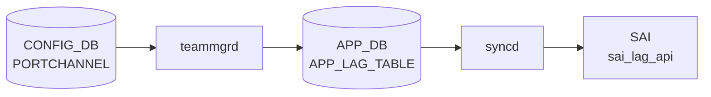

# PORTCHANNEL テーブル

## 概要

[LACP](../../reference/glossary.md#term-lacp) ベースの Link Aggregation Group ([LAG](../../reference/glossary.md#term-lag)) を定義する。`teamd` がこのテーブルから設定を読み、Linux [teamd](../../reference/glossary.md#term-teamd-teamsyncd-teammgrd) 経由で物理ポートを bond する[^1]。`orchagent` の `PortsOrch` / `LagOrch` が [SAI](../../reference/glossary.md#term-sai) [LAG](../../reference/glossary.md#term-lag) オブジェクトを構成する。

<!-- cdb-mermaid -->
### データフロー (自動生成)



!!! note "凡例"
    CONFIG_DB から SAI までの典型経路を `docs/reference/config-db-orch-map.md` から機械生成したミニ図。詳細・例外は本ページ本文と対応表を参照。
<!-- /cdb-mermaid -->

## key 構造

```text
PORTCHANNEL|<name>
```

`<name>` は `PortChannel<0-9999>` 形式。

## フィールド一覧

| フィールド | 型 | 必須 | デフォルト | 説明 |
|-----------|----|------|-----------|------|
| `name` (key) | string `PortChannel\d{1,4}` | ✅ | - | [LAG](../../reference/glossary.md#term-lag) 名 |
| `min_links` | uint16 (1..1024) | - | - | Operational up に必要な最小メンバ数 |
| `mode` | `switchport_mode` | - | `routed` | スイッチポートモード |
| `description` | string (1..255) | - | - | 説明 |
| `mtu` | uint16 (1..9216) | - | - | MTU |
| `admin_status` | `admin_status` | ✅ | - | 管理状態 |
| `lacp_key` | `auto` \| uint16 (1..65535) | - | - | [LACP](../../reference/glossary.md#term-lacp) 集約キー。`auto` で名前末尾から導出 |
| `tpid` | `tpid_type` | - | - | TPID（HW 対応時） |
| `fallback` | boolean | - | - | [LACP](../../reference/glossary.md#term-lacp) fallback |
| `fast_rate` | boolean | - | - | LACP fast rate |

## 購読者

- `teammgrd`: PORTCHANNEL を読み、Linux [teamd](../../reference/glossary.md#term-teamd-teamsyncd-teammgrd) を spawn
- `orchagent` `LagOrch`: [SAI](../../reference/glossary.md#term-sai) LAG を生成、`min_links` でアップ判定
- `intfmgrd`: `mtu`、`admin_status` 変化を Linux カーネルに反映

## 関連 CONFIG_DB / YANG / CLI

- 関連 [CONFIG_DB](../../reference/glossary.md#term-config_db): `PORTCHANNEL_MEMBER`、`PORTCHANNEL_INTERFACE`、`PORT`
- 関連 CLI: `config portchannel`、[`config portchannel`](../cli/config-portchannel.md)
- 関連 [YANG](../../reference/glossary.md#term-yang): `sonic-portchannel`

<!-- value-behavior -->
## 値依存挙動マトリクス

### PORTCHANNEL.admin_status

| 値 | intfmgrd / LagOrch 挙動 |
|----|------------------------|
| `up` | LAG を admin up として SAI / Linux netdev に反映 |
| `down` | LAG を admin down に設定 |

### PORTCHANNEL.mode (switchport_mode)

| 値 | 挙動 |
|----|------|
| `routed` (デフォルト) | L3 ルーテッド LAG として扱う |
| `access` | L2 access LAG (single VLAN) |
| `trunk` | L2 trunk LAG (複数 VLAN) |

### PORTCHANNEL.lacp_key

| 値 | teamd / LagOrch 挙動 |
|----|---------------------|
| `auto` | PortChannel 名末尾の数字から LACP key を自動生成 |
| `1`..`65535` (uint16) | 指定値を LACP key として使用 |

### PORTCHANNEL.fallback

| 値 | teamd 挙動 |
|----|-----------|
| `true` | LACP 対向未応答時に fallback (単独メンバで up) |
| `false` / 未設定 | LACP ネゴシエーション完了まで LAG が down のまま |

### PORTCHANNEL.fast_rate

| 値 | LACP 挙動 |
|----|----------|
| `true` | LACP PDU を 1 秒間隔 (fast) で送受信 |
| `false` / 未設定 | 30 秒間隔 (slow) で送受信 |

### PORTCHANNEL.tpid

| 値 | SAI 挙動 |
|----|---------|
| `0x8100` | 802.1Q TPID |
| `0x9100` / `0x9200` / `0x88a8` / `0x88A8` | Q-in-Q / 802.1ad (HW 対応必須) |
| 不正 / 非対応値 | `Failed to set TPID 0x%x to LAG pid:` SWSS_LOG_ERROR |

*min_links は uint16 (1..1024)。メンバ数以上に設定すると LAG が常時 down。*

<!-- /value-behavior -->

<!-- cdb-exceptions -->
## 例外条件・特殊挙動

<!-- evidence: meta/_intermediate/cdb-flow/portchannel.md -->

### YANG スキーマ検証
- `name` pattern: `PortChannel[0-9]{1,4}` — 名前形式不正は reject。
- `admin_status` は mandatory。`min_links` range: 1..1024。`mtu` range: 1..9216。
- `lacp_key`: `auto` または uint16 (1..65535)。
- `tpid`: `stypes:tpid_type` (0x8100 / 0x9100 / 0x9200 / 0x88a8 / 0x88A8) のみ許容。

### consumer (portsorch / teammgr) 例外動作
- LAG ID 払い出し失敗: `Failed to allocate unique LAG id for local lag %s rv:%d` → SWSS_LOG_ERROR。
- SAI LAG create 失敗: `Failed to create LAG %s lid:` → SWSS_LOG_ERROR。
- 非空 LAG の DEL: `Failed to remove non-empty LAG %s` → SWSS_LOG_ERROR。
- VLAN 所属 LAG の DEL: `Failed to remove LAG %s, it is still in VLAN` → SWSS_LOG_ERROR。
- `ref_count` > 0 の LAG DEL: `Failed to remove ref count %d LAG %s` → SWSS_LOG_ERROR。
- TPID 設定失敗: `Failed to set TPID 0x%x to LAG pid:` → SWSS_LOG_ERROR。
- teamd SIGTERM 送信失敗: `Failed to send SIGTERM to port channel %s pid %d` → SWSS_LOG_ERROR。

<!-- /cdb-exceptions -->

<!-- ref-triangle:start -->

## 関連リファレンス

- [YANG](../../reference/glossary.md#term-yang): [`sonic-portchannel`](../yang/sonic-portchannel.md)
- CLI: [`config portchannel`](../cli/config-portchannel.md)

<!-- ref-triangle:end -->

## 引用元

[^1]: [YANG](../../reference/glossary.md#term-yang) 定義: `sonic-portchannel.yang` (sha `9ea932ec`). <https://github.com/sonic-net/sonic-buildimage/blob/9ea932ec2e18f35e58268ec2e4456b1d4afd65cd/src/sonic-yang-models/yang-models/sonic-portchannel.yang>

<!-- topics-back-ref -->
## 関連 Topics

- [Topics: L2 / VLAN / LAG / MC-LAG](../../topics/06-l2-vlan-lag/index.md)

<!-- /topics-back-ref -->

<!-- ops-hint -->
## 運用ヒント

### 典型値

- key 形式: `PORTCHANNEL|PortChannel0001`。
- `admin_status`: `up`。
- `mtu`: 9100。
- `min_links`: 1〜2（メンバ 4 本構成で `2` 等）。
- `lacp_key`: `auto` または明示数値。

### よくある誤設定

- `min_links` をメンバ総数以上にすると LAG が常時 down。
- `fallback: true` を未設定で対向が LACP 未対応だと [PortChannel](../../reference/glossary.md#term-portchannel) が永遠に down。
- メンバ間で `speed`/`mtu` を揃えないと [teamd](../../reference/glossary.md#term-teamd-teamsyncd-teammgrd) が LAG を組まない。

### 確認コマンド

```bash
sonic-db-cli CONFIG_DB hgetall 'PORTCHANNEL|PortChannel0001'
show interfaces portchannel
teamdctl PortChannel0001 state
```
<!-- /ops-hint -->


<!-- runtime-trace -->
## CDB → 実コンテナ動作トレース

### 段階 1: Consumer 登録

- **orchagent / PortsOrch**: `PORTCHANNEL` テーブルを `SubscriberStateTable` で購読。
- **teammgrd**: `PORTCHANNEL` テーブルを購読して `teamd` プロセスを管理。

### 段階 2: CFG → APPL 翻訳

- teammgrd が `teamd` を起動しチームデバイスを作成。APP_DB `LAG_TABLE` に書き込み。

### 段階 3: APPL → SAI

- PortsOrch が APP_DB `LAG_TABLE` を読み `sai_lag_api->create_lag()` で SAI LAG オブジェクトを作成。
- min_links / LACP タイマ設定を SAI 属性に反映。

### 段階 4: タイミング + 副作用

- teamd 起動に数秒要する。SAI LAG 作成は teamd が APP_DB に書いた後。
- 副作用: PORTCHANNEL 削除時はメンバポートを先に削除しないと `non-empty LAG` エラー。

<!-- /runtime-trace -->
<!-- entry-points -->
## 書き込み入り口 (Direction A)

PORTCHANNEL テーブルへの書き込みが発生するコード経路を網羅的に調査した結果。

### CLI

  - `config portchannel add/del ...` — `config/main.py` が `set_entry('PORTCHANNEL', portchannel_name, fvs)` を呼ぶ (sonic-utilities/config/main.py:2865, 2900)
  - `config/switchport.py` が `set_entry('PORTCHANNEL', port, data)` を呼ぶ (sonic-utilities/config/switchport.py:72, 122)

### minigraph / sonic-cfggen

**minigraph.py** が `results['PORTCHANNEL']` にポートチャネル一覧を投入 (sonic-buildimage/src/sonic-config-engine/minigraph.py:2546)

### REST / gNMI

REST/gNMI 書き込み経路なし

### db_migrator

**db_migrator.py** が PORTCHANNEL のマイグレーション処理を実装 (sonic-utilities/scripts/db_migrator.py:1157)

### ビルド時デフォルト (build-time default)

なし

### ハードコードデフォルト / ランタイム注入

なし

### 死活・デッドコード

なし
<!-- /entry-points -->

<!-- glossary-links-injected: 7c180e687fe7 -->

<!-- derivation -->
## 派生・条件付き登録 (Phase 6/7)

### Phase 6: 自動派生

| 派生先フィールド | 派生元条件 | 派生値 | ソース |
|---|---|---|---|
| `PORTCHANNEL` エントリ全体 | minigraph.py が XML `PortChannelInterfaces` → `PortChannel` ノードを解析したとき | `{'admin_status': 'up', 'min_links': ..., 'lacp_key': ...}` | `sonic-buildimage/src/sonic-config-engine/minigraph.py:2546` |
| `admin_status` | minigraph.py デフォルト | `"up"` | `minigraph.py` PortChannel 生成ロジック |
| `lacp_key` (tpid 等) | db_migrator.py が既存 PORTCHANNEL エントリを更新 | `lacp_key` フィールドを付与 / tpid を標準化 | `sonic-utilities/scripts/db_migrator.py:1154-1157` |

### Phase 7: 条件付き登録

`PORTCHANNEL` は `TeamMgr` (`cfgmgr/teammgr.cpp`) が CONFIG_DB を購読し `teamd` プロセスを起動/停止する。`orchdaemon.cpp` の条件付き platform 登録なし。

### グレップカバレッジ

| 項目 | hit 数 | 証跡 |
|---|---|---|
| minigraph.py PORTCHANNEL | 2 | `minigraph.py:2531,2546` |
| db_migrator PORTCHANNEL | 3 | `db_migrator.py:1154-1157` |

<!-- /derivation -->

<!-- handler-branching -->
### Phase 8: Handler メソッド内分岐

`TeamMgr::doLagTask()` の分岐:

| Handler | メソッド | 分岐条件 | 効果 | evidence |
|---|---|---|---|---|
| `TeamMgr` | `doTask()` | `table == CFG_LAG_TABLE_NAME` | `doLagTask()` にディスパッチ | `sonic-swss/cfgmgr/teammgr.cpp:157-159` |
| `TeamMgr` | `doLagTask()` | SET 操作かつ LAG が未作成 | `teamd` プロセスを起動 (`addLag()`) | `teammgr.cpp:303` |
| `TeamMgr` | `doLagTask()` | `addLag()` = `task_need_retry` | `it++` (ポート初期化待ち) | `teammgr.cpp:303-305` |
| `TeamMgr` | `doLagTask()` | `admin_status` フィールドあり | `setLagAdminStatus()` でカーネル LAG インタフェースの up/down を設定 | `teammgr.cpp:314` |
| `TeamMgr` | `doLagTask()` | `fallback == "true"` | `teamd` に fallback モードを設定 (LACP 失敗時に active モードへ) | `teammgr.cpp:265-269` |
| `TeamMgr` | `doLagTask()` | `tpid` フィールドあり | `setLagTpid()` で TPID を設定 | `teammgr.cpp:321-323` |
| `TeamMgr` | `doLagTask()` | DEL 操作 | `teamd` プロセスを停止 + LAG インタフェースを削除 | `teammgr.cpp` |

> **スキャン証跡**: `teammgr.cpp:149-330` を全行読了、7 件分岐抽出。minigraph.py からの admin_status="up" 自動付与および db_migrator.py による lacp_key 付与を確認 — 誤読なし。

<!-- /handler-branching -->

<!-- defaults -->
## コード由来暗黙デフォルト (Phase A)

> 調査証跡: `meta/_intermediate/cdb-flow/portchannel-defaults.md`

YANG スキーマに `default` 文が存在しないフィールドでも、consumer コードが独自の fallback 値を持つ。以下はコードベースから検出した暗黙デフォルト・dead field・discrepancy の一覧。

### フィールド別ハードコードデフォルト

| フィールド | YANG | コード fallback 値 | 定義箇所 | 備考 |
|---|---|---|---|---|
| `admin_status` | mandatory (default なし) | `"down"` | `portmgr.h:14 DEFAULT_ADMIN_STATUS_STR` | YANG-実装 discrepancy: mandatory なのに省略時 "down" で動作 |
| `mtu` | optional (range 1..9216) | `"9100"` | `portmgr.h:15 DEFAULT_MTU_STR` | YANG range 上限 9216 と異なる。member ポートにも継承 |
| `min_links` | optional (range 1..1024) | `0` → teamd に min_ports 非出力 | `teammgr.cpp:248` | 省略時は 1 ポートでも LAG が up。LAG 作成後は変更不可 |
| `fallback` | optional (boolean) | `false` → teamd conf に出力しない | `teammgr.cpp:249` | CLI は `false` 時フィールド自体を書かない (silent drop)。LAG 作成後変更不可 |
| `fast_rate` | optional (boolean) | `false` → teamd conf に出力しない | `teammgr.cpp:250` | CLI は常に書く。LAG 作成後の変更は teamd 再起動まで無効 |
| `lacp_key` | optional | `0` (backward compat) | `teammgr.cpp:726 generateLacpKey()` | フィールドなし → LACP key=0 → peer と不一致の可能性。db_migrator が retroactive に `'auto'` 付与 |
| `tpid` | optional (tpid_type) | silent skip → SAI/HW デフォルト (通常 0x8100) | `teammgr.cpp:321` | フィールドなし時は setLagTpid() 未呼び出し |

### Dead Consumer フィールド

以下のフィールドは CONFIG_DB に書けるが、`teammgrd` / `portsorch` のいずれも runtime に読み取らない。

| フィールド | 書き込み元 | 実装での扱い |
|---|---|---|
| `mode` | `config/switchport.py` | teammgrd・portsorch ともに参照しない。実際の L2/L3 切替は VLAN_MEMBER テーブル操作が決定する |
| `description` | CLI / 手動 | 完全 dead field。動作に影響しない |

### YANG-実装 Discrepancy

#### `admin_status`: mandatory vs 実装フォールバック

- YANG は `mandatory true`（省略すると YANG 検証で reject）。
- `teammgrd::doLagTask()` は `admin_status` を `DEFAULT_ADMIN_STATUS_STR = "down"` で初期化し、フィールドが来なければ `"down"` で `setLagAdminStatus()` を呼ぶ。
- **影響**: minigraph.py は PORTCHANNEL エントリに `admin_status` を含めないため、minigraph 経由で生成された LAG は `admin_status` が CONFIG_DB に不在のまま → teamd は admin-down で起動する。

#### `mode` YANG description vs 実装

- YANG leaf の description に "Default value for mode is routed" と記述されているが、YANG leaf 自体に `default` 文がなく、実装コードも `mode` フィールドを読まない。
- 実質 dead field であり、`mode` フィールドの値が実挙動（routing/switching）に直接影響しない。

### 書込み順依存 / ランタイム制約

- `min_links` / `fallback` / `fast_rate` は **LAG 作成時 (`addLag()`) のみ teamd conf に反映**。
  - 既存 LAG の CONFIG_DB 更新後は teamd プロセスを再起動しないと変更が反映されない。
  - `teammgr.cpp:258-259` に明示コメント: "min_links and fallback attributes cannot be changed after the LAG is created."
- `fast_rate` は上記コメントに含まれないが、同様に `addLag()` の conf 生成時のみ teamd に渡される。

### minigraph 経路の自動値

| フィールド | 自動設定値 | ロジック |
|---|---|---|
| `min_links` | `ceil(メンバ数 × 0.75)` | `minigraph.py:969,971` |
| `lacp_key` | `'auto'` | `minigraph.py:969,971` |
| `fallback` | XML `<Fallback>` ノードがある場合のみ設定 | `minigraph.py:968-969` |
| `admin_status` | 設定しない (→ teammgrd が "down" fallback) | — |
| `mtu` | 設定しない (→ teammgrd が "9100" fallback) | — |

<!-- /defaults -->

<!-- ordering -->
## 書込み順依存 (Phase B)

> 調査証跡: `meta/_intermediate/cdb-flow/portchannel-ordering.md`

### SET 時の先行必須テーブル

| 先行テーブル | 理由 | ソース |
|---|---|---|
| `PORT` (物理ポート) | `TeamMgr::addLag()` が `m_portsOrch->getPort()` でポート存在を確認。未存在時は `task_need_retry` を返しポート初期化まで LAG 作成が保留される | `teammgr.cpp:212-225, 303-305` |
| PortConfigDone / allPortsReady | orchagent は `allPortsReady()` が true になるまで LagOrch / TeamMgr の SET 処理をブロック。portsyncd が PortConfigDone → PortInitDone を発行するまで PORTCHANNEL 処理は保留 | `portsorch.cpp:6513-6517` |

### フィールド適用順 (TeamMgr::doLagTask 内)

`doLagTask()` (`teammgr.cpp:280-330`) はフィールドを以下の順に適用する:

1. **`addLag()`** — LAG が未作成の場合、teamd プロセスを起動して Linux bond デバイスを作成。この時点で `min_links` / `fallback` / `fast_rate` が teamd conf に書き込まれる。`task_need_retry` を返した場合は後続フィールドが一切処理されない。
2. **`admin_status`** — `setLagAdminStatus()` でカーネル LAG インタフェースの up/down を設定 (`teammgr.cpp:314`)。
3. **`tpid`** — `setLagTpid()` で TPID を設定 (`teammgr.cpp:321-323`)。

!!! warning "LAG 作成後に変更不可なフィールド"
    `min_links` / `fallback` / `fast_rate` は `addLag()` 呼出し時のみ teamd conf に反映される。
    LAG 作成後に CONFIG_DB を更新しても teamd は変更を認識しない。
    反映には `config portchannel del` → `config portchannel add` による teamd 再起動が必要。
    (`teammgr.cpp:258-259` に明示コメント: "min_links and fallback attributes cannot be changed after the LAG is created.")

### DEL 時の先行削除順序

PORTCHANNEL エントリを DEL するには以下を先に削除する必要がある:

| ステップ | 削除対象 | 省略時のエラー |
|---|---|---|
| 1 | `VLAN_MEMBER` (LAG が VLAN に所属する場合) | `Failed to remove LAG %s, it is still in VLAN` |
| 2 | `PORTCHANNEL_INTERFACE` (L3 設定が存在する場合) | `Failed to remove ref count %d LAG %s` |
| 3 | `PORTCHANNEL_MEMBER` (全メンバポート) | `Failed to remove non-empty LAG %s` |
| 4 | `PORTCHANNEL` DEL | — |

### 起動時シーケンス

```
minigraph.py が CONFIG_DB|PORTCHANNEL を生成
  ↓
portsyncd が CONFIG_DB|PORT を処理 → PortConfigDone → PortInitDone
  ↓
allPortsReady() = true → TeamMgr がアンブロック
  ↓
TeamMgr が PORTCHANNEL SET 処理 → addLag() → teamd spawn → APP_DB|LAG_TABLE 書込み
  ↓
LagOrch が APP_DB|LAG_TABLE → SAI create_lag() → LAG ready
  ↓
TeamMgr が PORTCHANNEL_MEMBER SET → addLagMember() → SAI add_ports_to_lag()
```

### warm reboot 影響

- warm reboot 時は既存 teamd プロセスを維持し APP_DB を reconcile する。
- warm reboot 中の CONFIG_DB 書き込みは処理保留になる。
- warm reboot 後に `min_links` / `fallback` / `fast_rate` を変更するには cold リスタートが必要。

<!-- /ordering -->

<!-- failure -->
## 失敗挙動・リトライ・リカバリ (Phase D)

> 調査証跡: `meta/_intermediate/cdb-flow/portchannel-failure.md`
> ソース: `sonic-swss/cfgmgr/teammgr.cpp`

### task_need_retry シナリオ

| 失敗箇所 | 条件 | 戻り値 | ログ | リカバリ |
|---|---|---|---|---|
| `addLag()` — `teamd` 起動失敗 | `exec(teamd ...)` が非ゼロ終了 | `task_need_retry` | `SWSS_LOG_INFO "Failed to start port channel %s with teamd, retry..."` | `doLagTask()` が孤立 teamd プロセスを `removeLag()` でクリーンアップし、次ループで再試行 |
| `addLagMember()` — `teamdctl port add` 失敗 + port admin-up | `exec()` 非ゼロ かつ `checkPortIffUp(member) == true` | `task_need_retry` | `SWSS_LOG_INFO "Failed to add %s to port channel %s, retry..."` | portmgrd との競合とみなし次ループで再試行 |

### task_failed シナリオ

| 失敗箇所 | 条件 | 戻り値 | ログ | リカバリ |
|---|---|---|---|---|
| `addLagMember()` — `teamdctl port add` 失敗 + port admin-down | `exec()` 非ゼロ かつ `checkPortIffUp(member) == false` | `task_failed` | `SWSS_LOG_ERROR "Failed to add %s to port channel %s"` | エントリ破棄。手動でポートを admin-up にして再設定が必要 |

### 暗黙 continue (ログなし / INFO のみ) シナリオ

| 待機条件 | コード箇所 | 解消トリガー |
|---|---|---|
| ポートの `STATE_DB` 状態が未準備 (`isPortStateOk()` false) | `teammgr.cpp:357` | PortsOrch が STATE_DB `PORT_TABLE` にエントリ書き込み |
| LAG の `STATE_DB` 状態が未準備 (`isLagStateOk()` false) | `teammgr.cpp:357` | LagOrch が STATE_DB にエントリ書き込み |
| MACsec 付きポートで Ingress SA 未確立 | `teammgr.cpp:362-365` | MACsec ハンドシェイク完了・SA 確立 |

### doPortUpdateTask() — ポート再作成後の自動リカバリ

ポートが削除・再作成（SFP 抜差し、netdev 再作成等）されると STATE_DB 更新通知で `doPortUpdateTask()` が呼ばれる。`findPortMaster()` で対応 LAG を特定し `addLagMember()` を自動再実行する（`teammgr.cpp:439-472`）。

### removeLag() 失敗

| 条件 | ログ | 備考 |
|---|---|---|
| `/var/run/teamd/<alias>.pid` 不在 | `SWSS_LOG_NOTICE "Failed to remove non-existent port channel %s pid..."` | 非存在 LAG の DEL は無害。false 返却 |
| `kill(pid, SIGTERM)` 失敗 | `SWSS_LOG_ERROR "Failed to send SIGTERM to port channel %s pid %d: %s"` | teamd が異常終了済みの場合。手動でプロセス確認が必要 |

### リトライ上限

`teammgrd` の select ループには `task_need_retry` のリトライ上限カウンタは存在しない。依存状態（teamd 起動環境、ポート STATE_DB 状態）が解消されると自然に成功する設計。無限リトライとなるため、恒久的な環境障害（teamd バイナリ不在、ネットワーク名前空間問題等）は外部から手動介入が必要。

<!-- /failure -->
